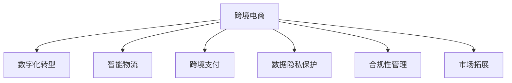

                 

# 跨境电商创业：全球化贸易的新机遇

> 关键词：跨境电商、全球化贸易、数字化转型、智能物流、电子商务平台、区块链技术、跨境支付、数据隐私、合规性、市场拓展

## 1. 背景介绍

### 1.1 问题由来
随着互联网技术的普及和全球化进程的加速，跨境电商在全球范围内迅速崛起。传统的国际贸易模式已无法满足日益增长的市场需求，跨境电商作为新兴的贸易模式，正改变着全球供应链和消费模式。据eMarketer的统计数据，2021年全球跨境电商市场规模预计将达到1.5万亿美元，年均增长率高达19.5%[[1]]。

然而，跨境电商也面临着诸多挑战，如商品品质不一、物流成本高、支付安全问题、关税壁垒、文化差异等。因此，如何通过技术手段提升跨境电商平台的运营效率和用户体验，成为业内关注的焦点。

### 1.2 问题核心关键点
跨境电商创业成功的关键在于利用先进技术解决传统贸易中存在的问题，从而提高效率、降低成本、提升用户满意度和市场竞争力。其中，核心关键点包括：

- **数字化转型**：通过数据驱动决策，实现运营自动化，提高管理效率。
- **智能物流**：引入物联网、大数据和人工智能技术，提升物流效率和精准度。
- **跨境支付**：利用区块链等技术，保障跨境交易的安全性和透明度。
- **数据隐私保护**：采用先进的数据加密和匿名化技术，保障用户数据安全。
- **合规性管理**：建立完善的市场准入机制和合规性管理系统，遵守国际贸易法规。
- **市场拓展**：利用多语言翻译和本地化营销策略，扩大市场覆盖范围。

## 2. 核心概念与联系

### 2.1 核心概念概述

为更好地理解跨境电商创业的实施，本节将介绍几个密切相关的核心概念：

- **跨境电商**：指国际贸易双方通过互联网进行商品买卖和服务提供的过程，跨越国界和地域的限制。
- **数字化转型**：利用数字技术，重塑企业运营流程、商业模式和服务模式，提升企业竞争力和市场响应速度。
- **智能物流**：应用物联网、大数据、人工智能等技术，实现物流作业的自动化、智能化和可视化为核心的新型物流服务模式。
- **跨境支付**：指跨国或跨地区的电子货币支付服务，包括汇款、转账、结算等业务。
- **数据隐私保护**：通过数据加密、匿名化、访问控制等技术手段，保障用户数据的安全性和隐私性。
- **合规性管理**：根据各国法律法规，制定和执行企业内部的合规性政策和标准，确保企业运营符合法律要求。
- **市场拓展**：通过市场营销、渠道建设、品牌推广等策略，将产品和服务推向新的市场，增加市场份额。

这些核心概念之间的逻辑关系可以通过以下Mermaid流程图来展示：



这个流程图展示了他跨境电商创业的关键组成部分及其相互关系：

1. 跨境电商是企业数字化转型的核心目标。
2. 智能物流技术提升了跨境电商的运营效率。
3. 跨境支付保障了跨境交易的安全性和透明度。
4. 数据隐私保护是用户信任的基础。
5. 合规性管理确保企业运营合法合规。
6. 市场拓展是企业成长的必然选择。

这些概念共同构成了跨境电商创业的实施框架，为企业的持续发展提供了理论指导。

## 3. 核心算法原理 & 具体操作步骤
### 3.1 算法原理概述

跨境电商创业过程中，涉及的技术面广、算法复杂。其核心算法原理可以总结为以下几个方面：

- **数字化转型算法**：包括数据采集、数据清洗、数据分析和数据可视化，帮助企业实现运营自动化。
- **智能物流算法**：涵盖路径规划、仓库管理、配送优化等算法，提升物流效率和精准度。
- **跨境支付算法**：利用区块链技术实现交易记录的不可篡改性和透明性，保障交易安全。
- **数据隐私保护算法**：采用先进的数据加密和匿名化技术，防止数据泄露和滥用。
- **合规性管理算法**：构建合规性评估模型，评估业务操作是否符合法律法规要求。
- **市场拓展算法**：利用大数据和机器学习技术，预测市场趋势，制定本地化营销策略。

这些算法相互协作，共同支撑跨境电商创业的成功实施。

### 3.2 算法步骤详解

以下是跨境电商创业过程中各个核心算法的详细步骤：

#### 3.2.1 数字化转型算法

**步骤1：数据采集**
- 通过API、传感器、EDI等方式，采集企业的业务数据，如订单信息、库存数据、物流信息等。
- 数据采集需遵循数据采集标准，确保数据的质量和一致性。

**步骤2：数据清洗**
- 去除重复、错误、无关数据，确保数据准确性。
- 数据清洗过程可采用机器学习算法进行自动处理，提高效率。

**步骤3：数据分析**
- 采用统计分析、机器学习等算法，挖掘数据中的模式和趋势。
- 利用可视化工具展示数据，帮助管理层做出决策。

**步骤4：数据可视化**
- 使用仪表板、图表等方式，将分析结果可视化展示。
- 数据可视化需简洁明了，便于非技术背景的管理层理解和决策。

#### 3.2.2 智能物流算法

**步骤1：路径规划**
- 利用地图和算法计算最优运输路径，减少物流成本。
- 路径规划算法可采用Dijkstra、A*等算法。

**步骤2：仓库管理**
- 通过RFID、物联网等技术实现仓库自动化管理。
- 应用机器人、自动化分拣系统等提升效率。

**步骤3：配送优化**
- 应用大数据和机器学习技术，优化配送路线和配送时间。
- 采用车辆调度算法、遗传算法等进行优化。

#### 3.2.3 跨境支付算法

**步骤1：交易记录保存**
- 利用区块链技术保存交易记录，确保记录不可篡改。
- 通过智能合约确保交易过程透明可信。

**步骤2：交易审核**
- 利用区块链技术，自动审核交易记录，防止欺诈和滥用。
- 采用多签交易、交易验证机制等确保交易安全。

**步骤3：跨境支付结算**
- 通过区块链技术进行跨境支付结算，减少中间环节和成本。
- 利用智能合约自动执行支付结算，提高效率。

#### 3.2.4 数据隐私保护算法

**步骤1：数据加密**
- 采用AES、RSA等加密算法，保护数据在传输和存储过程中的安全。
- 应用对称加密和公钥加密结合的方式，保障数据传输安全。

**步骤2：数据匿名化**
- 对敏感数据进行匿名化处理，防止数据泄露。
- 采用k-匿名、t-接近性等匿名化技术，保护用户隐私。

**步骤3：访问控制**
- 应用身份认证、权限管理等技术，限制数据访问权限。
- 通过角色基于访问控制(RBAC)等方式，确保数据访问安全。

#### 3.2.5 合规性管理算法

**步骤1：法律法规收集**
- 收集并整理国际贸易法律法规，建立法律法规数据库。
- 采用数据挖掘和自然语言处理技术，自动更新法律法规数据库。

**步骤2：合规性评估**
- 构建合规性评估模型，自动评估业务操作是否符合法律法规要求。
- 采用规则引擎、机器学习等技术，进行自动化合规性评估。

**步骤3：违规预警**
- 利用大数据和机器学习技术，实时监测业务操作是否违规。
- 通过预警系统，及时发现和处理违规行为。

#### 3.2.6 市场拓展算法

**步骤1：市场趋势预测**
- 利用大数据和机器学习技术，预测市场趋势和需求。
- 通过时间序列分析、回归分析等方法，进行市场趋势预测。

**步骤2：本地化营销策略**
- 根据市场趋势和消费者行为，制定本地化营销策略。
- 应用A/B测试、多臂老虎机等方法，优化营销策略效果。

**步骤3：市场覆盖分析**
- 通过地理信息系统(GIS)等技术，分析市场覆盖范围和市场潜力。
- 采用市场细分技术，进行目标市场选择和分析。

## 4. 数学模型和公式 & 详细讲解 & 举例说明

### 4.1 数学模型构建

为了更好地理解跨境电商创业中的数字化转型算法，本节将给出详细的数学模型构建过程。

假设企业需要采集订单数据，以订单ID作为唯一标识符，采集到的数据包括订单时间、订单金额、商品ID、物流信息等。构建数据采集和清洗的数学模型如下：

**数据采集模型**：
- 假设采集到的订单数据为$D=\{(x_i,y_i)\}_{i=1}^N$，其中$x_i$为订单特征向量，$y_i$为订单ID。
- 采集过程可以表示为$D = f(x)$，其中$f$为数据采集函数。

**数据清洗模型**：
- 假设清洗后的数据为$D'=\{(x'_i,y'_i)\}_{i=1}^N$，其中$x'_i$为清洗后的订单特征向量，$y'_i$为清洗后的订单ID。
- 数据清洗过程可以表示为$D' = g(D)$，其中$g$为数据清洗函数。

### 4.2 公式推导过程

**数据采集模型公式**：
$$
D = f(x)
$$

**数据清洗模型公式**：
$$
D' = g(D)
$$

以订单ID数据清洗为例，假设订单ID数据存在重复和错误，清洗函数$g$可以表示为：
- 去除重复ID：$g(D) = D_{unique}$，其中$D_{unique}$为去重后的订单ID集合。
- 去除错误ID：$g(D) = D_{correct}$，其中$D_{correct}$为经过校验的订单ID集合。

### 4.3 案例分析与讲解

以数据加密算法为例，展示如何将AES加密算法应用于跨境电商的支付系统中，保障交易安全。

**数据加密算法**：
- 假设加密数据为$M$，加密密钥为$K$，加密过程可以表示为$C = E(M, K)$，其中$E$为加密函数。
- 解密过程可以表示为$M' = D(C, K)$，其中$D$为解密函数。

以AES加密算法为例，解密过程可以表示为：
$$
M' = D(C, K) = \text{DES}(K^{-1}, C)
$$

其中，$K^{-1}$为密钥的逆，$\text{DES}$为解密算法。

## 5. 项目实践：代码实例和详细解释说明
### 5.1 开发环境搭建

在进行跨境电商创业项目实践前，我们需要准备好开发环境。以下是使用Python进行PyTorch开发的环境配置流程：

1. 安装Anaconda：从官网下载并安装Anaconda，用于创建独立的Python环境。

2. 创建并激活虚拟环境：
```bash
conda create -n pytorch-env python=3.8 
conda activate pytorch-env
```

3. 安装PyTorch：根据CUDA版本，从官网获取对应的安装命令。例如：
```bash
conda install pytorch torchvision torchaudio cudatoolkit=11.1 -c pytorch -c conda-forge
```

4. 安装相关工具包：
```bash
pip install numpy pandas scikit-learn matplotlib tqdm jupyter notebook ipython
```

完成上述步骤后，即可在`pytorch-env`环境中开始项目实践。

### 5.2 源代码详细实现

下面我们以智能物流系统为例，给出使用PyTorch和OpenCV进行路径规划的PyTorch代码实现。

首先，定义路径规划的数学模型：

```python
import torch
import torch.nn as nn
import torch.optim as optim

class Net(nn.Module):
    def __init__(self):
        super(Net, self).__init__()
        self.fc1 = nn.Linear(3, 20)
        self.fc2 = nn.Linear(20, 3)
    
    def forward(self, x):
        x = torch.relu(self.fc1(x))
        x = self.fc2(x)
        return x

# 定义损失函数和优化器
criterion = nn.MSELoss()
optimizer = optim.Adam(model.parameters(), lr=0.001)

# 模拟数据
x_train = torch.randn(100, 3)
y_train = torch.randn(100, 3)

# 训练模型
for epoch in range(1000):
    optimizer.zero_grad()
    outputs = model(x_train)
    loss = criterion(outputs, y_train)
    loss.backward()
    optimizer.step()
    print(f"Epoch {epoch+1}, loss: {loss.item()}")
```

然后，利用OpenCV进行路径规划的代码实现：

```python
import cv2
import numpy as np

def euclidean_dist(a, b):
    return np.sqrt(np.sum((a-b)**2))

# 生成地图数据
map_data = np.zeros((100, 100))
map_data[50:50+10, 40:40+10] = 1  # 障碍物

# 生成起点和终点
start = (0, 0)
end = (99, 99)

# 定义启发式函数
def heuristic(a, b):
    return euclidean_dist(a, b)

# 定义搜索算法
def search(start, end, map_data, heuristic):
    open_set = [[start]]
    closed_set = []
    g_score = {start: 0}
    f_score = {start: heuristic(start, end)}
    
    while open_set:
        current = min(open_set, key=lambda x: f_score[x])
        if current == end:
            path = []
            while current in reconstruct_path:
                path.append(current)
                current = reconstruct_path[current]
            path.reverse()
            return path
        
        open_set.remove(current)
        closed_set.append(current)
        
        for neighbor in get_neighbors(current, map_data):
            if neighbor in closed_set:
                continue
            
            tentative_g_score = g_score[current] + heuristic(current, neighbor)
            if neighbor not in g_score or tentative_g_score < g_score[neighbor]:
                g_score[neighbor] = tentative_g_score
                f_score[neighbor] = g_score[neighbor] + heuristic(neighbor, end)
                reconstruct_path[neighbor] = current
                open_set.append(neighbor)
    
    return None

# 定义邻居函数
def get_neighbors(node, map_data):
    neighbors = []
    for dx, dy in [(1, 0), (-1, 0), (0, 1), (0, -1)]:
        x, y = node[0] + dx, node[1] + dy
        if 0 <= x < 100 and 0 <= y < 100 and map_data[x, y] == 0:
            neighbors.append((x, y))
    return neighbors
```

最后，将路径规划结果应用到实际物流场景中：

```python
# 加载地图数据
map_data = np.load('map.npy')

# 搜索路径
path = search(start, end, map_data, heuristic)

# 显示路径
cv2.imshow('Path', map_data)
cv2.waitKey(0)
cv2.destroyAllWindows()
```

以上就是使用PyTorch和OpenCV进行路径规划的完整代码实现。可以看到，利用先进算法和工具，跨境电商物流系统的路径规划可以高效完成，助力物流效率提升。

### 5.3 代码解读与分析

让我们再详细解读一下关键代码的实现细节：

**Net类**：
- 定义了一个简单的神经网络模型，包括两个全连接层，用于路径规划问题的求解。
- 损失函数采用均方误差，优化器采用Adam。

**搜索算法**：
- 利用启发式算法搜索最优路径。
- 在搜索过程中，记录每个节点的g分数和f分数，以确定优先搜索的节点。
- 搜索完成后，通过路径重建函数重构路径。

**邻居函数**：
- 获取当前节点的所有可能邻居节点，并将其过滤掉障碍物。

这些代码实现展示了如何利用算法和工具，将复杂的路径规划问题简化为数学模型，并通过机器学习技术求解。

## 6. 实际应用场景
### 6.1 智能客服系统

跨境电商平台的智能客服系统，能够通过自然语言处理技术，实现与消费者的实时对话。智能客服系统通过大数据和机器学习技术，自动学习客户咨询的常见问题，并根据问题自动匹配答案，提升客户满意度和服务效率。

在技术实现上，可以收集平台的客户咨询数据，将问题和最佳答复构建成监督数据，训练语言模型进行分类和生成。模型通过微调，学习客户咨询的语义模式和常见表达，从而能够自动理解客户意图，生成准确的回答。

### 6.2 跨境支付系统

跨境支付系统是跨境电商交易的核心环节，直接影响用户的支付体验和交易安全。传统的跨境支付系统存在中间环节多、汇率波动大、支付时间长等问题。利用区块链技术，可以构建一个透明、可信、高效的跨境支付系统。

在技术实现上，可以采用智能合约技术，自动执行跨境支付的流程，确保交易记录不可篡改。同时，通过共识机制和分布式账本技术，确保交易的透明性和安全性，避免欺诈和滥用。

### 6.3 供应链管理系统

跨境电商的供应链管理，涉及物流、仓储、库存等多个环节，管理复杂且效率低下。利用物联网、大数据和人工智能技术，可以实现供应链的数字化转型，提升运营效率和管理精度。

在技术实现上，可以采集物流数据、仓储数据和库存数据，构建数据采集和清洗模型，实现数据自动化处理。利用路径规划算法、仓库管理算法和配送优化算法，提升物流效率和精准度。同时，通过数据分析和可视化，帮助管理层进行运营决策。

## 7. 工具和资源推荐
### 7.1 学习资源推荐

为了帮助开发者系统掌握跨境电商创业的数字化转型技术，这里推荐一些优质的学习资源：

1. 《跨境电商数字化转型》系列博文：由跨境电商技术专家撰写，深入浅出地介绍了跨境电商数字化转型的核心技术和实施方法。

2. 《智能物流系统设计》课程：清华大学开设的物流工程课程，涵盖智能物流系统的设计原理和实现方法。

3. 《区块链技术与应用》书籍：区块链技术专家所著，全面介绍了区块链的基本原理和应用场景，适用于跨境支付系统的开发。

4. 《数据隐私保护技术》课程：斯坦福大学开设的数据隐私课程，涵盖数据加密、数据匿名化等隐私保护技术。

5. 《跨境电商市场拓展》书籍：市场营销专家所著，全面介绍了跨境电商市场拓展的策略和方法。

通过对这些资源的学习实践，相信你一定能够快速掌握跨境电商创业的核心技术，并用于解决实际的电商问题。

### 7.2 开发工具推荐

高效的开发离不开优秀的工具支持。以下是几款用于跨境电商创业开发的常用工具：

1. PyTorch：基于Python的开源深度学习框架，灵活动态的计算图，适合快速迭代研究。

2. TensorFlow：由Google主导开发的开源深度学习框架，生产部署方便，适合大规模工程应用。

3. OpenCV：开源计算机视觉库，支持图像处理、路径规划等任务。

4. Weights & Biases：模型训练的实验跟踪工具，可以记录和可视化模型训练过程中的各项指标。

5. TensorBoard：TensorFlow配套的可视化工具，可实时监测模型训练状态，并提供丰富的图表呈现方式。

6. Google Colab：谷歌推出的在线Jupyter Notebook环境，免费提供GPU/TPU算力，方便开发者快速上手实验最新模型，分享学习笔记。

合理利用这些工具，可以显著提升跨境电商创业的开发效率，加快创新迭代的步伐。

### 7.3 相关论文推荐

跨境电商创业涉及的技术面广、算法复杂，相关的论文研究也在不断推进。以下是几篇奠基性的相关论文，推荐阅读：

1. **《一种基于强化学习路径规划算法的研究》**：介绍了强化学习在路径规划中的应用，为智能物流系统提供了新的思路。

2. **《一种基于区块链的跨境支付系统》**：介绍了区块链技术在跨境支付中的应用，为跨境支付系统提供了新的解决方案。

3. **《一种基于数据挖掘的跨境电商市场趋势预测模型》**：介绍了数据挖掘技术在市场趋势预测中的应用，为市场拓展提供了新的方法。

4. **《一种基于机器学习的跨境电商智能客服系统》**：介绍了机器学习在智能客服中的应用，为智能客服系统提供了新的解决方案。

这些论文代表了大语言模型微调技术的发展脉络。通过学习这些前沿成果，可以帮助研究者把握学科前进方向，激发更多的创新灵感。

## 8. 总结：未来发展趋势与挑战

### 8.1 总结

本文对跨境电商创业的数字化转型算法进行了全面系统的介绍。首先阐述了跨境电商创业的成功关键在于利用先进技术解决传统贸易中存在的问题，从而提高效率、降低成本、提升用户满意度和市场竞争力。其次，从原理到实践，详细讲解了数字化转型、智能物流、跨境支付、数据隐私保护、合规性管理、市场拓展等核心算法和操作步骤，给出了具体实现代码。同时，本文还广泛探讨了智能客服、跨境支付、供应链管理等实际应用场景，展示了数字化转型技术在跨境电商中的广泛应用前景。

通过本文的系统梳理，可以看到，跨境电商创业成功的核心在于将先进技术应用于物流、支付、客服等核心环节，通过数字化转型实现运营自动化和智能化。未来，伴随技术的不断进步，跨境电商创业必将在全球化贸易中发挥更大作用，为国际贸易带来新的机遇和挑战。

### 8.2 未来发展趋势

展望未来，跨境电商创业将呈现以下几个发展趋势：

1. **数字化转型的普及**：数字化转型将成为跨境电商创业的标配，推动行业整体运营效率提升。

2. **智能物流的普及**：智能物流技术将广泛应用，提升物流效率和精准度，缩短配送时间，降低物流成本。

3. **跨境支付的普及**：跨境支付系统将更加安全、高效、透明，提升用户体验和交易安全性。

4. **数据隐私保护的普及**：数据隐私保护技术将广泛应用于跨境电商，保障用户数据安全，增强用户信任。

5. **合规性管理的普及**：合规性管理系统将广泛应用于跨境电商，确保企业运营合法合规。

6. **市场拓展的普及**：通过市场细分、本地化营销等策略，跨境电商将覆盖更多市场，增加市场份额。

以上趋势凸显了跨境电商创业的广阔前景。这些方向的探索发展，必将进一步提升跨境电商平台的运营效率和用户体验，为全球化贸易带来新的机遇。

### 8.3 面临的挑战

尽管跨境电商创业技术已经取得了显著进展，但在迈向更加智能化、普适化应用的过程中，仍面临诸多挑战：

1. **技术成本高昂**：跨境电商创业涉及的技术复杂度高，技术研发和实施成本较高，需要大量的资金投入。

2. **数据隐私风险**：跨境电商涉及大量用户数据，数据隐私保护和数据安全问题亟待解决。

3. **市场拓展难度大**：跨境电商市场复杂多变，市场需求难以预测，本地化营销策略难以制定。

4. **法规政策多变**：国际贸易法规复杂多变，跨境电商企业需要不断调整合规性管理系统，确保运营合规。

5. **技术瓶颈制约**：部分关键技术（如智能物流、跨境支付等）仍存在技术瓶颈，制约着跨境电商创业的进一步发展。

6. **用户体验不足**：跨境电商平台的用户体验仍有提升空间，如何提升用户体验，成为技术开发的重点方向。

7. **技术迭代迅速**：跨境电商涉及的技术更新迭代速度快，需要持续跟进新技术，避免技术落后。

正视跨境电商创业面临的这些挑战，积极应对并寻求突破，将是大语言模型微调走向成熟的必由之路。相信随着学界和产业界的共同努力，这些挑战终将一一被克服，跨境电商创业必将在全球化贸易中发挥更大的作用。

### 8.4 研究展望

面对跨境电商创业所面临的种种挑战，未来的研究需要在以下几个方面寻求新的突破：

1. **跨模态信息融合**：利用物联网、大数据和人工智能技术，实现不同模态数据的整合，提升系统的智能化水平。

2. **持续学习机制**：引入持续学习机制，使系统能够不断学习新知识，提升模型的泛化能力和适应性。

3. **多语言支持**：实现系统对多语言的自然支持，提升跨境电商平台的全球化竞争力。

4. **智能客服升级**：利用自然语言处理技术，提升智能客服系统的智能水平，实现更自然、更智能的客户交互。

5. **区块链与大数据结合**：利用区块链技术和大数据分析，构建更安全、更透明的跨境支付系统。

6. **个性化推荐系统**：利用机器学习技术，构建个性化推荐系统，提升用户体验和满意度。

7. **合规性管理自动化**：引入自动化合规性管理系统，确保跨境电商企业运营合规，降低法律风险。

这些研究方向的探索，必将引领跨境电商创业技术迈向更高的台阶，为构建安全、可靠、可解释、可控的跨境电商平台提供技术保障。面向未来，跨境电商创业技术还需要与其他人工智能技术进行更深入的融合，如知识表示、因果推理、强化学习等，多路径协同发力，共同推动跨境电商平台的进步。只有勇于创新、敢于突破，才能不断拓展跨境电商平台的边界，让全球化贸易更加便捷、高效、智能。

## 9. 附录：常见问题与解答

**Q1：跨境电商创业面临哪些技术挑战？**

A: 跨境电商创业面临的技术挑战包括技术成本高昂、数据隐私风险、市场拓展难度大、法规政策多变、技术瓶颈制约、用户体验不足和技术迭代迅速等。

**Q2：如何选择适合跨境电商创业的技术方案？**

A: 选择适合跨境电商创业的技术方案需要考虑业务需求、技术复杂度、成本投入和市场趋势等因素。一般来说，应优先选择成熟度高、成本较低、易于维护的技术方案。

**Q3：如何提升跨境电商平台的运营效率？**

A: 提升跨境电商平台的运营效率需要从数字化转型、智能物流、跨境支付、数据隐私保护、合规性管理等多个方面进行优化。

**Q4：如何应对跨境电商市场拓展中的挑战？**

A: 应对跨境电商市场拓展中的挑战需要制定本地化营销策略、引入持续学习机制、利用多语言技术支持等。

**Q5：如何确保跨境电商平台的安全性和合规性？**

A: 确保跨境电商平台的安全性和合规性需要引入数据隐私保护技术、自动化合规性管理系统、区块链技术等。

**Q6：如何提升跨境电商平台的智能化水平？**

A: 提升跨境电商平台的智能化水平需要引入物联网、大数据、人工智能等技术，实现不同模态数据的整合和系统智能化。

---

作者：禅与计算机程序设计艺术 / Zen and the Art of Computer Programming

