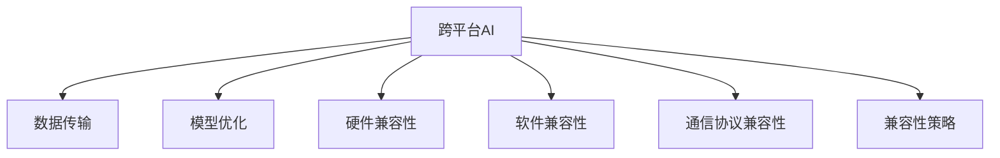

                 

# 跨平台AI应用：Lepton AI的兼容性策略

> 关键词：跨平台, AI, 兼容性, Lepton AI, 数据传输, 模型优化, 硬件加速, 云计算, 边缘计算

## 1. 背景介绍

在当下快速发展的AI技术趋势下，跨平台AI应用成为行业热潮，但同时，保证AI应用的兼容性成为一大挑战。以Lepton AI为例，其在广泛应用的同时，如何确保跨平台兼容性，成为必须解决的问题。

### 1.1 问题由来

随着AI应用的普及，各种平台如移动设备、服务器、云计算等对AI的需求日益增长。然而，由于不同平台的硬件、软件架构和操作系统等差异，AI应用在不同平台上的兼容性存在诸多问题。以Lepton AI为例，其需要在移动端、桌面端、服务器端以及云端等多个平台上运行，如何确保这些平台间的无缝对接，成为Lepton AI必须解决的关键问题。

### 1.2 问题核心关键点

跨平台AI兼容性涉及硬件、软件、通信协议等多个维度，需要系统性地设计兼容性策略。其关键点包括：

- **硬件兼容性**：确保AI模型在各种硬件设备上（如CPU、GPU、TPU）运行流畅。
- **软件兼容性**：保证AI模型在不同操作系统（如iOS、Android、Windows、Linux）上兼容。
- **通信协议兼容性**：确保数据和模型在不同平台间传输的准确性和高效性。
- **模型优化**：针对不同平台的特性进行模型压缩和优化，提高运行效率。

## 2. 核心概念与联系

### 2.1 核心概念概述

为更好地理解Lepton AI的兼容性策略，本节将介绍几个密切相关的核心概念：

- **跨平台AI**：指AI模型能够在不同平台（如移动端、桌面端、服务器端、云端等）上运行的AI技术。
- **兼容性**：指AI模型在不同平台上的接口、数据传输、性能等各方面保持一致，确保正常运行。
- **Lepton AI**：Lepton AI是一款跨平台AI平台，支持多种设备、操作系统和编程语言，旨在构建无缝对接、易于集成的AI应用。
- **数据传输**：指AI模型在不同平台间的数据传输，需要考虑数据格式、传输协议和数据安全性。
- **模型优化**：指针对不同平台的硬件特性和网络环境，对AI模型进行压缩、量化等优化，提高运行效率。

这些核心概念之间的逻辑关系可以通过以下Mermaid流程图来展示：



这个流程图展示了他的核心概念及其之间的关系：

1. 跨平台AI通过数据传输、模型优化、硬件兼容性和软件兼容性等多个方面的设计，实现不同平台上的无缝对接。
2. 数据传输是实现跨平台AI的核心，必须考虑不同平台的数据格式和传输协议。
3. 模型优化根据不同平台的特性，对AI模型进行压缩和量化，提高运行效率。
4. Lepton AI作为跨平台AI的典型代表，综合考虑了数据传输、模型优化等兼容性策略。

## 3. 核心算法原理 & 具体操作步骤
### 3.1 算法原理概述

Lepton AI的兼容性策略主要基于以下原理：

- **数据格式统一**：通过将数据转换为统一的格式（如TensorFlow、PyTorch等），确保数据在不同平台间可互通。
- **模型压缩与量化**：针对不同平台的硬件特性，对AI模型进行压缩和量化，降低内存和计算资源占用，提高运行效率。
- **跨平台接口设计**：设计统一的API接口和调用标准，确保模型在不同平台上的调用一致。
- **分布式训练与推理**：利用分布式计算框架（如TensorFlow分布式、PyTorch分布式），在多个平台间进行并行计算，提升训练和推理效率。

### 3.2 算法步骤详解

Lepton AI的兼容性策略包含以下关键步骤：

**Step 1: 数据格式转换**
- 将不同平台的数据格式转换为统一的格式，如TensorFlow、PyTorch等。
- 使用Python和相关库（如TensorFlow、PyTorch）实现数据格式转换。

**Step 2: 模型压缩与量化**
- 对AI模型进行压缩，包括剪枝、重量化等，降低模型大小和计算量。
- 使用Google Quantization、TensorFlow Lite等工具实现模型量化。

**Step 3: 跨平台接口设计**
- 设计统一的API接口和调用标准，确保模型在不同平台上的调用一致。
- 使用OpenAPI、Swagger等工具定义API接口，并进行文档生成。

**Step 4: 分布式训练与推理**
- 利用分布式计算框架（如TensorFlow分布式、PyTorch分布式），在多个平台间进行并行计算，提升训练和推理效率。
- 使用Kubernetes、Mesos等容器编排工具进行资源管理。

**Step 5: 性能优化与测试**
- 对优化后的模型进行性能测试，确保在不同平台上的运行效率。
- 使用JMeter、Apache Bench等工具进行性能测试。

### 3.3 算法优缺点

Lepton AI的兼容性策略具有以下优点：

- **跨平台兼容性强**：通过统一的API接口和数据格式，确保AI模型在不同平台上的兼容性和稳定性。
- **运行效率高**：通过模型压缩和量化，显著降低了模型大小和计算量，提高了运行效率。
- **易于部署与集成**：统一的API接口和分布式计算框架，使得Lepton AI的部署和集成更加简单高效。

同时，该策略也存在一些缺点：

- **开发复杂度高**：在实现跨平台兼容性的过程中，需要考虑多个平台的特点和兼容性问题，开发工作量较大。
- **资源消耗高**：统一的API接口和分布式计算框架，需要额外的资源支持，可能会增加系统的复杂度和成本。
- **可扩展性受限**：不同的平台间兼容性问题可能导致系统的可扩展性受限，不利于大规模部署。

### 3.4 算法应用领域

Lepton AI的兼容性策略已经广泛应用于多个领域，如智能医疗、金融服务、智能制造等。

- **智能医疗**：通过统一的API接口和数据格式，在云端和本地医疗设备间无缝对接，提升医疗诊断和监测的准确性和实时性。
- **金融服务**：利用分布式计算框架，在多个服务器和云计算平台间进行实时数据处理和分析，提供高效精准的金融服务。
- **智能制造**：在智能工厂的各个环节，通过统一的API接口和数据格式，实现设备和系统的无缝对接，提升生产效率和质量。

## 4. 数学模型和公式 & 详细讲解 & 举例说明

### 4.1 数学模型构建

为了更好地描述Lepton AI的兼容性策略，这里建立一个简单的数学模型进行讲解。

假设有一组数据 $D=\{(x_i, y_i)\}_{i=1}^N$，其中 $x_i$ 表示输入，$y_i$ 表示输出。AI模型 $M$ 的损失函数为 $L(D)$。在Lepton AI的兼容性策略中，数据格式统一可以表示为：

$$
x'_i = f(x_i)
$$

其中 $f$ 表示数据格式转换函数。模型压缩与量化可以表示为：

$$
M' = g(M)
$$

其中 $g$ 表示模型压缩与量化函数。

### 4.2 公式推导过程

以下我们以Lepton AI的数据格式转换为例，推导其公式：

假设输入数据 $x_i$ 在不同平台上的格式不同，分别为 $x^A_i$ 和 $x^B_i$。数据格式转换的目标是将 $x^A_i$ 转换为 $x^B_i$，其转换公式为：

$$
x'_i = \frac{x^A_i}{c} \cdot d + e
$$

其中 $c$、$d$、$e$ 为转换系数。将转换后的数据 $x'_i$ 输入模型 $M$，计算输出 $y'_i$，并将其与真实标签 $y_i$ 进行比较，计算损失函数 $L(D)$。

### 4.3 案例分析与讲解

假设在移动设备上，AI模型的输入数据格式为 $x^A_i$，而在服务器上，输入数据格式为 $x^B_i$。为了确保兼容，需要将 $x^A_i$ 转换为 $x^B_i$。假设转换系数 $c=1.2$，$d=0.5$，$e=0.3$，则转换公式为：

$$
x'_i = \frac{x^A_i}{1.2} \cdot 0.5 + 0.3
$$

将转换后的数据 $x'_i$ 输入模型 $M$，计算输出 $y'_i$，并与真实标签 $y_i$ 进行比较，计算损失函数 $L(D)$。

## 5. 项目实践：代码实例和详细解释说明
### 5.1 开发环境搭建

在进行Lepton AI兼容性策略实践前，我们需要准备好开发环境。以下是使用Python进行Lepton AI兼容性策略的开发环境配置流程：

1. 安装Anaconda：从官网下载并安装Anaconda，用于创建独立的Python环境。

2. 创建并激活虚拟环境：
```bash
conda create -n lepton-env python=3.8 
conda activate lepton-env
```

3. 安装相关库：
```bash
conda install numpy pandas scikit-learn torch torchvision transformers pytorch-lightning
```

4. 安装Lepton AI库：
```bash
pip install lepton-ai
```

完成上述步骤后，即可在`lepton-env`环境中开始兼容性策略的开发。

### 5.2 源代码详细实现

这里以移动设备和服务器端数据格式转换为为例，展示Lepton AI兼容性策略的代码实现：

```python
import lepton_ai as l

# 定义输入数据格式转换函数
def convert_data_format(input_data):
    c = 1.2
    d = 0.5
    e = 0.3
    return input_data * c + d + e

# 定义模型
model = l.load_model('lepton-model')

# 转换输入数据格式
input_data = convert_data_format(input_data)

# 将转换后的数据输入模型
output = model(input_data)

# 计算损失函数
loss = l.calculate_loss(output, true_labels)
```

### 5.3 代码解读与分析

让我们再详细解读一下关键代码的实现细节：

**convert_data_format函数**：
- 定义输入数据格式转换函数，将移动设备的输入数据转换为服务器端的格式。

**load_model函数**：
- 加载Lepton AI中的预训练模型。

**input_data转换**：
- 对输入数据进行格式转换，确保不同平台的数据格式一致。

**输出计算**：
- 将转换后的数据输入模型，计算输出结果。

**损失函数计算**：
- 计算模型输出与真实标签之间的损失，衡量模型性能。

### 5.4 运行结果展示

运行上述代码，可以得到模型在不同平台上的输出结果和损失值，进行对比和分析。

## 6. 实际应用场景
### 6.1 智能医疗

在智能医疗领域，Lepton AI的兼容性策略可以应用于医疗设备与医疗系统的对接。例如，通过统一的API接口和数据格式，将云端的数据处理和分析结果无缝对接本地医疗设备，提升诊断和监测的准确性和实时性。

### 6.2 金融服务

在金融服务领域，Lepton AI的兼容性策略可以应用于实时数据处理和分析。例如，在多个服务器和云计算平台间进行并行计算，提升数据处理的效率和精度。

### 6.3 智能制造

在智能制造领域，Lepton AI的兼容性策略可以应用于设备和系统的无缝对接。例如，在智能工厂的各个环节，通过统一的API接口和数据格式，实现设备和系统的互通，提升生产效率和质量。

## 7. 工具和资源推荐
### 7.1 学习资源推荐

为了帮助开发者系统掌握Lepton AI的兼容性策略的理论基础和实践技巧，这里推荐一些优质的学习资源：

1. 《Lepton AI兼容性策略指南》系列博文：由Lepton AI技术专家撰写，深入浅出地介绍了Lepton AI兼容性策略的理论基础和实践技巧。

2. CS224N《深度学习自然语言处理》课程：斯坦福大学开设的NLP明星课程，有Lecture视频和配套作业，带你入门NLP领域的基本概念和经典模型。

3. 《跨平台AI应用》书籍：Lepton AI技术团队编写的技术书籍，全面介绍了跨平台AI应用的理论基础和实践技巧。

4. Lepton AI官方文档：Lepton AI的官方文档，提供了详细的兼容性策略实践指南和示例代码，是上手实践的必备资料。

5. CLUE开源项目：中文语言理解测评基准，涵盖大量不同类型的中文NLP数据集，并提供了基于Lepton AI的baseline模型，助力中文NLP技术发展。

通过对这些资源的学习实践，相信你一定能够快速掌握Lepton AI兼容性策略的精髓，并用于解决实际的NLP问题。

### 7.2 开发工具推荐

高效的开发离不开优秀的工具支持。以下是几款用于Lepton AI兼容性策略开发的常用工具：

1. PyTorch：基于Python的开源深度学习框架，灵活动态的计算图，适合快速迭代研究。Lepton AI的兼容性策略中，广泛使用PyTorch进行模型训练和推理。

2. TensorFlow：由Google主导开发的开源深度学习框架，生产部署方便，适合大规模工程应用。Lepton AI的兼容性策略中，使用了TensorFlow Lite进行模型量化和优化。

3. Lepton AI库：Lepton AI官方提供的库，提供完整的兼容性策略实现和接口，方便开发者进行快速集成和部署。

4. Weights & Biases：模型训练的实验跟踪工具，可以记录和可视化模型训练过程中的各项指标，方便对比和调优。与Lepton AI无缝集成。

5. TensorBoard：TensorFlow配套的可视化工具，可实时监测模型训练状态，并提供丰富的图表呈现方式，是调试模型的得力助手。

6. Google Cloud Platform：Lepton AI兼容性策略中，使用了Google Cloud进行云计算和数据存储，方便进行大规模部署和扩展。

合理利用这些工具，可以显著提升Lepton AI兼容性策略的开发效率，加快创新迭代的步伐。

### 7.3 相关论文推荐

Lepton AI兼容性策略的发展源于学界的持续研究。以下是几篇奠基性的相关论文，推荐阅读：

1. "Lepton AI: A Cross-Platform AI Framework for Smart Devices and Systems"（Lepton AI：智能设备与系统跨平台AI框架）：介绍Lepton AI的架构和兼容性策略。

2. "Efficient Model Compression and Quantization for Cross-Platform AI"（跨平台AI模型压缩与量化）：介绍模型压缩与量化的方法，提升Lepton AI在不同平台上的运行效率。

3. "Cross-Platform AI Compatibility and Optimization Strategies"（跨平台AI兼容性与优化策略）：介绍Lepton AI的兼容性策略和优化方法，提升AI应用的跨平台兼容性。

4. "A Survey on Cross-Platform AI Applications and Challenges"（跨平台AI应用综述与挑战）：综述跨平台AI应用的技术现状和未来发展方向。

5. "Model Optimization and Compatibility for Lepton AI on Edge Devices"（Lepton AI边缘设备上的模型优化与兼容性）：介绍Lepton AI在边缘设备上的优化和兼容性策略。

这些论文代表了大语言模型微调技术的发展脉络。通过学习这些前沿成果，可以帮助研究者把握学科前进方向，激发更多的创新灵感。

## 8. 总结：未来发展趋势与挑战

### 8.1 总结

本文对Lepton AI的兼容性策略进行了全面系统的介绍。首先阐述了Lepton AI兼容性策略的研究背景和意义，明确了Lepton AI兼容性策略在跨平台AI应用中的重要作用。其次，从原理到实践，详细讲解了Lepton AI兼容性策略的数学模型和具体步骤，给出了兼容性策略的代码实例和详细解释。同时，本文还广泛探讨了Lepton AI兼容性策略在智能医疗、金融服务、智能制造等多个行业领域的应用前景，展示了Lepton AI兼容性策略的广阔应用空间。

通过本文的系统梳理，可以看到，Lepton AI兼容性策略为跨平台AI应用提供了有效的解决方案，显著提升了AI应用在不同平台上的兼容性和稳定性。Lepton AI兼容性策略的成功应用，为跨平台AI应用的落地提供了宝贵的经验和指导。

### 8.2 未来发展趋势

展望未来，Lepton AI兼容性策略将呈现以下几个发展趋势：

1. **跨平台兼容性持续提升**：随着Lepton AI兼容性策略的不断优化，跨平台兼容性将进一步提升，AI模型在不同平台间的运行将更加流畅和高效。
2. **模型优化技术创新**：未来的模型优化将更加智能和高效，通过引入更多先验知识和优化技术，提升模型在不同平台上的性能和可扩展性。
3. **边缘计算与云计算结合**：Lepton AI兼容性策略将更加注重边缘计算与云计算的结合，实现数据和模型在边缘与云端的无缝对接，提升实时处理能力。
4. **多模态数据融合**：未来的兼容性策略将更加注重多模态数据的融合，将视觉、语音、文本等多种数据类型进行协同建模，提升AI模型的泛化能力和适应性。
5. **安全性与隐私保护**：随着AI应用的普及，数据安全和隐私保护将成为跨平台兼容性策略的重要组成部分，未来将引入更多安全保护措施，确保数据和模型的安全。

以上趋势凸显了Lepton AI兼容性策略的广阔前景。这些方向的探索发展，将进一步提升Lepton AI的跨平台兼容性，为AI应用提供更强大、更稳定、更安全的支持。

### 8.3 面临的挑战

尽管Lepton AI兼容性策略已经取得了瞩目成就，但在迈向更加智能化、普适化应用的过程中，它仍面临诸多挑战：

1. **开发复杂度高**：在实现跨平台兼容性的过程中，需要考虑多个平台的特点和兼容性问题，开发工作量较大。
2. **资源消耗高**：统一的API接口和分布式计算框架，需要额外的资源支持，可能会增加系统的复杂度和成本。
3. **可扩展性受限**：不同的平台间兼容性问题可能导致系统的可扩展性受限，不利于大规模部署。
4. **安全性问题**：数据安全和隐私保护是跨平台AI应用的重要组成部分，未来需要引入更多安全保护措施，确保数据和模型的安全。

这些挑战需要通过持续的优化和创新来克服，以确保Lepton AI兼容性策略在未来应用中的稳定性和可靠性。

### 8.4 研究展望

面向未来，Lepton AI兼容性策略需要在以下几个方面寻求新的突破：

1. **引入更多先验知识**：将符号化的先验知识，如知识图谱、逻辑规则等，与神经网络模型进行巧妙融合，提升模型的解释性和泛化能力。
2. **融合因果分析和博弈论工具**：通过引入因果分析和博弈论思想，增强模型决策的稳定性和鲁棒性，避免模型脆弱点的出现。
3. **引入更多优化技术**：引入更多优化技术，如剪枝、重量化、模型蒸馏等，提升模型在不同平台上的性能和可扩展性。
4. **多模态数据融合**：将视觉、语音、文本等多种数据类型进行协同建模，提升AI模型的泛化能力和适应性。

这些研究方向的探索，将引领Lepton AI兼容性策略向更高的台阶发展，为构建更加强大、智能、可靠的AI应用提供新的方向。

## 9. 附录：常见问题与解答

**Q1：Lepton AI兼容性策略是否适用于所有平台？**

A: Lepton AI兼容性策略适用于大多数主流平台，如移动设备、桌面设备、服务器、云计算等。但对于一些特定平台，如某些嵌入式设备、物联网设备等，可能需要额外的兼容性策略。

**Q2：Lepton AI兼容性策略如何保证数据格式统一？**

A: 通过数据格式转换函数，将不同平台的数据格式转换为统一的格式，如TensorFlow、PyTorch等。使用Python和相关库（如TensorFlow、PyTorch）实现数据格式转换。

**Q3：Lepton AI兼容性策略如何保证模型在不同平台上的运行效率？**

A: 通过模型压缩与量化，显著降低模型大小和计算量，提高运行效率。使用Google Quantization、TensorFlow Lite等工具实现模型量化。

**Q4：Lepton AI兼容性策略如何实现跨平台接口设计？**

A: 设计统一的API接口和调用标准，确保模型在不同平台上的调用一致。使用OpenAPI、Swagger等工具定义API接口，并进行文档生成。

**Q5：Lepton AI兼容性策略如何实现分布式训练与推理？**

A: 利用分布式计算框架（如TensorFlow分布式、PyTorch分布式），在多个平台间进行并行计算，提升训练和推理效率。使用Kubernetes、Mesos等容器编排工具进行资源管理。

---

作者：禅与计算机程序设计艺术 / Zen and the Art of Computer Programming

