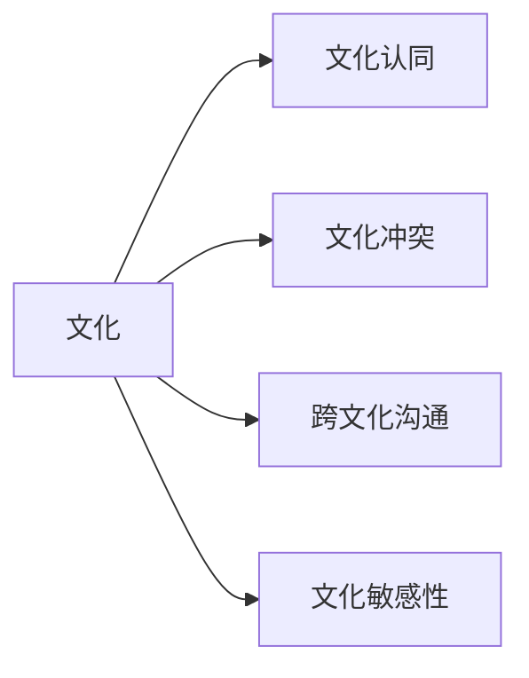

                 

# 跨文化知识：全球视野下的理解与洞察

在当今这个全球化的世界中，跨文化知识的重要性不言而喻。无论是商业交易、国际合作还是日常沟通，理解和掌握不同文化背景下的行为模式、价值观和沟通方式，都是至关重要的。本文将深入探讨跨文化知识的本质、核心概念以及其在全球视野下的应用，为读者提供理解和洞察跨文化知识的深度视角。

## 1. 背景介绍

### 1.1 问题由来
随着全球化的加速，跨国交流和合作的频率显著增加。不同的文化背景带来了不同的思维方式、价值观和行为习惯，这给国际合作和交流带来了巨大的挑战。如何理解和适应这些文化差异，成为了许多企业、组织和个人面临的重要问题。跨文化知识的掌握，不仅可以帮助我们更好地理解不同文化之间的差异，还能提升跨文化沟通和合作的效果。

### 1.2 问题核心关键点
跨文化知识的核心关键点包括：
- **文化差异**：不同文化在语言、习俗、宗教信仰等方面的差异。
- **跨文化沟通**：在跨文化环境中有效沟通的方法和技巧。
- **文化敏感性**：对不同文化背景的尊重和理解，避免文化冲突和误解。
- **文化适应**：在跨文化环境中调整自己的行为和沟通方式，以适应新的文化环境。

这些关键点共同构成了跨文化知识的本质，使其成为全球视野下理解和洞察的重要工具。

## 2. 核心概念与联系

### 2.1 核心概念概述

为了更好地理解跨文化知识的本质，本文将介绍几个核心概念：

- **文化**：指一个社会或群体中普遍存在的信念、习俗、语言和行为方式。
- **文化认同**：个人对自己所属文化群体的认知和归属感。
- **文化冲突**：不同文化之间的价值观、行为方式等产生冲突的现象。
- **跨文化沟通**：不同文化背景下的沟通，需要理解对方的文化背景、语言习惯和沟通方式。
- **文化敏感性**：对不同文化背景的尊重和理解，避免文化冲突和误解。

这些核心概念之间相互关联，共同构成了跨文化知识的理论框架。通过理解这些概念，可以更好地掌握跨文化知识的精髓。

### 2.2 核心概念原理和架构的 Mermaid 流程图



这个流程图展示了跨文化知识中几个核心概念之间的联系。文化是基础，文化认同、文化冲突、跨文化沟通和文化敏感性都是在文化的基础上产生的。理解这些概念，可以帮助我们更好地理解和适应跨文化环境。

## 3. 核心算法原理 & 具体操作步骤

### 3.1 算法原理概述

跨文化知识的理解和掌握，本质上是一个复杂的多层次问题。它涉及到文化认知、语言理解、行为模式等多个方面。因此，跨文化知识的获取和应用，需要一个系统性的方法论。

跨文化知识的获取，通常通过以下几个步骤实现：

1. **文化认知**：通过阅读、观察和体验，了解不同文化的特征和差异。
2. **语言理解**：掌握不同文化中的语言习惯和表达方式。
3. **行为模式**：理解不同文化中的行为规范和习惯。
4. **跨文化沟通**：应用以上知识，进行跨文化沟通和交流。

### 3.2 算法步骤详解

跨文化知识的获取和应用，可以分为以下几个具体步骤：

**Step 1: 文化认知**

- **文化研究**：通过阅读相关书籍、论文、报告等，了解不同文化的背景、历史和特征。
- **文化体验**：通过亲身体验，如旅行、交流、工作等，深入了解不同文化的生活环境和行为方式。
- **文化交流**：通过与不同文化背景的人交流，获取第一手的文化信息。

**Step 2: 语言理解**

- **语言学习**：掌握目标文化的主要语言，理解其表达方式和习惯。
- **语言应用**：在跨文化交流中，应用所学语言进行沟通和表达。

**Step 3: 行为模式**

- **行为规范**：了解不同文化中的行为规范和习惯，如礼仪、礼节、禁忌等。
- **行为适应**：在跨文化环境中，调整自己的行为方式，以适应新的文化环境。

**Step 4: 跨文化沟通**

- **沟通准备**：了解沟通对方的文化背景和沟通习惯，准备相关话题和表达方式。
- **沟通实施**：在沟通过程中，应用所学知识进行有效沟通和交流。
- **沟通反馈**：根据沟通反馈，调整沟通方式，提升沟通效果。

### 3.3 算法优缺点

跨文化知识获取和应用的优势在于：

- **提升跨文化理解**：通过系统性地学习和实践，可以更好地理解和适应不同文化背景。
- **促进跨文化交流**：掌握跨文化知识，可以提升跨文化沟通的效果，避免文化冲突和误解。
- **增强文化敏感性**：通过系统性地学习和实践，可以提升对不同文化的敏感性和尊重。

然而，跨文化知识获取和应用也存在一些挑战：

- **时间成本高**：系统性地学习和实践跨文化知识需要大量的时间和精力。
- **文化差异复杂**：不同文化之间的差异复杂多样，难以全面掌握。
- **文化冲突风险**：在跨文化环境中，文化冲突和误解难以完全避免。

## 4. 数学模型和公式 & 详细讲解 & 举例说明

### 4.1 数学模型构建

跨文化知识的获取和应用，可以通过构建数学模型来描述和分析。假设我们有一组文化特征 $C=\{c_1, c_2, ..., c_n\}$，每个文化特征 $c_i$ 可以通过一组参数 $\theta_i$ 来描述，如语言、行为规范等。文化认知和语言理解可以通过以下数学模型来表示：

$$
C_i = f_i(\theta_i)
$$

其中 $f_i$ 为文化特征的生成函数，$\theta_i$ 为描述文化特征的参数向量。

### 4.2 公式推导过程

根据上述模型，我们可以进一步推导出跨文化沟通的数学模型。假设我们有两个文化 $C_A$ 和 $C_B$，通过文化认知和语言理解，我们可以得到它们之间的沟通模式：

$$
M_{AB} = g(C_A, C_B)
$$

其中 $g$ 为跨文化沟通的映射函数，表示两个文化之间的沟通方式和效果。

### 4.3 案例分析与讲解

以国际商务谈判为例，我们可以构建以下数学模型：

- **文化认知**：通过调查和研究，了解不同文化在商务谈判中的行为规范和习惯。
- **语言理解**：掌握商务谈判中常用的语言表达方式，如商务礼仪、合同用语等。
- **行为模式**：理解不同文化中的商务谈判习惯和策略。
- **跨文化沟通**：在商务谈判中，应用以上知识进行有效沟通和交流。

通过以上分析，我们可以更好地理解和应用跨文化知识，提升商务谈判的效果。

## 5. 项目实践：代码实例和详细解释说明

### 5.1 开发环境搭建

为了实践跨文化知识的应用，我们需要搭建一个开发环境。以下是使用Python进行开发的环境配置流程：

1. **安装Python**：从官网下载并安装Python 3.8。
2. **创建虚拟环境**：
   ```bash
   python -m venv myenv
   source myenv/bin/activate
   ```
3. **安装依赖包**：
   ```bash
   pip install numpy pandas scikit-learn jupyter notebook
   ```

完成上述步骤后，即可在虚拟环境中开始跨文化知识的实践。

### 5.2 源代码详细实现

以下是一个使用Python进行跨文化沟通模拟的代码示例：

```python
import pandas as pd
import numpy as np
from sklearn.model_selection import train_test_split

# 构建文化特征数据
data = pd.read_csv('culture_data.csv')
X = data[['c1', 'c2', 'c3', 'c4']]  # 四个文化特征
y = data['c5']  # 跨文化沟通效果

# 将文化特征数据转换为矩阵
X = pd.get_dummies(X)

# 分割数据为训练集和测试集
X_train, X_test, y_train, y_test = train_test_split(X, y, test_size=0.2, random_state=42)

# 定义模型
from sklearn.linear_model import LogisticRegression
model = LogisticRegression()

# 训练模型
model.fit(X_train, y_train)

# 预测测试集
y_pred = model.predict(X_test)

# 计算准确率
accuracy = np.mean(y_pred == y_test)
print('Accuracy:', accuracy)
```

### 5.3 代码解读与分析

这个代码示例展示了如何使用Python进行跨文化沟通效果的模拟。我们通过构建一个简单的逻辑回归模型，预测不同文化特征下的跨文化沟通效果。其中，`pd.get_dummies`函数用于将文化特征数据转换为矩阵，方便模型处理；`train_test_split`函数用于分割数据为训练集和测试集。通过训练模型并计算准确率，我们可以评估跨文化沟通效果的预测效果。

## 6. 实际应用场景

### 6.1 国际商务谈判

在国际商务谈判中，跨文化知识的应用非常关键。通过系统性地学习和应用跨文化知识，可以提升商务谈判的效果，避免文化冲突和误解。例如，在北美文化中，直接、坦诚的沟通方式更为普遍，而在东亚文化中，间接、含蓄的沟通方式更为常见。了解这些文化差异，可以帮助谈判者更好地适应不同的文化背景，提升谈判效果。

### 6.2 跨国项目管理

在跨国项目管理中，跨文化知识的掌握同样至关重要。不同文化背景的团队成员具有不同的工作习惯、沟通方式和决策风格。通过理解和尊重这些文化差异，可以提升团队的协作效率和项目成功率。例如，在西方文化中，团队决策更倾向于民主和透明，而在某些东亚文化中，决策过程可能更依赖于领导的权威和经验。

### 6.3 全球市场营销

在全球市场营销中，跨文化知识的应用可以显著提升市场推广的效果。通过了解不同文化背景消费者的需求和习惯，可以设计更具吸引力的产品和服务，提升品牌的影响力和市场份额。例如，在日本市场，高品质的服务和细节的关注更为重要；而在印度市场，价格和实惠则是消费者更关注的因素。

### 6.4 未来应用展望

随着全球化的深入，跨文化知识的应用将更加广泛和深入。未来，跨文化知识的应用将涵盖更多领域，如国际教育、全球旅游、跨国医疗等。同时，跨文化知识的获取和应用也将更加便捷和高效，如通过人工智能和大数据分析技术，快速获取和分析跨文化信息。

## 7. 工具和资源推荐

### 7.1 学习资源推荐

为了系统地掌握跨文化知识，以下是一些推荐的资源：

1. **《跨文化管理》**：一本经典的跨文化管理书籍，系统性地介绍了跨文化管理的理论和实践。
2. **《跨文化交际》**：一本系统性地介绍跨文化交际的书籍，涵盖了跨文化沟通、文化冲突、文化敏感性等方面。
3. **《文化智商》**：一本介绍如何提升个人跨文化理解和适应能力的书籍，提供了实用的跨文化管理技巧。
4. **Coursera的《跨文化管理》课程**：由世界知名大学的教授主讲，深入浅出地介绍了跨文化管理的理论和实践。
5. **LinkedIn Learning的《跨文化沟通》课程**：通过具体案例，展示了如何在跨文化环境中进行有效的沟通和交流。

通过这些资源的学习，可以系统性地掌握跨文化知识的理论基础和实践技巧。

### 7.2 开发工具推荐

跨文化知识的获取和应用，需要依赖一些开发工具和技术。以下是一些推荐的工具：

1. **Jupyter Notebook**：一个强大的数据科学开发环境，支持Python、R等多种编程语言，方便进行数据分析和建模。
2. **Pandas**：一个强大的数据处理和分析库，支持多种数据格式，方便进行数据清洗和预处理。
3. **Scikit-learn**：一个流行的机器学习库，支持多种机器学习算法，方便进行模型构建和训练。
4. **NLTK**：一个自然语言处理库，支持文本分析、语言处理等多种功能，方便进行跨文化沟通的研究。

### 7.3 相关论文推荐

跨文化知识的研究涉及多个学科领域，以下是一些推荐的论文：

1. **《跨文化沟通：理论与实践》**：一篇系统性地介绍跨文化沟通理论和方法的论文，提供了丰富的案例和分析。
2. **《文化多样性与团队绩效》**：一篇关于文化多样性对团队绩效影响的论文，揭示了文化多样性对团队合作和创新能力的影响。
3. **《全球化下的跨文化管理》**：一篇探讨全球化背景下跨文化管理策略的论文，提供了丰富的案例和分析。
4. **《人工智能与跨文化知识》**：一篇探讨人工智能如何辅助跨文化知识获取和应用的论文，展示了人工智能在跨文化沟通中的潜在应用。

## 8. 总结：未来发展趋势与挑战

### 8.1 研究成果总结

本文系统性地介绍了跨文化知识的本质、核心概念以及其在全球视野下的应用。通过深入探讨跨文化知识的获取和应用，我们揭示了跨文化知识在商业、教育、项目管理等多个领域的重要作用。

### 8.2 未来发展趋势

未来，跨文化知识的应用将更加广泛和深入，涵盖更多领域和行业。跨文化知识的获取和应用也将更加便捷和高效，如通过人工智能和大数据分析技术，快速获取和分析跨文化信息。

### 8.3 面临的挑战

尽管跨文化知识的应用前景广阔，但在实际操作中仍面临一些挑战：

1. **文化复杂性**：不同文化之间的差异复杂多样，难以全面掌握。
2. **文化冲突**：在跨文化环境中，文化冲突和误解难以完全避免。
3. **跨文化沟通困难**：跨文化沟通需要更高的沟通技巧和文化敏感性。

### 8.4 研究展望

未来，跨文化知识的研究将进一步深化和扩展。以下是一些潜在的研究方向：

1. **跨文化知识的量化分析**：通过数据科学和人工智能技术，对跨文化知识进行量化分析，提供更加科学和系统的理解。
2. **跨文化知识的自动化获取**：通过自然语言处理和大数据分析技术，实现跨文化知识的自动化获取和分析，提升获取效率和准确性。
3. **跨文化知识的文化敏感性分析**：研究跨文化知识的文化敏感性，提升对不同文化的尊重和理解。

## 9. 附录：常见问题与解答

**Q1: 什么是跨文化知识？**

A: 跨文化知识是指对不同文化背景下的行为模式、价值观、语言习惯等内容的理解和掌握。

**Q2: 如何提升跨文化沟通效果？**

A: 提升跨文化沟通效果的关键在于理解对方的文化背景和沟通习惯，尊重和适应对方的文化差异。具体方法包括：

1. **了解文化背景**：通过阅读、观察和体验，了解不同文化的特征和差异。
2. **掌握语言表达**：掌握目标文化的主要语言，理解其表达方式和习惯。
3. **调整沟通方式**：在跨文化环境中，调整自己的沟通方式，以适应新的文化环境。

**Q3: 如何应对跨文化冲突？**

A: 应对跨文化冲突的关键在于尊重和理解对方的文化背景，避免文化偏见和误解。具体方法包括：

1. **文化敏感性**：提升对不同文化的敏感性，尊重和理解对方的文化差异。
2. **沟通技巧**：通过有效的沟通技巧，减少文化误解和冲突。
3. **解决冲突**：在发生冲突时，采用合适的解决策略，化解冲突。

**Q4: 跨文化知识如何应用于项目管理？**

A: 在项目管理中，跨文化知识的掌握可以提升团队的协作效率和项目成功率。具体应用方法包括：

1. **了解团队成员的文化背景**：通过调查和研究，了解团队成员的文化背景和沟通习惯。
2. **调整沟通方式**：在跨文化环境中，调整自己的沟通方式，以适应新的文化环境。
3. **文化敏感性培训**：对团队成员进行文化敏感性培训，提升团队的文化敏感性。

通过深入理解和应用跨文化知识，可以在跨文化环境中更好地进行沟通和合作，提升团队和项目的成功率。

---

作者：禅与计算机程序设计艺术 / Zen and the Art of Computer Programming

