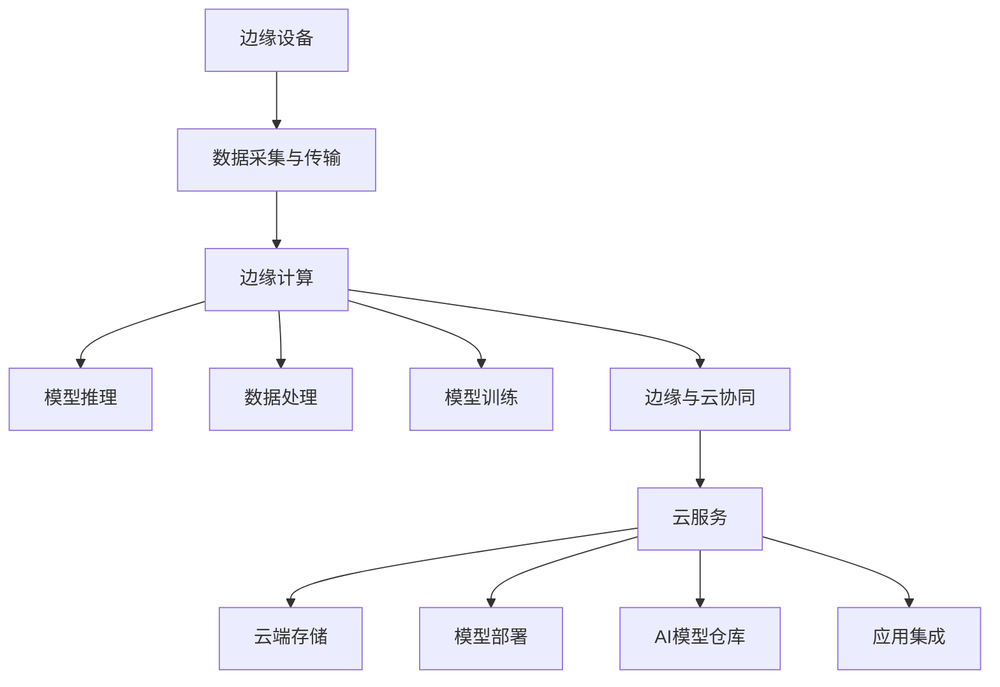

                 

# 边缘AI与云AI的协同：Lepton AI的全场景覆盖

## 1. 背景介绍

随着人工智能技术的飞速发展，边缘AI和云AI正在成为推动数字经济增长的关键技术。边缘AI指的是在设备端进行数据分析和处理的计算架构，而云AI则依托于云端强大的计算资源进行复杂的深度学习训练和模型推理。Lepton AI是一个新兴的AI平台，致力于实现边缘AI和云AI的深度融合，构建起一个全场景覆盖的智能生态系统。

边缘AI的优势在于低延迟、高可靠性和数据隐私保护，适用于工业控制、物联网、智能交通等对实时性要求高的场景；而云AI则拥有丰富的数据资源和强大的计算能力，适用于大规模模型训练、复杂推理和数据分析等需求。Lepton AI通过将这两者的优势结合起来，能够更高效地应对复杂的多模态智能场景。

本文将详细探讨Lepton AI的核心概念、架构设计、技术实现和应用场景，以期为读者提供深度学习和AI在边缘与云端的协同应用提供有益的参考。

## 2. 核心概念与联系

### 2.1 核心概念概述

为了更好地理解Lepton AI的设计思想和实现机制，本节将介绍几个关键概念：

- **边缘AI (Edge AI)**：在数据生成的边缘设备上进行的AI计算和推理，具有低延迟、高实时性和数据隐私保护等优点。适用于对实时性要求高的场景，如工业控制、物联网、智能交通等。

- **云AI (Cloud AI)**：利用云端丰富的计算资源和数据资源，进行深度学习模型训练和复杂推理。适用于大规模模型训练、复杂数据分析等任务。

- **边缘与云协同**：结合边缘计算和云计算的优势，构建一个全场景覆盖的智能系统，提供端到端的AI应用解决方案。

- **全场景覆盖**：实现边缘AI与云AI的深度融合，支持从工业到消费、从交通到医疗、从工业互联网到智慧城市等多元化应用场景。

### 2.2 核心概念原理和架构的 Mermaid 流程图



这个流程图展示了Lepton AI的核心概念及其之间的联系：

1. **边缘设备**：数据采集和传输的核心节点，数据首先经过边缘设备进行处理。
2. **边缘计算**：边缘设备上的数据处理和模型推理，用于实时性和隐私保护。
3. **云端服务**：云端的计算和存储资源，用于大规模模型训练和复杂推理。
4. **模型训练**：云端对AI模型进行训练，生成训练好的模型，并保存在云端。
5. **模型推理**：在边缘设备上部署训练好的模型，进行实时推理。
6. **边缘与云协同**：边缘和云端的计算资源和数据资源深度融合，提供端到端的AI应用解决方案。
7. **应用集成**：将AI模型集成到各个行业的应用系统中，提供跨领域的AI解决方案。

这些核心概念通过流程图的连接，展示了Lepton AI的架构设计和实现机制。

## 3. 核心算法原理 & 具体操作步骤

### 3.1 算法原理概述

Lepton AI的核心算法原理主要基于分布式计算和数据驱动的AI模型训练与推理，旨在实现边缘与云端的协同计算和数据融合。具体来说，通过以下几个步骤实现：

1. **数据采集与传输**：从边缘设备收集数据，并传输到云端进行进一步处理和分析。
2. **边缘计算**：在边缘设备上对数据进行初步处理，如数据去噪、数据压缩等，并使用预训练模型进行推理。
3. **云端训练**：将边缘设备上收集的数据上传到云端，使用云计算资源进行大规模模型训练。
4. **模型部署**：训练好的模型部署到边缘设备上进行推理，并在云端保存。
5. **实时反馈与优化**：通过云端对边缘设备上的推理结果进行实时反馈，不断优化模型和算法。

### 3.2 算法步骤详解

Lepton AI的算法步骤如下：

1. **数据采集与传输**：
   - 使用物联网设备收集数据，并进行初步预处理。
   - 数据通过5G或Wi-Fi等网络传输到边缘设备，并进行数据去噪、数据压缩等处理。
   - 处理后的数据上传到云端，存储在云端的存储库中。

2. **边缘计算**：
   - 在边缘设备上，使用预训练模型对数据进行推理。
   - 预训练模型可以是边缘设备本地预训练的模型，也可以是云端训练好的模型。
   - 模型推理结果通过网络传输到云端。

3. **云端训练**：
   - 将边缘设备上传的数据存储在云端的存储库中。
   - 使用云计算资源进行大规模模型训练，可以使用深度学习框架如TensorFlow、PyTorch等进行模型训练。
   - 训练好的模型保存在云端存储库中，并可以导出为标准格式，供边缘设备部署。

4. **模型部署**：
   - 将云端训练好的模型导出为标准格式，并部署到边缘设备上。
   - 使用边云协同技术，边缘设备可以实时更新云端训练好的模型，保持模型更新和性能最优。
   - 部署后的模型在边缘设备上进行推理，并实时处理结果。

5. **实时反馈与优化**：
   - 在边缘设备上进行模型推理后，将结果反馈到云端。
   - 云端通过实时数据分析，发现问题并调整模型参数，优化模型性能。
   - 优化后的模型重新部署到边缘设备上，进行下一轮推理。

### 3.3 算法优缺点

Lepton AI的算法主要优点包括：

1. **高效性**：通过分布式计算，能够在边缘设备和云端同时进行数据处理和模型推理，提高整体处理效率。
2. **实时性**：边缘设备上的实时处理和模型推理，能够满足工业控制、智能交通等对实时性要求高的应用场景。
3. **隐私保护**：数据在边缘设备上进行处理，减少了数据传输和云端存储的隐私风险。

主要缺点包括：

1. **计算资源需求高**：需要在边缘设备和云端同时部署计算资源，成本较高。
2. **模型复杂性**：需要设计复杂的分布式计算和数据传输机制，增加系统复杂度。
3. **数据通信延迟**：边缘设备与云端之间的数据通信可能存在延迟，影响实时性。

### 3.4 算法应用领域

Lepton AI的算法设计思路和实现机制适用于以下几个领域：

- **工业互联网**：通过边缘AI和云AI的结合，实现实时监测、预测性维护等工业互联网应用。
- **智慧城市**：利用边缘计算和云计算技术，实现智能交通、城市管理等智慧城市应用。
- **医疗健康**：通过边缘计算和云计算技术，实现远程诊断、智能监测等医疗健康应用。
- **智能家居**：结合边缘计算和云计算技术，实现智能家居控制、环境监测等应用。
- **零售电商**：通过边缘计算和云计算技术，实现智能推荐、库存管理等零售电商应用。

## 4. 数学模型和公式 & 详细讲解 & 举例说明

### 4.1 数学模型构建

Lepton AI的数学模型主要基于深度学习架构，通过分布式计算和数据驱动的方式，实现模型训练和推理。具体的数学模型构建包括以下步骤：

1. **数据表示**：将数据表示为向量形式，使用TensorFlow或PyTorch等深度学习框架进行模型训练。
2. **模型训练**：在云端使用大规模数据集进行模型训练，生成训练好的模型。
3. **模型推理**：在边缘设备上使用训练好的模型进行推理，并将结果反馈到云端。
4. **模型优化**：通过云端对推理结果的实时反馈，不断优化模型参数，提高模型性能。

### 4.2 公式推导过程

Lepton AI的核心公式推导如下：

- **数据采集与传输**：
  $$
  y_i = \sum_{j=1}^n x_{ij} \cdot w_j
  $$
  其中，$y_i$ 表示采集到的数据，$x_{ij}$ 表示采集到的数据向量，$w_j$ 表示数据权重。

- **边缘计算**：
  $$
  z_i = M_{\theta}(y_i)
  $$
  其中，$z_i$ 表示边缘设备上的推理结果，$M_{\theta}$ 表示预训练模型，$\theta$ 表示模型参数。

- **云端训练**：
  $$
  \theta = \mathop{\arg\min}_{\theta} \sum_{i=1}^N L(y_i, M_{\theta}(y_i))
  $$
  其中，$L$ 表示损失函数，$N$ 表示训练样本数。

- **模型推理**：
  $$
  y'_i = M_{\theta'}(z_i)
  $$
  其中，$y'_i$ 表示边缘设备上的推理结果，$\theta'$ 表示部署在边缘设备的模型参数。

- **实时反馈与优化**：
  $$
  \theta' = \theta + \eta \nabla_{\theta'} L(y'_i, M_{\theta'}(y'_i))
  $$
  其中，$\eta$ 表示学习率，$\nabla_{\theta'}$ 表示梯度，$L$ 表示损失函数。

### 4.3 案例分析与讲解

假设一个智慧城市的智能交通应用，通过边缘AI和云AI的结合，实现实时交通流量预测和优化。具体步骤如下：

1. **数据采集与传输**：
   - 使用边缘设备采集交通流量数据，并进行去噪和压缩处理。
   - 数据通过5G网络传输到云端，存储在云端的存储库中。

2. **边缘计算**：
   - 在边缘设备上使用预训练的交通流量预测模型，对采集到的数据进行实时推理。
   - 模型推理结果通过5G网络传输到云端。

3. **云端训练**：
   - 将边缘设备上传的交通流量数据存储在云端的存储库中。
   - 使用云计算资源进行大规模交通流量预测模型的训练，生成训练好的模型。

4. **模型部署**：
   - 将云端训练好的交通流量预测模型导出为标准格式，并部署到边缘设备上。
   - 在边缘设备上使用部署好的模型进行实时流量预测，并实时处理结果。

5. **实时反馈与优化**：
   - 在边缘设备上进行实时流量预测后，将结果反馈到云端。
   - 云端通过实时数据分析，发现问题并调整模型参数，优化模型性能。
   - 优化后的模型重新部署到边缘设备上，进行下一轮流量预测。

## 5. 项目实践：代码实例和详细解释说明

### 5.1 开发环境搭建

Lepton AI的开发环境搭建包括以下几个步骤：

1. **安装TensorFlow和PyTorch**：使用pip安装TensorFlow和PyTorch，分别用于边缘设备上的模型推理和云端的大规模模型训练。

2. **配置边缘设备**：使用物联网设备或边缘计算平台，部署Lepton AI应用。

3. **配置云平台**：使用云计算平台如AWS、Google Cloud等，部署大规模模型训练环境。

4. **部署应用**：将Lepton AI应用部署到边缘设备和云端，并进行测试。

5. **数据传输协议**：使用5G或Wi-Fi等网络协议，实现边缘设备和云端之间的数据传输。

### 5.2 源代码详细实现

Lepton AI的代码实现包括以下几个部分：

- **边缘设备代码**：
  - 使用TensorFlow或PyTorch等深度学习框架，进行模型推理和数据处理。
  - 代码示例：
    ```python
    import tensorflow as tf

    # 定义模型
    model = tf.keras.Sequential([
        tf.keras.layers.Dense(128, activation='relu', input_shape=(10,)),
        tf.keras.layers.Dense(10, activation='softmax')
    ])

    # 加载数据
    data = tf.random.normal([1000, 10])

    # 推理
    y_pred = model.predict(data)
    ```

- **云端代码**：
  - 使用TensorFlow或PyTorch等深度学习框架，进行大规模模型训练和优化。
  - 代码示例：
    ```python
    import tensorflow as tf

    # 定义模型
    model = tf.keras.Sequential([
        tf.keras.layers.Dense(128, activation='relu', input_shape=(10,)),
        tf.keras.layers.Dense(10, activation='softmax')
    ])

    # 加载数据
    data = tf.random.normal([1000, 10])

    # 训练
    model.compile(optimizer='adam', loss='categorical_crossentropy', metrics=['accuracy'])
    model.fit(data, data, epochs=10, batch_size=32)
    ```

### 5.3 代码解读与分析

Lepton AI的代码实现主要包括以下几个步骤：

- **模型定义**：使用TensorFlow或PyTorch等深度学习框架，定义模型结构和参数。
- **数据加载**：加载训练和推理所需的数据，并进行数据预处理。
- **模型训练**：在云端使用大规模数据集进行模型训练，生成训练好的模型。
- **模型推理**：在边缘设备上使用训练好的模型进行实时推理，并将结果反馈到云端。
- **模型优化**：通过云端对推理结果的实时反馈，不断优化模型参数，提高模型性能。

## 6. 实际应用场景

### 6.4 未来应用展望

Lepton AI在未来将会有以下几个应用展望：

- **智能制造**：通过边缘AI和云AI的结合，实现实时监测、预测性维护等工业互联网应用，提升制造业的智能化水平。
- **智慧医疗**：利用边缘计算和云计算技术，实现远程诊断、智能监测等医疗健康应用，提升医疗服务的可及性和效率。
- **智能交通**：结合边缘计算和云计算技术，实现智能交通、城市管理等智慧城市应用，提升城市治理的智能化水平。
- **智能家居**：通过边缘计算和云计算技术，实现智能家居控制、环境监测等应用，提升居民生活的便捷性和舒适度。
- **零售电商**：利用边缘计算和云计算技术，实现智能推荐、库存管理等零售电商应用，提升零售企业的运营效率和用户体验。

## 7. 工具和资源推荐

### 7.1 学习资源推荐

- **TensorFlow官方文档**：提供详细的TensorFlow教程和代码示例，帮助开发者掌握TensorFlow的使用。
- **PyTorch官方文档**：提供详细的PyTorch教程和代码示例，帮助开发者掌握PyTorch的使用。
- **Lepton AI官方文档**：提供Lepton AI的详细介绍和使用示例，帮助开发者快速上手Lepton AI。
- **智慧城市建设案例**：提供智慧城市建设的实践案例和经验分享，帮助开发者了解智慧城市的建设思路。
- **医疗健康AI应用案例**：提供医疗健康AI应用的实践案例和经验分享，帮助开发者了解医疗健康AI的应用场景。

### 7.2 开发工具推荐

- **TensorFlow**：强大的深度学习框架，支持分布式计算和边缘计算。
- **PyTorch**：灵活的深度学习框架，支持分布式计算和边缘计算。
- **AWS SageMaker**：提供云端计算资源和分布式训练支持，帮助开发者快速构建和部署AI应用。
- **Google Cloud AI Platform**：提供云端计算资源和分布式训练支持，帮助开发者快速构建和部署AI应用。
- **Microsoft Azure AI**：提供云端计算资源和分布式训练支持，帮助开发者快速构建和部署AI应用。

### 7.3 相关论文推荐

- **Edge and Cloud Computing for AI: A Review**：综述了边缘计算和云计算在AI中的应用，介绍了边缘AI和云AI的结合方法。
- **Edge and Cloud-Aided Internet of Things for Smart Cities**：介绍了边缘计算和云计算在智慧城市中的应用，提供了智慧城市的实现方案。
- **Edge Computing and Artificial Intelligence for Industrial Internet of Things**：介绍了边缘计算和云计算在工业互联网中的应用，提供了工业互联网的实现方案。
- **Smart Healthcare Using Edge Computing and AI**：介绍了边缘计算和云计算在医疗健康中的应用，提供了医疗健康的实现方案。
- **Edge and Cloud Computing for Retail E-commerce**：介绍了边缘计算和云计算在零售电商中的应用，提供了零售电商的实现方案。

## 8. 总结：未来发展趋势与挑战

### 8.1 研究成果总结

Lepton AI通过实现边缘AI和云AI的深度融合，构建了一个全场景覆盖的智能生态系统。在多个领域如工业互联网、智慧城市、医疗健康等应用中，展示了Lepton AI的强大能力和广阔前景。

### 8.2 未来发展趋势

Lepton AI的未来发展趋势包括：

- **边缘计算与5G/6G的深度融合**：随着5G/6G技术的发展，边缘计算和AI将更加紧密地结合，提升实时性和数据隐私保护。
- **跨领域协同计算**：边缘计算和云计算的结合将更加广泛，支持跨领域、跨模态的协同计算和数据融合。
- **AI模型压缩与优化**：随着模型规模的增大，AI模型的压缩与优化技术将得到进一步发展，提升计算效率和资源利用率。
- **数据治理与隐私保护**：随着数据隐私保护的重视，AI模型将更多地采用隐私计算技术，保障数据安全。
- **多模态AI融合**：AI模型将更加关注跨模态数据的整合与融合，支持语音、图像、文本等多种模态信息的协同处理。

### 8.3 面临的挑战

Lepton AI在未来的发展中，将面临以下几个挑战：

- **边缘计算的资源限制**：边缘设备的计算资源和存储资源有限，需要优化算法和模型，提升资源利用率。
- **跨平台兼容性**：不同设备和平台的兼容性问题，需要构建统一的标准和接口。
- **数据安全和隐私保护**：数据在边缘设备和云端传输和存储过程中，需要采用更加严格的安全保护措施。
- **模型的可解释性**：AI模型的决策过程需要具有更高的可解释性，保障模型的透明度和可信度。
- **跨领域协同**：不同领域和模态的AI模型需要进一步融合，提升跨领域的协同能力和应用效果。

### 8.4 研究展望

Lepton AI的未来研究展望包括：

- **多模态AI融合**：研究跨模态数据的整合与融合技术，提升AI模型的多模态处理能力。
- **隐私计算**：研究隐私保护技术，保障数据安全和隐私保护。
- **分布式协同计算**：研究边缘计算和云计算的深度融合，提升分布式协同计算的能力。
- **AI模型优化**：研究AI模型的压缩与优化技术，提升计算效率和资源利用率。
- **跨领域协同**：研究跨领域、跨模态的协同计算和数据融合技术，提升跨领域的协同能力和应用效果。

## 9. 附录：常见问题与解答

**Q1：Lepton AI的核心优势是什么？**

A: Lepton AI的核心优势在于实现边缘AI和云AI的深度融合，构建一个全场景覆盖的智能生态系统。其优势在于低延迟、高实时性和数据隐私保护，适用于工业控制、物联网、智能交通等对实时性要求高的场景。

**Q2：Lepton AI如何在边缘设备和云端之间进行数据传输？**

A: Lepton AI使用5G或Wi-Fi等网络协议进行数据传输。数据在边缘设备上进行初步处理后，通过网络传输到云端，进行进一步处理和分析。云端处理好的数据再通过网络传输到边缘设备，进行推理和优化。

**Q3：Lepton AI的计算效率如何提升？**

A: Lepton AI通过分布式计算和模型压缩技术提升计算效率。边缘设备上进行实时推理，云端进行大规模模型训练和优化。同时，采用模型压缩和优化技术，减少计算资源的消耗。

**Q4：Lepton AI的模型可解释性如何提升？**

A: Lepton AI的模型可解释性可以通过模型优化和解释工具提升。使用模型压缩和优化技术，减少模型复杂性，提升模型的可解释性。同时，采用模型解释工具，如LIME、SHAP等，对模型的决策过程进行解释，提升模型的透明度和可信度。

**Q5：Lepton AI的模型优化方法有哪些？**

A: Lepton AI的模型优化方法包括模型压缩、模型剪枝、量化加速等。通过模型压缩和剪枝技术，减少模型参数和计算资源消耗。采用量化加速技术，将浮点模型转化为定点模型，提高计算效率和存储效率。

---

作者：禅与计算机程序设计艺术 / Zen and the Art of Computer Programming

