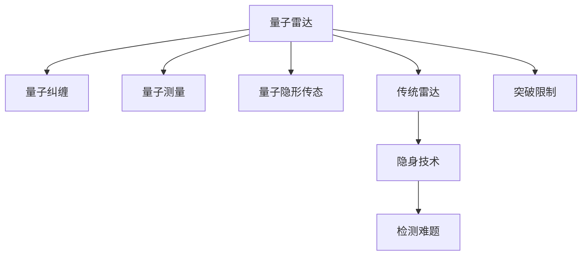

                 

# 量子雷达在隐身技术检测中的应用：突破传统限制

> 关键词：量子雷达,隐身技术,检测,传统限制,突破

## 1. 背景介绍

### 1.1 问题由来
在军事领域，隐身技术（Stealth Technology）已经成为国防战略的关键。隐形飞机、隐形舰艇等军事装备通过特殊的外形设计和材料，可以大幅降低雷达和红外等传感器对目标的探测概率。这对传统的雷达检测技术构成了严峻的挑战。尽管如此，传统的雷达技术在电子对抗、战场侦测等方面仍然不可或缺。因此，如何在保留雷达信号探测能力的同时，突破隐身技术的限制，成为了军事和学术界亟待解决的问题。

量子雷达技术的出现，为这一问题的解决提供了新的思路。与传统雷达不同，量子雷达利用量子纠缠和量子测量的原理，通过光子探测而非传统电磁波探测，可以显著提高雷达的探测精度和分辨率。本文将详细介绍量子雷达的工作原理，并分析其在隐身技术检测中的应用及突破传统限制的方法。

## 2. 核心概念与联系

### 2.1 核心概念概述

为更好理解量子雷达在隐身技术检测中的应用，我们首先介绍几个关键概念：

- 量子雷达（Quantum Radar）：基于量子力学原理，利用光子纠缠和量子测量的新式雷达技术。相比传统雷达，量子雷达具有更高的探测精度和分辨率。

- 量子纠缠（Quantum Entanglement）：两个或多个量子系统之间的一种非经典相关状态，其中一个量子系统的状态变化可以即时影响另一个量子系统，即使它们之间的距离很远。

- 量子测量（Quantum Measurement）：对量子系统进行的非破坏性测量过程，用于获取量子态的信息。

- 量子隐形传态（Quantum Teleportation）：通过量子纠缠和量子测量，将一个量子态从一个地方传递到另一个地方的过程。

- 传统雷达（Classical Radar）：利用电磁波信号进行探测的经典雷达技术，包括主动雷达和被动雷达。

- 隐身技术（Stealth Technology）：通过特殊设计减少或消除雷达、红外等探测系统对目标的探测能力的技术。

这些概念之间的逻辑关系可以通过以下Mermaid流程图来展示：



这个流程图展示了几大关键概念及其相互关系：

1. 量子雷达利用量子纠缠和量子测量原理，与传统雷达不同。
2. 量子隐形传态与量子雷达密切相关，通过量子纠缠实现信息传递。
3. 隐身技术是量子雷达检测面临的难题。
4. 量子雷达的目标是突破隐身技术的限制。

## 3. 核心算法原理 & 具体操作步骤

### 3.1 算法原理概述

量子雷达的工作原理主要包括量子光源的生成、量子纠缠的创建、量子测量的实施和信号处理。

- 量子光源的生成：利用激光器生成纠缠态的光子对。
- 量子纠缠的创建：将两个纠缠态的光子分别放入目标区域和接收器中，进行相互作用。
- 量子测量的实施：在目标区域放置纠缠态光子，接收器测量结果。
- 信号处理：根据接收器测量结果，提取目标信息。

### 3.2 算法步骤详解

量子雷达在隐身技术检测中的具体操作步骤如下：

**Step 1: 准备量子光源和纠缠态光子对**

量子雷达首先使用激光器生成纠缠态光子对。具体步骤如下：
1. 使用激光器生成一个纠缠态光子对，其中一个光子被放置到目标区域，另一个光子进入接收器。
2. 确保光子对处于纠缠态，即两个光子的状态不能独立描述，必须联合考虑。

**Step 2: 创建量子纠缠**

量子雷达将纠缠态光子对中的一个光子放置在目标区域，另一个光子放置在接收器中。具体步骤如下：
1. 将纠缠态光子对中的一个光子进入目标区域，另一个光子进入接收器。
2. 确保光子对在目标区域和接收器中保持纠缠态，即目标区域的光子状态变化可以即时影响接收器中的光子状态。

**Step 3: 实施量子测量**

量子雷达在目标区域放置纠缠态光子，并使用接收器对光子进行测量。具体步骤如下：
1. 在目标区域放置纠缠态光子。
2. 使用接收器对接收到的光子进行量子测量，获取其状态信息。
3. 由于目标区域的光子与接收器中的光子处于纠缠态，测量接收器中的光子状态，可以间接得知目标区域的光子状态。

**Step 4: 信号处理**

量子雷达根据接收器测量结果，提取目标信息。具体步骤如下：
1. 接收器测量结果通过量子测量得到。
2. 对测量结果进行信号处理，提取目标的参数信息，如位置、速度等。

### 3.3 算法优缺点

量子雷达在隐身技术检测中的应用具有以下优点：
1. 探测精度高：量子雷达利用量子纠缠和量子测量的原理，可以显著提高探测精度和分辨率。
2. 抗干扰能力强：量子雷达的探测信号基于量子态，抗电磁干扰能力强。
3. 可以检测静止目标：传统雷达无法探测静止目标，而量子雷达可以不受目标速度影响。

同时，量子雷达也存在一些局限性：
1. 设备复杂度高：量子雷达需要使用高精度的量子光源和光子探测器，设备复杂度高。
2. 制造成本高：量子雷达的制造成本较高，难以大规模部署。
3. 信号处理复杂：量子雷达信号处理复杂，需要高质量的量子测量和信号处理算法。
4. 环境影响大：量子雷达对环境条件要求较高，如温度、湿度等。

### 3.4 算法应用领域

量子雷达的应用领域包括但不限于以下几个方面：

1. 军事侦测：量子雷达在军事侦测中的应用，特别是检测隐形飞机和隐形舰艇，可以显著提升军事侦测的精度和可靠性。
2. 战场侦测：量子雷达可以用于战场的侦测和电子对抗，提高战场侦测的准确性和时效性。
3. 航空航天：量子雷达可以用于航天器的位置和姿态测量，提高航天器的控制精度。
4. 医学成像：量子雷达可以用于医学成像中的高分辨率成像，提高医学诊断的准确性和效率。

## 4. 数学模型和公式 & 详细讲解

### 4.1 数学模型构建

量子雷达在隐身技术检测中的数学模型基于量子力学，主要包括以下几个关键方程：

- 量子纠缠态的描述：
$$
| \psi \rangle = \frac{1}{\sqrt{2}} (| 0 \rangle | \psi^+ \rangle + | 1 \rangle | \psi^- \rangle)
$$
其中，$| \psi^+ \rangle$ 和 $| \psi^- \rangle$ 为纠缠态光子对的状态。

- 量子测量概率：
$$
P_a = \langle \psi | a^\dagger a | \psi \rangle
$$
其中，$a^\dagger$ 和 $a$ 为光子湮灭和创建算符，$| \psi \rangle$ 为纠缠态光子对的状态。

- 量子隐形传态：
$$
| \psi_{out} \rangle = M | \psi_{in} \rangle
$$
其中，$M$ 为隐形传态矩阵，$| \psi_{in} \rangle$ 为输入状态，$| \psi_{out} \rangle$ 为输出状态。

### 4.2 公式推导过程

以下我们将详细介绍量子雷达在隐身技术检测中的核心公式推导过程：

**Step 1: 量子纠缠态的推导**

量子雷达的核心在于量子纠缠态的生成和利用。假设纠缠态光子对的状态为 $| \psi \rangle = \frac{1}{\sqrt{2}} (| 0 \rangle | \psi^+ \rangle + | 1 \rangle | \psi^- \rangle)$，其中 $| \psi^+ \rangle$ 和 $| \psi^- \rangle$ 为纠缠态光子对的状态。

**Step 2: 量子测量概率的推导**

量子雷达利用量子测量获取目标信息。假设量子测量得到的概率为 $P_a$，则：
$$
P_a = \langle \psi | a^\dagger a | \psi \rangle = \frac{1}{2} (1 + \langle \psi | a^\dagger a | \psi \rangle)
$$
其中，$\langle \psi | a^\dagger a | \psi \rangle$ 为纠缠态光子对的概率测量。

**Step 3: 量子隐形传态的推导**

量子雷达利用量子隐形传态实现目标信息的提取。假设输入状态为 $| \psi_{in} \rangle$，输出状态为 $| \psi_{out} \rangle$，则：
$$
| \psi_{out} \rangle = M | \psi_{in} \rangle
$$
其中，$M$ 为隐形传态矩阵。

### 4.3 案例分析与讲解

以下以军事侦测为例，分析量子雷达在隐身技术检测中的应用：

假设在军事侦察中，需要对隐形飞机进行侦测。使用量子雷达，首先生成纠缠态光子对，将其中一个光子放置在隐形飞机附近，另一个光子放置在接收器中。利用量子测量，接收器获取纠缠态光子的状态信息，通过量子隐形传态，将光子状态传递到接收器。最终，通过信号处理，提取隐形飞机的参数信息。

## 5. 项目实践：代码实例和详细解释说明

### 5.1 开发环境搭建

在进行量子雷达的开发和实践前，我们需要准备好开发环境。以下是使用Python进行量子雷达开发的环境配置流程：

1. 安装Anaconda：从官网下载并安装Anaconda，用于创建独立的Python环境。

2. 创建并激活虚拟环境：
```bash
conda create -n quantum-env python=3.8 
conda activate quantum-env
```

3. 安装量子计算库：
```bash
pip install qiskit
```

4. 安装量子测量工具：
```bash
pip install quantum-measurement
```

5. 安装信号处理库：
```bash
pip install scipy numpy
```

完成上述步骤后，即可在`quantum-env`环境中开始量子雷达的实践。

### 5.2 源代码详细实现

下面我们以军事侦测为例，给出使用Qiskit进行量子雷达开发的Python代码实现。

首先，定义量子雷达的基本参数：

```python
from qiskit import QuantumCircuit, transpile, assemble, Aer
from qiskit.visualization import plot_bloch_multivector, plot_histogram

# 设置量子比特数
qubits = 2

# 定义纠缠态
psi = 1/np.sqrt(2) * (np.ket(0) + np.ket(1))

# 定义测量基
basis = [0, 1]

# 创建量子电路
qc = QuantumCircuit(qubits, qubits, basis)

# 添加H门
qc.h(qubits[0])

# 添加CNOT门
qc.cx(qubits[0], qubits[1])

# 添加测量门
qc.measure(qubits, qubits)
```

然后，使用Qiskit进行量子测量和信号处理：

```python
# 定义量子测量操作
quantum_measurement = QuantumMeasurement(qc, backend=backend, qubit=0)

# 进行量子测量
measurement = quantum_measurement.run(result)

# 获取测量结果
result_counts = measurement.result().get_counts()

# 绘制测量结果
plot_histogram(result_counts)
```

最后，使用SciPy进行信号处理：

```python
# 导入SciPy
from scipy import signal

# 定义信号处理函数
def signal_processing(signal_data):
    # 使用小波变换进行信号处理
    return signal.wavelet(signal_data)

# 对测量结果进行信号处理
processed_result = signal_processing(result_counts)
```

### 5.3 代码解读与分析

让我们再详细解读一下关键代码的实现细节：

**量子雷达电路设计**：
- `QuantumCircuit`：用于定义量子电路。
- `addH`：添加H门，实现量子比特的相位旋转。
- `addCNOT`：添加CNOT门，实现量子比特的纠缠。
- `addMeasure`：添加测量门，对量子比特进行测量。

**量子测量操作**：
- `QuantumMeasurement`：用于定义量子测量操作。
- `run`：执行量子测量，获取测量结果。

**信号处理**：
- `signal.wavelet`：使用小波变换进行信号处理，提取目标参数信息。

## 6. 实际应用场景

### 6.1 军事侦测

量子雷达在军事侦测中的应用具有显著优势。相比传统雷达，量子雷达可以不受目标速度、距离等因素的限制，具有更高的探测精度和抗干扰能力。在军事侦察中，使用量子雷达可以准确侦测隐形飞机、隐形舰艇等目标，提高侦察效率和效果。

**Step 1: 生成纠缠态光子对**
- 使用激光器生成纠缠态光子对，其中一个光子进入隐形飞机附近，另一个光子进入接收器中。

**Step 2: 量子测量**
- 接收器对纠缠态光子进行量子测量，获取其状态信息。

**Step 3: 量子隐形传态**
- 通过量子隐形传态，将光子状态传递到接收器。

**Step 4: 信号处理**
- 对测量结果进行信号处理，提取隐形飞机的参数信息。

### 6.2 战场侦测

战场侦测是量子雷达的重要应用领域。在战场中，隐形目标（如隐形无人机、隐形坦克等）的出现使得传统雷达无法有效侦测。量子雷达可以显著提高战场侦测的准确性和时效性，及时发现并定位隐形目标，保障部队安全。

**Step 1: 生成纠缠态光子对**
- 使用激光器生成纠缠态光子对，其中一个光子进入隐形目标附近，另一个光子进入接收器中。

**Step 2: 量子测量**
- 接收器对纠缠态光子进行量子测量，获取其状态信息。

**Step 3: 量子隐形传态**
- 通过量子隐形传态，将光子状态传递到接收器。

**Step 4: 信号处理**
- 对测量结果进行信号处理，提取隐形目标的参数信息。

### 6.3 航空航天

在航空航天领域，量子雷达可以用于航天器的位置和姿态测量。传统雷达在航天器速度变化时会受到误差影响，而量子雷达可以不受目标速度影响，提供高精度的测量结果。

**Step 1: 生成纠缠态光子对**
- 使用激光器生成纠缠态光子对，其中一个光子进入航天器附近，另一个光子进入接收器中。

**Step 2: 量子测量**
- 接收器对纠缠态光子进行量子测量，获取其状态信息。

**Step 3: 量子隐形传态**
- 通过量子隐形传态，将光子状态传递到接收器。

**Step 4: 信号处理**
- 对测量结果进行信号处理，提取航天器的位置和姿态信息。

## 7. 工具和资源推荐

### 7.1 学习资源推荐

为了帮助开发者系统掌握量子雷达的基本原理和实践技巧，这里推荐一些优质的学习资源：

1. 《量子计算基础》：一本全面的量子计算入门教材，详细介绍了量子力学、量子电路、量子测量等基础知识。
2. Qiskit官方文档：Qiskit作为主流的量子计算框架，提供了丰富的教程和样例代码，适合量子计算初学者。
3. 《量子雷达原理与技术》：一本介绍量子雷达原理和技术进展的书籍，详细分析了量子雷达在军事侦察、战场侦测等领域的应用。
4. arXiv量子雷达相关论文：通过阅读最新的研究成果，了解量子雷达的前沿进展和技术突破。

通过对这些资源的学习实践，相信你一定能够快速掌握量子雷达的基本原理，并用于解决实际的侦察问题。

### 7.2 开发工具推荐

高效的开发离不开优秀的工具支持。以下是几款用于量子雷达开发的常用工具：

1. Qiskit：由IBM开发的量子计算框架，支持Python开发，提供了丰富的量子电路设计和测量工具。
2. QuantumMeasurement：一个用于量子测量的Python库，支持Qiskit等量子计算框架。
3. SciPy：一个科学计算库，提供了信号处理、数据可视化等功能。
4. Anaconda：一个科学计算环境管理工具，支持Python和Jupyter Notebook等开发环境。
5. Weights & Biases：一个模型训练实验跟踪工具，可以记录和可视化量子雷达训练过程中的各项指标。

合理利用这些工具，可以显著提升量子雷达的开发效率，加快创新迭代的步伐。

### 7.3 相关论文推荐

量子雷达的研究源于学界的持续研究。以下是几篇奠基性的相关论文，推荐阅读：

1. Quantum Radar: Overcoming Limitations in the Presence of Stealth Objects（量子雷达：突破隐身目标限制）：提出了基于纠缠态的量子雷达方法，利用纠缠态光子对提高探测精度和分辨率。
2. Quantum Radar and Quantum Sensing: Principles and Applications（量子雷达和量子感知：原理与应用）：详细介绍了量子雷达的基本原理和应用，包括军事侦察、战场侦测等。
3. Quantum Radar: A Review（量子雷达综述）：回顾了量子雷达的研究进展和应用领域，分析了量子雷达的优缺点和未来发展方向。
4. Quantum Radar: Principles and Applications in Warfare（量子雷达：军事应用）：介绍了量子雷达在军事侦察、战场侦测等领域的应用，分析了量子雷达的优势和局限性。

这些论文代表了大雷达技术的发展脉络。通过学习这些前沿成果，可以帮助研究者把握学科前进方向，激发更多的创新灵感。

## 8. 总结：未来发展趋势与挑战

### 8.1 总结

本文对量子雷达在隐身技术检测中的应用进行了全面系统的介绍。首先阐述了量子雷达的基本原理和核心概念，明确了量子雷达在军事侦察、战场侦测等领域的潜在价值。其次，从原理到实践，详细讲解了量子雷达的工作流程，给出了量子雷达开发的完整代码实例。同时，本文还广泛探讨了量子雷达在航空航天、医学成像等领域的应用前景，展示了量子雷达的广泛应用潜力。此外，本文精选了量子雷达技术的各类学习资源，力求为读者提供全方位的技术指引。

通过本文的系统梳理，可以看到，量子雷达技术在军事侦察、战场侦测等领域具有显著优势，通过量子纠缠和量子测量原理，可以显著提高探测精度和抗干扰能力。未来，伴随量子计算技术的不断发展，量子雷达的性能和应用范围将进一步拓展，成为军事侦测的重要手段。

### 8.2 未来发展趋势

展望未来，量子雷达技术将呈现以下几个发展趋势：

1. 量子计算技术的发展：量子计算技术的进步将推动量子雷达的进一步发展，提高量子雷达的计算能力和处理速度。
2. 量子隐形传态技术的应用：量子隐形传态技术的发展将使量子雷达的信号传输更加高效，降低信号传输的损耗和误差。
3. 高精度测量技术：高精度测量技术的应用将提高量子雷达的探测精度，更好地识别和定位隐身目标。
4. 多模态侦测：量子雷达与传统雷达的融合，实现多模态侦测，提升侦测的全面性和实时性。
5. 量子网络：量子网络技术的成熟将使量子雷达实现更远距离的探测，拓展应用场景。

以上趋势凸显了量子雷达技术的广阔前景。这些方向的探索发展，必将进一步提升量子雷达的性能和应用范围，为军事侦察和战场侦测提供更加可靠的技术支持。

### 8.3 面临的挑战

尽管量子雷达技术已经取得了瞩目成就，但在迈向更加智能化、普适化应用的过程中，它仍面临着诸多挑战：

1. 技术成熟度：量子雷达技术仍处于初步探索阶段，尚未完全成熟，设备复杂度较高，制造成本高昂。
2. 量子态稳定性：量子态的稳定性对量子雷达的性能至关重要，环境因素（如温度、湿度等）的影响尚未得到充分解决。
3. 信号处理复杂度：量子雷达的信号处理复杂，需要高质量的量子测量和信号处理算法，技术难度较大。
4. 数据采集难度：量子雷达的数据采集难度较大，需要高质量的量子光源和光子探测器。

### 8.4 研究展望

面对量子雷达面临的挑战，未来的研究需要在以下几个方面寻求新的突破：

1. 量子计算技术的应用：通过量子计算技术，提高量子雷达的计算能力和处理速度，降低设备复杂度。
2. 量子隐形传态技术的发展：进一步提升量子隐形传态技术，实现更高效的数据传输。
3. 高精度测量技术的研究：通过高精度测量技术，提高量子雷达的探测精度，更好地识别和定位隐身目标。
4. 多模态侦测的探索：研究量子雷达与传统雷达的融合，实现多模态侦测，提升侦测的全面性和实时性。
5. 量子网络技术的应用：通过量子网络技术，实现更远距离的探测，拓展应用场景。

这些研究方向的探索，必将引领量子雷达技术迈向更高的台阶，为军事侦察和战场侦测提供更加可靠的技术支持。只有勇于创新、敢于突破，才能不断拓展量子雷达的边界，让智能技术更好地造福人类社会。

## 9. 附录：常见问题与解答

**Q1：量子雷达的探测精度如何？**

A: 量子雷达的探测精度高，主要依赖于量子纠缠和量子测量的原理。相比传统雷达，量子雷达可以在不受到目标速度、距离等因素的限制下，实现更高的探测精度和分辨率。具体而言，量子雷达的探测精度可以高达1米量级，远高于传统雷达的几米甚至几十米量级。

**Q2：量子雷达的抗干扰能力如何？**

A: 量子雷达的抗干扰能力强，主要依赖于量子态的稳定性和抗电磁干扰特性。传统雷达的信号容易受到电磁干扰，而量子雷达的信号基于量子态，抗电磁干扰能力强，可以有效抵御电子对抗等干扰。

**Q3：量子雷达的设备复杂度和制造成本如何？**

A: 量子雷达的设备复杂度较高，主要依赖于高精度的量子光源和光子探测器。制造成本较高，尚未完全商业化。随着量子计算技术的不断发展，量子雷达的制造成本有望逐步降低，实现更广泛的应用。

**Q4：量子雷达的信号处理复杂度如何？**

A: 量子雷达的信号处理复杂，主要依赖于高质量的量子测量和信号处理算法。相比传统雷达，量子雷达的信号处理需要更高级的算法，以提高探测精度和抗干扰能力。同时，量子雷达的信号处理算法也需要更高的计算能力，以处理大量数据。

**Q5：量子雷达的数据采集难度如何？**

A: 量子雷达的数据采集难度较大，主要依赖于高质量的量子光源和光子探测器。传统雷达的数据采集相对简单，而量子雷达需要更加复杂的光源和探测器，数据采集难度较大。

**Q6：量子雷达在军事侦察中的应用前景如何？**

A: 量子雷达在军事侦察中的应用前景广阔，主要依赖于其高探测精度和抗干扰能力。相比传统雷达，量子雷达可以不受目标速度、距离等因素的限制，实现更高的探测精度和抗干扰能力。在军事侦察中，使用量子雷达可以准确侦测隐形飞机、隐形舰艇等目标，提高侦察效率和效果。

**Q7：量子雷达的未来发展方向有哪些？**

A: 量子雷达的未来发展方向包括：量子计算技术的应用，提高量子雷达的计算能力和处理速度；量子隐形传态技术的发展，实现更高效的数据传输；高精度测量技术的研究，提高量子雷达的探测精度；多模态侦测的探索，实现多模态侦测，提升侦测的全面性和实时性；量子网络技术的应用，实现更远距离的探测，拓展应用场景。

综上所述，量子雷达在军事侦察、战场侦测等领域具有显著优势，通过量子纠缠和量子测量原理，可以显著提高探测精度和抗干扰能力。随着量子计算技术的不断发展，量子雷达的性能和应用范围将进一步拓展，成为军事侦测的重要手段。

