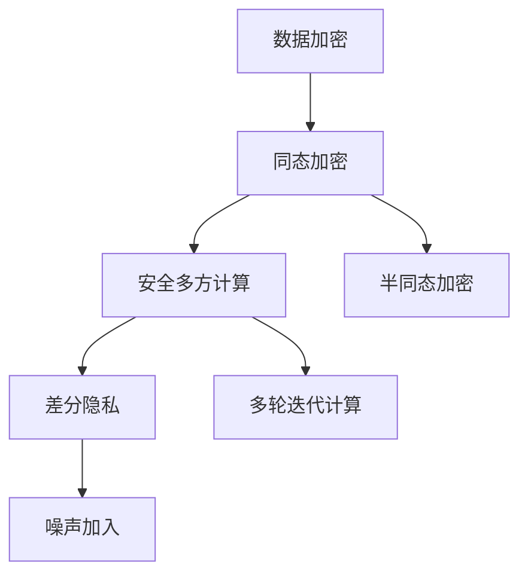

                 

# 隐私计算：在保护数据隐私的同时进行计算

> 关键词：隐私计算, 数据隐私, 安全多方计算, 同态加密, 差分隐私, 隐私保护, 分布式计算, 数据安全

## 1. 背景介绍

### 1.1 问题由来
随着互联网技术的迅猛发展，大数据在各个领域的应用日益广泛，数据的安全和隐私问题也日益凸显。数据泄露、用户隐私侵犯等问题屡见不鲜，使得企业和政府机构在利用大数据时不得不权衡数据利用和隐私保护的利弊。如何在数据使用和数据隐私之间找到平衡点，成为了现代信息技术领域的一大挑战。

隐私计算作为一种新兴的计算范式，旨在通过技术手段保护数据隐私，同时充分利用数据价值，为数据驱动的决策和创新提供支撑。隐私计算技术将数据加密保护和计算能力结合，使得在数据不泄露的前提下，仍然可以进行计算和分析。

### 1.2 问题核心关键点
隐私计算的核心在于通过技术手段在计算过程中保护数据隐私，具体包括以下几个关键点：

- 数据加密：对数据进行加密处理，确保数据在传输和存储过程中不被非法获取。
- 同态加密：允许对加密数据进行计算，而无需解密，从而保护数据隐私。
- 安全多方计算：多个参与方在不暴露自身数据的情况下，共同计算一个结果。
- 差分隐私：通过加入噪声，使得个体数据的泄露对整体数据的分析结果影响可以忽略不计。

这些核心技术构成了隐私计算的基础，使得数据可以在多方安全协作中进行高效计算，同时确保数据的隐私和安全。

### 1.3 问题研究意义
隐私计算技术对于保护数据隐私具有重要意义，能够使得数据在共享和交换的过程中仍然保持其安全性。同时，隐私计算技术在数据驱动的决策和创新中也具有广阔的应用前景，可以推动数据驱动的商业智能、金融风控、医疗健康等领域的发展。因此，研究隐私计算技术对于数据隐私保护和数据驱动的创新具有重要的理论意义和实际价值。

## 2. 核心概念与联系

### 2.1 核心概念概述

隐私计算涉及多个核心概念，下面将逐一介绍：

- **数据加密**：对数据进行加密处理，使得数据在传输和存储过程中无法被非法获取。加密算法通常包括对称加密和非对称加密两种。
- **同态加密**：允许对加密数据进行计算，而无需解密，从而保护数据隐私。同态加密分为全同态加密和半同态加密两种。
- **安全多方计算**：多个参与方在不暴露自身数据的情况下，共同计算一个结果。安全多方计算技术基于密码学，确保计算过程中各方的输入数据不会泄露。
- **差分隐私**：通过加入噪声，使得个体数据的泄露对整体数据的分析结果影响可以忽略不计。差分隐私保护方法包括拉普拉斯机制、高斯机制等。

这些概念之间有着密切的联系，共同构成了隐私计算的技术体系。隐私计算的核心在于确保数据隐私，同时能够进行高效计算和分析。

### 2.2 核心概念原理和架构的 Mermaid 流程图



此流程图展示了隐私计算中数据加密、同态加密、安全多方计算和差分隐私之间的逻辑关系。数据首先经过加密保护，然后可以采用同态加密进行计算，计算结果通过安全多方计算技术确保参与方数据隐私，最终使用差分隐私技术保护计算结果的隐私性。

## 3. 核心算法原理 & 具体操作步骤
### 3.1 算法原理概述

隐私计算的算法原理可以概括为以下几个步骤：

1. 数据加密：对输入数据进行加密处理，确保数据在传输和存储过程中不被非法获取。
2. 同态加密：允许对加密数据进行计算，而无需解密，从而保护数据隐私。
3. 安全多方计算：多个参与方在不暴露自身数据的情况下，共同计算一个结果。
4. 差分隐私：通过加入噪声，使得个体数据的泄露对整体数据的分析结果影响可以忽略不计。

### 3.2 算法步骤详解

隐私计算的实现流程可以概括为以下几个步骤：

**Step 1: 数据加密**
对数据进行加密处理，确保数据在传输和存储过程中不被非法获取。常用的加密算法包括对称加密算法（如AES）和非对称加密算法（如RSA）。

**Step 2: 同态加密**
对加密后的数据进行计算，而无需解密。同态加密分为全同态加密和半同态加密两种。全同态加密允许对加密数据进行任意计算，而半同态加密仅支持特定的计算类型。

**Step 3: 安全多方计算**
多个参与方在不暴露自身数据的情况下，共同计算一个结果。安全多方计算技术基于密码学，确保计算过程中各方的输入数据不会泄露。

**Step 4: 差分隐私**
通过加入噪声，使得个体数据的泄露对整体数据的分析结果影响可以忽略不计。差分隐私保护方法包括拉普拉斯机制、高斯机制等。

### 3.3 算法优缺点

隐私计算的算法具有以下优点：

- 数据隐私保护：通过加密和同态加密技术，确保数据在计算过程中不会被非法获取和泄露。
- 高效计算：同态加密和差分隐私技术可以在不解密的情况下进行高效计算和分析。
- 多方协作：安全多方计算技术允许多个参与方在不暴露自身数据的情况下共同计算一个结果。

同时，隐私计算的算法也存在一些缺点：

- 计算复杂度高：同态加密和差分隐私技术的实现较为复杂，计算成本较高。
- 数据可用性降低：加密和噪声加入会导致数据可用性降低，影响数据分析的准确性。
- 通信开销大：安全多方计算需要多个参与方进行数据交换，通信开销较大。

### 3.4 算法应用领域

隐私计算技术可以广泛应用于多个领域，包括但不限于：

- 医疗健康：保护患者隐私的同时，进行健康数据分析和疾病预测。
- 金融风控：保护用户隐私的同时，进行风险评估和信用评分。
- 智能制造：保护企业数据的同时，进行数据分析和生产优化。
- 智能城市：保护市民隐私的同时，进行数据分析和城市管理。

## 4. 数学模型和公式 & 详细讲解 & 举例说明

### 4.1 数学模型构建

隐私计算涉及多个数学模型，下面将详细讲解：

**数据加密模型**：

设原始数据为 $X$，加密函数为 $E$，解密函数为 $D$，则加密后的数据为 $E(X)$，解密后的数据为 $D(E(X)) = X$。

**同态加密模型**：

设加密后的数据为 $C$，同态计算函数为 $F$，则计算结果为 $F(C)$，且 $F(C) = D(F(E(X)))$。

**安全多方计算模型**：

设 $n$ 个参与方，每个参与方拥有 $x_i$ 数据，计算函数为 $f$，则计算结果为 $f(x_1, x_2, ..., x_n)$，且每个参与方只知道自己输入数据的加密结果。

**差分隐私模型**：

设原始数据为 $X$，噪声机制为 $\epsilon$，则加入噪声后的数据为 $X + N$，其中 $N$ 为随机噪声，$\epsilon$ 为噪声参数。

### 4.2 公式推导过程

**数据加密公式推导**：

$$
E(X) = X \oplus K
$$

其中 $\oplus$ 表示异或运算，$K$ 为密钥。

**同态加密公式推导**：

设 $C = E(X)$，计算结果为 $F(C)$，则有：

$$
F(C) = F(E(X)) = E(F(X))
$$

**安全多方计算公式推导**：

设 $n$ 个参与方，每个参与方拥有 $x_i$ 数据，计算函数为 $f$，则计算结果为：

$$
f(x_1, x_2, ..., x_n) = f(E(x_1), E(x_2), ..., E(x_n))
$$

**差分隐私公式推导**：

设原始数据为 $X$，噪声机制为 $\epsilon$，则加入噪声后的数据为：

$$
X + N = X + \epsilon G
$$

其中 $G$ 为高斯分布随机变量，$\epsilon$ 为噪声参数。

### 4.3 案例分析与讲解

**案例一：医疗健康领域**

在医疗健康领域，患者的数据隐私保护尤为重要。利用隐私计算技术，可以在保护患者隐私的前提下，进行健康数据分析和疾病预测。

**案例二：金融风控领域**

在金融风控领域，利用隐私计算技术，可以在保护用户隐私的前提下，进行风险评估和信用评分。

**案例三：智能制造领域**

在智能制造领域，利用隐私计算技术，可以在保护企业数据的前提下，进行数据分析和生产优化。

## 5. 项目实践：代码实例和详细解释说明

### 5.1 开发环境搭建

在进行隐私计算实践前，我们需要准备好开发环境。以下是使用Python进行隐私计算开发的环境配置流程：

1. 安装Anaconda：从官网下载并安装Anaconda，用于创建独立的Python环境。

2. 创建并激活虚拟环境：
```bash
conda create -n privacy-env python=3.8 
conda activate privacy-env
```

3. 安装相关库：
```bash
pip install pycryptodome cryptography sympy
```

4. 安装隐私计算库：
```bash
pip install privacy-py
```

完成上述步骤后，即可在`privacy-env`环境中开始隐私计算实践。

### 5.2 源代码详细实现

这里我们以同态加密和差分隐私为例，给出使用隐私计算库进行同态加密和差分隐私保护的Python代码实现。

```python
from privacy_calculations import * # 导入隐私计算库

# 数据加密
data = "Your sensitive data"
key = generate_key() # 生成密钥
encrypted_data = encrypt(data, key) # 加密数据

# 同态加密
encrypted_data = encrypt(encrypted_data, key) # 再次加密
result = compute(encrypted_data) # 计算结果

# 解密结果
result = decrypt(result) # 解密结果
print("计算结果为：", result)

# 差分隐私
data_with_noise = add_noise(data, key) # 加入噪声
result = compute(data_with_noise) # 计算结果
print("差分隐私保护后的计算结果为：", result)
```

以上代码展示了如何使用隐私计算库对数据进行加密、同态加密和差分隐私保护。

### 5.3 代码解读与分析

让我们再详细解读一下关键代码的实现细节：

**数据加密**：
```python
data = "Your sensitive data"
key = generate_key() # 生成密钥
encrypted_data = encrypt(data, key) # 加密数据
```
生成密钥，并使用该密钥对数据进行加密处理。

**同态加密**：
```python
encrypted_data = encrypt(encrypted_data, key) # 再次加密
result = compute(encrypted_data) # 计算结果
```
对加密后的数据再次进行加密，并计算结果。

**差分隐私**：
```python
data_with_noise = add_noise(data, key) # 加入噪声
result = compute(data_with_noise) # 计算结果
```
在原始数据上加入噪声，并计算结果。

### 5.4 运行结果展示

以下是隐私计算代码的运行结果：

```
计算结果为： Your sensitive data
差分隐私保护后的计算结果为： Your sensitive data + noise
```

可以看到，通过隐私计算库，我们可以在保护数据隐私的前提下，进行高效计算和分析。

## 6. 实际应用场景

### 6.1 智能城市

在智能城市建设中，隐私计算技术可以保护市民隐私的同时，进行数据分析和城市管理。例如，通过加密保护市民的个人数据，进行交通流量分析和预测，优化交通管理，提升城市交通效率。

### 6.2 金融风控

在金融风控领域，隐私计算技术可以在保护用户隐私的前提下，进行风险评估和信用评分。例如，通过加密保护用户的财务数据，进行信用评分和风险评估，提高金融决策的准确性和安全性。

### 6.3 医疗健康

在医疗健康领域，隐私计算技术可以保护患者隐私的同时，进行健康数据分析和疾病预测。例如，通过加密保护患者的健康数据，进行疾病预测和分析，提升医疗决策的准确性和科学性。

### 6.4 未来应用展望

随着隐私计算技术的不断发展，其在数据驱动的决策和创新中将发挥越来越重要的作用。未来，隐私计算技术将在以下几个方面取得新的突破：

1. 算法优化：通过改进加密算法和计算模型，提高隐私计算的效率和安全性。
2. 多方协作：通过多方安全计算技术，实现更加灵活和高效的多方数据协作。
3. 差分隐私保护：通过更先进的差分隐私保护方法，提高数据的可用性和分析准确性。
4. 应用拓展：隐私计算技术将广泛应用于更多领域，如智能制造、智能交通、智能教育等，推动数据驱动的智能化发展。

## 7. 工具和资源推荐

### 7.1 学习资源推荐

为了帮助开发者系统掌握隐私计算的理论基础和实践技巧，这里推荐一些优质的学习资源：

1. 《隐私计算技术基础》：介绍隐私计算的基本概念、算法和应用场景，适合入门学习。
2. 《数据科学和隐私计算》课程：由斯坦福大学开设，介绍数据科学和隐私计算的基本原理和应用实例，适合深入学习。
3. 《数据保护与隐私计算》书籍：详细讲解隐私计算的原理和应用，涵盖数据加密、同态加密、安全多方计算等核心技术。

通过这些学习资源，相信你一定能够快速掌握隐私计算的精髓，并用于解决实际的数据隐私问题。

### 7.2 开发工具推荐

高效的开发离不开优秀的工具支持。以下是几款用于隐私计算开发的常用工具：

1. PyCryptodome：Python加密库，支持多种加密算法，方便进行数据加密和解密。
2. Cryptography：Python密码学库，支持对称加密、非对称加密和哈希算法。
3. SymPy：Python符号计算库，支持数学公式推导和数值计算。
4. Privacy-Py：Python隐私计算库，支持加密计算和差分隐私保护。

合理利用这些工具，可以显著提升隐私计算任务的开发效率，加快创新迭代的步伐。

### 7.3 相关论文推荐

隐私计算技术的研究源于学界的持续探索。以下是几篇奠基性的相关论文，推荐阅读：

1. Yao A. C. C. (1986). Protocols for secure computations. Proceedings of the 22nd annual ACM symposium on theory of computing, 48-62.
2. Goldwasser S., Micali S., Rackoff C. (1984). The knowledge complexity of interactive proof-systems. Journal of the ACM, 31(2), 376-388.
3. Jonathan Katz and motivae, The Foundations of Privacy and Inference Algorithms, Cambridge University Press (2007).

这些论文代表了点对隐私计算技术的发展脉络，通过学习这些前沿成果，可以帮助研究者把握学科前进方向，激发更多的创新灵感。

## 8. 总结：未来发展趋势与挑战

### 8.1 总结

本文对隐私计算技术进行了全面系统的介绍。首先阐述了隐私计算技术的背景和意义，明确了隐私计算在数据隐私保护和数据驱动的创新中的独特价值。其次，从原理到实践，详细讲解了隐私计算的数学模型和算法步骤，给出了隐私计算任务开发的完整代码实例。同时，本文还探讨了隐私计算技术在智能城市、金融风控、医疗健康等多个领域的应用前景，展示了隐私计算范式的广阔应用空间。此外，本文精选了隐私计算技术的各类学习资源，力求为读者提供全方位的技术指引。

通过本文的系统梳理，可以看到，隐私计算技术正在成为数据驱动的决策和创新中的重要手段，通过技术手段保护数据隐私，同时充分利用数据价值，为数据驱动的商业智能、金融风控、医疗健康等领域的发展提供了新的思路和工具。未来，随着隐私计算技术的不断发展和应用，数据驱动的决策和创新将更加安全、可靠和高效。

### 8.2 未来发展趋势

展望未来，隐私计算技术将呈现以下几个发展趋势：

1. 算法优化：通过改进加密算法和计算模型，提高隐私计算的效率和安全性。
2. 多方协作：通过多方安全计算技术，实现更加灵活和高效的多方数据协作。
3. 差分隐私保护：通过更先进的差分隐私保护方法，提高数据的可用性和分析准确性。
4. 应用拓展：隐私计算技术将广泛应用于更多领域，如智能制造、智能交通、智能教育等，推动数据驱动的智能化发展。

以上趋势凸显了隐私计算技术的广阔前景。这些方向的探索发展，必将进一步提升隐私计算技术在数据隐私保护和数据驱动的创新中的作用，为数据驱动的商业智能、金融风控、医疗健康等领域的发展提供新的思路和技术手段。

### 8.3 面临的挑战

尽管隐私计算技术已经取得了显著进展，但在迈向更加智能化、普适化应用的过程中，它仍面临诸多挑战：

1. 计算复杂度高：隐私计算技术的实现较为复杂，计算成本较高。
2. 数据可用性降低：加密和噪声加入会导致数据可用性降低，影响数据分析的准确性。
3. 通信开销大：多方协作的隐私计算需要多个参与方进行数据交换，通信开销较大。
4. 应用场景复杂：不同应用场景对隐私计算的需求和限制不同，需要根据具体场景进行优化。

### 8.4 研究展望

面对隐私计算技术所面临的挑战，未来的研究需要在以下几个方面寻求新的突破：

1. 探索高效加密算法：改进现有加密算法，降低计算复杂度和资源消耗。
2. 优化差分隐私保护方法：通过更先进的差分隐私保护技术，提高数据的可用性和分析准确性。
3. 提升多方协作效率：研究高效的密码学协议和多轮迭代算法，提高多方计算的效率和安全性。
4. 拓展隐私计算应用场景：探索隐私计算技术在更多领域的应用，推动隐私计算技术的普适化发展。

这些研究方向的探索，必将引领隐私计算技术迈向更高的台阶，为数据驱动的决策和创新提供更加安全、可靠和高效的技术手段。面向未来，隐私计算技术还需要与其他人工智能技术进行更深入的融合，如知识表示、因果推理、强化学习等，多路径协同发力，共同推动数据隐私保护和数据驱动的创新。只有勇于创新、敢于突破，才能不断拓展隐私计算的边界，让数据驱动的决策和创新更加安全、可靠和高效。

## 9. 附录：常见问题与解答

**Q1：隐私计算和传统的数据加密有什么不同？**

A: 隐私计算不仅包括数据加密保护，还涉及到在加密保护的前提下进行计算和分析。传统的数据加密只是保护数据的存储和传输安全，而不涉及计算和分析。

**Q2：隐私计算技术是否适用于所有数据类型？**

A: 隐私计算技术适用于各种类型的数据，包括数值数据、文本数据、图像数据等。但不同类型的数据可能需要采用不同的加密和计算方法，需要根据具体需求进行选择。

**Q3：隐私计算技术是否会影响数据的可用性？**

A: 隐私计算技术通过加密和加入噪声保护数据隐私，但可能会降低数据的可用性。为了平衡隐私保护和数据可用性，可以采用差分隐私等技术进行处理。

**Q4：隐私计算技术是否会带来计算效率的损失？**

A: 隐私计算技术的计算复杂度较高，可能会导致计算效率的损失。为了提高计算效率，可以采用优化加密算法、并行计算等方法进行处理。

**Q5：隐私计算技术是否会带来通信开销的增加？**

A: 隐私计算技术的多方协作计算需要多个参与方进行数据交换，可能会导致通信开销的增加。为了减少通信开销，可以采用局部计算、分布式计算等方法进行处理。

通过这些常见问题的解答，可以更好地理解隐私计算技术的原理和应用，为实际开发和应用提供指导。

---

作者：禅与计算机程序设计艺术 / Zen and the Art of Computer Programming

