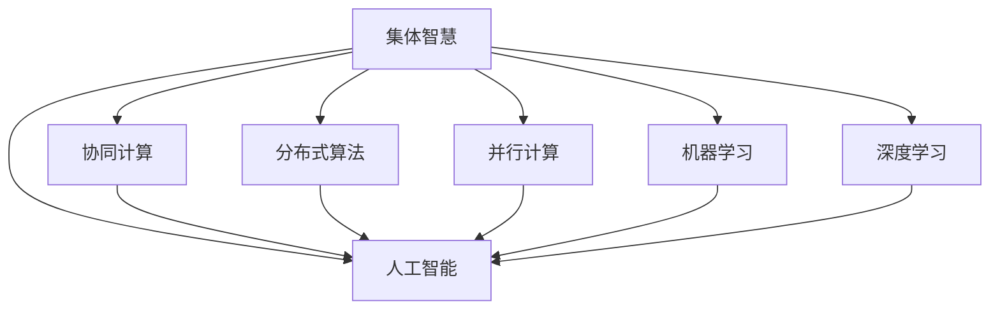

                 

# 集体智慧：解决复杂问题的创新思路

> 关键词：集体智慧,复杂问题,协同计算,分布式算法,并行计算,机器学习,深度学习,人工智能

## 1. 背景介绍

### 1.1 问题由来
在现代社会，信息量和复杂性呈指数级增长，个体智慧已难以应对。复杂问题往往涉及多个领域，需要跨学科、跨机构的知识融合与协作。

人工智能(AI)和大数据技术的兴起，为解决复杂问题提供了新的思路。AI和大数据能够处理海量数据，发现隐藏的模式和规律，提供精准的预测和决策支持。集体智慧（Collective Intelligence），即通过智能系统和算法，将个体的智慧集中起来，形成集体的力量，解决复杂问题。

在科技、医疗、环保、金融等多个领域，集体智慧的应用已经展示了强大的潜能。如何在实践中高效利用集体智慧，开发出高效、可靠的AI算法，是当前亟待解决的问题。本文将对集体智慧的算法原理与操作步骤进行详细阐述，并结合实际案例进行分析，探讨未来发展趋势与挑战。

### 1.2 问题核心关键点
集体智慧的核心在于如何构建一个能够有效协同的智能系统，利用AI和大数据技术，将个体的智慧融合为集体智慧。关键点包括：

1. **数据集成与共享**：如何将不同来源的数据集整合并共享，形成一个统一的数据库。
2. **算法优化与设计**：如何设计高效、鲁棒的算法，处理数据挖掘、模型训练、预测分析等任务。
3. **系统集成与优化**：如何将各种智能模块（如数据处理、模型训练、决策优化等）集成在一起，形成一个高效的系统。
4. **协同与协作**：如何设计协同机制，使个体能够相互配合，共同解决复杂问题。

## 2. 核心概念与联系

### 2.1 核心概念概述

为更好地理解集体智慧，本节将介绍几个密切相关的核心概念：

- **集体智慧（Collective Intelligence, CI）**：通过智能系统和算法，将多个个体的智慧集中起来，形成集体的力量，解决复杂问题。

- **协同计算（Collaborative Computing）**：多个计算节点协同工作，共同完成任务。

- **分布式算法（Distributed Algorithms）**：在多个计算节点上分布式运行，以提高计算效率。

- **并行计算（Parallel Computing）**：在同一时刻在多个计算节点上同时进行计算，以加速计算过程。

- **机器学习（Machine Learning, ML）**：通过算法让计算机从数据中自动学习规律，提升决策能力。

- **深度学习（Deep Learning, DL）**：一种特殊的机器学习技术，通过多层次神经网络结构，实现复杂模式识别和决策。

- **人工智能（Artificial Intelligence, AI）**：使计算机能够模拟人类智能，解决复杂问题。

这些核心概念之间的逻辑关系可以通过以下Mermaid流程图来展示：



这个流程图展示了你核心概念之间的逻辑关系：

1. 集体智慧通过协同计算、分布式算法、并行计算、机器学习、深度学习和人工智能等技术，实现个体智慧的整合与提升。
2. 协同计算、分布式算法、并行计算等技术，为集体智慧提供高效、灵活的计算框架。
3. 机器学习和深度学习提供强大的数据分析和决策支持，提升集体智慧的智能化水平。
4. 人工智能使计算机具备类似人类的智能，从根本上提升集体智慧的解决能力。

## 3. 核心算法原理 & 具体操作步骤
### 3.1 算法原理概述

集体智慧的核心算法包括协同算法、分布式算法、并行算法、机器学习和深度学习算法等。它们通过协同工作，将多个个体的智慧整合为一个强大的集体智慧。

协同算法通过协调不同个体的工作，确保各个节点间的信息共享和同步，形成一个高效的工作机制。分布式算法通过将任务分散到多个节点上执行，提高计算效率和资源利用率。并行算法通过在同一时刻在多个节点上同时计算，加速计算过程。机器学习和深度学习算法通过从大量数据中学习规律，提供精准的预测和决策支持。

### 3.2 算法步骤详解

集体智慧的算法步骤大致如下：

**Step 1: 数据集成与共享**

1. **数据收集**：从不同来源收集数据，如传感器、数据库、文件等。

2. **数据清洗**：去除噪声和错误，保证数据质量。

3. **数据标准化**：将不同格式的数据转换为统一格式，便于后续处理。

4. **数据共享**：建立一个共享机制，使不同节点可以访问和使用数据。

**Step 2: 协同算法设计**

1. **设计通信协议**：定义不同节点间的通信规则和格式。

2. **实现协同算法**：设计协同算法，如分布式共识算法、Paxos算法等。

3. **实现同步机制**：确保节点间的数据一致性和同步性。

4. **测试和优化**：对协同算法进行测试，优化性能和稳定性。

**Step 3: 分布式算法设计**

1. **任务划分**：将任务划分为多个子任务，分配到不同节点上。

2. **设计分布式算法**：如MapReduce、Spark等，实现任务的并行计算。

3. **实现数据并行**：将数据切分为多个部分，并行处理。

4. **实现结果聚合**：将各个节点的计算结果合并，得到最终结果。

**Step 4: 并行算法设计**

1. **任务划分**：将任务划分为多个并行子任务。

2. **设计并行算法**：如MPI、CUDA等，实现任务的多线程和并行计算。

3. **实现数据共享**：使用共享内存或消息传递，保证数据在节点间的传输和访问。

4. **实现任务调度**：动态调整任务调度，优化资源利用率。

**Step 5: 机器学习和深度学习算法设计**

1. **数据预处理**：对数据进行归一化、特征提取等预处理。

2. **模型选择**：选择适合的机器学习或深度学习模型，如线性回归、决策树、神经网络等。

3. **模型训练**：使用训练数据训练模型。

4. **模型评估**：使用测试数据评估模型性能。

5. **模型优化**：通过调整超参数、增加数据量等方法，优化模型。

**Step 6: 集成与优化**

1. **模块集成**：将数据处理、模型训练、决策优化等模块集成在一起。

2. **系统优化**：对系统进行性能优化，如加速计算、减少资源消耗等。

3. **系统部署**：将系统部署到实际环境中，进行测试和调整。

### 3.3 算法优缺点

集体智慧算法的主要优点包括：

1. **高效计算**：通过分布式和并行计算，提高计算效率和资源利用率。

2. **可扩展性**：系统可以根据需求动态扩展，适应不同规模的任务。

3. **鲁棒性强**：通过冗余和容错机制，提高系统的稳定性和可靠性。

4. **灵活性高**：算法可以根据需求进行调整和优化。

5. **智能化水平高**：机器学习和深度学习算法提供强大的数据分析和决策支持。

但是，集体智慧算法也存在一些缺点：

1. **协调复杂**：协同计算和分布式算法需要复杂的管理和协调机制。

2. **通信开销大**：数据和通信开销增加，对网络带宽和延迟有较高要求。

3. **资源消耗高**：需要大量的计算资源和存储空间。

4. **算法复杂**：算法设计和实现较为复杂，需要较高的技术水平。

5. **数据隐私风险**：数据共享可能带来隐私和安全问题。

## 4. 数学模型和公式 & 详细讲解  
### 4.1 数学模型构建

本节将使用数学语言对集体智慧算法进行更加严格的刻画。

记系统中有 $N$ 个节点，每个节点 $i$ 的计算能力为 $C_i$，总计算能力为 $C$。数据量为 $D$，数据传输速率为 $R$，数据共享策略为 $S$。

定义系统的计算效率 $E$ 为：

$$
E = \frac{C}{\sum_{i=1}^N C_i}
$$

系统的通信开销 $C$ 为：

$$
C = D \cdot R \cdot \frac{1}{\sum_{i=1}^N C_i}
$$

系统的总资源消耗 $R$ 为：

$$
R = D \cdot C + C
$$

系统的总时间 $T$ 为：

$$
T = \frac{D}{R} + \frac{R}{E}
$$

其中 $D$ 为数据量，$C$ 为计算能力，$R$ 为数据传输速率。

### 4.2 公式推导过程

以下我们以一个简单的协同算法为例，推导其效率和资源消耗的公式。

假设系统中有 $N$ 个节点，每个节点的计算能力为 $C_i$，数据量为 $D$，数据传输速率为 $R$，节点间的数据共享策略为 $S$。

**算法效率分析**：

假设每个节点独立计算任务的一部分，节点间共享数据。设每个节点计算任务的时间为 $T_i$，则总计算时间为 $T = \sum_{i=1}^N T_i$。

假设节点间的数据传输时间为 $T_c$，则总通信时间为 $C = N \cdot T_c$。

系统总计算时间 $T$ 和通信时间 $C$ 的和为系统总时间 $T + C$。

**算法资源消耗分析**：

每个节点消耗的计算资源为 $C_i \cdot T_i$，总计算资源消耗为 $R = \sum_{i=1}^N C_i \cdot T_i$。

每个节点消耗的通信资源为 $C \cdot T_c$，总通信资源消耗为 $C = \sum_{i=1}^N C_i \cdot T_c$。

总资源消耗 $R$ 为计算资源和通信资源的和。

### 4.3 案例分析与讲解

**案例：协同训练机器学习模型**

假设一个协同训练任务，使用 $N$ 个节点协同训练一个机器学习模型。每个节点在 $T_i$ 时间内计算任务的一部分，节点间共享模型参数。

假设每个节点计算任务的时间为 $T_i$，则总计算时间为 $T = \sum_{i=1}^N T_i$。

假设节点间的数据传输时间为 $T_c$，则总通信时间为 $C = N \cdot T_c$。

每个节点消耗的计算资源为 $C_i \cdot T_i$，总计算资源消耗为 $R = \sum_{i=1}^N C_i \cdot T_i$。

每个节点消耗的通信资源为 $C \cdot T_c$，总通信资源消耗为 $C = \sum_{i=1}^N C_i \cdot T_c$。

总时间 $T + C$ 和总资源消耗 $R$ 的公式分别为：

$$
T = \sum_{i=1}^N T_i
$$

$$
C = N \cdot T_c
$$

$$
R = \sum_{i=1}^N C_i \cdot T_i + C
$$

实际应用中，还需要根据具体算法和数据特点进行进一步的优化。

## 5. 项目实践：代码实例和详细解释说明
### 5.1 开发环境搭建

在进行集体智慧项目开发前，需要准备以下开发环境：

1. 安装Python：从官网下载并安装Python，用于编写代码和运行算法。

2. 安装相关库：安装Scikit-learn、TensorFlow、PyTorch等常用机器学习和深度学习库。

3. 安装分布式计算库：安装Apache Spark、Apache MPI等分布式计算库，用于并行计算和数据共享。

4. 安装监控工具：安装Prometheus、Grafana等监控工具，实时监测系统性能和资源消耗。

5. 配置环境变量：设置环境变量，如Spark集群配置、MPI节点配置等。

完成上述步骤后，即可开始集体智慧项目的开发。

### 5.2 源代码详细实现

这里我们以一个简单的协同训练为例，展示集体智慧项目的代码实现。

```python
from mpi4py import MPI
import numpy as np

# 初始化MPI环境
comm = MPI.COMM_WORLD
rank = comm.Get_rank()
size = comm.Get_size()

# 定义数据和计算节点
data = np.random.randn(1000)
node0 = comm.group_incl([rank, 1])
node1 = comm.group_incl([rank, 0])
node2 = comm.group_incl([rank, 2])

# 定义计算节点计算任务
def calculate(node):
    return data[node].sum()

# 定义节点间的通信协议
def broadcast(node):
    return comm.bcast(calculate(node))

# 协同计算主函数
if rank == 0:
    # 初始化数据和计算节点
    data = np.random.randn(1000)
    node0 = comm.group_incl([rank, 1])
    node1 = comm.group_incl([rank, 0])
    node2 = comm.group_incl([rank, 2])

    # 计算节点计算任务
    def calculate(node):
        return data[node].sum()

    # 节点间通信协议
    def broadcast(node):
        return comm.bcast(calculate(node))

    # 主函数入口
    result = broadcast(node0)
    result = broadcast(node1)
    result = broadcast(node2)

    # 打印结果
    print("Result: ", result)
else:
    # 计算节点
    result = broadcast(node0)
    print("Result: ", result)
```

**代码解释**：

1. 初始化MPI环境，获取节点信息和集群大小。

2. 定义数据和计算节点，每个节点分配一定量的数据。

3. 定义计算节点计算任务，计算本节点数据之和。

4. 定义节点间的通信协议，节点0发送计算结果给节点1和2。

5. 节点0发送计算结果给节点1和2，节点1和2接收结果并打印输出。

### 5.3 代码解读与分析

这个简单的代码示例展示了如何利用MPI库实现分布式计算。MPI是一种广泛使用的分布式计算库，支持并行计算和数据共享。

**MPI库的优点**：

1. 易于使用：MPI库提供了一系列简单易用的接口，方便开发者编写分布式计算程序。

2. 高效通信：MPI提供了高效的通信机制，支持点对点和组通信，满足不同应用需求。

3. 可扩展性：MPI可以轻松扩展到多个计算节点，支持大规模分布式计算。

**MPI库的缺点**：

1. 复杂性高：MPI库实现复杂，需要较高的技术水平。

2. 性能开销：MPI库通信开销较大，对网络带宽和延迟有较高要求。

3. 系统依赖：MPI库依赖于特定的硬件和操作系统，跨平台性较差。

## 6. 实际应用场景
### 6.1 智能交通系统

智能交通系统（Intelligent Transportation System, ITS）是一个典型的集体智慧应用场景。通过集成多个传感器和摄像头，实现交通数据的实时监测和分析。

**系统结构**：

1. **数据采集**：通过传感器和摄像头采集实时交通数据。

2. **数据处理**：将采集到的数据进行清洗和处理，得到有用的交通信息。

3. **协同计算**：不同节点协同计算交通流量、拥堵程度等指标。

4. **决策优化**：根据交通数据和决策模型，优化交通信号灯控制、路径规划等。

**案例**：交通流量预测

1. **数据采集**：通过传感器和摄像头采集实时交通数据。

2. **数据处理**：对采集到的数据进行清洗和处理，得到有用的交通信息。

3. **协同计算**：不同节点协同计算交通流量、拥堵程度等指标。

4. **决策优化**：根据交通数据和决策模型，优化交通信号灯控制、路径规划等。

通过集体智慧技术，智能交通系统能够实时监测交通状况，动态调整交通信号灯，优化路径规划，提高交通效率和安全性。

### 6.2 金融风险预警

金融风险预警系统（Financial Risk预警系统）通过集成多个数据源，实现金融风险的实时监测和预警。

**系统结构**：

1. **数据采集**：从多个数据源采集金融数据，如股票价格、汇率、市场指数等。

2. **数据处理**：对采集到的数据进行清洗和处理，得到有用的金融信息。

3. **协同计算**：不同节点协同计算金融风险指标，如波动率、市场趋势等。

4. **风险预警**：根据金融数据和决策模型，预警金融风险。

**案例**：股市波动预警

1. **数据采集**：从多个数据源采集金融数据，如股票价格、汇率、市场指数等。

2. **数据处理**：对采集到的数据进行清洗和处理，得到有用的金融信息。

3. **协同计算**：不同节点协同计算金融风险指标，如波动率、市场趋势等。

4. **风险预警**：根据金融数据和决策模型，预警金融风险。

通过集体智慧技术，金融风险预警系统能够实时监测金融市场，预警潜在风险，保障金融稳定和安全。

### 6.3 医疗影像诊断

医疗影像诊断系统（Medical Image Diagnosis System）通过集成多个医生的智慧，实现疾病诊断的精准和高效。

**系统结构**：

1. **数据采集**：从医疗影像设备采集患者影像数据。

2. **数据处理**：对采集到的数据进行清洗和处理，得到有用的影像信息。

3. **协同计算**：不同医生协同分析影像数据，诊断疾病。

4. **诊断优化**：根据医生诊断结果和经验，优化诊断方案。

**案例**：肺癌影像诊断

1. **数据采集**：从医疗影像设备采集患者影像数据。

2. **数据处理**：对采集到的数据进行清洗和处理，得到有用的影像信息。

3. **协同计算**：不同医生协同分析影像数据，诊断疾病。

4. **诊断优化**：根据医生诊断结果和经验，优化诊断方案。

通过集体智慧技术，医疗影像诊断系统能够整合多个医生的智慧，提高诊断的准确性和效率，降低误诊率。

## 7. 工具和资源推荐
### 7.1 学习资源推荐

为了帮助开发者系统掌握集体智慧的算法原理和实践技巧，这里推荐一些优质的学习资源：

1. **《 Collective Intelligence: Production, Learning, and Cyber-Physical Systems》**：一本关于集体智慧的权威书籍，涵盖集体智慧的理论和实践。

2. **Coursera上的“Distributed Systems Specialization”课程**：由斯坦福大学开设的分布式系统课程，系统讲解分布式计算和协同计算。

3. **edX上的“Introduction to Distributed Computing”课程**：由MIT开设的分布式计算课程，详细讲解分布式计算的原理和实践。

4. **“Parallel and Distributed Computing”系列论文**：系列论文介绍了多种并行和分布式计算算法，具有很高的参考价值。

5. **“Collective Intelligence”系列博客**：一系列关于集体智慧的博客文章，涵盖从理论到实践的多个方面。

通过对这些资源的学习实践，相信你一定能够快速掌握集体智慧的精髓，并用于解决实际问题。

### 7.2 开发工具推荐

高效的开发离不开优秀的工具支持。以下是几款用于集体智慧开发的常用工具：

1. **MPI**：Apache MPI：支持并行计算和数据共享，用于分布式计算。

2. **Spark**：Apache Spark：分布式计算框架，支持大规模数据处理。

3. **TensorFlow**：Google TensorFlow：深度学习框架，支持分布式训练和推理。

4. **PyTorch**：Facebook PyTorch：深度学习框架，支持分布式训练和推理。

5. **Hadoop**：Apache Hadoop：大数据处理框架，支持大规模数据存储和处理。

6. **Kafka**：Apache Kafka：分布式消息队列，用于数据共享和通信。

7. **Prometheus**：开源监控系统，用于实时监测系统性能和资源消耗。

8. **Grafana**：开源数据可视化工具，用于展示和分析系统数据。

合理利用这些工具，可以显著提升集体智慧系统的开发效率，加快创新迭代的步伐。

### 7.3 相关论文推荐

集体智慧的研究源于学界的持续研究。以下是几篇奠基性的相关论文，推荐阅读：

1. **“A Survey of Collective Intelligence Techniques”**：一篇关于集体智慧技术的综述性论文，涵盖多种集体智慧算法。

2. **“Collective Intelligence: Principles and Applications”**：一本关于集体智慧的书籍，详细介绍集体智慧的理论和应用。

3. **“Distributed Algorithms”**：一本关于分布式算法的书籍，详细讲解分布式计算的原理和算法。

4. **“Parallel and Distributed Algorithms”**：一本关于并行算法的书籍，详细讲解并行计算的原理和算法。

5. **“Collective Intelligence in Networked Systems”**：一篇关于网络系统集体智慧的论文，探讨集体智慧在网络系统中的应用。

这些论文代表了大智慧算法的最新研究成果，帮助读者深入理解集体智慧的原理和实践。

## 8. 总结：未来发展趋势与挑战

### 8.1 总结

本文对集体智慧的算法原理与操作步骤进行详细阐述，并结合实际案例进行分析，探讨未来发展趋势与挑战。

集体智慧通过协同计算、分布式算法、并行算法、机器学习和深度学习算法，将多个个体的智慧集中起来，形成集体的力量，解决复杂问题。在智能交通、金融风险预警、医疗影像诊断等诸多领域，集体智慧技术已经展示了强大的潜能。

通过本文的系统梳理，可以看到，集体智慧技术在解决复杂问题方面具有广阔的前景。这些技术的不断发展，必将推动AI和大数据技术在更多领域的落地应用。

### 8.2 未来发展趋势

展望未来，集体智慧技术将呈现以下几个发展趋势：

1. **计算效率提升**：随着硬件设备的不断进步，集体智慧系统的计算效率将进一步提升。

2. **数据融合与共享**：更多的数据源将融入集体智慧系统，数据融合和共享技术将更加成熟。

3. **协同机制优化**：协同算法和分布式算法将不断优化，提升系统的稳定性和可靠性。

4. **算法多样性增强**：更多的算法将应用于集体智慧系统，提高系统的灵活性和适应性。

5. **智能化水平提高**：机器学习和深度学习算法将进一步提升系统的智能化水平，提供更精准的预测和决策支持。

6. **跨领域应用拓展**：集体智慧技术将更多应用于跨领域的应用场景，如医疗、金融、制造等。

以上趋势凸显了集体智慧技术的广阔前景。这些方向的探索发展，必将进一步提升集体智慧系统的性能和应用范围，为经济社会发展注入新的动力。

### 8.3 面临的挑战

尽管集体智慧技术已经取得了瞩目成就，但在迈向更加智能化、普适化应用的过程中，它仍面临诸多挑战：

1. **数据隐私保护**：数据共享可能带来隐私和安全问题，需要有效的隐私保护机制。

2. **通信延迟与带宽**：通信延迟和带宽限制可能影响系统的性能，需要优化通信协议。

3. **计算资源消耗**：集体智慧系统需要大量的计算资源，资源优化和节能减排需要进一步研究。

4. **算法复杂度**：算法设计和实现较为复杂，需要较高的技术水平。

5. **系统鲁棒性**：系统在面对异常情况和攻击时，需要具备较强的鲁棒性和容错能力。

6. **算法可解释性**：算法复杂性高，难以解释其内部工作机制和决策逻辑。

7. **系统可扩展性**：系统需要具备良好的可扩展性，支持动态扩展和升级。

8. **系统可靠性**：系统需要具备高可靠性和高可用性，确保数据的完整性和安全性。

这些挑战需要各界共同努力，才能真正实现集体智慧技术的落地应用。

### 8.4 研究展望

面对集体智慧面临的挑战，未来的研究需要在以下几个方面寻求新的突破：

1. **隐私保护与数据安全**：研究隐私保护算法和数据安全技术，保护用户隐私和数据安全。

2. **通信协议优化**：研究高效通信协议，优化通信延迟和带宽，提高系统性能。

3. **资源优化与节能**：研究资源优化技术，降低计算资源消耗，提高能源利用效率。

4. **算法可解释性**：研究可解释性算法，提供系统的透明度和可解释性。

5. **系统鲁棒性与容错性**：研究鲁棒性算法和容错机制，提高系统的稳定性和可靠性。

6. **跨平台兼容性**：研究跨平台兼容性技术，提高系统的可移植性和可扩展性。

7. **实时处理与低延迟**：研究实时处理技术，降低系统延迟，提高响应速度。

这些研究方向的研究突破，将为集体智慧技术的落地应用提供有力支持，推动智能系统的进一步发展。

## 9. 附录：常见问题与解答

**Q1：集体智慧是否只适用于大规模数据集？**

A: 集体智慧技术可以应用于各种规模的数据集，包括大规模和中小规模数据。关键在于如何设计和优化算法，以适应不同数据规模的需求。

**Q2：集体智慧如何应对数据分布不均的问题？**

A: 数据分布不均是集体智慧面临的一个重要问题。可以采用数据增强和重采样技术，平衡不同数据源之间的数据分布。同时，设计自适应算法，根据数据分布动态调整计算和通信策略。

**Q3：集体智慧是否适用于实时数据处理？**

A: 集体智慧技术可以应用于实时数据处理，但需要优化算法和系统架构，以确保实时性和低延迟。采用流计算和分布式数据库技术，可以高效处理实时数据。

**Q4：集体智慧如何应对异常情况？**

A: 集体智慧系统需要设计鲁棒性算法和容错机制，确保在异常情况下的稳定性和可靠性。采用冗余和容错技术，可以有效应对系统故障和异常情况。

**Q5：集体智慧如何应对系统扩展？**

A: 集体智慧系统需要设计可扩展的架构，支持动态扩展和升级。采用模块化设计和微服务架构，可以方便系统扩展和维护。

这些问题的解答，可以为集体智慧技术的实践和应用提供指导，帮助开发者更好地解决实际问题。

---

作者：禅与计算机程序设计艺术 / Zen and the Art of Computer Programming

