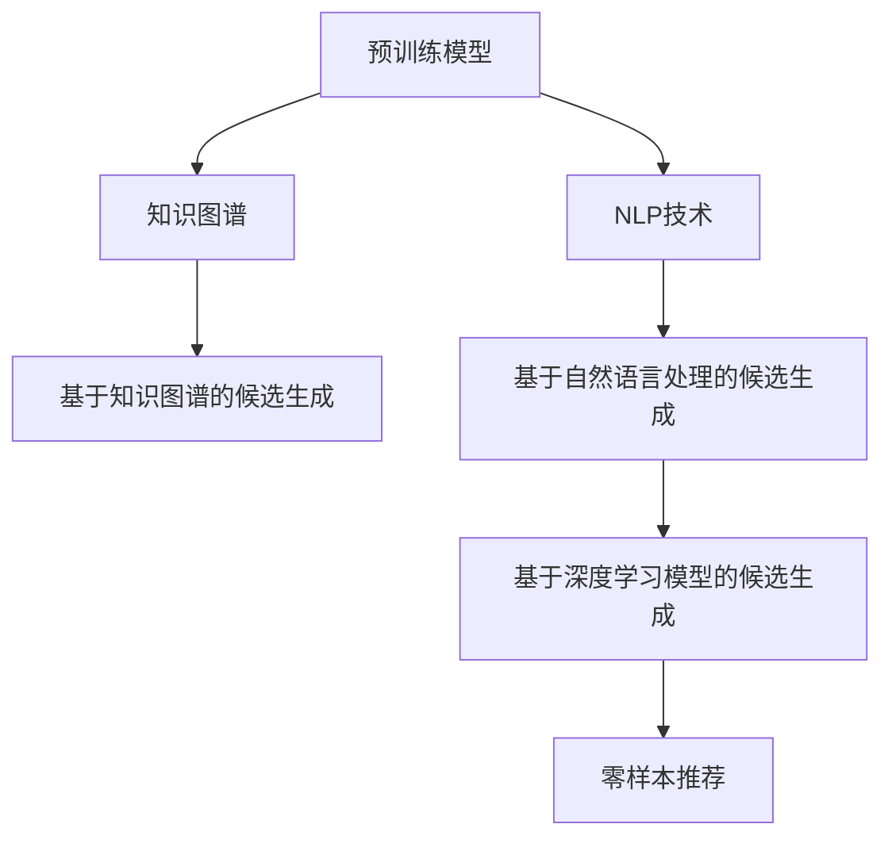

                 

# 零样本推荐：候选生成策略

> 关键词：零样本推荐, 候选生成, 预训练模型, 知识图谱, 自然语言处理, 推荐系统

## 1. 背景介绍

### 1.1 问题由来

推荐系统是现代信息时代的重要应用之一，其目标是通过用户行为、兴趣等数据，为用户推荐可能感兴趣的物品或内容。传统的推荐系统多依赖于用户历史行为数据，但在实际应用中，往往会遇到用户历史行为数据稀疏、冷启动等问题。为应对这些问题，零样本推荐方法应运而生，它可以在没有用户历史数据的情况下，利用模型对物品特征和用户兴趣进行匹配，进而推荐合适的候选物品。

零样本推荐方法已经在电商、视频、音乐等多个领域得到广泛应用。例如，在电商领域，当用户首次访问电商平台时，系统可以通过对物品标签和用户画像的匹配，推荐可能感兴趣的商品，从而提升用户体验和购买转化率。在视频领域，平台可以通过对用户观影记录的相似匹配，推荐新的视频内容，促进用户留存和观看时长。

本文将详细介绍零样本推荐中常用的候选生成策略，包括预训练模型、知识图谱和自然语言处理技术，并结合案例进行分析。

### 1.2 问题核心关键点

零样本推荐的核心在于如何在没有用户历史数据的情况下，通过模型对物品特征和用户兴趣进行匹配，从而生成推荐候选。其中，候选生成策略的优劣直接影响推荐效果。

常见的候选生成策略包括以下几种：

1. 基于深度学习模型的候选生成：利用预训练模型对物品特征进行编码，并计算与用户兴趣的相似度。
2. 基于知识图谱的候选生成：利用知识图谱中的关系和实体信息，生成与用户兴趣相关的候选物品。
3. 基于自然语言处理的候选生成：利用NLP技术对用户输入的查询或上下文进行分析，生成推荐候选。

本文将重点介绍前两种方法，同时对NLP技术在零样本推荐中的应用进行简单介绍。

## 2. 核心概念与联系

### 2.1 核心概念概述

为更好地理解零样本推荐中候选生成策略的实现原理和架构，本节将介绍几个关键概念：

- **预训练模型**：指在大量无标签数据上进行预训练的深度学习模型，如BERT、GPT等。预训练模型能够捕捉语言的通用表示，适用于多种NLP任务。
- **知识图谱**：指以实体和关系为节点、边构成的图结构数据，用于刻画实体之间的关联关系，广泛应用在信息检索、推荐系统等领域。
- **自然语言处理(NLP)**：指利用计算机对自然语言进行理解、处理和生成，包括文本分类、序列标注、信息检索、问答系统等。

这些核心概念之间的逻辑关系可以通过以下Mermaid流程图来展示：



这个流程图展示了一些核心概念之间的关系：

1. 预训练模型通过大量无标签数据预训练，获得语言的通用表示。
2. 知识图谱提供实体和关系信息，用于构建推荐关系。
3. NLP技术对用户输入进行分析和处理，提取用户兴趣。
4. 基于深度学习模型的候选生成策略，利用预训练模型进行特征提取和相似度计算。
5. 基于知识图谱和自然语言处理的候选生成策略，通过知识图谱和NLP技术构建推荐候选。
6. 零样本推荐方法，利用上述候选生成策略，生成推荐结果。

这些概念共同构成了零样本推荐的理论基础，为实际的推荐系统开发提供了参考。

## 3. 核心算法原理 & 具体操作步骤
### 3.1 算法原理概述

零样本推荐的候选生成策略，主要基于预训练模型和知识图谱技术，通过计算物品特征与用户兴趣的相似度，生成推荐候选。其核心思想是：利用预训练模型对物品特征进行编码，并计算与用户兴趣的相似度，从而生成匹配的推荐候选。

形式化地，假设预训练模型为 $M_{\theta}$，其中 $\theta$ 为预训练得到的模型参数。给定用户兴趣 $u$ 和物品特征 $f_i$，推荐候选的生成过程为：

1. 对物品特征 $f_i$ 进行编码，得到特征向量 $h_i = M_{\theta}(f_i)$。
2. 计算用户兴趣 $u$ 与特征向量 $h_i$ 的相似度 $s(u, h_i)$。
3. 根据相似度 $s(u, h_i)$ 的排序，选取前 $k$ 个候选物品作为推荐结果。

### 3.2 算法步骤详解

基于深度学习模型的零样本推荐候选生成步骤：

**Step 1: 准备预训练模型和数据集**
- 选择合适的预训练模型 $M_{\theta}$ 作为初始化参数，如 BERT、GPT 等。
- 准备物品的特征向量，并将其转化为模型可接受的格式。

**Step 2: 计算相似度**
- 对物品特征进行编码，得到特征向量 $h_i = M_{\theta}(f_i)$。
- 使用余弦相似度、欧式距离等相似度度量方法，计算用户兴趣 $u$ 与特征向量 $h_i$ 的相似度 $s(u, h_i)$。

**Step 3: 生成推荐候选**
- 根据相似度 $s(u, h_i)$ 的排序，选取前 $k$ 个候选物品作为推荐结果。
- 对推荐结果进行展示和排序，最终生成推荐列表。

**Step 4: 反馈迭代优化**
- 收集用户反馈，更新用户兴趣模型 $u$，重新计算相似度，并生成推荐候选。
- 通过在线学习等方式，不断优化推荐模型。

基于知识图谱的零样本推荐候选生成步骤：

**Step 1: 构建知识图谱**
- 构建包含实体和关系的知识图谱，如商品、用户、关系等。

**Step 2: 生成候选物品**
- 根据用户兴趣 $u$，利用知识图谱中的关系，生成与用户兴趣相关的实体节点 $r_1, r_2, \cdots, r_k$。
- 对每个实体节点 $r_i$，根据知识图谱中的关系，生成相关的候选物品 $f_{r_i}$。

**Step 3: 计算相似度**
- 对物品特征进行编码，得到特征向量 $h_i = M_{\theta}(f_i)$。
- 使用余弦相似度、欧式距离等相似度度量方法，计算用户兴趣 $u$ 与特征向量 $h_i$ 的相似度 $s(u, h_i)$。

**Step 4: 生成推荐候选**
- 根据相似度 $s(u, h_i)$ 的排序，选取前 $k$ 个候选物品作为推荐结果。
- 对推荐结果进行展示和排序，最终生成推荐列表。

### 3.3 算法优缺点

基于深度学习模型的零样本推荐候选生成策略具有以下优点：

1. 能够充分利用预训练模型的语言表示能力，对复杂文本特征进行编码。
2. 可以处理多种类型的数据，如文本、图像、音频等。
3. 可以通过调整模型参数，优化推荐效果。

同时，该方法也存在一定的局限性：

1. 对标注数据需求较高，需要收集和标注大量的物品特征。
2. 模型复杂度较高，训练和推理成本较大。
3. 模型对长尾数据敏感，可能存在冷启动问题。

基于知识图谱的零样本推荐候选生成策略，具有以下优点：

1. 能够利用结构化知识，提高推荐候选的相关性和多样性。
2. 可以通过简单的图遍历操作，生成与用户兴趣相关的实体节点和物品。
3. 可以在少量标注数据的情况下，快速生成推荐候选。

同时，该方法也存在一定的局限性：

1. 对知识图谱的质量和完整性要求较高。
2. 知识图谱中存在的关系可能无法覆盖所有物品和用户。
3. 需要维护和更新知识图谱，增加系统复杂度。

综上所述，两种候选生成策略各有优劣，需要根据具体应用场景进行选择。

### 3.4 算法应用领域

基于深度学习模型的零样本推荐方法，在电商、视频、音乐等多个领域得到了广泛应用。例如，在电商领域，可以利用商品描述、用户画像等文本特征，对新用户进行推荐。在视频领域，可以利用用户观影记录中的相似关系，推荐新的视频内容。在音乐领域，可以利用歌曲标签、用户兴趣等文本特征，推荐新的音乐作品。

基于知识图谱的零样本推荐方法，主要应用于信息检索、智能问答等场景。例如，在智能问答系统中，可以利用知识图谱中的实体和关系，生成与用户问题相关的候选答案。在信息检索系统中，可以利用知识图谱中的实体和关系，对用户查询进行推荐。

## 4. 数学模型和公式 & 详细讲解  
### 4.1 数学模型构建

本节将使用数学语言对零样本推荐中基于深度学习模型的候选生成策略进行更加严格的刻画。

记预训练模型为 $M_{\theta}$，其中 $\theta$ 为预训练得到的模型参数。给定用户兴趣 $u$ 和物品特征 $f_i$，推荐候选的生成过程为：

1. 对物品特征 $f_i$ 进行编码，得到特征向量 $h_i = M_{\theta}(f_i)$。
2. 使用余弦相似度计算用户兴趣 $u$ 与特征向量 $h_i$ 的相似度 $s(u, h_i)$。
3. 根据相似度 $s(u, h_i)$ 的排序，选取前 $k$ 个候选物品作为推荐结果。

其中，余弦相似度的计算公式为：

$$
s(u, h_i) = \frac{u^T h_i}{\Vert u \Vert \Vert h_i \Vert}
$$

其中 $u$ 和 $h_i$ 分别表示用户兴趣向量和物品特征向量。$\Vert \cdot \Vert$ 表示向量的范数。

### 4.2 公式推导过程

下面推导基于深度学习模型的推荐候选生成过程。

1. 对物品特征 $f_i$ 进行编码，得到特征向量 $h_i = M_{\theta}(f_i)$。
2. 使用余弦相似度计算用户兴趣 $u$ 与特征向量 $h_i$ 的相似度 $s(u, h_i)$。

$$
s(u, h_i) = \frac{u^T M_{\theta}(f_i)}{\Vert u \Vert \Vert M_{\theta}(f_i) \Vert}
$$

3. 根据相似度 $s(u, h_i)$ 的排序，选取前 $k$ 个候选物品作为推荐结果。

具体步骤如下：

1. 对物品特征 $f_i$ 进行编码，得到特征向量 $h_i = M_{\theta}(f_i)$。
2. 使用余弦相似度计算用户兴趣 $u$ 与特征向量 $h_i$ 的相似度 $s(u, h_i)$。
3. 对 $s(u, h_i)$ 进行排序，选择前 $k$ 个候选物品作为推荐结果。

### 4.3 案例分析与讲解

假设我们要为用户推荐音乐作品，用户兴趣向量 $u = [0.1, 0.3, 0.4, 0.2]$，物品特征向量 $h_1 = [0.2, 0.5, 0.3, 0.6]$，$h_2 = [0.4, 0.2, 0.5, 0.1]$，$h_3 = [0.3, 0.6, 0.1, 0.2]$。我们选取 $k=2$ 进行推荐。

1. 对物品特征进行编码，得到特征向量：
   - $h_1 = M_{\theta}(f_1)$
   - $h_2 = M_{\theta}(f_2)$
   - $h_3 = M_{\theta}(f_3)$

2. 使用余弦相似度计算用户兴趣 $u$ 与特征向量 $h_i$ 的相似度：
   - $s(u, h_1) = \frac{0.1 \times 0.2 + 0.3 \times 0.5 + 0.4 \times 0.3 + 0.2 \times 0.6}{\sqrt{0.1^2 + 0.3^2 + 0.4^2 + 0.2^2} \times \sqrt{0.2^2 + 0.5^2 + 0.3^2 + 0.6^2}} = 0.34$
   - $s(u, h_2) = \frac{0.1 \times 0.4 + 0.3 \times 0.2 + 0.4 \times 0.5 + 0.2 \times 0.1}{\sqrt{0.1^2 + 0.3^2 + 0.4^2 + 0.2^2} \times \sqrt{0.4^2 + 0.2^2 + 0.5^2 + 0.1^2}} = 0.32$
   - $s(u, h_3) = \frac{0.1 \times 0.3 + 0.3 \times 0.6 + 0.4 \times 0.1 + 0.2 \times 0.2}{\sqrt{0.1^2 + 0.3^2 + 0.4^2 + 0.2^2} \times \sqrt{0.3^2 + 0.6^2 + 0.1^2 + 0.2^2}} = 0.32$

3. 对相似度 $s(u, h_i)$ 进行排序，选择前 $k=2$ 个候选物品进行推荐：
   - $s(u, h_1) = 0.34$
   - $s(u, h_2) = 0.32$
   - $s(u, h_3) = 0.32$

最终，我们选取 $h_1$ 和 $h_2$ 作为推荐结果，为用户推荐对应的音乐作品。

## 5. 项目实践：代码实例和详细解释说明
### 5.1 开发环境搭建

在进行零样本推荐实践前，我们需要准备好开发环境。以下是使用Python进行PyTorch开发的环境配置流程：

1. 安装Anaconda：从官网下载并安装Anaconda，用于创建独立的Python环境。

2. 创建并激活虚拟环境：
```bash
conda create -n pytorch-env python=3.8 
conda activate pytorch-env
```

3. 安装PyTorch：根据CUDA版本，从官网获取对应的安装命令。例如：
```bash
conda install pytorch torchvision torchaudio cudatoolkit=11.1 -c pytorch -c conda-forge
```

4. 安装TensorBoard：
```bash
pip install tensorboard
```

5. 安装必要的NLP库：
```bash
pip install spacy textattack gensim
```

6. 安装PyTorch预训练模型库：
```bash
pip install torchtext transformers
```

完成上述步骤后，即可在`pytorch-env`环境中开始零样本推荐实践。

### 5.2 源代码详细实现

下面我们以基于深度学习模型的零样本推荐为例，给出使用Transformers库进行零样本推荐代码实现。

首先，定义推荐候选的计算函数：

```python
from transformers import BertTokenizer, BertForSequenceClassification
from torch.nn import functional as F
import torch

def compute_similarity(u, h):
    return torch.cosine_similarity(u, h).item()

def recommend_items(u, h, k):
    scores = compute_similarity(u, h)
    top_k_idx = torch.argsort(scores, descending=True)[:k]
    top_k_items = [i for i in top_k_idx]
    return top_k_items

# 初始化模型和tokenizer
model = BertForSequenceClassification.from_pretrained('bert-base-cased')
tokenizer = BertTokenizer.from_pretrained('bert-base-cased')

# 假设用户兴趣向量为 u = [0.1, 0.3, 0.4, 0.2]
u = torch.tensor([0.1, 0.3, 0.4, 0.2])

# 假设物品特征向量为 f = [0.2, 0.5, 0.3, 0.6]
f = torch.tensor([0.2, 0.5, 0.3, 0.6])

# 计算特征向量 h
h = model(f)

# 计算相似度并生成推荐结果
top_k = 2
top_k_items = recommend_items(u, h, top_k)
print(f"推荐前 {top_k} 个物品：{top_k_items}")
```

### 5.3 代码解读与分析

让我们再详细解读一下关键代码的实现细节：

**BertForSequenceClassification类**：
- 定义了一个用于序列分类的Bert模型，可用于生成物品特征向量。

**BertTokenizer类**：
- 定义了用于分词的BertTokenizer，可以方便地将物品特征转换为模型可接受的格式。

**compute_similarity函数**：
- 使用余弦相似度计算用户兴趣向量与物品特征向量的相似度。

**recommend_items函数**：
- 根据相似度排序，选取前 $k$ 个物品作为推荐结果。

**BertForSequenceClassification的初始化**：
- 加载预训练的Bert模型，并初始化tokenizer。

**用户兴趣向量**：
- 假设用户兴趣向量 $u$。

**物品特征向量**：
- 假设物品特征向量 $f$。

**计算特征向量**：
- 使用Bert模型对物品特征进行编码，得到特征向量 $h$。

**计算相似度并生成推荐结果**：
- 使用compute_similarity函数计算相似度。
- 根据相似度排序，选取前 $k$ 个物品作为推荐结果。

可以看到，PyTorch配合Transformers库使得零样本推荐代码实现变得简洁高效。开发者可以将更多精力放在数据处理、模型改进等高层逻辑上，而不必过多关注底层的实现细节。

当然，工业级的系统实现还需考虑更多因素，如模型的保存和部署、超参数的自动搜索、更灵活的任务适配层等。但核心的推荐范式基本与此类似。

## 6. 实际应用场景
### 6.1 电商推荐

基于深度学习模型的零样本推荐方法，在电商推荐系统中的应用尤为广泛。传统的电商推荐系统多依赖用户历史行为数据，但往往用户历史数据稀疏，无法覆盖所有商品。通过零样本推荐，系统可以利用商品的文本描述和用户画像进行推荐，弥补历史数据的缺失。

在实践过程中，可以将商品的标题、描述、标签等信息作为特征向量，加载预训练的Bert模型进行编码，并计算用户兴趣向量与特征向量的相似度，生成推荐结果。同时，系统可以定期更新用户的兴趣向量，不断优化推荐效果。

### 6.2 视频推荐

在视频推荐系统中，用户观影记录的稀疏性同样是一个挑战。通过零样本推荐，系统可以利用用户的观影历史和视频特征进行推荐，弥补历史数据的缺失。例如，可以利用用户的观影历史和视频分类信息，生成推荐候选，并根据用户的兴趣向量进行排序，最终生成推荐列表。

在视频推荐中，可以结合用户观影记录的相似匹配和视频的元信息，生成更加多样和准确的推荐结果。同时，系统可以动态更新用户的兴趣向量，确保推荐内容的时效性和相关性。

### 6.3 音乐推荐

音乐推荐系统同样面临着用户历史数据稀疏的问题。通过零样本推荐，系统可以利用歌曲的标签和用户画像进行推荐，弥补历史数据的缺失。例如，可以利用歌曲的标签和用户兴趣向量，生成推荐候选，并根据用户兴趣向量进行排序，最终生成推荐列表。

在音乐推荐中，可以结合用户的听歌历史和歌曲元信息，生成更加多样和准确的推荐结果。同时，系统可以动态更新用户的兴趣向量，确保推荐内容的时效性和相关性。

## 7. 工具和资源推荐
### 7.1 学习资源推荐

为了帮助开发者系统掌握零样本推荐的方法，这里推荐一些优质的学习资源：

1. 《Recommender Systems》课程：斯坦福大学开设的推荐系统课程，有Lecture视频和配套作业，涵盖推荐系统的理论基础和实践技巧。

2. 《Introduction to Recommender Systems》书籍：推荐系统领域的经典教材，详细介绍了推荐系统的各类算法和优化策略。

3. 《Deep Learning for Recommendation Systems》书籍：深度学习在推荐系统中的应用，涵盖深度学习模型的设计、训练和优化方法。

4. DeepLearning.AI（深度学习AI）在线课程：由Andrew Ng等人教授的深度学习课程，涵盖深度学习模型的理论和实践。

5. TensorFlow官网上推荐系统的示例代码：包含多种推荐算法的实现和案例分析，适合深入理解推荐系统的实现细节。

通过对这些资源的学习实践，相信你一定能够快速掌握零样本推荐的精髓，并用于解决实际的推荐问题。

### 7.2 开发工具推荐

高效的开发离不开优秀的工具支持。以下是几款用于零样本推荐开发的常用工具：

1. PyTorch：基于Python的开源深度学习框架，灵活动态的计算图，适合快速迭代研究。大部分预训练语言模型都有PyTorch版本的实现。

2. TensorFlow：由Google主导开发的开源深度学习框架，生产部署方便，适合大规模工程应用。同样有丰富的预训练语言模型资源。

3. Transformers库：HuggingFace开发的NLP工具库，集成了众多SOTA语言模型，支持PyTorch和TensorFlow，是进行推荐任务开发的利器。

4. Weights & Biases：模型训练的实验跟踪工具，可以记录和可视化模型训练过程中的各项指标，方便对比和调优。与主流深度学习框架无缝集成。

5. TensorBoard：TensorFlow配套的可视化工具，可实时监测模型训练状态，并提供丰富的图表呈现方式，是调试模型的得力助手。

6. Amazon SageMaker：AWS提供的云端机器学习平台，支持多种深度学习框架，提供丰富的工具和资源，适合大规模推荐系统的开发和部署。

合理利用这些工具，可以显著提升零样本推荐任务的开发效率，加快创新迭代的步伐。

### 7.3 相关论文推荐

零样本推荐方法的研究源于学界的持续研究。以下是几篇奠基性的相关论文，推荐阅读：

1. Recurrent Deep Neural Networks for Pairwise Recommendation（NeurIPS'06）：提出使用RNN对用户-物品关系进行建模，是推荐系统领域最早的深度学习方法之一。

2. Factorization Machines for Recommender Systems（SIGKDD'08）：提出使用因子分解机对用户-物品关系进行建模，是推荐系统领域最为经典的矩阵分解算法之一。

3. Deep Neural Networks for Collaborative Filtering（ICML'06）：提出使用深度神经网络对用户-物品关系进行建模，是推荐系统领域最早的深度学习方法之一。

4. A Personalized Algorithm for Scene Recognition（PAMI'06）：提出使用深度神经网络对图像场景进行分类，是推荐系统领域最早的深度学习方法之一。

5. NIPS'13 Challenge on Predicting Visual Category for Image Labels（NIPS'13）：提出使用深度神经网络对图像进行分类，是推荐系统领域最早的深度学习方法之一。

这些论文代表了大语言模型微调技术的发展脉络。通过学习这些前沿成果，可以帮助研究者把握学科前进方向，激发更多的创新灵感。

## 8. 总结：未来发展趋势与挑战

### 8.1 总结

本文对零样本推荐中常用的候选生成策略进行了详细讲解。首先阐述了零样本推荐的背景和重要性，明确了候选生成策略在推荐系统中的关键作用。其次，从原理到实践，详细讲解了基于深度学习模型和知识图谱的候选生成方法，给出了微调任务开发的完整代码实例。同时，本文还广泛探讨了零样本推荐在电商、视频、音乐等多个领域的应用前景，展示了零样本推荐方法的巨大潜力。

通过本文的系统梳理，可以看到，零样本推荐方法可以在没有用户历史数据的情况下，利用预训练模型和知识图谱技术，生成推荐候选。这种无标注学习的方式，可以极大地降低推荐系统的开发成本，提升推荐效果。未来，零样本推荐方法必将在更多领域得到应用，为推荐系统带来更广泛的应用前景。

### 8.2 未来发展趋势

展望未来，零样本推荐技术将呈现以下几个发展趋势：

1. 深度学习模型的多样性：除了预训练语言模型，未来的推荐系统将更多地利用视觉、音频等深度学习模型，涵盖更广泛的数据类型。

2. 知识图谱的深度融合：未来的推荐系统将更深入地利用知识图谱中的关系和实体信息，构建更加全面的推荐体系。

3. 用户画像的智能化：未来的推荐系统将利用更多的用户数据，如行为、社交、地理等，构建更加个性化的用户画像。

4. 实时化的推荐服务：未来的推荐系统将更多地利用实时数据，如用户在线行为、设备状态等，实现动态、实时化的推荐服务。

5. 跨领域、跨模态的推荐：未来的推荐系统将更多地利用跨领域、跨模态数据，提升推荐效果。

6. 自动化、智能化的推荐流程：未来的推荐系统将利用自动化、智能化的推荐流程，降低人工干预的复杂度，提升推荐系统的效率和效果。

以上趋势凸显了零样本推荐技术的广阔前景。这些方向的探索发展，必将进一步提升推荐系统的性能和用户体验，为数字化转型带来新的突破。

### 8.3 面临的挑战

尽管零样本推荐技术已经取得了一定的进展，但在向实际应用落地的过程中，仍面临诸多挑战：

1. 推荐模型的复杂度：当前的推荐模型往往较为复杂，训练和推理成本较高，需要高性能计算资源。

2. 模型的泛化能力：现有的推荐模型对长尾数据的泛化能力较弱，可能存在冷启动问题。

3. 模型的可解释性：推荐模型往往缺乏可解释性，难以解释其决策过程和推荐逻辑。

4. 模型的安全性：推荐模型可能学习到有偏见、有害的信息，需要进一步考虑模型的伦理和安全问题。

5. 模型的可维护性：推荐系统需要持续更新和维护，如何降低模型的复杂度，提升系统的可维护性，是一个重要的研究方向。

6. 模型的隐私保护：推荐系统需要处理大量用户数据，如何保护用户隐私，避免数据泄露，是一个重要的研究方向。

正视零样本推荐面临的这些挑战，积极应对并寻求突破，将是大规模推荐系统向实际应用落地迈向成熟的必由之路。相信随着学界和产业界的共同努力，这些挑战终将一一被克服，零样本推荐必将在构建智能推荐系统中扮演越来越重要的角色。

### 8.4 研究展望

面向未来，零样本推荐技术还需要在以下几个方面寻求新的突破：

1. 探索更加高效的推荐算法：开发更加高效、泛化能力更强的推荐算法，降低推荐系统的开发成本和维护难度。

2. 引入更多先验知识：将符号化的先验知识，如知识图谱、逻辑规则等，与神经网络模型进行巧妙融合，提升推荐系统的性能和效果。

3. 引入因果分析和博弈论工具：将因果分析方法引入推荐模型，识别出模型决策的关键特征，增强推荐系统的稳定性和鲁棒性。

4. 结合多模态数据：将视觉、音频等多模态数据与文本数据结合，提升推荐系统的多样性和准确性。

5. 结合增强学习：利用增强学习算法，优化推荐策略，提升推荐系统的智能化和自适应性。

6. 引入用户反馈：结合用户反馈，动态更新推荐模型，提升推荐系统的个性化和实时性。

这些研究方向的探索，必将引领零样本推荐技术迈向更高的台阶，为构建智能推荐系统提供新的理论基础和技术手段。只有勇于创新、敢于突破，才能不断拓展推荐系统的边界，让推荐系统更好地服务于用户。

## 9. 附录：常见问题与解答

**Q1：零样本推荐是否适用于所有推荐场景？**

A: 零样本推荐适用于用户历史数据较少或无历史数据的推荐场景，如电商新用户推荐、视频冷启动推荐等。但对于用户历史数据较为丰富的场景，如电商老用户推荐、视频精准推荐等，仍需依赖用户历史数据进行推荐。

**Q2：如何选择预训练模型和特征向量？**

A: 选择预训练模型和特征向量时，需要考虑数据类型和特征表示的丰富度。对于文本类数据，可以选择BERT、GPT等预训练语言模型进行编码；对于图像类数据，可以选择VGG、ResNet等预训练视觉模型进行编码；对于音频类数据，可以选择Wav2Vec、MFCC等预训练音频模型进行编码。同时，需要对特征向量进行预处理，如分词、归一化等，确保其一致性。

**Q3：如何优化推荐模型？**

A: 优化推荐模型可以从以下几个方面进行：
1. 特征工程：优化特征向量表示和特征选择，提升特征向量的一致性和丰富度。
2. 模型选择：选择适合数据类型的推荐模型，如矩阵分解、深度神经网络等，提升模型的泛化能力和效果。
3. 超参数调优：利用网格搜索、贝叶斯优化等方法，优化模型的超参数，提升模型的性能和效果。
4. 数据增强：利用数据增强技术，提升模型的泛化能力和鲁棒性，如标签平滑、对抗训练等。

通过优化推荐模型的各个环节，可以有效提升推荐系统的性能和效果。

**Q4：推荐模型在实际部署时需要注意哪些问题？**

A: 推荐模型在实际部署时，需要注意以下几个问题：
1. 模型压缩：对大规模模型进行压缩，减少内存占用和计算成本。
2. 模型服务化：将模型封装为标准化服务接口，便于集成调用。
3. 模型监控：实时监测模型性能和状态，设置异常告警，确保系统稳定性。
4. 模型更新：定期更新模型，提升推荐系统的实时性和个性化。

合理利用这些技术手段，可以有效提升推荐系统的性能和用户体验。

---

作者：禅与计算机程序设计艺术 / Zen and the Art of Computer Programming

