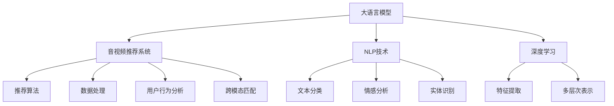

                 

# 音视频内容推荐：大模型在理解与匹配方面的优势

> 关键词：大语言模型,音视频推荐系统,自然语言处理(NLP),深度学习,内容匹配,注意力机制,跨模态匹配

## 1. 背景介绍

### 1.1 问题由来
随着互联网和移动互联网的普及，音视频内容呈现出爆炸式增长。用户在数以亿计的海量内容中，如何准确高效地找到感兴趣的视频和音频，成为各大内容平台的重要挑战。传统的基于关键词匹配的推荐算法，往往无法充分利用丰富的音视频元数据（如标题、描述、标签等），推荐效果不尽人意。因此，如何更好地理解音视频内容，并通过跨模态匹配进行精准推荐，成为了当前亟待解决的问题。

### 1.2 问题核心关键点
当前，基于深度学习的大模型在音视频内容推荐中扮演着关键角色。这些模型通过在大规模无标签数据上进行的自监督预训练，获得了强大的特征表示和理解能力。在此基础上，通过微调或提示学习，模型能够更好地匹配用户需求，生成高质量的推荐结果。具体来说，大模型在理解与匹配方面的优势主要体现在以下几个方面：

- 大模型具备自监督预训练能力，能够学习到通用的语言表示和音视频特征。
- 大模型通过微调或提示学习，能够针对特定任务进行优化，提升推荐精度。
- 大模型能够处理跨模态数据，实现文本、图像、声音等多种信息源的综合匹配。
- 大模型支持零样本学习，可以适应新用户和新内容，提高推荐系统的泛化能力。

### 1.3 问题研究意义
研究大模型在音视频内容推荐中的应用，具有重要意义：

1. 提升用户体验：通过更精准的推荐，用户可以更快找到感兴趣的内容，提高满意度。
2. 降低内容消费成本：推荐系统可以有效筛选优质内容，减少用户浏览时间，降低信息获取成本。
3. 促进内容分发：高质量的推荐能显著增加优质内容的曝光率和用户粘性，推动平台内容分发。
4. 创新推荐技术：大模型的跨模态理解能力为推荐算法提供了新的技术范式，拓展了推荐系统的能力边界。
5. 赋能产业升级：大模型推荐技术在媒体、教育、娱乐等行业的应用，为行业数字化转型提供新的动力。

## 2. 核心概念与联系

### 2.1 核心概念概述

为更好地理解大模型在音视频推荐中的应用，本节将介绍几个关键概念：

- 大语言模型(Large Language Model, LLM)：以自回归(如GPT)或自编码(如BERT)模型为代表的大规模预训练语言模型。通过在大规模无标签文本语料上进行预训练，学习通用的语言表示，具备强大的语言理解和生成能力。
- 音视频推荐系统：通过推荐算法将音视频内容推送给用户的系统。包括推荐算法、数据处理、用户行为分析等多个环节。
- 自然语言处理(Natural Language Processing, NLP)：使用计算机处理和分析自然语言的技术，包括文本分类、情感分析、实体识别等。
- 深度学习(Deep Learning)：基于人工神经网络的深度学习模型，通过多层次的非线性特征提取，实现复杂的模式识别和预测。
- 注意力机制(Attention Mechanism)：一种重要的深度学习组件，用于模型中不同部分间的信息交互，提高模型的鲁棒性和泛化能力。
- 跨模态匹配(Cross-modal Matching)：在文本、图像、声音等不同模态数据之间进行信息匹配和融合，实现跨模态的信息理解和表示。

这些核心概念之间的逻辑关系可以通过以下Mermaid流程图来展示：



这个流程图展示了大模型在音视频推荐系统中的核心概念及其之间的关系：

1. 大模型通过自监督预训练获得基础能力。
2. 推荐系统通过NLP技术和深度学习技术，对音视频元数据进行处理和表示。
3. 推荐算法通过微调或提示学习，实现音视频内容的精准匹配和推荐。
4. 跨模态匹配技术，实现不同模态数据之间的综合理解。

这些概念共同构成了音视频推荐系统的技术框架，使其能够在不同模态间进行无缝连接，生成高质量的推荐结果。

## 3. 核心算法原理 & 具体操作步骤
### 3.1 算法原理概述

基于大模型的音视频内容推荐方法，本质上是一个多模态的深度学习过程。其核心思想是：将预训练的大模型视作一个强大的特征提取器，通过微调或提示学习，使模型能够理解和匹配音视频内容与用户需求的对应关系。

形式化地，假设音视频推荐系统的训练集为 $D=\{(x_i, y_i)\}_{i=1}^N$，其中 $x_i$ 表示音视频内容，$y_i$ 表示用户对内容的评分或点击行为。定义推荐模型 $M_{\theta}$，其中 $\theta$ 为模型的参数。微调的目标是最小化经验风险，即找到新的模型参数 $\hat{\theta}$，使得：

$$
\hat{\theta}=\mathop{\arg\min}_{\theta} \mathcal{L}(M_{\theta},D)
$$

其中 $\mathcal{L}$ 为推荐任务设计的损失函数，用于衡量模型预测输出与真实标签之间的差异。常见的损失函数包括均方误差损失、交叉熵损失等。

### 3.2 算法步骤详解

基于大模型的音视频内容推荐一般包括以下几个关键步骤：

**Step 1: 准备预训练模型和数据集**
- 选择合适的预训练语言模型 $M_{\theta}$ 作为初始化参数，如 BERT、GPT 等。
- 准备音视频推荐系统的训练集 $D$，划分为训练集、验证集和测试集。一般要求音视频与元数据在分布上不要差异过大。

**Step 2: 设计跨模态特征表示**
- 将音视频内容提取为特征表示 $x_i \in \mathcal{X}$。例如，对视频使用帧特征提取、对音频使用MFCC特征提取。
- 将文本元数据表示为特征向量 $y_i \in \mathcal{Y}$。可以使用NLP技术进行文本分类、情感分析、实体识别等，将标签转换为特征向量。
- 对不同模态的特征进行融合，得到跨模态表示 $\mathbf{f}_i \in \mathcal{F}$。常用的方法包括拼接、加权平均、注意力机制等。

**Step 3: 添加任务适配层**
- 根据推荐任务类型，在跨模态表示的顶层设计合适的输出层和损失函数。
- 对于评分预测任务，通常在顶层添加线性分类器和均方误差损失函数。
- 对于点击率预测任务，通常使用二分类交叉熵损失函数。

**Step 4: 设置微调超参数**
- 选择合适的优化算法及其参数，如 AdamW、SGD 等，设置学习率、批大小、迭代轮数等。
- 设置正则化技术及强度，包括权重衰减、Dropout、Early Stopping 等。
- 确定冻结预训练参数的策略，如仅微调顶层，或全部参数都参与微调。

**Step 5: 执行梯度训练**
- 将训练集数据分批次输入模型，前向传播计算损失函数。
- 反向传播计算参数梯度，根据设定的优化算法和学习率更新模型参数。
- 周期性在验证集上评估模型性能，根据性能指标决定是否触发 Early Stopping。
- 重复上述步骤直到满足预设的迭代轮数或 Early Stopping 条件。

**Step 6: 测试和部署**
- 在测试集上评估微调后模型 $M_{\hat{\theta}}$ 的性能，对比微调前后的精度提升。
- 使用微调后的模型对新样本进行推理预测，集成到实际的应用系统中。
- 持续收集新的数据，定期重新微调模型，以适应数据分布的变化。

以上是基于大模型的音视频内容推荐的一般流程。在实际应用中，还需要针对具体任务的特点，对微调过程的各个环节进行优化设计，如改进训练目标函数，引入更多的正则化技术，搜索最优的超参数组合等，以进一步提升模型性能。

### 3.3 算法优缺点

基于大模型的音视频内容推荐方法具有以下优点：
1. 简单高效。只需准备少量标注数据，即可对预训练模型进行快速适配，获得较大的性能提升。
2. 通用适用。适用于各种音视频推荐任务，包括评分预测、点击率预测、内容推荐等，设计简单的任务适配层即可实现推荐。
3. 参数高效。利用参数高效微调技术，在固定大部分预训练参数的情况下，仍可取得不错的推荐效果。
4. 效果显著。在学术界和工业界的诸多任务上，基于大模型的推荐方法已经刷新了最先进的性能指标。

同时，该方法也存在一定的局限性：
1. 依赖标注数据。推荐系统的性能很大程度上取决于标注数据的质量和数量，获取高质量标注数据的成本较高。
2. 迁移能力有限。当目标任务与预训练数据的分布差异较大时，推荐系统的性能提升有限。
3. 可解释性不足。推荐系统的决策过程通常缺乏可解释性，难以对其推理逻辑进行分析和调试。

尽管存在这些局限性，但就目前而言，基于大模型的推荐方法仍是音视频推荐领域的主流范式。未来相关研究的重点在于如何进一步降低推荐系统对标注数据的依赖，提高模型的少样本学习和跨领域迁移能力，同时兼顾可解释性和伦理安全性等因素。

### 3.4 算法应用领域

基于大模型的音视频内容推荐方法在音视频推荐系统中的应用，已经取得了显著的成效，覆盖了几乎所有常见推荐任务，例如：

- 评分预测：预测用户对音视频的评分。通过微调使模型学习评分-内容映射。
- 点击率预测：预测用户是否点击某个音视频。通过微调使模型学习点击-内容映射。
- 内容推荐：根据用户的浏览历史、兴趣标签等，推荐新的音视频。通过微调使模型学习兴趣-内容映射。
- 话题推荐：根据用户浏览的话题，推荐相关话题下的音视频。通过微调使模型学习话题-内容映射。
- 活动推荐：根据用户的参与行为，推荐用户感兴趣的活动。通过微调使模型学习行为-内容映射。

除了上述这些经典任务外，大模型的跨模态理解能力也被创新性地应用到更多场景中，如事件推荐、游戏推荐、旅游推荐等，为音视频推荐系统带来了全新的突破。随着预训练模型和推荐方法的不断进步，相信音视频推荐技术将不断创新，带来更多优质内容的用户体验。

## 4. 数学模型和公式 & 详细讲解
### 4.1 数学模型构建

本节将使用数学语言对基于大模型的音视频内容推荐过程进行更加严格的刻画。

记音视频推荐模型的预训练语言模型为 $M_{\theta}:\mathcal{X} \rightarrow \mathcal{Y}$，其中 $\mathcal{X}$ 为音视频内容特征表示空间，$\mathcal{Y}$ 为文本元数据特征向量空间。假设推荐任务 $T$ 的训练集为 $D=\{(x_i, y_i)\}_{i=1}^N$，其中 $x_i$ 为音视频内容特征表示，$y_i$ 为文本元数据特征向量。

定义推荐模型 $M_{\theta}$ 在数据样本 $(x,y)$ 上的损失函数为 $\ell(M_{\theta}(x),y)$，则在数据集 $D$ 上的经验风险为：

$$
\mathcal{L}(\theta) = \frac{1}{N} \sum_{i=1}^N \ell(M_{\theta}(x_i),y_i)
$$

其中 $\ell(M_{\theta}(x),y)$ 为推荐任务设计的损失函数，用于衡量模型预测输出与真实标签之间的差异。常见的损失函数包括均方误差损失、交叉熵损失等。

通过梯度下降等优化算法，推荐过程不断更新模型参数 $\theta$，最小化损失函数 $\mathcal{L}$，使得模型输出逼近真实标签。由于 $\theta$ 已经通过预训练获得了较好的初始化，因此即便在小规模数据集 $D$ 上进行推荐，也能较快收敛到理想的模型参数 $\hat{\theta}$。

### 4.2 公式推导过程

以下我们以评分预测任务为例，推导均方误差损失函数及其梯度的计算公式。

假设模型 $M_{\theta}$ 在输入 $x_i$ 上的输出为 $\hat{y}=M_{\theta}(x_i) \in \mathbb{R}$，表示用户对音视频内容的评分预测。真实标签 $y \in \{0,1\}$。则均方误差损失函数定义为：

$$
\ell(M_{\theta}(x_i),y) = \frac{1}{2}(y - \hat{y})^2
$$

将其代入经验风险公式，得：

$$
\mathcal{L}(\theta) = \frac{1}{N}\sum_{i=1}^N (y_i - M_{\theta}(x_i))^2
$$

根据链式法则，损失函数对参数 $\theta_k$ 的梯度为：

$$
\frac{\partial \mathcal{L}(\theta)}{\partial \theta_k} = -\frac{1}{N}\sum_{i=1}^N 2(y_i - M_{\theta}(x_i)) \frac{\partial M_{\theta}(x_i)}{\partial \theta_k}
$$

其中 $\frac{\partial M_{\theta}(x_i)}{\partial \theta_k}$ 可进一步递归展开，利用自动微分技术完成计算。

在得到损失函数的梯度后，即可带入参数更新公式，完成模型的迭代优化。重复上述过程直至收敛，最终得到适应音视频推荐任务的最优模型参数 $\theta^*$。

## 5. 项目实践：代码实例和详细解释说明
### 5.1 开发环境搭建

在进行音视频推荐实践前，我们需要准备好开发环境。以下是使用Python进行PyTorch开发的环境配置流程：

1. 安装Anaconda：从官网下载并安装Anaconda，用于创建独立的Python环境。

2. 创建并激活虚拟环境：
```bash
conda create -n pytorch-env python=3.8 
conda activate pytorch-env
```

3. 安装PyTorch：根据CUDA版本，从官网获取对应的安装命令。例如：
```bash
conda install pytorch torchvision torchaudio cudatoolkit=11.1 -c pytorch -c conda-forge
```

4. 安装Transformers库：
```bash
pip install transformers
```

5. 安装各类工具包：
```bash
pip install numpy pandas scikit-learn matplotlib tqdm jupyter notebook ipython
```

完成上述步骤后，即可在`pytorch-env`环境中开始音视频推荐实践。

### 5.2 源代码详细实现

下面我以评分预测任务为例，给出使用Transformers库对BERT模型进行音视频内容推荐微调的PyTorch代码实现。

首先，定义评分预测任务的训练集数据处理函数：

```python
from transformers import BertTokenizer
from torch.utils.data import Dataset
import torch

class MovieReviewDataset(Dataset):
    def __init__(self, reviews, scores, tokenizer, max_len=128):
        self.reviews = reviews
        self.scores = scores
        self.tokenizer = tokenizer
        self.max_len = max_len
        
    def __len__(self):
        return len(self.reviews)
    
    def __getitem__(self, item):
        review = self.reviews[item]
        score = self.scores[item]
        
        encoding = self.tokenizer(review, return_tensors='pt', max_length=self.max_len, padding='max_length', truncation=True)
        input_ids = encoding['input_ids'][0]
        attention_mask = encoding['attention_mask'][0]
        
        # 对分数进行归一化
        score = (score - score.mean()) / score.std()
        
        return {'input_ids': input_ids, 
                'attention_mask': attention_mask,
                'score': score}

# 创建dataset
tokenizer = BertTokenizer.from_pretrained('bert-base-cased')

train_dataset = MovieReviewDataset(train_reviews, train_scores, tokenizer)
dev_dataset = MovieReviewDataset(dev_reviews, dev_scores, tokenizer)
test_dataset = MovieReviewDataset(test_reviews, test_scores, tokenizer)
```

然后，定义模型和优化器：

```python
from transformers import BertForRegression, AdamW

model = BertForRegression.from_pretrained('bert-base-cased')

optimizer = AdamW(model.parameters(), lr=2e-5)
```

接着，定义训练和评估函数：

```python
from torch.utils.data import DataLoader
from tqdm import tqdm
import numpy as np
from sklearn.metrics import mean_squared_error

device = torch.device('cuda') if torch.cuda.is_available() else torch.device('cpu')
model.to(device)

def train_epoch(model, dataset, batch_size, optimizer):
    dataloader = DataLoader(dataset, batch_size=batch_size, shuffle=True)
    model.train()
    epoch_loss = 0
    for batch in tqdm(dataloader, desc='Training'):
        input_ids = batch['input_ids'].to(device)
        attention_mask = batch['attention_mask'].to(device)
        scores = batch['score'].to(device)
        model.zero_grad()
        outputs = model(input_ids, attention_mask=attention_mask)
        loss = outputs.loss
        epoch_loss += loss.item()
        loss.backward()
        optimizer.step()
    return epoch_loss / len(dataloader)

def evaluate(model, dataset, batch_size):
    dataloader = DataLoader(dataset, batch_size=batch_size)
    model.eval()
    mse_loss = 0
    preds, labels = [], []
    with torch.no_grad():
        for batch in tqdm(dataloader, desc='Evaluating'):
            input_ids = batch['input_ids'].to(device)
            attention_mask = batch['attention_mask'].to(device)
            scores = batch['score'].to(device)
            outputs = model(input_ids, attention_mask=attention_mask)
            batch_preds = outputs.logits.tolist()
            batch_labels = scores.tolist()
            preds.extend(batch_preds)
            labels.extend(batch_labels)
                
    mse_loss = np.mean(np.square(np.array(labels) - np.array(preds)))
    print(f'MSE Loss: {mse_loss:.4f}')
    
    return mse_loss

```

最后，启动训练流程并在测试集上评估：

```python
epochs = 5
batch_size = 16

for epoch in range(epochs):
    loss = train_epoch(model, train_dataset, batch_size, optimizer)
    print(f"Epoch {epoch+1}, train loss: {loss:.3f}")
    
    print(f"Epoch {epoch+1}, dev MSE Loss:")
    evaluate(model, dev_dataset, batch_size)
    
print("Test MSE Loss:")
evaluate(model, test_dataset, batch_size)
```

以上就是使用PyTorch对BERT进行评分预测任务微调的完整代码实现。可以看到，得益于Transformers库的强大封装，我们可以用相对简洁的代码完成BERT模型的加载和微调。

### 5.3 代码解读与分析

让我们再详细解读一下关键代码的实现细节：

**MovieReviewDataset类**：
- `__init__`方法：初始化电影评论文本、评分等关键组件。
- `__len__`方法：返回数据集的样本数量。
- `__getitem__`方法：对单个样本进行处理，将文本输入编码为token ids，将评分进行归一化处理，并对其进行定长padding，最终返回模型所需的输入。

**均方误差计算**：
- 对用户评分进行归一化，使得数据具有0均值和单位方差，从而减小梯度更新过程中的尺度差异。

**训练和评估函数**：
- 使用PyTorch的DataLoader对数据集进行批次化加载，供模型训练和推理使用。
- 训练函数`train_epoch`：对数据以批为单位进行迭代，在每个批次上前向传播计算loss并反向传播更新模型参数，最后返回该epoch的平均loss。
- 评估函数`evaluate`：与训练类似，不同点在于不更新模型参数，并在每个batch结束后将预测和标签结果存储下来，最后使用sklearn的mean_squared_error函数对整个评估集的预测结果进行打印输出。

**训练流程**：
- 定义总的epoch数和batch size，开始循环迭代
- 每个epoch内，先在训练集上训练，输出平均loss
- 在验证集上评估，输出MSE Loss
- 所有epoch结束后，在测试集上评估，给出最终测试结果

可以看到，PyTorch配合Transformers库使得BERT微调的代码实现变得简洁高效。开发者可以将更多精力放在数据处理、模型改进等高层逻辑上，而不必过多关注底层的实现细节。

当然，工业级的系统实现还需考虑更多因素，如模型的保存和部署、超参数的自动搜索、更灵活的任务适配层等。但核心的微调范式基本与此类似。

## 6. 实际应用场景
### 6.1 音视频内容推荐

基于大模型的音视频内容推荐技术，已经广泛应用于各大视频平台和音乐平台的个性化推荐中。用户可以通过简单的点击、评分、收藏等行为，对推荐结果进行反馈，使得系统能够逐步优化推荐策略，生成更加符合用户口味的音视频内容。

例如，Netflix、Amazon Prime等平台，利用大模型推荐技术，为用户推荐电影、电视剧、音乐、纪录片等多种内容，提升用户观看和收听时长。平台会根据用户的观看历史、评分反馈、搜索行为等，不断调整推荐模型参数，实现个性化推荐，大大提升了用户的满意度和平台粘性。

### 6.2 智能电视推荐

智能电视推荐系统也是基于大模型的音视频推荐应用的典型案例。智能电视具备复杂的推荐逻辑和海量内容库，需要高效、准确的推荐引擎，才能最大化用户体验和平台收益。

大模型推荐技术可以通过分析用户观看行为和设备属性，精准预测用户可能感兴趣的内容，推荐结果更加精准和多样化。智能电视制造商可以利用大模型推荐技术，为用户提供定制化的内容推荐服务，增加用户的停留时间和满意度。

### 6.3 音视频广告投放

音视频内容平台在内容分发的同时，也面临着如何高效精准地进行广告投放的挑战。传统的广告投放方式往往基于固定规则和手动调参，无法适应内容推荐算法的动态变化。

基于大模型的推荐技术，可以实现广告的动态投放和实时优化。系统根据用户的观看行为和兴趣标签，实时计算广告的展示概率和投放策略，大幅提升广告的点击率和转化率，实现更高的广告收益。音视频内容平台可以与广告商合作，采用大模型推荐技术进行广告投放，实现广告内容的精准推送和转化，达到双赢的效果。

### 6.4 未来应用展望

随着大模型和推荐技术的不断发展，基于大模型的音视频内容推荐将在更多领域得到应用，为内容分发和广告投放提供新思路。

在智慧城市治理中，推荐系统可以根据用户的地理位置和行为，推荐适合的户外活动、健身、娱乐等，提升城市生活质量。

在教育领域，推荐系统可以根据学生的学习进度和兴趣，推荐适合的课程、书籍、视频等，提高学习效率和满意度。

在媒体娱乐领域，推荐系统可以根据用户的兴趣和行为，推荐适合的影视剧、音乐、游戏等，丰富用户娱乐体验。

此外，大模型推荐技术也在社交网络、新闻资讯、金融投资等领域展现出广泛的应用前景。相信随着技术的持续进步，音视频推荐系统将不断创新，为数字内容分发和用户生活带来更深的改变。

## 7. 工具和资源推荐
### 7.1 学习资源推荐

为了帮助开发者系统掌握大模型在音视频推荐中的应用，这里推荐一些优质的学习资源：

1. 《Transformer from the Ground Up》系列博文：由大模型技术专家撰写，深入浅出地介绍了Transformer原理、BERT模型、推荐系统等前沿话题。

2. CS231n《Convolutional Neural Networks for Visual Recognition》课程：斯坦福大学开设的计算机视觉课程，有Lecture视频和配套作业，带你入门深度学习中的图像处理技术。

3. 《Deep Learning for Natural Language Processing》书籍：斯坦福大学教授提供的NLP教材，全面介绍了深度学习在NLP中的应用，包括跨模态推荐系统。

4. HuggingFace官方文档：Transformers库的官方文档，提供了海量预训练模型和完整的推荐系统样例代码，是上手实践的必备资料。

5. KDDCup比赛：KDD竞赛平台上的推荐系统比赛，覆盖各种推荐任务，提供丰富的数据集和基线模型，适合实践推荐系统。

通过对这些资源的学习实践，相信你一定能够快速掌握大模型在音视频推荐中的应用，并用于解决实际的推荐问题。
### 7.2 开发工具推荐

高效的开发离不开优秀的工具支持。以下是几款用于音视频内容推荐开发的常用工具：

1. PyTorch：基于Python的开源深度学习框架，灵活动态的计算图，适合快速迭代研究。大部分预训练语言模型都有PyTorch版本的实现。

2. TensorFlow：由Google主导开发的开源深度学习框架，生产部署方便，适合大规模工程应用。同样有丰富的预训练语言模型资源。

3. Transformers库：HuggingFace开发的NLP工具库，集成了众多SOTA语言模型，支持PyTorch和TensorFlow，是进行音视频推荐开发的利器。

4. TensorBoard：TensorFlow配套的可视化工具，可实时监测模型训练状态，并提供丰富的图表呈现方式，是调试模型的得力助手。

5. Weights & Biases：模型训练的实验跟踪工具，可以记录和可视化模型训练过程中的各项指标，方便对比和调优。与主流深度学习框架无缝集成。

6. Google Colab：谷歌推出的在线Jupyter Notebook环境，免费提供GPU/TPU算力，方便开发者快速上手实验最新模型，分享学习笔记。

合理利用这些工具，可以显著提升音视频内容推荐任务的开发效率，加快创新迭代的步伐。

### 7.3 相关论文推荐

大模型和推荐技术的融合应用源于学界的持续研究。以下是几篇奠基性的相关论文，推荐阅读：

1. Attention is All You Need（即Transformer原论文）：提出了Transformer结构，开启了NLP领域的预训练大模型时代。

2. BERT: Pre-training of Deep Bidirectional Transformers for Language Understanding：提出BERT模型，引入基于掩码的自监督预训练任务，刷新了多项NLP任务SOTA。

3. Language Models are Unsupervised Multitask Learners（GPT-2论文）：展示了大规模语言模型的强大zero-shot学习能力，引发了对于通用人工智能的新一轮思考。

4. Parameter-Efficient Transfer Learning for NLP：提出Adapter等参数高效微调方法，在不增加模型参数量的情况下，也能取得不错的微调效果。

5. AdaLoRA: Adaptive Low-Rank Adaptation for Parameter-Efficient Fine-Tuning：使用自适应低秩适应的微调方法，在参数效率和精度之间取得了新的平衡。

这些论文代表了大模型在音视频推荐系统中的应用方向和前沿进展。通过学习这些前沿成果，可以帮助研究者把握学科前进方向，激发更多的创新灵感。

## 8. 总结：未来发展趋势与挑战
### 8.1 总结

本文对基于大模型的音视频内容推荐方法进行了全面系统的介绍。首先阐述了大模型和推荐技术的研究背景和意义，明确了大模型推荐技术的优势和局限性。其次，从原理到实践，详细讲解了音视频内容推荐的数学模型和关键步骤，给出了微调任务开发的完整代码实例。同时，本文还广泛探讨了音视频内容推荐在智能电视、智能推荐、广告投放等多个行业领域的应用前景，展示了音视频推荐技术的广泛应用。此外，本文精选了音视频推荐技术的各类学习资源，力求为读者提供全方位的技术指引。

通过本文的系统梳理，可以看到，基于大模型的音视频内容推荐技术正在成为推荐系统的重要范式，极大地拓展了推荐系统的能力边界，推动了内容分发和广告投放的智能化进程。未来，伴随预训练语言模型和推荐方法的持续演进，基于大模型的推荐技术将不断创新，为数字内容分发和用户生活带来更深的改变。

### 8.2 未来发展趋势

展望未来，大模型在音视频内容推荐中将呈现以下几个发展趋势：

1. 模型规模持续增大。随着算力成本的下降和数据规模的扩张，预训练语言模型的参数量还将持续增长。超大规模语言模型蕴含的丰富语言知识，有望支撑更加复杂多变的推荐场景。

2. 推荐方法日趋多样。除了传统的全参数微调外，未来会涌现更多参数高效的推荐方法，如Prefix-Tuning、LoRA等，在节省计算资源的同时也能保证推荐精度。

3. 持续学习成为常态。随着数据分布的不断变化，推荐模型也需要持续学习新知识以保持性能。如何在不遗忘原有知识的同时，高效吸收新样本信息，将成为重要的研究课题。

4. 标注样本需求降低。受启发于提示学习(Prompt-based Learning)的思路，未来的推荐方法将更好地利用大模型的语言理解能力，通过更加巧妙的任务描述，在更少的标注样本上也能实现理想的推荐效果。

5. 跨模态匹配技术发展。当前的推荐主要聚焦于文本数据，未来会进一步拓展到图像、视频、语音等多种模态数据的匹配。多模态信息的融合，将显著提升推荐系统的泛化能力和鲁棒性。

6. 推荐系统与其它AI技术的融合。未来，推荐系统将更多地与其他人工智能技术结合，如知识图谱、生成对抗网络等，提升推荐系统的智能化水平和个性化程度。

以上趋势凸显了大模型在音视频内容推荐中的广阔前景。这些方向的探索发展，必将进一步提升推荐系统的性能和应用范围，为数字内容分发和广告投放带来更高效的解决方案。

### 8.3 面临的挑战

尽管大模型在音视频内容推荐中取得了显著成效，但在迈向更加智能化、普适化应用的过程中，仍面临诸多挑战：

1. 标注成本瓶颈。虽然推荐系统的性能很大程度上取决于标注数据的质量和数量，但对于长尾应用场景，难以获得充足的高质量标注数据，成为制约推荐系统性能提升的瓶颈。如何进一步降低推荐系统对标注样本的依赖，将是一大难题。

2. 模型鲁棒性不足。当前推荐模型面对域外数据时，泛化性能往往大打折扣。对于测试样本的微小扰动，推荐模型的推荐结果也容易发生波动。如何提高推荐模型的鲁棒性，避免灾难性遗忘，还需要更多理论和实践的积累。

3. 推荐系统的可解释性不足。推荐系统的决策过程通常缺乏可解释性，难以对其推理逻辑进行分析和调试。对于医疗、金融等高风险应用，算法的可解释性和可审计性尤为重要。如何赋予推荐模型更强的可解释性，将是亟待攻克的难题。

4. 计算资源消耗大。大模型推荐技术通常需要大量的计算资源，包括GPU、TPU等高性能设备。在推荐系统的大规模应用中，如何高效利用计算资源，减少资源消耗，是未来需要解决的重要问题。

5. 用户隐私保护。推荐系统需要获取大量的用户行为数据，如何保护用户隐私，防止数据泄露，是未来面临的重大挑战。

6. 算法的公平性。推荐系统需要考虑用户的公平性问题，避免出现算法偏见。如何在推荐算法中消除歧视，实现公平推荐，是未来需要重点关注的问题。

尽管存在这些挑战，但通过学界和产业界的共同努力，相信这些问题终将逐一被克服，大模型推荐技术必将在推荐系统领域继续发挥重要作用。

### 8.4 研究展望

面对大模型推荐系统所面临的种种挑战，未来的研究需要在以下几个方面寻求新的突破：

1. 探索无监督和半监督推荐方法。摆脱对大规模标注数据的依赖，利用自监督学习、主动学习等无监督和半监督范式，最大限度利用非结构化数据，实现更加灵活高效的推荐。

2. 研究参数高效和计算高效的推荐范式。开发更加参数高效的推荐方法，在固定大部分预训练参数的情况下，只更新极少量的任务相关参数。同时优化推荐模型的计算图，减少前向传播和反向传播的资源消耗，实现更加轻量级、实时性的部署。

3. 引入更多先验知识。将符号化的先验知识，如知识图谱、逻辑规则等，与神经网络模型进行巧妙融合，引导推荐过程学习更准确、合理的推荐模型。同时加强不同模态数据的整合，实现视觉、语音等多模态信息与文本信息的协同建模。

4. 结合因果分析和博弈论工具。将因果分析方法引入推荐系统，识别出推荐模型的关键特征，增强推荐模型的稳定性和可信度。借助博弈论工具刻画人机交互过程，主动探索并规避推荐模型的脆弱点，提高系统稳定性。

5. 纳入伦理道德约束。在推荐算法的设计目标中引入伦理导向的评估指标，过滤和惩罚有害的推荐结果，确保推荐内容健康向上，同时加强人工干预和审核，建立推荐系统的监管机制。

这些研究方向将引领大模型在音视频内容推荐系统的持续创新，拓展推荐系统的能力边界，为数字内容分发和用户生活带来更深层次的改变。

## 9. 附录：常见问题与解答

**Q1：大模型在推荐系统中如何使用？**

A: 大模型在推荐系统中的应用，主要分为以下几个步骤：

1. 数据预处理：将音视频内容提取为特征表示，将文本元数据转换为特征向量，对不同模态的特征进行融合，得到跨模态表示。
2. 模型微调：使用大规模预训练语言模型进行微调或提示学习，使模型能够理解并匹配音视频内容与用户需求的对应关系。
3. 推荐生成：将用户的输入数据（如评分、点击行为等）输入微调后的模型，输出推荐结果。
4. 模型部署：将微调后的模型部署到实际应用系统中，实现实时推荐。

通过这些步骤，大模型可以高效地处理多模态数据，进行精准的推荐匹配，提高推荐系统的性能和效果。

**Q2：推荐系统在面对长尾应用时，如何解决标注数据不足的问题？**

A: 长尾应用场景往往难以获取大量高质量标注数据，因此推荐系统需要借助无监督或半监督学习方法，利用非结构化数据进行推荐。

常见的无监督学习方法包括：
1. 自监督学习：利用语言模型的预测能力，对非结构化文本数据进行自我监督学习，获得语言表示。
2. 主动学习：从大规模无标签数据中主动挑选样本进行标注，逐步提高推荐系统的性能。
3. 基于模型蒸馏的方法：将高维度的预训练模型知识蒸馏到低维度的推荐模型中，减少标注数据的需求。

这些方法可以在标注数据不足的情况下，提高推荐系统的泛化能力和性能。

**Q3：推荐系统的可解释性为何重要？**

A: 推荐系统的可解释性对用户信任和平台可信度至关重要。用户需要了解推荐结果的生成过程和依据，才能对其产生信任。对于医疗、金融等高风险应用，推荐系统的可解释性尤为重要，确保推荐内容的合理性和安全性。

推荐系统的可解释性可以通过以下方式实现：
1. 使用可解释性强的推荐模型，如基于规则的推荐系统，提供清晰的推荐逻辑。
2. 引入用户反馈机制，通过用户点击、评分等行为，实时调整推荐策略。
3. 对推荐结果进行可视化展示，提供推荐依据和决策路径，帮助用户理解推荐过程。

通过增强推荐系统的可解释性，可以提升用户信任度，增强平台的透明度和可信度，促进健康有序的推荐环境。

**Q4：推荐系统在推荐新内容时，如何解决冷启动问题？**

A: 冷启动问题是指推荐系统在面对新用户或新内容时，难以生成准确的推荐结果。大模型推荐系统可以通过以下方法解决冷启动问题：

1. 利用预训练语言模型的语言表示能力，对新内容进行初步匹配和筛选，提高推荐的准确性。
2. 引入冷启动推荐策略，如基于用户历史行为和兴趣标签的推荐，或基于内容特征的推荐。
3. 使用KNN（K最近邻）算法，将新内容与已有的相似内容进行匹配，进行推荐。
4. 利用用户反馈数据，逐步学习和优化推荐模型，提高推荐效果。

通过这些方法，大模型推荐系统可以在冷启动阶段提供较为精准的推荐，提升用户满意度和平台粘性。

**Q5：推荐系统如何处理多模态数据？**

A: 多模态数据指的是文本、图像、声音等多种类型的信息。推荐系统在处理多模态数据时，通常采用以下方法：

1. 数据融合：将不同模态的数据进行拼接、加权平均、融合等操作，得到统一的特征表示。
2. 跨模态匹配：利用注意力机制、多模态匹配算法等，在不同模态间进行信息交互和匹配，得到多模态的表示。
3. 特征增强：对不同模态的特征进行增强和补充，提高推荐系统的泛化能力。
4. 多模态表示学习：利用多模态深度学习模型，学习跨模态的表示，提升推荐效果。

通过这些方法，推荐系统可以更好地理解多模态数据，进行精准的推荐匹配，提升推荐系统的性能和效果。

---

作者：禅与计算机程序设计艺术 / Zen and the Art of Computer Programming

