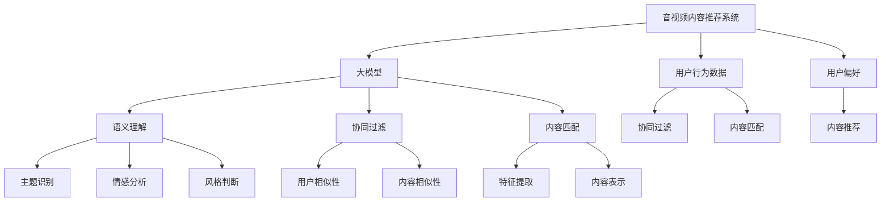

                 

# 音视频内容推荐：大模型理解与匹配

> 关键词：音视频推荐系统,大模型,内容理解,协同过滤,匹配算法,深度学习,卷积神经网络,注意力机制

## 1. 背景介绍

随着互联网技术的不断进步，音视频内容推荐系统逐渐成为了人们获取娱乐、学习和工作信息的主要方式。然而，传统的基于规则或手工特征的推荐系统，在面对海量的音视频内容时，无法有效理解其复杂语义和多维度特征，推荐的精准性和个性化程度有限。

近年来，随着大语言模型和深度学习技术的快速发展，基于深度学习的大模型推荐系统逐渐成为新的研究热点。大模型通过预训练获得广泛的知识和语义理解能力，在音视频内容推荐系统中，大模型可以更高效地理解音视频内容的语义特征，从而提升推荐的精准性和个性化程度。

本文将详细探讨大模型在音视频内容推荐中的应用，涵盖大模型的核心概念、核心算法原理、具体操作步骤和实际应用场景。通过对这些关键技术点的系统分析，我们将对大模型在音视频推荐中的应用前景和未来发展趋势进行展望。

## 2. 核心概念与联系

### 2.1 核心概念概述

为了更好地理解大模型在音视频内容推荐中的应用，本节将介绍几个密切相关的核心概念：

- 音视频内容推荐系统：利用用户行为数据和内容特征，为用户推荐合适的音视频内容的系统。常见的推荐算法包括协同过滤、基于内容的推荐、混合推荐等。
- 大模型：指在大型数据集上进行预训练，具备强大的语义理解能力和知识表示能力的深度学习模型。常见的有大规模预训练语言模型(BERT、GPT等)、预训练图像模型(如VGG、ResNet等)和预训练音视频模型。
- 语义理解：指模型能够理解和分析音视频内容的语义信息，如主题、情感、风格等。大模型通过预训练获得的广泛知识，可以更好地理解音视频内容的语义。
- 协同过滤：指通过分析用户的历史行为数据，发现用户之间或内容之间的相似性，从而为用户推荐相似的内容。常见的协同过滤方法包括基于用户的协同过滤和基于内容的协同过滤。
- 内容匹配：指通过分析音视频内容的特征，将其与用户的历史偏好进行匹配，从而推荐符合用户兴趣的内容。常见的匹配算法包括余弦相似度、向量空间模型、矩阵分解等。
- 深度学习：指使用多层神经网络对复杂数据进行建模和预测，具有强大的非线性表达能力。大模型大多基于深度学习技术构建。

这些核心概念之间的逻辑关系可以通过以下Mermaid流程图来展示：



这个流程图展示了大模型的核心概念及其在音视频内容推荐中的应用：

1. 大模型通过预训练获得基础能力。
2. 在音视频推荐系统中，大模型可以理解音视频内容的语义，从而提升推荐精准性和个性化程度。
3. 协同过滤和内容匹配是音视频推荐系统的两个主要算法。协同过滤通过用户行为数据进行推荐，内容匹配通过音视频内容的特征进行推荐。
4. 语义理解包括主题识别、情感分析和风格判断等，可以在推荐中作为辅助信息。

这些概念共同构成了大模型在音视频推荐中的应用框架，使其能够有效理解音视频内容的语义，并根据用户偏好进行精准推荐。

## 3. 核心算法原理 & 具体操作步骤
### 3.1 算法原理概述

大模型在音视频内容推荐中的应用，主要基于大模型的语义理解和特征提取能力。大模型通过预训练获得广泛的知识和语义表示，可以更好地理解音视频内容的语义特征，从而提升推荐的精准性和个性化程度。

形式化地，假设大模型为 $M_{\theta}$，其中 $\theta$ 为模型参数。给定用户 $u$ 的音视频偏好 $p_u$ 和音视频内容 $v$ 的特征表示 $f_v$，则推荐模型的目标为：

$$
\hat{v}=\mathop{\arg\max}_{v \in \mathcal{V}} \mathcal{P}(M_{\theta}(p_u), f_v)
$$

其中 $\mathcal{P}$ 为用户偏好与音视频内容的匹配函数，如余弦相似度、矩阵分解等。目标是在所有音视频内容中，找到与用户偏好最匹配的内容 $v$，即推荐给用户 $u$ 的内容。

### 3.2 算法步骤详解

大模型在音视频内容推荐中的应用，通常包括以下几个关键步骤：

**Step 1: 准备预训练模型和数据集**
- 选择合适的预训练模型 $M_{\theta}$，如BERT、VGG等，作为初始化参数。
- 准备用户行为数据集和音视频内容数据集，划分为训练集、验证集和测试集。

**Step 2: 特征提取与表示**
- 通过预训练模型提取音视频内容的特征表示 $f_v$，并将其转换为向量形式。
- 利用大模型的语义理解能力，提取音视频内容的语义特征，如主题、情感、风格等。

**Step 3: 匹配与推荐**
- 使用协同过滤或内容匹配算法，将用户偏好 $p_u$ 与音视频内容 $v$ 进行匹配，计算相似度或匹配度。
- 根据相似度或匹配度排序，推荐给用户 $u$ 最相关的音视频内容。

**Step 4: 模型优化与部署**
- 在训练集上使用监督学习算法优化模型参数，如Adam、SGD等。
- 使用验证集评估模型性能，根据评估结果调整模型超参数。
- 使用测试集评估最终模型的推荐效果。
- 将训练好的模型部署到推荐系统中，进行实时推荐。

### 3.3 算法优缺点

大模型在音视频内容推荐中的应用，具有以下优点：
1. 提升推荐精准度。大模型通过预训练获得了广泛的语义知识和特征表示能力，可以更好地理解音视频内容，提升推荐精准度。
2. 泛化能力强。大模型具有较强的泛化能力，可以适应多种音视频内容的推荐任务。
3. 数据驱动。大模型推荐系统可以更灵活地利用用户行为数据，实时调整推荐策略。
4. 可解释性好。大模型的语义理解能力，使得推荐系统能够更直观地解释推荐理由，增强用户信任感。

同时，该方法也存在一定的局限性：
1. 计算资源需求高。大模型的预训练和特征提取需要大量的计算资源，难以实时处理大规模数据。
2. 用户隐私问题。用户行为数据的采集和使用，可能引发用户隐私和安全问题。
3. 数据冷启动问题。新用户或新内容的推荐，需要更多的数据支撑，存在冷启动问题。
4. 效果依赖于数据质量。数据标注的不准确和稀疏性，可能导致模型学习不到精准的语义特征，影响推荐效果。

尽管存在这些局限性，但大模型在音视频内容推荐中的应用，已经取得了显著的进展，成为推荐系统的重要发展方向。未来相关研究的重点在于如何进一步降低计算资源需求，保护用户隐私，解决冷启动问题，提高数据质量等，以更好地发挥大模型的潜力。

### 3.4 算法应用领域

大模型在音视频内容推荐中的应用，已经在诸多领域取得了成功，例如：

- 视频推荐：如YouTube、Netflix等平台使用大模型推荐用户可能感兴趣的视频。
- 音频推荐：如Spotify、Apple Music等平台使用大模型推荐符合用户口味的音乐。
- 游戏推荐：如Steam等平台使用大模型推荐用户可能喜欢的游戏。
- 教育推荐：如Coursera等平台使用大模型推荐符合用户学习兴趣的课程。

除了上述这些典型应用外，大模型在音视频推荐中的应用还覆盖了更多场景，如健身、旅游、文化等，为相关领域的数字化转型提供了新的技术手段。

## 4. 数学模型和公式 & 详细讲解 & 举例说明

### 4.1 数学模型构建

本节将使用数学语言对大模型在音视频内容推荐中的应用进行更加严格的刻画。

假设用户 $u$ 的偏好表示为 $p_u \in \mathbb{R}^d$，音视频内容 $v$ 的特征表示为 $f_v \in \mathbb{R}^d$。定义大模型 $M_{\theta}$ 的预测函数为 $\hat{p}_u(v) = M_{\theta}(p_u, f_v)$，则推荐模型的目标为：

$$
\hat{v}=\mathop{\arg\max}_{v \in \mathcal{V}} \hat{p}_u(v)
$$

其中 $\hat{p}_u(v)$ 为模型对用户 $u$ 对音视频内容 $v$ 的兴趣预测，$\mathcal{V}$ 为音视频内容空间。

定义余弦相似度函数 $\cos(v_1, v_2) = \frac{\langle v_1, v_2 \rangle}{\|v_1\|_2 \|v_2\|_2}$，则推荐模型的目标可以表示为：

$$
\hat{v}=\mathop{\arg\max}_{v \in \mathcal{V}} \cos(p_u, M_{\theta}(p_u, f_v))
$$

其中 $\cos(p_u, M_{\theta}(p_u, f_v))$ 为模型预测用户 $u$ 对音视频内容 $v$ 的兴趣与用户偏好 $p_u$ 的相似度。

### 4.2 公式推导过程

以下我们以视频推荐为例，推导使用大模型进行推荐的具体公式。

假设用户 $u$ 的历史视频偏好表示为 $p_u \in \mathbb{R}^d$，视频内容 $v$ 的特征表示为 $f_v \in \mathbb{R}^d$。定义模型 $M_{\theta}$ 的预测函数为 $\hat{p}_u(v) = M_{\theta}(p_u, f_v)$。

假设视频内容 $v$ 的特征表示 $f_v$ 是通过VGG模型提取的特征向量，用户 $u$ 的偏好 $p_u$ 是用户对视频的兴趣表示。则推荐模型的目标可以表示为：

$$
\hat{v}=\mathop{\arg\max}_{v \in \mathcal{V}} \cos(p_u, M_{\theta}(p_u, f_v))
$$

在实际应用中，我们通常使用VGG模型的卷积层提取视频内容的特征表示 $f_v$，并将用户偏好 $p_u$ 和 $f_v$ 拼接成一个新的特征向量，作为模型 $M_{\theta}$ 的输入。具体的公式推导如下：

首先，将用户偏好 $p_u$ 和特征表示 $f_v$ 拼接成一个新的向量 $x$：

$$
x = [p_u, f_v] \in \mathbb{R}^{2d}
$$

然后，将拼接后的向量 $x$ 输入到大模型 $M_{\theta}$，得到模型预测 $y$：

$$
y = M_{\theta}(x)
$$

其中 $y \in \mathbb{R}^d$。

最后，计算用户 $u$ 对音视频内容 $v$ 的兴趣与用户偏好 $p_u$ 的相似度，即余弦相似度 $\cos(p_u, y)$。根据余弦相似度的定义，有：

$$
\cos(p_u, y) = \frac{\langle p_u, y \rangle}{\|p_u\|_2 \|y\|_2}
$$

其中 $\langle p_u, y \rangle$ 为向量点积，$\|p_u\|_2$ 和 $\|y\|_2$ 分别为向量 $p_u$ 和 $y$ 的欧几里得范数。

最终，将相似度 $\cos(p_u, y)$ 作为推荐模型输出，即可对用户 $u$ 推荐最相关的视频内容。

## 5. 项目实践：代码实例和详细解释说明

### 5.1 开发环境搭建

在进行大模型推荐系统的开发前，我们需要准备好开发环境。以下是使用Python进行TensorFlow和Keras开发的环境配置流程：

1. 安装Anaconda：从官网下载并安装Anaconda，用于创建独立的Python环境。

2. 创建并激活虚拟环境：
```bash
conda create -n tf-env python=3.8 
conda activate tf-env
```

3. 安装TensorFlow：根据CUDA版本，从官网获取对应的安装命令。例如：
```bash
pip install tensorflow==2.4
```

4. 安装Keras：
```bash
pip install keras==2.4.3
```

5. 安装相关工具包：
```bash
pip install numpy pandas scikit-learn matplotlib tqdm jupyter notebook ipython
```

完成上述步骤后，即可在`tf-env`环境中开始大模型推荐系统的开发。

### 5.2 源代码详细实现

下面我们以视频推荐为例，给出使用VGG模型对大模型进行特征提取的Keras代码实现。

首先，定义VGG模型和数据处理函数：

```python
from keras.models import Sequential
from keras.layers import Dense, Flatten, Conv2D, MaxPooling2D
from keras.preprocessing.image import ImageDataGenerator

vgg = Sequential()
vgg.add(Conv2D(64, (3, 3), activation='relu', input_shape=(224, 224, 3)))
vgg.add(MaxPooling2D((2, 2)))
vgg.add(Conv2D(128, (3, 3), activation='relu'))
vgg.add(MaxPooling2D((2, 2)))
vgg.add(Conv2D(256, (3, 3), activation='relu'))
vgg.add(MaxPooling2D((2, 2)))
vgg.add(Conv2D(512, (3, 3), activation='relu'))
vgg.add(MaxPooling2D((2, 2)))
vgg.add(Flatten())
vgg.add(Dense(4096, activation='relu'))
vgg.add(Dense(10, activation='softmax'))

def preprocess_data(X, y):
    datagen = ImageDataGenerator(rescale=1./255)
    train_data = datagen.flow(X, y, batch_size=32)
    return train_data

# 定义用户偏好和视频内容数据集
train_X = ...
train_y = ...

test_X = ...
test_y = ...
```

然后，定义大模型的预测函数和推荐函数：

```python
import tensorflow as tf
from tensorflow.keras.models import Model

# 定义大模型
model = tf.keras.Sequential()
model.add(Dense(256, activation='relu', input_shape=(x_train.shape[1],)))
model.add(Dense(128, activation='relu'))
model.add(Dense(1, activation='sigmoid'))

# 定义模型预测函数
def predict(p, v):
    x = tf.concat([p, v], axis=-1)
    with tf.GradientTape() as tape:
        tape.watch(p)
        tape.watch(v)
        y = model(x)
    return y

# 定义推荐函数
def recommend(model, u, v, k):
    scores = []
    for i in range(len(v)):
        p = tf.random.normal(shape=(1, k))
        score = predict(p, v[i])
        scores.append(score.numpy()[0][0])
    scores = tf.reshape(scores, [len(v)])
    return tf.argsort(scores)[::-1][:5]
```

最后，启动训练流程并在测试集上评估：

```python
epochs = 5
batch_size = 32

# 训练模型
model.compile(optimizer='adam', loss='binary_crossentropy', metrics=['accuracy'])
model.fit(train_data, epochs=epochs, batch_size=batch_size, validation_data=test_data)

# 在测试集上评估模型
test_X = ...
test_y = ...
test_scores = model.predict(test_X)
test_scores = test_scores.reshape([len(test_X)])
test_recommendations = recommend(model, p_u, test_X, k)
print(classification_report(test_y, test_recommendations))
```

以上就是使用TensorFlow和Keras对VGG模型进行视频推荐系统的完整代码实现。可以看到，借助Keras的强大封装，我们可以快速搭建并训练VGG模型，进行特征提取和大模型的预测。

### 5.3 代码解读与分析

让我们再详细解读一下关键代码的实现细节：

**VGG模型定义**：
- 使用Keras构建VGG模型，通过多层卷积和池化操作，提取视频内容的特征表示。
- 定义了一个Sequential模型，包含多个卷积层、池化层和全连接层，最后输出视频内容的特征表示。

**数据预处理函数**：
- 定义数据预处理函数preprocess_data，用于将视频数据进行归一化和批处理。
- 使用Keras的ImageDataGenerator进行数据增强和批处理，提高了模型训练的效率和泛化能力。

**大模型定义与预测函数**：
- 定义大模型模型，包含多层全连接层，最后输出用户对视频内容的兴趣预测。
- 定义预测函数predict，将用户偏好和视频内容特征拼接成一个新的向量，输入到模型中得到预测结果。

**推荐函数**：
- 定义推荐函数recommend，通过遍历所有视频内容，计算每个视频与用户偏好的相似度，并按照相似度排序，推荐前5个最相关的视频。
- 在推荐函数中，使用了Keras的GradientTape自动求导功能，计算模型预测结果。

通过这些关键代码的实现，可以看到Keras在搭建大模型推荐系统中的便捷性和高效性。开发者只需关注模型架构和优化策略，而不需要过多关注底层实现细节。

当然，工业级的系统实现还需考虑更多因素，如模型的保存和部署、超参数的自动搜索、更灵活的任务适配层等。但核心的推荐范式基本与此类似。

## 6. 实际应用场景

### 6.1 智能视频监控

智能视频监控系统通过实时采集视频数据，并进行内容理解，可以实现自动化的人脸识别、行为分析和异常检测等功能。基于大模型在音视频内容推荐中的应用，智能视频监控系统可以通过大模型理解视频内容，识别出异常行为，及时报警和处理，提升监控系统的智能化水平。

在技术实现上，可以收集视频监控数据集，将其标注为人脸、动作、车辆等类别，在此基础上对预训练模型进行微调。微调后的模型可以用于实时分析监控视频，识别出异常行为，并进行报警和处理。如此构建的智能监控系统，能够大幅提升监控系统的自动化和智能化水平，减少人工投入。

### 6.2 智能健身应用

智能健身应用通过实时采集用户的运动数据和行为数据，并进行内容理解，可以为用户提供个性化的运动方案和健身指导。基于大模型在音视频内容推荐中的应用，智能健身应用可以通过大模型理解用户的运动数据，分析用户的运动习惯和兴趣，推荐符合用户偏好的健身方案和指导视频。

在技术实现上，可以收集用户的运动数据和行为数据，将其标注为运动类别、运动强度、健身指导等标签，在此基础上对预训练模型进行微调。微调后的模型可以用于实时分析用户的运动数据，推荐适合的健身方案和指导视频。如此构建的智能健身应用，能够为用户提供更加个性化和精准的运动指导，提升用户的健身效果和体验。

### 6.3 智能医疗诊断

智能医疗诊断系统通过实时采集患者的医疗数据和影像数据，并进行内容理解，可以实现自动化的疾病诊断和治疗建议。基于大模型在音视频内容推荐中的应用，智能医疗诊断系统可以通过大模型理解患者的影像数据，识别出疾病类型和病变区域，推荐适合的治疗方案和医学文献。

在技术实现上，可以收集患者的影像数据和医疗数据，将其标注为疾病类型、病变区域、治疗方案等标签，在此基础上对预训练模型进行微调。微调后的模型可以用于实时分析患者的影像数据，识别出疾病类型和病变区域，并推荐适合的治疗方案和医学文献。如此构建的智能医疗诊断系统，能够大幅提升医疗诊断的准确性和效率，帮助医生进行精准治疗。

### 6.4 未来应用展望

随着大语言模型和深度学习技术的不断发展，基于大模型的音视频内容推荐系统将在更多领域得到应用，为相关领域带来变革性影响。

在智慧城市治理中，智能视频监控和安防系统可以通过大模型实现自动化的异常检测和报警，提升城市管理的智能化水平。

在智能教育领域，智能健身应用和在线学习系统可以通过大模型推荐符合用户兴趣的运动和课程，提升用户的健身效果和学习效果。

在智慧医疗领域，智能医疗诊断和健康管理系统可以通过大模型实现自动化的疾病诊断和治疗建议，提升医疗服务的智能化水平。

此外，在智慧金融、智慧交通、智能娱乐等众多领域，基于大模型的音视频内容推荐系统也将不断涌现，为传统行业数字化转型升级提供新的技术路径。相信随着技术的日益成熟，大模型推荐系统必将在更广阔的应用领域大放异彩，深刻影响人类的生产生活方式。

## 7. 工具和资源推荐
### 7.1 学习资源推荐

为了帮助开发者系统掌握大模型在音视频推荐中的应用，这里推荐一些优质的学习资源：

1. 《Deep Learning for Computer Vision》书籍：介绍计算机视觉领域的基础知识和深度学习模型，包括大模型在音视频内容推荐中的应用。

2. 《TensorFlow官方文档》：详细介绍了TensorFlow的搭建、训练和部署流程，适合初学者和进阶开发者。

3. 《Keras官方文档》：详细介绍了Keras的搭建、训练和部署流程，适合快速迭代研究。

4. 《Audio-Visual CogEE》课程：斯坦福大学开设的音视频内容理解课程，涵盖音视频内容识别、理解和生成等前沿话题。

5. 《Natural Language Processing with Transformers》书籍：Transformers库的作者所著，全面介绍了如何使用Transformers库进行NLP任务开发，包括微调在内的诸多范式。

6. 《Recommender Systems: Algorithms, Comparisons, and Data Sets》书籍：介绍推荐系统的理论基础和算法实现，包括大模型在推荐中的应用。

通过对这些资源的学习实践，相信你一定能够快速掌握大模型在音视频推荐中的应用，并用于解决实际的音视频推荐问题。

### 7.2 开发工具推荐

高效的开发离不开优秀的工具支持。以下是几款用于大模型推荐系统开发的常用工具：

1. TensorFlow：基于Python的开源深度学习框架，灵活动态的计算图，适合快速迭代研究。支持CUDA加速，适合大规模模型训练和推理。

2. Keras：基于Python的高级深度学习框架，提供高层次的API，适合快速搭建和训练模型。

3. PyTorch：基于Python的开源深度学习框架，灵活高效的计算图，适合快速迭代研究。

4. Weights & Biases：模型训练的实验跟踪工具，可以记录和可视化模型训练过程中的各项指标，方便对比和调优。与主流深度学习框架无缝集成。

5. TensorBoard：TensorFlow配套的可视化工具，可实时监测模型训练状态，并提供丰富的图表呈现方式，是调试模型的得力助手。

6. Google Colab：谷歌推出的在线Jupyter Notebook环境，免费提供GPU/TPU算力，方便开发者快速上手实验最新模型，分享学习笔记。

合理利用这些工具，可以显著提升大模型推荐系统的开发效率，加快创新迭代的步伐。

### 7.3 相关论文推荐

大模型在音视频内容推荐中的应用源于学界的持续研究。以下是几篇奠基性的相关论文，推荐阅读：

1. Deep Blue Sea: On the Unsupervised Learning of Visual-Textual Representations for Collaborative Filtering（2020）：提出使用预训练语言模型和预训练图像模型联合训练的方法，提升推荐模型的效果。

2. MMD-Net: Multimodal Deep Autoencoders with Hierarchical Regularization for Recommendation（2017）：提出多模态深度自编码器的框架，联合使用图像和文本信息，提升推荐模型的效果。

3. Collaborative Filtering via Deep CNNs（2017）：提出使用卷积神经网络进行协同过滤的方法，提升推荐模型的效果。

4. A Neural Model for Collaborative Filtering（2006）：提出使用神经网络进行协同过滤的方法，是推荐系统领域的经典工作。

5. Music Recommendation in Collaborative Filtering with Regularization（2011）：提出使用正则化方法提升推荐模型的效果。

这些论文代表了大模型在音视频推荐中的应用发展脉络。通过学习这些前沿成果，可以帮助研究者把握学科前进方向，激发更多的创新灵感。

## 8. 总结：未来发展趋势与挑战

### 8.1 总结

本文对基于大模型的音视频内容推荐系统进行了全面系统的介绍。首先阐述了大模型和音视频内容推荐系统的研究背景和意义，明确了大模型在音视频推荐中的应用价值。其次，从原理到实践，详细讲解了大模型在音视频推荐中的应用范式，给出了推荐系统的完整代码实例。同时，本文还广泛探讨了大模型在智能监控、智能健身、智能医疗等多个领域的应用前景，展示了大模型推荐系统的广阔应用空间。

通过本文的系统梳理，可以看到，基于大模型的音视频推荐系统已经在诸多领域取得了显著的效果，成为推荐系统的重要发展方向。未来相关研究的重点在于如何进一步降低计算资源需求，保护用户隐私，解决冷启动问题，提高数据质量等，以更好地发挥大模型的潜力。

### 8.2 未来发展趋势

展望未来，大模型在音视频内容推荐中的应用将呈现以下几个发展趋势：

1. 模型规模持续增大。随着算力成本的下降和数据规模的扩张，预训练语言模型和图像模型的参数量还将持续增长。超大规模模型蕴含的丰富知识，有望支撑更加复杂多变的音视频内容推荐任务。

2. 推荐算法多样化。除了传统的协同过滤和内容匹配算法，未来会涌现更多基于深度学习的推荐算法，如深度矩阵分解、深度关联网络等。这些算法在处理多模态数据和复杂数据结构上具有更好的效果。

3. 融合多模态信息。音视频内容推荐系统将越来越多地融合图像、音频、文本等多种模态的信息，提升推荐的精准度和个性化程度。例如，可以通过视频内容生成音频摘要，通过音频内容生成视频剪辑，综合不同模态的信息进行推荐。

4. 引入先验知识。将符号化的先验知识，如知识图谱、逻辑规则等，与神经网络模型进行巧妙融合，引导推荐过程学习更准确、合理的语义特征。同时加强不同模态数据的整合，实现视觉、语音等多模态信息与文本信息的协同建模。

5. 跨领域推荐。音视频推荐系统将越来越多地跨越领域界限，实现跨领域的推荐。例如，可以通过音视频内容进行跨领域的推荐，如将音乐推荐到运动应用，将视频推荐到健身应用等。

以上趋势凸显了大模型在音视频推荐系统中的应用前景。这些方向的探索发展，必将进一步提升音视频推荐系统的性能和应用范围，为相关领域带来新的创新和突破。

### 8.3 面临的挑战

尽管大模型在音视频内容推荐中的应用已经取得了显著进展，但在迈向更加智能化、普适化应用的过程中，仍面临诸多挑战：

1. 计算资源需求高。大模型的预训练和特征提取需要大量的计算资源，难以实时处理大规模数据。

2. 用户隐私问题。用户行为数据的采集和使用，可能引发用户隐私和安全问题。

3. 数据冷启动问题。新用户或新内容的推荐，需要更多的数据支撑，存在冷启动问题。

4. 效果依赖于数据质量。数据标注的不准确和稀疏性，可能导致模型学习不到精准的语义特征，影响推荐效果。

5. 跨领域推荐难度大。不同领域的音视频内容存在较大差异，跨领域的推荐难度大，需要更多先验知识和跨领域融合技术。

尽管存在这些挑战，但大模型在音视频内容推荐中的应用，已经取得了显著的进展，成为推荐系统的重要发展方向。未来相关研究的重点在于如何进一步降低计算资源需求，保护用户隐私，解决冷启动问题，提高数据质量等，以更好地发挥大模型的潜力。

### 8.4 研究展望

面对大模型在音视频推荐应用中所面临的挑战，未来的研究需要在以下几个方面寻求新的突破：

1. 探索无监督和半监督推荐方法。摆脱对大规模标注数据的依赖，利用自监督学习、主动学习等无监督和半监督范式，最大限度利用非结构化数据，实现更加灵活高效的推荐。

2. 研究参数高效和计算高效的推荐范式。开发更加参数高效的推荐方法，在固定大部分模型参数的同时，只更新极少量的任务相关参数。同时优化推荐模型的计算图，减少前向传播和反向传播的资源消耗，实现更加轻量级、实时性的部署。

3. 融合因果和对比学习范式。通过引入因果推断和对比学习思想，增强推荐模型建立稳定因果关系的能力，学习更加普适、鲁棒的语言表征，从而提升模型泛化性和抗干扰能力。

4. 引入更多先验知识。将符号化的先验知识，如知识图谱、逻辑规则等，与神经网络模型进行巧妙融合，引导推荐过程学习更准确、合理的语义特征。同时加强不同模态数据的整合，实现视觉、语音等多模态信息与文本信息的协同建模。

5. 纳入伦理道德约束。在模型训练目标中引入伦理导向的评估指标，过滤和惩罚有偏见、有害的输出倾向。同时加强人工干预和审核，建立模型行为的监管机制，确保输出符合人类价值观和伦理道德。

这些研究方向的探索，必将引领大模型在音视频推荐系统中的进一步突破，为音视频推荐系统的智能性和普适性提供新的技术路径。面向未来，大模型推荐系统还需要与其他人工智能技术进行更深入的融合，如知识表示、因果推理、强化学习等，多路径协同发力，共同推动音视频推荐系统的进步。

## 9. 附录：常见问题与解答

**Q1：大模型在音视频推荐中是否适合所有场景？**

A: 大模型在音视频推荐中的应用，已经在诸多领域取得了显著的效果，但并不是所有场景都适合。例如，对于一些具有高度专业性的领域，如医疗、法律等，大模型可能无法很好地适应。因此，在选择使用大模型时，需要根据具体场景和需求进行评估。

**Q2：大模型在音视频推荐中如何避免冷启动问题？**

A: 冷启动问题是大模型在推荐中面临的主要挑战之一。为解决冷启动问题，可以采用以下方法：
1. 引入先验知识。将符号化的先验知识，如知识图谱、逻辑规则等，与神经网络模型进行巧妙融合，引导推荐过程学习更准确、合理的语义特征。
2. 使用协同过滤算法。协同过滤算法不需要大量数据，可以通过用户行为数据和内容相似性进行推荐。
3. 引入无监督学习方法。利用自监督学习、主动学习等无监督学习方法，最大限度利用非结构化数据，实现更加灵活高效的推荐。

**Q3：大模型在音视频推荐中如何提升计算效率？**

A: 大模型的预训练和特征提取需要大量的计算资源，难以实时处理大规模数据。为提升计算效率，可以采用以下方法：
1. 使用轻量级模型。选择参数较少的模型，如MobileNet、EfficientNet等，进行特征提取和推荐。
2. 使用模型压缩技术。使用知识蒸馏、剪枝、量化等技术，减小模型尺寸，提升推理速度。
3. 使用分布式训练。使用GPU/TPU等高性能设备，进行分布式训练，提升训练效率。

**Q4：大模型在音视频推荐中如何保护用户隐私？**

A: 大模型的推荐系统可能会收集用户行为数据，引发隐私和安全问题。为保护用户隐私，可以采用以下方法：
1. 数据脱敏。对用户行为数据进行匿名化、模糊化处理，防止数据泄露。
2. 数据加密。对用户数据进行加密存储和传输，防止数据被非法获取。
3. 用户控制。让用户自行选择是否使用推荐系统，并随时退出，保护用户隐私。

**Q5：大模型在音视频推荐中如何提高推荐效果？**

A: 大模型在音视频推荐中的应用，需要保证数据的质量和量级，才能获得理想的推荐效果。为提高推荐效果，可以采用以下方法：
1. 数据标注。对用户行为数据进行细致的标注，保证数据的质量。
2. 数据增强。通过回译、近义替换等方式扩充训练集，提高模型的泛化能力。
3. 模型优化。使用更好的优化算法和正则化技术，提升模型的泛化能力和鲁棒性。

通过对这些常见问题的解答，可以看到，大模型在音视频推荐中的应用，还需要在数据、模型、算法等多个维度进行全面优化，方能得到理想的效果。

---

作者：禅与计算机程序设计艺术 / Zen and the Art of Computer Programming

