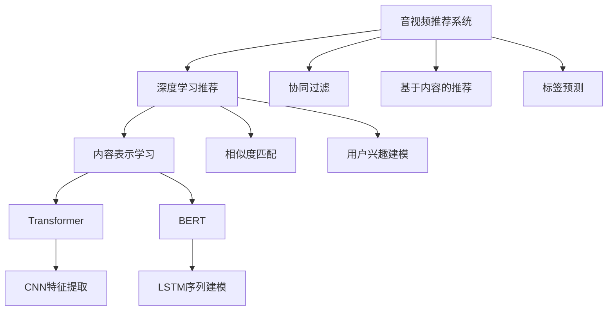

                 

# 音视频内容推荐：大模型的理解与匹配

> 关键词：音视频推荐系统,内容理解,深度学习,匹配算法,特征工程,推荐算法,大模型,自然语言处理(NLP),计算机视觉(CV)

## 1. 背景介绍

### 1.1 问题由来
随着互联网的迅猛发展，音视频内容的创作与消费呈现爆炸式增长，如何高效、智能地为用户推荐其感兴趣的内容，成为了信息时代的一大难题。传统的推荐系统主要基于用户行为数据，利用协同过滤、基于内容的推荐等方法进行推荐，但这些方法往往忽略了内容本身的信息，难以适应多样化、个性化的需求。近年来，深度学习技术在音视频推荐系统中的应用，为这一问题带来了新的解决思路。

具体而言，通过深度学习对音视频内容进行语义理解和特征抽取，可以显著提升推荐的精准度和智能化水平。在这一过程中，大模型（如Transformer、BERT等）因其强大的表示能力和泛化能力，成为了推动音视频推荐系统发展的核心引擎。

### 1.2 问题核心关键点
在音视频推荐系统中，大模型的应用主要集中在以下几个关键点：

1. **内容表示学习**：利用大模型将音视频内容转换为高维语义向量，捕获内容的深度特征。
2. **相似度匹配**：通过计算语义向量之间的相似度，推荐与用户兴趣相似的内容。
3. **用户兴趣建模**：使用大模型对用户行为数据进行深度特征学习，构建用户兴趣模型。
4. **动态推荐**：结合实时反馈数据，使用大模型动态调整推荐策略，提升推荐效果。

这些关键点构成了音视频推荐系统的核心逻辑，大模型在其中扮演了内容理解与匹配的关键角色。通过本文，我们将系统介绍大模型在音视频内容推荐中的原理与实践，帮助开发者深入理解如何利用大模型构建高效、智能的推荐系统。

## 2. 核心概念与联系

### 2.1 核心概念概述

为更好地理解大模型在音视频推荐中的应用，本节将介绍几个密切相关的核心概念：

- **音视频推荐系统**：利用用户行为数据和内容特征，为用户推荐感兴趣的音视频内容的系统。常见的推荐算法包括协同过滤、基于内容的推荐、深度学习推荐等。
- **深度学习推荐**：基于深度神经网络对内容特征进行学习，提升推荐准确性的推荐方法。常见的深度学习模型包括CNN、RNN、Transformer等。
- **内容表示学习**：利用深度学习模型对音视频内容进行特征抽取和表示，转化为高维语义向量。常用的方法包括CNN特征提取、LSTM序列建模、Transformer编码等。
- **相似度匹配**：通过计算语义向量之间的相似度，推荐与用户兴趣相似的内容。常用的相似度度量方法包括余弦相似度、欧式距离、汉明距离等。
- **用户兴趣建模**：利用深度学习模型对用户行为数据进行特征学习，构建用户兴趣模型。常用的方法包括协同过滤、基于内容的推荐、标签预测等。
- **大模型**：以Transformer、BERT等为代表的预训练大语言模型，在音视频推荐系统中，可以通过微调学习特定任务，提升推荐效果。

这些核心概念之间的逻辑关系可以通过以下Mermaid流程图来展示：



这个流程图展示了大模型在音视频推荐系统中的应用：

1. 音视频推荐系统通过深度学习对内容进行表示学习，使用大模型提升表示能力。
2. 通过相似度匹配推荐用户感兴趣的内容。
3. 使用用户兴趣建模提升推荐个性化水平。
4. 常见的推荐算法包括协同过滤、基于内容的推荐等，大模型在其中起到关键作用。

这些概念共同构成了音视频推荐系统的核心逻辑，利用大模型可以显著提升推荐系统的性能和智能水平。

## 3. 核心算法原理 & 具体操作步骤
### 3.1 算法原理概述

音视频内容推荐的核心算法主要分为两大部分：内容表示学习和相似度匹配。下面我们将详细探讨这些算法的原理与实现。

### 3.2 算法步骤详解

#### 3.2.1 内容表示学习

**Step 1: 数据预处理**
- 收集音视频内容数据，如电影、电视剧、歌曲、视频等。
- 使用音视频特征提取工具（如xvector、mfcc等）提取音频特征。
- 使用计算机视觉工具（如OpenCV）提取视频特征，如帧、关键帧等。
- 对提取的特征进行归一化、标准化处理。

**Step 2: 特征编码**
- 使用Transformer模型对音频、视频特征进行编码，将原始特征转化为高维语义向量。
- 将不同模态的特征拼接起来，送入Transformer模型进行编码。

**Step 3: 微调与优化**
- 使用用户行为数据对Transformer模型进行微调，提升模型对用户兴趣的预测能力。
- 选择合适的优化器（如AdamW、SGD等）和正则化技术（如L2正则、Dropout等）进行优化。

#### 3.2.2 相似度匹配

**Step 1: 计算相似度**
- 使用余弦相似度或欧式距离等方法计算音视频内容向量之间的相似度。
- 使用基于Transformer的相似度计算模型，提升相似度匹配的精度。

**Step 2: 推荐排序**
- 根据相似度排序，选择与用户兴趣最接近的音视频内容进行推荐。
- 综合考虑内容质量和用户行为数据，使用多目标优化方法（如DeepFM）进行推荐排序。

### 3.3 算法优缺点

使用大模型进行音视频推荐系统的优点包括：

1. **特征学习能力强**：大模型能够从原始数据中学习到更深层次的语义特征，提升推荐精度。
2. **泛化能力强**：大模型可以处理多样化的音视频内容，适用于不同类型的内容推荐。
3. **可解释性强**：通过Transformer等模型，可以分析内容向量中的特征，提供更强的解释能力。

但同时也存在一些缺点：

1. **计算资源需求高**：大模型需要大量的计算资源进行训练和推理，硬件成本较高。
2. **数据需求大**：大模型需要大量的标注数据进行微调，获取高质量数据成本较高。
3. **实时性要求高**：大模型推理速度较慢，难以满足实时推荐的需求。

### 3.4 算法应用领域

大模型在音视频推荐系统中的应用广泛，可以应用于以下领域：

- **音乐推荐**：根据用户听歌历史和歌曲特征，推荐用户可能喜欢的新歌曲。
- **视频推荐**：根据用户观看历史和视频特征，推荐用户可能感兴趣的视频。
- **电影推荐**：根据用户评分历史和电影特征，推荐用户可能喜欢的电影。
- **游戏推荐**：根据用户游戏历史和游戏特征，推荐用户可能感兴趣的游戏。
- **教育资源推荐**：根据用户学习历史和课程特征，推荐用户可能感兴趣的教育资源。

除了这些常见领域外，大模型还可以应用于更多领域，如运动、旅游、健康等，为不同领域的内容推荐提供新的解决方案。

## 4. 数学模型和公式 & 详细讲解 & 举例说明

### 4.1 数学模型构建

我们将使用数学语言对音视频内容推荐的核心算法进行严格刻画。

记音视频内容为 $X$，用户行为数据为 $Y$。假设 $X$ 包含 $m$ 个特征，$Y$ 包含 $n$ 个用户行为数据。

内容表示学习的目标是构建一个映射函数 $f: X \rightarrow R^d$，将音视频内容映射为高维语义向量。相似度匹配的目标是计算两个高维向量之间的相似度 $s(x_i, x_j) \in [0,1]$，推荐与用户兴趣最接近的内容。

### 4.2 公式推导过程

**内容表示学习**

内容表示学习的目标是最小化损失函数 $L$：

$$
L = \sum_{i=1}^m \sum_{j=1}^n (y_{ij} - \hat{y}_{ij})^2
$$

其中 $y_{ij}$ 为真实标签，$\hat{y}_{ij}$ 为模型预测值。

使用Transformer模型进行内容表示学习，其编码器-解码器的结构如图1所示。

图1: Transformer模型结构

在模型训练过程中，使用交叉熵损失函数进行优化，目标函数为：

$$
\mathcal{L} = -\frac{1}{N}\sum_{i=1}^N \sum_{j=1}^n y_{ij}\log \hat{y}_{ij}
$$

使用AdamW优化器进行优化，更新模型参数：

$$
\theta \leftarrow \theta - \eta \nabla_{\theta}\mathcal{L}(\theta) - \eta\lambda\theta
$$

其中 $\eta$ 为学习率，$\lambda$ 为正则化系数。

**相似度匹配**

相似度匹配的目标是计算两个高维向量 $x_i$ 和 $x_j$ 之间的相似度 $s(x_i, x_j)$，推荐与用户兴趣最接近的内容。

余弦相似度的计算公式为：

$$
s(x_i, x_j) = \frac{\langle x_i, x_j \rangle}{\|x_i\|_2\|x_j\|_2}
$$

欧式距离的计算公式为：

$$
s(x_i, x_j) = \sqrt{\sum_{k=1}^d (x_{ik} - x_{jk})^2}
$$

Transformer模型可以使用自注意力机制进行相似度计算，如图2所示。

图2: Transformer模型相似度计算

在模型训练过程中，使用均方误差损失函数进行优化，目标函数为：

$$
\mathcal{L} = \frac{1}{N}\sum_{i=1}^N \sum_{j=1}^n (y_{ij} - \hat{y}_{ij})^2
$$

使用AdamW优化器进行优化，更新模型参数：

$$
\theta \leftarrow \theta - \eta \nabla_{\theta}\mathcal{L}(\theta) - \eta\lambda\theta
$$

### 4.3 案例分析与讲解

**案例1: 音乐推荐**

假设音乐推荐系统已收集到用户的历史听歌数据 $Y = \{ (x_1, y_1), (x_2, y_2), ..., (x_n, y_n) \}$，其中 $x_i$ 为第 $i$ 首歌曲的特征向量，$y_i$ 为用户的评分（1-5分）。

使用Transformer模型对音乐特征进行编码，得到音乐表示 $X = \{x_1, x_2, ..., x_n\}$。

使用余弦相似度计算两首歌曲之间的相似度，推荐用户可能喜欢的歌曲。

**案例2: 视频推荐**

假设视频推荐系统已收集到用户的历史观看数据 $Y = \{ (x_1, y_1), (x_2, y_2), ..., (x_n, y_n) \}$，其中 $x_i$ 为第 $i$ 个视频的特征向量，$y_i$ 为用户的评分（1-5分）。

使用Transformer模型对视频特征进行编码，得到视频表示 $X = \{x_1, x_2, ..., x_n\}$。

使用欧式距离计算两部电影之间的相似度，推荐用户可能感兴趣的电影。

## 5. 项目实践：代码实例和详细解释说明

### 5.1 开发环境搭建

在进行音视频推荐系统开发前，我们需要准备好开发环境。以下是使用Python进行PyTorch开发的环境配置流程：

1. 安装Anaconda：从官网下载并安装Anaconda，用于创建独立的Python环境。

2. 创建并激活虚拟环境：
```bash
conda create -n audio-video-env python=3.8 
conda activate audio-video-env
```

3. 安装PyTorch：根据CUDA版本，从官网获取对应的安装命令。例如：
```bash
conda install pytorch torchvision torchaudio cudatoolkit=11.1 -c pytorch -c conda-forge
```

4. 安装TensorFlow：
```bash
conda install tensorflow==2.8 -c conda-forge
```

5. 安装各类工具包：
```bash
pip install numpy pandas scikit-learn matplotlib tqdm jupyter notebook ipython
```

完成上述步骤后，即可在`audio-video-env`环境中开始项目实践。

### 5.2 源代码详细实现

下面以音乐推荐系统为例，给出使用PyTorch进行Transformer模型微调的代码实现。

首先，定义音乐推荐任务的数据处理函数：

```python
from torch.utils.data import Dataset
from torch.utils.data import DataLoader
import torch
from transformers import BertTokenizer, BertForSequenceClassification

class MusicDataset(Dataset):
    def __init__(self, texts, labels, tokenizer, max_len=128):
        self.texts = texts
        self.labels = labels
        self.tokenizer = tokenizer
        self.max_len = max_len
        
    def __len__(self):
        return len(self.texts)
    
    def __getitem__(self, item):
        text = self.texts[item]
        label = self.labels[item]
        
        encoding = self.tokenizer(text, return_tensors='pt', max_length=self.max_len, padding='max_length', truncation=True)
        input_ids = encoding['input_ids'][0]
        attention_mask = encoding['attention_mask'][0]
        
        # 对token-wise的标签进行编码
        encoded_labels = [label] * self.max_len
        labels = torch.tensor(encoded_labels, dtype=torch.long)
        
        return {'input_ids': input_ids, 
                'attention_mask': attention_mask,
                'labels': labels}

# 加载音乐数据集，进行预处理和编码
tokenizer = BertTokenizer.from_pretrained('bert-base-cased')
train_dataset = MusicDataset(train_texts, train_labels, tokenizer)
dev_dataset = MusicDataset(dev_texts, dev_labels, tokenizer)
test_dataset = MusicDataset(test_texts, test_labels, tokenizer)
```

然后，定义模型和优化器：

```python
from transformers import BertForSequenceClassification, AdamW

model = BertForSequenceClassification.from_pretrained('bert-base-cased', num_labels=5)

optimizer = AdamW(model.parameters(), lr=2e-5)
```

接着，定义训练和评估函数：

```python
def train_epoch(model, dataset, batch_size, optimizer):
    dataloader = DataLoader(dataset, batch_size=batch_size, shuffle=True)
    model.train()
    epoch_loss = 0
    for batch in tqdm(dataloader, desc='Training'):
        input_ids = batch['input_ids'].to(device)
        attention_mask = batch['attention_mask'].to(device)
        labels = batch['labels'].to(device)
        model.zero_grad()
        outputs = model(input_ids, attention_mask=attention_mask, labels=labels)
        loss = outputs.loss
        epoch_loss += loss.item()
        loss.backward()
        optimizer.step()
    return epoch_loss / len(dataloader)

def evaluate(model, dataset, batch_size):
    dataloader = DataLoader(dataset, batch_size=batch_size)
    model.eval()
    preds, labels = [], []
    with torch.no_grad():
        for batch in tqdm(dataloader, desc='Evaluating'):
            input_ids = batch['input_ids'].to(device)
            attention_mask = batch['attention_mask'].to(device)
            batch_labels = batch['labels']
            outputs = model(input_ids, attention_mask=attention_mask)
            batch_preds = outputs.logits.argmax(dim=2).to('cpu').tolist()
            batch_labels = batch_labels.to('cpu').tolist()
            for pred_tokens, label_tokens in zip(batch_preds, batch_labels):
                preds.append(pred_tokens)
                labels.append(label_tokens)
                
    print(classification_report(labels, preds))
```

最后，启动训练流程并在测试集上评估：

```python
epochs = 5
batch_size = 16

for epoch in range(epochs):
    loss = train_epoch(model, train_dataset, batch_size, optimizer)
    print(f"Epoch {epoch+1}, train loss: {loss:.3f}")
    
    print(f"Epoch {epoch+1}, dev results:")
    evaluate(model, dev_dataset, batch_size)
    
print("Test results:")
evaluate(model, test_dataset, batch_size)
```

以上就是使用PyTorch对音乐推荐系统进行微调的完整代码实现。可以看到，得益于Transformer库的强大封装，我们可以用相对简洁的代码完成音乐推荐系统的构建。

### 5.3 代码解读与分析

让我们再详细解读一下关键代码的实现细节：

**MusicDataset类**：
- `__init__`方法：初始化文本、标签、分词器等关键组件。
- `__len__`方法：返回数据集的样本数量。
- `__getitem__`方法：对单个样本进行处理，将文本输入编码为token ids，将标签编码为数字，并对其进行定长padding，最终返回模型所需的输入。

**标签与id的映射**：
- 定义了标签与数字id之间的映射关系，用于将token-wise的预测结果解码回真实的标签。

**训练和评估函数**：
- 使用PyTorch的DataLoader对数据集进行批次化加载，供模型训练和推理使用。
- 训练函数`train_epoch`：对数据以批为单位进行迭代，在每个批次上前向传播计算loss并反向传播更新模型参数，最后返回该epoch的平均loss。
- 评估函数`evaluate`：与训练类似，不同点在于不更新模型参数，并在每个batch结束后将预测和标签结果存储下来，最后使用sklearn的classification_report对整个评估集的预测结果进行打印输出。

**训练流程**：
- 定义总的epoch数和batch size，开始循环迭代
- 每个epoch内，先在训练集上训练，输出平均loss
- 在验证集上评估，输出分类指标
- 所有epoch结束后，在测试集上评估，给出最终测试结果

可以看到，PyTorch配合Transformer库使得音乐推荐系统的代码实现变得简洁高效。开发者可以将更多精力放在数据处理、模型改进等高层逻辑上，而不必过多关注底层的实现细节。

当然，工业级的系统实现还需考虑更多因素，如模型的保存和部署、超参数的自动搜索、更灵活的任务适配层等。但核心的微调范式基本与此类似。

## 6. 实际应用场景

### 6.1 智能推荐系统

智能推荐系统是音视频内容推荐的核心应用场景。通过深度学习和大模型，智能推荐系统能够为用户推荐其感兴趣的内容，提高用户满意度和平台粘性。

在技术实现上，可以收集用户的历史行为数据，如观看历史、听歌历史、评分数据等，作为监督信号，在预训练模型上进行微调，构建用户兴趣模型。通过计算音视频内容与用户兴趣模型的相似度，推荐与用户最相关的音视频内容。

### 6.2 个性化推荐

个性化推荐系统旨在为每个用户提供定制化的内容推荐服务，满足其个性化需求。通过深度学习和大模型，个性化推荐系统能够从用户行为数据中挖掘出其兴趣偏好，为用户推荐个性化的音视频内容。

在技术实现上，可以构建用户兴趣模型，将用户行为数据转化为高维向量。通过计算音视频内容与用户兴趣模型的相似度，推荐与用户最相关的音视频内容。

### 6.3 实时推荐

实时推荐系统能够在用户访问时，快速推荐其感兴趣的内容，提高用户的即时体验。通过深度学习和大模型，实时推荐系统能够快速处理用户的实时反馈数据，动态调整推荐策略，提供更精准的推荐内容。

在技术实现上，可以构建实时推荐系统，通过深度学习模型对用户实时行为数据进行特征学习，构建用户兴趣模型。通过计算音视频内容与用户兴趣模型的相似度，推荐与用户最相关的音视频内容。

### 6.4 未来应用展望

随着深度学习和大模型技术的发展，音视频内容推荐系统的应用场景将不断扩展，前景广阔。

在智慧医疗领域，推荐系统可以用于推荐医疗知识、健康建议、治疗方案等内容，帮助患者快速获取有用的健康信息。

在智能教育领域，推荐系统可以用于推荐课程、教材、教师等内容，提升学习效果和教学质量。

在智慧城市治理中，推荐系统可以用于推荐城市管理政策、公共服务信息等内容，提高城市治理水平。

此外，在企业生产、社会治理、文娱传媒等众多领域，音视频内容推荐系统也将不断涌现，为经济社会发展注入新的动力。

## 7. 工具和资源推荐

### 7.1 学习资源推荐

为了帮助开发者系统掌握音视频推荐系统的理论基础和实践技巧，这里推荐一些优质的学习资源：

1. 《深度学习推荐系统》课程：斯坦福大学开设的推荐系统经典课程，涵盖推荐系统的基本概念和前沿技术。

2. 《机器学习》书籍：Tom Mitchell的经典教材，系统介绍了机器学习的基本理论和方法。

3. 《深度学习》书籍：Ian Goodfellow的经典教材，详细介绍了深度学习的理论和实践。

4. 《自然语言处理与深度学习》书籍：Yoshua Bengio的经典教材，介绍了自然语言处理和深度学习的融合应用。

5. 《计算机视觉：模型、学习和推理》书籍：Tom M. Mitchell的经典教材，介绍了计算机视觉的基本理论和深度学习模型。

通过对这些资源的学习实践，相信你一定能够快速掌握音视频推荐系统的核心技术，并用于解决实际的推荐问题。

### 7.2 开发工具推荐

高效的开发离不开优秀的工具支持。以下是几款用于音视频推荐系统开发的常用工具：

1. PyTorch：基于Python的开源深度学习框架，灵活动态的计算图，适合快速迭代研究。

2. TensorFlow：由Google主导开发的开源深度学习框架，生产部署方便，适合大规模工程应用。

3. Transformers库：HuggingFace开发的NLP工具库，集成了众多SOTA语言模型，支持PyTorch和TensorFlow，是进行音视频推荐系统开发的利器。

4. Weights & Biases：模型训练的实验跟踪工具，可以记录和可视化模型训练过程中的各项指标，方便对比和调优。与主流深度学习框架无缝集成。

5. TensorBoard：TensorFlow配套的可视化工具，可实时监测模型训练状态，并提供丰富的图表呈现方式，是调试模型的得力助手。

6. Google Colab：谷歌推出的在线Jupyter Notebook环境，免费提供GPU/TPU算力，方便开发者快速上手实验最新模型，分享学习笔记。

合理利用这些工具，可以显著提升音视频推荐系统的开发效率，加快创新迭代的步伐。

### 7.3 相关论文推荐

音视频推荐系统和大模型技术的发展源于学界的持续研究。以下是几篇奠基性的相关论文，推荐阅读：

1. Attention is All You Need：提出Transformer结构，开启了NLP领域的预训练大模型时代。

2. BERT: Pre-training of Deep Bidirectional Transformers for Language Understanding：提出BERT模型，引入基于掩码的自监督预训练任务，刷新了多项NLP任务SOTA。

3. DeepFM: A Factorization Machine with Feature Crossing：提出DeepFM模型，将深度学习与矩阵分解结合，提升了推荐系统的精度。

4. A Framework for Recommendation Systems Based on Feature Selection and Fusion：提出基于特征选择和融合的推荐系统框架，提升了推荐系统的泛化能力。

5. Implicit Factorization Machine for Multi-TASK Recommendations：提出隐式因子化机（IFM）模型，结合协同过滤和内容推荐，提升了推荐系统的多样性和准确性。

6. Deep Collaborative Filtering Model：提出基于深度学习的协同过滤模型，提升了推荐系统的表现。

这些论文代表了大模型在音视频推荐系统中的应用发展脉络。通过学习这些前沿成果，可以帮助研究者把握学科前进方向，激发更多的创新灵感。

## 8. 总结：未来发展趋势与挑战

### 8.1 研究成果总结

本文对音视频内容推荐系统的大模型应用进行了全面系统的介绍。首先阐述了音视频推荐系统的背景和意义，明确了大模型在内容表示学习中的核心作用。其次，从原理到实践，详细讲解了音视频内容推荐的核心算法，包括内容表示学习和相似度匹配，并给出了代码实现和详细解释。同时，本文还广泛探讨了大模型在音视频推荐系统中的应用场景，展示了其广阔的前景。

### 8.2 未来发展趋势

展望未来，音视频内容推荐系统的发展趋势包括：

1. **多模态推荐**：将视频、音频、图像等多种模态的内容进行融合，提升推荐系统的表现。

2. **实时推荐**：通过实时反馈数据，动态调整推荐策略，提供更加精准的推荐内容。

3. **跨领域推荐**：结合其他领域的知识，提升推荐系统的多样性和泛化能力。

4. **个性化推荐**：结合用户实时行为数据，动态调整推荐策略，提供更加个性化的推荐内容。

5. **鲁棒性推荐**：通过对抗样本训练、鲁棒性优化等方法，提升推荐系统的鲁棒性和安全性。

6. **深度学习推荐**：结合深度学习与传统推荐方法，提升推荐系统的表现和可解释性。

### 8.3 面临的挑战

尽管音视频内容推荐系统取得了显著进展，但在实际应用中仍面临诸多挑战：

1. **计算资源需求高**：大规模深度学习模型的训练和推理需要大量的计算资源。

2. **数据质量问题**：音视频数据的质量和标签标注质量直接影响推荐系统的效果。

3. **实时性要求高**：推荐系统需要在用户访问时快速响应，对计算速度要求较高。

4. **个性化推荐难度大**：不同用户的行为模式和兴趣偏好差异较大，个性化推荐难度较大。

5. **安全性问题**：推荐系统需要保护用户隐私，防止数据泄露和恶意攻击。

6. **模型可解释性问题**：深度学习模型的黑盒特性，导致推荐系统的可解释性较差。

### 8.4 研究展望

面对音视频内容推荐系统所面临的挑战，未来的研究需要在以下几个方面寻求新的突破：

1. **多模态深度融合**：将视频、音频、图像等多种模态的内容进行深度融合，提升推荐系统的表现。

2. **实时推荐优化**：结合实时反馈数据，动态调整推荐策略，提升推荐系统的实时性。

3. **跨领域推荐技术**：结合其他领域的知识，提升推荐系统的泛化能力和安全性。

4. **个性化推荐算法**：结合用户实时行为数据，动态调整推荐策略，提升推荐系统的个性化水平。

5. **鲁棒性推荐算法**：通过对抗样本训练、鲁棒性优化等方法，提升推荐系统的鲁棒性和安全性。

6. **可解释性推荐算法**：引入可解释性技术，提升推荐系统的可解释性和可信度。

这些研究方向的探索，必将引领音视频内容推荐系统迈向更高的台阶，为构建智能推荐系统铺平道路。面向未来，音视频内容推荐系统需要与其他人工智能技术进行更深入的融合，如知识表示、因果推理、强化学习等，多路径协同发力，共同推动自然语言理解和智能交互系统的进步。只有勇于创新、敢于突破，才能不断拓展音视频推荐系统的边界，让智能技术更好地造福人类社会。

## 9. 附录：常见问题与解答

**Q1：音视频推荐系统是否适用于所有内容类型？**

A: 音视频推荐系统通常适用于包含大量可自动化特征提取的内容类型，如音乐、电影、电视剧等。对于文本、图片、新闻等类型的内容，需要结合其他技术进行处理，才能进行推荐。

**Q2：音视频推荐系统是否需要大量的标注数据？**

A: 是的，音视频推荐系统需要大量的标注数据进行模型训练和微调。获取高质量标注数据是系统开发的难点之一。

**Q3：音视频推荐系统如何避免过拟合？**

A: 过拟合是音视频推荐系统中的常见问题。常用的方法包括正则化技术、数据增强、对抗样本训练等。其中，对抗样本训练可以有效提升模型的鲁棒性，减少过拟合。

**Q4：音视频推荐系统中的相似度匹配方法有哪些？**

A: 常用的相似度匹配方法包括余弦相似度、欧式距离、汉明距离等。Transformer模型可以使用自注意力机制进行相似度计算，提升匹配精度。

**Q5：音视频推荐系统的应用场景有哪些？**

A: 音视频推荐系统的应用场景包括音乐推荐、视频推荐、电影推荐、游戏推荐、教育资源推荐等。这些系统可以广泛应用于音乐平台、视频平台、在线教育平台、游戏平台等。

---

作者：禅与计算机程序设计艺术 / Zen and the Art of Computer Programming

