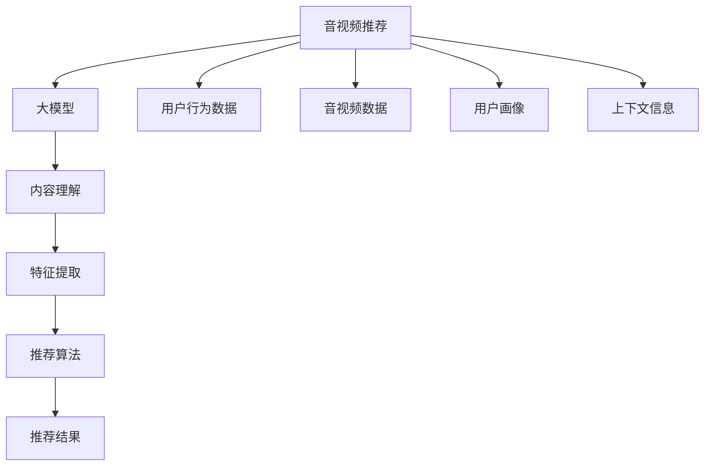

                 

# 音视频推荐：大模型的内容理解

## 1. 背景介绍

随着移动互联网和数字娱乐的快速发展，音视频推荐系统成为各大互联网公司争相探索的热门领域。传统的推荐系统主要基于用户行为数据（如浏览历史、评分、搜索关键词等）进行推荐，但这种基于历史数据的推荐方式存在数据稀疏、冷启动等问题，难以有效利用音视频内容本身的丰富信息。

近年来，随着深度学习技术的不断进步，大模型（Large Model）在音视频推荐领域展现出巨大的潜力。大模型通过在大规模文本、图片和音视频数据上进行预训练，学习到丰富的特征表示，能够深度理解音视频内容，并在推荐中充分发挥其理解能力。本文档将详细阐述如何利用大模型进行音视频推荐，并对其核心算法和应用场景进行深入分析。

## 2. 核心概念与联系

### 2.1 核心概念概述

- **音视频推荐**：基于用户的历史行为和当前兴趣，推荐合适的音视频内容。大模型在推荐中通常被用作内容理解工具，提取音视频内容的深度语义特征。

- **大模型**：指基于大规模数据（如文本、图片和音视频）进行预训练，拥有强大特征提取能力的大型神经网络模型。包括GPT、BERT等预训练语言模型，以及ResNet、EfficientNet等图像模型。

- **内容理解**：指模型通过训练和推理，理解和提取音视频内容中的语义信息，包括情感、主题、对象、动作等。

- **推荐系统**：通过用户行为和内容特征，预测用户兴趣，推送个性化推荐结果的智能化系统。

- **迁移学习**：利用预训练模型在特定任务上的微调，以提高推荐系统的效果。

- **增量学习**：在已有模型的基础上，通过新增样本持续优化模型，适应数据分布的变化。

- **多模态学习**：融合文本、图像、音频等多种模态的信息，提升推荐的准确性和丰富度。

### 2.2 核心概念原理和架构的 Mermaid 流程图



此图展示了音视频推荐系统的核心流程。从用户行为数据、音视频数据、用户画像和上下文信息，通过大模型进行内容理解，提取音视频内容的深度语义特征，最终利用推荐算法生成推荐结果。

## 3. 核心算法原理 & 具体操作步骤

### 3.1 算法原理概述

音视频推荐的核心原理是通过大模型进行内容理解，利用模型提取的语义特征，结合用户行为数据和上下文信息，预测用户对不同音视频内容的兴趣，从而进行个性化推荐。

大模型通常采用Transformer架构，通过自监督学习的方式在大规模数据上进行预训练。在预训练过程中，模型学习到丰富的特征表示，并能够在微调后针对特定推荐任务进行优化。常见的预训练任务包括掩码语言模型（如BERT）、自编码器（如ResNet）等。

音视频推荐过程中，大模型需要能够理解音视频内容的语义信息，包括情感、主题、对象、动作等。这通常涉及两个主要步骤：

1. 预训练：在大规模无标签音视频数据上进行预训练，学习到通用特征表示。
2. 微调：针对特定的推荐任务，使用少量标注数据进行微调，使模型具备针对性的特征提取能力。

### 3.2 算法步骤详解

音视频推荐的大模型应用流程包括以下几个关键步骤：

**Step 1: 准备预训练模型和数据集**

- 选择合适的预训练模型，如BERT、ResNet等。
- 准备推荐任务的数据集，包括用户行为数据、音视频数据等，并将其划分为训练集、验证集和测试集。

**Step 2: 添加推荐适配层**

- 根据推荐任务，设计合适的输出层和损失函数。
- 对于分类任务，通常使用交叉熵损失函数；对于回归任务，则使用均方误差损失函数。

**Step 3: 设置微调超参数**

- 选择合适的优化算法及其参数，如AdamW、SGD等，设置学习率、批大小、迭代轮数等。
- 设置正则化技术及强度，包括权重衰减、Dropout、Early Stopping等。
- 确定冻结预训练参数的策略，如仅微调顶层，或全部参数都参与微调。

**Step 4: 执行梯度训练**

- 将训练集数据分批次输入模型，前向传播计算损失函数。
- 反向传播计算参数梯度，根据设定的优化算法和学习率更新模型参数。
- 周期性在验证集上评估模型性能，根据性能指标决定是否触发 Early Stopping。
- 重复上述步骤直到满足预设的迭代轮数或 Early Stopping 条件。

**Step 5: 测试和部署**

- 在测试集上评估微调后模型，对比微调前后的精度提升。
- 使用微调后的模型对新样本进行推理预测，集成到实际的应用系统中。

### 3.3 算法优缺点

音视频推荐的大模型应用方法具有以下优点：

- 能够深度理解音视频内容，提取语义信息，提高推荐的准确性和个性化程度。
- 适用于多种音视频推荐场景，如视频推荐、音乐推荐等。
- 可以利用多模态数据进行融合，提高推荐的丰富度。

同时，该方法也存在以下局限性：

- 预训练和微调需要大量计算资源，模型训练和推理时间较长。
- 微调过程中容易发生过拟合，特别是在标注数据较少的情况下。
- 需要高质量的标注数据进行微调，标注成本较高。
- 对模型的结构要求较高，模型的设计和参数调整较为复杂。

### 3.4 算法应用领域

音视频推荐的大模型应用范围非常广泛，包括以下几个主要领域：

- **视频推荐**：根据用户观看历史、评分、评论等行为数据，推荐合适的视频内容。
- **音乐推荐**：根据用户的听歌历史、评分、分享等行为数据，推荐合适的音乐。
- **电视推荐**：根据用户对电视节目的观看历史和评分，推荐相关电视内容。
- **直播推荐**：根据用户的观看行为，推荐直播内容。
- **游戏推荐**：根据用户的游玩历史和评分，推荐游戏。

此外，音视频推荐的大模型应用还涉及多个垂直领域，如教育、医疗、军事等，具有广泛的适用性和应用前景。

## 4. 数学模型和公式 & 详细讲解 & 举例说明

### 4.1 数学模型构建

音视频推荐的大模型通常采用Transformer架构，使用自监督预训练任务进行训练。以BERT为例，其预训练任务主要包括掩码语言模型和下一句预测任务。

设预训练语言模型为 $M_{\theta}$，其输入为音视频文本 $x$，输出为隐藏表示 $h(x)$。预训练任务可以表示为：

$$
\mathcal{L}_{pretrain} = \frac{1}{N}\sum_{i=1}^N \mathcal{L}_{mask}(h(x_i), y_i) + \frac{1}{N}\sum_{i=1}^N \mathcal{L}_{next}(h(x_i), h(x_{i+1}))
$$

其中 $\mathcal{L}_{mask}$ 和 $\mathcal{L}_{next}$ 分别代表掩码语言模型和下一句预测任务的损失函数。

在微调阶段，假设微调任务为音视频分类任务，输入为音视频文本 $x$，输出为类别标签 $y$。微调任务可以表示为：

$$
\mathcal{L}_{fine-tune} = \frac{1}{N}\sum_{i=1}^N \mathcal{L}(h(x_i), y_i)
$$

其中 $\mathcal{L}$ 为微调任务的损失函数，可以是交叉熵损失函数等。

### 4.2 公式推导过程

以音视频分类任务为例，我们假设模型 $M_{\theta}$ 的输出层为线性层，激活函数为Softmax，损失函数为交叉熵损失函数。则模型在训练集上的损失函数可以表示为：

$$
\mathcal{L}_{fine-tune} = \frac{1}{N}\sum_{i=1}^N -\sum_{j=1}^C y_{i,j}\log M_{\theta}(x_i)_j
$$

其中 $C$ 为类别数量，$y_{i,j}$ 为样本 $x_i$ 的标签，$M_{\theta}(x_i)_j$ 为模型在类别 $j$ 上的预测概率。

### 4.3 案例分析与讲解

以音视频推荐中常用的迁移学习为例，假设有一个预训练好的BERT模型，需要在音视频分类任务上进行微调。具体步骤如下：

1. **数据准备**：收集用户的观看历史、评分、评论等行为数据，并将其划分为训练集、验证集和测试集。

2. **模型初始化**：将BERT模型加载到PyTorch中，并冻结预训练的权重。

3. **微调层设计**：在BERT模型的顶层添加一个线性层，用于输出分类结果，并设计交叉熵损失函数。

4. **微调训练**：将训练集数据分批次输入模型，前向传播计算损失函数。反向传播计算参数梯度，并根据优化算法更新模型参数。在每个epoch结束后，在验证集上评估模型性能。

5. **模型评估**：在测试集上评估微调后的模型，对比微调前后的精度提升。

## 5. 项目实践：代码实例和详细解释说明

### 5.1 开发环境搭建

音视频推荐的大模型应用通常需要高性能计算资源，包括GPU、TPU等。在搭建开发环境时，需要考虑以下几点：

- 安装Anaconda并创建虚拟环境。
- 安装PyTorch、TensorFlow等深度学习框架。
- 安装transformers、Pillow等常用库。
- 使用Docker容器化部署模型。

### 5.2 源代码详细实现

以下是一个基于BERT的音视频推荐系统实现的示例代码：

```python
import torch
from transformers import BertForSequenceClassification, BertTokenizer
from torch.utils.data import DataLoader, Dataset
import pandas as pd
import numpy as np

class AudioVideoDataset(Dataset):
    def __init__(self, data, tokenizer, max_len=128):
        self.data = data
        self.tokenizer = tokenizer
        self.max_len = max_len
        
    def __len__(self):
        return len(self.data)
    
    def __getitem__(self, idx):
        video_text, label = self.data.iloc[idx]
        tokenized_text = self.tokenizer(video_text, max_length=self.max_len, padding='max_length', truncation=True)
        input_ids = torch.tensor(tokenized_text['input_ids'])
        attention_mask = torch.tensor(tokenized_text['attention_mask'])
        label = torch.tensor(label)
        return {'input_ids': input_ids, 'attention_mask': attention_mask, 'labels': label}

# 数据预处理
def preprocess_data(data_path):
    data = pd.read_csv(data_path)
    tokenizer = BertTokenizer.from_pretrained('bert-base-cased')
    return AudioVideoDataset(data, tokenizer)

# 微调模型训练
def fine_tune_model(model, data_loader, optimizer, num_epochs):
    model.train()
    for epoch in range(num_epochs):
        for batch in data_loader:
            input_ids = batch['input_ids'].to(device)
            attention_mask = batch['attention_mask'].to(device)
            labels = batch['labels'].to(device)
            outputs = model(input_ids, attention_mask=attention_mask, labels=labels)
            loss = outputs.loss
            loss.backward()
            optimizer.step()
            optimizer.zero_grad()
        if (epoch+1) % 1 == 0:
            print(f'Epoch {epoch+1}, loss: {loss.item()}')

# 微调模型评估
def evaluate_model(model, data_loader):
    model.eval()
    with torch.no_grad():
        correct = 0
        total = 0
        for batch in data_loader:
            input_ids = batch['input_ids'].to(device)
            attention_mask = batch['attention_mask'].to(device)
            labels = batch['labels'].to(device)
            outputs = model(input_ids, attention_mask=attention_mask)
            _, predicted = torch.max(outputs.logits, 1)
            total += labels.size(0)
            correct += (predicted == labels).sum().item()
        accuracy = correct / total
        print(f'Accuracy: {accuracy:.2f}')

# 加载预训练模型
model = BertForSequenceClassification.from_pretrained('bert-base-cased', num_labels=10)

# 加载数据集
train_data = preprocess_data('train.csv')
dev_data = preprocess_data('dev.csv')
test_data = preprocess_data('test.csv')

# 划分数据集
train_data_loader = DataLoader(train_data, batch_size=16, shuffle=True)
dev_data_loader = DataLoader(dev_data, batch_size=16, shuffle=False)
test_data_loader = DataLoader(test_data, batch_size=16, shuffle=False)

# 设置超参数
device = torch.device('cuda' if torch.cuda.is_available() else 'cpu')
optimizer = torch.optim.AdamW(model.parameters(), lr=1e-5)
num_epochs = 5

# 训练模型
fine_tune_model(model, train_data_loader, optimizer, num_epochs)

# 评估模型
evaluate_model(model, test_data_loader)
```

### 5.3 代码解读与分析

该代码示例包含以下几个主要部分：

1. **数据集定义**：定义了音视频推荐的数据集类 `AudioVideoDataset`，用于加载和预处理音视频数据。
2. **模型微调**：定义了微调模型的函数 `fine_tune_model`，使用PyTorch训练模型。
3. **模型评估**：定义了评估模型的函数 `evaluate_model`，使用准确率评估模型性能。
4. **模型加载和评估**：加载预训练BERT模型，并使用加载的数据集进行微调和评估。

## 6. 实际应用场景

### 6.1 视频推荐

视频推荐系统是大模型在音视频推荐中的应用之一。通过大模型对视频内容进行深度理解，推荐系统可以分析视频的主题、风格、情感等特征，为用户推荐相关视频。例如，Netflix和YouTube等平台广泛使用大模型进行视频推荐，大幅提升用户体验。

### 6.2 音乐推荐

音乐推荐系统通过大模型理解音乐的内容和风格，推荐符合用户口味的音乐。Spotify等音乐平台利用大模型分析歌曲的情感、节奏和主题，为用户推荐个性化音乐。

### 6.3 电视推荐

电视推荐系统通过大模型分析电视节目的内容、演员和主题等特征，为用户推荐相关电视节目。例如，Netflix和Amazon Prime Video等平台广泛使用大模型进行电视推荐，帮助用户发现感兴趣的电视内容。

### 6.4 直播推荐

直播推荐系统通过大模型分析直播内容，为用户推荐直播节目。例如，Facebook等平台利用大模型分析直播的画质、主播风格和主题，为用户推荐适合的直播节目。

### 6.5 游戏推荐

游戏推荐系统通过大模型分析游戏的内容、玩法和玩家偏好，为用户推荐适合的游戏。例如，Steam等平台利用大模型分析游戏的难度、类型和主题，为用户推荐感兴趣的游戏。

## 7. 工具和资源推荐

### 7.1 学习资源推荐

为了深入理解大模型在音视频推荐中的应用，以下是一些推荐的学习资源：

1. **《深度学习自然语言处理》课程**：斯坦福大学开设的NLP明星课程，涵盖深度学习在NLP中的各种应用。
2. **《Transformer from Principle to Practice》系列博文**：由大模型技术专家撰写，涵盖Transformer、BERT等模型的原理和实践。
3. **HuggingFace官方文档**：提供丰富的预训练语言模型和微调样例代码，是学习大模型应用的重要资源。
4. **Coursera和edX等在线学习平台**：提供大量深度学习相关的课程和实践项目，涵盖从基础到高级的各种主题。

### 7.2 开发工具推荐

大模型在音视频推荐中的应用需要高性能计算资源，以下是一些推荐的工具：

1. **PyTorch和TensorFlow**：两个流行的深度学习框架，提供丰富的API和优化器。
2. **transformers库**：HuggingFace开发的NLP工具库，集成了多种预训练语言模型和推荐算法。
3. **Docker**：用于容器化部署模型的工具，方便管理和扩展。

### 7.3 相关论文推荐

以下是几篇具有代表性的论文，推荐阅读：

1. **"Pre-trained Representations for Text and Image Modeling"**：提出BERT等预训练语言模型，为音视频推荐系统提供了强大的内容理解工具。
2. **"Contextualized Representations for Image and Video Analysis"**：提出ResNet等图像模型，结合大模型进行多模态学习，提升音视频推荐系统的性能。
3. **"Cross-modal Feature Fusion for Recommendation System"**：提出跨模态特征融合方法，结合文本、图像和音频数据，提高音视频推荐系统的准确性和丰富度。

## 8. 总结：未来发展趋势与挑战

### 8.1 研究成果总结

大模型在音视频推荐中的应用取得了显著成效，但仍然面临诸多挑战。本文总结了以下几个方面的研究成果：

1. **大模型的深度理解能力**：大模型通过自监督预训练和微调，具备深度理解音视频内容的能力，显著提升了推荐的准确性和个性化程度。
2. **多模态融合**：利用文本、图像和音频等多模态数据进行融合，提高了推荐的丰富度和准确性。
3. **迁移学习**：通过在大规模数据上进行预训练，再针对特定推荐任务进行微调，极大地提升了模型性能。

### 8.2 未来发展趋势

展望未来，大模型在音视频推荐领域的发展将呈现以下几个趋势：

1. **大规模模型**：随着算力成本的下降和数据规模的扩大，预训练模型的参数量将持续增长，大模型的理解能力将进一步提升。
2. **多模态学习**：结合文本、图像和音频等多模态数据，进行更全面和深入的内容理解。
3. **迁移学习**：通过在大规模数据上进行预训练，再针对特定推荐任务进行微调，提升模型的泛化能力和适应性。
4. **增量学习**：通过持续学习和适应新数据，使模型不断优化和升级。
5. **实时推荐**：通过优化模型结构和算法，实现实时推荐，提升用户体验。

### 8.3 面临的挑战

大模型在音视频推荐中的应用仍面临诸多挑战：

1. **计算资源消耗大**：大模型的训练和推理需要高性能计算资源，成本较高。
2. **数据稀疏性**：音视频推荐系统需要大量标注数据进行微调，标注成本高，数据稀疏性问题难以解决。
3. **模型泛化能力**：大模型在特定领域数据上的泛化能力有限，需要更多的数据和更好的模型设计。
4. **模型鲁棒性**：大模型在对抗样本和噪声数据上的鲁棒性不足，需要进一步提升模型的鲁棒性。

### 8.4 研究展望

未来，大模型在音视频推荐领域的研究将从以下几个方面进行探索：

1. **数据增强**：利用数据增强技术，提高音视频推荐系统的数据利用率和模型鲁棒性。
2. **自监督学习**：利用自监督学习技术，减少标注数据的依赖，提高模型的泛化能力和适应性。
3. **增量学习**：通过增量学习，实现模型的持续优化和升级，适应数据分布的变化。
4. **多任务学习**：通过多任务学习，提升模型在多个推荐任务上的性能。
5. **跨领域迁移**：通过跨领域迁移学习，提升模型在不同推荐场景中的应用能力。

## 9. 附录：常见问题与解答

### Q1: 大模型在音视频推荐中能否处理实时数据？

A: 大模型通常需要较长的训练和推理时间，难以处理实时数据。为解决此问题，可以采用增量学习和模型压缩等技术，优化模型的计算图，提高实时推荐的能力。

### Q2: 大模型在音视频推荐中的表现是否与标注数据的质量有关？

A: 大模型在音视频推荐中的表现很大程度上取决于标注数据的质量。高质量的标注数据可以提高模型的准确性和泛化能力，而低质量的标注数据则可能导致模型过拟合或性能下降。

### Q3: 音视频推荐中如何使用大模型进行推荐？

A: 在音视频推荐中，大模型通常用于内容理解，提取音视频内容的深度语义特征。结合用户行为数据和上下文信息，使用推荐算法进行推荐。

### Q4: 音视频推荐中如何处理冷启动问题？

A: 冷启动问题可以通过多任务学习、自监督学习和多模态学习等方法来解决。例如，利用多模态数据进行内容理解，或使用自监督学习进行预训练，提高模型在冷启动场景下的表现。

### Q5: 音视频推荐中如何提升模型的可解释性？

A: 提升模型的可解释性可以通过可视化技术、特征重要性分析和模型解释算法等方法来实现。例如，利用模型解释算法可视化模型的决策过程，帮助用户理解模型推荐的依据。

---

作者：禅与计算机程序设计艺术 / Zen and the Art of Computer Programming

