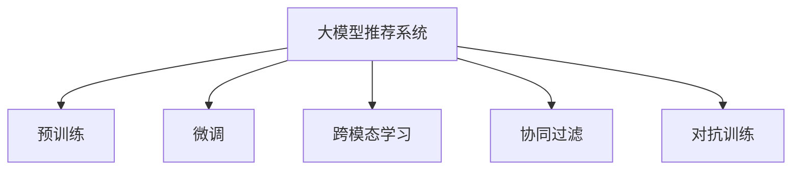

                 

# 音视频领域大模型推荐的机遇与挑战

## 1. 背景介绍

### 1.1 问题由来
随着人工智能技术的飞速发展，音视频领域的各类大模型推荐系统也在不断涌现。通过大模型推荐系统，用户可以快速获取感兴趣的音视频内容，提升用户体验和满意度。然而，面对海量数据和多样的用户需求，如何设计高效、智能的推荐系统，成为当前音视频领域的一大挑战。

### 1.2 问题核心关键点
大模型推荐系统通常通过自监督或监督学习的方式，对大规模音视频数据进行预训练，学习到丰富的语义和内容特征。然后，通过微调或融合更多先验知识，使预训练模型在特定任务上取得更好的性能。这些模型在音视频推荐系统中的应用，主要体现在以下几个方面：

1. **内容嵌入**：将音视频内容编码成高维向量，用于相似度计算和推荐。
2. **用户嵌入**：将用户画像编码成高维向量，用于推荐策略的制定。
3. **跨模态融合**：将音视频内容的视觉、音频、文本等多个模态信息融合，增强推荐的准确性。
4. **协同过滤**：通过分析用户间的交互行为，学习用户间的相似性，用于推荐新内容。

目前，大模型推荐系统已经在视频推荐、音频推荐、个性化视频搜索等领域取得了显著成效，成为音视频内容推荐的重要手段。

### 1.3 问题研究意义
研究大模型推荐系统，对于提升音视频内容推荐的精准性和个性化程度，优化用户体验，加速内容消费迭代，具有重要意义：

1. **提升推荐效果**：通过大模型推荐，可以利用大规模无标签数据进行预训练，学习到通用的音视频特征，从而在特定任务上取得更好的推荐效果。
2. **降低开发成本**：大模型推荐系统减少了从头开发所需的数据、计算和人力等成本投入，加快音视频推荐应用的部署速度。
3. **增强用户粘性**：精准推荐可以满足用户的个性化需求，提升用户满意度和忠诚度，增加平台的用户粘性。
4. **促进产业升级**：音视频推荐系统技术的发展，将推动内容消费模式的变革，加速音视频产业的数字化升级。
5. **激发技术创新**：推荐系统是AI技术应用的重要领域，相关研究可以催生更多前沿技术，如跨模态学习、对抗训练等。

## 2. 核心概念与联系

### 2.1 核心概念概述

为更好地理解大模型推荐系统，本节将介绍几个关键概念：

- **大模型推荐系统**：通过大规模预训练模型进行音视频推荐，能够充分利用音视频数据中的高层次语义和内容特征，提升推荐的精准性和个性化程度。
- **预训练**：在大规模无标签数据上进行自监督学习，学习到通用的音视频特征表示。
- **微调**：在特定任务上，通过有标签数据对预训练模型进行微调，进一步提升模型在该任务上的性能。
- **跨模态学习**：将视觉、音频、文本等不同模态的信息进行融合，学习到更加全面、丰富的语义表示。
- **协同过滤**：通过分析用户间的交互行为，学习用户间的相似性，用于推荐新内容。
- **对抗训练**：通过引入对抗样本，提高模型的鲁棒性和泛化能力。

这些概念之间的逻辑关系可以通过以下Mermaid流程图来展示：



这个流程图展示了大模型推荐系统的核心概念及其之间的关系：

1. 大模型推荐系统通过预训练获得基础能力。
2. 微调是对预训练模型进行任务特定的优化，进一步提升模型在特定任务上的性能。
3. 跨模态学习将不同模态的信息进行融合，增强推荐的准确性。
4. 协同过滤通过分析用户间的交互行为，学习用户间的相似性。
5. 对抗训练通过引入对抗样本，提高模型的鲁棒性。

这些概念共同构成了大模型推荐系统的学习框架，使其能够在大规模音视频数据上生成精准的推荐内容。通过理解这些核心概念，我们可以更好地把握大模型推荐系统的原理和工作机制。

## 3. 核心算法原理 & 具体操作步骤
### 3.1 算法原理概述

基于大模型的音视频推荐系统，本质上是利用大规模无标签数据进行预训练，并通过微调方法在特定任务上优化推荐效果。其核心思想是：将预训练的大模型视作一个强大的"特征提取器"，通过有监督地训练来优化模型在特定推荐任务上的性能。

形式化地，假设预训练模型为 $M_{\theta}$，其中 $\theta$ 为预训练得到的模型参数。给定推荐任务 $T$ 的标注数据集 $D=\{(x_i, y_i)\}_{i=1}^N$，推荐系统的目标是最小化模型预测输出与真实标签之间的差异，即：

$$
\hat{\theta}=\mathop{\arg\min}_{\theta} \mathcal{L}(M_{\theta},D)
$$

其中 $\mathcal{L}$ 为针对任务 $T$ 设计的损失函数，用于衡量模型预测输出与真实标签之间的差异。常见的损失函数包括交叉熵损失、均方误差损失等。

通过梯度下降等优化算法，推荐系统不断更新模型参数 $\theta$，最小化损失函数 $\mathcal{L}$，使得模型输出逼近真实标签。由于 $\theta$ 已经通过预训练获得了较好的初始化，因此即便在少量标签样本上进行微调，也能较快收敛到理想的模型参数 $\hat{\theta}$。

### 3.2 算法步骤详解

基于大模型的音视频推荐系统一般包括以下几个关键步骤：

**Step 1: 准备预训练模型和数据集**
- 选择合适的预训练模型 $M_{\theta}$ 作为初始化参数，如 BERT、GPT、ResNet 等。
- 准备推荐任务 $T$ 的标注数据集 $D$，划分为训练集、验证集和测试集。一般要求标注数据与预训练数据的分布不要差异过大。

**Step 2: 设计推荐目标函数**
- 根据推荐任务类型，设计合适的输出层和损失函数。
- 对于二分类推荐任务，通常使用sigmoid激活函数输出用户对推荐内容的偏好，以二元交叉熵为损失函数。
- 对于多分类推荐任务，使用softmax激活函数输出用户对多个内容的偏好，以分类交叉熵为损失函数。

**Step 3: 设置推荐超参数**
- 选择合适的优化算法及其参数，如 Adam、SGD 等，设置学习率、批大小、迭代轮数等。
- 设置正则化技术及强度，包括权重衰减、Dropout、Early Stopping 等。
- 确定冻结预训练参数的策略，如仅微调顶层，或全部参数都参与微调。

**Step 4: 执行梯度训练**
- 将训练集数据分批次输入模型，前向传播计算损失函数。
- 反向传播计算参数梯度，根据设定的优化算法和学习率更新模型参数。
- 周期性在验证集上评估模型性能，根据性能指标决定是否触发 Early Stopping。
- 重复上述步骤直到满足预设的迭代轮数或 Early Stopping 条件。

**Step 5: 测试和部署**
- 在测试集上评估推荐系统 $M_{\hat{\theta}}$ 的性能，对比微调前后的推荐效果提升。
- 使用推荐系统对新用户进行推荐，集成到实际的应用系统中。
- 持续收集新的用户反馈和行为数据，定期重新微调模型，以适应数据分布的变化。

以上是基于大模型进行音视频推荐的一般流程。在实际应用中，还需要针对具体任务的特点，对微调过程的各个环节进行优化设计，如改进推荐目标函数，引入更多的正则化技术，搜索最优的超参数组合等，以进一步提升推荐效果。

### 3.3 算法优缺点

基于大模型的音视频推荐系统具有以下优点：
1. 简单高效。通过预训练模型，可以快速适应新的推荐任务，并获得较大的性能提升。
2. 泛化能力强。由于预训练模型已经学习到通用的音视频特征，对不同任务具有较强的泛化能力。
3. 参数高效。利用参数高效微调技术，在固定大部分预训练参数的情况下，仍可取得不错的推荐效果。
4. 实时性高。推荐系统可以在线部署，实时获取用户反馈和行为数据，进行动态调整。

同时，该方法也存在一定的局限性：
1. 数据依赖。推荐效果很大程度上取决于标注数据的质量和数量，获取高质量标注数据的成本较高。
2. 迁移能力有限。当推荐任务与预训练数据的分布差异较大时，推荐系统的性能提升有限。
3. 冷启动问题。对于新用户或新内容，由于缺乏历史数据，难以进行精准推荐。
4. 对抗攻击风险。推荐模型容易受到对抗攻击，如假冒数据、恶意推荐等，带来潜在风险。

尽管存在这些局限性，但就目前而言，基于大模型的推荐系统仍是音视频推荐领域的主流范式。未来相关研究的重点在于如何进一步降低推荐对标注数据的依赖，提高模型的少样本学习和跨领域迁移能力，同时兼顾实时性、可解释性和安全性等因素。

### 3.4 算法应用领域

基于大模型的音视频推荐系统已经在多个领域得到了广泛应用，包括但不限于：

- **视频推荐**：如Netflix、YouTube等平台，根据用户的历史观看记录，推荐用户可能感兴趣的视频内容。
- **音频推荐**：如Spotify、Apple Music等平台，根据用户的听歌历史，推荐音乐、播客等内容。
- **个性化视频搜索**：如TikTok等平台，根据用户的搜索历史和浏览行为，推荐视频内容。
- **跨模态推荐**：如视频和音频的推荐、图像和文本的推荐等，利用跨模态融合技术，提升推荐效果。
- **协同过滤**：如基于用户和内容的协同过滤模型，学习用户间的相似性，推荐新内容。

除了上述这些经典应用外，音视频推荐系统还被创新性地应用到更多场景中，如智能广告投放、内容创作、智能家居等，为音视频内容推荐带来了全新的突破。随着推荐模型的不断演进，相信音视频推荐技术将进一步拓展其应用领域，提升用户体验。

## 4. 数学模型和公式 & 详细讲解
### 4.1 数学模型构建

本节将使用数学语言对基于大模型的音视频推荐过程进行更加严格的刻画。

记预训练模型为 $M_{\theta}$，其中 $\theta$ 为预训练得到的模型参数。假设推荐任务为 $T$，给定训练集 $D=\{(x_i, y_i)\}_{i=1}^N$，其中 $x_i$ 为音视频内容特征向量，$y_i$ 为推荐标签，可以表示为 0-1 二元变量或热向量。

定义模型 $M_{\theta}$ 在输入 $x$ 上的输出为 $\hat{y}=M_{\theta}(x)$，表示模型对推荐内容 $x$ 的推荐偏好概率。推荐系统的目标是最小化经验风险，即：

$$
\hat{\theta}=\mathop{\arg\min}_{\theta} \mathcal{L}(M_{\theta},D)
$$

其中 $\mathcal{L}$ 为针对任务 $T$ 设计的损失函数，用于衡量模型预测输出与真实标签之间的差异。常见的损失函数包括交叉熵损失、均方误差损失等。

通过梯度下降等优化算法，推荐系统不断更新模型参数 $\theta$，最小化损失函数 $\mathcal{L}$，使得模型输出逼近真实标签。由于 $\theta$ 已经通过预训练获得了较好的初始化，因此即便在少量标签样本上进行微调，也能较快收敛到理想的模型参数 $\hat{\theta}$。

### 4.2 公式推导过程

以下我们以二分类推荐任务为例，推导交叉熵损失函数及其梯度的计算公式。

假设模型 $M_{\theta}$ 在输入 $x$ 上的输出为 $\hat{y}=M_{\theta}(x) \in [0,1]$，表示用户对推荐内容的偏好概率。真实标签 $y \in \{0,1\}$。则二分类交叉熵损失函数定义为：

$$
\ell(M_{\theta}(x),y) = -[y\log \hat{y} + (1-y)\log (1-\hat{y})]
$$

将其代入经验风险公式，得：

$$
\mathcal{L}(\theta) = -\frac{1}{N}\sum_{i=1}^N [y_i\log M_{\theta}(x_i)+(1-y_i)\log(1-M_{\theta}(x_i))]
$$

根据链式法则，损失函数对参数 $\theta_k$ 的梯度为：

$$
\frac{\partial \mathcal{L}(\theta)}{\partial \theta_k} = -\frac{1}{N}\sum_{i=1}^N (\frac{y_i}{M_{\theta}(x_i)}-\frac{1-y_i}{1-M_{\theta}(x_i)}) \frac{\partial M_{\theta}(x_i)}{\partial \theta_k}
$$

其中 $\frac{\partial M_{\theta}(x_i)}{\partial \theta_k}$ 可进一步递归展开，利用自动微分技术完成计算。

在得到损失函数的梯度后，即可带入参数更新公式，完成模型的迭代优化。重复上述过程直至收敛，最终得到适应推荐任务的最优模型参数 $\hat{\theta}$。

## 5. 项目实践：代码实例和详细解释说明
### 5.1 开发环境搭建

在进行推荐系统开发前，我们需要准备好开发环境。以下是使用Python进行PyTorch开发的环境配置流程：

1. 安装Anaconda：从官网下载并安装Anaconda，用于创建独立的Python环境。

2. 创建并激活虚拟环境：
```bash
conda create -n pytorch-env python=3.8 
conda activate pytorch-env
```

3. 安装PyTorch：根据CUDA版本，从官网获取对应的安装命令。例如：
```bash
conda install pytorch torchvision torchaudio cudatoolkit=11.1 -c pytorch -c conda-forge
```

4. 安装Transformers库：
```bash
pip install transformers
```

5. 安装各类工具包：
```bash
pip install numpy pandas scikit-learn matplotlib tqdm jupyter notebook ipython
```

完成上述步骤后，即可在`pytorch-env`环境中开始推荐系统开发。

### 5.2 源代码详细实现

这里我们以音频推荐系统为例，给出使用Transformers库对BERT模型进行音频推荐微调的PyTorch代码实现。

首先，定义音频推荐任务的数据处理函数：

```python
from transformers import BertTokenizer
from torch.utils.data import Dataset
import torch

class AudioDataset(Dataset):
    def __init__(self, audio_paths, labels, tokenizer, max_len=128):
        self.audio_paths = audio_paths
        self.labels = labels
        self.tokenizer = tokenizer
        self.max_len = max_len
        
    def __len__(self):
        return len(self.audio_paths)
    
    def __getitem__(self, item):
        audio_path = self.audio_paths[item]
        label = self.labels[item]
        
        with open(audio_path, 'rb') as f:
            audio_data = f.read()
            
        encoding = self.tokenizer(audio_data, return_tensors='pt', max_length=self.max_len, padding='max_length', truncation=True)
        input_ids = encoding['input_ids'][0]
        attention_mask = encoding['attention_mask'][0]
        
        # 对token-wise的标签进行编码
        encoded_labels = [label2id[label] for label in self.labels] 
        encoded_labels.extend([label2id['O']] * (self.max_len - len(encoded_labels)))
        labels = torch.tensor(encoded_labels, dtype=torch.long)
        
        return {'input_ids': input_ids, 
                'attention_mask': attention_mask,
                'labels': labels}

# 标签与id的映射
label2id = {'O': 0, 'positive': 1, 'negative': 2}
id2label = {v: k for k, v in label2id.items()}

# 创建dataset
tokenizer = BertTokenizer.from_pretrained('bert-base-cased')

train_dataset = AudioDataset(train_audio_paths, train_labels, tokenizer)
dev_dataset = AudioDataset(dev_audio_paths, dev_labels, tokenizer)
test_dataset = AudioDataset(test_audio_paths, test_labels, tokenizer)
```

然后，定义模型和优化器：

```python
from transformers import BertForTokenClassification, AdamW

model = BertForTokenClassification.from_pretrained('bert-base-cased', num_labels=len(label2id))

optimizer = AdamW(model.parameters(), lr=2e-5)
```

接着，定义训练和评估函数：

```python
from torch.utils.data import DataLoader
from tqdm import tqdm
from sklearn.metrics import classification_report

device = torch.device('cuda') if torch.cuda.is_available() else torch.device('cpu')
model.to(device)

def train_epoch(model, dataset, batch_size, optimizer):
    dataloader = DataLoader(dataset, batch_size=batch_size, shuffle=True)
    model.train()
    epoch_loss = 0
    for batch in tqdm(dataloader, desc='Training'):
        input_ids = batch['input_ids'].to(device)
        attention_mask = batch['attention_mask'].to(device)
        labels = batch['labels'].to(device)
        model.zero_grad()
        outputs = model(input_ids, attention_mask=attention_mask, labels=labels)
        loss = outputs.loss
        epoch_loss += loss.item()
        loss.backward()
        optimizer.step()
    return epoch_loss / len(dataloader)

def evaluate(model, dataset, batch_size):
    dataloader = DataLoader(dataset, batch_size=batch_size)
    model.eval()
    preds, labels = [], []
    with torch.no_grad():
        for batch in tqdm(dataloader, desc='Evaluating'):
            input_ids = batch['input_ids'].to(device)
            attention_mask = batch['attention_mask'].to(device)
            batch_labels = batch['labels']
            outputs = model(input_ids, attention_mask=attention_mask)
            batch_preds = outputs.logits.argmax(dim=2).to('cpu').tolist()
            batch_labels = batch_labels.to('cpu').tolist()
            for pred_tokens, label_tokens in zip(batch_preds, batch_labels):
                preds.append(pred_tokens[:len(label_tokens)])
                labels.append(label_tokens)
                
    print(classification_report(labels, preds))
```

最后，启动训练流程并在测试集上评估：

```python
epochs = 5
batch_size = 16

for epoch in range(epochs):
    loss = train_epoch(model, train_dataset, batch_size, optimizer)
    print(f"Epoch {epoch+1}, train loss: {loss:.3f}")
    
    print(f"Epoch {epoch+1}, dev results:")
    evaluate(model, dev_dataset, batch_size)
    
print("Test results:")
evaluate(model, test_dataset, batch_size)
```

以上就是使用PyTorch对BERT模型进行音频推荐微调的完整代码实现。可以看到，得益于Transformers库的强大封装，我们可以用相对简洁的代码完成BERT模型的加载和微调。

### 5.3 代码解读与分析

让我们再详细解读一下关键代码的实现细节：

**AudioDataset类**：
- `__init__`方法：初始化音频路径、标签、分词器等关键组件。
- `__len__`方法：返回数据集的样本数量。
- `__getitem__`方法：对单个样本进行处理，将音频文件输入编码为token ids，将标签编码为数字，并对其进行定长padding，最终返回模型所需的输入。

**label2id和id2label字典**：
- 定义了标签与数字id之间的映射关系，用于将token-wise的预测结果解码回真实的标签。

**训练和评估函数**：
- 使用PyTorch的DataLoader对数据集进行批次化加载，供模型训练和推理使用。
- 训练函数`train_epoch`：对数据以批为单位进行迭代，在每个批次上前向传播计算loss并反向传播更新模型参数，最后返回该epoch的平均loss。
- 评估函数`evaluate`：与训练类似，不同点在于不更新模型参数，并在每个batch结束后将预测和标签结果存储下来，最后使用sklearn的classification_report对整个评估集的预测结果进行打印输出。

**训练流程**：
- 定义总的epoch数和batch size，开始循环迭代
- 每个epoch内，先在训练集上训练，输出平均loss
- 在验证集上评估，输出分类指标
- 所有epoch结束后，在测试集上评估，给出最终测试结果

可以看到，PyTorch配合Transformers库使得BERT微调的代码实现变得简洁高效。开发者可以将更多精力放在数据处理、模型改进等高层逻辑上，而不必过多关注底层的实现细节。

当然，工业级的系统实现还需考虑更多因素，如模型的保存和部署、超参数的自动搜索、更灵活的任务适配层等。但核心的微调范式基本与此类似。

## 6. 实际应用场景
### 6.1 智能家居推荐

基于大模型的音视频推荐系统，可以广泛应用于智能家居设备的推荐。传统家居推荐往往依赖用户手动操作，效率低、体验差。而使用微调后的音视频推荐模型，可以实时获取用户的行为数据，自动推荐适合的家居内容，提升家居体验和智能化水平。

在技术实现上，可以收集用户的居家视频观看记录、音频播放习惯等行为数据，将其作为监督数据，对预训练模型进行微调。微调后的模型能够自动理解用户的行为模式，推荐适合的家居内容。例如，根据用户喜好的音乐类型，推荐适合的家居场景视频，如休息、运动等。

### 6.2 音视频广告推荐

音视频广告推荐是音视频推荐系统的一个重要应用场景。通过分析用户的观看行为，推荐用户可能感兴趣的广告内容，可以提高广告投放的精准度和效果。

在技术实现上，可以收集用户的观看历史和广告点击行为，将其作为监督数据，对预训练模型进行微调。微调后的模型能够自动识别广告内容与用户兴趣的相关性，推荐可能感兴趣的广告。例如，根据用户观看历史中的电影类型，推荐相关电影广告，或根据用户的点击行为，推荐不同类型的广告。

### 6.3 视频搜索推荐

视频搜索推荐系统通过分析用户的搜索行为和浏览历史，推荐用户可能感兴趣的视频内容，提升视频搜索的精准度和用户体验。

在技术实现上，可以收集用户的搜索记录和浏览行为，将其作为监督数据，对预训练模型进行微调。微调后的模型能够自动理解用户的搜索意图，推荐相关视频内容。例如，根据用户的搜索关键词，推荐相关视频，或根据用户的浏览记录，推荐类似的视频。

### 6.4 未来应用展望

随着大模型推荐技术的不断发展，音视频推荐系统将在更多领域得到应用，为智能应用带来新的突破。

在智慧健康领域，基于音视频推荐系统的健康内容推荐，可以辅助用户进行健康管理，提供个性化的健康建议。

在智能娱乐领域，音视频推荐系统可以为用户推荐个性化的电影、音乐、游戏等娱乐内容，丰富用户的娱乐生活。

在智能办公领域，音视频推荐系统可以推荐适合的培训视频、学习资料等，提升办公效率和学习效果。

此外，在社交媒体、直播平台、在线教育等众多领域，音视频推荐系统也将不断拓展其应用场景，为智能应用注入新的活力。相信随着技术的不断演进，音视频推荐系统必将在各个垂直领域大放异彩，带来更加丰富、个性化的音视频内容体验。

## 7. 工具和资源推荐
### 7.1 学习资源推荐

为了帮助开发者系统掌握大模型推荐技术的理论基础和实践技巧，这里推荐一些优质的学习资源：

1. 《深度学习与推荐系统》：一本系统介绍推荐系统原理和算法的经典教材，适合入门学习和进阶研究。

2. CS234《深度学习与推荐系统》课程：斯坦福大学开设的推荐系统课程，包含推荐系统基础、协同过滤、矩阵分解等主题，有Lecture视频和配套作业。

3. 《推荐系统实战》：一本实用指南，介绍推荐系统的算法和实践，包括代码实现和部署等细节。

4. KDD 2020《ReCoRe4all: Fast & Scalable Representation Learning for Recommendation》论文：提出了一种高效的推荐系统框架，支持多种模态融合和实时推荐。

5. ICML 2021《Neural Collaborative Filtering》论文：提出了一种基于自适应矩阵分解的推荐模型，实现了更加高效和准确的推荐。

通过对这些资源的学习实践，相信你一定能够快速掌握大模型推荐技术的精髓，并用于解决实际的音视频推荐问题。
###  7.2 开发工具推荐

高效的开发离不开优秀的工具支持。以下是几款用于大模型推荐系统开发的常用工具：

1. PyTorch：基于Python的开源深度学习框架，灵活动态的计算图，适合快速迭代研究。大部分预训练语言模型都有PyTorch版本的实现。

2. TensorFlow：由Google主导开发的开源深度学习框架，生产部署方便，适合大规模工程应用。同样有丰富的预训练语言模型资源。

3. Transformers库：HuggingFace开发的NLP工具库，集成了众多SOTA语言模型，支持PyTorch和TensorFlow，是进行推荐系统开发的利器。

4. Weights & Biases：模型训练的实验跟踪工具，可以记录和可视化模型训练过程中的各项指标，方便对比和调优。与主流深度学习框架无缝集成。

5. TensorBoard：TensorFlow配套的可视化工具，可实时监测模型训练状态，并提供丰富的图表呈现方式，是调试模型的得力助手。

6. Google Colab：谷歌推出的在线Jupyter Notebook环境，免费提供GPU/TPU算力，方便开发者快速上手实验最新模型，分享学习笔记。

合理利用这些工具，可以显著提升大模型推荐任务的开发效率，加快创新迭代的步伐。

### 7.3 相关论文推荐

大模型推荐技术的发展源于学界的持续研究。以下是几篇奠基性的相关论文，推荐阅读：

1. Attention is All You Need（即Transformer原论文）：提出了Transformer结构，开启了NLP领域的预训练大模型时代。

2. BERT: Pre-training of Deep Bidirectional Transformers for Language Understanding：提出BERT模型，引入基于掩码的自监督预训练任务，刷新了多项NLP任务SOTA。

3. Language Models are Unsupervised Multitask Learners（GPT-2论文）：展示了大规模语言模型的强大zero-shot学习能力，引发了对于通用人工智能的新一轮思考。

4. Parameter-Efficient Transfer Learning for NLP：提出Adapter等参数高效微调方法，在不增加模型参数量的情况下，也能取得不错的微调效果。

5. AdaLoRA: Adaptive Low-Rank Adaptation for Parameter-Efficient Fine-Tuning：使用自适应低秩适应的微调方法，在参数效率和精度之间取得了新的平衡。

这些论文代表了大模型推荐技术的发展脉络。通过学习这些前沿成果，可以帮助研究者把握学科前进方向，激发更多的创新灵感。

## 8. 总结：未来发展趋势与挑战

### 8.1 总结

本文对基于大模型的音视频推荐系统进行了全面系统的介绍。首先阐述了大模型推荐系统的研究背景和意义，明确了推荐系统在提升音视频内容推荐精准性和个性化程度方面的独特价值。其次，从原理到实践，详细讲解了监督微调的数学原理和关键步骤，给出了推荐系统开发的完整代码实例。同时，本文还广泛探讨了推荐系统在智能家居、音视频广告、视频搜索等多个行业领域的应用前景，展示了推荐系统的巨大潜力。此外，本文精选了推荐系统的各类学习资源，力求为读者提供全方位的技术指引。

通过本文的系统梳理，可以看到，基于大模型的音视频推荐系统正在成为音视频内容推荐的重要手段，极大地提升了音视频内容的推荐精准性和个性化程度。受益于大规模语料的预训练，推荐系统利用深度学习模型学习到通用的音视频特征，能够在特定任务上取得显著的效果。未来，伴随预训练语言模型和微调方法的持续演进，相信推荐系统必将在更广阔的音视频应用领域大放异彩，深刻影响用户的音视频消费体验。

### 8.2 未来发展趋势

展望未来，音视频推荐系统将呈现以下几个发展趋势：

1. **多模态融合**：将视觉、音频、文本等多模态信息进行融合，提升推荐的准确性。音视频推荐系统将进一步拓展其应用场景，涵盖更广泛的模态信息。

2. **实时推荐**：通过引入流式数据处理和在线学习技术，实现实时推荐，提升用户体验。音视频推荐系统将具备更强的实时响应能力和动态调整能力。

3. **个性化推荐**：利用更多先验知识，如用户画像、上下文信息等，提升推荐模型的个性化程度。音视频推荐系统将更加精准地捕捉用户的兴趣偏好。

4. **跨领域迁移**：利用通用预训练模型，提升推荐模型在跨领域场景下的泛化能力。音视频推荐系统将具备更强的通用性和可移植性。

5. **模型解释性**：提高推荐模型的可解释性，使推荐过程更加透明和可信。音视频推荐系统将更注重用户信任和满意度。

6. **模型鲁棒性**：通过引入对抗训练、自适应学习等技术，提高推荐模型的鲁棒性和泛化能力。音视频推荐系统将具备更强的应对恶意攻击和数据波动的能力。

以上趋势凸显了大模型推荐系统的广阔前景。这些方向的探索发展，必将进一步提升音视频推荐系统的性能和应用范围，为音视频内容推荐带来新的突破。

### 8.3 面临的挑战

尽管音视频推荐系统已经取得了瞩目成就，但在迈向更加智能化、普适化应用的过程中，它仍面临着诸多挑战：

1. **冷启动问题**：对于新用户或新内容，由于缺乏历史数据，难以进行精准推荐。如何利用先验知识快速完成冷启动，将是重要的研究方向。

2. **对抗攻击风险**：推荐模型容易受到对抗攻击，如假冒数据、恶意推荐等，带来潜在风险。如何保证推荐系统的安全性，将是重要的课题。

3. **计算资源消耗**：大规模音视频数据的预训练和微调，对算力和内存等资源的需求较高。如何优化计算资源消耗，实现高效推荐，将是重要的技术突破。

4. **隐私和安全问题**：音视频推荐系统涉及用户隐私和数据安全，如何确保用户数据安全，避免隐私泄露，将是重要的伦理问题。

尽管存在这些挑战，但伴随技术不断进步，这些难题终将一一被克服。未来，音视频推荐系统必将进一步拓展其应用场景，带来更加智能、个性化、安全的音视频推荐体验。

### 8.4 研究展望

面向未来，音视频推荐系统需要在以下几个方向寻求新的突破：

1. **多模态融合**：利用视觉、音频、文本等多模态信息进行融合，提升推荐的准确性和鲁棒性。

2. **跨领域迁移**：通过预训练模型和微调方法，提升推荐系统在跨领域场景下的泛化能力，实现更广泛的音视频推荐应用。

3. **实时推荐**：引入流式数据处理和在线学习技术，实现实时推荐，提升用户体验。

4. **对抗攻击防御**：利用对抗训练、自适应学习等技术，提升推荐模型的鲁棒性和安全性。

5. **模型解释性**：提高推荐模型的可解释性，使推荐过程更加透明和可信。

6. **隐私保护**：利用差分隐私等技术，保护用户数据隐私，确保用户数据安全。

这些研究方向的探索，必将引领音视频推荐系统迈向更高的台阶，为音视频内容推荐带来新的突破。相信随着学界和产业界的共同努力，音视频推荐系统必将在构建智能化的音视频内容推荐体系中扮演越来越重要的角色。

## 9. 附录：常见问题与解答

**Q1：什么是音视频推荐系统？**

A: 音视频推荐系统是基于大模型技术，利用大规模无标签数据进行预训练，通过微调方法在特定推荐任务上优化推荐效果，从而提升音视频内容推荐的精准性和个性化程度。

**Q2：音视频推荐系统的主要应用场景有哪些？**

A: 音视频推荐系统广泛应用于视频推荐、音频推荐、个性化视频搜索、跨模态推荐、协同过滤等领域。如Netflix、YouTube、Spotify、TikTok等平台，都利用音视频推荐系统提升用户体验和推荐效果。

**Q3：音视频推荐系统如何实现精准推荐？**

A: 音视频推荐系统利用大规模无标签数据进行预训练，学习到通用的音视频特征表示。然后通过微调方法，利用有标签数据优化模型在特定任务上的性能。在推荐时，利用训练好的模型对用户行为数据进行分析和推理，生成精准的推荐结果。

**Q4：音视频推荐系统的训练和评估方法有哪些？**

A: 音视频推荐系统的训练和评估方法主要包括以下几个步骤：
1. 准备预训练模型和数据集
2. 设计推荐目标函数
3. 设置推荐超参数
4. 执行梯度训练
5. 测试和部署

在训练过程中，主要使用PyTorch或TensorFlow框架，结合数据增强、正则化等技术，优化模型参数，最小化损失函数。在评估过程中，主要使用分类准确率、F1分数等指标，评估推荐模型的性能。

**Q5：音视频推荐系统的未来发展方向有哪些？**

A: 音视频推荐系统的未来发展方向主要包括：
1. 多模态融合：利用视觉、音频、文本等多模态信息进行融合，提升推荐的准确性和鲁棒性。
2. 实时推荐：引入流式数据处理和在线学习技术，实现实时推荐，提升用户体验。
3. 个性化推荐：利用更多先验知识，如用户画像、上下文信息等，提升推荐模型的个性化程度。
4. 跨领域迁移：利用通用预训练模型，提升推荐系统在跨领域场景下的泛化能力，实现更广泛的音视频推荐应用。
5. 模型解释性：提高推荐模型的可解释性，使推荐过程更加透明和可信。
6. 隐私保护：利用差分隐私等技术，保护用户数据隐私，确保用户数据安全。

这些发展方向将进一步推动音视频推荐系统的应用落地和产业升级，带来更加智能、个性化、安全的音视频推荐体验。

