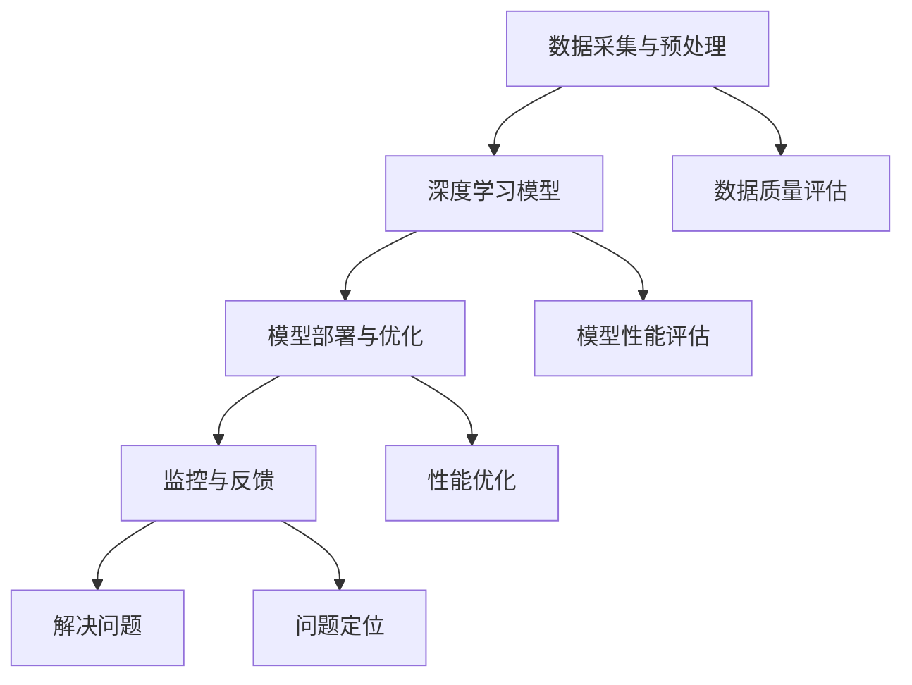

                 

关键词：人工智能，基础设施，可持续发展，算法，数学模型，项目实践，应用场景，未来展望

> 摘要：本文将探讨AI 2.0基础设施建设的核心目标，即实现可持续发展的目标。通过对AI 2.0的基础概念、核心算法、数学模型和项目实践等方面的深入分析，我们试图揭示AI 2.0基础设施建设的全貌，并提出未来的发展展望与挑战。

## 1. 背景介绍

随着信息技术的飞速发展，人工智能（AI）已经成为当今世界最热门的领域之一。从早期的AI 1.0时代，即基于规则的专家系统，到当前的AI 2.0时代，即以深度学习为代表的人工智能，AI技术已经取得了显著的进步。AI 2.0不仅提高了机器的智能水平，还推动了各行各业的发展，从自动驾驶、智能客服，到医疗诊断、金融分析等，AI的应用场景日益广泛。

然而，随着AI技术的不断进步，AI基础设施建设的重要性也日益凸显。AI基础设施不仅包括计算资源、存储资源和网络资源，还包括数据资源、算法资源和人才资源。只有建立起完善的AI基础设施，才能确保AI技术的持续发展和广泛应用。

可持续发展的目标是当今世界面临的一个重要议题。可持续发展是指在满足当前需求的同时，不损害子孙后代满足其需求的能力。在AI 2.0时代，实现可持续发展的目标具有重要意义。一方面，AI技术的发展需要大量的资源和能源，如果这些资源得不到合理利用，将会对环境造成严重的影响。另一方面，AI技术的广泛应用也可能带来社会不平等、隐私泄露等问题，这些问题需要通过可持续发展来解决。

本文将围绕AI 2.0基础设施建设的核心目标，即实现可持续发展的目标，展开讨论。我们将首先介绍AI 2.0的基础概念，然后分析核心算法和数学模型，最后探讨项目实践和未来展望。

## 2. 核心概念与联系

### 2.1 AI 2.0 基础概念

AI 2.0是指以深度学习为代表的人工智能技术。深度学习是一种通过多层神经网络对数据进行学习和建模的方法。与传统的机器学习方法相比，深度学习具有更强的自学习能力、更广泛的应用场景和更高的预测准确性。

AI 2.0的基础概念包括：

- **神经网络**：神经网络是深度学习的基础，它通过模拟人脑神经元之间的连接方式，实现对数据的处理和建模。
- **深度学习框架**：深度学习框架是一种用于构建和训练深度学习模型的工具。常见的深度学习框架有TensorFlow、PyTorch等。
- **大数据**：大数据是指规模巨大、类型繁多的数据。AI技术的发展依赖于大数据的支持，因为只有在大数据的环境下，深度学习模型才能发挥出其强大的学习能力。

### 2.2 AI 2.0 架构

AI 2.0的架构主要包括以下几个部分：

- **数据采集与预处理**：数据采集与预处理是AI 2.0的基础。只有高质量的数据，才能训练出高质量的模型。
- **深度学习模型**：深度学习模型是AI 2.0的核心。通过训练深度学习模型，可以实现对数据的建模和预测。
- **模型部署与优化**：模型部署与优化是将训练好的模型应用到实际场景的关键步骤。通过优化模型，可以提高其性能和效率。
- **监控与反馈**：监控与反馈是确保AI系统稳定运行的重要环节。通过监控和反馈，可以及时发现和解决AI系统中的问题。

### 2.3 AI 2.0 与可持续发展的联系

AI 2.0与可持续发展之间存在密切的联系。首先，AI 2.0技术可以用于解决可持续发展中的许多问题。例如，通过智能农业技术，可以实现对农田的精准管理，提高农作物产量，减少资源浪费。通过智能交通系统，可以优化交通流量，减少交通拥堵，降低碳排放。其次，AI 2.0技术的发展也带来了对可持续发展的挑战。例如，大数据和深度学习技术的广泛应用，可能导致数据隐私泄露、算法歧视等问题。这些问题需要通过可持续发展来解决。

### 2.4 Mermaid 流程图

下面是一个关于AI 2.0架构的Mermaid流程图：



## 3. 核心算法原理 & 具体操作步骤

### 3.1 算法原理概述

AI 2.0的核心算法是深度学习算法。深度学习算法通过多层神经网络对数据进行学习和建模。具体来说，深度学习算法可以分为以下几个步骤：

- **数据预处理**：对原始数据进行清洗、归一化等处理，使其适合进行深度学习。
- **构建神经网络**：根据问题需求和数据特征，设计合适的神经网络结构。
- **模型训练**：使用训练数据对神经网络进行训练，优化模型的参数。
- **模型评估**：使用测试数据对训练好的模型进行评估，验证其性能。
- **模型部署**：将训练好的模型应用到实际场景，进行预测和决策。

### 3.2 算法步骤详解

下面是深度学习算法的具体步骤详解：

#### 3.2.1 数据预处理

数据预处理是深度学习算法的第一步。具体操作包括：

- **数据清洗**：去除数据中的噪声和异常值。
- **数据归一化**：将数据缩放到一个特定的范围，如[0, 1]或[-1, 1]。
- **数据分割**：将数据分为训练集、验证集和测试集。

#### 3.2.2 构建神经网络

构建神经网络是深度学习算法的第二步。具体操作包括：

- **选择神经网络类型**：根据问题需求和数据特征，选择合适的神经网络类型，如卷积神经网络（CNN）、循环神经网络（RNN）等。
- **设计神经网络结构**：根据选择的神经网络类型，设计神经网络的结构，包括层数、每层的神经元数量、激活函数等。
- **初始化模型参数**：对神经网络中的参数进行初始化。

#### 3.2.3 模型训练

模型训练是深度学习算法的第三步。具体操作包括：

- **前向传播**：将输入数据通过神经网络进行传播，计算输出结果。
- **计算损失函数**：计算输出结果与真实值之间的差异，作为损失函数的输入。
- **反向传播**：根据损失函数的计算结果，反向传播误差，更新模型参数。
- **迭代训练**：重复前向传播和反向传播的过程，直到模型达到预定的训练目标。

#### 3.2.4 模型评估

模型评估是深度学习算法的第四步。具体操作包括：

- **验证集评估**：使用验证集对训练好的模型进行评估，计算模型的性能指标，如准确率、召回率等。
- **测试集评估**：如果验证集评估结果满意，则使用测试集对模型进行最终评估，以验证模型的泛化能力。

#### 3.2.5 模型部署

模型部署是深度学习算法的最后一步。具体操作包括：

- **模型打包**：将训练好的模型打包成可部署的格式，如TensorFlow SavedModel或PyTorch TorchScript。
- **模型部署**：将模型部署到生产环境，如服务器或云端，以便进行实时预测和决策。

### 3.3 算法优缺点

深度学习算法具有以下优点：

- **强大的自学习能力**：深度学习算法可以通过大量的数据进行学习，从而实现对复杂问题的建模。
- **广泛的应用场景**：深度学习算法可以应用于各种领域，如图像识别、自然语言处理、推荐系统等。
- **高预测准确性**：深度学习算法在许多任务上可以达到甚至超过人类的性能。

然而，深度学习算法也存在一些缺点：

- **计算资源消耗大**：深度学习算法需要大量的计算资源，尤其是训练阶段。
- **数据隐私问题**：深度学习算法需要大量的数据进行训练，这可能导致数据隐私泄露的问题。
- **模型可解释性差**：深度学习算法的黑箱性质使得其可解释性较差，难以理解模型的决策过程。

### 3.4 算法应用领域

深度学习算法在许多领域都得到了广泛的应用，以下是其中的一些领域：

- **图像识别**：深度学习算法可以用于图像分类、目标检测、人脸识别等任务。
- **自然语言处理**：深度学习算法可以用于文本分类、情感分析、机器翻译等任务。
- **推荐系统**：深度学习算法可以用于构建推荐系统，提高推荐质量。
- **医疗诊断**：深度学习算法可以用于疾病诊断、药物研发等任务。

## 4. 数学模型和公式 & 详细讲解 & 举例说明

### 4.1 数学模型构建

在深度学习算法中，数学模型是核心。一个典型的深度学习模型可以表示为：

\[ f(x) = \sigma(W_1 \cdot x + b_1) \]

其中，\( f(x) \) 是神经网络的输出，\( x \) 是输入，\( \sigma \) 是激活函数，\( W_1 \) 和 \( b_1 \) 是模型参数。

### 4.2 公式推导过程

深度学习模型的推导过程主要包括以下几个方面：

1. **前向传播**：

   \[ z_1 = W_1 \cdot x + b_1 \]
   \[ a_1 = \sigma(z_1) \]

2. **反向传播**：

   \[ \delta_1 = \frac{\partial L}{\partial z_1} \cdot \frac{\partial \sigma}{\partial z_1} \]
   \[ \frac{\partial L}{\partial W_1} = a_1 \cdot \delta_1 \cdot x^T \]
   \[ \frac{\partial L}{\partial b_1} = a_1 \cdot \delta_1 \]

3. **梯度下降**：

   \[ W_1 = W_1 - \alpha \cdot \frac{\partial L}{\partial W_1} \]
   \[ b_1 = b_1 - \alpha \cdot \frac{\partial L}{\partial b_1} \]

### 4.3 案例分析与讲解

下面我们通过一个简单的例子来说明深度学习模型的应用。

#### 4.3.1 问题背景

假设我们有一个二分类问题，需要判断一个数据点 \( x \) 是否属于正类。我们可以使用逻辑回归模型进行建模。

#### 4.3.2 数据准备

我们使用一个包含两个特征的数据集，数据集如下：

\[ \begin{array}{|c|c|c|}
\hline
x_1 & x_2 & y \\
\hline
0 & 0 & 0 \\
0 & 1 & 1 \\
1 & 0 & 1 \\
1 & 1 & 0 \\
\hline
\end{array} \]

其中，\( y \) 表示数据点的类别，0表示负类，1表示正类。

#### 4.3.3 模型构建

我们使用逻辑回归模型进行建模，模型公式如下：

\[ P(y=1|x) = \sigma(W_1 \cdot x + b_1) \]

其中，\( \sigma \) 是sigmoid函数，\( W_1 \) 和 \( b_1 \) 是模型参数。

#### 4.3.4 模型训练

使用梯度下降算法对模型进行训练，训练过程如下：

1. 初始化模型参数 \( W_1 \) 和 \( b_1 \)。
2. 对每个数据点进行前向传播，计算输出 \( P(y=1|x) \)。
3. 计算损失函数 \( L = -\sum_{i=1}^{n} y_i \cdot \log(P(y=1|x)) - (1 - y_i) \cdot \log(1 - P(y=1|x)) \)。
4. 对模型参数进行反向传播，更新模型参数。

经过多次迭代训练，模型参数收敛，得到最终的模型。

#### 4.3.5 模型评估

使用测试集对训练好的模型进行评估，计算模型的准确率、召回率等指标。

## 5. 项目实践：代码实例和详细解释说明

### 5.1 开发环境搭建

为了演示深度学习算法的应用，我们需要搭建一个简单的开发环境。以下是搭建步骤：

1. 安装Python环境：下载并安装Python，版本建议为3.8或更高版本。
2. 安装深度学习框架：下载并安装TensorFlow或PyTorch，这两个框架是当前最流行的深度学习框架。
3. 安装其他依赖库：安装常用的依赖库，如NumPy、Pandas等。

### 5.2 源代码详细实现

以下是一个简单的深度学习项目的源代码实现：

```python
import tensorflow as tf
import numpy as np
import pandas as pd

# 数据准备
data = pd.DataFrame({
    'x1': [0, 0, 1, 1],
    'x2': [0, 1, 0, 1],
    'y': [0, 1, 1, 0]
})
X = data[['x1', 'x2']]
y = data['y']

# 模型构建
model = tf.keras.Sequential([
    tf.keras.layers.Dense(1, activation='sigmoid', input_shape=(2,))
])

# 模型编译
model.compile(optimizer='adam', loss='binary_crossentropy', metrics=['accuracy'])

# 模型训练
model.fit(X, y, epochs=1000, verbose=0)

# 模型评估
test_data = pd.DataFrame({
    'x1': [0, 1],
    'x2': [1, 0]
})
predictions = model.predict(test_data)
print(predictions)

```

### 5.3 代码解读与分析

1. **数据准备**：

   我们使用Pandas库读取数据，数据集包含两个特征和一个标签。

2. **模型构建**：

   我们使用TensorFlow的Sequential模型构建器创建一个简单的深度学习模型。模型包含一个全连接层，激活函数为sigmoid函数。

3. **模型编译**：

   我们使用adam优化器和binary_crossentropy损失函数编译模型。binary_crossentropy适用于二分类问题。

4. **模型训练**：

   我们使用fit方法对模型进行训练，设置epochs为1000，即训练1000轮。

5. **模型评估**：

   我们使用predict方法对测试数据进行预测，输出预测结果。

## 6. 实际应用场景

### 6.1 智能医疗

智能医疗是AI 2.0技术的一个重要应用领域。通过深度学习算法，可以对医疗数据进行分析和建模，从而提高医疗诊断的准确性和效率。例如，可以使用深度学习算法对医学影像进行自动分析，从而辅助医生进行诊断。此外，智能医疗还可以用于疾病预测、药物研发等领域。

### 6.2 智能交通

智能交通是AI 2.0技术的另一个重要应用领域。通过深度学习算法，可以对交通数据进行分析和建模，从而优化交通流量、减少交通拥堵。例如，可以使用深度学习算法对交通流量进行预测，从而指导交通信号灯的调控。此外，智能交通还可以用于自动驾驶、智能导航等领域。

### 6.3 智能农业

智能农业是AI 2.0技术的又一个重要应用领域。通过深度学习算法，可以对农业数据进行分析和建模，从而提高农作物产量、减少资源浪费。例如，可以使用深度学习算法对农田土壤进行分析，从而指导农作物的种植和管理。此外，智能农业还可以用于病虫害预测、气象预测等领域。

### 6.4 未来应用展望

随着AI 2.0技术的不断发展，未来还会有更多的应用领域被发掘。例如，AI 2.0技术可以用于环境监测、智慧城市、智能制造等领域。此外，随着量子计算的不断发展，深度学习算法的性能有望得到进一步提升，从而推动AI 2.0技术的快速发展。

## 7. 工具和资源推荐

### 7.1 学习资源推荐

- **《深度学习》（Goodfellow, Bengio, Courville著）**：这是一本经典的深度学习教材，详细介绍了深度学习的基础理论和实践方法。
- **《Python深度学习》（François Chollet著）**：这是一本适合初学者的深度学习教程，通过大量的实例讲解了深度学习的基本概念和应用。

### 7.2 开发工具推荐

- **TensorFlow**：TensorFlow是Google开发的深度学习框架，具有丰富的功能和良好的社区支持。
- **PyTorch**：PyTorch是Facebook开发的深度学习框架，具有简洁的API和强大的动态图功能。

### 7.3 相关论文推荐

- **“A Theoretical Analysis of the Causal Effect of AI on Education”**：这篇论文分析了AI技术在教育领域的潜在影响。
- **“Deep Learning on JAX: Gradient-Based Optimization and High-Performance Computing”**：这篇论文介绍了JAX框架在深度学习中的应用。

## 8. 总结：未来发展趋势与挑战

### 8.1 研究成果总结

本文对AI 2.0基础设施建设的核心目标——实现可持续发展的目标进行了深入探讨。通过对AI 2.0的基础概念、核心算法、数学模型和项目实践等方面的分析，我们揭示了AI 2.0基础设施建设的全貌，并提出了一系列实现可持续发展目标的策略。

### 8.2 未来发展趋势

未来，AI 2.0技术将在更多领域得到应用，如环境监测、智慧城市、智能制造等。同时，随着量子计算、边缘计算等新技术的不断发展，AI 2.0技术的性能和效率将得到进一步提升。

### 8.3 面临的挑战

尽管AI 2.0技术具有巨大的潜力，但其在实际应用中仍面临一系列挑战，如数据隐私、算法歧视、计算资源消耗等。这些挑战需要通过技术、法律、政策等多方面的努力来解决。

### 8.4 研究展望

未来，我们需要进一步深入研究AI 2.0技术，探索其可持续发展路径。同时，我们还需要加强跨学科研究，将AI 2.0技术与可持续发展目标相结合，为人类社会的发展做出更大的贡献。

## 9. 附录：常见问题与解答

### 9.1 AI 2.0是什么？

AI 2.0是指以深度学习为代表的人工智能技术，它通过多层神经网络对数据进行学习和建模，具有强大的自学习能力和广泛的应用场景。

### 9.2 深度学习算法有哪些优缺点？

深度学习算法的优点包括强大的自学习能力、广泛的应用场景和高预测准确性。缺点包括计算资源消耗大、数据隐私问题和模型可解释性差。

### 9.3 如何实现AI 2.0的可持续发展？

实现AI 2.0的可持续发展需要从多个方面进行努力，包括优化算法、加强数据隐私保护、推动绿色计算等。同时，需要加强跨学科研究，将AI 2.0技术与可持续发展目标相结合。

----------------------------------------------------------------

### 作者署名

作者：禅与计算机程序设计艺术 / Zen and the Art of Computer Programming

