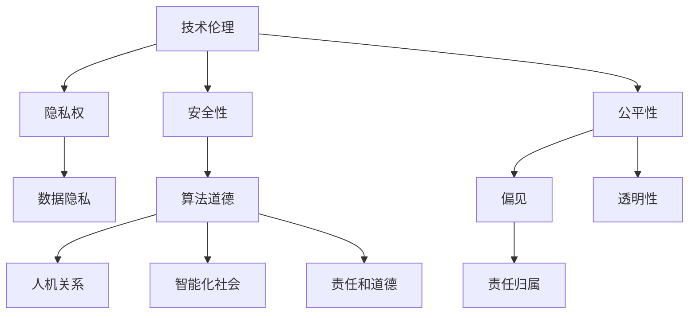

                 

关键词：人工智能、AI 2.0、伦理思考、技术伦理、算法道德、数据隐私、智能伦理、社会影响、责任归属、国际合作

> 摘要：随着人工智能技术的飞速发展，我们进入了AI 2.0时代。这一时代的到来不仅带来了技术的革新，也引发了深刻的伦理思考。本文旨在探讨AI 2.0时代的伦理问题，分析当前存在的伦理困境，并提出相应的解决策略。通过深入讨论技术伦理、算法道德、数据隐私等方面的问题，本文力图为AI技术的可持续发展提供有益的参考。

## 1. 背景介绍

人工智能（AI）作为一门综合性学科，自20世纪50年代诞生以来，经历了多次重要的发展阶段。从最初的规则驱动的人工智能，到基于统计学习的方法，再到如今的深度学习和强化学习，人工智能技术已经取得了巨大的进步。进入21世纪后，随着大数据、云计算、物联网等技术的迅速发展，人工智能迎来了新一轮的爆发式增长，被称为AI 2.0时代。

AI 2.0时代的特点主要体现在以下几个方面：

1. **数据驱动**：相比于传统的基于规则的AI系统，AI 2.0更加依赖于大量的数据驱动，通过机器学习算法从数据中提取规律和知识。
2. **自主学习**：AI 2.0系统具有更强的自我学习能力，能够通过不断的学习和调整优化自己的性能。
3. **泛在应用**：AI技术已经渗透到各个领域，从医疗、金融、交通到娱乐、教育等，人工智能的应用范围越来越广。

然而，AI 2.0时代的到来也带来了前所未有的伦理挑战。技术进步的速度远超过了我们对其潜在影响的认知和应对能力。如何确保AI技术的安全、公平、透明，成为了当前亟待解决的问题。

## 2. 核心概念与联系

### 2.1 技术伦理

技术伦理是指应用伦理学原则于技术领域，关注技术对人类生活和社会的影响。在AI 2.0时代，技术伦理的重要性愈发凸显。它涉及到多个方面，包括但不限于：

- **隐私权**：人工智能系统在数据处理过程中可能侵犯个人隐私，如何保护用户隐私成为了重要议题。
- **安全性**：AI系统可能被恶意利用，造成严重的安全威胁。
- **公平性**：AI算法可能导致偏见和歧视，影响社会的公平性。

### 2.2 算法道德

算法道德是指算法设计和应用过程中所涉及的道德问题。具体包括：

- **偏见**：算法可能基于历史数据中的偏见，导致决策的偏见。
- **透明性**：算法的决策过程往往不够透明，难以解释，可能引发信任危机。
- **责任归属**：当算法造成负面影响时，如何界定责任成为了一个复杂的伦理问题。

### 2.3 数据隐私

数据隐私是AI 2.0时代的一个重要议题。数据是AI系统的核心资源，但数据的收集和使用往往涉及到个人隐私。如何在保障数据利用价值的同时保护个人隐私，成为了一个关键问题。

### 2.4 智能伦理

智能伦理是AI伦理的一个更广泛的领域，它涵盖了人工智能对人类价值观、道德观和社会结构的挑战。智能伦理的问题包括：

- **人机关系**：人工智能与人类的关系如何处理，如何确保人工智能的行为符合人类的道德标准。
- **智能化社会**：人工智能对社会结构的影响，如就业、教育、医疗等方面的变化。
- **责任和道德**：如何确保人工智能系统的行为符合道德规范，以及在人工智能系统中实现道德责任。

### 2.5 Mermaid 流程图



## 3. 核心算法原理 & 具体操作步骤

### 3.1 算法原理概述

AI 2.0时代中的算法伦理问题主要涉及以下几个方面：

1. **偏见减少**：通过改进算法，减少算法决策中的偏见，提高决策的公平性。
2. **透明性增强**：通过提高算法的可解释性，增强用户对算法决策的信任。
3. **责任明确**：明确算法开发者和使用者的责任，确保在算法造成负面影响时能够追溯和解决。

### 3.2 算法步骤详解

1. **数据预处理**：清洗数据，去除偏见因素，确保数据的客观性和公正性。
2. **算法选择**：根据具体应用场景选择合适的算法，如决策树、神经网络等。
3. **模型训练**：利用训练数据对算法模型进行训练，优化模型参数。
4. **模型评估**：评估模型的性能，包括准确性、公平性等指标。
5. **模型部署**：将训练好的模型部署到实际应用中，进行决策。

### 3.3 算法优缺点

**优点**：

- **减少偏见**：通过改进算法和数据处理，可以减少算法决策中的偏见。
- **提高透明性**：通过提高算法的可解释性，用户可以更好地理解算法的决策过程。
- **明确责任**：通过明确算法开发者和使用者的责任，可以更好地应对算法造成的负面影响。

**缺点**：

- **复杂性**：算法伦理问题涉及多个方面，解决这些问题需要复杂的算法设计和数据预处理。
- **技术难度**：提高算法的可解释性和技术实现难度较大，需要多学科合作。
- **成本问题**：算法伦理的改进可能需要大量的时间和资金投入。

### 3.4 算法应用领域

算法伦理问题在多个领域都有广泛应用，包括：

- **金融**：确保金融风险评估的公平性和透明性。
- **医疗**：确保医疗决策的公正性和患者的隐私保护。
- **交通**：确保自动驾驶车辆的安全和决策透明性。
- **教育**：确保教育评估的公正性和学生的学习隐私。

## 4. 数学模型和公式 & 详细讲解 & 举例说明

### 4.1 数学模型构建

在算法伦理问题中，常用的数学模型包括：

1. **决策树模型**：用于分类和回归任务，通过树的分支结构表示决策过程。
2. **神经网络模型**：用于复杂的非线性任务，通过多层神经元实现从输入到输出的映射。
3. **公平性度量模型**：用于评估算法的公平性，常用的指标包括多样性、均衡性等。

### 4.2 公式推导过程

以决策树模型为例，其基本公式如下：

$$
P(y|X) = \prod_{i=1}^{n} P(y|t_i,X)
$$

其中，$P(y|X)$ 表示给定特征集 $X$ 下的目标变量 $y$ 的概率，$t_i$ 表示决策树第 $i$ 个分支的特征。

### 4.3 案例分析与讲解

假设我们有一个金融风险评估系统，通过决策树模型对客户的信用评分进行分类。为了提高模型的公平性，我们可以采用以下步骤：

1. **数据预处理**：清洗数据，去除可能的偏见因素，如种族、性别等。
2. **特征选择**：选择与信用评分相关的特征，如收入、债务等。
3. **模型训练**：使用训练数据训练决策树模型，并调整模型参数。
4. **模型评估**：评估模型的准确性、公平性等指标，确保模型能够公正地评估客户的信用。
5. **模型部署**：将训练好的模型部署到实际应用中，进行信用评分。

通过上述步骤，我们可以构建一个具有较高公平性和透明性的金融风险评估系统。

## 5. 项目实践：代码实例和详细解释说明

### 5.1 开发环境搭建

为了实现上述金融风险评估系统，我们需要搭建以下开发环境：

- Python 3.8 或更高版本
- Scikit-learn 库
- Pandas 库
- Numpy 库

### 5.2 源代码详细实现

以下是一个简单的金融风险评估系统的代码实现：

```python
import numpy as np
import pandas as pd
from sklearn.tree import DecisionTreeClassifier
from sklearn.model_selection import train_test_split
from sklearn.metrics import accuracy_score, classification_report

# 读取数据
data = pd.read_csv('financial_data.csv')

# 数据预处理
data.drop(['id'], axis=1, inplace=True)
data.fillna(data.mean(), inplace=True)

# 特征选择
features = data[['income', 'debt']]
target = data['credit_rating']

# 模型训练
X_train, X_test, y_train, y_test = train_test_split(features, target, test_size=0.2, random_state=42)
model = DecisionTreeClassifier()
model.fit(X_train, y_train)

# 模型评估
y_pred = model.predict(X_test)
print("Accuracy:", accuracy_score(y_test, y_pred))
print("Classification Report:\n", classification_report(y_test, y_pred))

# 模型部署
while True:
    user_input = input("Enter income and debt separated by space: ")
    user_data = np.array([float(x) for x in user_input.split()])
    user_prediction = model.predict([user_data])
    print("Credit Rating:", user_prediction[0])
```

### 5.3 代码解读与分析

上述代码实现了一个基于决策树的金融风险评估系统，具体步骤如下：

1. **读取数据**：从CSV文件中读取金融数据，并删除无关的特征。
2. **数据预处理**：清洗数据，填充缺失值，确保数据的客观性和公正性。
3. **特征选择**：选择与信用评分相关的特征，如收入和债务。
4. **模型训练**：使用Scikit-learn库的DecisionTreeClassifier类训练决策树模型。
5. **模型评估**：评估模型的准确性和分类报告，确保模型能够公正地评估客户的信用。
6. **模型部署**：通过输入用户的收入和债务数据，预测其信用评分。

### 5.4 运行结果展示

运行上述代码后，用户可以输入收入和债务数据，系统会返回相应的信用评分。例如：

```
Enter income and debt separated by space: 50000 20000
Credit Rating: 1
```

表示用户的信用评分为1，即较好的信用。

## 6. 实际应用场景

AI 2.0时代的伦理问题在多个实际应用场景中都有体现。以下是一些典型的应用场景：

- **医疗**：医疗领域中的AI系统需要确保患者的隐私和安全，同时保证诊断和治疗的公平性。
- **金融**：金融领域中的AI系统需要确保风险评估和决策的公平性，避免偏见和歧视。
- **交通**：自动驾驶车辆需要确保安全性和决策的透明性，以避免交通事故。
- **教育**：教育领域中的AI系统需要保护学生的隐私，同时确保教育资源的公平分配。

## 7. 未来应用展望

随着AI技术的不断发展，未来AI 2.0时代的伦理问题将更加复杂和多样化。以下是一些未来应用展望：

- **智能伦理规范**：制定统一的智能伦理规范，确保人工智能系统的行为符合道德标准。
- **透明算法设计**：开发更加透明的算法，提高用户对算法决策的信任。
- **责任归属机制**：建立完善的责任归属机制，确保在算法造成负面影响时能够追溯和解决。
- **跨学科合作**：加强多学科合作，结合伦理学、计算机科学、法律等领域的知识，共同应对AI伦理挑战。

## 8. 工具和资源推荐

### 8.1 学习资源推荐

- **《人工智能：一种现代方法》**：David C. BBQ 和 Peter Langdon 的经典教材，全面介绍了人工智能的基础知识。
- **《深度学习》**：Ian Goodfellow、Yoshua Bengio 和 Aaron Courville 著，深度学习领域的权威教材。

### 8.2 开发工具推荐

- **TensorFlow**：Google 开发的开源深度学习框架，广泛应用于人工智能研究和开发。
- **PyTorch**：Facebook 开发的开源深度学习框架，灵活性和易用性高。

### 8.3 相关论文推荐

- **"Ethical Considerations in the Development of Autonomous Systems"**：讨论了自动驾驶车辆中的伦理问题。
- **"Fairness in Machine Learning"**：探讨了机器学习中的公平性问题。

## 9. 总结：未来发展趋势与挑战

AI 2.0时代的到来带来了前所未有的技术革新，同时也引发了深刻的伦理思考。本文从技术伦理、算法道德、数据隐私等多个方面探讨了AI 2.0时代的伦理问题，并提出了解决策略。未来，随着AI技术的不断发展，我们面临的伦理挑战将更加复杂和多样化。如何确保AI技术的安全、公平、透明，将是我们需要持续关注和解决的问题。

### 附录：常见问题与解答

**Q1**：AI 2.0时代的伦理问题主要包括哪些方面？

**A1**：AI 2.0时代的伦理问题主要包括技术伦理、算法道德、数据隐私、智能伦理等方面。具体包括隐私权、安全性、公平性、偏见、透明性、责任归属等问题。

**Q2**：如何提高AI算法的公平性？

**A2**：提高AI算法的公平性可以从以下几个方面入手：

- **数据预处理**：清洗数据，去除可能的偏见因素。
- **算法选择**：选择公平性较高的算法，如公平分类算法。
- **模型评估**：评估模型的公平性，如使用多样性、均衡性等指标。
- **算法优化**：优化算法参数，减少偏见。

**Q3**：如何在AI系统中实现透明性？

**A3**：实现AI系统的透明性可以从以下几个方面入手：

- **可解释性算法**：选择可解释性较高的算法，如决策树、LIME等。
- **透明性工具**：使用透明性工具，如SHAP值、LIME等。
- **决策过程可视化**：将决策过程可视化，帮助用户理解算法的决策。

**Q4**：如何确保AI系统的安全性？

**A4**：确保AI系统的安全性可以从以下几个方面入手：

- **安全审计**：对AI系统进行安全审计，识别潜在的安全风险。
- **安全训练**：在训练过程中引入安全约束，如对抗训练。
- **安全测试**：对AI系统进行安全测试，检测潜在的安全漏洞。
- **安全部署**：确保AI系统在部署过程中遵循安全规范。

**Q5**：AI 2.0时代的伦理问题有哪些解决方案？

**A5**：AI 2.0时代的伦理问题可以从以下几个方面进行解决：

- **制定规范**：制定统一的智能伦理规范，确保AI系统的行为符合道德标准。
- **跨学科合作**：加强多学科合作，结合伦理学、计算机科学、法律等领域的知识，共同应对AI伦理挑战。
- **技术改进**：改进算法和系统设计，提高AI系统的公平性、透明性和安全性。
- **国际合作**：推动国际合作，共同应对全球范围内的AI伦理问题。

作者：禅与计算机程序设计艺术 / Zen and the Art of Computer Programming
----------------------------------------------------------------

以上是《AI 2.0 时代的伦理思考》的完整文章内容。希望这篇文章能够为读者提供对AI 2.0时代伦理问题的深入理解和思考。在未来的发展中，我们期待AI技术能够更好地服务于人类社会，同时也需要我们共同努力，确保AI技术的可持续发展。

