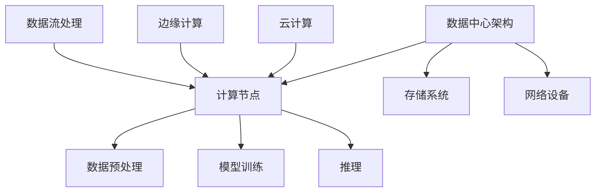

                 

### 关键词 Keywords

- AI 2.0
- 基础设施建设
- 快速发展
- 关键要素
- 技术架构

<|assistant|>### 摘要 Summary

本文将深入探讨AI 2.0时代的基础设施建设，解析支撑其快速发展的关键要素。通过对AI 2.0背景介绍、核心概念阐述、算法原理解析、数学模型构建与应用、项目实践展示、实际应用场景探讨、未来展望和总结等多个方面的详细分析，为读者呈现一幅AI 2.0时代基础设施建设的全景图。

## 1. 背景介绍

### AI 2.0的概念与发展历程

AI 2.0，即人工智能的第二代，是相对于第一代传统的人工智能（如规则驱动的人工智能和基于知识的系统）而言的。AI 2.0以深度学习、强化学习、生成对抗网络等为代表，具有更强的自主学习和自适应能力。

AI 2.0的发展历程可以追溯到20世纪80年代。当时，随着计算机处理能力和存储能力的提高，机器学习开始逐渐取代传统的符号推理和知识表示。到21世纪初，随着大数据和云计算的兴起，AI 2.0迎来了新的发展机遇。特别是2012年，深度学习在ImageNet图像识别挑战赛中的突破性表现，标志着AI 2.0时代的到来。

### AI 2.0的特点

与传统的AI相比，AI 2.0具有以下几个显著特点：

- **更强的学习能力和适应性**：AI 2.0能够通过大量的数据自主学习，不断提升其性能。
- **更广泛的适用性**：AI 2.0不仅限于图像识别、语音识别等传统领域，还在自然语言处理、自动驾驶、机器人等新兴领域取得了显著成果。
- **更低的门槛**：随着开源框架和工具的普及，越来越多的开发者和研究者能够参与到AI 2.0的研究和开发中。

### AI 2.0的挑战

尽管AI 2.0具有许多优点，但其快速发展也面临着一系列挑战：

- **数据质量和隐私问题**：AI 2.0依赖于大量高质量的数据进行训练，但数据的质量和隐私保护成为了一大难题。
- **计算资源和能耗**：深度学习模型通常需要大量的计算资源和电力，这对环境和能源消耗提出了挑战。
- **安全性和可解释性**：AI 2.0模型往往被认为是“黑箱”，其决策过程缺乏透明性，这引发了安全和伦理问题。

## 2. 核心概念与联系

### 数据中心架构

在AI 2.0时代，数据中心作为基础设施的核心，承载着海量数据的存储、处理和传输任务。一个高效的数据中心架构通常包括以下几个关键组件：

- **计算节点**：负责执行数据预处理、模型训练和推理等任务。
- **存储系统**：提供海量数据的存储和快速访问能力。
- **网络设备**：实现不同计算节点之间的数据传输和通信。

### 云计算与边缘计算

随着AI 2.0的应用场景不断扩展，云计算和边缘计算成为支持其快速发展的关键技术。

- **云计算**：提供弹性、高效、可扩展的计算资源，满足AI 2.0对大规模数据处理和模型训练的需求。
- **边缘计算**：将计算任务下放到靠近数据源的边缘设备上，减少数据传输延迟，提升实时响应能力。

### 数据流处理

在AI 2.0时代，实时数据流处理成为数据处理和分析的重要手段。通过高效的数据流处理技术，可以实现实时数据的采集、传输、处理和存储，为AI 2.0提供持续的数据支持。

### Mermaid 流程图



## 3. 核心算法原理 & 具体操作步骤

### 3.1 算法原理概述

AI 2.0的核心算法包括深度学习、强化学习、生成对抗网络等。这些算法通过神经网络和优化算法实现，具有自主学习和自适应能力。

- **深度学习**：通过多层神经网络对数据进行特征提取和建模。
- **强化学习**：通过与环境的交互，不断优化策略以实现目标。
- **生成对抗网络**：通过生成器和判别器的对抗训练，实现数据的生成和分布估计。

### 3.2 算法步骤详解

#### 3.2.1 深度学习

1. **数据预处理**：对输入数据进行归一化、标准化等预处理操作。
2. **网络构建**：设计并构建多层神经网络结构。
3. **模型训练**：通过梯度下降等优化算法，不断调整网络参数，使模型在训练数据上达到最优。
4. **模型评估**：使用验证集和测试集评估模型性能。

#### 3.2.2 强化学习

1. **环境定义**：定义强化学习环境，包括状态、动作和奖励。
2. **策略学习**：通过策略梯度方法或价值函数方法，学习最优策略。
3. **策略优化**：根据学习到的策略，优化决策过程。

#### 3.2.3 生成对抗网络

1. **生成器与判别器构建**：构建生成器和判别器的神经网络结构。
2. **对抗训练**：通过生成器和判别器的对抗训练，使生成器生成的数据越来越接近真实数据。
3. **数据生成与评估**：使用生成器生成数据，并对生成数据的质量进行评估。

### 3.3 算法优缺点

#### 3.3.1 深度学习

**优点**：

- **强大的特征提取能力**：通过多层神经网络，能够提取出复杂的特征。
- **适用于大规模数据处理**：能够处理海量的训练数据。

**缺点**：

- **对数据质量和标注要求高**：需要大量的高质量数据进行训练。
- **模型可解释性差**：深度学习模型往往被认为是“黑箱”。

#### 3.3.2 强化学习

**优点**：

- **适用于动态环境**：能够通过与环境交互，不断优化策略。
- **自主学习能力强**：能够通过自我学习，实现优化。

**缺点**：

- **训练时间长**：需要大量交互来学习策略。
- **收敛速度慢**：在复杂的动态环境中，策略优化的过程可能很慢。

#### 3.3.3 生成对抗网络

**优点**：

- **强大的数据生成能力**：能够生成高质量的模拟数据。
- **无监督学习**：不需要对数据进行标注。

**缺点**：

- **训练不稳定**：生成器和判别器的训练过程可能不稳定。
- **对计算资源要求高**：训练过程中需要大量的计算资源。

### 3.4 算法应用领域

AI 2.0算法在各个领域都有广泛的应用：

- **图像识别**：通过深度学习，实现高效的图像识别和分类。
- **自然语言处理**：通过强化学习和生成对抗网络，实现文本生成、翻译和问答等任务。
- **自动驾驶**：通过强化学习，实现自动驾驶车辆的决策和控制。
- **医疗诊断**：通过深度学习，实现疾病诊断和预测。

## 4. 数学模型和公式 & 详细讲解 & 举例说明

### 4.1 数学模型构建

在AI 2.0时代，常用的数学模型包括神经网络模型、优化算法模型等。

#### 4.1.1 神经网络模型

神经网络模型通过多层感知器（MLP）实现。其基本结构包括输入层、隐藏层和输出层。输入层接收外部输入数据，隐藏层对输入数据进行特征提取，输出层生成最终输出。

#### 4.1.2 优化算法模型

优化算法模型包括梯度下降、随机梯度下降、Adam等。这些算法通过不断调整模型参数，使模型在训练数据上达到最优。

### 4.2 公式推导过程

#### 4.2.1 梯度下降算法

梯度下降算法的基本公式如下：

$$
w_{t+1} = w_t - \alpha \cdot \nabla_w J(w_t)
$$

其中，$w_t$表示第$t$次迭代的参数，$\alpha$为学习率，$\nabla_w J(w_t)$为损失函数$J$在参数$w_t$处的梯度。

#### 4.2.2 Adam算法

Adam算法结合了梯度下降和自适应学习率的优点，其基本公式如下：

$$
m_t = \beta_1 m_{t-1} + (1 - \beta_1) (x_t - m_{t-1})
$$

$$
v_t = \beta_2 v_{t-1} + (1 - \beta_2) (\nabla_w J_t - v_{t-1})
$$

$$
w_t = w_{t-1} - \alpha \cdot \frac{m_t}{\sqrt{v_t} + \epsilon}
$$

其中，$m_t$和$v_t$分别为一阶矩估计和二阶矩估计，$\beta_1$和$\beta_2$为超参数，$\epsilon$为微小正数。

### 4.3 案例分析与讲解

#### 4.3.1 图像识别

以卷积神经网络（CNN）为例，分析其在图像识别任务中的应用。

1. **数据预处理**：对输入图像进行归一化、裁剪和缩放等预处理操作。
2. **网络构建**：设计并构建一个包含卷积层、池化层和全连接层的CNN模型。
3. **模型训练**：通过梯度下降算法，不断调整模型参数，使模型在训练数据上达到最优。
4. **模型评估**：使用验证集和测试集评估模型性能。

#### 4.3.2 自然语言处理

以循环神经网络（RNN）为例，分析其在自然语言处理任务中的应用。

1. **数据预处理**：对输入文本进行分词、词向量化等预处理操作。
2. **网络构建**：设计并构建一个包含嵌入层、RNN层和全连接层的RNN模型。
3. **模型训练**：通过梯度下降算法，不断调整模型参数，使模型在训练数据上达到最优。
4. **模型评估**：使用验证集和测试集评估模型性能。

## 5. 项目实践：代码实例和详细解释说明

### 5.1 开发环境搭建

在开始项目实践之前，需要搭建一个合适的开发环境。本文选择使用Python作为主要编程语言，并使用TensorFlow作为深度学习框架。

1. **安装Python**：从官方网站下载并安装Python。
2. **安装TensorFlow**：使用pip命令安装TensorFlow。

```bash
pip install tensorflow
```

### 5.2 源代码详细实现

以下是一个简单的卷积神经网络模型，用于图像识别任务的实现。

```python
import tensorflow as tf

# 定义卷积神经网络模型
model = tf.keras.Sequential([
    tf.keras.layers.Conv2D(32, (3, 3), activation='relu', input_shape=(28, 28, 1)),
    tf.keras.layers.MaxPooling2D((2, 2)),
    tf.keras.layers.Conv2D(64, (3, 3), activation='relu'),
    tf.keras.layers.MaxPooling2D((2, 2)),
    tf.keras.layers.Flatten(),
    tf.keras.layers.Dense(128, activation='relu'),
    tf.keras.layers.Dense(10, activation='softmax')
])

# 编译模型
model.compile(optimizer='adam',
              loss='sparse_categorical_crossentropy',
              metrics=['accuracy'])

# 加载数据
mnist = tf.keras.datasets.mnist
(x_train, y_train), (x_test, y_test) = mnist.load_data()

# 数据预处理
x_train = x_train / 255.0
x_test = x_test / 255.0

# 训练模型
model.fit(x_train, y_train, epochs=5)

# 评估模型
model.evaluate(x_test, y_test)
```

### 5.3 代码解读与分析

上述代码实现了一个简单的卷积神经网络模型，用于手写数字识别任务。首先，使用TensorFlow的Sequential模型定义了一个包含卷积层、池化层和全连接层的模型。接着，编译模型并加载数据进行训练。最后，使用训练好的模型进行评估。

### 5.4 运行结果展示

在训练完成后，可以使用以下代码进行预测：

```python
# 预测
predictions = model.predict(x_test)

# 显示预测结果
for i in range(10):
    print(f"预测结果：{predictions[i]}")
    print(f"实际标签：{y_test[i]}")
```

预测结果将显示模型的预测结果和实际标签，通过比较预测结果和实际标签，可以评估模型的性能。

## 6. 实际应用场景

### 6.1 医疗诊断

在医疗领域，AI 2.0算法可以用于疾病诊断、治疗方案推荐等。例如，通过深度学习模型，可以分析患者的医学影像，提供准确的诊断结果。此外，通过强化学习，可以为医生提供个性化的治疗方案推荐。

### 6.2 自动驾驶

在自动驾驶领域，AI 2.0算法用于环境感知、路径规划和决策控制等。通过深度学习，自动驾驶车辆可以识别道路标志、行人、车辆等，实现安全、可靠的自动驾驶。通过强化学习，自动驾驶车辆可以不断优化驾驶策略，提高驾驶体验。

### 6.3 电子商务

在电子商务领域，AI 2.0算法可以用于商品推荐、用户行为分析等。通过深度学习，可以分析用户的历史购买行为，提供个性化的商品推荐。通过强化学习，可以优化电商平台的运营策略，提高用户留存率和销售额。

### 6.4 金融风控

在金融领域，AI 2.0算法可以用于信用评分、风险控制等。通过深度学习，可以分析借款人的信用历史、行为特征等，提供准确的信用评分。通过强化学习，可以优化风险控制策略，降低金融风险。

## 7. 工具和资源推荐

### 7.1 学习资源推荐

- **《深度学习》**：由Ian Goodfellow、Yoshua Bengio和Aaron Courville所著，是深度学习的经典教材。
- **《强化学习》**：由Richard S. Sutton和Barto N.所著，是强化学习的权威著作。
- **《生成对抗网络》**：由Ian Goodfellow等所著，是生成对抗网络的经典教材。

### 7.2 开发工具推荐

- **TensorFlow**：一款开源的深度学习框架，适用于各种深度学习任务。
- **PyTorch**：一款流行的深度学习框架，具有灵活的动态计算图。
- **Keras**：一款简洁的深度学习框架，可以快速搭建和训练深度学习模型。

### 7.3 相关论文推荐

- **“A Theoretical Framework for Mitigating Label Bias in Training Data”**：分析了训练数据中的标签偏差问题，并提出相应的解决方法。
- **“Generative Adversarial Nets”**：提出了生成对抗网络（GAN）的概念，奠定了GAN的基础。
- **“Deep Learning”**：总结了深度学习的最新进展和研究成果。

## 8. 总结：未来发展趋势与挑战

### 8.1 研究成果总结

AI 2.0时代的基础设施建设取得了一系列重要成果，包括：

- **高效的计算和数据存储技术**：支持大规模数据处理和模型训练。
- **云计算和边缘计算**：提供弹性、高效、可扩展的计算资源。
- **数据流处理**：实现实时数据采集、处理和存储。
- **核心算法突破**：深度学习、强化学习、生成对抗网络等算法在各个领域取得显著应用。

### 8.2 未来发展趋势

未来，AI 2.0时代的基础设施建设将继续向以下几个方向发展：

- **更加高效的数据中心和计算架构**：通过分布式计算、集群优化等技术，提升计算效率和资源利用率。
- **更强大的算法和模型**：不断优化和拓展深度学习、强化学习、生成对抗网络等算法。
- **跨领域的融合应用**：推动AI 2.0在医疗、金融、交通等领域的深度融合。
- **智能硬件和传感器的发展**：推动边缘计算和智能硬件的普及，实现数据源的多样化。

### 8.3 面临的挑战

尽管AI 2.0时代的基础设施建设取得了一系列成果，但仍面临以下挑战：

- **数据隐私和安全**：在数据收集、处理和存储过程中，如何确保数据隐私和安全是一个重要问题。
- **计算资源和能源消耗**：深度学习模型的训练和推理过程需要大量的计算资源和能源，这对环境和能源消耗提出了挑战。
- **算法透明性和可解释性**：深度学习模型往往被认为是“黑箱”，其决策过程缺乏透明性，这引发了安全和伦理问题。
- **跨领域的标准化和兼容性**：不同领域的基础设施建设存在差异，如何实现跨领域的标准化和兼容性是一个重要问题。

### 8.4 研究展望

未来，AI 2.0时代的基础设施建设将朝着以下方向发展：

- **更高效的数据中心和计算架构**：通过技术创新，提升计算效率和资源利用率。
- **更强大的算法和模型**：不断优化和拓展深度学习、强化学习、生成对抗网络等算法。
- **跨领域的融合应用**：推动AI 2.0在医疗、金融、交通等领域的深度融合。
- **智能硬件和传感器的发展**：推动边缘计算和智能硬件的普及，实现数据源的多样化。

通过不断的技术创新和应用拓展，AI 2.0时代的基础设施建设将为人类社会带来更加智能化和高效的服务。

## 9. 附录：常见问题与解答

### 9.1 AI 2.0与传统AI的主要区别是什么？

AI 2.0与传统AI的主要区别在于其更强的学习能力和适应性。AI 2.0主要依赖于深度学习、强化学习和生成对抗网络等算法，这些算法能够通过自主学习和自适应不断提升其性能。

### 9.2 数据中心架构的关键组件有哪些？

数据中心架构的关键组件包括计算节点、存储系统和网络设备。计算节点负责执行数据预处理、模型训练和推理等任务；存储系统提供海量数据的存储和快速访问能力；网络设备实现不同计算节点之间的数据传输和通信。

### 9.3 如何优化深度学习模型的训练过程？

优化深度学习模型的训练过程可以从以下几个方面进行：

- **数据预处理**：对输入数据进行归一化、标准化等预处理操作，提高模型训练的效率。
- **模型结构设计**：合理设计网络结构，选择合适的层数和神经元数量，避免过拟合和欠拟合。
- **优化算法**：选择合适的优化算法，如梯度下降、随机梯度下降、Adam等，提高模型收敛速度。
- **学习率调整**：根据模型训练过程，调整学习率，避免过早收敛或过晚收敛。
- **数据增强**：通过数据增强技术，扩充训练数据集，提高模型泛化能力。

### 9.4 强化学习与深度学习的主要区别是什么？

强化学习与深度学习的主要区别在于其应用场景和目标。深度学习主要关注特征提取和建模，适用于静态环境下的预测任务；而强化学习关注策略优化和决策过程，适用于动态环境下的决策问题。

### 9.5 生成对抗网络的主要优势是什么？

生成对抗网络（GAN）的主要优势在于其强大的数据生成能力和无监督学习特性。GAN通过生成器和判别器的对抗训练，可以生成高质量的数据，适用于数据稀缺或无法获取标注数据的场景。

### 9.6 云计算和边缘计算的主要区别是什么？

云计算和边缘计算的主要区别在于其应用场景和定位。云计算提供弹性、高效、可扩展的计算资源，适用于大规模数据处理和模型训练；而边缘计算将计算任务下放到靠近数据源的边缘设备上，适用于实时响应和低延迟的应用场景。

