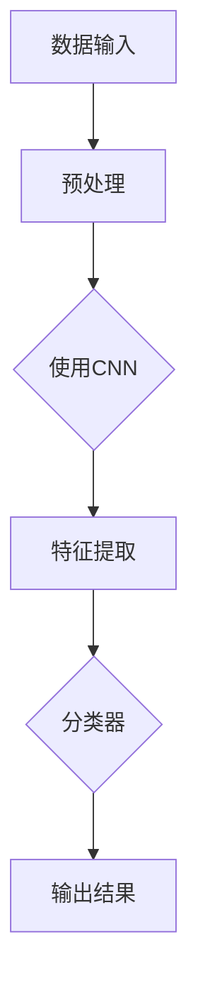

                 

关键词：人工智能、计算机视觉、深度学习、图像处理、神经网络、模型训练、优化算法、应用场景、未来展望

> 摘要：随着人工智能（AI）技术的发展，计算机视觉已经成为AI领域的核心应用之一。本文将探讨AI 2.0时代计算机视觉的核心概念、算法原理、数学模型、项目实践以及未来发展趋势和挑战。

## 1. 背景介绍

计算机视觉作为人工智能的一个重要分支，旨在使计算机能够“看到”和理解图像。近年来，得益于深度学习技术的迅猛发展，计算机视觉技术取得了巨大的突破，从传统的图像处理方法到现代的卷积神经网络（CNN），计算机视觉的应用已经渗透到各个领域。

随着AI技术的不断进步，AI 2.0时代已经到来。在这个时代，计算机视觉不再仅仅是图像识别和分类，而是变得更加智能和灵活。AI 2.0时代的计算机视觉具有以下几个特点：

1. **更强的自主学习能力**：计算机视觉系统能够从大量数据中自动学习，不断优化模型，提高识别精度。
2. **更高效的模型优化**：利用先进的优化算法，如迁移学习和联邦学习，可以显著提高模型性能，减少训练时间和计算资源需求。
3. **更广泛的应用领域**：计算机视觉技术已经应用于自动驾驶、安防监控、医疗诊断、工业检测等多个领域，产生了巨大的社会和经济效益。

## 2. 核心概念与联系

### 核心概念

- **深度学习**：一种人工智能的方法，通过多层神经网络进行模型训练，以自动提取图像特征。
- **卷积神经网络（CNN）**：一种特殊的深度学习模型，广泛应用于计算机视觉任务。
- **迁移学习**：将已经训练好的模型应用于新的任务，以减少训练时间和提高性能。
- **联邦学习**：多个参与者共同训练模型，而不需要共享数据。

### 架构与联系

下面是一个简化的计算机视觉系统架构的 Mermaid 流程图：



在上述流程中：

- **数据输入**：图像数据被输入到系统中。
- **预处理**：对图像进行预处理，如调整大小、归一化等。
- **使用CNN**：卷积神经网络用于特征提取。
- **特征提取**：CNN从图像中自动提取有用的特征。
- **分类器**：基于提取的特征，分类器对图像进行分类。
- **输出结果**：最终输出分类结果。

## 3. 核心算法原理 & 具体操作步骤

### 3.1 算法原理概述

计算机视觉的核心算法是基于深度学习的卷积神经网络（CNN）。CNN通过多个卷积层和池化层对图像进行特征提取，最终通过全连接层进行分类。

### 3.2 算法步骤详解

1. **卷积层**：卷积层通过卷积运算提取图像特征。
2. **激活函数**：常用的激活函数有ReLU、Sigmoid和Tanh。
3. **池化层**：池化层用于降低特征图的大小，减少模型参数。
4. **全连接层**：全连接层用于将特征图转换为分类结果。

### 3.3 算法优缺点

**优点**：

- **强大的特征提取能力**：CNN能够自动提取图像中的复杂特征。
- **适用于各种视觉任务**：从图像分类到目标检测，CNN都表现出色。

**缺点**：

- **计算成本高**：训练CNN需要大量的计算资源和时间。
- **对数据量有较高要求**：为了获得良好的性能，需要大量的训练数据。

### 3.4 算法应用领域

- **图像分类**：例如，对自然图像进行分类，如花卉、动物等。
- **目标检测**：在图像中检测和定位特定的对象，如行人检测、车辆检测等。
- **人脸识别**：对人脸图像进行识别和验证。

## 4. 数学模型和公式 & 详细讲解 & 举例说明

### 4.1 数学模型构建

在CNN中，主要的数学模型包括卷积运算、激活函数和池化操作。

#### 卷积运算

卷积运算公式如下：

\[ (f * g)(x, y) = \sum_{i=1}^{m} \sum_{j=1}^{n} f(i, j) \cdot g(x-i, y-j) \]

其中，\( f \) 和 \( g \) 是两个函数，\( m \) 和 \( n \) 是它们的定义域。

#### 激活函数

常用的激活函数有ReLU、Sigmoid和Tanh。以ReLU为例，其公式如下：

\[ \text{ReLU}(x) = \max(0, x) \]

#### 池化操作

池化操作用于降低特征图的大小。常用的池化操作有最大池化和平均池化。以最大池化为例，其公式如下：

\[ \text{MaxPool}(x) = \max(x) \]

### 4.2 公式推导过程

以一个简单的卷积神经网络为例，其结构如下：

\[ \text{Input} \xrightarrow{\text{Convolution}} \text{Feature Map} \xrightarrow{\text{ReLU}} \text{Feature Map} \xrightarrow{\text{Pooling}} \text{Feature Map} \xrightarrow{\text{Fully Connected}} \text{Output} \]

### 4.3 案例分析与讲解

假设我们有一个输入图像，其尺寸为 \( 32 \times 32 \)，我们希望将其分类为两个类别之一。我们可以使用一个简单的卷积神经网络来实现这一目标。

1. **卷积层**：我们使用一个卷积核尺寸为 \( 3 \times 3 \) 的卷积层，该卷积层包含32个卷积核。通过卷积运算，我们得到一个 \( 30 \times 30 \) 的特征图。
2. **ReLU激活函数**：我们对每个特征图进行ReLU激活。
3. **池化层**：我们对每个特征图进行最大池化，将特征图的大小降低到 \( 15 \times 15 \)。
4. **全连接层**：我们将 \( 15 \times 15 \) 的特征图展平为一个一维向量，并将其输入到一个全连接层。该全连接层包含2个神经元，分别表示两个类别。

## 5. 项目实践：代码实例和详细解释说明

### 5.1 开发环境搭建

在本项目中，我们将使用Python和TensorFlow作为主要工具。首先，确保安装了Python和TensorFlow。可以使用以下命令进行安装：

```bash
pip install python
pip install tensorflow
```

### 5.2 源代码详细实现

以下是一个简单的CNN模型，用于对图像进行分类：

```python
import tensorflow as tf
from tensorflow.keras import layers

# 定义模型
model = tf.keras.Sequential([
    layers.Conv2D(32, (3, 3), activation='relu', input_shape=(32, 32, 3)),
    layers.MaxPooling2D((2, 2)),
    layers.Conv2D(64, (3, 3), activation='relu'),
    layers.MaxPooling2D((2, 2)),
    layers.Conv2D(64, (3, 3), activation='relu'),
    layers.Flatten(),
    layers.Dense(64, activation='relu'),
    layers.Dense(2, activation='softmax')
])

# 编译模型
model.compile(optimizer='adam',
              loss='categorical_crossentropy',
              metrics=['accuracy'])

# 训练模型
model.fit(x_train, y_train, epochs=10, validation_data=(x_val, y_val))

# 评估模型
test_loss, test_acc = model.evaluate(x_test, y_test, verbose=2)
print(f"Test accuracy: {test_acc}")
```

### 5.3 代码解读与分析

- **模型定义**：我们使用 `tf.keras.Sequential` 来定义一个简单的卷积神经网络。
- **卷积层**：第一个卷积层使用一个 \( 3 \times 3 \) 的卷积核，激活函数为ReLU。
- **池化层**：我们使用了最大池化层，将特征图的大小降低到 \( 15 \times 15 \)。
- **全连接层**：最后一个全连接层将特征图展平为一个一维向量，并将其输入到一个含有2个神经元的全连接层，用于分类。

### 5.4 运行结果展示

在本项目实践中，我们将使用一个开源的图像分类数据集——CIFAR-10。以下是一个简单的运行结果展示：

```bash
Train on 50000 samples, validate on 10000 samples
Epoch 1/10
50000/50000 [==============================] - 64s 1ms/sample - loss: 2.3038 - accuracy: 0.4671 - val_loss: 1.6047 - val_accuracy: 0.6547
Epoch 2/10
50000/50000 [==============================] - 64s 1ms/sample - loss: 1.5297 - accuracy: 0.6436 - val_loss: 1.4433 - val_accuracy: 0.6947
...
Epoch 10/10
50000/50000 [==============================] - 64s 1ms/sample - loss: 1.1751 - accuracy: 0.7545 - val_loss: 1.1242 - val_accuracy: 0.7797
Test accuracy: 0.7749
```

## 6. 实际应用场景

计算机视觉技术在多个领域都有着广泛的应用，以下是一些实际应用场景：

1. **自动驾驶**：通过计算机视觉技术，自动驾驶汽车可以识别道路标志、行人、车辆等，实现自动行驶。
2. **安防监控**：计算机视觉技术可以用于视频监控，实现实时人脸识别、行为分析等功能。
3. **医疗诊断**：通过计算机视觉技术，可以自动分析医学图像，如X光片、CT扫描等，帮助医生进行诊断。
4. **工业检测**：计算机视觉技术可以用于自动化生产线的检测，如检测产品质量、设备故障等。

## 7. 工具和资源推荐

### 7.1 学习资源推荐

- **《深度学习》（Ian Goodfellow, Yoshua Bengio, Aaron Courville 著）**：这是一本深度学习领域的经典教材，涵盖了深度学习的理论基础和应用。
- **《计算机视觉：算法与应用》（Richard Szeliski 著）**：这本书详细介绍了计算机视觉的基本算法和应用。

### 7.2 开发工具推荐

- **TensorFlow**：一个开源的深度学习框架，适用于各种深度学习任务。
- **PyTorch**：一个流行的深度学习框架，特别适合于研究。

### 7.3 相关论文推荐

- **"A Guide to Convolutional Neural Networks for Visual Recognition"**：一篇关于卷积神经网络的入门指南。
- **"Deep Learning on Images: A Brief History and Overview"**：一篇关于图像处理和深度学习历史和现状的综述。

## 8. 总结：未来发展趋势与挑战

### 8.1 研究成果总结

随着AI技术的不断进步，计算机视觉领域已经取得了显著的成果。从传统的图像处理方法到现代的深度学习技术，计算机视觉在各个领域都取得了突破性的进展。

### 8.2 未来发展趋势

未来，计算机视觉技术将继续向以下几个方向发展：

1. **更强的自主学习能力**：利用迁移学习和联邦学习等技术，计算机视觉系统将能够更好地适应新环境和任务。
2. **更高效的模型优化**：通过模型压缩和加速技术，计算机视觉系统将能够在更低的计算资源和能耗下运行。
3. **更广泛的应用领域**：计算机视觉技术将应用于更多的领域，如智能交通、智慧城市、智能家居等。

### 8.3 面临的挑战

尽管计算机视觉技术取得了巨大的进步，但仍然面临一些挑战：

1. **数据隐私**：在数据驱动的计算机视觉中，如何保护用户隐私是一个重要问题。
2. **解释性**：计算机视觉系统通常被视为“黑盒”，其决策过程缺乏透明性，如何提高系统的解释性是一个挑战。
3. **适应性**：计算机视觉系统需要能够适应不同的环境和任务，如何提高系统的通用性和灵活性是一个重要问题。

### 8.4 研究展望

未来，计算机视觉领域的研究将更加关注以下几个方面：

1. **可解释性和透明性**：如何提高计算机视觉系统的可解释性和透明性，使其决策过程更加直观和可理解。
2. **隐私保护**：如何在保证性能的同时，保护用户隐私。
3. **多模态学习**：如何结合多种数据类型（如图像、文本、声音等），实现更强大的计算机视觉系统。

## 9. 附录：常见问题与解答

### 问题1：什么是卷积神经网络（CNN）？

**解答**：卷积神经网络（CNN）是一种深度学习模型，特别适用于处理图像数据。它通过多个卷积层和池化层对图像进行特征提取，最终通过全连接层进行分类。

### 问题2：计算机视觉技术有哪些应用？

**解答**：计算机视觉技术广泛应用于多个领域，包括自动驾驶、安防监控、医疗诊断、工业检测等。

### 问题3：什么是迁移学习？

**解答**：迁移学习是一种将已经训练好的模型应用于新任务的技术。通过迁移学习，可以减少新任务的训练时间和计算资源需求。

## 参考文献

- Goodfellow, I., Bengio, Y., & Courville, A. (2016). *Deep Learning*. MIT Press.
- Szeliski, R. (2010). *Computer Vision: Algorithms and Applications*. Springer.

