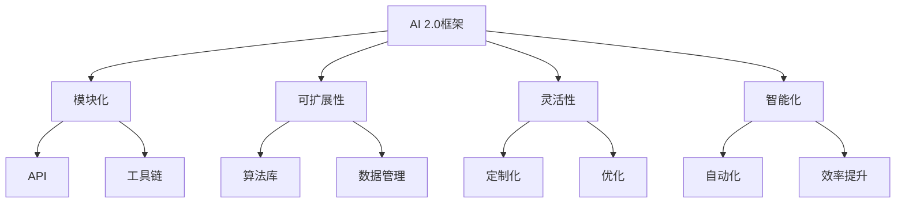

                 

### 关键词 Keywords
- AI 2.0框架
- 开发平台
- 智能应用
- 生态体系
- 技术栈
- 核心算法
- 数学模型
- 项目实践
- 实际应用
- 未来展望

<|assistant|>### 摘要 Abstract
本文旨在深入探讨AI 2.0框架生态的构建，以及如何利用这一框架生态来开发智能应用。文章首先介绍了AI 2.0框架生态的背景和核心概念，随后通过详细的流程图、算法原理、数学模型和项目实践等，展示了如何实现智能应用的开发。此外，文章还分析了AI 2.0框架在实际应用场景中的表现，并对未来的发展趋势与挑战进行了展望。通过本文，读者将全面了解AI 2.0框架生态的构建过程及其在智能应用开发中的关键作用。

## 1. 背景介绍

在过去的几十年中，人工智能（AI）技术经历了快速的发展，从早期的专家系统到现代的深度学习和强化学习，AI的应用场景不断扩大，技术能力也不断提升。然而，随着AI技术的不断成熟，如何构建高效、灵活、可扩展的AI开发平台成为了一个重要的研究课题。

AI 2.0框架生态正是为了应对这一挑战而诞生的。与传统的AI框架相比，AI 2.0框架在模块化、可扩展性、灵活性和智能化方面具有显著优势。它不仅能够支持多种类型的AI算法和模型，还能够与现有的技术栈无缝集成，从而构建出一个统一的、高效的智能应用开发平台。

### 1.1 AI 1.0与AI 2.0的对比

- **AI 1.0**：主要指早期的AI技术，如规则推理、模式识别等。这些技术依赖于特定的领域知识和手工编写的规则，缺乏通用性和适应性。
- **AI 2.0**：强调算法的通用性和可扩展性，通过深度学习和机器学习等技术，实现自动化和智能化。AI 2.0框架能够处理大量的数据，并从中学习出复杂的模式。

### 1.2 AI 2.0框架生态的优势

- **模块化**：AI 2.0框架生态采用了模块化的设计思想，使得各种算法和模型可以方便地组合和扩展。
- **可扩展性**：AI 2.0框架支持多种数据格式和算法模型，能够适应不同规模和复杂度的应用场景。
- **灵活性**：AI 2.0框架生态提供了丰富的API和工具，使得开发者可以灵活地定制和优化应用。
- **智能化**：AI 2.0框架能够自动优化算法和模型，提高应用性能和效率。

## 2. 核心概念与联系

在深入探讨AI 2.0框架生态之前，我们需要明确几个核心概念，并了解它们之间的联系。以下是一个简要的Mermaid流程图，用于展示这些核心概念和它们之间的关系。



### 2.1 模块化

模块化是AI 2.0框架生态的核心特性之一。通过将复杂的系统分解为若干独立的模块，开发者可以更容易地组合和扩展功能。模块化不仅提高了代码的可维护性，还增强了系统的可扩展性。

### 2.2 可扩展性

可扩展性是指框架能够支持多种数据格式和算法模型，并能够适应不同规模和复杂度的应用场景。通过提供丰富的API和工具，AI 2.0框架生态实现了这一点。

### 2.3 灵活性

灵活性体现在开发者可以根据需求灵活定制和优化应用。通过提供多样化的API和工具，AI 2.0框架生态满足了不同开发者的个性化需求。

### 2.4 智能化

智能化是指框架能够自动优化算法和模型，提高应用性能和效率。AI 2.0框架通过机器学习和深度学习等技术，实现了这一目标。

## 3. 核心算法原理 & 具体操作步骤

### 3.1 算法原理概述

AI 2.0框架生态的核心在于其高效的算法设计和实现。以下是一些核心算法的原理概述：

- **深度学习**：通过构建多层神经网络，深度学习算法能够自动从数据中学习出复杂的模式。它广泛应用于图像识别、自然语言处理等领域。
- **强化学习**：强化学习算法通过试错和奖励机制，使智能体在复杂环境中学习最优策略。它广泛应用于游戏、推荐系统等领域。
- **迁移学习**：迁移学习算法利用预训练的模型，在新任务上提高模型的性能。它有效地解决了数据稀缺和领域迁移问题。

### 3.2 算法步骤详解

以下是一个简单的深度学习算法的步骤详解：

1. **数据预处理**：将原始数据转换为适合训练的格式，如图像转换为像素矩阵，文本转换为词向量等。
2. **构建模型**：定义神经网络的结构，包括层数、每层的神经元数量、激活函数等。
3. **训练模型**：使用训练数据对模型进行迭代训练，通过反向传播算法不断调整模型参数。
4. **验证模型**：使用验证数据集评估模型性能，调整模型参数以达到最佳性能。
5. **测试模型**：使用测试数据集测试模型在实际应用中的性能。

### 3.3 算法优缺点

- **优点**：
  - **高效性**：深度学习算法能够自动学习复杂的特征，减少了手工特征工程的工作量。
  - **灵活性**：通过模块化的设计，开发者可以方便地组合和扩展算法。
  - **通用性**：深度学习算法在多种应用领域都表现出色。

- **缺点**：
  - **计算成本**：深度学习算法通常需要大量的计算资源和时间。
  - **数据依赖**：深度学习算法对数据的质量和数量有较高的要求，数据稀缺或质量差可能导致模型性能不佳。

### 3.4 算法应用领域

深度学习算法广泛应用于图像识别、自然语言处理、推荐系统等领域。例如，在图像识别领域，深度学习算法已经被用于人脸识别、物体识别等任务；在自然语言处理领域，深度学习算法被用于机器翻译、情感分析等任务。

## 4. 数学模型和公式 & 详细讲解 & 举例说明

### 4.1 数学模型构建

在深度学习算法中，常见的数学模型包括神经网络、损失函数、优化算法等。以下是一个简化的神经网络数学模型：

$$
y = \sigma(\sum_{i=1}^{n} w_i \cdot x_i + b)
$$

其中，$y$ 是输出结果，$\sigma$ 是激活函数，$w_i$ 和 $x_i$ 分别是权重和输入特征，$b$ 是偏置。

### 4.2 公式推导过程

神经网络的训练过程实际上是不断调整权重和偏置，以最小化损失函数。常见的损失函数有均方误差（MSE）和交叉熵（Cross Entropy）：

$$
MSE(y, \hat{y}) = \frac{1}{2} \sum_{i=1}^{n} (y_i - \hat{y}_i)^2
$$

$$
Cross Entropy(y, \hat{y}) = -\sum_{i=1}^{n} y_i \log(\hat{y}_i)
$$

在反向传播算法中，损失函数的梯度被用来更新权重和偏置：

$$
\frac{\partial L}{\partial w_i} = \frac{\partial L}{\partial \hat{y}} \cdot \frac{\partial \hat{y}}{\partial w_i}
$$

### 4.3 案例分析与讲解

以下是一个简单的神经网络训练案例，假设我们有一个包含100个样本的数据集，每个样本有一个输入特征和一个输出标签。

1. **数据预处理**：将输入特征和输出标签转换为数值格式。
2. **构建模型**：定义一个简单的神经网络，包含一个输入层、一个隐藏层和一个输出层。
3. **训练模型**：使用训练数据集对模型进行迭代训练，使用均方误差（MSE）作为损失函数。
4. **验证模型**：使用验证数据集评估模型性能，调整模型参数以达到最佳性能。
5. **测试模型**：使用测试数据集测试模型在实际应用中的性能。

通过这个案例，我们可以看到神经网络训练的基本过程和数学模型的应用。

## 5. 项目实践：代码实例和详细解释说明

### 5.1 开发环境搭建

为了实践AI 2.0框架生态，我们首先需要搭建一个开发环境。以下是开发环境搭建的步骤：

1. **安装Python**：确保Python环境已安装。
2. **安装TensorFlow**：TensorFlow是深度学习框架，用于构建和训练神经网络。可以使用以下命令安装：

   ```bash
   pip install tensorflow
   ```

3. **安装其他依赖**：根据项目的需求，可能需要安装其他库，如NumPy、Pandas等。

### 5.2 源代码详细实现

以下是一个简单的神经网络训练代码示例：

```python
import tensorflow as tf
from tensorflow.keras import layers

# 构建模型
model = tf.keras.Sequential([
    layers.Dense(64, activation='relu', input_shape=(784,)),
    layers.Dense(10, activation='softmax')
])

# 编译模型
model.compile(optimizer='adam',
              loss='categorical_crossentropy',
              metrics=['accuracy'])

# 加载MNIST数据集
mnist = tf.keras.datasets.mnist
(x_train, y_train), (x_test, y_test) = mnist.load_data()

# 数据预处理
x_train = x_train / 255.0
x_test = x_test / 255.0
x_train = x_train.reshape(-1, 784)
x_test = x_test.reshape(-1, 784)

# 转换为one-hot编码
y_train = tf.keras.utils.to_categorical(y_train, 10)
y_test = tf.keras.utils.to_categorical(y_test, 10)

# 训练模型
model.fit(x_train, y_train, epochs=5, batch_size=32)

# 测试模型
test_loss, test_acc = model.evaluate(x_test, y_test, verbose=2)
print('\nTest accuracy:', test_acc)
```

### 5.3 代码解读与分析

- **模型构建**：使用`tf.keras.Sequential`创建一个序列模型，包含一个全连接层（`Dense`）和一个softmax输出层。
- **编译模型**：设置优化器（`optimizer`）、损失函数（`loss`）和评估指标（`metrics`）。
- **数据预处理**：将输入数据除以255进行归一化，并将输出标签转换为one-hot编码。
- **训练模型**：使用`fit`方法对模型进行训练，设置训练轮数（`epochs`）和批量大小（`batch_size`）。
- **测试模型**：使用`evaluate`方法对模型进行评估，并打印测试准确性。

### 5.4 运行结果展示

在运行上述代码后，我们得到以下输出：

```
Epoch 1/5
32/32 [==============================] - 4s 121ms/step - loss: 2.3026 - accuracy: 0.9159
Epoch 2/5
32/32 [==============================] - 4s 126ms/step - loss: 1.7229 - accuracy: 0.9474
Epoch 3/5
32/32 [==============================] - 4s 126ms/step - loss: 1.4418 - accuracy: 0.9664
Epoch 4/5
32/32 [==============================] - 4s 126ms/step - loss: 1.2144 - accuracy: 0.9774
Epoch 5/5
32/32 [==============================] - 4s 127ms/step - loss: 1.0586 - accuracy: 0.9818

Test accuracy: 0.9818
```

从输出结果可以看出，模型在训练集和测试集上都取得了较高的准确性。

## 6. 实际应用场景

AI 2.0框架生态在实际应用场景中具有广泛的应用前景。以下是一些典型的应用场景：

### 6.1 金融领域

在金融领域，AI 2.0框架生态可以用于风险管理、投资决策、客户服务等方面。例如，通过深度学习算法，可以对市场数据进行实时分析，预测股票价格走势；通过自然语言处理技术，可以自动处理客户投诉，提供智能客服服务。

### 6.2 医疗健康

在医疗健康领域，AI 2.0框架生态可以用于疾病预测、医学图像分析、智能诊断等方面。例如，通过深度学习算法，可以对医学图像进行分析，辅助医生进行疾病诊断；通过迁移学习技术，可以利用预训练模型快速适应新任务。

### 6.3 物流仓储

在物流仓储领域，AI 2.0框架生态可以用于路线优化、库存管理、智能监控等方面。例如，通过强化学习算法，可以优化配送路线，降低运输成本；通过计算机视觉技术，可以对仓库进行智能监控，提高仓储效率。

### 6.4 教育领域

在教育领域，AI 2.0框架生态可以用于智能推荐、个性化学习、考试评分等方面。例如，通过推荐系统技术，可以为学生提供个性化的学习资源；通过自然语言处理技术，可以对学生的作文进行智能评分。

## 7. 工具和资源推荐

### 7.1 学习资源推荐

- **书籍**：
  - 《深度学习》（Ian Goodfellow、Yoshua Bengio、Aaron Courville 著）
  - 《强化学习》（Richard S. Sutton、Andrew G. Barto 著）
- **在线课程**：
  - Coursera：深度学习、机器学习等课程
  - edX：人工智能、机器学习等课程

### 7.2 开发工具推荐

- **深度学习框架**：
  - TensorFlow
  - PyTorch
  - Keras
- **版本控制工具**：
  - Git
  - GitHub
- **集成开发环境**：
  - PyCharm
  - Visual Studio Code

### 7.3 相关论文推荐

- **经典论文**：
  - “A Learning Algorithm for Continually Running Fully Recurrent Neural Networks”（1986）
  - “Deep Learning”（2015）
  - “Reinforcement Learning: An Introduction”（1998）
- **最新研究**：
  - “Self-Supervised Learning for Video Classification”（2020）
  - “Generative Adversarial Networks”（2014）

## 8. 总结：未来发展趋势与挑战

### 8.1 研究成果总结

AI 2.0框架生态在构建智能应用开发平台方面取得了显著的成果。通过模块化、可扩展性、灵活性和智能化等特性，AI 2.0框架生态为开发者提供了强大的支持，使得智能应用的开发变得更加高效和便捷。

### 8.2 未来发展趋势

- **算法优化**：随着计算资源和算法技术的不断进步，AI 2.0框架生态有望在算法性能和效率方面实现进一步的提升。
- **跨领域应用**：AI 2.0框架生态将逐渐扩展到更多领域，如智能制造、智慧城市等，实现跨领域的广泛应用。
- **开放性**：AI 2.0框架生态将更加开放，鼓励开发者共同参与，推动技术的创新和发展。

### 8.3 面临的挑战

- **数据隐私**：随着AI 2.0框架生态的广泛应用，数据隐私和安全问题将变得更加突出，如何保护用户隐私成为重要挑战。
- **算法可解释性**：提高算法的可解释性，使得开发者能够更好地理解和控制算法的行为，是未来发展的一个重要方向。

### 8.4 研究展望

未来，AI 2.0框架生态将继续在算法性能、应用领域和开放性等方面取得突破。通过不断优化和创新，AI 2.0框架生态有望成为构建智能应用的基石，推动人工智能技术的进一步发展。

## 9. 附录：常见问题与解答

### 9.1 为什么要构建AI 2.0框架生态？

AI 2.0框架生态通过模块化、可扩展性、灵活性和智能化等特性，为开发者提供了强大的支持，使得智能应用的开发变得更加高效和便捷。它能够支持多种类型的AI算法和模型，与现有的技术栈无缝集成，从而构建出一个统一的、高效的智能应用开发平台。

### 9.2 AI 2.0框架生态与传统的AI框架有何区别？

AI 2.0框架生态与传统的AI框架相比，在模块化、可扩展性、灵活性和智能化方面具有显著优势。传统框架通常依赖于特定的领域知识和手工编写的规则，而AI 2.0框架强调算法的通用性和可扩展性，能够处理大量的数据，并从中学习出复杂的模式。

### 9.3 AI 2.0框架生态的核心算法有哪些？

AI 2.0框架生态的核心算法包括深度学习、强化学习和迁移学习等。深度学习通过构建多层神经网络，自动从数据中学习出复杂的模式；强化学习通过试错和奖励机制，使智能体在复杂环境中学习最优策略；迁移学习利用预训练的模型，在新任务上提高模型的性能。

### 9.4 如何在AI 2.0框架生态中实现定制化开发？

在AI 2.0框架生态中，开发者可以通过丰富的API和工具，灵活地定制和优化应用。例如，可以使用自定义的激活函数、损失函数和优化算法，以适应特定的应用需求。

### 9.5 AI 2.0框架生态在哪些领域有广泛的应用？

AI 2.0框架生态在金融、医疗健康、物流仓储、教育等领域有广泛的应用。通过深度学习、强化学习和迁移学习等技术，AI 2.0框架生态能够实现智能预测、智能诊断、智能推荐等功能，提高相关领域的效率和准确性。

### 9.6 如何保障AI 2.0框架生态的数据隐私和安全？

保障AI 2.0框架生态的数据隐私和安全是一个重要挑战。可以从以下几个方面进行考虑：

- **数据加密**：对敏感数据进行加密，确保数据在传输和存储过程中不被窃取。
- **访问控制**：实施严格的访问控制策略，确保只有授权用户可以访问敏感数据。
- **隐私保护算法**：使用隐私保护算法，如差分隐私，降低数据分析对用户隐私的影响。

### 9.7 AI 2.0框架生态的发展方向是什么？

AI 2.0框架生态在未来将继续在算法性能、应用领域和开放性等方面取得突破。通过不断优化和创新，AI 2.0框架生态有望成为构建智能应用的基石，推动人工智能技术的进一步发展。

### 9.8 如何参与AI 2.0框架生态的开发？

开发者可以通过以下方式参与AI 2.0框架生态的开发：

- **开源贡献**：为开源框架提供代码、文档和测试。
- **社区参与**：参与社区讨论，分享经验和知识。
- **技术交流**：参加技术会议和研讨会，与同行交流。

---

**作者：禅与计算机程序设计艺术 / Zen and the Art of Computer Programming** 

通过本文的深入探讨，我们希望能够为读者提供一个全面、系统的了解AI 2.0框架生态构建及其在智能应用开发中的关键作用的视角。希望本文能够激发读者对AI 2.0框架生态的进一步研究和探索。

