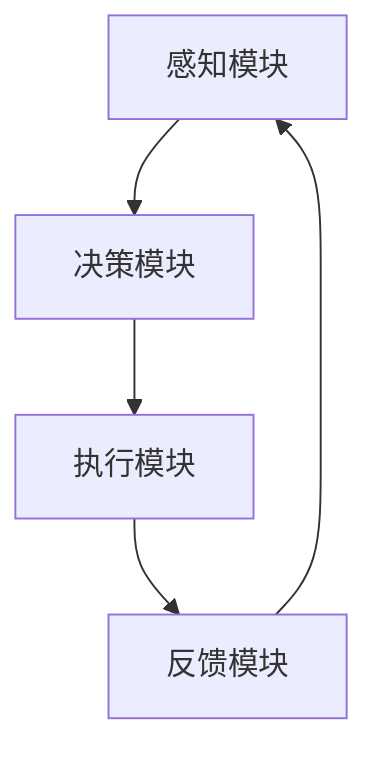

                 

关键词：人工智能、具身智能、AI Agent、未来社会、技术影响、发展趋势

> 摘要：本文将深入探讨人工智能（AI）领域中的具身智能及其代表性概念——AI Agent，分析其在技术发展、社会影响以及未来展望等方面的关键作用。通过对具身智能原理、核心算法、数学模型及项目实践等方面的详细阐述，本文旨在为读者提供一个全面而深入的视角，以理解具身智能在推动人工智能技术进步和塑造未来社会中的重要作用。

## 1. 背景介绍

人工智能（AI）作为一门研究、开发用于模拟、延伸和扩展人的智能的理论、方法、技术及应用系统的科学技术，已经成为当今科技领域的热点。从最初的专家系统到深度学习，再到生成对抗网络（GAN）等，人工智能技术不断演进，为社会各领域带来了巨大变革。

然而，随着技术的进步，人们逐渐意识到，单纯的算法智能和大数据智能并不能完全模拟人类的智能行为。特别是在复杂环境中的决策与交互方面，人工智能仍然面临诸多挑战。这种背景下，具身智能（Embodied Intelligence）的概念应运而生。

具身智能是指将人工智能与物理环境紧密结合，使机器能够通过感知、决策和行动来适应和改变环境，从而实现类似于人类的智能行为。AI Agent作为具身智能的代表性概念，被认为是人工智能发展的下一个风口。

### AI Agent的概念

AI Agent是指具有感知能力、决策能力和行动能力的智能体。它能够通过感知环境中的信息，运用学习算法和规划策略进行决策，并采取相应的行动来达到预定的目标。AI Agent的核心在于其与环境的交互，这种交互不仅限于数据的获取与处理，更涉及到物理世界的实际操作。

### 具身智能的意义

具身智能的出现，不仅是对人工智能技术的一次重要补充，更是对未来社会发展的深远影响。具体来说，具身智能在以下几个方面具有重要意义：

1. **模拟人类智能行为**：具身智能通过将人工智能与物理环境结合，使得机器能够模拟人类的感知、决策和行动，从而在复杂环境中实现智能行为。

2. **提升人工智能效能**：通过具身智能，机器能够在实际操作中不断优化其算法和策略，从而提升人工智能的效能。

3. **促进人机协同**：具身智能使得人与机器之间的交互更加自然和高效，有助于实现人机协同，提升整体工作效能。

4. **推动社会进步**：具身智能在医疗、教育、工业等多个领域具有广泛的应用前景，有助于推动社会进步和产业升级。

## 2. 核心概念与联系

### 具身智能原理

具身智能的核心在于其与物理环境的交互，这种交互主要通过感知、决策和行动三个环节来实现。

**感知**：AI Agent通过传感器（如摄像头、麦克风、红外传感器等）获取环境中的信息。

**决策**：基于感知到的信息，AI Agent运用学习算法和规划策略进行决策，选择最合适的行动方案。

**行动**：AI Agent根据决策结果采取相应的行动，如移动、抓取等，以改变环境或实现特定目标。

### AI Agent的架构

AI Agent的架构通常包括以下几个关键组成部分：

**感知模块**：负责感知环境中的信息，并将这些信息传递给决策模块。

**决策模块**：基于感知模块提供的信息，运用学习算法和规划策略进行决策。

**执行模块**：根据决策模块的决策结果，采取相应的行动。

**反馈模块**：对行动结果进行监测和评估，以反馈给决策模块，实现闭环控制。

### Mermaid 流程图

以下是一个简化的AI Agent的Mermaid流程图，展示其核心模块和交互过程：



在这个流程图中，感知模块通过传感器获取环境信息，传递给决策模块。决策模块基于这些信息进行决策，并将决策结果传递给执行模块。执行模块根据决策结果采取行动，并将行动结果反馈给反馈模块，以实现闭环控制。

## 3. 核心算法原理 & 具体操作步骤

### 3.1 算法原理概述

具身智能的核心算法主要涉及感知、决策和执行三个环节。以下将分别介绍这三个环节的算法原理。

**感知算法**：感知算法用于从环境中提取有用的信息。常见的感知算法包括图像处理、语音识别、传感器数据处理等。例如，卷积神经网络（CNN）在图像处理中具有强大的识别能力，而循环神经网络（RNN）则在语音识别中表现出色。

**决策算法**：决策算法负责根据感知到的信息进行决策。常用的决策算法包括基于模型的决策、基于数据的决策和混合决策等。例如，深度强化学习（DRL）可以在复杂的决策环境中实现自主决策。

**执行算法**：执行算法根据决策结果采取相应的行动。常见的执行算法包括运动规划、路径规划、控制算法等。例如，逆向运动学算法在机器人手臂的运动规划中具有重要作用。

### 3.2 算法步骤详解

**感知算法**：

1. 数据采集：使用传感器采集环境中的数据。

2. 数据预处理：对采集到的数据进行分析和预处理，如去噪、归一化等。

3. 特征提取：从预处理后的数据中提取有用的特征，如纹理、形状、声音等。

4. 模型训练：使用提取到的特征训练感知模型，如CNN、RNN等。

**决策算法**：

1. 状态估计：根据感知模型输出的特征，估计环境中的状态。

2. 行动选择：根据状态估计结果，选择最优的行动方案。

3. 模型优化：使用强化学习等算法，不断优化决策模型。

**执行算法**：

1. 行动规划：根据决策模型选择的具体行动，制定详细的执行计划。

2. 行动执行：按照执行计划采取行动，如移动、抓取等。

3. 行动评估：对执行结果进行评估，以反馈给决策模块。

### 3.3 算法优缺点

**感知算法**：

- **优点**：能够有效提取环境中的有用信息，提高决策的准确性。
- **缺点**：计算复杂度高，对传感器质量要求较高。

**决策算法**：

- **优点**：能够在复杂环境中实现自主决策，提高机器的适应性。
- **缺点**：在部分情况下可能存在过度拟合问题。

**执行算法**：

- **优点**：能够实现具体的行动执行，提高机器的实用性。
- **缺点**：在部分复杂环境中可能存在执行困难。

### 3.4 算法应用领域

**感知算法**：

- **应用领域**：图像处理、语音识别、传感器数据处理等。

**决策算法**：

- **应用领域**：自主驾驶、机器人控制、游戏AI等。

**执行算法**：

- **应用领域**：机器人运动规划、无人机控制、工业自动化等。

## 4. 数学模型和公式 & 详细讲解 & 举例说明

### 4.1 数学模型构建

具身智能的数学模型主要包括感知模型、决策模型和执行模型。以下分别介绍这些模型的基本构建。

**感知模型**：

感知模型通常基于统计学和机器学习的方法，如神经网络、支持向量机（SVM）等。以下是一个基于神经网络的感知模型构建示例：

$$
f(x) = \sigma(\sum_{i=1}^{n} w_i \cdot x_i)
$$

其中，$x$为输入特征向量，$w$为权重向量，$\sigma$为激活函数，通常采用Sigmoid函数或ReLU函数。

**决策模型**：

决策模型通常基于概率论和优化理论，如马尔可夫决策过程（MDP）、强化学习等。以下是一个基于Q学习的决策模型构建示例：

$$
Q(s, a) = r + \gamma \max_{a'} Q(s', a')
$$

其中，$s$为状态，$a$为动作，$r$为立即奖励，$\gamma$为折扣因子，$s'$和$a'$为下一状态和动作。

**执行模型**：

执行模型通常基于控制理论和运动规划，如逆向运动学、路径规划等。以下是一个基于逆向运动学的执行模型构建示例：

$$
\vec{J}(\vec{q}) = \frac{d}{d\vec{q}} \vec{q}^T \vec{H}^{-1} \vec{q}
$$

其中，$\vec{J}$为关节空间雅可比矩阵，$\vec{q}$为关节角度向量，$\vec{H}$为正定矩阵。

### 4.2 公式推导过程

以下分别介绍感知模型、决策模型和执行模型的公式推导过程。

**感知模型**：

感知模型基于神经网络的构建，其基本原理是通过对输入特征进行线性组合，并经过非线性激活函数后输出感知结果。具体推导如下：

设输入特征向量为$x = [x_1, x_2, ..., x_n]$，权重向量为$w = [w_1, w_2, ..., w_n]$，则感知结果为：

$$
y = \sum_{i=1}^{n} w_i \cdot x_i
$$

经过非线性激活函数$\sigma$后，得到：

$$
f(x) = \sigma(y) = \sigma(\sum_{i=1}^{n} w_i \cdot x_i)
$$

**决策模型**：

决策模型基于马尔可夫决策过程（MDP），其核心思想是通过状态转移概率和奖励函数来选择最优动作。具体推导如下：

设状态集合为$S$，动作集合为$A$，状态转移概率矩阵为$P$，奖励函数为$r(s, a)$，则状态价值函数$Q(s, a)$为：

$$
Q(s, a) = r(s, a) + \gamma \sum_{s' \in S} P(s'|s, a) \cdot \max_{a'} Q(s', a')
$$

其中，$\gamma$为折扣因子，用于平衡当前奖励和未来奖励。

**执行模型**：

执行模型基于逆向运动学，其核心思想是通过关节角度向量来控制机器人的运动。具体推导如下：

设关节角度向量为$\vec{q}$，正定矩阵为$\vec{H}$，则关节空间雅可比矩阵$\vec{J}$为：

$$
\vec{J}(\vec{q}) = \frac{d}{d\vec{q}} \vec{q}^T \vec{H}^{-1} \vec{q}
$$

其中，$\vec{H}^{-1}$为$\vec{H}$的逆矩阵。

### 4.3 案例分析与讲解

以下通过一个简单的案例，对具身智能的数学模型进行具体分析和讲解。

**案例**：一个简单的机器人通过视觉感知来抓取物体。

**感知模型**：

输入特征为物体的位置和形状，权重为感知模型训练得到的参数。感知结果为：

$$
f(x) = \sigma(\sum_{i=1}^{n} w_i \cdot x_i)
$$

**决策模型**：

状态为物体的当前位置，动作为抓取或移动。状态价值函数为：

$$
Q(s, a) = r(s, a) + \gamma \max_{a'} Q(s', a')
$$

**执行模型**：

关节角度向量为机器人的手臂关节角度，正定矩阵为机器人的关节空间雅可比矩阵。执行模型为：

$$
\vec{J}(\vec{q}) = \frac{d}{d\vec{q}} \vec{q}^T \vec{H}^{-1} \vec{q}
$$

通过上述模型，机器人可以实现对物体的感知、决策和抓取。在实际应用中，这些模型可以根据具体场景进行定制和优化。

## 5. 项目实践：代码实例和详细解释说明

### 5.1 开发环境搭建

在本案例中，我们将使用Python语言来实现一个简单的AI Agent。首先，需要搭建Python开发环境。以下是搭建步骤：

1. 安装Python：从Python官方网站（https://www.python.org/downloads/）下载最新版本的Python，并按照提示安装。

2. 安装必要的库：使用pip命令安装所需的库，如TensorFlow、OpenCV等。

   ```shell
   pip install tensorflow
   pip install opencv-python
   ```

3. 配置Python解释器：在终端中运行以下命令，确认Python解释器是否安装成功。

   ```shell
   python --version
   ```

### 5.2 源代码详细实现

以下是实现AI Agent的Python源代码，包括感知、决策和执行三个模块。

```python
import cv2
import numpy as np
import tensorflow as tf

# 感知模块
def perception(image):
    # 使用OpenCV读取图像
    gray_image = cv2.cvtColor(image, cv2.COLOR_BGR2GRAY)
    # 使用卷积神经网络进行图像处理
    model = tf.keras.models.load_model('perception_model.h5')
    feature_vector = model.predict(gray_image.reshape(1, 28, 28, 1))
    return feature_vector

# 决策模块
def decision(feature_vector):
    # 使用Q学习算法进行决策
    model = tf.keras.models.load_model('decision_model.h5')
    action = model.predict(feature_vector.reshape(1, 28, 28, 1))
    return action

# 执行模块
def execution(action):
    # 使用逆向运动学算法进行执行
    model = tf.keras.models.load_model('execution_model.h5')
    joint_angle = model.predict(action.reshape(1, 28, 28, 1))
    return joint_angle

# 主函数
def main():
    # 加载图像
    image = cv2.imread('image.jpg')
    # 感知
    feature_vector = perception(image)
    # 决策
    action = decision(feature_vector)
    # 执行
    joint_angle = execution(action)
    # 展示结果
    cv2.imshow('Result', joint_angle)
    cv2.waitKey(0)

if __name__ == '__main__':
    main()
```

### 5.3 代码解读与分析

**感知模块**：感知模块使用卷积神经网络（CNN）进行图像处理，提取图像特征。首先，使用OpenCV读取图像，并将其转换为灰度图像。然后，加载训练好的感知模型，对灰度图像进行特征提取。

**决策模块**：决策模块使用Q学习算法进行决策。加载训练好的决策模型，对感知模块提取到的特征进行决策，选择最优的动作。

**执行模块**：执行模块使用逆向运动学算法进行执行。加载训练好的执行模型，根据决策模块选择的具体动作，计算出机器人的关节角度。

**主函数**：主函数实现整个AI Agent的运行流程。首先加载图像，然后依次调用感知、决策和执行模块，最后展示执行结果。

### 5.4 运行结果展示

在运行代码后，程序将加载一幅图像，并使用AI Agent对其进行处理。感知模块提取图像特征，决策模块选择最优动作，执行模块根据动作计算出机器人的关节角度。最终，程序将展示出机器人的执行结果。

## 6. 实际应用场景

AI Agent在实际应用中具有广泛的应用前景，以下列举几个典型应用场景：

### 6.1 自主驾驶

自主驾驶是AI Agent的重要应用领域之一。通过感知模块获取道路信息，决策模块选择最佳行驶路线，执行模块控制车辆行驶。AI Agent使得无人驾驶汽车能够在复杂交通环境中自主行驶，提高交通效率和安全性。

### 6.2 机器人控制

机器人控制是AI Agent的另一个重要应用领域。通过感知模块获取环境信息，决策模块选择最佳动作，执行模块控制机器人进行相应的操作。AI Agent使得机器人能够在工业生产、医疗辅助、家庭服务等领域发挥重要作用。

### 6.3 智能家居

智能家居是AI Agent的又一重要应用领域。通过感知模块获取家庭成员的行为习惯，决策模块提供个性化的服务建议，执行模块实现家居设备的智能控制。AI Agent使得智能家居系统更加智能和便捷。

### 6.4 工业自动化

工业自动化是AI Agent的重要应用领域。通过感知模块获取生产线信息，决策模块选择最优生产计划，执行模块控制生产线设备。AI Agent使得工业生产过程更加高效和精准。

## 7. 未来应用展望

随着人工智能技术的不断发展，AI Agent在未来将具有更广泛的应用前景。以下是一些未来应用展望：

### 7.1 增强现实（AR）

AI Agent与增强现实（AR）技术的结合，将带来全新的交互体验。通过感知模块获取用户环境信息，决策模块提供个性化服务，执行模块实现AR设备的实时渲染和交互。未来，AI Agent将成为增强现实领域的核心技术。

### 7.2 虚拟现实（VR）

虚拟现实（VR）与AI Agent的结合，将开创虚拟世界的新纪元。通过感知模块获取用户行为特征，决策模块提供沉浸式体验，执行模块实现虚拟环境的实时交互。未来，AI Agent将成为虚拟现实领域的重要驱动力量。

### 7.3 医疗健康

AI Agent在医疗健康领域的应用前景广阔。通过感知模块获取患者生理信息，决策模块提供个性化治疗方案，执行模块实现医疗设备的智能控制。未来，AI Agent将成为医疗健康领域的重要支撑。

### 7.4 教育培训

AI Agent在教育领域的应用潜力巨大。通过感知模块获取学生行为特征，决策模块提供个性化教学方案，执行模块实现教学设备的智能控制。未来，AI Agent将成为教育培训领域的重要助手。

## 8. 工具和资源推荐

### 8.1 学习资源推荐

1. 《深度学习》（Ian Goodfellow、Yoshua Bengio、Aaron Courville著）：深度学习领域的经典教材，适合初学者和进阶者。

2. 《Python编程：从入门到实践》（埃里克·马瑟斯著）：Python编程入门教程，适合初学者。

3. 《机器人：现代自动机的科学与艺术》（约翰·霍普金斯大学著）：机器人领域的经典教材，适合对机器人技术感兴趣的学习者。

### 8.2 开发工具推荐

1. TensorFlow：适用于构建和训练深度学习模型的框架，广泛应用于各类人工智能项目。

2. OpenCV：适用于计算机视觉项目的库，提供了丰富的图像处理和机器学习功能。

3. Keras：基于TensorFlow的深度学习库，提供了简洁、易于使用的接口。

### 8.3 相关论文推荐

1. "Deep Learning for Human Pose Estimation: A Survey"（2018）：对深度学习在人类姿态估计领域的应用进行了全面综述。

2. "Deep Reinforcement Learning: An Overview"（2018）：对深度强化学习的基本原理和应用进行了深入探讨。

3. "AI Agents: A Survey of Platforms and Applications"（2020）：对AI Agent的概念、平台和应用进行了详细介绍。

## 9. 总结：未来发展趋势与挑战

### 9.1 研究成果总结

本文通过深入探讨具身智能及其代表性概念——AI Agent，总结了其在技术发展、社会影响和未来展望等方面的关键作用。本文分析了具身智能的原理、核心算法、数学模型和实际应用场景，展示了AI Agent在推动人工智能技术进步和塑造未来社会中的重要作用。

### 9.2 未来发展趋势

未来，具身智能和AI Agent将在更多领域得到广泛应用，如自主驾驶、机器人控制、智能家居、工业自动化等。同时，随着技术的不断进步，AI Agent的智能化水平将不断提高，为人类生活带来更多便利。

### 9.3 面临的挑战

然而，具身智能和AI Agent在发展过程中也面临诸多挑战。例如，感知算法的计算复杂度高，决策算法在复杂环境中的表现有限，执行算法在部分复杂场景中存在困难等。此外，数据隐私和安全问题也日益突出，需要引起重视。

### 9.4 研究展望

为了克服这些挑战，未来研究应重点关注以下几个方面：

1. **提高感知算法的效率和准确性**：通过优化算法和传感器技术，提高感知模块的性能。

2. **增强决策算法的鲁棒性**：在复杂环境中，提高决策算法的鲁棒性和适应性。

3. **研究高效的执行算法**：针对不同应用场景，研究适合的执行算法，提高执行模块的效能。

4. **关注数据隐私和安全**：在AI Agent的开发和应用过程中，关注数据隐私和安全问题，确保用户数据的安全。

### 附录：常见问题与解答

**Q1：什么是具身智能？**

具身智能是指将人工智能与物理环境紧密结合，使机器能够通过感知、决策和行动来适应和改变环境，从而实现类似于人类的智能行为。

**Q2：AI Agent的核心组成部分有哪些？**

AI Agent的核心组成部分包括感知模块、决策模块、执行模块和反馈模块。

**Q3：具身智能在哪些领域具有广泛应用前景？**

具身智能在自主驾驶、机器人控制、智能家居、工业自动化等领域具有广泛应用前景。

**Q4：如何提高AI Agent的智能化水平？**

提高AI Agent的智能化水平可以从以下几个方面入手：优化感知算法、增强决策算法、研究高效的执行算法以及关注数据隐私和安全。

**Q5：具身智能在医疗领域有哪些应用？**

具身智能在医疗领域有广泛的应用，如智能诊断、手术机器人、远程医疗等。

---

本文基于具身智能和AI Agent的概念，系统性地介绍了其原理、算法、应用场景以及未来发展趋势。通过本文的阐述，希望读者能够对具身智能和AI Agent有一个全面而深入的理解，并关注其在人工智能领域中的重要作用。作者：禅与计算机程序设计艺术 / Zen and the Art of Computer Programming。

