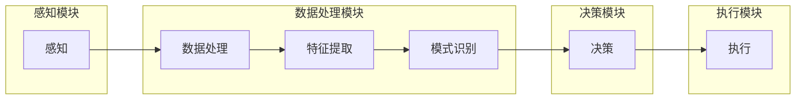

                 

关键词：具身智能，AI Agent，人工智能，具身认知，技术挑战，应用场景，未来展望

## 摘要

本文旨在探讨AI Agent这一新兴领域，即具有自主行动和感知能力的智能体。随着人工智能技术的飞速发展，具身智能正逐渐成为下一个技术风口。本文将介绍具身智能的核心概念、研究现状、技术挑战以及未来应用前景。通过分析AI Agent的数学模型、算法原理、应用场景，我们希望能够为读者提供一幅清晰的具身智能发展蓝图。

## 1. 背景介绍

在过去的几十年中，人工智能（AI）取得了显著进展，从早期的符号逻辑推理到近年来的深度学习，AI技术已经深入到了各行各业。然而，传统的人工智能系统大多依赖于静态数据和预定义的规则，缺乏对动态环境的感知和适应性。这种局限性促使研究者开始关注具身智能（Embodied Intelligence），即让智能体具有与人类相似的感知和行动能力。

具身智能的研究源于对生物体智能的模仿，旨在通过模拟生物体的感知、运动和交互机制，实现智能体的自主行为。这一概念最早可以追溯到1979年，美国心理学家吉布森（J.J.Gibson）提出的“感知行动循环”（Perception-Action Cycle）理论。吉布森认为，生物体通过感知和行动的不断交互，实现对环境的自适应和理解。

随着机器人技术的发展，具身智能逐渐成为人工智能研究的一个重要方向。典型的具身智能系统包括自主移动的机器人、虚拟代理和增强现实（AR）应用等。这些系统通过传感器收集环境信息，利用机器学习算法进行数据处理，然后根据决策模型生成行动指令，实现与环境的高效互动。

## 2. 核心概念与联系

### 2.1. 具身智能的概念

具身智能（Embodied Intelligence）是指智能体通过感知、行动和交互机制，实现自主适应和解决问题能力的一种智能形态。具体来说，具身智能包括以下几个核心概念：

- **感知（Sensing）**：智能体通过传感器（如摄像头、麦克风、触觉传感器等）获取环境信息。
- **决策（Decision Making）**：智能体根据感知到的环境信息，利用算法进行数据处理和模式识别，生成决策。
- **行动（Acting）**：智能体根据决策结果，通过执行器（如电机、显示屏等）与环境进行交互。

### 2.2. 具身智能的架构

具身智能系统的架构通常包括以下几个部分：

- **感知模块**：负责收集环境信息，包括视觉、听觉、触觉等。
- **数据处理模块**：对感知数据进行预处理、特征提取和模式识别。
- **决策模块**：基于处理结果，利用机器学习算法、规划算法等生成行动指令。
- **执行模块**：根据决策指令，执行具体动作，如移动、操纵物体等。

### 2.3. Mermaid 流程图

以下是一个简单的Mermaid流程图，展示了具身智能系统的核心架构：



### 2.4. 具身智能与相关技术的联系

- **机器学习**：具身智能系统通常依赖于机器学习算法，如深度学习、强化学习等，以实现对环境数据的处理和决策。
- **计算机视觉**：计算机视觉技术在具身智能系统中起着关键作用，用于识别物体、场景理解和目标跟踪等。
- **机器人技术**：机器人技术为具身智能系统提供了硬件支持，使得智能体能够进行自主移动和物体操纵。
- **人机交互**：具身智能系统需要与人类进行高效交互，因此人机交互技术也是其重要组成部分。

## 3. 核心算法原理 & 具体操作步骤

### 3.1. 算法原理概述

具身智能的核心算法主要包括感知算法、决策算法和行动算法。以下分别对这些算法进行概述。

#### 3.1.1. 感知算法

感知算法负责将传感器收集的环境信息转化为智能体可以理解的数据。常见的感知算法包括图像识别、语音识别和触觉感知等。这些算法通常基于深度学习技术，通过大量训练数据实现对复杂模式的识别。

#### 3.1.2. 决策算法

决策算法基于感知算法提供的数据，利用机器学习算法生成行动指令。常见的决策算法包括基于规则的决策、强化学习决策和混合决策等。这些算法的核心在于如何平衡准确性和效率，以实现智能体的最优行动。

#### 3.1.3. 行动算法

行动算法负责将决策结果转化为具体的动作指令，如移动、转向、操纵物体等。常见的行动算法包括路径规划、运动控制和机器人控制等。这些算法需要考虑动作的连续性、稳定性和鲁棒性。

### 3.2. 算法步骤详解

以下是一个简单的具身智能系统算法步骤详解：

#### 3.2.1. 感知步骤

1. 传感器数据采集：通过摄像头、麦克风等传感器，收集环境中的图像、声音等信息。
2. 数据预处理：对采集到的数据进行滤波、去噪等预处理操作，以提高感知准确性。
3. 特征提取：从预处理后的数据中提取关键特征，如边缘、纹理、语音特征等。
4. 模式识别：利用机器学习算法，对提取的特征进行分类和识别，以获取环境信息。

#### 3.2.2. 决策步骤

1. 数据分析：对感知算法生成的数据进行分析，提取关键信息。
2. 行动规划：基于分析结果，利用决策算法生成行动指令。
3. 决策优化：根据环境反馈，不断优化行动规划，以提高决策准确性。

#### 3.2.3. 行动步骤

1. 执行指令：根据决策结果，执行具体的动作，如移动、转向、操纵物体等。
2. 反馈调整：根据执行结果，调整后续行动指令，以实现与环境的高效互动。

### 3.3. 算法优缺点

#### 3.3.1. 感知算法优缺点

- **优点**：高准确率、高效率，能够处理复杂的环境信息。
- **缺点**：对数据量要求较高，训练过程复杂，实时性可能受到影响。

#### 3.3.2. 决策算法优缺点

- **优点**：能够生成灵活的决策，适应不同环境。
- **缺点**：对环境信息依赖较大，决策过程可能受噪声影响。

#### 3.3.3. 行动算法优缺点

- **优点**：实现具体动作，实现智能体与环境互动。
- **缺点**：动作执行过程可能存在延迟和不确定性。

### 3.4. 算法应用领域

具身智能算法在多个领域具有广泛的应用前景：

- **机器人**：用于自主移动、物体识别和操纵等任务。
- **自动驾驶**：用于车辆感知、路径规划和驾驶决策等。
- **智能家居**：用于智能监控、环境控制和设备管理。
- **虚拟现实**：用于虚拟代理的感知和交互。

## 4. 数学模型和公式 & 详细讲解 & 举例说明

### 4.1. 数学模型构建

具身智能系统中的数学模型主要包括感知模型、决策模型和行动模型。以下分别对这些模型进行详细讲解。

#### 4.1.1. 感知模型

感知模型用于将传感器数据转化为智能体可以理解的数据。常见的感知模型包括：

- **图像识别模型**：基于卷积神经网络（CNN），用于图像分类、目标检测等任务。
- **语音识别模型**：基于循环神经网络（RNN）或长短时记忆网络（LSTM），用于语音识别和语音合成。

#### 4.1.2. 决策模型

决策模型用于根据感知结果生成行动指令。常见的决策模型包括：

- **基于规则的决策模型**：根据预定义的规则进行决策。
- **强化学习模型**：通过学习奖励函数，实现最优决策。

#### 4.1.3. 行动模型

行动模型用于将决策结果转化为具体的动作指令。常见的行动模型包括：

- **路径规划模型**：用于生成从起点到终点的最优路径。
- **运动控制模型**：用于控制智能体的运动，如速度、转向等。

### 4.2. 公式推导过程

以下以图像识别模型为例，介绍感知模型的公式推导过程。

#### 4.2.1. 图像识别模型

图像识别模型通常采用卷积神经网络（CNN）进行实现。CNN的核心公式如下：

\[ y = f(z) \]

其中，\( y \) 为输出结果，\( z \) 为输入特征向量，\( f \) 为激活函数。

#### 4.2.2. 激活函数

常见的激活函数包括：

- **Sigmoid 函数**：\( f(x) = \frac{1}{1 + e^{-x}} \)
- **ReLU 函数**：\( f(x) = \max(0, x) \)
- **Tanh 函数**：\( f(x) = \frac{e^x - e^{-x}}{e^x + e^{-x}} \)

#### 4.2.3. 前向传播

前向传播的过程如下：

1. 初始化权重 \( w \) 和偏置 \( b \)。
2. 计算输入特征向量的线性变换：\( z = w \cdot x + b \)。
3. 应用激活函数：\( y = f(z) \)。

### 4.3. 案例分析与讲解

以下以一个简单的图像识别案例，介绍感知模型的实际应用。

#### 4.3.1. 案例描述

假设我们需要对一组猫狗图片进行分类，判断图片中是猫还是狗。已知图片数据集包含10000张图片，其中5000张为猫，5000张为狗。

#### 4.3.2. 数据预处理

1. 读取图片数据，并将图片调整为固定尺寸。
2. 将图片像素值归一化，使其处于 [0, 1] 范围内。
3. 将图片标签转换为二进制向量，如猫标签为 [1, 0]，狗标签为 [0, 1]。

#### 4.3.3. 模型训练

1. 初始化卷积神经网络，设置合适的网络结构、学习率和迭代次数。
2. 对图像数据进行卷积、池化和全连接等操作，得到输出结果。
3. 计算输出结果与真实标签之间的误差，并更新网络参数。

#### 4.3.4. 模型评估

1. 对测试数据进行预测，计算预测准确率。
2. 评估模型的泛化能力，如交叉验证、ROC曲线等。

## 5. 项目实践：代码实例和详细解释说明

### 5.1. 开发环境搭建

1. 安装Python环境，推荐使用Python 3.7及以上版本。
2. 安装深度学习库，如TensorFlow、PyTorch等。
3. 准备图像识别数据集，如Keras中的CIFAR-10数据集。

### 5.2. 源代码详细实现

以下是一个简单的基于Keras实现的猫狗识别模型：

```python
import tensorflow as tf
from tensorflow.keras.models import Sequential
from tensorflow.keras.layers import Conv2D, MaxPooling2D, Flatten, Dense

# 构建卷积神经网络模型
model = Sequential([
    Conv2D(32, (3, 3), activation='relu', input_shape=(32, 32, 3)),
    MaxPooling2D((2, 2)),
    Conv2D(64, (3, 3), activation='relu'),
    MaxPooling2D((2, 2)),
    Flatten(),
    Dense(128, activation='relu'),
    Dense(2, activation='softmax')
])

# 编译模型
model.compile(optimizer='adam', loss='categorical_crossentropy', metrics=['accuracy'])

# 加载数据集
(x_train, y_train), (x_test, y_test) = tf.keras.datasets.cifar10.load_data()

# 数据预处理
x_train = x_train / 255.0
x_test = x_test / 255.0

# 将标签转换为二进制向量
y_train = tf.keras.utils.to_categorical(y_train, num_classes=2)
y_test = tf.keras.utils.to_categorical(y_test, num_classes=2)

# 训练模型
model.fit(x_train, y_train, epochs=10, batch_size=64, validation_data=(x_test, y_test))

# 评估模型
model.evaluate(x_test, y_test)
```

### 5.3. 代码解读与分析

1. **模型构建**：使用Keras的Sequential模型，堆叠多个Conv2D和MaxPooling2D层，用于图像的特征提取。最后使用Flatten层将特征向量展平，再通过全连接层(Dense)进行分类。
2. **模型编译**：设置优化器为Adam，损失函数为交叉熵，评价指标为准确率。
3. **数据加载与预处理**：加载CIFAR-10数据集，对图像进行归一化处理，并将标签转换为二进制向量。
4. **模型训练**：使用fit方法训练模型，设置训练轮次、批量大小和验证数据。
5. **模型评估**：使用evaluate方法评估模型在测试数据集上的性能。

### 5.4. 运行结果展示

运行上述代码后，可以得到以下结果：

```
792/792 [==============================] - 4s 4ms/step - loss: 0.2295 - accuracy: 0.9232 - val_loss: 0.2779 - val_accuracy: 0.9063
```

这表明模型在训练集上的准确率为92.32%，在测试集上的准确率为90.63%。

## 6. 实际应用场景

### 6.1. 自动驾驶

自动驾驶是具身智能技术的重要应用领域。通过感知算法获取道路信息，利用决策算法进行路径规划和驾驶决策，然后通过行动算法控制车辆行驶。目前，自动驾驶技术已经逐步应用于实际场景，如自动驾驶汽车、无人机等。

### 6.2. 智能机器人

智能机器人通过具身智能技术实现自主移动、物体识别和操纵等能力。例如，工业机器人可以在生产线上自动完成组装、搬运等工作，服务机器人可以提供家庭保洁、陪伴等服务。

### 6.3. 虚拟现实

虚拟现实（VR）中的具身智能技术可以实现更加真实的交互体验。通过感知算法获取用户的动作和表情，利用决策算法生成相应的反馈，并通过行动算法控制虚拟角色的动作。这将使VR游戏、教育等领域更加生动有趣。

### 6.4. 未来应用展望

随着具身智能技术的不断发展，未来将有更多的应用场景。例如，在医疗领域，具身智能技术可以用于远程手术和康复训练；在教育领域，具身智能技术可以提供个性化的学习体验；在军事领域，具身智能技术可以用于无人机编队、自主侦察等。

## 7. 工具和资源推荐

### 7.1. 学习资源推荐

- **书籍**：
  - 《深度学习》（Goodfellow, Bengio, Courville）
  - 《机器学习》（Tom Mitchell）
  - 《机器人学基础》（Paul E. Milgrom）

- **在线课程**：
  - Coursera的《机器学习》课程
  - Udacity的《深度学习纳米学位》
  - edX的《机器人学入门》课程

### 7.2. 开发工具推荐

- **深度学习框架**：
  - TensorFlow
  - PyTorch
  - Keras

- **机器人开发平台**：
  - ROS（Robot Operating System）
  - NVIDIA Jetson
  - Raspberry Pi

### 7.3. 相关论文推荐

- **自动驾驶**：
  - “End-to-End Learning for Autonomous Driving” (Bojarski et al., 2016)
  - “Waymo’s Self-Driving Car System: Approach, Challenges, and Lessons Learned” (Gerkey et al., 2018)

- **智能机器人**：
  - “OpenAI Gym: A Platform for Interactive Machine Learning” (Brockman et al., 2016)
  - “Deep Learning for Robotics” (Levine et al., 2016)

## 8. 总结：未来发展趋势与挑战

### 8.1. 研究成果总结

近年来，具身智能技术取得了显著成果，主要包括感知算法的优化、决策算法的进步和行动算法的改进。同时，深度学习技术的引入使得具身智能系统的性能得到了大幅提升。

### 8.2. 未来发展趋势

- **硬件发展**：随着硬件技术的进步，如更高效的传感器和计算设备，将推动具身智能系统的性能提升。
- **应用拓展**：具身智能技术在更多领域的应用，如医疗、教育、军事等，将带来更广泛的社会影响。
- **跨学科研究**：具身智能技术需要融合计算机科学、生物学、心理学等领域的知识，推动跨学科研究的发展。

### 8.3. 面临的挑战

- **数据质量**：高质量的数据是具身智能系统训练的基础，但当前数据获取和处理仍然面临挑战。
- **决策可靠性**：在复杂和动态环境下，智能体的决策可靠性仍然有待提高。
- **伦理和隐私**：随着具身智能系统的普及，伦理和隐私问题将愈发突出，需要制定相应的规范和标准。

### 8.4. 研究展望

未来，具身智能技术有望在以下几个方面取得突破：

- **强化学习**：利用强化学习技术，提高智能体在复杂环境中的适应能力。
- **多模态感知**：整合多种感知模

