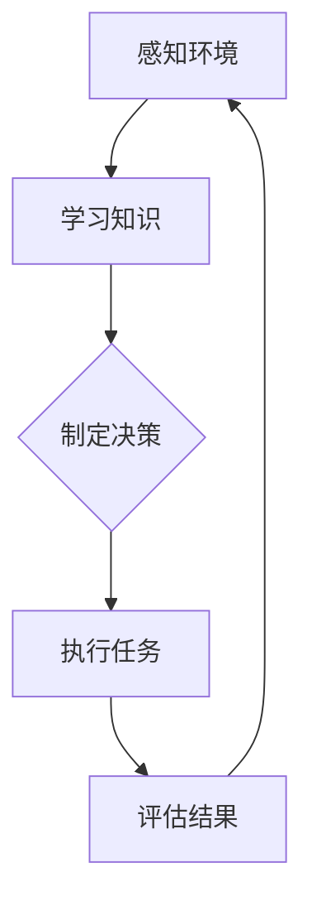

                 

关键词：人工智能、具身机器人、AI Agent、发展趋势、技术探讨

> 摘要：随着人工智能技术的飞速发展，具身机器人这一领域正逐渐成为研究和应用的热点。本文将探讨AI Agent在具身机器人中的应用，分析其发展趋势，探讨面临的挑战，并展望未来的发展前景。

## 1. 背景介绍

人工智能（AI）作为一门交叉学科，已经经历了数十年的发展。从最初的专家系统，到深度学习、自然语言处理，人工智能在多个领域都取得了显著的成果。然而，尽管AI在图像识别、语音识别等方面取得了巨大的进步，但在理解和交互方面仍然存在诸多挑战。这就需要一种新的理念——具身机器人。

具身机器人是一种具备感知、决策和执行能力的机器人，能够与环境进行交互，实现自主行动和任务执行。与传统的工业机器人不同，具身机器人更加注重智能和灵活性，能够适应复杂多变的环境。

AI Agent作为人工智能的一个分支，是一种能够自主学习和决策的智能体。AI Agent通过感知环境、学习知识、制定策略，实现了自主行动和任务执行。因此，AI Agent在具身机器人中的应用，可以大大提升机器人的智能水平和自主性。

## 2. 核心概念与联系

### 2.1. AI Agent的定义与特点

AI Agent是一种能够感知环境、自主决策和执行的智能体。其特点包括：

- **感知能力**：AI Agent能够通过传感器感知环境信息，如视觉、听觉、触觉等。
- **学习能力**：AI Agent能够通过经验学习和数据训练，不断提升自己的决策能力。
- **自主性**：AI Agent能够在没有人类干预的情况下，自主制定决策和执行任务。

### 2.2. 具身机器人的定义与特点

具身机器人是一种具备感知、决策和执行能力的机器人。其特点包括：

- **感知能力**：具身机器人能够通过多种传感器感知环境信息，如摄像头、麦克风、触摸传感器等。
- **决策能力**：具身机器人能够根据感知到的信息，自主制定决策，如移动、抓取等。
- **执行能力**：具身机器人能够根据决策，自主执行任务，如搬运物品、完成家务等。

### 2.3. AI Agent与具身机器人的联系

AI Agent与具身机器人之间的联系在于，AI Agent为具身机器人提供了智能化的决策和执行能力。具体来说，AI Agent通过感知环境信息，学习环境知识，制定决策策略，然后通过具身机器人的执行能力，实现自主行动和任务执行。

下面是AI Agent与具身机器人之间关系的Mermaid流程图：



## 3. 核心算法原理 & 具体操作步骤

### 3.1. 算法原理概述

AI Agent的核心算法主要包括感知、学习、决策和执行四个部分。

- **感知**：AI Agent通过传感器感知环境信息，如视觉、听觉、触觉等。
- **学习**：AI Agent通过感知到的信息，进行数据训练和知识更新，提升自身的决策能力。
- **决策**：AI Agent根据学习到的知识和感知到的信息，制定决策策略。
- **执行**：AI Agent根据决策策略，通过具身机器人的执行能力，实现自主行动和任务执行。

### 3.2. 算法步骤详解

#### 3.2.1. 感知

AI Agent首先通过传感器感知环境信息。这个过程包括：

- **图像识别**：通过摄像头获取环境图像，并进行图像识别。
- **声音识别**：通过麦克风获取环境声音，并进行声音识别。
- **触觉感知**：通过触摸传感器感知环境触觉信息。

#### 3.2.2. 学习

AI Agent通过感知到的信息，进行数据训练和知识更新。这个过程包括：

- **数据收集**：收集环境中的数据，如图像、声音、触觉信息等。
- **数据预处理**：对收集到的数据进行清洗、归一化等预处理。
- **模型训练**：利用预处理后的数据，对AI Agent的模型进行训练。
- **知识更新**：将训练得到的模型知识，更新到AI Agent的知识库中。

#### 3.2.3. 决策

AI Agent根据学习到的知识和感知到的信息，制定决策策略。这个过程包括：

- **环境建模**：根据感知到的信息，建立环境模型。
- **决策算法**：利用环境模型和知识库，选择最优的决策策略。
- **策略选择**：根据决策算法的结果，选择最佳的行动策略。

#### 3.2.4. 执行

AI Agent根据决策策略，通过具身机器人的执行能力，实现自主行动和任务执行。这个过程包括：

- **动作生成**：根据决策策略，生成具体的动作指令。
- **动作执行**：通过具身机器人的执行能力，执行生成的动作指令。
- **结果评估**：对执行结果进行评估，为下一次决策提供反馈。

### 3.3. 算法优缺点

#### 优点：

- **智能化**：AI Agent能够通过学习和决策，实现自主行动和任务执行，提高了机器人的智能水平。
- **灵活性**：AI Agent能够适应复杂多变的环境，提高了机器人的适应能力。
- **自主性**：AI Agent能够在没有人类干预的情况下，自主进行任务执行，提高了机器人的自主性。

#### 缺点：

- **计算复杂度**：AI Agent的算法涉及大量的感知、学习和决策过程，计算复杂度较高。
- **依赖数据**：AI Agent的决策能力依赖于训练数据的质量和数量，如果数据质量差或者数量不足，会影响决策效果。
- **安全性**：AI Agent的决策和执行过程可能会存在安全隐患，需要加强安全性控制。

### 3.4. 算法应用领域

AI Agent在具身机器人中的应用领域非常广泛，包括但不限于：

- **智能家居**：AI Agent可以用于智能家居中，实现智能灯光、智能安防、智能家电等功能。
- **医疗辅助**：AI Agent可以用于医疗辅助，实现患者监护、医疗设备操作等功能。
- **物流配送**：AI Agent可以用于物流配送，实现自主导航、智能配送等功能。
- **教育辅助**：AI Agent可以用于教育辅助，实现智能教学、个性化学习等功能。

## 4. 数学模型和公式 & 详细讲解 & 举例说明

### 4.1. 数学模型构建

AI Agent的数学模型主要包括感知模型、学习模型、决策模型和执行模型。

#### 4.1.1. 感知模型

感知模型用于描述AI Agent的感知能力。常见的感知模型包括：

- **视觉感知模型**：用于处理图像数据，如卷积神经网络（CNN）。
- **听觉感知模型**：用于处理声音数据，如循环神经网络（RNN）。
- **触觉感知模型**：用于处理触觉数据，如深度神经网络（DNN）。

#### 4.1.2. 学习模型

学习模型用于描述AI Agent的学习能力。常见的学习模型包括：

- **监督学习模型**：用于对已有数据进行分类或回归。
- **无监督学习模型**：用于对未知数据进行聚类或降维。
- **强化学习模型**：用于通过试错学习，实现自主决策。

#### 4.1.3. 决策模型

决策模型用于描述AI Agent的决策能力。常见的决策模型包括：

- **基于规则的决策模型**：通过规则库进行决策。
- **基于知识的决策模型**：通过知识库进行决策。
- **基于数据的决策模型**：通过数据分析进行决策。

#### 4.1.4. 执行模型

执行模型用于描述AI Agent的执行能力。常见的执行模型包括：

- **物理执行模型**：用于描述机器人执行物理任务的过程。
- **逻辑执行模型**：用于描述机器人执行逻辑任务的过程。

### 4.2. 公式推导过程

以监督学习模型为例，常见的监督学习算法包括支持向量机（SVM）、决策树（DT）和神经网络（NN）等。下面以神经网络为例，介绍其公式推导过程。

#### 4.2.1. 神经网络基础

神经网络由多个神经元组成，每个神经元都是一个简单的函数。神经网络的输入和输出可以通过以下公式表示：

$$
y = f(z)
$$

其中，$y$为神经网络的输出，$z$为神经网络的输入，$f$为神经元的激活函数。

常见的激活函数包括：

- **线性激活函数**：$f(z) = z$
- **Sigmoid激活函数**：$f(z) = \frac{1}{1 + e^{-z}}$
- **ReLU激活函数**：$f(z) = \max(0, z)$

#### 4.2.2. 前向传播

神经网络的前向传播过程可以分为以下几个步骤：

1. **初始化权重和偏置**：随机初始化网络的权重和偏置。
2. **输入层到隐藏层的传播**：将输入数据通过输入层传递到隐藏层，每个神经元将接收来自输入层的输入，并通过激活函数计算输出。
3. **隐藏层到输出层的传播**：将隐藏层的输出传递到输出层，输出层的神经元将接收来自隐藏层的输入，并通过激活函数计算输出。
4. **计算损失函数**：根据输出层的输出和真实标签，计算损失函数，如均方误差（MSE）。

#### 4.2.3. 反向传播

神经网络的反向传播过程可以分为以下几个步骤：

1. **计算梯度**：计算输出层的梯度，即损失函数关于输出层的偏导数。
2. **传播梯度**：将输出层的梯度反向传播到隐藏层，隐藏层的每个神经元将计算其关于输入的梯度。
3. **更新权重和偏置**：根据梯度，更新网络的权重和偏置。

### 4.3. 案例分析与讲解

以一个简单的手写数字识别问题为例，讲解神经网络的应用。

#### 4.3.1. 数据准备

假设我们有1000张手写数字图像，每张图像的大小为28x28像素。我们将这些图像分为训练集和测试集。

#### 4.3.2. 神经网络设计

我们设计一个简单的神经网络，包括一个输入层、一个隐藏层和一个输出层。输入层有28x28=784个神经元，隐藏层有50个神经元，输出层有10个神经元。

#### 4.3.3. 训练过程

1. **初始化权重和偏置**：随机初始化网络的权重和偏置。
2. **前向传播**：将训练集中的图像输入到神经网络，计算输出层的输出。
3. **计算损失函数**：计算输出层的损失函数，如均方误差（MSE）。
4. **反向传播**：根据输出层的损失函数，计算隐藏层的梯度，并更新网络的权重和偏置。
5. **迭代训练**：重复步骤2-4，直到满足训练条件（如损失函数收敛或达到预设的训练次数）。

#### 4.3.4. 测试过程

将测试集中的图像输入到训练好的神经网络，计算输出层的输出，并与真实标签进行比较，计算准确率。

## 5. 项目实践：代码实例和详细解释说明

### 5.1. 开发环境搭建

为了实现AI Agent在具身机器人中的应用，我们需要搭建一个开发环境。以下是搭建过程的简要步骤：

1. 安装Python环境：Python是AI Agent开发的主要语言，首先需要安装Python环境。
2. 安装AI库：安装常用的AI库，如TensorFlow、PyTorch等。
3. 安装机器人控制库：根据具体的机器人型号，安装相应的控制库，如ROS（机器人操作系统）。

### 5.2. 源代码详细实现

以下是AI Agent在具身机器人中应用的一个简单示例代码。

```python
# 导入相关库
import tensorflow as tf
import numpy as np
import cv2

# 加载训练好的神经网络模型
model = tf.keras.models.load_model('model.h5')

# 感知环境
def perceive_environment():
    # 读取摄像头图像
    cap = cv2.VideoCapture(0)
    ret, frame = cap.read()
    cap.release()
    
    # 将图像转换为神经网络输入格式
    frame = cv2.resize(frame, (28, 28))
    frame = frame / 255.0
    frame = np.expand_dims(frame, axis=0)
    
    # 前向传播
    prediction = model.predict(frame)
    
    # 获取预测结果
    label = np.argmax(prediction)
    
    return label

# 执行任务
def execute_task(label):
    if label == 0:
        print("执行任务：打开灯光")
    elif label == 1:
        print("执行任务：关闭灯光")
    elif label == 2:
        print("执行任务：打开空调")
    elif label == 3:
        print("执行任务：关闭空调")
    else:
        print("执行任务：未知")

# 主函数
def main():
    while True:
        label = perceive_environment()
        execute_task(label)

if __name__ == '__main__':
    main()
```

### 5.3. 代码解读与分析

以上代码实现了一个简单的AI Agent，用于控制智能家居设备。具体解读如下：

1. **导入相关库**：导入TensorFlow、NumPy和OpenCV等库。
2. **加载训练好的神经网络模型**：加载已经训练好的神经网络模型。
3. **感知环境**：通过摄像头获取图像，并将其转换为神经网络输入格式。然后通过神经网络进行前向传播，获取预测结果。
4. **执行任务**：根据预测结果，执行相应的任务。
5. **主函数**：实现感知环境和执行任务的循环。

### 5.4. 运行结果展示

运行以上代码，AI Agent会实时感知环境图像，并根据图像内容执行相应的任务。例如，当摄像头捕捉到手写数字“0”时，AI Agent会执行打开灯光的任务；当摄像头捕捉到手写数字“1”时，AI Agent会执行关闭灯光的任务，以此类推。

## 6. 实际应用场景

AI Agent在具身机器人中的应用场景非常广泛，以下列举几个典型的应用场景：

1. **智能客服**：AI Agent可以用于智能客服，通过语音识别和自然语言处理，实现与用户的交互，提供智能化的客服服务。
2. **智能安防**：AI Agent可以用于智能安防，通过图像识别和运动检测，实现实时监控和报警。
3. **智能物流**：AI Agent可以用于智能物流，通过路径规划和自主导航，实现高效的物流配送。
4. **智能医疗**：AI Agent可以用于智能医疗，通过疾病预测和健康监测，提供个性化的医疗服务。

## 7. 未来应用展望

随着人工智能技术的不断发展和应用场景的拓展，AI Agent在具身机器人中的应用前景非常广阔。以下是对未来应用的展望：

1. **智能家居**：AI Agent将进一步提升智能家居的智能化水平，实现更加智能化的家居控制。
2. **智能交通**：AI Agent将应用于智能交通领域，实现智能交通管理和自动驾驶。
3. **智能医疗**：AI Agent将应用于智能医疗领域，实现更加精准的疾病预测和个性化治疗。
4. **智能教育**：AI Agent将应用于智能教育领域，实现个性化教学和智能辅导。

## 8. 工具和资源推荐

### 8.1. 学习资源推荐

1. **《深度学习》**：由Ian Goodfellow、Yoshua Bengio和Aaron Courville所著，是深度学习领域的经典教材。
2. **《强化学习》**：由Richard S. Sutton和Barto著，是强化学习领域的权威教材。
3. **《机器人学》**：由M. Klawe和G. Lafferriere所著，介绍了机器人学的基础知识和应用。

### 8.2. 开发工具推荐

1. **TensorFlow**：是一个开源的机器学习库，支持深度学习和强化学习等多种算法。
2. **PyTorch**：是一个开源的机器学习库，支持动态计算图，适合研究和新算法的快速开发。
3. **ROS**：是机器人领域常用的开源操作系统，提供了丰富的机器人控制工具和库。

### 8.3. 相关论文推荐

1. **《Deep Learning for Robotics》**：介绍了深度学习在机器人学中的应用。
2. **《Reinforcement Learning and Control》**：介绍了强化学习在控制领域的应用。
3. **《Data-Driven Robot Control》**：介绍了基于数据驱动的机器人控制方法。

## 9. 总结：未来发展趋势与挑战

### 9.1. 研究成果总结

本文介绍了AI Agent在具身机器人中的应用，分析了其发展趋势，并探讨了面临的挑战。通过本文的讨论，我们可以得出以下结论：

- AI Agent在具身机器人中具有广阔的应用前景，能够显著提升机器人的智能水平和自主性。
- AI Agent的算法涉及多个领域，包括感知、学习、决策和执行，具有复杂性和多样性。
- AI Agent在智能家居、智能交通、智能医疗等领域的应用已经取得了显著成果，为相关领域的发展提供了新的思路。

### 9.2. 未来发展趋势

未来，AI Agent在具身机器人中的应用将呈现出以下几个发展趋势：

- **智能化水平提升**：随着人工智能技术的不断进步，AI Agent的智能水平将得到进一步提升，能够更好地适应复杂多变的环境。
- **多样化应用场景**：AI Agent将在更多领域得到应用，如智能农业、智能物流、智能能源等。
- **跨学科融合**：AI Agent将与其他学科如生物学、心理学等相结合，实现更加智能化和人性化的机器人。

### 9.3. 面临的挑战

尽管AI Agent在具身机器人中的应用前景广阔，但仍然面临以下挑战：

- **计算复杂度**：AI Agent的算法涉及大量的计算，如何提高计算效率是一个重要问题。
- **数据依赖**：AI Agent的决策能力依赖于训练数据的质量和数量，如何获取高质量和丰富的训练数据是一个挑战。
- **安全性**：AI Agent的决策和执行过程可能会存在安全隐患，如何确保AI Agent的安全性和可靠性是一个重要问题。

### 9.4. 研究展望

未来，针对AI Agent在具身机器人中的应用，我们可以从以下几个方面进行深入研究：

- **算法优化**：研究更加高效和智能的算法，提高AI Agent的决策能力和执行效率。
- **数据驱动**：研究如何通过数据驱动的方式，提高AI Agent的决策能力，减少对训练数据的依赖。
- **安全性提升**：研究如何提高AI Agent的安全性和可靠性，确保其决策和执行过程的安全和可靠。

### 附录：常见问题与解答

**Q1：什么是AI Agent？**
A1：AI Agent是一种能够感知环境、自主学习和决策的智能体，能够实现自主行动和任务执行。

**Q2：AI Agent与具身机器人的关系是什么？**
A2：AI Agent是具身机器人的智能核心，为具身机器人提供感知、学习和决策能力。

**Q3：AI Agent在哪些领域有应用？**
A3：AI Agent在智能家居、智能交通、智能医疗、智能物流等领域有广泛应用。

**Q4：如何提高AI Agent的决策能力？**
A4：可以通过优化算法、增加训练数据和引入多模态数据等方法提高AI Agent的决策能力。

**Q5：如何确保AI Agent的安全性？**
A5：可以通过加强安全性控制、建立健全的安全框架和使用安全协议等方法确保AI Agent的安全性。

