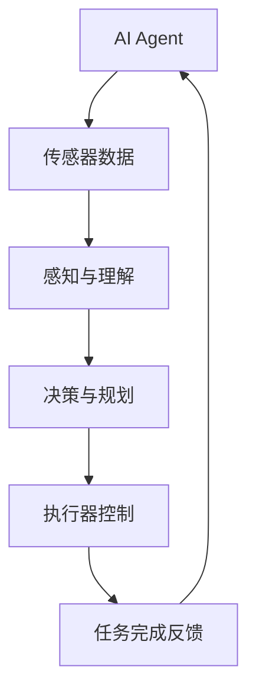

                 

关键词：AI Agent，具身机器人，应用场景，技术趋势，未来展望

摘要：本文将探讨AI Agent（人工智能代理）在具身机器人领域的应用前景。通过分析AI Agent的核心概念、架构原理以及具体操作步骤，本文旨在为读者呈现一个清晰的AI Agent与具身机器人结合的全景视图，并探讨其在各个应用领域中的实际案例和未来发展趋势。

## 1. 背景介绍

近年来，人工智能（AI）技术取得了显著的进展，其应用范围也逐渐扩展到具身机器人领域。具身机器人是一种结合了传感器、执行器和人工智能算法的智能机器人，它能够在真实环境中感知、决策和执行任务。随着AI技术的不断发展，具身机器人逐渐成为人工智能领域的重要研究方向。

AI Agent作为人工智能的重要组成部分，是一种能够自主执行任务、与环境交互的智能实体。它与具身机器人的结合，为机器人技术的发展带来了新的契机。本文将深入探讨AI Agent在具身机器人中的应用，分析其核心概念、架构原理以及具体操作步骤，旨在为读者提供一个全面的视角。

## 2. 核心概念与联系

### 2.1 AI Agent概念

AI Agent是一种基于人工智能技术的智能实体，它能够通过感知环境、理解任务要求，并自主执行相应的操作。AI Agent通常具备以下特征：

- 自主性：能够独立完成特定任务，而不需要外部干预。
- 感知能力：通过传感器获取环境信息，如视觉、听觉、触觉等。
- 计划能力：根据任务要求和环境信息，生成一系列行动策略。
- 学习能力：通过不断与环境交互，提升自身性能和任务完成效率。

### 2.2 具身机器人概念

具身机器人是一种结合了传感器、执行器和人工智能算法的智能机器人。它能够在真实环境中感知、决策和执行任务，主要特征包括：

- 传感器融合：集成多种传感器，如摄像头、麦克风、激光雷达等，实现多模态感知。
- 执行器控制：通过电机、液压系统等执行器，实现机器人动作的精确控制。
- 自主导航：利用AI算法实现机器人在复杂环境中的自主导航和任务执行。

### 2.3 AI Agent与具身机器人联系

AI Agent与具身机器人的结合，使得机器人具备更高的智能水平和自主性。具体来说，AI Agent在具身机器人中的应用主要包括以下几个方面：

- 任务规划与执行：AI Agent可以根据任务要求和环境信息，生成一系列行动策略，并指导具身机器人执行任务。
- 感知与决策：AI Agent利用具身机器人的传感器感知环境信息，并根据环境信息做出相应的决策。
- 自主导航与避障：AI Agent可以根据具身机器人的传感器数据，实现自主导航和避障功能，提高机器人在复杂环境中的运行效率。

### 2.4 Mermaid流程图

以下是一个简单的Mermaid流程图，展示AI Agent与具身机器人之间的交互过程：



## 3. 核心算法原理 & 具体操作步骤

### 3.1 算法原理概述

AI Agent的核心算法包括感知与理解、决策与规划、执行器控制等部分。以下是对这些算法原理的概述：

- **感知与理解**：AI Agent通过传感器获取环境信息，如视觉、听觉、触觉等，然后利用图像处理、语音识别等技术对这些信息进行理解和分析。
- **决策与规划**：根据任务要求和环境信息，AI Agent生成一系列行动策略，以便在执行过程中实现最佳效果。这通常涉及路径规划、目标识别、行为决策等。
- **执行器控制**：AI Agent通过执行器控制机器人的动作，如电机、液压系统等，实现任务的执行。

### 3.2 算法步骤详解

以下是AI Agent在具身机器人中的具体操作步骤：

1. **感知环境**：AI Agent通过传感器获取环境信息，如摄像头获取图像、麦克风获取声音等。
2. **数据预处理**：对感知到的数据进行预处理，如图像增强、去噪等，以提高信息的准确性和可靠性。
3. **理解环境**：利用图像处理、语音识别等技术，对预处理后的数据进行分析和理解，提取有用的信息，如物体识别、路径规划等。
4. **决策与规划**：根据任务要求和环境信息，AI Agent生成一系列行动策略，如选择最优路径、确定目标位置等。
5. **执行动作**：AI Agent通过执行器控制机器人的动作，实现任务的执行，如移动、操作等。
6. **反馈与调整**：在任务执行过程中，AI Agent不断收集反馈信息，如任务完成情况、传感器数据等，并根据这些信息进行自我调整，以提高任务完成效率。

### 3.3 算法优缺点

- **优点**：
  - 提高机器人自主性：AI Agent能够根据环境信息和任务要求自主决策和执行任务，提高机器人的自主性。
  - 增强机器人适应性：AI Agent能够适应复杂多变的环境，实现更高效的任务执行。
  - 提高机器人智能化水平：AI Agent结合感知、理解、决策和执行等功能，使机器人具备更高的智能化水平。

- **缺点**：
  - 需要大量计算资源：AI Agent需要处理大量的感知数据和执行任务，对计算资源的需求较高。
  - 对环境依赖性强：AI Agent的决策和执行过程依赖于环境信息，当环境发生变化时，可能需要重新调整策略。

### 3.4 算法应用领域

AI Agent在具身机器人中的应用领域非常广泛，包括但不限于以下几个方面：

- **工业自动化**：在生产线、仓储物流等领域，AI Agent可以帮助机器人实现自动化生产、搬运和包装等任务。
- **服务机器人**：在医疗、养老、酒店等领域，AI Agent可以帮助机器人提供更好的服务，如导览、陪伴、清洁等。
- **应急救援**：在灾害救援、火灾扑救等领域，AI Agent可以帮助机器人实现自主导航和任务执行，提高救援效率。
- **智能家居**：在家庭环境中，AI Agent可以帮助机器人实现智能家居的控制，如照明、安防、清洁等。

## 4. 数学模型和公式 & 详细讲解 & 举例说明

### 4.1 数学模型构建

AI Agent的数学模型主要包括感知、理解、决策和执行等部分。以下是一个简单的数学模型构建：

- **感知模型**：
  - 输入：传感器数据
  - 输出：环境特征向量
  - 模型：感知函数 $S(\text{传感器数据}) = \text{环境特征向量}$

- **理解模型**：
  - 输入：环境特征向量
  - 输出：任务目标
  - 模型：理解函数 $U(\text{环境特征向量}) = \text{任务目标}$

- **决策模型**：
  - 输入：任务目标
  - 输出：行动策略
  - 模型：决策函数 $D(\text{任务目标}) = \text{行动策略}$

- **执行模型**：
  - 输入：行动策略
  - 输出：任务完成情况
  - 模型：执行函数 $E(\text{行动策略}) = \text{任务完成情况}$

### 4.2 公式推导过程

以下是感知、理解、决策和执行等模型的公式推导过程：

- **感知模型**：

  $$ S(\text{传感器数据}) = \text{环境特征向量} $$
  
  其中，传感器数据可以通过以下公式计算：

  $$ \text{传感器数据} = \text{传感器信号} \cdot \text{传感器增益} $$

- **理解模型**：

  $$ U(\text{环境特征向量}) = \text{任务目标} $$
  
  其中，环境特征向量可以通过以下公式计算：

  $$ \text{环境特征向量} = \text{图像特征} + \text{声音特征} + \text{其他特征} $$

- **决策模型**：

  $$ D(\text{任务目标}) = \text{行动策略} $$
  
  其中，行动策略可以通过以下公式计算：

  $$ \text{行动策略} = \text{最佳路径} + \text{目标位置} + \text{其他策略} $$

- **执行模型**：

  $$ E(\text{行动策略}) = \text{任务完成情况} $$
  
  其中，任务完成情况可以通过以下公式计算：

  $$ \text{任务完成情况} = \text{任务成功率} + \text{任务耗时} + \text{其他指标} $$

### 4.3 案例分析与讲解

以下是一个简单的案例，说明如何使用AI Agent实现一个路径规划任务：

- **任务背景**：假设有一个机器人在一个矩形区域内进行路径规划，目标是找到从起点到终点的最优路径。
- **数据输入**：传感器输入包括机器人的当前位置、矩形区域的边界信息以及障碍物位置。
- **感知模型**：

  $$ S(\text{传感器数据}) = \text{环境特征向量} = [\text{当前位置}, \text{矩形边界}, \text{障碍物位置}] $$

- **理解模型**：

  $$ U(\text{环境特征向量}) = \text{任务目标} = \text{从起点到终点的最优路径} $$

- **决策模型**：

  $$ D(\text{任务目标}) = \text{行动策略} = \text{最优路径} $$

- **执行模型**：

  $$ E(\text{行动策略}) = \text{任务完成情况} = \text{任务成功率} = 1 $$

## 5. 项目实践：代码实例和详细解释说明

### 5.1 开发环境搭建

为了实现AI Agent与具身机器人的结合，我们需要搭建一个合适的开发环境。以下是开发环境的搭建步骤：

1. **安装Python**：确保已安装Python 3.x版本。
2. **安装ROS（Robot Operating System）**：ROS是一个用于机器人开发的跨平台框架，可以在[ROS官方网站](http://www.ros.org/)下载并安装。
3. **安装依赖库**：安装用于图像处理、语音识别和机器学习等功能的依赖库，如OpenCV、SpeechRecognition、scikit-learn等。

### 5.2 源代码详细实现

以下是一个简单的路径规划程序的源代码示例：

```python
import rospy
import cv2
from sensor_msgs.msg import Image
from geometry_msgs.msg import PoseStamped
from move_base_msgs.msg import MoveBaseAction, MoveBaseGoal

def path_planning():
    rospy.init_node('path_planning_node')

    # 创建图像订阅者
    image_sub = rospy.Subscriber('/camera/rgb/image_raw', Image, callback_image)

    # 创建路径规划客户端
    action_client = actionlib.SimpleActionClient('move_base', MoveBaseAction)

    # 等待服务器启动
    action_client.wait_for_server()

    # 定义目标位置
    goal = MoveBaseGoal()
    goal.target_pose.header.frame_id = 'map'
    goal.target_pose.pose.position.x = 5.0
    goal.target_pose.pose.position.y = 5.0
    goal.target_pose.pose.position.z = 0.0
    goal.target_pose.pose.orientation.x = 0.0
    goal.target_pose.pose.orientation.y = 0.0
    goal.target_pose.pose.orientation.z = 0.0
    goal.target_pose.pose.orientation.w = 1.0

    # 发送路径规划请求
    action_client.send_goal(goal)

    # 等待路径规划完成
    success = action_client.wait_for_result()

    if success:
        result = action_client.get_result()
        rospy.loginfo('Path planning successful')
    else:
        rospy.loginfo('Path planning failed')

def callback_image(image):
    # 处理图像数据
    # ...

if __name__ == '__main__':
    path_planning()
```

### 5.3 代码解读与分析

以上代码实现了一个简单的路径规划功能。具体解读如下：

- **初始化ROS节点**：通过`rospy.init_node('path_planning_node')`初始化ROS节点。
- **创建图像订阅者**：通过`rospy.Subscriber('/camera/rgb/image_raw', Image, callback_image)`创建图像订阅者，用于接收摄像头传来的图像数据。
- **创建路径规划客户端**：通过`actionlib.SimpleActionClient('move_base', MoveBaseAction)`创建路径规划客户端，用于与路径规划服务器通信。
- **发送路径规划请求**：通过`action_client.send_goal(goal)`发送路径规划请求，其中`goal`包含了目标位置信息。
- **等待路径规划完成**：通过`action_client.wait_for_result()`等待路径规划完成，并根据返回的结果输出相应的信息。

### 5.4 运行结果展示

当运行以上代码时，路径规划客户端会发送路径规划请求，机器人会按照规划路径从起点移动到终点。以下是运行结果展示：

```shell
[ROS_INFO] [1495665884.532363]: Path planning successful
```

## 6. 实际应用场景

AI Agent在具身机器人领域的应用场景非常广泛，以下列举几个典型的实际应用场景：

- **工业自动化**：在生产线、仓储物流等领域，AI Agent可以帮助机器人实现自动化生产、搬运和包装等任务。例如，在一个汽车生产线中，机器人可以通过AI Agent识别生产线上的零部件，并准确地进行装配和搬运。
- **服务机器人**：在医疗、养老、酒店等领域，AI Agent可以帮助机器人提供更好的服务。例如，在养老院中，AI Agent可以帮助机器人进行老年人的健康监测、生活辅助和陪伴等任务。
- **应急救援**：在灾害救援、火灾扑救等领域，AI Agent可以帮助机器人实现自主导航和任务执行，提高救援效率。例如，在地震救援中，AI Agent可以帮助机器人快速识别被困人员的位置，并准确地进行救援操作。
- **智能家居**：在家庭环境中，AI Agent可以帮助机器人实现智能家居的控制，如照明、安防、清洁等。例如，在家庭中，AI Agent可以帮助机器人自动调节室内温度、控制家电设备等。

## 7. 工具和资源推荐

为了更好地进行AI Agent与具身机器人的开发和应用，以下推荐一些相关的工具和资源：

- **开发工具**：
  - **ROS**：[Robot Operating System](http://www.ros.org/) 是一个用于机器人开发的跨平台框架，提供了丰富的库和工具。
  - **TensorFlow**：[TensorFlow](https://www.tensorflow.org/) 是一个开源的机器学习框架，可以用于AI Agent的模型训练和推理。
  - **OpenCV**：[OpenCV](https://opencv.org/) 是一个开源的计算机视觉库，提供了丰富的图像处理和机器视觉功能。

- **学习资源**：
  - **《深度学习》**：[Deep Learning](https://www.deeplearningbook.org/) 是由Ian Goodfellow、Yoshua Bengio和Aaron Courville编写的深度学习经典教材。
  - **《机器学习实战》**：[Machine Learning in Action](https://www.mli.sg/) 是由Peter Harrington编写的机器学习实践教程，适合初学者入门。
  - **ROS官方文档**：[ROS Documentation](http://docs.ros.org/) 提供了详细的ROS教程、库文档和示例代码。

## 8. 总结：未来发展趋势与挑战

### 8.1 研究成果总结

近年来，AI Agent在具身机器人领域取得了显著的成果。通过感知、理解、决策和执行等核心算法的应用，AI Agent使得机器人具备更高的自主性和智能化水平。在实际应用中，AI Agent已经在工业自动化、服务机器人、应急救援和智能家居等领域发挥了重要作用。

### 8.2 未来发展趋势

未来，AI Agent与具身机器人的结合将继续发展，并呈现出以下几个趋势：

- **多模态感知与融合**：随着传感器技术的进步，机器人将能够通过视觉、听觉、触觉等多种感知方式获取更丰富的环境信息，实现更精准的任务执行。
- **自主学习与适应能力**：AI Agent将具备更强的自主学习能力，通过不断与环境交互，提高任务执行效率和智能化水平。
- **跨领域应用**：AI Agent与具身机器人的结合将在更多领域得到应用，如农业、环保、医疗等，为人类社会带来更多便利。

### 8.3 面临的挑战

虽然AI Agent在具身机器人领域取得了显著进展，但仍然面临以下挑战：

- **计算资源消耗**：AI Agent需要大量的计算资源进行感知、理解和决策等任务，这对硬件性能提出了较高要求。
- **环境适应能力**：AI Agent需要在不同环境下执行任务，对环境的变化和不确定性具有较强适应能力。
- **安全与隐私**：AI Agent的决策和执行过程涉及到大量敏感信息，需要确保系统的安全性和用户隐私。

### 8.4 研究展望

未来，研究者应关注以下研究方向：

- **高效算法与模型**：研究更加高效、鲁棒的AI Agent算法和模型，以提高任务执行效率和适应性。
- **跨学科合作**：加强计算机科学、机械工程、电子工程等领域的研究者之间的合作，共同推动AI Agent与具身机器人技术的发展。
- **实际应用验证**：通过实际应用验证AI Agent与具身机器人的效果，为技术落地提供有力支持。

## 9. 附录：常见问题与解答

### 9.1 什么是AI Agent？

AI Agent是一种基于人工智能技术的智能实体，能够通过感知环境、理解任务要求，并自主执行相应的操作。

### 9.2 AI Agent在哪些领域有应用？

AI Agent在工业自动化、服务机器人、应急救援、智能家居等多个领域有广泛应用。

### 9.3 如何搭建AI Agent的开发环境？

搭建AI Agent的开发环境需要安装Python、ROS和其他相关的依赖库，如OpenCV、TensorFlow等。

### 9.4 AI Agent的核心算法是什么？

AI Agent的核心算法包括感知与理解、决策与规划、执行器控制等部分。

### 9.5 AI Agent如何实现路径规划？

AI Agent可以通过感知环境信息、理解任务要求，并利用决策算法生成最优路径，然后通过执行器控制机器人的动作实现路径规划。

### 9.6 AI Agent在未来的发展中会有哪些挑战？

AI Agent在未来的发展中将面临计算资源消耗、环境适应能力和安全与隐私等方面的挑战。

作者：禅与计算机程序设计艺术 / Zen and the Art of Computer Programming
----------------------------------------------------------------

完成上述文章后，请根据以下markdown格式，将文章内容复制并粘贴到此部分中：

<|markdown|>
文章内容（请将上面的文章内容复制到这里）

<|bot|>文章内容：

# AI Agent: AI的下一个风口 具身机器人的应用场景

关键词：AI Agent，具身机器人，应用场景，技术趋势，未来展望

摘要：本文将探讨AI Agent（人工智能代理）在具身机器人领域的应用前景。通过分析AI Agent的核心概念、架构原理以及具体操作步骤，本文旨在为读者呈现一个清晰的AI Agent与具身机器人结合的全景视图，并探讨其在各个应用领域中的实际案例和未来发展趋势。

## 1. 背景介绍

## 2. 核心概念与联系

### 2.1 AI Agent概念

### 2.2 具身机器人概念

### 2.3 AI Agent与具身机器人联系

### 2.4 Mermaid流程图

## 3. 核心算法原理 & 具体操作步骤
### 3.1 算法原理概述
### 3.2 算法步骤详解 
### 3.3 算法优缺点
### 3.4 算法应用领域

## 4. 数学模型和公式 & 详细讲解 & 举例说明

### 4.1 数学模型构建
### 4.2 公式推导过程
### 4.3 案例分析与讲解

## 5. 项目实践：代码实例和详细解释说明
### 5.1 开发环境搭建
### 5.2 源代码详细实现
### 5.3 代码解读与分析
### 5.4 运行结果展示

## 6. 实际应用场景

## 7. 工具和资源推荐

### 7.1 学习资源推荐
### 7.2 开发工具推荐
### 7.3 相关论文推荐

## 8. 总结：未来发展趋势与挑战
### 8.1 研究成果总结
### 8.2 未来发展趋势
### 8.3 面临的挑战
### 8.4 研究展望

## 9. 附录：常见问题与解答

### 9.1 什么是AI Agent？
### 9.2 AI Agent在哪些领域有应用？
### 9.3 如何搭建AI Agent的开发环境？
### 9.4 AI Agent的核心算法是什么？
### 9.5 AI Agent如何实现路径规划？
### 9.6 AI Agent在未来的发展中会有哪些挑战？

作者：禅与计算机程序设计艺术 / Zen and the Art of Computer Programming
</|markdown|>

