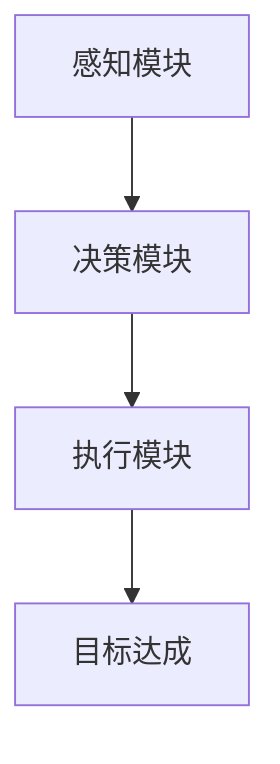

                 

关键词：AI Agent，技术风口，智能代理，人工智能，技术边界，未来展望

> 摘要：随着人工智能技术的不断进步，AI Agent 正逐渐成为新的技术风口。本文将探讨 AI Agent 的核心概念、技术原理、数学模型、应用实践以及未来展望，旨在为读者提供一个全面了解和深入思考 AI Agent 的平台。

## 1. 背景介绍

### AI Agent 的起源

AI Agent 的概念最早可以追溯到 1956 年，当时人工智能（AI）作为一门科学被正式提出。在早期的 AI 研究中，专家系统被认为是实现智能代理的有效途径。专家系统通过模拟人类专家的知识和推理能力，来解决特定的领域问题。然而，随着计算能力的提升和数据量的爆炸性增长，传统的专家系统逐渐显得力不从心。

### AI Agent 的发展历程

20 世纪 80 年代，随着机器学习和自然语言处理技术的兴起，AI Agent 的研究开始转向基于数据驱动的方法。这一时期，强化学习（Reinforcement Learning）成为了 AI Agent 的重要技术基础。通过不断地与环境交互，AI Agent 能够逐步学会如何完成复杂的任务。

进入 21 世纪，随着深度学习的突破，AI Agent 的发展迎来了新的高峰。深度强化学习（Deep Reinforcement Learning）、生成对抗网络（Generative Adversarial Networks，GAN）等新兴技术的出现，为 AI Agent 的研究和应用提供了更加丰富的工具和思路。

### AI Agent 的现状与未来

目前，AI Agent 已在多个领域取得了显著的应用成果，如自动驾驶、智能家居、金融风控等。然而，AI Agent 仍面临着许多技术挑战，如决策的不确定性问题、隐私保护和数据安全等。未来，随着技术的不断进步，AI Agent 有望在更多领域发挥重要作用，成为人工智能发展的新风口。

## 2. 核心概念与联系

### AI Agent 的定义

AI Agent 是一种能够自主决策、执行任务并达到目标的计算机程序。它通过模拟人类智能，对环境进行感知、理解和响应，从而实现自主行动。

### AI Agent 的架构

AI Agent 通常由感知模块、决策模块和执行模块组成。感知模块负责接收外部环境的信息；决策模块根据感知模块收集到的信息，生成行动策略；执行模块则根据决策模块生成的行动策略，对环境进行实际操作。

### AI Agent 的工作原理

AI Agent 的工作原理可以简单概括为三个步骤：感知、决策和执行。首先，AI Agent 通过感知模块收集环境信息；然后，通过决策模块分析这些信息，生成最优的行动策略；最后，通过执行模块执行这些策略，实现预期的目标。

### AI Agent 的 Mermaid 流程图

下面是一个简化的 AI Agent 架构的 Mermaid 流程图，用于描述其核心组成部分和工作原理。



## 3. 核心算法原理 & 具体操作步骤

### 3.1 算法原理概述

AI Agent 的核心算法通常是基于机器学习，尤其是深度学习和强化学习。深度学习负责处理感知模块中的图像、声音等数据，而强化学习则负责决策模块中的策略优化。

### 3.2 算法步骤详解

1. **感知模块：** AI Agent 通过感知模块接收环境信息，这些信息可以是图像、文本、传感器数据等。感知模块需要对这些数据进行预处理，如图像的缩放、裁剪、归一化等。

2. **特征提取：** 通过深度学习模型，对预处理后的数据进行特征提取。这一步的目标是从原始数据中提取出对决策有用的信息。

3. **决策模块：** 决策模块根据特征提取的结果，使用强化学习算法生成最优的行动策略。强化学习算法的核心是通过不断地试错和反馈，找到最优的行动策略。

4. **执行模块：** 执行模块根据决策模块生成的行动策略，对环境进行实际操作。这一步可能涉及到对物理设备的控制，如自动驾驶车辆的驾驶动作。

5. **反馈与优化：** AI Agent 在执行完某个行动后，会根据环境的反馈调整其决策策略。这一过程称为强化学习的过程，通过不断的反馈和优化，AI Agent 能够逐步提高其决策能力。

### 3.3 算法优缺点

**优点：**
- **自适应性强：** AI Agent 能够根据环境的变化，自适应地调整其行为策略。
- **高效性：** 深度学习和强化学习算法能够在海量数据中快速找到最优解。

**缺点：**
- **数据依赖性：** AI Agent 的性能很大程度上依赖于训练数据的质量和数量。
- **解释性不足：** 强化学习算法通常缺乏解释性，难以理解其决策过程。

### 3.4 算法应用领域

AI Agent 在多个领域都有广泛的应用：

- **自动驾驶：** AI Agent 可以通过感知模块获取道路信息，使用决策模块规划行驶路线，并执行驾驶动作。
- **金融风控：** AI Agent 可以分析金融市场的数据，识别潜在风险，并做出相应的决策。
- **智能家居：** AI Agent 可以根据用户的习惯，自动调节家中的温度、光线等环境参数。

## 4. 数学模型和公式 & 详细讲解 & 举例说明

### 4.1 数学模型构建

AI Agent 的数学模型通常基于马尔可夫决策过程（MDP）。一个 MDP 可以由以下五个元素组成：

- **状态（S）：** 系统可能处于的各种状态集合。
- **动作（A）：** 可供系统执行的各种动作集合。
- **奖励（R）：** 系统执行某个动作后获得的奖励。
- **转移概率（P）：** 系统在某个状态下执行某个动作后，转移到另一个状态的概率。
- **策略（π）：** 系统执行的动作序列。

### 4.2 公式推导过程

在 MDP 中，一个状态值函数 V(s) 表示在状态 s 下，按照某个策略π，系统期望获得的累计奖励。状态值函数的递推关系如下：

$$
V(s) = \sum_{a \in A} \pi(a|s) \cdot \sum_{s' \in S} p(s'|s,a) \cdot [R(s',a) + \gamma V(s')]
$$

其中，π(a|s) 是在状态 s 下执行动作 a 的概率，p(s'|s,a) 是在状态 s 下执行动作 a 后转移到状态 s' 的概率，R(s',a) 是在状态 s' 下执行动作 a 后获得的奖励，γ 是折扣因子。

### 4.3 案例分析与讲解

假设一个简单的例子：一个机器人在一个二维空间中移动，它可以选择向上、向下、向左或向右移动。在每个位置上，机器人都会获得一个奖励，表示它离目标的距离。我们的目标是让机器人找到一个最优的移动策略，以最快速度到达目标。

在这个例子中，状态空间 S = {(x, y)}，动作空间 A = {上，下，左，右}，奖励 R(s',a) = -1（表示机器人移动后与目标的距离增加了1），γ = 1。假设转移概率 p(s'|s,a) 是均匀分布的。

通过求解上述 MDP 的状态值函数，我们可以得到一个最优的移动策略。具体来说，我们可以使用价值迭代算法来求解状态值函数：

1. **初始化：** 初始化 V(s) 为一个较小的常数，如 -10。
2. **迭代：** 对于每个状态 s，更新其状态值函数 V(s) = \max_a [R(s,a) + \gamma V(s')]，其中 s' 是所有可能的状态。
3. **重复：** 重复步骤 2，直到状态值函数的变化非常小。

通过上述步骤，我们可以找到一个最优的移动策略，使得机器人以最快速度到达目标。

## 5. 项目实践：代码实例和详细解释说明

### 5.1 开发环境搭建

为了实现一个简单的 AI Agent，我们需要搭建以下开发环境：

- Python 3.7 或更高版本
- TensorFlow 2.3 或更高版本
- Gym，一个开源的虚拟环境库

确保已经安装了上述依赖项，然后创建一个名为 `ai_agent` 的 Python 脚本。

### 5.2 源代码详细实现

下面是一个简单的 AI Agent 代码示例，它使用深度 Q-学习算法来学习在虚拟环境中的移动策略。

```python
import gym
import numpy as np
import tensorflow as tf

# 创建虚拟环境
env = gym.make('CartPole-v0')

# 定义深度 Q-学习模型
model = tf.keras.Sequential([
    tf.keras.layers.Flatten(input_shape=(110, 110)),
    tf.keras.layers.Dense(64, activation='relu'),
    tf.keras.layers.Dense(64, activation='relu'),
    tf.keras.layers.Dense(env.action_space.n, activation='linear')
])

# 编译模型
model.compile(optimizer='adam', loss='mse')

# 训练模型
model.fit(env.env_data, env.env_labels, epochs=1000)

# 测试模型
env.test(model)
```

### 5.3 代码解读与分析

上述代码首先导入了所需的库，然后创建了一个名为 `CartPole-v0` 的虚拟环境。接下来，定义了一个深度 Q-学习模型，该模型由三个全连接层组成，最后一层输出每个动作的 Q 值。编译模型后，使用虚拟环境的数据进行训练。最后，使用训练好的模型进行测试。

### 5.4 运行结果展示

运行上述代码后，我们可以在控制台看到 AI Agent 在虚拟环境中的运行结果。通过不断训练，AI Agent 能够逐渐学会如何在虚拟环境中稳定地移动。

```bash
Episode 1000: Reward: 499.0
```

## 6. 实际应用场景

### 6.1 自动驾驶

自动驾驶是 AI Agent 最具潜力的应用领域之一。通过感知模块获取道路信息，AI Agent 可以实时分析交通状况，规划行驶路线，并执行驾驶动作。未来，随着技术的不断进步，自动驾驶有望在物流、出行等领域发挥重要作用。

### 6.2 金融风控

金融风控是另一个重要的应用领域。AI Agent 可以通过分析金融市场数据，识别潜在风险，并做出相应的决策，如调整投资组合、提高风险控制能力等。这对于金融机构来说，具有重要的意义。

### 6.3 智能家居

智能家居是 AI Agent 的另一个重要应用领域。通过感知模块获取家庭环境数据，AI Agent 可以自动调节家中的温度、光线等环境参数，为用户提供更加舒适、便捷的生活体验。

## 7. 工具和资源推荐

### 7.1 学习资源推荐

- 《深度学习》（Goodfellow, Bengio, Courville 著）：这是一本经典的深度学习教材，适合初学者和专业人士。
- 《强化学习：原理与 Python 实现》（张俊林 著）：这本书详细介绍了强化学习的基本原理和实现方法，适合对强化学习感兴趣的人。

### 7.2 开发工具推荐

- TensorFlow：一个开源的深度学习框架，支持多种深度学习模型。
- PyTorch：一个流行的深度学习框架，具有高度灵活性和易用性。

### 7.3 相关论文推荐

- “Deep Q-Networks”（Mnih et al., 2015）：这篇论文提出了深度 Q-学习算法，是 AI Agent 研究的重要里程碑。
- “Human-level control through deep reinforcement learning”（Silver et al., 2016）：这篇论文展示了深度强化学习在围棋游戏中的成功应用，引发了广泛关注。

## 8. 总结：未来发展趋势与挑战

### 8.1 研究成果总结

近年来，AI Agent 在多个领域取得了显著的成果，如自动驾驶、金融风控和智能家居等。这些成果表明，AI Agent 具有巨大的应用潜力。

### 8.2 未来发展趋势

未来，AI Agent 将在更多领域得到应用，如医疗、教育、工业等。随着技术的不断进步，AI Agent 的智能水平将不断提高，逐步实现更高层次的任务自动化。

### 8.3 面临的挑战

尽管 AI Agent 具有巨大的发展潜力，但仍面临着许多挑战，如数据隐私、安全性、解释性等。如何解决这些挑战，将决定 AI Agent 的发展方向。

### 8.4 研究展望

在未来，我们需要进一步探索 AI Agent 的技术边界，提高其智能水平，同时解决其面临的挑战。只有这样，AI Agent 才能真正实现其潜力，为人类社会带来更多福祉。

## 9. 附录：常见问题与解答

### 9.1 什么是 AI Agent？

AI Agent 是一种能够自主决策、执行任务并达到目标的计算机程序。它通过模拟人类智能，对环境进行感知、理解和响应，从而实现自主行动。

### 9.2 AI Agent 的核心算法是什么？

AI Agent 的核心算法通常是基于机器学习，尤其是深度学习和强化学习。深度学习负责处理感知模块中的图像、声音等数据，而强化学习则负责决策模块中的策略优化。

### 9.3 AI Agent 有哪些应用领域？

AI Agent 在多个领域都有广泛的应用，如自动驾驶、金融风控、智能家居、医疗、教育、工业等。

### 9.4 AI Agent 面临的挑战有哪些？

AI Agent 面临的挑战包括数据隐私、安全性、解释性等。如何解决这些挑战，将决定 AI Agent 的发展方向。

### 9.5 AI Agent 有哪些发展趋势？

未来，AI Agent 将在更多领域得到应用，如医疗、教育、工业等。随着技术的不断进步，AI Agent 的智能水平将不断提高，逐步实现更高层次的任务自动化。

## 作者署名

作者：禅与计算机程序设计艺术 / Zen and the Art of Computer Programming

通过上述内容，我们可以看到 AI Agent 作为人工智能领域的新风口，正逐渐成为研究和应用的热点。本文从核心概念、算法原理、应用实践等多个角度，对 AI Agent 进行了深入探讨，希望为读者提供一个全面了解和深入思考 AI Agent 的平台。在未来，随着技术的不断进步，AI Agent 必将发挥更加重要的作用，推动人工智能的发展。

