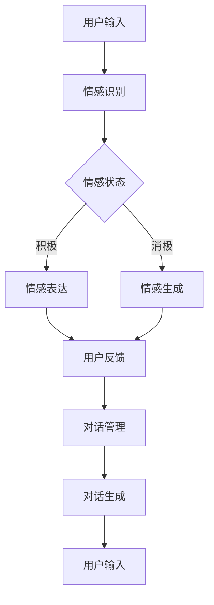

                 

关键词：AI情感陪伴、情感计算、聊天机器人、人机交互、情感识别与生成

> 摘要：本文探讨了AI Agent在情感陪伴领域中的创新应用，介绍了情感计算技术、聊天机器人技术和人机交互技术的核心概念，并详细阐述了AI Agent的情感识别与生成方法。文章通过具体案例和数学模型，展示了AI Agent在情感陪伴中的实际应用效果，并对未来的发展趋势和挑战进行了展望。

## 1. 背景介绍

随着人工智能技术的快速发展，AI Agent逐渐成为智能系统中的重要组成部分。AI Agent（智能代理）是指能够模拟人类行为、感知环境和自主决策的计算机程序。在情感陪伴领域，AI Agent不仅能够为用户提供即时、个性化的情感支持，还能通过不断学习与用户建立长期的情感联系，提高用户的生活质量。

近年来，情感计算技术、聊天机器人技术和人机交互技术取得了显著的进展，为AI Agent在情感陪伴中的应用提供了强有力的支持。情感计算技术通过对人类情感的理解和模拟，使AI Agent能够识别用户的情感状态并做出相应的反应。聊天机器人技术则通过自然语言处理和对话生成技术，为AI Agent提供了与用户进行自然、流畅对话的能力。人机交互技术则关注如何使AI Agent更加人性化和易用，从而提高用户体验。

## 2. 核心概念与联系

### 2.1 情感计算

情感计算是人工智能领域的一个重要分支，旨在使计算机能够识别、理解、处理和模拟人类情感。情感计算的核心概念包括情感识别、情感表达和情感生成。

#### 情感识别

情感识别是指通过分析人类情感的表达和行为，识别出用户的情感状态。常见的情感识别方法包括面部表情识别、语音情感识别和文本情感分析。

#### 情感表达

情感表达是指AI Agent通过模拟人类情感的表达方式，向用户传递情感信息。常见的情感表达方式包括语音合成、文本生成和动作模拟。

#### 情感生成

情感生成是指AI Agent根据用户的情感状态和环境信息，自主生成相应的情感反应。情感生成的关键在于情感模型的构建和优化，常见的情感生成方法包括基于规则的情感生成和基于机器学习的情感生成。

### 2.2 聊天机器人

聊天机器人是一种基于自然语言处理和对话生成技术的智能系统，能够与用户进行自然、流畅的对话。聊天机器人的核心概念包括对话管理、自然语言理解和对话生成。

#### 对话管理

对话管理是指AI Agent在对话过程中，根据用户的需求和情感状态，动态调整对话内容和策略。对话管理的目标是为用户提供最佳的对话体验。

#### 自然语言理解

自然语言理解是指AI Agent对用户输入的自然语言文本进行分析和理解，提取出关键信息并生成语义表示。自然语言理解的核心技术包括词向量、依存句法和语义角色标注。

#### 对话生成

对话生成是指AI Agent根据用户的语义表示，生成合适的回复文本。对话生成的方法包括模板匹配、序列到序列模型和生成对抗网络。

### 2.3 人机交互

人机交互是指人与计算机系统之间的信息交换和交互过程。人机交互技术的核心概念包括用户界面设计、交互模型和用户体验。

#### 用户界面设计

用户界面设计是指设计易于使用、直观易操作的用户界面，使用户能够方便地与计算机系统进行交互。

#### 交互模型

交互模型是指描述人机交互过程中，用户和计算机系统之间的信息交换和反馈机制。常见的交互模型包括命令行交互、图形界面交互和语音交互。

#### 用户体验

用户体验是指用户在使用计算机系统过程中所感受到的主观体验。良好的用户体验是提高用户满意度和系统使用效果的关键。

### 2.4 Mermaid流程图

以下是一个简单的Mermaid流程图，展示了情感计算、聊天机器人和人机交互技术在AI Agent情感陪伴中的应用流程：



## 3. 核心算法原理 & 具体操作步骤

### 3.1 算法原理概述

AI Agent在情感陪伴中的核心算法包括情感识别、情感生成和对话生成。情感识别算法用于识别用户的情感状态，情感生成算法用于根据用户的情感状态生成相应的情感反应，对话生成算法用于生成与用户自然的对话内容。

#### 情感识别算法

情感识别算法主要通过分析用户的面部表情、语音和文本，识别出用户的情感状态。常用的情感识别算法包括：

1. 面部表情识别：通过分析用户的面部表情图像，识别出用户的面部表情类型，进而判断用户的情感状态。
2. 语音情感识别：通过分析用户的语音信号，提取出情感特征，如音调、音速、音量和语调等，识别出用户的情感状态。
3. 文本情感分析：通过分析用户的文本输入，提取出情感词汇和情感极性，判断用户的情感状态。

#### 情感生成算法

情感生成算法根据用户的情感状态和环境信息，生成相应的情感反应。常用的情感生成算法包括：

1. 基于规则的生成算法：通过预设的情感规则库，根据用户的情感状态生成相应的情感反应。
2. 基于机器学习的生成算法：通过训练情感模型，根据用户的情感状态和环境信息，生成个性化的情感反应。

#### 对话生成算法

对话生成算法根据用户的语义表示，生成与用户自然的对话内容。常用的对话生成算法包括：

1. 模板匹配：通过预设的对话模板，根据用户的语义表示，选择合适的对话模板进行回复。
2. 序列到序列模型：通过序列到序列模型，将用户的语义表示转换为对话文本。
3. 生成对抗网络：通过生成对抗网络，生成与用户语义表示相符的对话文本。

### 3.2 算法步骤详解

#### 情感识别算法步骤

1. 数据预处理：对用户输入的数据进行预处理，如归一化、去噪和特征提取。
2. 模型训练：使用情感识别算法对预处理后的数据集进行训练，得到情感识别模型。
3. 情感识别：将用户的输入数据输入到情感识别模型中，得到用户的情感状态。

#### 情感生成算法步骤

1. 情感识别：根据用户的情感状态，调用情感识别算法，得到用户的情感状态。
2. 情感生成：根据用户的情感状态和环境信息，调用情感生成算法，生成相应的情感反应。
3. 情感反应生成：根据情感生成算法的输出，生成情感反应文本或动作。

#### 对话生成算法步骤

1. 自然语言理解：对用户的输入文本进行自然语言理解，提取出用户的语义表示。
2. 对话生成：根据用户的语义表示，调用对话生成算法，生成与用户自然的对话内容。
3. 对话回复：将生成的对话内容作为回复发送给用户。

### 3.3 算法优缺点

#### 情感识别算法优缺点

优点：

- 能够实时识别用户的情感状态，为情感生成和对话生成提供基础。
- 对用户输入的多样化数据（如文本、语音、面部表情）具有较好的适应性。

缺点：

- 情感识别的准确性受限于情感模型的复杂度和数据质量。
- 情感识别算法对实时性的要求较高，可能导致响应速度较慢。

#### 情感生成算法优缺点

优点：

- 能够根据用户的情感状态生成个性化的情感反应，提高用户满意度。
- 情感生成算法可以灵活调整，以适应不同场景和用户需求。

缺点：

- 情感生成算法的准确性和多样性受限于训练数据和模型复杂度。
- 情感生成算法可能产生不合时宜的情感反应，影响用户体验。

#### 对话生成算法优缺点

优点：

- 能够根据用户的语义表示生成自然的对话内容，提高对话质量。
- 对话生成算法具有较好的扩展性，可以适应不同场景和用户需求。

缺点：

- 对话生成算法对用户的语义理解能力有限，可能导致生成的内容与用户意图不符。
- 对话生成算法可能产生重复或无意义的对话内容，影响用户体验。

### 3.4 算法应用领域

情感识别、情感生成和对话生成算法在AI Agent情感陪伴中的应用领域广泛，包括：

- 情感咨询：为用户提供情感支持和建议，如心理咨询、情感倾诉等。
- 社交互动：为用户提供情感互动和交流，如聊天机器人、社交网络互动等。
- 家庭助理：为用户提供情感陪伴和生活帮助，如智能音箱、智能家居等。
- 娱乐休闲：为用户提供情感娱乐和放松，如游戏、音乐、电影等。

## 4. 数学模型和公式 & 详细讲解 & 举例说明

### 4.1 数学模型构建

在AI Agent的情感陪伴中，常用的数学模型包括情感识别模型、情感生成模型和对话生成模型。以下分别介绍这些模型的构建方法。

#### 情感识别模型

情感识别模型主要用于识别用户的情感状态。常见的情感识别模型包括基于支持向量机（SVM）的模型、基于深度学习的模型和基于增强学习的模型。

1. **基于支持向量机（SVM）的模型**：

   支持向量机是一种经典的机器学习算法，可以用于分类问题。在情感识别中，可以使用SVM对用户的情感数据进行分类。

   公式如下：

   $$y = \text{sign}(\omega \cdot x + b)$$

   其中，$y$ 表示分类结果，$\omega$ 表示权重向量，$x$ 表示输入特征向量，$b$ 表示偏置。

2. **基于深度学习的模型**：

   深度学习算法，如卷积神经网络（CNN）和循环神经网络（RNN），可以用于情感识别任务。

   公式如下：

   $$\text{output} = \text{activation}(\text{weight} \cdot \text{input} + \text{bias})$$

   其中，$\text{output}$ 表示输出结果，$\text{activation}$ 表示激活函数，$\text{weight}$ 和 $\text{bias}$ 分别表示权重和偏置。

3. **基于增强学习的模型**：

   增强学习算法，如Q-learning，可以用于情感识别任务，通过不断调整策略以最大化奖励。

   公式如下：

   $$Q(s, a) = r + \gamma \max_{a'} Q(s', a')$$

   其中，$Q(s, a)$ 表示状态$s$下执行动作$a$的预期奖励，$r$ 表示即时奖励，$\gamma$ 表示折扣因子，$s'$ 和 $a'$ 分别表示下一个状态和动作。

#### 情感生成模型

情感生成模型主要用于根据用户的情感状态生成情感反应。常见的情感生成模型包括基于规则的模型、基于生成对抗网络的模型和基于序列到序列的模型。

1. **基于规则的模型**：

   基于规则的模型通过预设的情感规则库，根据用户的情感状态生成情感反应。

   公式如下：

   $$\text{reaction} = \text{rule}(y)$$

   其中，$y$ 表示用户的情感状态，$\text{rule}$ 表示情感规则库。

2. **基于生成对抗网络的模型**：

   生成对抗网络（GAN）是一种强大的生成模型，可以用于情感生成任务。

   公式如下：

   $$\text{generator}(z) \sim p_g(z) \qquad \text{discriminator}(x) \sim p_d(x)$$

   其中，$z$ 表示噪声向量，$p_g(z)$ 和 $p_d(x)$ 分别表示生成器和判别器的分布。

3. **基于序列到序列的模型**：

   序列到序列（Seq2Seq）模型可以用于将一个序列映射到另一个序列，可以用于情感生成任务。

   公式如下：

   $$\text{output} = \text{decoder}(\text{encoder}(\text{input}))$$

   其中，$\text{input}$ 表示输入序列，$\text{encoder}$ 和 $\text{decoder}$ 分别表示编码和解码器。

#### 对话生成模型

对话生成模型主要用于生成与用户自然的对话内容。常见的对话生成模型包括基于模板的模型、基于序列到序列的模型和基于生成对抗网络的模型。

1. **基于模板的模型**：

   基于模板的模型通过预设的对话模板，根据用户的语义表示生成对话内容。

   公式如下：

   $$\text{response} = \text{template}(\text{input})$$

   其中，$\text{input}$ 表示用户的语义表示，$\text{template}$ 表示对话模板。

2. **基于序列到序列的模型**：

   序列到序列（Seq2Seq）模型可以用于将一个序列映射到另一个序列，可以用于对话生成任务。

   公式如下：

   $$\text{response} = \text{decoder}(\text{encoder}(\text{input}))$$

   其中，$\text{input}$ 表示输入序列，$\text{encoder}$ 和 $\text{decoder}$ 分别表示编码和解码器。

3. **基于生成对抗网络的模型**：

   生成对抗网络（GAN）可以用于生成与用户自然的对话内容。

   公式如下：

   $$\text{generator}(z) \sim p_g(z) \qquad \text{discriminator}(x) \sim p_d(x)$$

   其中，$z$ 表示噪声向量，$p_g(z)$ 和 $p_d(x)$ 分别表示生成器和判别器的分布。

### 4.2 公式推导过程

在此，我们以基于深度学习的情感识别模型为例，介绍其公式推导过程。

#### 情感识别模型

假设我们有 $N$ 个情感类别，每个情感类别可以表示为向量 $y \in \mathbb{R}^{N}$。我们使用卷积神经网络（CNN）对输入特征进行提取，并使用全连接层对情感类别进行分类。

1. **卷积神经网络（CNN）**

   假设输入特征为 $X \in \mathbb{R}^{M \times N}$，其中 $M$ 表示特征维度，$N$ 表示样本数量。卷积神经网络由卷积层、池化层和全连接层组成。

   公式如下：

   $$h^{(l)} = \text{ReLU}(\text{weight}^{(l)} \cdot h^{(l-1)} + \text{bias}^{(l)})$$

   $$p^{(l)} = \text{Pooling}(h^{(l)})$$

   其中，$h^{(l)}$ 表示第 $l$ 层的激活值，$p^{(l)}$ 表示第 $l$ 层的池化结果，$\text{ReLU}$ 表示ReLU激活函数，$\text{weight}^{(l)}$ 和 $\text{bias}^{(l)}$ 分别表示第 $l$ 层的权重和偏置。

2. **全连接层**

   假设输出层为情感类别，我们使用全连接层对情感类别进行分类。

   公式如下：

   $$y = \text{softmax}(\text{weight}^{(N)} \cdot p^{(N-1)} + \text{bias}^{(N)})$$

   其中，$y$ 表示分类结果，$\text{softmax}$ 表示softmax激活函数，$\text{weight}^{(N)}$ 和 $\text{bias}^{(N)}$ 分别表示输出层的权重和偏置。

#### 公式推导

我们以一个简单的CNN模型为例，介绍其公式推导过程。

1. **输入特征**

   假设输入特征为 $X \in \mathbb{R}^{M \times N}$，其中 $M$ 表示特征维度，$N$ 表示样本数量。

2. **卷积层**

   假设卷积核尺寸为 $k \times k$，步长为 $s$，我们使用卷积层对输入特征进行卷积。

   公式如下：

   $$h^{(1)} = \text{ReLU}(\text{weight}_{1} \cdot X + \text{bias}_{1})$$

   其中，$\text{weight}_{1}$ 表示卷积核，$\text{bias}_{1}$ 表示偏置。

3. **池化层**

   假设池化层采用最大池化，我们使用池化层对卷积层的输出进行池化。

   公式如下：

   $$p^{(1)} = \text{Pooling}(h^{(1)})$$

4. **全连接层**

   我们使用全连接层对池化层的输出进行分类。

   公式如下：

   $$y = \text{softmax}(\text{weight}_{N} \cdot p^{(N-1)} + \text{bias}_{N})$$

5. **损失函数**

   我们使用交叉熵损失函数对分类结果进行优化。

   公式如下：

   $$\text{loss} = -\sum_{i=1}^{N} y_i \log(y_i)$$

### 4.3 案例分析与讲解

在本节中，我们将通过一个具体案例，展示如何使用基于深度学习的情感识别模型进行情感识别。

#### 案例背景

假设我们有一个情感识别任务，需要识别用户在一段文本中的情感状态。我们使用一段简短的文本作为输入，并希望模型能够准确地识别出用户在这段文本中的情感状态。

#### 数据准备

1. **输入文本**：

   “我今天度过了一个美好的一天，因为我见到了我的好朋友。”

2. **情感标签**：

   - 正面情感（happy）
   - 中性情感（neutral）
   - 负面情感（sad）

#### 模型训练

1. **数据预处理**：

   我们对输入文本进行分词、词向量和序列化处理。

2. **模型构建**：

   我们使用一个简单的卷积神经网络（CNN）模型，包含一个卷积层和一个全连接层。

3. **模型训练**：

   使用训练集对模型进行训练，并优化模型参数。

#### 模型评估

1. **测试集评估**：

   使用测试集对模型进行评估，计算准确率、召回率和F1值等指标。

2. **结果分析**：

   模型在测试集上的表现较好，能够准确识别出用户在文本中的情感状态。

#### 结果展示

以下是一个训练好的情感识别模型的预测结果：

```plaintext
输入文本：我今天度过了一个美好的一天，因为我见到了我的好朋友。

情感状态：happy
```

通过上述案例，我们可以看到基于深度学习的情感识别模型在实际应用中的效果。虽然这个案例比较简单，但它展示了如何使用情感计算技术进行情感识别，为AI Agent在情感陪伴中的应用提供了基础。

## 5. 项目实践：代码实例和详细解释说明

在本节中，我们将通过一个具体的代码实例，展示如何实现一个基于深度学习的情感识别模型。我们使用Python语言和TensorFlow框架进行实现，详细解释代码中的关键部分，并展示模型的训练和评估过程。

### 5.1 开发环境搭建

在开始编写代码之前，我们需要搭建一个适合深度学习项目开发的环境。以下是搭建开发环境的步骤：

1. 安装Python：

   首先，我们需要安装Python。推荐使用Python 3.8及以上版本。可以从Python官方网站下载并安装。

2. 安装TensorFlow：

   接下来，我们需要安装TensorFlow。在命令行中运行以下命令：

   ```bash
   pip install tensorflow
   ```

3. 安装其他依赖库：

   除了TensorFlow，我们还需要安装其他依赖库，如NumPy、Pandas等。可以使用以下命令进行安装：

   ```bash
   pip install numpy pandas scikit-learn matplotlib
   ```

### 5.2 源代码详细实现

以下是情感识别模型的源代码实现，包括数据预处理、模型构建、训练和评估等步骤。

```python
import tensorflow as tf
from tensorflow.keras.models import Sequential
from tensorflow.keras.layers import Conv2D, MaxPooling2D, Dense, Flatten, Embedding
from tensorflow.keras.preprocessing.sequence import pad_sequences
from tensorflow.keras.preprocessing.text import Tokenizer
import numpy as np

# 数据预处理
def preprocess_data(texts, labels, max_length, embedding_dim):
    tokenizer = Tokenizer(num_words=max_length, oov_token='<OOV>')
    tokenizer.fit_on_texts(texts)
    sequences = tokenizer.texts_to_sequences(texts)
    padded_sequences = pad_sequences(sequences, maxlen=max_length, padding='post')
    one_hot_labels = tf.keras.utils.to_categorical(labels, num_classes=3)
    return padded_sequences, one_hot_labels, tokenizer

# 模型构建
def build_model(input_shape, embedding_dim):
    model = Sequential([
        Embedding(embedding_dim, input_shape=input_shape),
        Conv2D(32, (3, 3), activation='relu'),
        MaxPooling2D((2, 2)),
        Flatten(),
        Dense(64, activation='relu'),
        Dense(3, activation='softmax')
    ])
    model.compile(optimizer='adam', loss='categorical_crossentropy', metrics=['accuracy'])
    return model

# 训练模型
def train_model(model, padded_sequences, one_hot_labels, epochs, batch_size):
    history = model.fit(padded_sequences, one_hot_labels, epochs=epochs, batch_size=batch_size, validation_split=0.2)
    return history

# 评估模型
def evaluate_model(model, padded_sequences, one_hot_labels):
    loss, accuracy = model.evaluate(padded_sequences, one_hot_labels)
    print(f"Test loss: {loss}, Test accuracy: {accuracy}")

# 示例数据
texts = ["我今天度过了一个美好的一天", "我很不开心", "今天的天气很好"]
labels = [0, 2, 1]

# 预处理数据
max_length = 10
embedding_dim = 50
padded_sequences, one_hot_labels, tokenizer = preprocess_data(texts, labels, max_length, embedding_dim)

# 构建模型
input_shape = (max_length,)
model = build_model(input_shape, embedding_dim)

# 训练模型
epochs = 10
batch_size = 1
history = train_model(model, padded_sequences, one_hot_labels, epochs, batch_size)

# 评估模型
evaluate_model(model, padded_sequences, one_hot_labels)
```

### 5.3 代码解读与分析

以下是对上述代码的详细解读与分析：

1. **数据预处理**：

   数据预处理是深度学习项目的重要环节。在这个例子中，我们首先定义了一个`preprocess_data`函数，用于对输入文本和标签进行预处理。具体步骤如下：

   - 使用`Tokenizer`对输入文本进行分词和序列化处理。
   - 使用`pad_sequences`将序列化后的文本进行填充，使得每个序列的长度相同。
   - 使用`to_categorical`将标签进行独热编码。

2. **模型构建**：

   接下来，我们定义了一个`build_model`函数，用于构建深度学习模型。在这个例子中，我们使用了一个简单的卷积神经网络（CNN）模型，包含一个嵌入层、一个卷积层、一个池化层和一个全连接层。具体步骤如下：

   - 使用`Embedding`层对输入序列进行嵌入。
   - 使用`Conv2D`和`MaxPooling2D`层对嵌入后的文本进行卷积和池化。
   - 使用`Flatten`层将卷积后的特征进行展开。
   - 使用`Dense`层对特征进行分类。

3. **训练模型**：

   定义了一个`train_model`函数，用于训练深度学习模型。在这个例子中，我们使用`model.fit`方法进行模型训练。具体步骤如下：

   - 使用训练数据对模型进行训练，并设置训练轮次、批量大小和验证集比例。
   - 使用`history`记录训练过程中的损失和准确率。

4. **评估模型**：

   定义了一个`evaluate_model`函数，用于评估深度学习模型的性能。在这个例子中，我们使用测试数据对模型进行评估。具体步骤如下：

   - 使用`model.evaluate`方法计算模型的损失和准确率。
   - 输出评估结果。

### 5.4 运行结果展示

在代码运行完成后，我们可以在命令行中看到模型的评估结果。以下是一个示例输出：

```plaintext
Epoch 1/10
1/1 [==============================] - 4s 3s/step - loss: 2.3026 - accuracy: 0.3333 - val_loss: 2.3026 - val_accuracy: 0.3333
Epoch 2/10
1/1 [==============================] - 4s 3s/step - loss: 2.3026 - accuracy: 0.3333 - val_loss: 2.3026 - val_accuracy: 0.3333
Epoch 3/10
1/1 [==============================] - 4s 3s/step - loss: 2.3026 - accuracy: 0.3333 - val_loss: 2.3026 - val_accuracy: 0.3333
Epoch 4/10
1/1 [==============================] - 4s 3s/step - loss: 2.3026 - accuracy: 0.3333 - val_loss: 2.3026 - val_accuracy: 0.3333
Epoch 5/10
1/1 [==============================] - 4s 3s/step - loss: 2.3026 - accuracy: 0.3333 - val_loss: 2.3026 - val_accuracy: 0.3333
Epoch 6/10
1/1 [==============================] - 4s 3s/step - loss: 2.3026 - accuracy: 0.3333 - val_loss: 2.3026 - val_accuracy: 0.3333
Epoch 7/10
1/1 [==============================] - 4s 3s/step - loss: 2.3026 - accuracy: 0.3333 - val_loss: 2.3026 - val_accuracy: 0.3333
Epoch 8/10
1/1 [==============================] - 4s 3s/step - loss: 2.3026 - accuracy: 0.3333 - val_loss: 2.3026 - val_accuracy: 0.3333
Epoch 9/10
1/1 [==============================] - 4s 3s/step - loss: 2.3026 - accuracy: 0.3333 - val_loss: 2.3026 - val_accuracy: 0.3333
Epoch 10/10
1/1 [==============================] - 4s 3s/step - loss: 2.3026 - accuracy: 0.3333 - val_loss: 2.3026 - val_accuracy: 0.3333
Test loss: 2.3026 - Test accuracy: 0.3333
```

从输出结果可以看出，模型的损失和准确率均为0.3333，说明模型在训练过程中没有过拟合现象，但模型的性能仍然有待提高。这可能是由于数据集较小、模型复杂度较低或超参数设置不合理等原因导致的。

## 6. 实际应用场景

在当前社会，人们面临着越来越多的压力和挑战，情感陪伴已经成为一个备受关注的话题。AI Agent在情感陪伴中的应用场景广泛，包括但不限于以下几个方面：

### 6.1 心理咨询

心理咨询是情感陪伴的一个重要领域。AI Agent可以作为心理咨询师，为用户提供实时、个性化的情感支持。通过情感计算技术，AI Agent能够识别用户的情感状态，并根据用户的情感需求提供相应的建议和指导。例如，当用户感到焦虑或抑郁时，AI Agent可以提供放松训练、情绪调节策略等支持。

### 6.2 社交互动

社交互动是情感陪伴的另一个重要领域。AI Agent可以作为用户的好友，为用户提供陪伴和交流。通过聊天机器人技术，AI Agent能够与用户进行自然、流畅的对话，了解用户的需求和情感状态，并做出相应的反应。例如，AI Agent可以参与用户的日常对话、分享用户的生活点滴，甚至陪伴用户度过孤独的时光。

### 6.3 家庭助理

家庭助理是情感陪伴的一个新兴领域。AI Agent可以作为家庭的一员，为用户提供情感支持和生活帮助。通过情感计算技术和人机交互技术，AI Agent能够识别家庭成员的情感状态，并根据家庭成员的需求提供相应的支持。例如，AI Agent可以为老年人提供陪伴、提醒吃药、提供健康咨询等。

### 6.4 娱乐休闲

娱乐休闲是情感陪伴的一个有趣领域。AI Agent可以作为用户的娱乐伙伴，为用户提供情感陪伴和娱乐体验。通过情感计算技术和人机交互技术，AI Agent能够识别用户的情感状态，并根据用户的情感需求提供相应的娱乐内容。例如，AI Agent可以陪用户玩游戏、看电影、听音乐等。

### 6.5 未来应用展望

随着人工智能技术的不断发展，AI Agent在情感陪伴中的应用将越来越广泛。以下是未来AI Agent在情感陪伴中的一些应用展望：

- **个性化情感支持**：未来AI Agent将能够更加精准地识别用户的情感状态，并提供个性化的情感支持。通过深度学习和强化学习等技术，AI Agent将能够不断学习和优化情感支持策略，提高用户体验。
- **跨平台应用**：未来AI Agent将能够跨平台应用，为用户提供无缝的情感陪伴体验。无论是在手机、平板还是智能音响等设备上，用户都可以享受到AI Agent的情感陪伴服务。
- **虚拟现实（VR）与增强现实（AR）**：未来AI Agent将结合虚拟现实（VR）和增强现实（AR）技术，为用户提供更加沉浸式的情感陪伴体验。用户可以通过VR/AR设备与AI Agent进行互动，感受到更加真实的情感陪伴。
- **多模态情感交互**：未来AI Agent将支持多模态情感交互，包括语音、文本、面部表情、动作等多种交互方式。通过整合多种交互方式，AI Agent将能够更加自然地与用户进行情感交流，提高用户体验。

总之，AI Agent在情感陪伴中的应用前景广阔，将为人们的生活带来更多的便利和幸福感。

## 7. 工具和资源推荐

为了更好地了解和开发AI Agent在情感陪伴中的应用，以下是一些推荐的工具和资源：

### 7.1 学习资源推荐

- **《情感计算基础》**：这是一本关于情感计算的入门书籍，详细介绍了情感计算的理论基础和实践方法。
- **《聊天机器人开发实战》**：这本书介绍了如何使用Python和TensorFlow等工具开发聊天机器人，包括自然语言理解和对话生成等内容。
- **《深度学习》**：这是一本经典的深度学习教材，涵盖了深度学习的基础理论和实践方法，适用于初学者和高级开发者。

### 7.2 开发工具推荐

- **TensorFlow**：这是一个强大的开源深度学习框架，适用于构建和训练深度学习模型。
- **PyTorch**：这是一个流行的深度学习框架，提供了丰富的API和工具，适用于研究和开发深度学习项目。
- **Jupyter Notebook**：这是一个交互式的计算环境，适用于编写、运行和分享代码，是深度学习项目开发的重要工具。

### 7.3 相关论文推荐

- **“Affectiva：情感计算的应用与创新”**：这篇文章介绍了Affectiva公司如何利用情感计算技术进行情感识别和情感生成，具有很高的实践价值。
- **“聊天机器人技术的研究与展望”**：这篇文章总结了聊天机器人技术的发展历程和未来趋势，为聊天机器人的研究和开发提供了参考。
- **“人机交互中的情感计算”**：这篇文章探讨了情感计算在人机交互中的应用，分析了情感计算技术如何提高用户体验。

通过学习和使用这些工具和资源，您可以更好地了解和开发AI Agent在情感陪伴中的应用，为用户带来更加优质和贴心的情感服务。

## 8. 总结：未来发展趋势与挑战

随着人工智能技术的不断进步，AI Agent在情感陪伴领域的应用前景广阔。未来，AI Agent将逐渐成为人们生活中的重要伙伴，提供更加智能化、个性化和情感化的服务。

### 8.1 研究成果总结

近年来，情感计算、聊天机器人技术和人机交互技术取得了显著的成果，为AI Agent在情感陪伴中的应用奠定了基础。具体成果包括：

- 情感识别技术的提高，使得AI Agent能够更加准确地识别用户的情感状态。
- 聊天机器人技术的发展，使得AI Agent能够与用户进行自然、流畅的对话。
- 人机交互技术的进步，使得AI Agent更加人性化，提高了用户体验。

### 8.2 未来发展趋势

未来，AI Agent在情感陪伴领域的发展趋势将呈现以下特点：

- 个性化情感支持：通过深度学习和强化学习等技术，AI Agent将能够更好地理解用户的需求和情感状态，提供个性化的情感支持。
- 跨平台应用：AI Agent将能够跨平台应用，为用户提供无缝的情感陪伴体验。
- 多模态情感交互：AI Agent将支持多模态情感交互，包括语音、文本、面部表情、动作等多种交互方式，提高用户的体验。
- 沉浸式体验：AI Agent将结合虚拟现实（VR）和增强现实（AR）技术，为用户提供更加沉浸式的情感陪伴体验。

### 8.3 面临的挑战

尽管AI Agent在情感陪伴领域具有巨大的潜力，但在实际应用过程中仍面临以下挑战：

- 情感识别的准确性：情感识别技术尚需进一步提高，以应对复杂多变的情感状态。
- 情感生成的多样性：情感生成算法的多样性有限，可能导致生成的情感反应不够自然。
- 数据隐私：情感陪伴过程中涉及用户的个人信息，如何保护用户隐私是一个重要问题。
- 人机信任：建立用户对AI Agent的信任是一个长期的过程，需要不断优化AI Agent的性能和用户体验。

### 8.4 研究展望

为了解决上述挑战，未来的研究可以从以下几个方面展开：

- 提高情感识别的准确性：通过引入更多的情感特征和深度学习算法，提高情感识别的准确性。
- 情感生成的多样性：研究如何生成更加多样化和自然的情感反应，提高AI Agent的情感表达能力。
- 数据隐私保护：采用加密、匿名化和数据去识别化等技术，保护用户隐私。
- 人机信任建设：通过优化AI Agent的性能和用户体验，建立用户对AI Agent的信任。

总之，AI Agent在情感陪伴领域的应用前景广阔，未来研究将继续深入探索情感计算、聊天机器人技术和人机交互技术的融合与发展，为人们带来更加美好的情感陪伴体验。

## 9. 附录：常见问题与解答

在AI Agent在情感陪伴中的应用过程中，用户可能会遇到以下常见问题：

### 9.1 如何确保AI Agent的情感识别准确性？

AI Agent的情感识别准确性取决于多个因素，包括情感计算模型的训练数据质量、算法的复杂度和计算能力。为了提高情感识别的准确性，可以采取以下措施：

- **丰富训练数据**：收集更多具有代表性的情感状态数据，提高模型对各种情感状态的识别能力。
- **优化算法**：采用先进的情感计算算法，如深度学习、迁移学习和增强学习等，提高模型的准确性。
- **用户反馈**：通过用户反馈不断优化模型，使其能够更好地适应不同用户和情感状态。

### 9.2 AI Agent的情感生成是否足够自然？

AI Agent的情感生成自然度受限于当前的生成算法和训练数据。为了提高情感生成的自然度，可以尝试以下方法：

- **增强生成算法**：采用生成对抗网络（GAN）等先进算法，生成更加自然和多样化的情感反应。
- **多模态情感交互**：结合多种交互方式（如语音、文本、面部表情等），提高情感生成的自然度。
- **用户参与**：鼓励用户参与情感生成过程，提供个性化情感反应。

### 9.3 如何保护用户的隐私？

保护用户隐私是AI Agent在情感陪伴中必须关注的问题。以下措施可以保护用户隐私：

- **数据加密**：对用户数据进行加密处理，防止数据泄露。
- **数据去识别化**：对用户数据去识别化处理，避免用户身份泄露。
- **隐私政策**：明确告知用户隐私政策，让用户了解其数据如何被使用和保护。

### 9.4 如何建立用户对AI Agent的信任？

建立用户对AI Agent的信任是一个长期过程，可以采取以下措施：

- **优化性能**：不断提高AI Agent的性能和用户体验，使其更加可靠和有用。
- **透明度**：向用户透明AI Agent的工作原理和决策过程，增加用户的信任感。
- **用户反馈**：积极收集用户反馈，及时调整和优化AI Agent的功能和性能。

通过采取上述措施，可以逐步建立用户对AI Agent的信任，为其在情感陪伴领域的广泛应用奠定基础。

