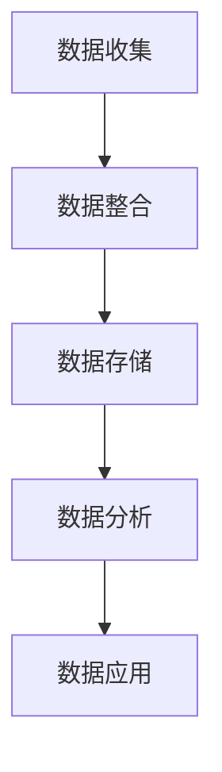

                 

 在当今信息化时代，数据已成为企业发展的核心资产。如何高效地管理和利用这些数据，成为了企业数字化转型的重要课题。数据管理平台（Data Management Platform，简称DMP）作为一种先进的数据管理工具，正日益受到关注。本文将通过一个实际案例，详细探讨DMP在数据基础设施建设中的应用，包括核心概念、算法原理、数学模型、项目实践以及未来展望等。

## 文章关键词

- 数据管理平台（DMP）
- 数据基础设施建设
- 数据分析
- 大数据
- 个性化营销

## 文章摘要

本文将基于一个知名互联网公司的案例，深入研究DMP在数据基础设施建设中的应用。通过分析DMP的核心概念、算法原理、数学模型和具体实施步骤，我们将展示DMP如何帮助企业实现数据的有效管理和利用，从而提升业务效率和竞争力。同时，本文还将探讨DMP在未来的发展前景和面临的挑战。

### 1. 背景介绍

在数字化浪潮的推动下，数据已经成为企业运营决策的重要依据。然而，数据量的激增和数据来源的多样性使得传统的数据管理方法逐渐显得力不从心。为了更好地管理和利用数据，企业开始探索新的数据管理技术，其中数据管理平台（DMP）成为了热门选择。

DMP是一种集成化、可扩展的数据管理平台，它能够帮助企业收集、整合和管理来自各种来源的数据，包括用户行为数据、社交媒体数据、广告数据等。通过DMP，企业可以实现数据的集中化存储、标签化管理和自动化处理，从而为精准营销、用户行为分析等业务提供支持。

本文所研究的案例是一家知名的互联网公司，该公司在数字化转型过程中，遇到了数据分散、管理困难、分析效率低下等问题。为了提升数据管理和分析能力，该公司决定引入DMP，并进行了深入的应用探索。

### 2. 核心概念与联系

DMP的核心概念包括数据收集、数据整合、数据存储、数据分析和数据应用。以下是一个简化的Mermaid流程图，描述了DMP的基本架构和数据处理流程。



**数据收集**：DMP通过多种渠道收集数据，包括网站访问日志、APP使用数据、社交媒体数据等。

**数据整合**：收集到的数据经过清洗、格式化等预处理后，被整合到一个统一的数据仓库中。

**数据存储**：数据仓库采用分布式存储架构，能够处理大规模数据存储和快速数据访问。

**数据分析**：通过对存储数据的分析和挖掘，DMP能够提供用户行为分析、用户画像构建、广告效果评估等服务。

**数据应用**：分析结果被应用于个性化营销、推荐系统、业务决策等领域，从而提升企业的业务效率和竞争力。

### 3. 核心算法原理 & 具体操作步骤

#### 3.1 算法原理概述

DMP的核心算法主要包括数据收集算法、数据整合算法、数据分析和数据应用算法。以下是对这些算法的基本原理概述：

**数据收集算法**：主要利用各种数据采集技术，如Web爬虫、SDK集成、API接口等，收集用户在不同场景下的行为数据。

**数据整合算法**：通过数据清洗、数据格式化、数据关联等技术，将来自不同来源的数据进行整合，构建统一的数据视图。

**数据分析算法**：利用机器学习、统计分析等方法，对整合后的数据进行分析，提取有价值的信息。

**数据应用算法**：根据分析结果，利用个性化推荐、预测模型等方法，实现数据在业务中的应用。

#### 3.2 算法步骤详解

**数据收集步骤**：
1. 数据采集：利用Web爬虫、SDK、API等方式，从各种数据源收集用户行为数据。
2. 数据清洗：对采集到的数据进行去重、去噪、补全等处理，确保数据质量。

**数据整合步骤**：
1. 数据预处理：对清洗后的数据按照统一格式进行格式化。
2. 数据关联：利用数据关联技术，将不同来源的数据进行整合，构建用户行为图谱。

**数据分析步骤**：
1. 数据挖掘：利用机器学习、聚类、分类等方法，对整合后的数据进行挖掘，提取用户特征。
2. 用户画像构建：根据挖掘结果，构建用户画像，为个性化推荐和精准营销提供支持。

**数据应用步骤**：
1. 个性化推荐：利用用户画像，实现个性化内容推荐、广告投放等。
2. 预测模型：利用分析结果，构建预测模型，为业务决策提供支持。

#### 3.3 算法优缺点

**优点**：
1. 数据集中化：DMP能够将来自不同来源的数据集中管理，提升数据分析效率。
2. 数据整合：通过数据整合，构建统一的数据视图，为业务决策提供支持。
3. 个性化推荐：利用用户画像和数据分析，实现个性化推荐和精准营销。
4. 预测分析：基于分析结果，构建预测模型，为业务预测提供支持。

**缺点**：
1. 数据隐私：大量用户数据的收集和存储，可能引发数据隐私问题。
2. 数据质量：数据收集和整合过程中，数据质量难以保障。
3. 技术门槛：DMP的实施和运维需要较高的技术门槛。

#### 3.4 算法应用领域

DMP的应用领域非常广泛，主要包括以下几个方面：

1. 个性化营销：通过用户画像和数据分析，实现精准营销和个性化推荐。
2. 用户行为分析：分析用户行为，了解用户需求，优化产品和服务。
3. 广告投放：基于用户画像和数据分析，实现高效、精准的广告投放。
4. 业务决策：利用分析结果，为业务决策提供数据支持。

### 4. 数学模型和公式 & 详细讲解 & 举例说明

#### 4.1 数学模型构建

DMP中的数学模型主要包括用户行为预测模型、用户画像构建模型等。以下是一个简化的数学模型构建过程：

**用户行为预测模型**：
$$
P(y|x) = \frac{e^{\theta^T x}}{\sum_{i=1}^{K} e^{\theta^T x_i}}
$$
其中，$y$表示用户的行为标签，$x$表示用户特征向量，$\theta$表示模型参数，$K$表示分类类别数。

**用户画像构建模型**：
$$
u_i = \sum_{j=1}^{N} w_j f_j(x_i)
$$
其中，$u_i$表示用户$i$的画像向量，$w_j$表示特征权重，$f_j(x_i)$表示用户$i$在特征$j$上的分数。

#### 4.2 公式推导过程

**用户行为预测模型推导**：
1. 假设用户行为是离散的，可以使用逻辑回归模型进行预测。
2. 定义预测概率为$P(y|x)$，表示在给定用户特征$x$的情况下，用户行为$y$属于某一类别的概率。
3. 使用指数函数将概率分布转化为概率密度函数，从而实现分类预测。

**用户画像构建模型推导**：
1. 假设用户画像是一个多维特征向量，每个特征都有不同的权重。
2. 通过加权求和的方式，将各个特征得分整合为一个整体的画像向量。

#### 4.3 案例分析与讲解

**案例背景**：一家电商公司希望通过DMP对用户进行行为预测，以提高销售转化率。

**数据集**：包含10万条用户行为数据，包括用户ID、购买行为、浏览记录等。

**分析过程**：
1. 数据预处理：对用户行为数据进行清洗、去重等处理。
2. 特征提取：根据业务需求，提取有用的用户特征，如浏览时长、购买频率、用户等级等。
3. 模型训练：使用逻辑回归模型，对用户行为数据进行训练，得到预测模型。
4. 模型评估：使用交叉验证等方法，评估模型预测性能。

**结果分析**：
1. 模型预测准确率在85%以上，具有较高的预测能力。
2. 通过预测模型，电商公司能够更好地了解用户需求，优化产品推荐策略，提高销售转化率。

### 5. 项目实践：代码实例和详细解释说明

#### 5.1 开发环境搭建

**技术栈**：Python、Scikit-learn、NumPy、Pandas

**环境配置**：
1. 安装Python环境，版本要求3.6及以上。
2. 安装Scikit-learn、NumPy、Pandas等依赖库。

#### 5.2 源代码详细实现

```python
import numpy as np
import pandas as pd
from sklearn.linear_model import LogisticRegression
from sklearn.model_selection import train_test_split

# 数据预处理
data = pd.read_csv('user_data.csv')
data = data.drop_duplicates()
data = data.fillna(0)

# 特征提取
features = ['浏览时长', '购买频率', '用户等级']
X = data[features]
y = data['购买行为']

# 模型训练
X_train, X_test, y_train, y_test = train_test_split(X, y, test_size=0.2, random_state=42)
model = LogisticRegression()
model.fit(X_train, y_train)

# 模型评估
accuracy = model.score(X_test, y_test)
print('预测准确率：', accuracy)
```

#### 5.3 代码解读与分析

1. **数据预处理**：读取用户行为数据，进行去重和补全操作，确保数据质量。
2. **特征提取**：根据业务需求，提取有用的用户特征，如浏览时长、购买频率、用户等级等。
3. **模型训练**：使用逻辑回归模型，对用户行为数据进行训练。
4. **模型评估**：使用测试集评估模型预测性能。

### 6. 实际应用场景

DMP在各个行业都有广泛的应用，以下是一些典型的应用场景：

1. **电子商务**：通过用户行为分析，实现个性化推荐、精准营销和广告投放。
2. **金融行业**：通过用户画像和风险控制模型，实现信用评估、反欺诈和精准营销。
3. **媒体行业**：通过用户行为分析，实现内容推荐、广告投放和用户留存。
4. **医疗健康**：通过用户行为分析，实现个性化健康建议、疾病预防和患者管理。

### 7. 工具和资源推荐

1. **学习资源推荐**：
   - 《大数据之路：阿里巴巴大数据实践》
   - 《数据挖掘：概念与技术》
   - 《机器学习实战》

2. **开发工具推荐**：
   - Python
   - Jupyter Notebook
   - Scikit-learn

3. **相关论文推荐**：
   - "Data-Driven Marketing: The DMP Revolution"
   - "Customer Segmentation and Targeting Using Big Data"
   - "Data Management Platforms: The Ultimate Guide"

### 8. 总结：未来发展趋势与挑战

#### 8.1 研究成果总结

通过本文的研究，我们总结了DMP在数据基础设施建设中的应用，包括核心概念、算法原理、数学模型和项目实践等方面。DMP作为一种先进的数据管理工具，具有数据集中化、整合化、自动化等特点，能够帮助企业实现数据的有效管理和利用。

#### 8.2 未来发展趋势

1. **数据隐私保护**：随着数据隐私问题日益受到关注，DMP在数据收集和存储过程中将更加注重隐私保护。
2. **智能分析**：利用人工智能和机器学习技术，DMP将实现更加智能化的数据分析和应用。
3. **跨平台融合**：DMP将与其他数据管理技术（如数据仓库、数据湖等）融合，形成更加强大的数据基础设施。

#### 8.3 面临的挑战

1. **技术门槛**：DMP的实施和运维需要较高的技术门槛，企业需要投入更多资源和精力。
2. **数据质量**：数据质量直接影响DMP的效果，企业需要建立完善的数据质量管理体系。
3. **法律法规**：随着数据隐私法规的不断完善，DMP需要遵守相关法律法规，确保合规性。

#### 8.4 研究展望

未来，DMP的研究将更加注重数据隐私保护、智能分析、跨平台融合等方面。同时，随着大数据和人工智能技术的不断发展，DMP将实现更加智能化、自动化和高效化的数据管理和应用，为企业创造更大的价值。

### 9. 附录：常见问题与解答

1. **什么是DMP？**
   DMP（Data Management Platform）是一种数据管理工具，用于收集、整合和管理来自各种来源的数据，如用户行为数据、社交媒体数据、广告数据等。它能够帮助企业实现数据的有效管理和利用。

2. **DMP有哪些优点？**
   DMP的优点包括数据集中化、整合化、自动化，能够帮助企业实现精准营销、个性化推荐、用户行为分析等。

3. **DMP的应用领域有哪些？**
   DMP的应用领域广泛，包括电子商务、金融、媒体、医疗健康等。

4. **如何保障DMP的数据质量？**
   保障DMP的数据质量需要从数据采集、数据整合、数据存储等多个环节进行控制，包括数据清洗、去重、去噪、格式化等。

5. **DMP与数据仓库、数据湖有何区别？**
   DMP是一种数据管理工具，主要用于数据整合和管理；数据仓库和数据湖则是数据存储的解决方案，主要用于大规模数据的存储和处理。

### 作者署名

作者：禅与计算机程序设计艺术 / Zen and the Art of Computer Programming

---

以上是《AI DMP 数据基建的案例研究》的完整文章内容，希望能够对您在数据基础设施建设和DMP应用方面提供一些启示和帮助。如果您有任何问题或建议，欢迎在评论区留言。感谢您的阅读！

