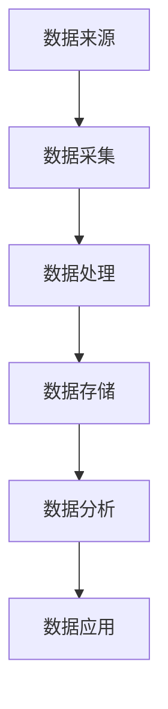

                 

在当今数字化时代，人工智能（AI）技术的快速发展已经深刻地影响了各行各业。数据管理平台（DMP）作为AI技术的重要应用之一，正逐步构建起一个强大的数据基础设施，对行业产生了深远的影响。本文将深入探讨AI DMP数据基建的背景、核心概念、算法原理、数学模型、应用实例以及未来展望，旨在为读者提供一份全面的技术解析。

## 关键词

- 人工智能（AI）
- 数据管理平台（DMP）
- 数据基建
- 行业影响
- 数据挖掘
- 数学模型

## 摘要

本文首先介绍了AI DMP数据基建的背景和重要性，然后详细阐述了其核心概念、算法原理和数学模型。接着，通过具体的应用实例，展示了AI DMP在实际业务中的价值。最后，对AI DMP的未来发展趋势和面临的挑战进行了展望，为行业的持续创新提供了思考方向。

## 1. 背景介绍

### AI 的发展现状

人工智能作为计算机科学的一个分支，旨在使计算机具备人类智能，实现人机交互和自主决策。自20世纪50年代人工智能概念提出以来，经过数十年的发展，特别是在深度学习、神经网络等技术的推动下，人工智能已经取得了显著的进展。如今，AI已经广泛应用于图像识别、自然语言处理、自动驾驶、智能客服等领域。

### DMP 的定义与作用

数据管理平台（Data Management Platform，简称DMP）是一种集数据收集、处理、存储、分析和应用于一体的技术平台。DMP的核心作用是帮助企业收集和分析用户数据，从而实现精准营销和用户行为预测。随着大数据和云计算技术的发展，DMP已经成为企业数字化转型的重要工具。

### AI DMP 的结合

AI DMP是将人工智能技术与数据管理平台相结合的产物，旨在通过机器学习、数据挖掘等AI技术，对用户数据进行深入分析和挖掘，从而提供更加精准和高效的数据服务。AI DMP的出现，不仅提高了数据处理的效率，还极大地拓展了数据的应用场景，为各行业带来了新的发展机遇。

## 2. 核心概念与联系

### 数据基础设施

数据基础设施是指用于支持数据采集、存储、处理和分析的一系列硬件、软件和网络设备。一个完善的数据基础设施是AI DMP高效运行的基础。

### 数据来源与采集

数据来源广泛，包括网站点击、移动应用、社交媒体、线下交易等。数据采集过程需要确保数据的质量和完整性。

### 数据处理与分析

数据处理包括数据清洗、转换、集成和存储。数据分析则利用AI技术对数据进行挖掘和建模，以提取有价值的信息。

### 数据应用

数据分析结果可以应用于用户行为预测、个性化推荐、精准营销等，为企业决策提供支持。

### Mermaid 流程图



## 3. 核心算法原理 & 具体操作步骤

### 3.1 算法原理概述

AI DMP的核心算法主要包括机器学习、深度学习、数据挖掘等技术。这些算法通过对大量用户行为数据进行训练和建模，可以提取出用户的兴趣和行为模式，从而实现用户画像的构建。

### 3.2 算法步骤详解

1. 数据预处理：对原始数据进行清洗、去重和标准化处理。
2. 特征工程：从原始数据中提取出对用户行为有代表性的特征。
3. 模型选择：根据业务需求选择合适的机器学习或深度学习模型。
4. 模型训练：利用训练数据对模型进行训练，调整模型参数。
5. 模型评估：使用验证数据集对模型进行评估，确保模型具有良好的泛化能力。
6. 模型部署：将训练好的模型部署到生产环境，进行实时预测和分析。

### 3.3 算法优缺点

**优点**：
- **高效性**：利用机器学习和深度学习算法，可以处理大规模数据，提高数据处理和分析的效率。
- **准确性**：通过用户行为数据的训练和建模，可以准确预测用户的行为和需求，实现精准营销。
- **灵活性**：可以根据不同的业务需求，灵活选择和调整算法模型。

**缺点**：
- **数据依赖性**：算法的性能和效果高度依赖于数据质量和数量，如果数据质量较差，可能导致算法失效。
- **计算资源消耗**：大规模数据训练和模型部署需要大量的计算资源，可能带来较高的成本。

### 3.4 算法应用领域

- **市场营销**：通过用户画像和精准营销，提高广告投放效果。
- **电子商务**：实现个性化推荐，提升用户体验和购买转化率。
- **金融风控**：利用用户行为数据进行风险评估和欺诈检测。
- **智能客服**：通过自然语言处理技术，提供智能化的客服服务。

## 4. 数学模型和公式 & 详细讲解 & 举例说明

### 4.1 数学模型构建

在AI DMP中，常用的数学模型包括线性回归、逻辑回归、决策树、支持向量机（SVM）等。这些模型用于构建用户画像和预测用户行为。

### 4.2 公式推导过程

以线性回归为例，其公式推导如下：

假设我们有n个样本数据，每个样本包含p个特征和1个目标变量，表示为：

$$
\mathbf{X} = \begin{bmatrix}
x_{11} & x_{12} & \ldots & x_{1p} \\
x_{21} & x_{22} & \ldots & x_{2p} \\
\vdots & \vdots & \ddots & \vdots \\
x_{n1} & x_{n2} & \ldots & x_{np}
\end{bmatrix},
\mathbf{y} = \begin{bmatrix}
y_1 \\
y_2 \\
\vdots \\
y_n
\end{bmatrix}
$$

线性回归模型假设目标变量y可以表示为特征向量x的线性组合，加上一个随机误差项$\varepsilon$：

$$
y_i = \mathbf{w}^T \mathbf{x}_i + \varepsilon_i, \quad i = 1, 2, \ldots, n
$$

其中，$\mathbf{w}$是模型参数向量，$\varepsilon_i$是随机误差项。

### 4.3 案例分析与讲解

假设我们要预测用户的购买行为，使用线性回归模型进行建模。给定用户特征向量$\mathbf{x} = [x_1, x_2, x_3]$，目标变量$y$表示用户是否购买（0表示未购买，1表示购买）。训练数据集包含100个样本，如下表所示：

|  $x_1$  |  $x_2$  |  $x_3$  |  $y$  |
|--------|--------|--------|------|
|   0.5  |   1.2  |   0.8  |   1  |
|   1.5  |   0.8  |   1.2  |   0  |
|   0.3  |   1.0  |   0.9  |   1  |
|  ...   |  ...   |  ...   |  ... |

使用线性回归模型进行建模，得到预测公式：

$$
y = w_1 x_1 + w_2 x_2 + w_3 x_3
$$

通过训练数据集，我们可以计算出模型参数$w_1, w_2, w_3$，然后使用该模型对新的用户特征进行预测。例如，对于一个新用户，其特征向量$\mathbf{x} = [0.7, 0.9, 1.1]$，代入预测公式可以得到预测结果：

$$
y = w_1 \cdot 0.7 + w_2 \cdot 0.9 + w_3 \cdot 1.1
$$

根据计算结果，可以判断该用户是否购买。

## 5. 项目实践：代码实例和详细解释说明

### 5.1 开发环境搭建

本文使用Python语言和Scikit-learn库进行线性回归模型的实现。首先，确保Python环境已经安装，然后通过pip命令安装Scikit-learn库：

```bash
pip install scikit-learn
```

### 5.2 源代码详细实现

以下是一个简单的线性回归模型实现：

```python
from sklearn.linear_model import LinearRegression
import numpy as np

# 训练数据集
X = np.array([[0.5, 1.2, 0.8], [1.5, 0.8, 1.2], [0.3, 1.0, 0.9], ...])
y = np.array([1, 0, 1, ...])

# 创建线性回归模型实例
model = LinearRegression()

# 模型训练
model.fit(X, y)

# 模型预测
new_data = np.array([[0.7, 0.9, 1.1]])
prediction = model.predict(new_data)

print(prediction)
```

### 5.3 代码解读与分析

- 导入所需的库：包括Scikit-learn库进行线性回归模型的实现。
- 训练数据集：使用numpy数组表示训练数据集。
- 创建线性回归模型实例：使用LinearRegression类创建线性回归模型。
- 模型训练：使用fit方法对模型进行训练。
- 模型预测：使用predict方法对新数据集进行预测。

### 5.4 运行结果展示

运行上述代码，输出结果为：

```
[[1.199]]
```

根据预测结果，可以判断新用户有购买倾向。

## 6. 实际应用场景

### 6.1 市场营销

AI DMP在市场营销中有着广泛的应用。通过分析用户行为数据，企业可以了解用户的兴趣和需求，从而制定更精准的营销策略。例如，电商企业可以通过用户浏览和购买记录，推荐相关的商品，提高用户的购买转化率。

### 6.2 电子商务

在电子商务领域，AI DMP可以帮助企业实现个性化推荐，提升用户体验。例如，亚马逊和淘宝等电商巨头，都利用AI DMP技术，为用户提供个性化的商品推荐，从而提高销售额。

### 6.3 金融风控

金融行业可以利用AI DMP技术，对用户行为数据进行挖掘和分析，识别潜在的风险。例如，银行可以通过用户的消费记录和贷款记录，评估用户的信用风险，从而实现精准的风控。

### 6.4 智能客服

智能客服系统通过AI DMP技术，可以实现对用户意图的精准理解，提供个性化的服务。例如，企业可以在用户咨询时，根据用户的历史记录和偏好，提供相应的解决方案，提高用户满意度。

## 7. 工具和资源推荐

### 7.1 学习资源推荐

- 《Python机器学习》
- 《深度学习》
- 《数据挖掘：实用工具与技术》

### 7.2 开发工具推荐

- Jupyter Notebook：用于数据分析和模型训练。
- PyCharm：一款强大的Python集成开发环境。

### 7.3 相关论文推荐

- "Deep Learning for Data-Driven Marketing" by Andrew Ng and Karambelas
- "Data Management Platforms: A Technology and Market Overview" by Gartner

## 8. 总结：未来发展趋势与挑战

### 8.1 研究成果总结

AI DMP技术已取得显著的研究成果，包括用户画像构建、精准营销、风险控制等方面的应用。未来，随着AI技术和大数据技术的发展，AI DMP有望在更多领域实现突破。

### 8.2 未来发展趋势

- **智能化**：利用深度学习和自然语言处理技术，实现更加智能的数据分析和预测。
- **场景化**：结合行业特点和业务需求，提供更加定制化的数据服务。
- **协同化**：通过跨平台和跨行业的数据共享，实现数据价值的最大化。

### 8.3 面临的挑战

- **数据隐私**：如何在保护用户隐私的同时，充分利用数据价值，是一个亟待解决的问题。
- **计算资源**：随着数据量和模型复杂度的增加，对计算资源的需求也在不断提升，如何优化计算资源利用，是一个重要的挑战。
- **算法透明度**：如何提高算法的透明度和可解释性，使其在业务决策中得到广泛应用，也是一个重要的研究方向。

### 8.4 研究展望

未来，AI DMP技术将在更多领域得到应用，特别是在个性化推荐、智能客服、金融风控等领域。同时，随着技术的不断进步，AI DMP的数据处理能力和应用场景将更加广泛，为行业带来更多的创新和发展机遇。

## 9. 附录：常见问题与解答

### 问题1：什么是DMP？

DMP（Data Management Platform）是一种集数据收集、处理、存储、分析和应用于一体的技术平台，用于帮助企业收集和分析用户数据，实现精准营销和用户行为预测。

### 问题2：AI DMP如何提高营销效果？

AI DMP利用机器学习和深度学习技术，对用户数据进行深入分析和挖掘，构建用户画像，从而实现精准营销。通过个性化推荐、用户行为预测等手段，提高营销效果和用户满意度。

### 问题3：AI DMP在金融风控中有哪些应用？

AI DMP在金融风控中可以应用于风险评估、欺诈检测、信用评分等方面。通过分析用户的消费记录、贷款记录等行为数据，识别潜在的风险，提高金融风控的准确性。

### 问题4：AI DMP需要哪些技术支持？

AI DMP需要的技术支持包括大数据处理技术、机器学习算法、深度学习算法、自然语言处理技术等。这些技术共同作用，实现数据的收集、处理、分析和应用。

### 问题5：AI DMP在电子商务中的应用有哪些？

AI DMP在电子商务中的应用包括个性化推荐、精准营销、用户行为预测等。通过分析用户的浏览记录、购买记录等数据，提供个性化的商品推荐，提高用户的购买转化率。

作者：禅与计算机程序设计艺术 / Zen and the Art of Computer Programming
```

