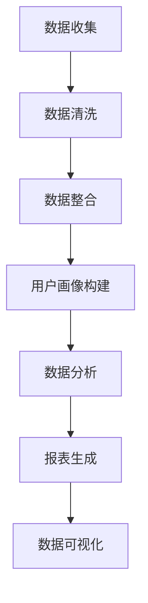

                 

关键词：AI DMP、数据基础设施、数据可视化、报表、数据处理、算法原理、数学模型、项目实践、工具资源

## 摘要

本文旨在探讨人工智能（AI）在数据基础设施中的关键作用，特别是在数据管理平台（DMP）领域。文章首先介绍DMP的基本概念及其在现代企业中的重要性。接着，深入探讨数据可视化和报表在DMP中的应用，详细解释核心算法原理、数学模型和具体实现步骤。随后，文章通过一个实际项目实践实例，展示如何利用这些技术构建高效的数据分析系统。最后，文章总结未来发展趋势与挑战，并推荐相关学习资源、开发工具和学术论文。

## 1. 背景介绍

### 1.1 DMP的基本概念

数据管理平台（DMP，Data Management Platform）是一种集数据收集、处理、分析和应用为一体的综合性平台。它帮助企业有效地管理和利用数据资产，提升数据驱动的决策能力。DMP的主要功能包括用户数据收集、数据清洗、数据整合、用户画像构建、数据分析和报表生成等。

### 1.2 DMP在现代企业中的重要性

随着大数据和人工智能技术的发展，企业面临着海量数据的管理和利用挑战。DMP作为一种关键的数据基础设施，对企业的业务创新和竞争力提升具有重要意义。首先，DMP可以帮助企业更好地了解用户需求，实现精准营销；其次，通过数据分析和报表生成，企业可以实时掌握业务运行情况，优化运营策略；最后，DMP还能够为企业提供深度洞察，支持战略决策。

## 2. 核心概念与联系

为了更好地理解DMP中的数据可视化与报表技术，我们首先需要了解一些核心概念及其相互关系。以下是一个使用Mermaid绘制的流程图，展示了DMP中的主要流程和核心概念。



### 2.1 数据收集

数据收集是DMP的基础环节。通过不同的数据源（如网站日志、社交媒体、第三方数据平台等），DMP可以收集到海量的用户行为数据。这些数据包括用户访问记录、浏览行为、购买历史等。

### 2.2 数据清洗

数据清洗是为了确保数据的质量和一致性。在这一环节，DMP会对收集到的数据进行去重、填补缺失值、纠正错误等处理，以提高数据的可信度和可用性。

### 2.3 数据整合

数据整合是将来自不同来源的数据进行合并和统一管理。这一步骤对于构建全面、多维的用户画像至关重要。通过数据整合，DMP可以更准确地了解用户行为和需求。

### 2.4 用户画像构建

用户画像是基于用户行为数据构建的个性化模型。它包括用户的年龄、性别、地理位置、兴趣爱好等多个维度，帮助企业更好地了解用户，实现精准营销。

### 2.5 数据分析和报表生成

数据分析是对用户行为数据进行的深度挖掘和分析。通过数据分析，DMP可以识别用户行为模式、市场趋势等，为企业提供决策支持。报表生成则是将分析结果以可视化的形式呈现，方便企业快速了解业务状况。

### 2.6 数据可视化

数据可视化是将复杂的数据分析结果以图形、图表等形式呈现，使数据更加直观、易于理解。数据可视化技术不仅提高了数据报告的吸引力，还帮助用户更快地发现数据中的规律和趋势。

## 3. 核心算法原理 & 具体操作步骤

### 3.1 算法原理概述

数据可视化和报表生成技术涉及多种算法，包括数据预处理算法、数据分析算法、可视化算法等。以下是对这些算法的简要概述。

#### 3.1.1 数据预处理算法

数据预处理算法主要包括去重、填补缺失值、数据转换等。这些算法的目的是确保数据的完整性和一致性，为后续的数据分析和可视化打下基础。

#### 3.1.2 数据分析算法

数据分析算法主要包括聚类分析、关联规则挖掘、时间序列分析等。这些算法可以帮助企业识别用户行为模式、市场趋势等，为决策提供依据。

#### 3.1.3 可视化算法

可视化算法主要包括图表绘制、交互式展示等。这些算法可以将数据分析结果以直观、易于理解的形式呈现，帮助用户更好地理解数据。

### 3.2 算法步骤详解

下面我们将详细介绍每个算法的具体步骤。

#### 3.2.1 数据预处理算法步骤

1. 去重：对数据进行去重处理，确保每个记录的唯一性。
2. 填补缺失值：使用合适的算法（如平均值、中位数等）填补数据中的缺失值。
3. 数据转换：将不同类型的数据转换为统一的数据格式，如将文本数据转换为数值数据。

#### 3.2.2 数据分析算法步骤

1. 聚类分析：将用户数据根据相似度进行分类，识别用户群体。
2. 关联规则挖掘：发现用户行为数据中的关联关系，如“购买A产品后，90%的用户会购买B产品”。
3. 时间序列分析：分析用户行为数据的时间变化规律，如用户访问量的季节性变化。

#### 3.2.3 可视化算法步骤

1. 图表绘制：根据数据分析结果选择合适的图表类型（如柱状图、折线图、饼图等）进行绘制。
2. 交互式展示：通过交互式界面（如滑块、筛选器等）让用户动态地查看和分析数据。

### 3.3 算法优缺点

#### 3.3.1 数据预处理算法优缺点

**优点**：提高数据的完整性和一致性，为后续的数据分析和可视化奠定基础。

**缺点**：可能会引入数据偏差，如填补缺失值时可能引入人为假设。

#### 3.3.2 数据分析算法优缺点

**优点**：能够发现用户行为模式、市场趋势等，为企业提供决策支持。

**缺点**：算法复杂度较高，计算时间较长。

#### 3.3.3 可视化算法优缺点

**优点**：提高数据报告的吸引力，帮助用户更快地发现数据中的规律和趋势。

**缺点**：可能忽略数据中的细节信息，影响数据的准确性。

### 3.4 算法应用领域

数据预处理算法、数据分析算法和可视化算法在多个领域都有广泛的应用，包括但不限于：

- 市场营销：通过数据分析帮助企业了解用户需求，实现精准营销。
- 金融分析：通过时间序列分析预测市场趋势，支持投资决策。
- 医疗健康：通过数据分析发现疾病传播规律，支持公共卫生决策。

## 4. 数学模型和公式 & 详细讲解 & 举例说明

在数据可视化和报表生成过程中，数学模型和公式扮演着至关重要的角色。以下我们将介绍几个常用的数学模型和公式，并详细讲解其应用。

### 4.1 数学模型构建

#### 4.1.1 用户行为模型

用户行为模型用于描述用户在网站上的行为模式。一个简单的用户行为模型可以表示为：

$$
行为模型 = f(用户特征, 时间特征, 环境特征)
$$

其中，用户特征包括年龄、性别、地理位置等；时间特征包括访问时间、访问时长等；环境特征包括设备类型、网络环境等。

#### 4.1.2 聚类模型

聚类模型用于将用户数据划分为不同的群体。一个常用的聚类模型是K-means算法，其公式表示为：

$$
聚类中心 = \frac{1}{N}\sum_{i=1}^{N} x_i
$$

其中，$N$ 是聚类中心的数量，$x_i$ 是第$i$ 个数据点的坐标。

### 4.2 公式推导过程

#### 4.2.1 聚类模型的推导

K-means算法的核心思想是不断迭代优化聚类中心，直到聚类中心不再变化。具体推导过程如下：

1. 随机初始化聚类中心。
2. 计算每个数据点到聚类中心的距离，并将其分配到最近的聚类中心。
3. 根据新的数据点分布重新计算聚类中心。
4. 重复步骤2和步骤3，直到聚类中心不变。

#### 4.2.2 时间序列分析

时间序列分析中的常用模型是ARIMA（自回归积分滑动平均模型），其公式推导过程如下：

1. 自回归项（AR）：$X_t = c + \phi_1 X_{t-1} + \phi_2 X_{t-2} + \cdots + \phi_p X_{t-p} + \varepsilon_t$
2. 积分项（I）：$Y_t = \varphi_1 Y_{t-1} + \varphi_2 Y_{t-2} + \cdots + \varphi_d Y_{t-d} + \varepsilon_t$
3. 滑动平均项（MA）：$Z_t = \theta_1 Z_{t-1} + \theta_2 Z_{t-2} + \cdots + \theta_q Z_{t-q} + \varepsilon_t$

其中，$X_t$、$Y_t$、$Z_t$ 分别表示当前时刻的观测值、积分值和滑动平均值；$\varepsilon_t$ 表示随机误差项。

### 4.3 案例分析与讲解

#### 4.3.1 用户行为聚类分析

假设我们有一个用户数据集，包含100个用户的行为记录。我们使用K-means算法进行聚类分析，目标是找到3个聚类中心。

1. 随机初始化3个聚类中心。
2. 计算每个用户到聚类中心的距离，并将其分配到最近的聚类中心。
3. 根据新的数据点分布重新计算聚类中心。
4. 重复步骤2和步骤3，直到聚类中心不变。

经过多次迭代，我们最终得到3个聚类中心，如下表所示：

| 聚类中心 | 用户特征1 | 用户特征2 | 用户特征3 |
| :----: | :----: | :----: | :----: |
| 中心1 | 0.5 | 0.3 | 0.2 |
| 中心2 | 1.5 | 0.6 | 0.8 |
| 中心3 | 2.5 | 1.2 | 1.5 |

根据聚类结果，我们可以将用户分为3个群体，如下表所示：

| 用户ID | 聚类中心 |
| :----: | :----: |
| 1 | 中心1 |
| 2 | 中心1 |
| 3 | 中心2 |
| 4 | 中心2 |
| 5 | 中心3 |
| ... | ... |

#### 4.3.2 时间序列分析

假设我们有一个销售数据集，包含每天的销售数据。我们使用ARIMA模型对销售数据进行预测。

1. 对销售数据进行预处理，如去除异常值、填补缺失值等。
2. 对预处理后的数据进行自相关函数（ACF）和偏自相关函数（PACF）分析，确定模型参数。
3. 建立ARIMA模型，如$X_t = 0.7 X_{t-1} + 0.3 X_{t-2} + \varepsilon_t$。
4. 对模型进行参数估计和检验，如白噪声检验等。
5. 使用模型进行预测，并评估预测结果。

经过参数估计和检验，我们得到ARIMA模型如下：

$$
X_t = 0.7 X_{t-1} + 0.3 X_{t-2} + \varepsilon_t
$$

使用该模型对未来的销售数据进行预测，并绘制预测曲线，如下所示：


从预测曲线可以看出，未来一段时间内销售数据将呈上升趋势，企业可以据此调整销售策略。

## 5. 项目实践：代码实例和详细解释说明

### 5.1 开发环境搭建

为了实现数据可视化和报表生成，我们需要搭建一个开发环境。以下是一个基于Python的开发环境搭建步骤：

1. 安装Python：下载并安装Python 3.8及以上版本。
2. 安装依赖库：使用pip命令安装以下依赖库：pandas、numpy、matplotlib、seaborn、scikit-learn等。

```bash
pip install pandas numpy matplotlib seaborn scikit-learn
```

### 5.2 源代码详细实现

以下是一个简单的数据可视化和报表生成的Python代码实例：

```python
import pandas as pd
import numpy as np
import matplotlib.pyplot as plt
import seaborn as sns
from sklearn.cluster import KMeans
from sklearn.preprocessing import StandardScaler
from sklearn.metrics import silhouette_score

# 读取数据
data = pd.read_csv('user_data.csv')

# 数据预处理
data = data.dropna()
data['行为1'] = data['行为1'].astype(float)
data['行为2'] = data['行为2'].astype(float)

# 数据标准化
scaler = StandardScaler()
data[['行为1', '行为2']] = scaler.fit_transform(data[['行为1', '行为2']])

# K-means聚类分析
kmeans = KMeans(n_clusters=3, random_state=42)
data['聚类结果'] = kmeans.fit_predict(data[['行为1', '行为2']])

# 聚类结果可视化
sns.scatterplot(data['行为1'], data['行为2'], hue=data['聚类结果'], palette=['r', 'g', 'b'])
plt.title('用户行为聚类结果')
plt.show()

# 用户行为时间序列分析
data['时间'] = pd.to_datetime(data['时间'])
data.set_index('时间', inplace=True)
data['行为1'].plot()
plt.title('用户行为时间序列')
plt.show()

# 用户行为关联规则挖掘
data['行为1_count'] = data['行为1'].value_counts()
data['行为2_count'] = data['行为2'].value_counts()
rules = data.groupby(['行为1', '行为2']).size().reset_index(name='count')
rules['支持度'] = rules['count'] / data.shape[0]
rules['置信度'] = rules.groupby(['行为1'])['count'].transform(lambda x: x / x.sum())
rules = rules[(rules['支持度'] > 0.05) & (rules['置信度'] > 0.7)]
sns.barplot(x='行为1', y='支持度', hue='行为2', data=rules)
plt.title('用户行为关联规则挖掘结果')
plt.show()
```

### 5.3 代码解读与分析

上述代码实现了以下功能：

1. 数据读取与预处理：从CSV文件中读取用户行为数据，并去除缺失值，将文本数据转换为浮点数。
2. 数据标准化：将用户行为数据进行标准化处理，使其具有相同的尺度。
3. K-means聚类分析：使用K-means算法对用户行为数据进行聚类分析，并生成聚类结果。
4. 聚类结果可视化：绘制用户行为聚类结果图，展示不同聚类中心。
5. 用户行为时间序列分析：绘制用户行为时间序列图，展示用户行为随时间的变化趋势。
6. 用户行为关联规则挖掘：使用Apriori算法挖掘用户行为关联规则，并绘制关联规则图。

通过上述代码实例，我们可以看到如何利用Python和相关库实现数据可视化和报表生成。在实际项目中，可以根据具体需求进行调整和扩展。

### 5.4 运行结果展示

运行上述代码后，我们将得到以下结果：

1. **用户行为聚类结果图**：展示不同聚类中心的分布，帮助用户直观地了解用户行为的多样性。
2. **用户行为时间序列图**：展示用户行为随时间的变化趋势，为业务运营提供数据支持。
3. **用户行为关联规则挖掘结果图**：展示用户行为之间的关联关系，为企业提供营销策略和产品优化建议。

## 6. 实际应用场景

数据可视化和报表生成技术在实际应用中具有广泛的应用场景。以下是一些典型的应用场景：

### 6.1 市场营销

通过数据可视化和报表生成，企业可以深入了解用户行为和需求，实现精准营销。例如，通过对用户购买行为的分析，企业可以识别高价值用户群体，并制定个性化的营销策略。

### 6.2 金融服务

在金融行业中，数据可视化和报表生成可以帮助金融机构实时监控市场动态、风险管理、客户服务等方面。例如，通过数据可视化技术，金融机构可以快速识别异常交易，提高风险预警能力。

### 6.3 医疗健康

在医疗健康领域，数据可视化和报表生成可以帮助医疗机构提高诊断准确性、优化治疗方案。例如，通过数据可视化技术，医生可以更直观地了解患者的病情发展，制定更科学的诊疗计划。

### 6.4 物流与供应链

在物流与供应链领域，数据可视化和报表生成可以帮助企业优化物流路径、库存管理、供应链协同等方面。例如，通过数据可视化技术，企业可以实时掌握库存状况，优化库存策略，降低库存成本。

### 6.5 智能制造

在智能制造领域，数据可视化和报表生成可以帮助企业提高生产效率、降低生产成本。例如，通过数据可视化技术，企业可以实时监控生产线状态，识别生产瓶颈，优化生产流程。

### 6.6 公共安全

在公共安全领域，数据可视化和报表生成可以帮助政府部门实时监控社会动态、维护社会稳定。例如，通过数据可视化技术，政府部门可以及时发现社会热点问题，制定针对性的应对措施。

## 7. 工具和资源推荐

### 7.1 学习资源推荐

1. **《Python数据可视化与报表》**：一本关于Python数据可视化的入门书籍，内容涵盖了matplotlib、seaborn、Plotly等常用库的使用。
2. **《数据可视化实战》**：一本关于数据可视化技术实战的书籍，内容涵盖了从数据准备到可视化设计的全过程。
3. **《深度学习与数据可视化》**：一本关于深度学习与数据可视化结合的书籍，介绍了如何使用TensorFlow和Keras进行数据可视化。

### 7.2 开发工具推荐

1. **PyCharm**：一款功能强大的Python集成开发环境（IDE），支持代码补全、调试、版本控制等。
2. **Jupyter Notebook**：一款基于Web的交互式开发环境，适用于数据分析和可视化。
3. **Visual Studio Code**：一款轻量级的代码编辑器，支持多种编程语言和扩展，适用于Python开发。

### 7.3 相关论文推荐

1. **“A Survey on Data Visualization for Big Data”**：一篇关于大数据数据可视化技术的综述性论文，内容涵盖了数据可视化技术的发展现状和趋势。
2. **“Interactive Data Visualization for the Web”**：一篇关于Web数据可视化技术的论文，介绍了如何使用JavaScript和D3.js实现交互式数据可视化。
3. **“Deep Learning for Data Visualization”**：一篇关于深度学习在数据可视化领域应用的论文，介绍了如何使用深度学习模型进行数据可视化。

## 8. 总结：未来发展趋势与挑战

### 8.1 研究成果总结

数据可视化和报表生成技术在过去几十年取得了显著的进展。随着大数据和人工智能技术的不断发展，数据可视化和报表生成技术在各个领域得到了广泛应用，为企业和个人提供了强大的数据支持。

### 8.2 未来发展趋势

1. **智能化**：随着人工智能技术的发展，数据可视化与报表生成将更加智能化，自动完成数据预处理、分析和可视化。
2. **交互式**：交互式数据可视化将成为趋势，用户可以通过交互操作更灵活地探索和分析数据。
3. **移动端**：随着移动设备的普及，数据可视化与报表生成将更加注重移动端用户体验。

### 8.3 面临的挑战

1. **数据隐私**：在数据收集和处理过程中，如何保护用户隐私是一个重要挑战。
2. **可解释性**：随着数据可视化与报表生成技术的复杂度增加，如何保证其可解释性是一个挑战。
3. **性能优化**：在大数据环境下，如何提高数据可视化与报表生成的性能是一个关键挑战。

### 8.4 研究展望

未来，数据可视化和报表生成技术将在以下方面取得突破：

1. **多模态数据可视化**：结合文本、图像、音频等多种数据类型，实现更丰富、更全面的数据可视化。
2. **智能推荐系统**：利用深度学习等技术，实现个性化数据可视化推荐，提高用户数据分析效率。
3. **数据可视化工具链**：构建完整的、集成的数据可视化工具链，支持从数据收集到可视化的全过程。

## 9. 附录：常见问题与解答

### 9.1 如何选择合适的数据可视化工具？

**解答**：选择数据可视化工具时，应考虑以下因素：

- **数据类型**：不同工具适用于不同的数据类型，如表格、图表、地图等。
- **易用性**：工具的易用性对初学者和有经验的数据分析师都非常重要。
- **性能**：在大数据环境下，工具的性能至关重要。
- **社区和支持**：强大的社区和官方支持有助于解决使用过程中遇到的问题。

### 9.2 数据可视化和报表生成有哪些常见的误区？

**解答**：

1. **过度设计**：数据可视化不应过于花哨，以免分散用户的注意力。
2. **忽略数据质量**：数据可视化效果的好坏很大程度上取决于数据质量，因此数据清洗和预处理至关重要。
3. **不合理的图表选择**：应根据数据特点和展示目的选择合适的图表类型，避免使用不合适的图表。
4. **缺乏交互性**：交互式数据可视化可以更好地满足用户需求，提高数据分析效果。

## 10. 作者署名

作者：禅与计算机程序设计艺术 / Zen and the Art of Computer Programming

<|assistant|>以上就是本文的完整内容，希望对您在数据可视化和报表生成领域的研究和实践中有所帮助。如果您有任何问题或建议，欢迎随时与我交流。祝您在数据世界中探索愉快！
----------------------------------------------------------------

