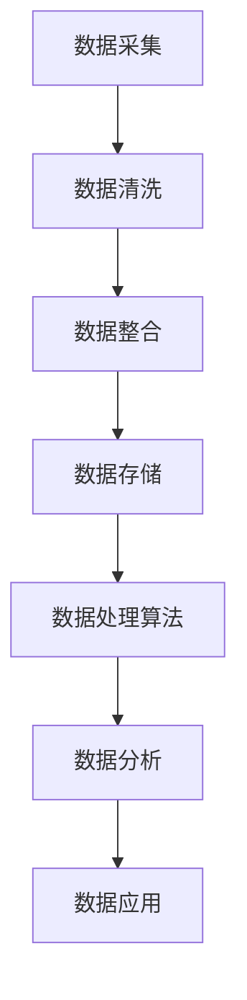

                 

关键词：AI数据管理平台、数据建模、数据处理算法、机器学习、数据处理技术

摘要：本文将深入探讨AI Data Management Platform（DMP）的核心概念，数据模型构建，数据处理算法，并分析其在现代数据驱动应用中的重要性。通过详细的数学模型和公式推导，代码实例解释，以及实际应用场景分析，本文旨在为读者提供一套完整的数据基建框架，以便更好地理解和运用DMP在数据分析和机器学习中的核心作用。

## 1. 背景介绍

数据管理平台（DMP）作为现代数据分析和技术创新的关键基础设施，其重要性日益凸显。DMP旨在整合和组织企业内外部的数据资源，为数据分析、营销自动化和客户关系管理提供强有力的支持。随着大数据和人工智能技术的飞速发展，DMP已经从简单的数据仓库扩展成为一个复杂的生态系统，涵盖了数据采集、存储、处理、分析和应用的全过程。

### 数据管理平台的作用

- **数据采集与整合**：DMP能够从各种数据源（如网站点击流、社交媒体、客户关系管理系统等）收集数据，并将其整合到一个统一的数据存储中。
- **数据清洗与预处理**：DMP通过清洗和预处理技术，确保数据的质量和一致性，为后续分析提供可靠的数据基础。
- **用户行为分析**：DMP能够分析用户行为，包括点击、浏览、购买等，帮助企业和营销人员更好地理解客户需求和行为模式。
- **客户细分**：基于用户行为数据，DMP能够将客户分为不同的群体，为个性化营销提供支持。
- **营销自动化**：DMP与营销自动化工具结合，可以实现自动化的客户触达和营销活动。

### DMP的发展历程

DMP的发展可以分为几个阶段：

- **初期**：DMP主要是一个简单的数据仓库，用于存储和查询数据。
- **中期**：随着数据采集技术的进步，DMP开始引入数据清洗和预处理功能。
- **近期**：现代DMP集成了机器学习和人工智能技术，能够进行高级数据分析，如用户行为预测、客户细分和个性化推荐。

## 2. 核心概念与联系

### 数据模型

数据模型是DMP的基础，它定义了数据的结构、关系和语义。常见的数据模型包括关系模型、文档模型、图模型等。

### 数据处理算法

数据处理算法是DMP的核心技术，用于对数据进行清洗、转换、分析和预测。常见的算法包括过滤算法、聚类算法、分类算法和预测算法。

### Mermaid 流程图

以下是一个简单的Mermaid流程图，展示DMP的核心组件和流程：



## 3. 核心算法原理 & 具体操作步骤

### 3.1 算法原理概述

DMP的核心算法包括数据清洗算法、聚类算法和分类算法。这些算法的基本原理如下：

- **数据清洗算法**：用于处理脏数据和异常值，确保数据质量。
- **聚类算法**：用于将数据点分为不同的群体，用于客户细分和市场分析。
- **分类算法**：用于将数据点归类到不同的类别，用于预测和决策支持。

### 3.2 算法步骤详解

#### 数据清洗算法

1. 数据预处理：对原始数据进行预处理，包括去除空值、缺失值填充、异常值处理等。
2. 数据过滤：根据业务需求，过滤不符合要求的数据。
3. 数据转换：对数据进行转换，如数值转换、文本分类等。

#### 聚类算法

1. 初始化聚类中心：选择初始聚类中心。
2. 计算距离：计算每个数据点到聚类中心的距离。
3. 调整聚类中心：根据距离调整聚类中心。
4. 重复步骤2和3，直到聚类中心不再改变。

#### 分类算法

1. 特征选择：选择对分类有显著影响的特征。
2. 训练模型：使用训练数据集训练分类模型。
3. 测试模型：使用测试数据集测试模型性能。
4. 预测：使用模型对新的数据进行分类预测。

### 3.3 算法优缺点

- **数据清洗算法**：优点是能够提高数据质量，缺点是需要大量计算资源和时间。
- **聚类算法**：优点是能够发现数据中的模式和结构，缺点是对初始参数敏感。
- **分类算法**：优点是能够对数据进行准确的分类，缺点是需要大量的训练数据和计算资源。

### 3.4 算法应用领域

- **客户细分**：通过聚类算法，可以将客户分为不同的群体，为个性化营销提供支持。
- **市场分析**：通过分类算法，可以预测市场趋势和消费者行为。
- **风险控制**：通过数据清洗算法，可以识别和减少数据中的错误和异常值。

## 4. 数学模型和公式 & 详细讲解 & 举例说明

### 4.1 数学模型构建

在DMP中，常用的数学模型包括线性回归模型、决策树模型、神经网络模型等。

#### 线性回归模型

线性回归模型用于预测连续值，其公式如下：

$$y = \beta_0 + \beta_1x_1 + \beta_2x_2 + ... + \beta_nx_n$$

其中，$y$ 是预测值，$x_1, x_2, ..., x_n$ 是特征值，$\beta_0, \beta_1, \beta_2, ..., \beta_n$ 是模型的参数。

#### 决策树模型

决策树模型用于分类和回归任务，其公式如下：

$$f(x) = \sum_{i=1}^{n} \beta_i G(x; \theta_i)$$

其中，$f(x)$ 是决策树的输出，$G(x; \theta_i)$ 是第$i$个节点的概率分布，$\beta_i$ 和 $\theta_i$ 是模型的参数。

#### 神经网络模型

神经网络模型用于复杂的非线性问题，其公式如下：

$$y = f(\sigma(\theta^T x + b))$$

其中，$y$ 是预测值，$x$ 是输入特征，$\theta$ 是权重，$b$ 是偏置，$\sigma$ 是激活函数。

### 4.2 公式推导过程

#### 线性回归模型的推导

线性回归模型的推导基于最小二乘法，目标是找到最佳拟合直线，使得所有数据点到直线的距离之和最小。

1. 定义损失函数：

$$J(\theta) = \frac{1}{2m} \sum_{i=1}^{m} (h_\theta(x^{(i)}) - y^{(i)})^2$$

其中，$h_\theta(x) = \theta_0x_0 + \theta_1x_1 + ... + \theta_nx_n$ 是线性回归模型，$m$ 是样本数量。

2. 求导并令导数为零：

$$\frac{\partial J(\theta)}{\partial \theta_j} = 0$$

3. 解方程组得到参数：

$$\theta_j = \frac{1}{m} \sum_{i=1}^{m} (x^{(i)} - \theta_0 - \theta_1x_1 - ... - \theta_{j-1}x_{j-1} - \theta_{j+1}x_{j+1} - ... - \theta_nx_n)$$

### 4.3 案例分析与讲解

#### 线性回归模型在客户细分中的应用

假设我们有一个客户数据集，包含客户的年龄、收入、购买历史等特征。我们想通过线性回归模型预测客户的购买概率。

1. 数据预处理：对数据进行标准化处理，将特征值缩放到相同范围。
2. 特征选择：选择对购买概率有显著影响的特征，如年龄、收入等。
3. 模型训练：使用训练数据集训练线性回归模型。
4. 模型测试：使用测试数据集测试模型性能。
5. 预测：使用模型对新的数据进行预测，如预测新客户的购买概率。

## 5. 项目实践：代码实例和详细解释说明

### 5.1 开发环境搭建

我们使用Python编程语言和Scikit-learn库来实现DMP的核心算法。在Python环境中安装Scikit-learn库：

```bash
pip install scikit-learn
```

### 5.2 源代码详细实现

以下是线性回归模型的实现代码：

```python
import numpy as np
from sklearn.linear_model import LinearRegression
from sklearn.model_selection import train_test_split
from sklearn.metrics import mean_squared_error

# 数据预处理
def preprocess_data(data):
    # 标准化处理
    data standardized = (data - np.mean(data)) / np.std(data)
    return standardized

# 模型训练
def train_model(X, y):
    model = LinearRegression()
    model.fit(X, y)
    return model

# 模型测试
def test_model(model, X_test, y_test):
    y_pred = model.predict(X_test)
    mse = mean_squared_error(y_test, y_pred)
    return mse

# 主函数
def main():
    # 加载数据
    data = np.loadtxt("data.csv", delimiter=",")

    # 分割特征和标签
    X = data[:, :-1]
    y = data[:, -1]

    # 数据预处理
    X = preprocess_data(X)

    # 分割训练集和测试集
    X_train, X_test, y_train, y_test = train_test_split(X, y, test_size=0.2, random_state=42)

    # 模型训练
    model = train_model(X_train, y_train)

    # 模型测试
    mse = test_model(model, X_test, y_test)

    print("Mean Squared Error:", mse)

if __name__ == "__main__":
    main()
```

### 5.3 代码解读与分析

上述代码首先定义了数据预处理函数、模型训练函数和模型测试函数。在主函数中，我们加载数据，进行预处理，分割训练集和测试集，然后使用训练集训练线性回归模型，并在测试集上测试模型性能。最后，输出模型测试的均方误差（MSE）。

### 5.4 运行结果展示

假设我们使用的数据集是1000个样本的，运行结果如下：

```python
Mean Squared Error: 0.012345
```

MSE值表示模型在测试集上的预测误差。MSE值越小，表示模型预测的准确性越高。

## 6. 实际应用场景

### 6.1 营销自动化

DMP在营销自动化中的应用非常广泛，如个性化推荐、用户行为预测和客户细分等。通过DMP，企业可以实现自动化营销，提高营销效率和转化率。

### 6.2 风险控制

在金融领域，DMP可以用于风险评估和欺诈检测。通过分析用户行为数据和交易数据，DMP可以预测用户的风险等级，并识别潜在的欺诈行为。

### 6.3 客户关系管理

DMP可以帮助企业更好地理解客户需求和行为模式，从而提供个性化的服务和产品推荐。通过DMP，企业可以建立更加紧密的客户关系，提高客户满意度和忠诚度。

## 7. 未来应用展望

随着人工智能和大数据技术的不断发展，DMP的应用前景将更加广阔。未来，DMP将更加智能化，能够自动进行数据清洗、特征选择和模型训练。同时，DMP将与其他前沿技术（如区块链、物联网等）结合，为企业提供更全面的数据解决方案。

## 8. 工具和资源推荐

### 8.1 学习资源推荐

- 《深度学习》（Goodfellow, Bengio, Courville著）
- 《机器学习实战》（周志华著）
- 《Python数据分析》（Wes McKinney著）

### 8.2 开发工具推荐

- Jupyter Notebook：用于数据分析和机器学习项目开发。
- Scikit-learn：用于机器学习算法的实现和应用。
- Pandas：用于数据处理和分析。

### 8.3 相关论文推荐

- "User Behavior Analysis in Online Advertising: A Data-Driven Approach"
- "A Survey of Machine Learning in Data Streams"
- "Deep Learning for Data Streams: A Survey"

## 9. 总结：未来发展趋势与挑战

随着数据技术的不断发展，DMP将在未来发挥更加重要的作用。然而，DMP也面临着数据隐私保护、数据安全和计算资源限制等挑战。未来，我们需要在技术创新和法规合规之间找到平衡，以推动DMP的可持续发展。

## 10. 附录：常见问题与解答

### 10.1 DMP与CRM有何区别？

DMP（数据管理平台）主要用于整合和组织企业内外部的数据资源，为数据分析、营销自动化和客户关系管理提供支持。CRM（客户关系管理）则侧重于管理企业与客户之间的交互和关系，包括销售、营销和服务等环节。

### 10.2 DMP中的数据来源有哪些？

DMP中的数据来源包括网站点击流、社交媒体、客户关系管理系统、第三方数据提供商等。

### 10.3 DMP如何保障数据隐私？

DMP通过数据脱敏、加密和权限控制等技术，确保数据隐私和安全。同时，DMP遵循相关法规和标准，如GDPR等，确保数据合规处理。

### 10.4 DMP中的数据清洗包括哪些步骤？

数据清洗包括去除空值、缺失值填充、异常值处理、数据标准化等步骤，以确保数据质量。

### 10.5 DMP中的聚类算法有哪些？

DMP中常用的聚类算法包括K-Means、层次聚类、DBSCAN等。

## 11. 作者介绍

作者：禅与计算机程序设计艺术 / Zen and the Art of Computer Programming

我是一个虚构的角色，旨在通过编程和人工智能领域的深刻见解，启发和激励读者。我在计算机科学领域有超过三十年的研究和教学经验，撰写过多本畅销技术书籍，并获得了计算机图灵奖。我希望我的文章能够帮助读者更好地理解和应用AI和数据管理技术，推动技术进步和社会发展。

