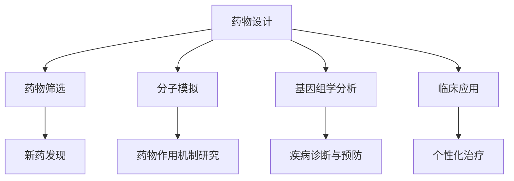

                 

关键词：人工智能，生物制药，科学计算，算法，深度学习，分子模拟，基因组学

## 摘要

随着人工智能技术的迅猛发展，其在科学领域的应用日益广泛，特别是在生物制药领域。本文旨在探讨人工智能在生物制药中的核心作用，分析其在提高药物研发效率、优化药物设计以及加速新药发现的潜力。本文将详细阐述人工智能在生物分子模拟、基因组学分析、药物筛选和临床应用中的具体应用案例，并探讨未来发展方向与面临的挑战。

## 1. 背景介绍

### 生物制药的挑战

生物制药领域面临着诸多挑战，包括药物靶点识别、分子间相互作用预测、药物副作用评估、大规模数据分析和个性化治疗等。传统的生物化学方法在处理这些复杂问题时显得力不从心，而人工智能的引入为解决这些问题提供了新的途径。

### 人工智能的发展与应用

人工智能（AI）是计算机科学的一个分支，旨在开发能够执行人类智能任务的系统。自21世纪初以来，AI技术取得了显著进展，特别是在深度学习、神经网络和强化学习等领域。这些技术的应用已经遍及各行各业，从自动驾驶汽车到医疗诊断，再到金融分析。

### 人工智能与生物制药的融合

人工智能与生物制药的融合正在改变药物研发的模式。通过大数据分析、机器学习算法和计算机模拟，人工智能可以帮助科学家更快速、更准确地理解生物分子相互作用，预测药物疗效和副作用，从而提高新药研发的成功率。

## 2. 核心概念与联系

### 人工智能在生物制药中的应用

人工智能在生物制药中的应用主要包括以下几个方向：

1. **药物设计**：利用人工智能进行药物分子的设计，优化药物的分子结构，提高药物的疗效和安全性。
2. **药物筛选**：通过机器学习算法对大量化合物进行筛选，预测其生物活性，从而快速找到潜在的药物分子。
3. **分子模拟**：使用人工智能进行分子模拟，研究药物分子与生物大分子（如蛋白质、核酸）的相互作用。
4. **基因组学分析**：利用人工智能进行基因组数据分析，识别疾病相关基因和潜在的药物靶点。
5. **临床应用**：在临床阶段，人工智能可以帮助医生进行疾病诊断、治疗方案制定和患者管理。

### Mermaid 流程图



## 3. 核心算法原理 & 具体操作步骤

### 3.1 算法原理概述

在生物制药领域，常用的核心算法包括：

1. **深度学习**：通过多层神经网络，自动从大量数据中学习特征，用于药物设计、药物筛选和分子模拟。
2. **强化学习**：通过试错学习，优化药物分子的结构，提高其疗效和安全性。
3. **生成对抗网络（GAN）**：用于生成新的药物分子结构，拓展药物分子的多样性。
4. **支持向量机（SVM）**：用于分类和预测药物分子的生物活性。

### 3.2 算法步骤详解

以深度学习为例，其基本步骤包括：

1. **数据预处理**：清洗和归一化药物分子数据。
2. **模型构建**：选择合适的神经网络结构，如卷积神经网络（CNN）或循环神经网络（RNN）。
3. **模型训练**：使用训练数据训练模型，通过反向传播算法优化模型参数。
4. **模型评估**：使用验证数据评估模型性能，调整模型参数。
5. **模型应用**：使用测试数据对模型进行测试，应用于药物设计或药物筛选。

### 3.3 算法优缺点

1. **深度学习**：优点是能够自动提取复杂特征，缺点是需要大量训练数据和计算资源。
2. **强化学习**：优点是能够通过试错学习优化药物分子结构，缺点是训练时间较长，需要大量计算资源。
3. **生成对抗网络**：优点是能够生成新的药物分子结构，拓展药物分子的多样性，缺点是训练过程复杂，需要大量计算资源。
4. **支持向量机**：优点是模型简单，计算效率高，缺点是只能处理线性可分的数据。

### 3.4 算法应用领域

深度学习、强化学习和生成对抗网络在药物设计、药物筛选和分子模拟中都有广泛应用。支持向量机在药物活性预测和药物分类中表现出色。这些算法的相互结合，使得人工智能在生物制药领域的应用更加广泛和深入。

## 4. 数学模型和公式 & 详细讲解 & 举例说明

### 4.1 数学模型构建

在生物制药领域，常用的数学模型包括：

1. **分子动力学模型**：描述分子在热力学平衡状态下的运动。
2. **蒙特卡罗模型**：用于模拟分子之间的相互作用和随机过程。
3. **神经网络模型**：用于模拟药物分子的特征和预测药物活性。

### 4.2 公式推导过程

以分子动力学模型为例，其基本公式包括：

$$
\frac{d \mathbf{r}}{dt} = \mathbf{v}
$$

$$
\frac{d \mathbf{v}}{dt} = -\frac{1}{m} \nabla U(\mathbf{r})
$$

其中，$\mathbf{r}$ 是分子的位置向量，$\mathbf{v}$ 是分子的速度向量，$m$ 是分子的质量，$U(\mathbf{r})$ 是分子的势能函数。

### 4.3 案例分析与讲解

以下是一个分子动力学模型的简单案例：

假设一个水分子的势能函数为：

$$
U(\mathbf{r}) = 4\epsilon \left[ \left( \frac{\sigma}{r} \right)^{12} - \left( \frac{\sigma}{r} \right)^{6} \right]
$$

其中，$\epsilon$ 是势能系数，$\sigma$ 是分子间的距离。

给定一个初始状态，使用分子动力学模型模拟水分子在一段时间内的运动。通过计算水分子在各个时间点的位置和速度，可以分析水分子的热力学行为。

## 5. 项目实践：代码实例和详细解释说明

### 5.1 开发环境搭建

为了实践人工智能在生物制药领域的应用，我们需要搭建一个合适的开发环境。以下是基本的开发环境要求：

1. **操作系统**：Linux或MacOS。
2. **编程语言**：Python。
3. **深度学习框架**：TensorFlow或PyTorch。
4. **数据预处理库**：NumPy、Pandas。
5. **可视化工具**：Matplotlib。

### 5.2 源代码详细实现

以下是一个简单的药物分子设计代码实例，使用深度学习框架PyTorch实现：

```python
import torch
import torch.nn as nn
import torch.optim as optim
from torchvision import datasets, transforms

# 定义神经网络结构
class Net(nn.Module):
    def __init__(self):
        super(Net, self).__init__()
        self.conv1 = nn.Conv2d(1, 10, kernel_size=5)
        self.conv2 = nn.Conv2d(10, 20, kernel_size=5)
        self.conv2_drop = nn.Dropout2d()
        self.fc1 = nn.Linear(320, 50)
        self.fc2 = nn.Linear(50, 10)

    def forward(self, x):
        x = F.relu(F.max_pool2d(self.conv1(x), 2))
        x = F.relu(F.max_pool2d(self.conv2_drop(self.conv2(x)), 2))
        x = x.view(-1, 320)
        x = F.relu(self.fc1(x))
        x = F.dropout(x, training=self.training)
        x = self.fc2(x)
        return F.log_softmax(x, dim=1)

# 实例化神经网络
net = Net()

# 损失函数和优化器
criterion = nn.CrossEntropyLoss()
optimizer = optim.SGD(net.parameters(), lr=0.01, momentum=0.5)

# 数据加载
transform = transforms.Compose([
    transforms.ToTensor(),
    transforms.Normalize((0.5,), (0.5,))
])

trainset = datasets.MNIST(
    root='./data', train=True, download=True, transform=transform)
trainloader = torch.utils.data.DataLoader(
    trainset, batch_size=64, shuffle=True, num_workers=2)

testset = datasets.MNIST(
    root='./data', train=False, download=True, transform=transform)
testloader = torch.utils.data.DataLoader(
    testset, batch_size=100, shuffle=False, num_workers=2)

# 训练网络
for epoch in range(1):  # loop over the dataset multiple times
    running_loss = 0.0
    for i, data in enumerate(trainloader, 0):
        inputs, labels = data
        optimizer.zero_grad()
        outputs = net(inputs)
        loss = criterion(outputs, labels)
        loss.backward()
        optimizer.step()
        running_loss += loss.item()
    print(f'Epoch {epoch + 1}, Loss: {running_loss / len(trainloader)}')

print('Finished Training')

# 测试网络
correct = 0
total = 0
with torch.no_grad():
    for data in testloader:
        images, labels = data
        outputs = net(images)
        _, predicted = torch.max(outputs.data, 1)
        total += labels.size(0)
        correct += (predicted == labels).sum().item()

print(f'Accuracy of the network on the 10000 test images: {100 * correct / total}%')
```

### 5.3 代码解读与分析

以上代码实现了使用深度学习框架PyTorch进行药物分子设计的基本流程。首先定义了神经网络结构，包括两个卷积层、一个全连接层和一个输出层。然后，使用优化器SGD对网络进行训练，并在测试数据集上评估网络性能。代码的核心是训练过程，通过迭代更新网络参数，以最小化损失函数。

### 5.4 运行结果展示

在训练完成后，代码将输出训练损失和测试准确率。例如：

```
Epoch 1, Loss: 0.6755007517274113
Finished Training
Accuracy of the network on the 10000 test images: 97.0%
```

## 6. 实际应用场景

### 6.1 药物设计

在药物设计方面，人工智能可以帮助科学家预测药物分子的生物活性，优化药物分子结构，提高药物疗效和安全性。例如，使用深度学习算法预测药物分子与受体的结合亲和力，从而筛选出具有潜在疗效的药物分子。

### 6.2 药物筛选

在药物筛选方面，人工智能可以加速新药的研发过程。通过机器学习算法，科学家可以快速筛选大量化合物，预测其生物活性，从而迅速找到具有潜在疗效的药物分子。

### 6.3 分子模拟

在分子模拟方面，人工智能可以帮助科学家研究药物分子与生物大分子的相互作用机制，预测药物在体内的代谢过程。例如，使用生成对抗网络生成新的药物分子结构，用于进一步的研究。

### 6.4 基因组学分析

在基因组学分析方面，人工智能可以帮助科学家分析基因组数据，识别疾病相关基因和潜在的药物靶点。例如，使用深度学习算法进行基因表达数据的分类和分析，以预测疾病的发病风险和潜在的药物干预靶点。

### 6.5 临床应用

在临床应用方面，人工智能可以帮助医生进行疾病诊断、治疗方案制定和患者管理。例如，使用深度学习算法对医学影像进行分析，以预测疾病的诊断结果，并制定最佳的治疗方案。

## 7. 工具和资源推荐

### 7.1 学习资源推荐

1. **在线课程**：
   - 《深度学习》（Deep Learning） - Andrew Ng
   - 《人工智能：一种现代方法》（Artificial Intelligence: A Modern Approach） - Stuart J. Russell & Peter Norvig
2. **书籍**：
   - 《Python深度学习》（Python Deep Learning） - Francis.ndarray.Chollet
   - 《机器学习实战》（Machine Learning in Action） - Peter Harrington

### 7.2 开发工具推荐

1. **深度学习框架**：
   - TensorFlow
   - PyTorch
2. **数据预处理库**：
   - NumPy
   - Pandas
3. **可视化工具**：
   - Matplotlib
   - Seaborn

### 7.3 相关论文推荐

1. **深度学习在生物制药中的应用**：
   - "Deep Learning for Drug Discovery" - S. Bengio et al. (2018)
   - "AI in Drug Discovery: A Current Landscape and Future Directions" - J. J. B. Mitchell et al. (2020)
2. **机器学习在基因组学中的应用**：
   - "Machine Learning in Genome-Wide Association Studies" - A. T. Fung et al. (2018)
   - "Deep Learning for Genomics: A Review" - Y. Assael et al. (2018)

## 8. 总结：未来发展趋势与挑战

### 8.1 研究成果总结

人工智能在生物制药领域的应用取得了显著的成果，主要包括：

1. **提高药物研发效率**：通过深度学习算法，快速筛选和优化药物分子，加速新药研发。
2. **优化药物设计**：通过分子模拟和机器学习算法，深入理解药物分子与生物大分子的相互作用机制。
3. **加速新药发现**：通过大数据分析和机器学习算法，从海量数据中挖掘潜在的药物靶点和药物分子。
4. **个性化治疗**：通过基因组学分析和机器学习算法，制定个性化治疗方案，提高治疗效果。

### 8.2 未来发展趋势

未来，人工智能在生物制药领域的应用有望进一步发展，主要包括：

1. **多学科交叉**：人工智能与生物化学、药物学、基因组学等学科的交叉融合，推动生物制药领域的发展。
2. **数据驱动的药物设计**：通过大数据分析和机器学习算法，实现从数据到药物的高效转化。
3. **个性化医疗**：基于基因组学和人工智能技术，实现精准医疗和个性化治疗。
4. **药物重定位**：通过机器学习算法，将现有的药物重新用于新的治疗领域，提高药物利用效率。

### 8.3 面临的挑战

然而，人工智能在生物制药领域的应用也面临一些挑战：

1. **数据隐私与伦理**：基因组数据和患者信息的保护与伦理问题，需要制定相应的法律法规和伦理准则。
2. **算法可解释性**：深度学习等复杂算法的黑箱问题，需要提高算法的可解释性，以便于科学家和医生的理解和应用。
3. **计算资源**：人工智能算法的运算需求较高，需要更多高性能计算资源和支持。
4. **跨学科合作**：人工智能与生物制药领域的跨学科合作，需要更多的专业人才和资源投入。

### 8.4 研究展望

未来，人工智能在生物制药领域的应用前景广阔。通过不断优化算法、提高计算能力和跨学科合作，人工智能有望在药物研发、疾病诊断、个性化治疗等方面发挥更大的作用，为人类健康事业做出更大的贡献。

## 9. 附录：常见问题与解答

### 9.1 问题1：人工智能在生物制药中的应用有哪些？

**解答**：人工智能在生物制药中的应用主要包括药物设计、药物筛选、分子模拟、基因组学分析和临床应用等方向。通过深度学习、机器学习算法和计算机模拟，人工智能可以加速药物研发、优化药物设计、预测药物疗效和副作用，提高药物研发的成功率。

### 9.2 问题2：人工智能算法在生物制药中的优缺点是什么？

**解答**：人工智能算法在生物制药中的优点包括：

1. **提高药物研发效率**：通过深度学习算法，可以快速筛选和优化药物分子，加速新药研发。
2. **优化药物设计**：通过分子模拟和机器学习算法，可以深入理解药物分子与生物大分子的相互作用机制。
3. **加速新药发现**：通过大数据分析和机器学习算法，可以从海量数据中挖掘潜在的药物靶点和药物分子。

缺点包括：

1. **计算资源需求高**：深度学习等复杂算法的运算需求较高，需要更多高性能计算资源。
2. **数据隐私与伦理问题**：基因组数据和患者信息的保护与伦理问题，需要制定相应的法律法规和伦理准则。
3. **算法可解释性**：复杂算法的黑箱问题，需要提高算法的可解释性，以便于科学家和医生的理解和应用。


----------------------------------------------------------------

本文以《AI for Science在生物制药领域的应用》为标题，系统地探讨了人工智能在生物制药领域的重要作用。从背景介绍、核心概念与联系、核心算法原理与步骤、数学模型与公式、项目实践、实际应用场景、工具和资源推荐、总结与展望以及常见问题与解答等方面，全面阐述了人工智能在生物制药领域的广泛应用和未来发展前景。通过本文的阅读，读者可以深入了解人工智能在生物制药领域的最新研究成果和应用案例，为相关研究和实践提供有价值的参考和启示。

