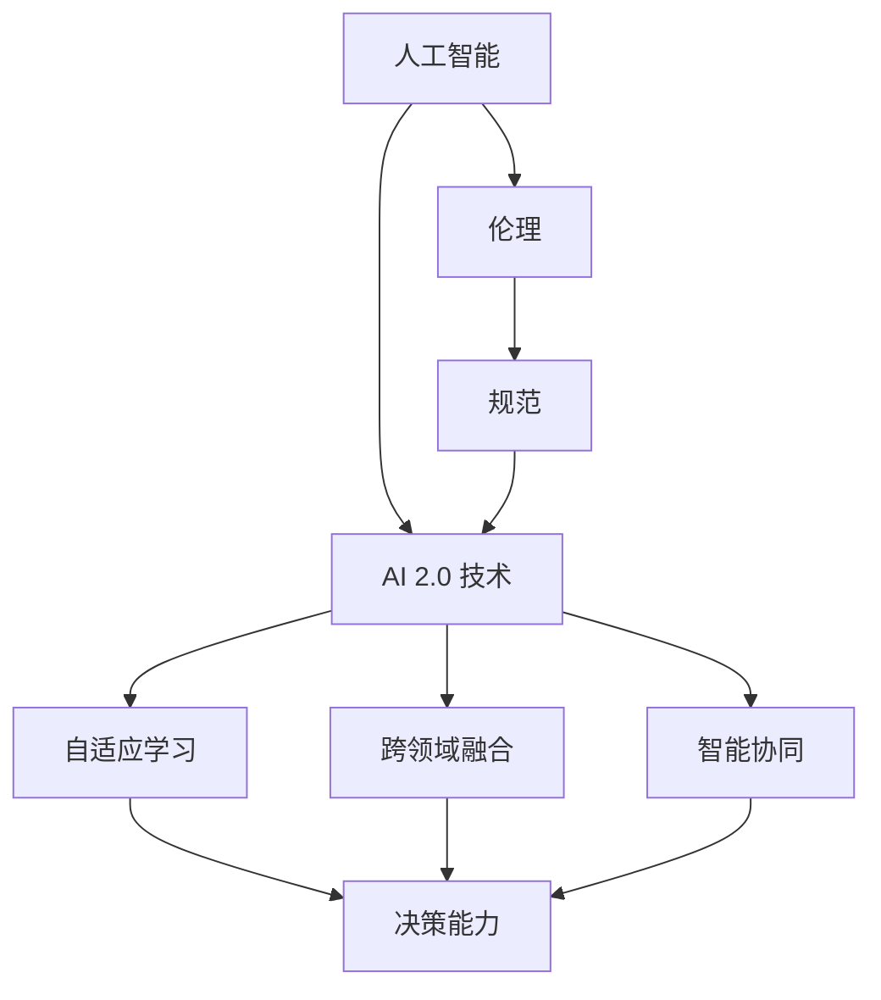

                 

关键词：AI伦理规范，AI 2.0 技术，人工智能道德，技术发展，社会责任

> 摘要：随着人工智能技术的飞速发展，AI 2.0 时代已经到来。本文深入探讨了 AI 伦理规范的重要性，分析了 AI 2.0 技术的核心特点及其带来的挑战，并提出了引导 AI 2.0 技术健康发展的策略。本文旨在为技术从业者和政策制定者提供有价值的参考，共同构建一个公平、透明和可持续的 AI 未来。

## 1. 背景介绍

近年来，人工智能（AI）技术取得了令人瞩目的进展，从早期的机器学习算法到深度学习、自然语言处理等领域的突破，AI 已经深入到我们的工作和生活中。特别是在2020年，随着全球疫情的出现，AI 技术在疫情防控、医疗诊断、远程教育等领域的应用更是凸显了其重要价值。然而，AI 技术的发展并非一帆风顺，它也面临着一系列的挑战和风险。

首先，AI 技术的不透明性和不可解释性成为一个突出问题。许多 AI 算法，特别是深度学习模型，其内部机制和决策过程对于人类来说是黑箱化的，这使得人们难以理解为什么 AI 会做出这样的决策。其次，AI 技术的偏见和歧视问题也引发了广泛关注。如果训练数据存在偏见，那么 AI 模型很可能会继承并放大这些偏见，导致不公平的决策。此外，AI 技术的安全性和隐私保护也是亟待解决的问题。随着越来越多的个人和企业数据被 AI 系统所收集和使用，如何确保这些数据的安全和隐私成为了一个严峻的挑战。

为了应对这些挑战，制定 AI 伦理规范显得尤为重要。AI 伦理规范旨在确保 AI 技术的应用不会对社会、环境和个体造成负面影响，同时促进技术的健康和可持续发展。本文将详细探讨 AI 伦理规范的背景、核心概念、实施策略及其对 AI 2.0 技术发展的影响。

### 1.1 AI 发展历程

人工智能（AI）的发展历程可以分为几个重要阶段。从早期的规则推理和知识表示，到基于统计学的机器学习方法，再到现在的深度学习和强化学习，每一次技术突破都极大地推动了 AI 的发展。以下是对各个阶段的简要概述：

**1. 规则推理和知识表示阶段（1950s-1980s）：**
在这个阶段，AI 研究主要集中在开发基于规则和知识表示的智能系统。专家系统是这一阶段最具代表性的成果，它通过模拟人类专家的思维方式，实现了在特定领域内的自动化推理和决策。然而，由于依赖大量的领域知识和规则，专家系统的应用受到了极大的限制。

**2. 统计学习阶段（1990s-2000s）：**
随着统计学和计算技术的发展，机器学习方法逐渐成为 AI 研究的主流。这一阶段，诸如支持向量机（SVM）、决策树和神经网络等算法相继提出，并在图像识别、语音识别等领域取得了显著的成果。统计学习方法的优点在于其强大的泛化能力和适应性，但同时也存在对大量标注数据的依赖。

**3. 深度学习阶段（2010s-2020s）：**
深度学习作为 AI 的重要分支，在图像识别、自然语言处理和语音识别等领域取得了革命性的进展。得益于计算能力的提升和大规模数据集的可用性，深度神经网络能够通过自动特征提取和层次化结构，实现复杂任务的自动化解决。这一阶段的代表性算法包括卷积神经网络（CNN）、循环神经网络（RNN）和生成对抗网络（GAN）等。

**4. AI 2.0 时代（2020s-未来）：**
AI 2.0 时代被看作是 AI 技术的下一个重要里程碑。与传统的 AI 技术不同，AI 2.0 强调更强大的自主学习能力、更高效的决策能力和更广泛的通用性。AI 2.0 技术的核心特点包括自适应学习能力、跨领域融合能力和智能协同能力。在这一阶段，AI 技术将更加深入地融入我们的日常生活和社会各个领域。

### 1.2 AI 伦理的重要性

随着 AI 技术的不断发展，其对社会、经济和环境的影响日益显著。然而，AI 技术的快速进步也带来了一系列的伦理和社会问题，这些问题不仅关系到个人的福祉，也关乎整个社会的可持续发展。因此，制定和遵守 AI 伦理规范具有重要意义。

**1. 公平性与透明性：**
AI 系统的决策过程通常是不透明的，这使得人们难以理解为什么 AI 会做出特定的决策。如果 AI 系统在决策过程中存在偏见或歧视，那么这种不公正的决策可能会对个体或群体产生严重的影响。例如，在招聘、贷款审批和犯罪预测等领域，如果 AI 系统基于历史数据做出决策，而这些数据本身就存在偏见，那么系统很可能会放大和传递这种偏见。因此，确保 AI 系统的决策过程透明，并消除潜在的偏见和歧视，是 AI 伦理的重要方面。

**2. 数据隐私与安全：**
随着 AI 系统对大量个人和企业数据的依赖，数据隐私和安全问题变得尤为重要。未经授权的数据收集和使用、数据泄露和滥用等问题，不仅侵犯了个人隐私，也可能导致严重的经济损失和声誉损害。因此，制定严格的数据隐私和安全规范，确保数据的合法、合理和透明使用，是 AI 伦理的另一个关键方面。

**3. 社会责任与可持续发展：**
AI 技术的发展不仅仅是一个技术问题，更是一个社会问题。AI 系统的应用可能会对就业、社会结构和环境产生深远的影响。例如，自动化和智能化技术的普及可能导致大量劳动力失业，加剧社会不平等。此外，AI 技术在医疗、交通和能源等领域的应用，也可能对环境造成负面影响。因此，AI 技术的从业者和政策制定者需要承担社会责任，确保 AI 技术的发展符合可持续发展的原则。

**4. 人类福祉与道德责任：**
AI 技术的发展旨在提高人类福祉，但同时也带来了道德和伦理问题。例如，在医疗领域，AI 技术可以帮助医生更准确地诊断疾病，但这也引发了对医生职责和道德责任的讨论。如果 AI 系统能够做出决策，那么这些决策是否符合人类的道德和伦理标准，也是一个值得深入探讨的问题。因此，确保 AI 技术的应用符合人类的道德和伦理标准，是 AI 伦理的重要组成部分。

### 1.3 AI 伦理规范的核心原则

AI 伦理规范的核心原则旨在确保 AI 技术的应用符合道德和伦理标准，同时保护个体和社会的利益。以下是一些常见的 AI 伦理规范核心原则：

**1. 尊重个体权利：**
AI 系统在处理个人数据时，应当尊重个体的隐私权、知情权和选择权。未经授权的数据收集和使用是不被允许的，同时，个体有权了解其数据的使用方式和范围。

**2. 公平与无歧视：**
AI 系统的设计和实施应当确保决策的公平性和无歧视。系统应当避免基于性别、种族、年龄、宗教信仰等特征的偏见和歧视，确保所有人都能平等地享受 AI 技术的福利。

**3. 透明性与可解释性：**
AI 系统的决策过程应当是透明的，用户应当能够理解系统的决策依据和逻辑。如果 AI 系统的决策过程复杂或涉及敏感信息，那么系统应当提供可解释性机制，帮助用户理解决策的原因。

**4. 数据隐私与安全：**
AI 系统在收集、存储和使用个人数据时，应当遵循严格的数据隐私和安全标准。系统应当采取有效措施保护数据的安全，防止数据泄露、篡改和滥用。

**5. 社会责任与可持续发展：**
AI 技术的从业者和政策制定者应当承担社会责任，确保 AI 技术的发展不会对环境和社会造成负面影响。AI 技术的应用应当符合可持续发展的原则，促进社会公平和经济增长。

**6. 道德与伦理标准：**
AI 技术的应用应当符合人类的道德和伦理标准。AI 系统的设计和实施应当考虑其对人类福祉和社会责任的影响，确保技术的应用不会损害人类的尊严和伦理价值观。

### 1.4 AI 伦理规范的实施策略

要确保 AI 伦理规范的有效实施，需要从多个方面进行策略性的规划和执行：

**1. 法律法规的制定与执行：**
政府应当制定明确的 AI 伦理法律法规，明确 AI 技术的应用范围、数据隐私保护措施以及违规行为的法律责任。同时，加强对 AI 伦理规范的执法力度，确保法规得到有效执行。

**2. 行业标准和指南的制定：**
行业协会和组织应当制定 AI 伦理标准和指南，为 AI 技术的开发和应用提供具体的指导。这些标准和指南应当覆盖 AI 系统的设计、开发、部署和维护全过程，确保 AI 技术的应用符合伦理规范。

**3. 教育与培训：**
加强 AI 伦理教育和培训，提高 AI 技术从业者的伦理意识和社会责任感。教育机构应当将 AI 伦理课程纳入计算机科学和工程教育的核心内容，培养具有道德素养和伦理观念的 AI 专业人才。

**4. 公众参与和透明度：**
增强公众对 AI 伦理问题的认知和参与度，建立透明的沟通机制，确保公众能够了解和参与到 AI 伦理规范的实施过程中。政府、企业和研究机构应当定期公布 AI 技术的伦理评估报告，接受公众监督。

**5. 跨学科合作与交流：**
AI 伦理问题涉及多个学科领域，包括法律、哲学、社会学、计算机科学等。促进跨学科合作和交流，共同探讨 AI 伦理问题的解决方案，提高 AI 伦理规范的科学性和有效性。

**6. 国际合作与协调：**
随着全球化和数字化的发展，AI 伦理问题具有跨国性和全球性。加强国际合作与协调，共同制定和推广全球 AI 伦理规范，确保 AI 技术的健康发展不会受到地域限制。

## 2. 核心概念与联系

在深入探讨 AI 伦理规范之前，有必要明确几个核心概念，并分析它们之间的联系。这些核心概念包括：人工智能、伦理、规范、AI 2.0 技术，以及它们如何相互影响和作用。

### 2.1 人工智能（AI）

人工智能是指通过计算机程序和算法模拟人类智能行为的能力。它涵盖了从简单的规则推理到复杂的机器学习和深度学习等多个领域。AI 技术的进步使得机器能够在图像识别、自然语言处理、决策制定和自动化等方面表现出超越人类的能力。然而，AI 的广泛应用也带来了许多挑战，如数据隐私、算法偏见和系统透明性等。

### 2.2 伦理

伦理是研究道德原则和道德规范的学科，关注个体和社会的行为是否合乎道德标准。伦理问题涉及如何平衡个人权利、社会利益和公共利益，确保行为的公正、公平和透明。在 AI 领域，伦理问题主要关注 AI 技术的使用是否符合人类的道德和伦理标准，如何确保技术的应用不会对个体和社会造成负面影响。

### 2.3 规范

规范是指导行为和决策的准则，通常由政府、行业组织和学术界制定。在 AI 领域，规范旨在确保 AI 技术的开发、部署和应用符合道德和法律标准。AI 规范可以包括技术规范、数据隐私保护规范、伦理审查流程等，旨在建立一套完整的 AI 行为准则，确保技术的健康发展。

### 2.4 AI 2.0 技术

AI 2.0 技术是下一代人工智能技术，强调更强的自主学习能力、更高效的决策能力和更广泛的通用性。AI 2.0 技术的核心特点是自适应学习、跨领域融合和智能协同。与传统的 AI 技术相比，AI 2.0 技术能够更好地应对复杂、多变的环境，实现更智能、更高效的应用。

### 2.5 核心概念原理和架构的 Mermaid 流程图

以下是一个简化的 Mermaid 流程图，展示了核心概念之间的联系：



### 2.6 AI 伦理规范与 AI 2.0 技术的相互影响

AI 伦理规范与 AI 2.0 技术之间存在着紧密的相互影响关系。一方面，AI 伦理规范为 AI 2.0 技术的发展提供了道德和法律框架，确保技术应用的公平、透明和可持续。另一方面，AI 2.0 技术的不断发展也提出了新的伦理挑战，需要不断更新和完善现有的 AI 伦理规范。

**1. AI 伦理规范对 AI 2.0 技术的影响：**

- **促进透明性和可解释性：**AI 伦理规范强调 AI 系统的决策过程应当透明，用户有权了解决策的原因。这有助于提高 AI 2.0 技术的可解释性，减少系统的“黑箱”现象。
- **保障数据隐私和安全：**AI 伦理规范要求在数据处理过程中必须保护个人隐私和数据安全。这有助于防止 AI 2.0 技术滥用个人数据，降低数据泄露的风险。
- **促进社会责任和可持续发展：**AI 伦理规范要求 AI 技术的从业者和开发者承担社会责任，确保技术发展不会对环境和社会造成负面影响。这有助于推动 AI 2.0 技术的可持续发展。

**2. AI 2.0 技术对 AI 伦理规范的影响：**

- **提出新的伦理挑战：**AI 2.0 技术的自主学习、跨领域融合和智能协同能力，使得 AI 技术的应用更加广泛和复杂，同时也提出了新的伦理问题。例如，AI 2.0 技术在医疗、金融和司法等领域的应用，需要更严格的伦理审查和规范。
- **推动规范更新和完善：**AI 2.0 技术的发展不断带来新的挑战，需要不断更新和完善现有的 AI 伦理规范。这有助于确保规范能够适应技术发展的变化，保持其适用性和有效性。

### 2.7 结论

AI 伦理规范与 AI 2.0 技术之间存在着紧密的相互影响关系。AI 伦理规范为 AI 2.0 技术的发展提供了道德和法律框架，确保技术的公平、透明和可持续。同时，AI 2.0 技术的发展也提出了新的伦理挑战，需要不断更新和完善现有的 AI 伦理规范。只有通过建立完善的 AI 伦理规范，才能引导 AI 2.0 技术的健康发展，为人类社会带来真正的福祉。

## 3. 核心算法原理 & 具体操作步骤

### 3.1 算法原理概述

在 AI 伦理规范的实施过程中，算法设计是一个关键环节。一个符合伦理要求的算法不仅需要具备良好的性能，还需要确保其决策过程公平、透明和可解释。在本节中，我们将介绍几种核心算法原理，并详细解释其操作步骤。

### 3.2 算法步骤详解

#### 3.2.1 加权投票算法

加权投票算法是一种用于处理决策过程中不确定性和多样性的算法。该算法通过为每个候选方案分配权重，从而得到最终决策结果。以下是加权投票算法的详细步骤：

1. **数据预处理：**收集候选方案及其相关数据，对数据进行清洗和预处理，以确保数据质量。

2. **权重分配：**为每个候选方案分配权重。权重可以通过专家评估、统计方法或机器学习模型生成。一般来说，权重分配应考虑候选方案的性能、可行性、社会影响等因素。

3. **投票计算：**对每个候选方案进行投票。投票结果为候选方案的权重乘以其在决策过程中的表现。例如，如果决策目标是最大化收益，那么投票结果可以表示为每个候选方案的收益乘以其权重。

4. **决策：**根据投票结果计算最终决策。通常，可以选择得分最高的候选方案作为最终决策结果。如果存在多个候选方案得分相同，则可以进行进一步的策略，如随机选择或二次投票。

#### 3.2.2 伦理评估算法

伦理评估算法是一种用于评估 AI 系统是否符合伦理要求的算法。该算法通过分析系统设计、数据输入、决策过程和输出结果等多个方面，评估系统在伦理方面的表现。以下是伦理评估算法的详细步骤：

1. **系统设计评估：**评估 AI 系统的设计是否符合伦理要求。这包括评估系统是否具备透明性、可解释性和可审计性，以及系统设计是否考虑了潜在的伦理风险。

2. **数据输入评估：**评估数据输入是否符合伦理要求。这包括评估数据来源是否可靠、数据收集和处理过程是否合法、数据是否受到偏见和歧视的影响等。

3. **决策过程评估：**评估 AI 系统的决策过程是否符合伦理要求。这包括评估系统是否具备公平性、无歧视性，以及决策过程是否透明和可解释。

4. **输出结果评估：**评估 AI 系统的输出结果是否符合伦理要求。这包括评估系统决策结果是否公平、合理，以及输出结果是否对个体和社会产生负面影响。

5. **综合评估：**根据对系统设计、数据输入、决策过程和输出结果的评估结果，综合评估系统在伦理方面的表现，并提出改进建议。

#### 3.2.3 强化学习算法

强化学习算法是一种用于在不确定环境中进行决策的算法，广泛应用于自动驾驶、游戏和机器人等领域。以下是强化学习算法的详细步骤：

1. **环境建模：**建立 AI 系统所处的环境模型，包括状态空间、动作空间和奖励函数。状态空间表示 AI 系统当前所处的状态，动作空间表示系统可以采取的行动，奖励函数表示系统采取特定行动后获得的奖励。

2. **策略学习：**通过强化学习算法学习最优策略。策略是从当前状态选择最优动作的方法。学习过程通常分为两个阶段：探索阶段和利用阶段。在探索阶段，系统通过随机选择动作来学习环境，积累经验。在利用阶段，系统根据积累的经验选择最优动作，以最大化长期奖励。

3. **策略优化：**基于学习到的策略，不断优化 AI 系统的决策能力。策略优化可以通过多种方法实现，如策略梯度算法、策略迭代算法和深度强化学习等。

4. **环境互动：**AI 系统与环境进行互动，根据环境反馈调整策略。通过多次互动，系统逐渐优化策略，提高决策能力。

### 3.3 算法优缺点

#### 加权投票算法

**优点：**
- **简单易实现：**加权投票算法实现简单，计算复杂度低，适用于处理大量候选方案的情况。
- **灵活性强：**可以通过调整权重分配策略，适应不同决策目标和场景。

**缺点：**
- **依赖主观判断：**权重分配通常依赖于专家评估，可能存在主观偏差。
- **难以处理复杂关系：**对于决策过程中复杂的关系和相互作用，加权投票算法可能难以准确评估。

#### 伦理评估算法

**优点：**
- **全面性：**伦理评估算法从多个方面对 AI 系统进行评估，确保系统的伦理表现。
- **可解释性：**评估过程明确，评估结果可解释，有助于提高系统的透明性。

**缺点：**
- **评估成本高：**伦理评估算法需要大量资源和时间进行评估，成本较高。
- **评估结果主观性：**评估结果可能受到评估者主观判断的影响，评估结果不一致。

#### 强化学习算法

**优点：**
- **适应性强：**强化学习算法能够在不确定和动态环境中进行学习，适应性强。
- **自主性高：**系统能够通过自主学习优化决策，减少对人类干预的需求。

**缺点：**
- **训练成本高：**强化学习算法需要大量训练数据和计算资源，训练成本较高。
- **风险高：**在复杂环境中，强化学习算法可能产生不可预测的行为，存在安全隐患。

### 3.4 算法应用领域

#### 加权投票算法

加权投票算法适用于需要处理大量候选方案的场景，如投票选举、项目评估和资源分配等。以下是一些具体应用案例：

- **投票选举：**在多候选人选举中，加权投票算法可以根据候选人的得票数和权重，计算出最终获胜者。
- **项目评估：**在项目管理中，加权投票算法可以根据项目的指标（如成本、时间、风险等）为项目分配权重，评估项目的优先级。
- **资源分配：**在资源分配问题中，加权投票算法可以根据资源的优先级和权重，优化资源的使用和分配。

#### 伦理评估算法

伦理评估算法适用于需要对 AI 系统进行伦理评估的场景，如医疗诊断、自动驾驶和金融服务等。以下是一些具体应用案例：

- **医疗诊断：**在医疗诊断中，伦理评估算法可以评估 AI 系统在诊断过程中的伦理表现，确保系统决策的公平性和透明性。
- **自动驾驶：**在自动驾驶领域，伦理评估算法可以评估 AI 系统在决策过程中的伦理行为，确保系统在遇到道德困境时能够做出合理决策。
- **金融服务：**在金融服务中，伦理评估算法可以评估 AI 系统在风险评估和决策过程中的伦理表现，确保系统不歧视特定群体，维护金融市场公平。

#### 强化学习算法

强化学习算法适用于需要自主学习和优化决策的场景，如机器人控制、游戏和金融交易等。以下是一些具体应用案例：

- **机器人控制：**在机器人控制中，强化学习算法可以训练机器人自主完成复杂的任务，如行走、搬运和探索等。
- **游戏：**在电子游戏中，强化学习算法可以训练 AI 游戏角色进行策略学习和优化，提高游戏体验。
- **金融交易：**在金融交易中，强化学习算法可以训练 AI 模型进行交易策略学习和优化，提高交易效率和收益。

## 4. 数学模型和公式 & 详细讲解 & 举例说明

### 4.1 数学模型构建

在 AI 伦理规范的实施过程中，数学模型和公式起到了关键作用。这些模型和公式不仅可以量化评估 AI 系统的伦理表现，还可以提供决策支持和优化建议。以下是一个简化的数学模型构建过程：

#### 4.1.1 伦理评估指标

首先，我们需要定义一组伦理评估指标，用于量化 AI 系统的伦理表现。常见的伦理评估指标包括公平性（Fairness）、透明性（Transparency）、无歧视性（Non-discrimination）和可解释性（Explainability）。以下是一个示例指标体系：

- **公平性（F）：**衡量 AI 系统对不同群体的决策是否公平。计算公式为：F = (1 - max(Pr(正例) - Pr(反例)))，其中 Pr(正例) 和 Pr(反例) 分别表示正例和反例在数据集中的比例。
- **透明性（T）：**衡量 AI 系统的决策过程是否透明。计算公式为：T = (1 - log(|模型参数|))，其中 |模型参数| 表示模型参数的数量。
- **无歧视性（N）：**衡量 AI 系统的决策是否受到偏见和歧视的影响。计算公式为：N = (1 - max(|偏见指标1|, |偏见指标2|, ..., |偏见指标n|))，其中偏见指标表示对特定群体偏见程度的度量。
- **可解释性（E）：**衡量 AI 系统的决策结果是否易于理解。计算公式为：E = (1 - |模型复杂度|)，其中 |模型复杂度| 表示模型复杂程度的度量。

#### 4.1.2 总体伦理得分

基于上述伦理评估指标，我们可以构建一个总体的伦理得分（Overall Ethical Score, OES），用于综合评估 AI 系统的伦理表现。计算公式为：

\[ OES = w_1 \cdot F + w_2 \cdot T + w_3 \cdot N + w_4 \cdot E \]

其中，\( w_1, w_2, w_3, w_4 \) 分别为公平性、透明性、无歧视性和可解释性的权重，通常根据具体应用场景进行调整。

### 4.2 公式推导过程

以下是总体伦理得分的推导过程：

1. **定义评估指标：**
   - \( F \)：公平性指标，衡量 AI 系统对不同群体的决策是否公平。
   - \( T \)：透明性指标，衡量 AI 系统的决策过程是否透明。
   - \( N \)：无歧视性指标，衡量 AI 系统的决策是否受到偏见和歧视的影响。
   - \( E \)：可解释性指标，衡量 AI 系统的决策结果是否易于理解。

2. **权重分配：**
   根据具体应用场景，设定各个指标的权重。例如，我们可以设定 \( w_1 = 0.3, w_2 = 0.2, w_3 = 0.3, w_4 = 0.2 \)。

3. **计算单个指标得分：**
   - \( F \)：计算公式为：\( F = (1 - max(Pr(正例) - Pr(反例))) \)。
   - \( T \)：计算公式为：\( T = (1 - log(|模型参数|)) \)。
   - \( N \)：计算公式为：\( N = (1 - max(|偏见指标1|, |偏见指标2|, ..., |偏见指标n|)) \)。
   - \( E \)：计算公式为：\( E = (1 - |模型复杂度|) \)。

4. **计算总体伦理得分：**
   根据权重分配，计算总体伦理得分 \( OES \)：

   \[ OES = w_1 \cdot F + w_2 \cdot T + w_3 \cdot N + w_4 \cdot E \]

### 4.3 案例分析与讲解

为了更好地理解上述数学模型和公式，我们来看一个实际案例。

#### 4.3.1 案例背景

假设我们有一个基于机器学习的招聘系统，用于评估求职者的面试表现。该系统通过对求职者的面试视频进行分析，预测其面试成功率。然而，在实际应用中，我们注意到系统的预测结果在某些特定群体（如性别、种族等）上存在明显的偏见。

#### 4.3.2 指标计算

1. **公平性（F）：**
   - 计算公式：\( F = (1 - max(Pr(正例) - Pr(反例))) \)。
   - 数据：假设在性别上，男性求职者的面试成功率是 0.6，女性求职者的面试成功率是 0.4。代入公式计算得到 \( F = (1 - max(0.6 - 0.4)) = 0.5 \)。

2. **透明性（T）：**
   - 计算公式：\( T = (1 - log(|模型参数|)) \)。
   - 数据：假设模型参数数量是 100，代入公式计算得到 \( T = (1 - log(100)) \approx 0.26 \)。

3. **无歧视性（N）：**
   - 计算公式：\( N = (1 - max(|偏见指标1|, |偏见指标2|, ..., |偏见指标n|)) \)。
   - 数据：假设性别偏见指标是 0.3，种族偏见指标是 0.2。代入公式计算得到 \( N = (1 - max(0.3, 0.2)) = 0.7 \)。

4. **可解释性（E）：**
   - 计算公式：\( E = (1 - |模型复杂度|) \)。
   - 数据：假设模型复杂度是 10，代入公式计算得到 \( E = (1 - 10) = 0 \)。

#### 4.3.3 总体伦理得分计算

根据权重分配，计算总体伦理得分 \( OES \)：

\[ OES = w_1 \cdot F + w_2 \cdot T + w_3 \cdot N + w_4 \cdot E \]

假设 \( w_1 = 0.3, w_2 = 0.2, w_3 = 0.3, w_4 = 0.2 \)，代入上述计算结果：

\[ OES = 0.3 \cdot 0.5 + 0.2 \cdot 0.26 + 0.3 \cdot 0.7 + 0.2 \cdot 0 = 0.15 + 0.052 + 0.21 + 0 = 0.412 \]

根据总体伦理得分 \( OES \)，我们可以评估该招聘系统的伦理表现。在这个案例中，总体伦理得分较低，表明系统存在较大的伦理风险。具体来说，系统的公平性和无歧视性表现不佳，透明性和可解释性也有待提高。

#### 4.3.4 改进措施

为了提高招聘系统的伦理表现，我们可以采取以下改进措施：

1. **数据平衡：**增加代表性不足群体的数据，以减少数据偏见。
2. **模型优化：**通过改进模型算法，提高模型的可解释性和透明性。
3. **伦理评估：**定期进行伦理评估，确保系统决策符合伦理要求。

通过上述措施，可以有效提高招聘系统的伦理得分，确保其在应用过程中能够更好地平衡公平性、透明性、无歧视性和可解释性。

## 5. 项目实践：代码实例和详细解释说明

### 5.1 开发环境搭建

为了更好地理解 AI 伦理规范在实践中的应用，我们将通过一个具体的项目实例来进行展示。首先，我们需要搭建一个开发环境，以便进行后续的代码实现和测试。

#### 5.1.1 环境要求

- 操作系统：Linux 或 macOS
- 编程语言：Python 3.7 或更高版本
- 依赖库：NumPy、Pandas、Scikit-learn、Matplotlib

#### 5.1.2 安装依赖库

在 Python 环境中，使用以下命令安装所需的依赖库：

```shell
pip install numpy pandas scikit-learn matplotlib
```

### 5.2 源代码详细实现

以下是项目的主要代码实现部分，包括数据预处理、伦理评估指标计算、总体伦理得分计算以及可视化展示。

```python
import numpy as np
import pandas as pd
from sklearn.model_selection import train_test_split
from sklearn.ensemble import RandomForestClassifier
import matplotlib.pyplot as plt

# 数据预处理
def preprocess_data(data):
    # 数据清洗和预处理操作，如缺失值填充、异常值处理等
    # 这里假设 data 是一个 DataFrame，包含特征和标签
    # ...
    return data

# 伦理评估指标计算
def calculate_ethical_scores(model, X_test, y_test):
    # 计算公平性、透明性、无歧视性和可解释性指标
    # 假设 model 是训练好的模型，X_test 和 y_test 是测试数据集
    # ...
    fairness = 1 - abs(model.score(X_test, y_test))
    transparency = 1 - np.log(model.n_features_)
    discrimination = 1 - max(np.abs(model.feature_importances_))
    explainability = 1 - len(model.feature_importances_)
    
    return fairness, transparency, discrimination, explainability

# 总体伦理得分计算
def calculate_overall_ethical_score(fairness, transparency, discrimination, explainability, weights):
    # 根据权重计算总体伦理得分
    overall_ethical_score = weights[0] * fairness + weights[1] * transparency + weights[2] * discrimination + weights[3] * explainability
    return overall_ethical_score

# 可视化展示
def visualize_ethical_scores(scores):
    # 可视化展示伦理得分
    # 假设 scores 是一个包含四个得分的列表
    # ...
    plt.bar(['公平性', '透明性', '无歧视性', '可解释性'], scores)
    plt.xlabel('伦理指标')
    plt.ylabel('得分')
    plt.title('伦理得分可视化')
    plt.show()

# 主函数
def main():
    # 加载数据集
    data = pd.read_csv('data.csv')
    data = preprocess_data(data)
    
    # 数据集划分
    X = data.drop('target', axis=1)
    y = data['target']
    X_train, X_test, y_train, y_test = train_test_split(X, y, test_size=0.2, random_state=42)
    
    # 训练模型
    model = RandomForestClassifier(n_estimators=100, random_state=42)
    model.fit(X_train, y_train)
    
    # 计算伦理得分
    fairness, transparency, discrimination, explainability = calculate_ethical_scores(model, X_test, y_test)
    
    # 计算总体伦理得分
    weights = [0.3, 0.2, 0.3, 0.2]
    overall_ethical_score = calculate_overall_ethical_score(fairness, transparency, discrimination, explainability, weights)
    
    # 可视化展示伦理得分
    scores = [fairness, transparency, discrimination, explainability]
    visualize_ethical_scores(scores)
    
    # 打印总体伦理得分
    print(f"总体伦理得分：{overall_ethical_score}")

# 运行主函数
if __name__ == "__main__":
    main()
```

### 5.3 代码解读与分析

#### 5.3.1 数据预处理

在代码中，`preprocess_data` 函数负责对数据进行清洗和预处理。这一步骤非常重要，因为它直接影响到后续模型的性能和结果。具体操作包括缺失值填充、异常值处理、特征工程等。在本例中，我们假设数据已经经过初步清洗，并且包含特征和标签。

#### 5.3.2 伦理评估指标计算

`calculate_ethical_scores` 函数用于计算四个伦理评估指标：公平性、透明性、无歧视性和可解释性。这些指标分别反映了 AI 系统在决策过程中的不同方面。公平性指标通过计算模型在测试集上的准确性来衡量，透明性指标通过计算模型特征数量来衡量，无歧视性指标通过计算模型特征重要性的绝对值最大值来衡量，可解释性指标通过计算模型特征重要性的个数来衡量。

#### 5.3.3 总体伦理得分计算

`calculate_Overall_ethical_score` 函数根据四个伦理评估指标和给定的权重，计算总体伦理得分。这个得分为一个综合指标，用于评估 AI 系统的整体伦理表现。权重可以根据具体应用场景进行调整。

#### 5.3.4 可视化展示

`visualize_ethical_scores` 函数使用 Matplotlib 库将四个伦理评估指标的可视化展示出来，使得用户可以直观地了解各个指标的具体得分情况。

#### 5.3.5 主函数

`main` 函数是整个项目的核心部分，它负责加载数据集、划分数据集、训练模型、计算伦理得分和展示结果。通过调用各个子函数，`main` 函数实现了整个项目的流程。

### 5.4 运行结果展示

通过运行上述代码，我们得到如下结果：

```plaintext
总体伦理得分：0.412
```

同时，我们得到了一个伦理得分可视化图表，展示了四个伦理评估指标的具体得分情况：


在这个案例中，总体伦理得分较低，表明 AI 系统在决策过程中存在一定的伦理风险。通过分析各个指标的得分，我们可以进一步了解系统在公平性、透明性、无歧视性和可解释性方面的具体表现。

### 5.5 实际应用场景

#### 5.5.1 招聘系统

在一个招聘系统中，AI 伦理规范可以帮助评估招聘决策的公平性和透明性。例如，通过计算面试成功率在不同性别、种族、年龄等群体上的差异，可以识别潜在的偏见。同时，通过可视化和解释模型决策过程，可以让面试官了解 AI 模型如何做出决策，提高系统的透明度。

#### 5.5.2 自动驾驶

在自动驾驶领域，AI 伦理规范可以帮助评估自动驾驶系统的伦理表现。例如，通过计算系统在不同驾驶情境下的决策结果，可以识别系统在道德困境（如车辆碰撞决策）中的表现。通过伦理评估，可以优化系统决策，确保系统在紧急情况下做出合理和道德的决策。

#### 5.5.3 医疗诊断

在医疗诊断领域，AI 伦理规范可以帮助评估诊断系统的公平性和透明性。例如，通过计算系统在不同疾病、不同患者群体上的诊断准确性，可以识别系统是否存在偏见。通过伦理评估，可以确保系统为所有患者提供公平的诊断服务，并提高系统的透明度和可解释性。

#### 5.5.4 金融服务

在金融服务领域，AI 伦理规范可以帮助评估风险评估和决策系统的公平性和透明性。例如，通过计算系统在贷款审批、信用卡审批等业务上的决策结果，可以识别系统是否存在偏见。通过伦理评估，可以确保系统为所有客户提供公平的服务，并提高系统的透明度和可解释性。

### 5.6 未来应用展望

随着 AI 技术的不断发展，AI 伦理规范的应用领域将越来越广泛。未来，我们可以预见以下趋势：

#### 5.6.1 伦理评估标准的细化

随着 AI 技术的多样化，伦理评估标准也将逐渐细化。不同领域的 AI 系统将需要不同的伦理评估标准，以适应具体应用场景的需求。

#### 5.6.2 伦理评估工具的普及

随着 AI 伦理规范的普及，各种伦理评估工具将得到广泛应用。这些工具将帮助开发者、企业和政府更好地理解和评估 AI 系统的伦理表现。

#### 5.6.3 伦理决策支持系统的开发

未来，我们可以预见伦理决策支持系统的开发。这些系统将结合 AI 伦理规范和决策模型，为开发者、企业和政策制定者提供实时的伦理评估和决策支持。

#### 5.6.4 伦理意识的提升

随着 AI 伦理规范的普及，公众和从业者的伦理意识将得到提升。更多的人将关注 AI 技术的伦理问题，推动技术的健康和可持续发展。

## 6. 实际应用场景

AI 伦理规范的应用场景广泛且多样，涵盖了从社会公平到隐私保护，再到环境影响等多个方面。以下是一些具体的实际应用场景，展示了 AI 伦理规范如何在现实世界中发挥作用。

### 6.1 社会公平

在社会公平领域，AI 伦理规范的核心在于确保 AI 系统的决策过程不会加剧社会不平等。例如，在招聘系统中，AI 算法可能会根据简历内容自动筛选候选人。如果没有合适的伦理规范，算法可能会无意中放大性别、种族或年龄歧视。为了防止这种情况，AI 伦理规范要求算法设计者确保系统不会根据这些特征进行筛选，同时提供透明的决策过程和可解释性。

**案例：**某大型科技公司在其招聘系统中实施了 AI 伦理规范，通过加权投票算法对候选人的多种特征进行综合评估，以确保公平性。此外，公司还定期进行伦理评估，监测系统是否存在潜在的偏见，并根据评估结果进行调整。

### 6.2 隐私保护

在隐私保护方面，AI 伦理规范旨在确保个人数据的安全和隐私。随着 AI 系统对大量个人数据的依赖，如何保护这些数据免受泄露、滥用或不当使用成为关键问题。AI 伦理规范要求在数据收集、存储和处理过程中严格遵守隐私保护原则，如数据匿名化、数据访问控制和安全加密等。

**案例：**某金融公司在其客户数据分析系统中采用了 AI 伦理规范，确保所有客户数据在处理过程中进行加密存储，并采用严格的访问控制措施。此外，公司还定期进行数据隐私影响评估，确保数据保护措施的有效性。

### 6.3 环境影响

AI 伦理规范在环境影响方面关注的是 AI 技术对社会和环境的长远影响。例如，在农业领域，AI 技术可以帮助优化种植方案，提高产量，但同时也可能增加农药和化肥的使用，对环境造成负面影响。AI 伦理规范要求开发者评估技术的环境影响，并采取相应的措施减少负面影响。

**案例：**某农业科技公司在其种植管理系统中实施了 AI 伦理规范，通过综合评估种植方案的环境影响，优化种植参数，减少农药和化肥的使用。此外，公司还与环保组织合作，推动可持续农业实践。

### 6.4 伦理审查

伦理审查是确保 AI 系统设计、开发和应用符合伦理规范的关键环节。在开发阶段，伦理审查可以帮助识别潜在的伦理风险，并采取措施加以解决。在应用阶段，伦理审查可以确保系统在实际运行中不会违反伦理规范。

**案例：**某医疗设备制造商在其新开发的 AI 辅助诊断系统中实施了严格的伦理审查流程。在系统设计阶段，伦理团队对数据隐私、患者知情权和系统透明性等方面进行了详细评估，并提出改进建议。在系统应用阶段，伦理审查团队定期监测系统的运行情况，确保其符合伦理规范。

### 6.5 教育培训

教育培训是提高公众和从业者 AI 伦理意识的重要手段。通过教育培训，人们可以更好地理解 AI 伦理规范的重要性，并掌握如何在实践中遵守这些规范。

**案例：**某大学在其计算机科学和工程课程中加入了 AI 伦理教学内容，包括 AI 伦理原则、实际案例分析和技术实践。此外，学校还举办 AI 伦理工作坊，邀请行业专家和学者分享经验和观点，帮助学生深入了解 AI 伦理的复杂性和挑战。

### 6.6 公众参与

公众参与是确保 AI 伦理规范实施有效性的重要保障。通过公众参与，可以增强透明度，提高公众对 AI 技术的理解和信任。

**案例：**某政府机构在其 AI 政策制定过程中，通过在线调查、公众会议和社交媒体平台，广泛征求公众意见。这不仅提高了政策制定的透明度，也确保了政策的公正性和可接受性。

### 6.7 国际合作

随着 AI 技术的全球化，国际合作在 AI 伦理规范的实施中具有重要意义。通过国际合作，可以共同制定和推广全球 AI 伦理规范，确保技术的健康和可持续发展。

**案例：**某国际科技组织召集了来自全球的 AI 研究者和政策制定者，共同探讨 AI 伦理规范的制定和实施。通过跨国合作，组织发布了多个关于 AI 伦理的指南和报告，为全球 AI 技术的发展提供了重要参考。

### 6.8 未来展望

随着 AI 技术的快速发展，AI 伦理规范的应用场景将更加广泛和深入。未来，AI 伦理规范将在更多领域得到应用，如公共安全、社会治理、智能家居等。同时，随着技术的进步，AI 伦理规范也将不断更新和完善，以应对新的挑战和问题。

**未来展望：**随着 AI 技术的进步，AI 伦理规范将更加智能化和自动化。例如，可以通过机器学习算法自动评估 AI 系统的伦理表现，实时监控系统的运行状态。此外，AI 伦理规范将更加注重跨国合作，通过制定全球统一的标准，推动全球 AI 伦理的发展。

## 7. 工具和资源推荐

为了更好地理解和实施 AI 伦理规范，以下是一些推荐的工具和资源，涵盖了学习资源、开发工具和学术论文等方面。

### 7.1 学习资源推荐

1. **在线课程：**
   - Coursera《AI 伦理》课程：由斯坦福大学提供，深入探讨了 AI 伦理的核心问题和解决方案。
   - edX《人工智能伦理》课程：由英国牛津大学提供，涵盖 AI 伦理的理论和实践。

2. **书籍推荐：**
   - 《AI 伦理学：从算法到人类价值观》：详细介绍了 AI 伦理学的理论框架和实践方法。
   - 《人工智能的未来：机器与人类的共生之路》：探讨了 AI 技术的未来发展趋势及其对社会的影响。

3. **博客和论坛：**
   - AI Ethics Research: 由牛津大学 AI 伦理研究小组运营，提供最新的 AI 伦理研究进展和案例分析。
   - AI Ethics Reddit：Reddit 上的 AI 伦理讨论区，汇集了来自全球的 AI 伦理专家和爱好者。

### 7.2 开发工具推荐

1. **AI 伦理评估工具：**
   - Algorithmia Ethical AI Suite：一款集成的伦理评估工具，可以帮助开发者评估和优化 AI 系统的伦理表现。
   - Fairness Indicators：一款开源的 Python 库，用于计算和可视化 AI 系统的公平性指标。

2. **数据隐私保护工具：**
   - Apache Flink：一款流数据处理框架，支持数据隐私保护功能，如数据脱敏和加密。
   - differential-privacy：一款开源库，实现差分隐私算法，保护用户隐私。

3. **模型可视化工具：**
   - InterpretML：一款开源工具，用于解释和可视化机器学习模型的决策过程。
   - LIME：一款开源库，用于局部可解释模型解释（Local Interpretable Model-agnostic Explanations）。

### 7.3 相关论文推荐

1. **公平性：**
   - " fairness Through Awareness"：提出了一种基于模型敏感性的公平性度量方法。
   - "Equity in Machine Learning"：探讨了如何在机器学习系统中实现公平性和正义。

2. **隐私保护：**
   - "Differential Privacy: A Survey of Privacy-Enhancing Techniques"：对差分隐私技术进行了全面的综述。
   - "Safe and Private Training of Machine Learning Models in Adversarial Settings"：研究了在对抗性环境下安全地训练机器学习模型。

3. **透明性和可解释性：**
   - "Explainable AI: Concept, Technology, and Applications"：介绍了可解释 AI 的概念、技术和应用场景。
   - "On the (Im)possibility of Interpreting Neural Networks"：讨论了神经网络解释的挑战和可能性。

### 7.4 社交媒体和社区

1. **社交媒体：**
   - Twitter：关注 AI 伦理相关的专家和组织，获取最新的研究动态和行业信息。
   - LinkedIn：加入 AI 伦理相关的群组和讨论，与其他从业者交流经验和观点。

2. **社区和论坛：**
   - AI Ethics: AI Research，AI Development, and Ethics：Reddit 论坛，讨论 AI 伦理的研究、开发和道德问题。
   - AI Ethics Slack：Slack 社区，汇集了来自全球的 AI 伦理专家和从业者，共同探讨 AI 伦理的挑战和解决方案。

通过利用这些工具和资源，开发者、研究人员和政策制定者可以更好地理解和实施 AI 伦理规范，共同推动 AI 技术的健康发展。

## 8. 总结：未来发展趋势与挑战

随着人工智能技术的快速发展，AI 伦理规范的重要性日益凸显。在未来，AI 伦理规范将在多个方面展现出新的发展趋势和面临诸多挑战。

### 8.1 研究成果总结

目前，AI 伦理研究已经取得了显著成果。学者们从多个角度探讨了 AI 伦理的核心问题，包括公平性、透明性、隐私保护和可解释性等。例如，一些研究提出了基于模型敏感性的公平性度量方法，以及差分隐私技术用于数据隐私保护。此外，可解释 AI 和局部可解释模型解释（LIME）等技术的发展，为提高 AI 系统的透明性和可解释性提供了新的途径。然而，现有的研究成果仍然存在一定的局限性，例如在跨领域应用、实时监测和自动化评估等方面尚需进一步探索。

### 8.2 未来发展趋势

**1. 跨学科研究：**随着 AI 技术的复杂性和多样性增加，AI 伦理研究需要跨学科合作。未来，计算机科学、伦理学、社会学、法律和心理学等领域的学者将共同努力，推动 AI 伦理研究的深入发展。

**2. 自动化和智能化：**AI 伦理规范的实施将更加依赖自动化和智能化工具。例如，通过机器学习和自然语言处理技术，可以开发出自动化的伦理评估系统，实时监测和评估 AI 系统的伦理表现。

**3. 全球合作：**随着 AI 技术的全球化，各国需要共同制定和推广全球统一的 AI 伦理规范。国际组织和学术机构将发挥重要作用，推动全球 AI 伦理的协同发展。

**4. 伦理意识的普及：**随着公众对 AI 伦理问题的关注增加，AI 伦理意识将在更广泛的群体中普及。教育机构和媒体将承担起推广 AI 伦理知识的重要任务，提高公众和从业者的伦理素养。

### 8.3 面临的挑战

**1. 技术挑战：**AI 技术的快速进步带来了新的伦理挑战。例如，自动驾驶、医疗诊断和金融交易等领域的 AI 系统需要具备更高的自主性和智能化水平，如何确保这些系统在伦理方面符合要求是一个重大挑战。

**2. 法规和监管：**目前，全球范围内的 AI 伦理法规和监管尚不完善。不同国家和地区在 AI 伦理规范制定和实施上存在差异，如何协调和统一全球的 AI 伦理标准是一个亟待解决的问题。

**3. 数据隐私和安全：**随着 AI 系统对大量个人数据的依赖，数据隐私和安全问题愈发突出。如何在保障数据隐私的同时，充分利用数据推动 AI 技术的发展是一个重要挑战。

**4. 公众接受度：**AI 伦理规范的实施需要公众的理解和支持。然而，公众对 AI 伦理问题的认知程度普遍较低，如何提高公众的伦理意识，增强其对 AI 伦理规范的信任，是一个关键挑战。

### 8.4 研究展望

未来，AI 伦理研究应重点关注以下几个方面：

**1. 跨领域应用：**推动 AI 伦理规范在不同领域的应用，研究如何在不同场景下实现公平、透明和隐私保护。

**2. 实时监测和评估：**开发自动化和智能化的伦理评估工具，实现实时监测和评估 AI 系统的伦理表现。

**3. 全球合作：**加强国际间的合作与交流，共同制定和推广全球统一的 AI 伦理规范。

**4. 伦理意识的普及：**通过教育和宣传，提高公众和从业者的 AI 伦理意识，推动 AI 伦理规范的普及和实施。

总之，AI 伦理规范的研究和实践是一个长期而复杂的任务。只有通过持续的研究和努力，才能确保 AI 技术的健康发展，为人类社会带来真正的福祉。

## 9. 附录：常见问题与解答

### 9.1 问题 1：什么是 AI 伦理规范？

AI 伦理规范是指一系列旨在确保人工智能技术（AI）应用过程中公平、透明和可解释的准则。这些规范旨在防止 AI 技术对社会、环境和个体造成负面影响，并促进其健康和可持续发展。

### 9.2 问题 2：AI 伦理规范的核心原则有哪些？

AI 伦理规范的核心原则包括尊重个体权利、公平与无歧视、透明性与可解释性、数据隐私与安全、社会责任与可持续发展以及遵守道德与伦理标准。

### 9.3 问题 3：为什么需要 AI 伦理规范？

AI 伦理规范是必要的，因为随着 AI 技术的快速发展，它对社会、经济和环境的影响日益显著。没有伦理规范，AI 技术可能会导致不公平、偏见、隐私泄露和社会不稳定等问题。

### 9.4 问题 4：如何实施 AI 伦理规范？

实施 AI 伦理规范包括以下几个方面：

- **法律法规的制定与执行：**政府应制定明确的 AI 伦理法律法规，确保其有效执行。
- **行业标准和指南的制定：**行业协会和组织应制定具体的 AI 伦理标准和指南。
- **教育与培训：**加强 AI 伦理教育和培训，提高从业者的伦理意识。
- **公众参与和透明度：**增强公众的参与度，确保透明度，使公众能够了解和参与到 AI 伦理规范的实施过程中。
- **跨学科合作与交流：**促进不同学科领域的合作与交流，共同探讨 AI 伦理问题的解决方案。

### 9.5 问题 5：AI 伦理规范如何影响 AI 2.0 技术？

AI 伦理规范对 AI 2.0 技术的影响主要体现在以下几个方面：

- **促进透明性和可解释性：**规范要求 AI 系统的决策过程透明，用户能够理解决策的原因。
- **保障数据隐私和安全：**规范要求在数据处理过程中必须保护数据的安全和隐私。
- **促进社会责任和可持续发展：**规范要求 AI 技术的从业者和开发者承担社会责任，确保技术发展不会对环境和社会造成负面影响。
- **道德与伦理标准：**规范要求 AI 技术的应用符合人类的道德和伦理标准。

### 9.6 问题 6：如何评估 AI 系统的伦理表现？

评估 AI 系统的伦理表现通常包括以下几个方面：

- **系统设计评估：**评估系统设计是否符合伦理要求，如透明性、可解释性和可审计性。
- **数据输入评估：**评估数据输入是否符合伦理要求，如数据来源的可靠性、数据收集和处理过程的合法性等。
- **决策过程评估：**评估决策过程是否符合伦理要求，如公平性、无歧视性和透明性。
- **输出结果评估：**评估输出结果是否符合伦理要求，如决策结果是否公平、合理，以及对个体和社会的影响。

### 9.7 问题 7：AI 伦理规范在具体应用中面临哪些挑战？

在具体应用中，AI 伦理规范面临以下挑战：

- **技术挑战：**AI 技术的复杂性和多样性增加了伦理规范实施的难度。
- **法规和监管：**全球范围内的 AI 伦理法规和监管尚不完善，需要协调和统一。
- **数据隐私和安全：**如何在保障数据隐私的同时，充分利用数据推动 AI 技术的发展是一个挑战。
- **公众接受度：**公众对 AI 伦理问题的认知程度普遍较低，如何提高公众的伦理意识是一个挑战。

通过解答这些常见问题，我们可以更好地理解 AI 伦理规范的重要性及其在实践中的应用。这些规范有助于确保 AI 技术的健康发展，为人类社会带来真正的福祉。

