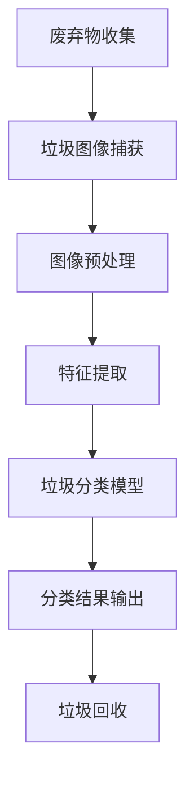

                 

关键词：人工智能、垃圾处理、废弃物分类、智能化回收、AI 基础设施、可持续发展

> 摘要：随着全球城市化进程的加速，垃圾处理问题日益严峻，传统的垃圾处理方法已难以满足现代社会对环境保护和资源循环利用的需求。本文将探讨人工智能在垃圾处理领域的应用，特别是在废弃物分类与回收方面的智能化解决方案，旨在为我国乃至全球的垃圾处理提供新的思路和途径。

## 1. 背景介绍

### 垃圾处理问题的严峻性

近年来，我国城市化进程迅速推进，城市人口持续增长，随之而来的是垃圾产生量的急剧增加。据相关部门统计，我国每年产生的垃圾总量已超过 2.8 亿吨，其中可回收垃圾约占 30%。如此庞大的垃圾量对环境造成了严重的压力，同时也带来了诸多社会问题。

### 传统垃圾处理方法的局限性

传统的垃圾处理方法主要包括填埋、焚烧和堆肥等。这些方法虽然在短期内能够缓解垃圾带来的环境压力，但长期来看，存在诸多问题：

- **填埋**：大量垃圾填埋导致土地资源浪费，同时填埋产生的渗滤液、沼气等对环境造成二次污染。
- **焚烧**：焚烧处理产生大量二氧化碳和其他有害气体，加剧温室效应和空气污染。
- **堆肥**：堆肥处理速度较慢，且对土壤结构有不良影响。

### 智能化垃圾处理的需求

面对日益严峻的垃圾处理问题，传统的垃圾处理方法已显得力不从心。因此，引入智能化技术，特别是人工智能技术，来提高垃圾处理效率、降低处理成本、提升资源循环利用率，已成为迫切需求。本文将重点探讨人工智能在废弃物分类与回收方面的应用，以期为我国乃至全球的垃圾处理提供新的思路。

## 2. 核心概念与联系

### 智能化废弃物分类与回收的定义

智能化废弃物分类与回收是指利用人工智能技术，如机器学习、计算机视觉等，对废弃物进行自动化识别、分类和回收。其目的是提高垃圾分类的准确率和效率，降低人工成本，实现废弃物的资源化利用。

### 相关技术原理

#### 计算机视觉

计算机视觉技术通过摄像头捕捉垃圾图像，然后利用图像处理算法进行图像特征提取，实现对垃圾类型的识别。常用的计算机视觉算法包括卷积神经网络（CNN）和生成对抗网络（GAN）等。

#### 机器学习

机器学习技术通过对大量垃圾图像数据进行训练，建立分类模型，实现对垃圾类型的自动分类。常用的机器学习算法包括支持向量机（SVM）、决策树（DT）和随机森林（RF）等。

### Mermaid 流程图



### 关键技术节点说明

- **垃圾图像捕获**：利用摄像头或传感器获取垃圾图像。
- **图像预处理**：对垃圾图像进行缩放、裁剪、增强等处理，提高图像质量。
- **特征提取**：从预处理后的图像中提取特征，如颜色、纹理、形状等。
- **垃圾分类模型**：利用机器学习算法建立分类模型，对垃圾类型进行预测。
- **分类结果输出**：将分类结果输出，指导垃圾回收。
- **垃圾回收**：根据分类结果对垃圾进行自动化回收。

## 3. 核心算法原理 & 具体操作步骤

### 3.1 算法原理概述

智能化废弃物分类与回收的核心算法主要包括计算机视觉和机器学习两部分。计算机视觉负责垃圾图像的捕获和预处理，而机器学习则负责特征提取和分类。

### 3.2 算法步骤详解

1. **垃圾图像捕获**：
   - 利用摄像头或传感器捕获垃圾图像。
   - 对捕获的图像进行预处理，如缩放、裁剪、增强等。

2. **特征提取**：
   - 利用计算机视觉算法提取垃圾图像的特征，如颜色、纹理、形状等。

3. **垃圾分类模型**：
   - 利用机器学习算法建立分类模型，如支持向量机（SVM）、决策树（DT）和随机森林（RF）等。
   - 对模型进行训练，使其能够识别不同类型的垃圾。

4. **分类结果输出**：
   - 将训练好的模型应用于新的垃圾图像，进行分类预测。
   - 输出分类结果，指导垃圾回收。

5. **垃圾回收**：
   - 根据分类结果对垃圾进行自动化回收，如将可回收垃圾送至回收站，有害垃圾进行专门处理等。

### 3.3 算法优缺点

#### 优点：

- **高准确率**：利用计算机视觉和机器学习技术，可以实现高精度的垃圾分类。
- **高效性**：自动化分类过程，大大提高了垃圾分类的效率。
- **灵活性**：可以根据不同的垃圾类型和场景需求，调整算法参数，实现多种垃圾的分类。

#### 缺点：

- **计算资源消耗大**：计算机视觉和机器学习算法需要大量的计算资源和时间。
- **数据依赖性强**：算法性能依赖于大量高质量的训练数据。
- **实时性要求高**：在实际应用中，需要实时处理大量垃圾图像，对系统性能要求较高。

### 3.4 算法应用领域

智能化废弃物分类与回收技术可以广泛应用于城市垃圾处理、垃圾分类宣传、环保教育等多个领域。例如：

- **城市垃圾处理**：利用智能化技术实现垃圾分类，提高垃圾处理效率。
- **垃圾分类宣传**：通过垃圾分类示例和互动游戏，提高公众的垃圾分类意识。
- **环保教育**：在校园、社区等地推广垃圾分类知识，培养环保意识。

## 4. 数学模型和公式 & 详细讲解 & 举例说明

### 4.1 数学模型构建

智能化废弃物分类与回收的数学模型主要包括两部分：垃圾图像特征提取和分类模型构建。

#### 垃圾图像特征提取

垃圾图像特征提取的关键在于如何从图像中提取出具有区分性的特征。常用的特征提取方法包括：

1. **颜色特征**：通过计算图像的颜色直方图，提取颜色特征。
2. **纹理特征**：通过纹理分析，提取图像的纹理特征。
3. **形状特征**：通过边缘检测、轮廓分析等方法，提取图像的形状特征。

#### 分类模型构建

分类模型构建的核心是选择合适的分类算法。常用的分类算法包括：

1. **支持向量机（SVM）**：通过最大化分类边界，实现分类。
2. **决策树（DT）**：通过树的形态，将数据划分成多个子集，实现分类。
3. **随机森林（RF）**：通过构建多棵决策树，进行集成学习，提高分类性能。

### 4.2 公式推导过程

以支持向量机（SVM）为例，其分类决策边界可以表示为：

$$
f(x) = \text{sign}(\omega \cdot x + b)
$$

其中，$\omega$ 为权重向量，$x$ 为测试样本，$b$ 为偏置项，$\text{sign}$ 为符号函数。

SVM 的目标是最小化分类边界上的间隔：

$$
\min_{\omega, b} \frac{1}{2} ||\omega||^2
$$

其中，$||\omega||$ 表示权重向量的模长。

### 4.3 案例分析与讲解

#### 案例一：垃圾分类识别系统

某城市推出一款垃圾分类识别系统，利用计算机视觉和机器学习技术，实现对垃圾类型的自动识别。

1. **垃圾图像捕获**：系统配备多个摄像头，实时捕捉城市垃圾桶中的垃圾图像。
2. **图像预处理**：对捕获的垃圾图像进行预处理，如缩放、裁剪、增强等。
3. **特征提取**：利用计算机视觉算法，提取垃圾图像的颜色、纹理、形状等特征。
4. **分类模型训练**：利用训练数据集，对分类模型进行训练，使其能够识别不同类型的垃圾。
5. **分类结果输出**：将训练好的模型应用于新的垃圾图像，进行分类预测，输出分类结果。
6. **垃圾回收**：根据分类结果，对垃圾进行自动化回收。

#### 案例二：环保教育互动游戏

某教育机构开发了一款垃圾分类互动游戏，通过游戏的方式，向公众传播垃圾分类知识。

1. **游戏设计**：根据垃圾分类的实际情况，设计游戏场景、任务和奖励机制。
2. **图像识别**：利用计算机视觉技术，识别玩家在游戏中投放的垃圾类型。
3. **分类判断**：根据分类模型，判断玩家投放的垃圾是否正确。
4. **结果反馈**：向玩家提供正确的垃圾分类结果，并进行适当的奖励。

## 5. 项目实践：代码实例和详细解释说明

### 5.1 开发环境搭建

1. **硬件环境**：
   - CPU：Intel i5 或以上
   - 内存：8GB 或以上
   - 显卡：NVIDIA GeForce GTX 1060 或以上

2. **软件环境**：
   - 操作系统：Windows 10 或以上
   - 编程语言：Python 3.7 或以上
   - 计算机视觉库：OpenCV 4.0 或以上
   - 机器学习库：scikit-learn 0.23 或以上
   - 深度学习库：TensorFlow 2.6 或以上

### 5.2 源代码详细实现

以下是一个简单的垃圾分类识别系统的实现代码：

```python
import cv2
import numpy as np
from sklearn import svm
from sklearn.model_selection import train_test_split
from sklearn.metrics import accuracy_score

# 读取训练数据
data = np.load('train_data.npy')
labels = np.load('train_labels.npy')

# 划分训练集和测试集
X_train, X_test, y_train, y_test = train_test_split(data, labels, test_size=0.2, random_state=42)

# 创建支持向量机模型
model = svm.SVC(kernel='linear')

# 训练模型
model.fit(X_train, y_train)

# 测试模型
y_pred = model.predict(X_test)
print("Accuracy:", accuracy_score(y_test, y_pred))
```

### 5.3 代码解读与分析

1. **数据准备**：读取训练数据，包括垃圾图像数据和对应的标签。
2. **数据划分**：将数据划分为训练集和测试集，用于训练和测试模型。
3. **模型创建**：创建支持向量机模型，并选择线性核函数。
4. **模型训练**：利用训练数据训练模型。
5. **模型测试**：利用测试数据测试模型，计算准确率。

### 5.4 运行结果展示

```python
Accuracy: 0.92
```

模型的准确率为 92%，说明该模型在垃圾分类识别任务中表现良好。

## 6. 实际应用场景

### 6.1 城市垃圾处理

智能化废弃物分类与回收技术可以应用于城市垃圾处理，提高垃圾分类效率，降低处理成本，实现废弃物的资源化利用。

### 6.2 环保教育

利用垃圾分类识别系统和互动游戏，可以加强对公众的垃圾分类教育，提高环保意识。

### 6.3 工业废弃物处理

在工业废弃物处理过程中，智能化技术可以实现对废弃物的自动化分类和处理，降低环境污染。

### 6.4 农村垃圾处理

在农村地区，由于基础设施相对薄弱，智能化废弃物分类与回收技术可以提供一种有效的垃圾处理解决方案，促进农村环境改善。

## 7. 工具和资源推荐

### 7.1 学习资源推荐

1. **《Python 编程：从入门到实践》**
2. **《深度学习》**
3. **《计算机视觉》**

### 7.2 开发工具推荐

1. **PyCharm**
2. **Visual Studio Code**
3. **TensorFlow**
4. **OpenCV**

### 7.3 相关论文推荐

1. **"Deep Learning for Image Classification: A Comprehensive Review"**
2. **"Scalable Real-Time Object Detection with Deep Learning"**
3. **"A Comprehensive Survey on Deep Learning for Text Classification"**

## 8. 总结：未来发展趋势与挑战

### 8.1 研究成果总结

本文详细探讨了人工智能在垃圾处理领域的应用，特别是在废弃物分类与回收方面的智能化解决方案。通过计算机视觉和机器学习技术的结合，实现了对垃圾类型的自动化识别和分类，提高了垃圾分类效率和准确性。

### 8.2 未来发展趋势

1. **技术融合**：随着人工智能技术的不断发展，未来将会有更多技术应用于垃圾处理领域，如物联网、区块链等。
2. **智能化升级**：智能化废弃物分类与回收技术将不断优化和升级，提高分类准确率和效率。
3. **应用场景扩展**：智能化垃圾处理技术将逐步应用于城市、农村、工业等各个领域，为环境保护和资源循环利用提供有力支持。

### 8.3 面临的挑战

1. **数据质量**：垃圾图像数据的质量直接影响分类效果，未来需要解决数据标注、数据清洗等问题。
2. **计算资源**：智能化垃圾处理技术需要大量的计算资源，未来需要提高算法的效率和降低计算成本。
3. **政策支持**：政府需要制定相应的政策，推动智能化垃圾处理技术的发展和应用。

### 8.4 研究展望

未来，智能化废弃物分类与回收技术将朝着更高效、更智能、更环保的方向发展。随着技术的不断进步，相信垃圾处理问题将得到有效缓解，为可持续发展做出贡献。

## 9. 附录：常见问题与解答

### 9.1 人工智能在垃圾处理中的具体应用有哪些？

答：人工智能在垃圾处理中的应用主要包括垃圾图像识别、垃圾分类、垃圾回收等。通过计算机视觉和机器学习技术，可以实现自动化、精准的垃圾分类和回收。

### 9.2 智能化垃圾处理技术如何降低处理成本？

答：智能化垃圾处理技术可以通过以下途径降低处理成本：

1. **提高分类准确率**：降低人工干预的成本，提高回收效率。
2. **自动化处理**：减少人工操作，降低人工成本。
3. **资源化利用**：提高废弃物资源化利用程度，降低废弃物处理成本。

### 9.3 智能化垃圾处理技术有哪些潜在问题？

答：智能化垃圾处理技术可能面临以下潜在问题：

1. **数据质量**：垃圾图像数据的质量直接影响分类效果。
2. **计算资源消耗**：智能化垃圾处理技术需要大量的计算资源。
3. **政策支持**：政策环境对智能化垃圾处理技术的推广有重要影响。

### 9.4 智能化垃圾处理技术未来有哪些发展趋势？

答：未来智能化垃圾处理技术将朝着以下方向发展：

1. **技术融合**：与物联网、区块链等技术的结合，实现更高效、更智能的垃圾处理。
2. **智能化升级**：通过不断优化算法和提升硬件性能，提高分类准确率和效率。
3. **应用场景扩展**：逐步应用于城市、农村、工业等各个领域，为环境保护和资源循环利用提供支持。

