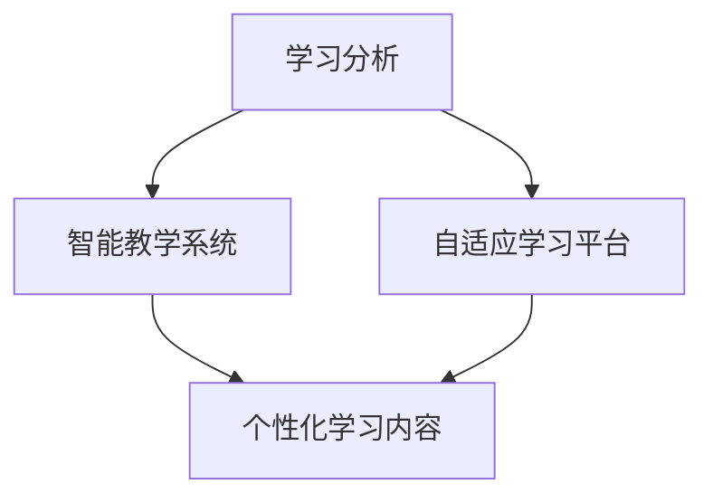

                 

关键词：人工智能、教育、个性化学习、基础设施、技术支撑

摘要：随着人工智能技术的飞速发展，教育领域正面临着前所未有的变革。本文将探讨如何利用人工智能基础设施来支撑个性化学习，从核心概念到实际应用，深入分析这一技术变革的潜力与挑战。

## 1. 背景介绍

在过去的几十年中，教育系统一直以传统的方式运行，注重标准化、统一化的教学方式。然而，随着社会的发展和信息技术的进步，这种模式逐渐暴露出其局限性。现代学生有着多样化的学习需求和能力，他们渴望得到更加个性化和定制化的教育体验。人工智能（AI）的出现为教育领域带来了新的契机，使得个性化学习成为可能。

个性化学习是指根据每个学生的兴趣、能力、学习风格和进度，为其提供定制化的学习内容和教学方法。这一目标在传统的教育系统中难以实现，因为教师无法在有限的课堂时间内关注到每一个学生的需求。而人工智能基础设施，如学习分析平台、智能教学系统和自适应学习平台，可以为个性化学习提供强大的技术支撑。

## 2. 核心概念与联系

### 2.1 核心概念

- **人工智能**：模拟人类智能的技术和系统，能够感知、学习、推理和决策。
- **个性化学习**：根据学生的学习需求和特点，定制化的教学和学习策略。
- **基础设施**：支持系统正常运行的基础设备和设施。

### 2.2 联系

人工智能基础设施在教育中的联系，可以理解为如何利用人工智能技术来构建和支持个性化学习环境。这一过程涉及以下几个方面：

1. **学习分析**：通过分析学生的学习数据，如成绩、学习进度和兴趣爱好，为个性化学习提供依据。
2. **智能教学系统**：利用人工智能算法，自动调整教学内容和教学方式，以满足不同学生的学习需求。
3. **自适应学习平台**：根据学生的学习行为和反馈，动态调整学习路径和内容，实现真正的个性化学习。

下面是一个简化的 Mermaid 流程图，展示人工智能基础设施与个性化学习之间的联系：



## 3. 核心算法原理 & 具体操作步骤

### 3.1 算法原理概述

人工智能基础设施中的核心算法主要包括机器学习算法、自然语言处理算法和数据挖掘算法等。这些算法的原理如下：

- **机器学习算法**：通过从数据中学习规律，预测和分类未知数据。
- **自然语言处理算法**：对自然语言进行理解和生成，如语言模型、情感分析等。
- **数据挖掘算法**：从大量数据中发现有价值的信息和模式。

### 3.2 算法步骤详解

1. **数据收集**：收集学生的学习数据，如成绩、作业、测验等。
2. **数据预处理**：清洗和整理数据，使其适合用于机器学习算法。
3. **特征提取**：从原始数据中提取有助于机器学习算法理解和预测的特征。
4. **模型训练**：使用机器学习算法训练模型，使其能够预测学生的学习行为和需求。
5. **模型评估**：评估模型的性能，如准确率、召回率等。
6. **模型部署**：将训练好的模型部署到实际应用中，如智能教学系统和自适应学习平台。

### 3.3 算法优缺点

**优点**：

- **个性化**：能够根据学生的个性化需求提供定制化的学习内容和方法。
- **效率高**：自动化处理大量数据，提高教学效率。

**缺点**：

- **数据隐私**：学生数据的收集和使用可能涉及到隐私问题。
- **算法偏见**：机器学习算法可能受到训练数据的影响，产生偏见。

### 3.4 算法应用领域

- **个性化学习**：根据学生的学习行为和成绩，提供个性化的学习资源和指导。
- **教育评估**：通过分析学生的学习数据，评估教学效果和学生表现。
- **教育管理**：辅助教育管理，如课程安排、资源配置等。

## 4. 数学模型和公式 & 详细讲解 & 举例说明

### 4.1 数学模型构建

在个性化学习过程中，常用的数学模型包括回归模型、决策树模型和支持向量机模型等。以回归模型为例，其基本公式为：

$$
y = \beta_0 + \beta_1 x_1 + \beta_2 x_2 + ... + \beta_n x_n
$$

其中，$y$ 是预测的输出，$x_1, x_2, ..., x_n$ 是输入特征，$\beta_0, \beta_1, ..., \beta_n$ 是模型参数。

### 4.2 公式推导过程

以线性回归模型为例，其推导过程如下：

1. **最小二乘法**：最小化预测值与实际值之间的误差平方和。
2. **损失函数**：定义损失函数，如均方误差（MSE）。

$$
J(\theta) = \frac{1}{2m} \sum_{i=1}^{m} (h_\theta(x^{(i)}) - y^{(i)})^2
$$

3. **梯度下降法**：通过梯度下降法更新模型参数，最小化损失函数。

$$
\theta_j := \theta_j - \alpha \frac{\partial J(\theta)}{\partial \theta_j}
$$

### 4.3 案例分析与讲解

以某在线教育平台为例，该平台利用回归模型预测学生的考试成绩。具体步骤如下：

1. **数据收集**：收集学生的学习数据，包括平时成绩、作业完成情况等。
2. **数据预处理**：清洗和整理数据，去除缺失值和异常值。
3. **特征提取**：从原始数据中提取有助于预测成绩的特征。
4. **模型训练**：使用线性回归模型训练模型。
5. **模型评估**：使用交叉验证方法评估模型性能。
6. **模型部署**：将训练好的模型部署到实际应用中，为学生提供个性化的学习建议。

## 5. 项目实践：代码实例和详细解释说明

### 5.1 开发环境搭建

使用 Python 编写代码，需要安装以下库：NumPy、Pandas、Scikit-learn、Matplotlib。

```python
pip install numpy pandas scikit-learn matplotlib
```

### 5.2 源代码详细实现

以下是一个简单的线性回归模型实现：

```python
import numpy as np
import pandas as pd
from sklearn.linear_model import LinearRegression
from sklearn.model_selection import train_test_split
from sklearn.metrics import mean_squared_error

# 读取数据
data = pd.read_csv('student_data.csv')

# 分离特征和标签
X = data[['平时成绩', '作业完成情况']]
y = data['考试成绩']

# 划分训练集和测试集
X_train, X_test, y_train, y_test = train_test_split(X, y, test_size=0.2, random_state=42)

# 创建线性回归模型
model = LinearRegression()

# 训练模型
model.fit(X_train, y_train)

# 预测测试集
y_pred = model.predict(X_test)

# 评估模型性能
mse = mean_squared_error(y_test, y_pred)
print('均方误差:', mse)

# 展示模型参数
print('模型参数：', model.coef_, model.intercept_)
```

### 5.3 代码解读与分析

- **数据读取与预处理**：使用 Pandas 读取数据，并进行基本的清洗和整理。
- **特征提取**：从原始数据中提取有助于预测成绩的特征。
- **模型训练与评估**：使用 Scikit-learn 库的线性回归模型进行训练，并使用均方误差（MSE）评估模型性能。

### 5.4 运行结果展示

运行上述代码，将得到模型的均方误差和模型参数。这些结果可以帮助我们了解模型的性能和预测能力。

## 6. 实际应用场景

人工智能基础设施在教育领域的应用场景非常广泛，以下是一些典型的例子：

- **个性化学习平台**：利用人工智能技术，为学生提供个性化的学习资源和指导，如 Knewton、DreamBox 等。
- **在线教育平台**：利用人工智能技术，提高教育平台的用户体验和学习效果，如 Coursera、Udemy 等。
- **教育管理**：利用人工智能技术，辅助教育管理，如智能排课、学生管理、考试分析等。

## 7. 工具和资源推荐

### 7.1 学习资源推荐

- **书籍**：《Python机器学习》、《深度学习》
- **在线课程**：Coursera 上的《机器学习》、edX 上的《深度学习》
- **教程和博客**：Google Research、DeepMind 的博客

### 7.2 开发工具推荐

- **编程语言**：Python、R、Julia
- **机器学习库**：Scikit-learn、TensorFlow、PyTorch
- **数据分析工具**：Pandas、NumPy、Matplotlib

### 7.3 相关论文推荐

- **个性化学习**："Adaptive and Intelligent Tutoring Systems: Theory and Practice"
- **教育数据挖掘**："Educational Data Mining: A Brief Overview"
- **机器学习在教育中的应用**："Machine Learning in Education: State of the Art and Future Challenges"

## 8. 总结：未来发展趋势与挑战

### 8.1 研究成果总结

人工智能基础设施在教育领域的应用取得了显著的成果，个性化学习成为可能，教育管理效率得到提升。然而，这仍是一个充满挑战的领域，需要进一步的研究和实践。

### 8.2 未来发展趋势

- **更先进的算法**：研究更加高效和准确的机器学习算法，提高个性化学习的精度和效率。
- **跨学科融合**：将人工智能与其他学科（如心理学、教育学等）相结合，提升教育技术的整体水平。
- **教育数据隐私**：保护学生数据的隐私，确保数据的合法使用。

### 8.3 面临的挑战

- **算法偏见和公平性**：避免算法偏见，确保教育公平。
- **数据隐私和安全**：保护学生数据的隐私和安全。
- **技术接受度**：提高教师和学生对人工智能技术的接受度。

### 8.4 研究展望

随着人工智能技术的不断进步，教育领域将迎来更多的变革和创新。通过深入研究人工智能基础设施在教育中的应用，我们可以为未来的教育提供更加个性化、高效和公平的解决方案。

## 9. 附录：常见问题与解答

### 9.1 如何保护学生数据隐私？

- **数据匿名化**：在收集和处理数据时，对敏感信息进行匿名化处理。
- **数据加密**：使用加密技术保护数据的安全性。
- **合规性审查**：确保数据处理过程符合相关法律法规。

### 9.2 个性化学习是否会削弱学生的自主学习能力？

- 个性化学习旨在提高学生的自主学习能力，而不是削弱它。通过提供个性化的学习资源和指导，学生可以更好地理解和掌握知识，从而提高自主学习能力。

### 9.3 人工智能基础设施在教育中的应用前景如何？

- 随着人工智能技术的不断发展和普及，人工智能基础设施在教育中的应用前景非常广阔。它有望为未来的教育带来更加个性化、高效和公平的解决方案。

---
作者：禅与计算机程序设计艺术 / Zen and the Art of Computer Programming
```

