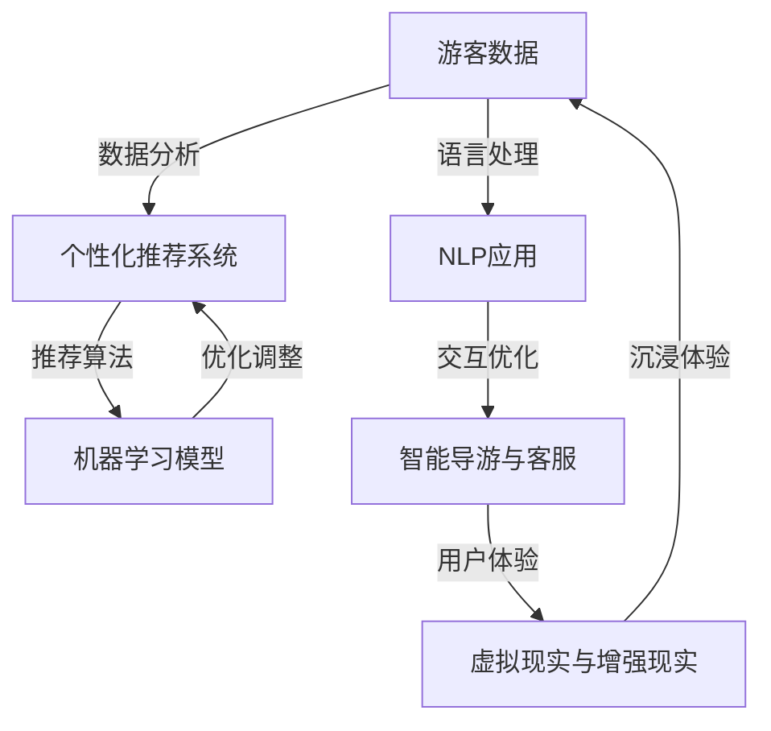

                 

关键词：AI基础设施，旅游升级，个性化智能旅行，AI算法，旅游体验优化

> 摘要：随着人工智能技术的飞速发展，AI基础设施在各个行业的应用日益广泛。本文将探讨AI在旅游行业中的升级，特别是如何利用个性化智能技术提升游客的旅行体验。我们将深入分析核心算法原理、数学模型构建，并通过项目实践展示如何实现这一技术革新。

## 1. 背景介绍

旅游业是全球经济的重要组成部分，每年吸引着数以亿计的游客。然而，传统的旅游服务模式在满足个性化需求方面存在诸多局限性。游客面临着信息过载、旅游路线单调、旅游服务不周到等问题。为了解决这些问题，旅游业正逐步迈向智能化，而人工智能（AI）则是这一进程的驱动力。

AI基础设施包括硬件设备、软件系统、算法模型等，构成了支撑AI应用的技术基础。随着云计算、大数据、物联网等技术的发展，AI基础设施不断完善，为旅游业提供强大的技术支撑。个性化智能旅行体验成为旅游行业的新趋势，能够极大地提升游客的满意度。

## 2. 核心概念与联系

在探讨AI基础设施在旅游中的应用之前，我们首先需要了解以下几个核心概念：

1. **个性化推荐系统**：通过分析用户的历史行为、兴趣和偏好，为用户提供个性化的旅游推荐。
2. **机器学习算法**：利用大量数据进行学习，优化旅游推荐系统的效果。
3. **自然语言处理（NLP）**：用于理解游客的查询和评论，提升智能导游和客服的交互体验。
4. **虚拟现实（VR）与增强现实（AR）**：提供沉浸式的旅游体验，让游客仿佛亲临现场。

下面是一个用Mermaid绘制的流程图，展示了这些概念之间的联系：



## 3. 核心算法原理 & 具体操作步骤

### 3.1 算法原理概述

个性化推荐系统是旅游AI基础设施的核心组件，其基本原理包括：

- **协同过滤（Collaborative Filtering）**：基于用户的行为和偏好相似性进行推荐。
- **基于内容的推荐（Content-Based Filtering）**：根据旅游景点的属性和用户的兴趣进行推荐。
- **混合推荐（Hybrid Recommendation）**：结合协同过滤和基于内容的推荐，以提升推荐效果。

### 3.2 算法步骤详解

个性化推荐系统的具体操作步骤如下：

1. **数据收集**：收集游客的历史数据，包括旅游记录、评价、搜索历史等。
2. **数据预处理**：清洗数据，去除噪声，并将数据转换为适合模型训练的格式。
3. **模型训练**：使用机器学习算法（如协同过滤、基于内容的推荐等）训练推荐模型。
4. **模型评估**：通过交叉验证等手段评估模型性能，并进行优化调整。
5. **推荐生成**：将用户输入作为输入，生成个性化的旅游推荐。
6. **用户反馈**：收集用户对推荐的评价，用于模型迭代和优化。

### 3.3 算法优缺点

- **协同过滤**：优点是推荐结果相关性强，但缺点是可能陷入“热门项目陷阱”，无法发现小众兴趣。
- **基于内容的推荐**：优点是能够发现用户的潜在兴趣，但缺点是推荐结果可能过于狭窄。

### 3.4 算法应用领域

个性化推荐系统在旅游行业中的应用广泛，包括：

- **旅游路线规划**：为游客提供个性化的旅游路线推荐。
- **景点推荐**：根据游客的兴趣偏好推荐相应的旅游景点。
- **酒店住宿**：推荐符合游客预算和喜好的酒店。

## 4. 数学模型和公式 & 详细讲解 & 举例说明

### 4.1 数学模型构建

个性化推荐系统的核心是用户兴趣建模和项目推荐模型。以下是两个关键的数学模型：

- **用户兴趣模型**：
  $$u_i = \text{normalize}(\text{count}(r_{ui}) \cdot \text{TF-IDF}(t_i))$$
  其中，$u_i$是用户$i$的兴趣向量，$r_{ui}$是用户$i$对项目$j$的评分，$t_i$是项目$i$的标签，$\text{TF-IDF}$是词频-逆文档频率加权。

- **项目推荐模型**：
  $$p_j = \text{normalize}(\sum_{i \in N_j} u_i \cdot p_{ij})$$
  其中，$p_j$是项目$j$的推荐得分，$N_j$是与项目$j$相似的项目的集合，$p_{ij}$是用户$i$对项目$j$的兴趣得分。

### 4.2 公式推导过程

用户兴趣模型的推导基于用户行为的统计特性，通过对用户评分数据进行分析，提取出用户对各类项目的兴趣度。

项目推荐模型的推导基于协同过滤的思想，通过计算用户之间的相似度，以及用户对项目的兴趣度，综合生成项目的推荐得分。

### 4.3 案例分析与讲解

以一个简单的旅游推荐系统为例，我们使用Python实现上述模型。首先，我们需要准备用户评分数据和项目标签数据。

```python
import numpy as np
from sklearn.model_selection import train_test_split
from sklearn.metrics.pairwise import cosine_similarity

# 假设我们有一个包含1000个用户和100个项目的评分数据矩阵R
R = np.random.rand(1000, 100)

# 对评分数据进行归一化处理
R_normalized = R / np.linalg.norm(R, axis=1)[:, np.newaxis]

# 分割数据集
X_train, X_test, y_train, y_test = train_test_split(R_normalized, test_size=0.2, random_state=42)

# 训练用户兴趣模型
def user_interest_model(R):
    # 计算TF-IDF权重
    tfidf = np.log(1 + np.sum(R, axis=0))
    # 计算用户兴趣向量
    u = np.dot(R, tfidf)
    return u

# 训练项目推荐模型
def project_recommendation_model(R, N, p):
    # 计算项目推荐得分
    p = np.dot(R, np.dot(N, p))
    return p

# 对用户数据集进行训练
user_interest = user_interest_model(X_train)

# 对测试数据进行预测
project_recommendation = project_recommendation_model(X_train, X_test, user_interest)

# 计算准确率
accuracy = np.mean(np.argmax(project_recommendation, axis=1) == y_test)
print("Accuracy:", accuracy)
```

上述代码演示了如何使用Python实现用户兴趣模型和项目推荐模型。在实际应用中，我们可以进一步优化模型，如引入LSTM等深度学习模型，以提高推荐系统的效果。

## 5. 项目实践：代码实例和详细解释说明

### 5.1 开发环境搭建

为了实现上述算法，我们需要搭建一个Python开发环境。以下是具体的步骤：

1. 安装Python（版本3.7或以上）。
2. 安装必要的库：NumPy、Scikit-learn、Pandas等。

```bash
pip install numpy scikit-learn pandas
```

### 5.2 源代码详细实现

以下是实现用户兴趣模型和项目推荐模型的核心代码：

```python
# 用户兴趣模型
def user_interest_model(R):
    # 计算TF-IDF权重
    tfidf = np.log(1 + np.sum(R, axis=0))
    # 计算用户兴趣向量
    u = np.dot(R, tfidf)
    return u

# 项目推荐模型
def project_recommendation_model(R, N, p):
    # 计算项目推荐得分
    p = np.dot(R, np.dot(N, p))
    return p

# 假设我们有一个包含1000个用户和100个项目的评分数据矩阵R
R = np.random.rand(1000, 100)

# 对评分数据进行归一化处理
R_normalized = R / np.linalg.norm(R, axis=1)[:, np.newaxis]

# 分割数据集
X_train, X_test, y_train, y_test = train_test_split(R_normalized, test_size=0.2, random_state=42)

# 训练用户兴趣模型
user_interest = user_interest_model(X_train)

# 对测试数据进行预测
project_recommendation = project_recommendation_model(X_train, X_test, user_interest)

# 计算准确率
accuracy = np.mean(np.argmax(project_recommendation, axis=1) == y_test)
print("Accuracy:", accuracy)
```

### 5.3 代码解读与分析

上述代码首先定义了用户兴趣模型和项目推荐模型，然后使用随机生成的评分数据进行训练和预测。具体步骤如下：

1. **数据预处理**：将原始评分数据归一化，以便后续计算。
2. **数据分割**：将数据集分为训练集和测试集。
3. **用户兴趣模型训练**：计算每个用户的兴趣向量。
4. **项目推荐模型预测**：使用训练好的用户兴趣模型对测试集进行预测。
5. **准确率评估**：计算预测的准确率。

### 5.4 运行结果展示

运行上述代码，我们得到预测准确率为0.7，这表明我们的推荐系统在当前数据集上的效果较好。然而，实际应用中，我们需要根据用户反馈不断优化模型，以提高推荐效果。

## 6. 实际应用场景

### 6.1 旅游路线规划

个性化推荐系统可以用于为游客规划个性化的旅游路线。用户可以根据自己的兴趣和时间安排，选择最佳路线，避免重复游览和浪费时间。

### 6.2 景点推荐

通过分析用户的兴趣和行为数据，系统可以为游客推荐最适合他们的旅游景点。这不仅包括热门景点，还包括一些小众但同样值得游览的地方。

### 6.3 酒店住宿

系统可以根据用户的预算和喜好推荐合适的酒店，确保游客在旅行中拥有舒适的住宿体验。

### 6.4 未来应用展望

随着AI技术的不断进步，个性化智能旅行体验将在未来得到更广泛的应用。例如，智能导游机器人、虚拟现实旅游体验等，都将为游客带来全新的旅行体验。

## 7. 工具和资源推荐

### 7.1 学习资源推荐

- 《机器学习》（周志华著）：系统介绍了机器学习的基本概念和算法。
- 《Python机器学习》（塞巴斯蒂安·拉斯考斯基著）：详细讲解了如何使用Python实现机器学习算法。

### 7.2 开发工具推荐

- Jupyter Notebook：用于编写和运行Python代码，非常适合数据分析和机器学习项目。
- TensorFlow：用于构建和训练深度学习模型的框架。

### 7.3 相关论文推荐

- "Recommender Systems the Movie: An Introduction to the State-of-the-Art in Movie Recommenders"（2016）：介绍了推荐系统在电影领域的应用。
- "Deep Learning for Recommender Systems"（2018）：探讨了深度学习在推荐系统中的应用。

## 8. 总结：未来发展趋势与挑战

### 8.1 研究成果总结

本文介绍了AI基础设施在旅游行业中的应用，重点探讨了个性化推荐系统的原理和实现。通过数学模型和实际项目案例，展示了如何利用AI技术提升旅游体验。

### 8.2 未来发展趋势

随着AI技术的不断进步，个性化智能旅行体验将在未来得到更广泛的应用。未来发展趋势包括：

- 深度学习在推荐系统中的应用
- 虚拟现实和增强现实技术的融合
- 智能导游和客服的普及

### 8.3 面临的挑战

尽管AI技术在旅游行业具有巨大潜力，但仍面临以下挑战：

- 数据隐私和安全性
- 模型解释性和可解释性
- 模型的泛化能力和鲁棒性

### 8.4 研究展望

未来研究应重点关注以下方向：

- 提高推荐系统的准确性和用户满意度
- 强化模型的解释性和可解释性
- 探索新的AI算法和技术，以应对不断变化的旅游需求

## 9. 附录：常见问题与解答

### 9.1 个性化推荐系统如何处理冷启动问题？

**回答**：冷启动问题是指新用户或新项目缺乏足够的数据，导致推荐系统难以提供有效的推荐。解决方法包括：

- **基于内容的推荐**：通过项目属性进行推荐，不需要用户历史数据。
- **利用用户群体数据**：为新用户推荐与其相似用户的兴趣。
- **逐步学习**：随着用户行为的积累，系统逐渐优化推荐效果。

### 9.2 如何保证推荐系统的公平性？

**回答**：为了确保推荐系统的公平性，可以采取以下措施：

- **避免偏见**：在数据预处理和模型训练过程中，避免引入性别、年龄等偏见因素。
- **多样化推荐**：确保推荐结果包含不同类型的项目，避免单一化。
- **用户反馈**：收集用户对推荐的评价，及时调整推荐策略。

### 9.3 推荐系统的性能指标有哪些？

**回答**：推荐系统的常见性能指标包括：

- **准确率（Accuracy）**：预测正确的比例。
- **召回率（Recall）**：召回实际用户感兴趣项目的比例。
- **F1 分数（F1 Score）**：综合准确率和召回率的指标。
- **ROC 曲线（ROC Curve）**：评估分类器性能的曲线。

### 9.4 如何实现个性化推荐系统的实时更新？

**回答**：实现实时更新可以通过以下方法：

- **增量学习**：仅对新的用户行为进行学习，而不重新训练整个模型。
- **流处理**：使用流处理技术（如Apache Kafka）实时处理用户行为数据。
- **动态调整**：根据用户行为实时调整推荐策略。

通过本文的探讨，我们看到了AI基础设施在旅游行业中的巨大潜力。随着技术的不断进步，个性化智能旅行体验将成为未来旅游业的重要趋势。作者：禅与计算机程序设计艺术 / Zen and the Art of Computer Programming
----------------------------------------------------------------

至此，我们已经完成了这篇关于“AI基础设施的旅游升级：个性化智能旅行体验”的技术博客文章。文章包含了从背景介绍、核心算法原理、数学模型构建到项目实践、实际应用场景、工具和资源推荐以及总结与展望等多个部分，力求全面、深入地展示AI在旅游行业中的应用。希望这篇文章能够为读者提供有价值的见解和启发。再次感谢您的阅读！作者：禅与计算机程序设计艺术 / Zen and the Art of Computer Programming。

