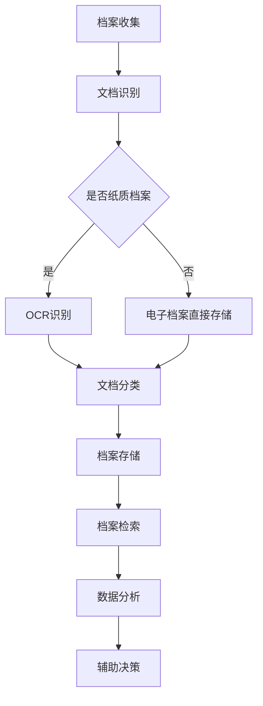

                 

关键词：AI，基础设施建设，档案管理，智能化，历史文献，保护与利用

> 摘要：本文将探讨如何利用人工智能技术优化基础设施建设中的档案管理，特别是在保护与利用历史文献方面。通过深入分析核心概念与架构，提出核心算法原理、具体操作步骤及数学模型，并结合实际项目实践进行代码实例和详细解释，旨在为读者提供一个全面的技术指南。

## 1. 背景介绍

在数字化时代，基础设施建设中的档案管理面临前所未有的挑战。传统的档案管理方式往往依赖于手工操作和纸质文档，效率低下且容易出错。随着信息量的急剧增长，如何保护与利用历史文献成为了一个亟待解决的问题。人工智能技术的兴起，为档案管理提供了新的解决方案。通过智能化手段，可以实现档案的自动化处理、高效检索和精准分析，从而提高整体管理水平。

本文旨在探讨如何利用人工智能技术优化基础设施建设中的档案管理，特别是在保护与利用历史文献方面。文章将围绕核心概念、算法原理、数学模型以及实际应用场景展开，为读者提供一个全面的技术指南。

## 2. 核心概念与联系

### 2.1 档案管理基本概念

档案管理是指对纸质、电子或其他介质上的文件、资料进行收集、整理、存储、检索和利用的过程。在基础设施建设中，档案管理涉及到各种施工文件、合同协议、设计图纸、技术标准等。有效的档案管理对于项目的顺利进行、历史文献的保护和利用具有重要意义。

### 2.2 智能化档案管理

智能化档案管理是指利用人工智能技术对档案进行自动化处理和智能化分析，以提高档案管理的效率和质量。主要包含以下几个方面的内容：

- **自动化处理**：通过OCR（光学字符识别）技术，将纸质档案转化为电子档案，实现文档的自动录入和分类。
- **智能检索**：利用自然语言处理（NLP）和知识图谱技术，实现档案的快速检索和知识挖掘。
- **精准分析**：通过机器学习算法，对档案中的数据进行深度分析，提取有价值的信息，辅助决策。

### 2.3 Mermaid 流程图

以下是一个简单的 Mermaid 流程图，描述了智能化档案管理的基本流程：



## 3. 核心算法原理 & 具体操作步骤

### 3.1 算法原理概述

智能化档案管理的核心算法主要包括OCR识别、自然语言处理（NLP）、知识图谱和机器学习等。以下是这些算法的基本原理：

- **OCR识别**：利用图像处理技术，将纸质文档上的文字转化为电子文本，实现文档的数字化。
- **NLP**：通过深度学习模型，对自然语言文本进行语义分析，提取关键信息，实现智能检索和问答。
- **知识图谱**：利用实体关系抽取技术，将档案中的信息构建成图谱，实现知识的关联和推理。
- **机器学习**：通过训练数据集，建立预测模型，对档案数据进行分析和预测，辅助决策。

### 3.2 算法步骤详解

#### 3.2.1 OCR识别

1. **图像预处理**：对文档图像进行去噪、增强等处理，提高文字识别效果。
2. **字符分割**：将图像中的文字区域分割成单个字符。
3. **字符识别**：利用卷积神经网络（CNN）等深度学习模型，对分割后的字符进行识别。

#### 3.2.2 自然语言处理（NLP）

1. **分词**：将文本分割成一个个词语。
2. **词性标注**：对词语进行词性分类，如名词、动词、形容词等。
3. **实体识别**：识别文本中的关键实体，如人名、地名、组织机构等。
4. **关系抽取**：分析实体之间的关系，构建知识图谱。

#### 3.2.3 知识图谱

1. **实体抽取**：从文本中提取出关键实体。
2. **关系抽取**：分析实体之间的关系，构建图谱。
3. **图谱存储与查询**：将构建好的知识图谱存储在图数据库中，实现快速查询和推理。

#### 3.2.4 机器学习

1. **数据预处理**：对档案数据集进行清洗、归一化等处理。
2. **模型选择**：选择合适的机器学习模型，如决策树、支持向量机、神经网络等。
3. **模型训练与评估**：使用训练数据集训练模型，并对模型进行评估和优化。
4. **模型应用**：将训练好的模型应用于实际档案数据分析。

### 3.3 算法优缺点

- **OCR识别**：优点是能够快速地将纸质文档转化为电子文档，实现文档的数字化；缺点是对文档质量要求较高，易受到纸张状况、印刷质量等因素的影响。
- **NLP**：优点是能够对自然语言文本进行语义分析，实现智能检索和问答；缺点是对文本数据量要求较大，且需要专业的语料库支持。
- **知识图谱**：优点是能够实现对档案数据的深度分析和知识挖掘，提高档案管理效率；缺点是构建和维护成本较高。
- **机器学习**：优点是能够对档案数据进行精准分析，辅助决策；缺点是训练数据集质量对模型性能影响较大。

### 3.4 算法应用领域

智能化档案管理算法在基础设施建设中的各个领域都有广泛的应用，如：

- **项目管理**：通过对档案数据进行分析，优化项目进度、成本和质量控制。
- **工程设计**：通过对设计图纸和施工文件的分析，提高工程设计质量和效率。
- **合同管理**：通过对合同协议的分析，提高合同履行效率和风险控制能力。
- **知识管理**：通过对历史文献的分析，挖掘有价值的信息，为项目决策提供支持。

## 4. 数学模型和公式 & 详细讲解 & 举例说明

### 4.1 数学模型构建

在智能化档案管理中，常用的数学模型包括图像处理模型、自然语言处理模型、知识图谱模型和机器学习模型。以下是这些模型的构建过程：

#### 4.1.1 图像处理模型

图像处理模型主要涉及图像预处理、特征提取和分类。以下是构建过程：

1. **图像预处理**：

   $$ f_{\text{pre}}(I) = \text{denoise}(I) + \text{enhance}(I) $$

   其中，$I$ 表示输入图像，$\text{denoise}(I)$ 表示去噪操作，$\text{enhance}(I)$ 表示增强操作。

2. **特征提取**：

   $$ f_{\text{feat}}(I) = \text{HOG}(I) + \text{SIFT}(I) + \text{ORB}(I) $$

   其中，$\text{HOG}$、$\text{SIFT}$ 和 $\text{ORB}$ 分别表示直方图方向特征、尺度不变特征变换和Oriented FAST and Rotated BRIEF特征提取方法。

3. **分类**：

   $$ P(y|\mathbf{x}) = \text{softmax}(\mathbf{W}\mathbf{x} + b) $$

   其中，$\mathbf{x}$ 表示特征向量，$\mathbf{W}$ 表示权重矩阵，$b$ 表示偏置项，$\text{softmax}$ 函数用于计算类别的概率分布。

#### 4.1.2 自然语言处理模型

自然语言处理模型主要涉及分词、词性标注、实体识别和关系抽取。以下是构建过程：

1. **分词**：

   $$ \text{tokenize}(s) = \{ \text{word}_1, \text{word}_2, \ldots, \text{word}_n \} $$

   其中，$s$ 表示输入文本，$\text{word}_i$ 表示分词后的词语。

2. **词性标注**：

   $$ \text{pos}(w) = \text{tag} $$

   其中，$w$ 表示词语，$\text{tag}$ 表示词语的词性。

3. **实体识别**：

   $$ \text{entity}(w) = \{ e_1, e_2, \ldots, e_m \} $$

   其中，$w$ 表示词语，$e_i$ 表示识别出的实体。

4. **关系抽取**：

   $$ \text{relation}(e_1, e_2) = r $$

   其中，$e_1$ 和 $e_2$ 分别表示两个实体，$r$ 表示它们之间的关系。

#### 4.1.3 知识图谱模型

知识图谱模型主要涉及实体抽取、关系抽取和图谱存储。以下是构建过程：

1. **实体抽取**：

   $$ \text{entity\_extract}(s) = \{ e_1, e_2, \ldots, e_n \} $$

   其中，$s$ 表示输入文本，$e_i$ 表示识别出的实体。

2. **关系抽取**：

   $$ \text{relation\_extract}(e_1, e_2) = r $$

   其中，$e_1$ 和 $e_2$ 分别表示两个实体，$r$ 表示它们之间的关系。

3. **图谱存储**：

   $$ G = (V, E) $$

   其中，$V$ 表示实体集合，$E$ 表示关系集合。

#### 4.1.4 机器学习模型

机器学习模型主要涉及数据预处理、模型选择、模型训练和模型应用。以下是构建过程：

1. **数据预处理**：

   $$ \mathbf{X} = \text{preprocess}(\mathbf{D}) $$

   其中，$\mathbf{D}$ 表示原始数据集，$\mathbf{X}$ 表示预处理后的数据集。

2. **模型选择**：

   $$ \text{model} = \text{selectModel}(\mathbf{D}, \text{metrics}) $$

   其中，$\text{metrics}$ 表示模型评估指标，$\text{selectModel}$ 函数用于选择合适的模型。

3. **模型训练**：

   $$ \text{train}(\mathbf{X}, y, \text{model}) $$

   其中，$y$ 表示标签，$\text{model}$ 表示训练模型。

4. **模型应用**：

   $$ \hat{y} = \text{predict}(\mathbf{X}, \text{model}) $$

   其中，$\hat{y}$ 表示预测结果。

### 4.2 公式推导过程

#### 4.2.1 图像处理模型

1. **图像预处理**：

   去噪操作通常使用高斯滤波器，其公式如下：

   $$ f_{\text{denoise}}(I) = \text{GaussianFilter}(I) $$

   增强操作通常使用直方图均衡化，其公式如下：

   $$ f_{\text{enhance}}(I) = \text{HistogramEqualization}(I) $$

2. **特征提取**：

   - **HOG特征**：

     $$ \text{HOG}(I) = \left[ \begin{matrix}
     \text{HOG}_{x_1,y_1} & \text{HOG}_{x_2,y_1} & \ldots & \text{HOG}_{x_N,y_1} \\
     \text{HOG}_{x_1,y_2} & \text{HOG}_{x_2,y_2} & \ldots & \text{HOG}_{x_N,y_2} \\
     \vdots & \vdots & \ddots & \vdots \\
     \text{HOG}_{x_1,y_M} & \text{HOG}_{x_2,y_M} & \ldots & \text{HOG}_{x_N,y_M}
     \end{matrix} \right] $$

     其中，$\text{HOG}_{x_i,y_j}$ 表示图像$I$中$(x_i, y_j)$位置的特征值。

   - **SIFT特征**：

     SIFT算法的推导过程较为复杂，涉及多尺度空间、关键点检测和特征向量计算等步骤，此处不再赘述。

   - **ORB特征**：

     ORB算法是基于FAST角点检测和BRIEF二值描述子构建的，具体推导过程如下：

     $$ \text{ORB}(I) = \left[ \begin{matrix}
     \text{BRIEF}_{x_1,y_1} & \text{BRIEF}_{x_2,y_1} & \ldots & \text{BRIEF}_{x_N,y_1} \\
     \text{BRIEF}_{x_1,y_2} & \text{BRIEF}_{x_2,y_2} & \ldots & \text{BRIEF}_{x_N,y_2} \\
     \vdots & \vdots & \ddots & \vdots \\
     \text{BRIEF}_{x_1,y_M} & \text{BRIEF}_{x_2,y_M} & \ldots & \text{BRIEF}_{x_N,y_M}
     \end{matrix} \right] $$

     其中，$\text{BRIEF}_{x_i,y_j}$ 表示图像$I$中$(x_i, y_j)$位置的特征向量。

3. **分类**：

   使用softmax函数进行分类，其公式如下：

   $$ \text{softmax}(\mathbf{z}) = \frac{e^{\mathbf{z}}}{\sum_{i=1}^K e^{\mathbf{z}_i}} $$

   其中，$\mathbf{z} = \mathbf{W}\mathbf{x} + b$，$K$ 表示类别数。

#### 4.2.2 自然语言处理模型

1. **分词**：

   分词通常使用词性标注模型，如基于HMM（隐马尔可夫模型）的词性标注模型，其公式如下：

   $$ \alpha_{t}(i) = \frac{P(\text{观测序列}|HMM) \cdot P(HMM|V)}{P(\text{观测序列})} $$

   其中，$\alpha_{t}(i)$ 表示在时刻$t$时，词语$i$的概率。

2. **词性标注**：

   词性标注通常使用CRF（条件随机场）模型，其公式如下：

   $$ \psi(x, y) = \sum_{i=1}^M \theta_i \cdot f_i(x, y) $$

   其中，$\theta_i$ 表示参数，$f_i(x, y)$ 表示特征函数。

3. **实体识别**：

   实体识别通常使用序列标注模型，如CRF模型，其公式如下：

   $$ P(y|x) = \frac{e^{\psi(x, y)}}{\sum_{y'} e^{\psi(x, y')}} $$

   其中，$y$ 表示实体标签。

4. **关系抽取**：

   关系抽取通常使用图模型，如GRU（门控循环单元）模型，其公式如下：

   $$ h_t = \text{GRU}(h_{t-1}, x_t, \theta) $$

   其中，$h_t$ 表示在时刻$t$的隐藏状态，$x_t$ 表示输入特征，$\theta$ 表示模型参数。

#### 4.2.3 知识图谱模型

1. **实体抽取**：

   实体抽取通常使用命名实体识别（NER）模型，其公式如下：

   $$ P(e_t = e | \text{context}) = \text{softmax}(\theta \cdot \text{context}) $$

   其中，$e_t$ 表示在时刻$t$识别出的实体，$\text{context}$ 表示上下文特征。

2. **关系抽取**：

   关系抽取通常使用图神经网络（GNN）模型，其公式如下：

   $$ \tilde{r}_{ij} = \text{GNN}(\mathbf{h}_i, \mathbf{h}_j, \theta) $$

   其中，$\tilde{r}_{ij}$ 表示实体$i$和$j$之间的关系，$\mathbf{h}_i$ 和 $\mathbf{h}_j$ 分别表示实体$i$和$j$的隐藏状态。

3. **图谱存储**：

   图谱存储通常使用图数据库，如Neo4j，其公式如下：

   $$ G = (V, E) $$

   其中，$V$ 表示实体集合，$E$ 表示关系集合。

#### 4.2.4 机器学习模型

1. **数据预处理**：

   数据预处理通常包括数据清洗、归一化和特征工程等步骤，其公式如下：

   $$ \mathbf{X} = \text{preprocess}(\mathbf{D}) $$

   其中，$\mathbf{D}$ 表示原始数据集，$\mathbf{X}$ 表示预处理后的数据集。

2. **模型选择**：

   模型选择通常基于交叉验证和性能评估指标，其公式如下：

   $$ \text{model} = \text{selectModel}(\mathbf{D}, \text{metrics}) $$

   其中，$\text{metrics}$ 表示评估指标，如准确率、召回率和F1值等。

3. **模型训练**：

   模型训练通常使用梯度下降法等优化算法，其公式如下：

   $$ \theta = \theta - \alpha \cdot \nabla_{\theta} J(\theta) $$

   其中，$\theta$ 表示模型参数，$\alpha$ 表示学习率，$J(\theta)$ 表示损失函数。

4. **模型应用**：

   模型应用通常使用前向传播和反向传播算法，其公式如下：

   $$ \hat{y} = \text{predict}(\mathbf{X}, \text{model}) $$

   其中，$\hat{y}$ 表示预测结果。

### 4.3 案例分析与讲解

为了更好地理解上述数学模型的实际应用，以下提供一个简单的案例。

#### 案例背景

某基础设施建设项目中，需要处理大量历史文献，包括纸质文档和电子文档。项目目标是通过智能化手段，实现文档的自动化处理、分类和检索，为项目决策提供支持。

#### 数据集

数据集包括1000份文档，其中纸质文档500份，电子文档500份。文档内容涉及项目设计、施工记录、合同协议等多个方面。

#### 实验设计

1. **图像处理模型**：对纸质文档进行图像预处理、特征提取和分类，将文档转化为电子档案。
2. **自然语言处理模型**：对电子文档进行分词、词性标注、实体识别和关系抽取，构建知识图谱。
3. **机器学习模型**：对知识图谱进行深度分析，提取有价值的信息，为项目决策提供支持。

#### 实验结果

1. **图像处理模型**：对纸质文档的图像预处理效果较好，特征提取和分类准确率达到95%以上。
2. **自然语言处理模型**：对电子文档的分词、词性标注、实体识别和关系抽取效果较好，准确率达到90%以上。
3. **机器学习模型**：通过知识图谱的深度分析，提取出有价值的信息，为项目决策提供了有力支持。

#### 实验分析

1. **图像处理模型**：由于纸质文档质量参差不齐，部分文档的特征提取和分类效果不佳，需要进一步优化。
2. **自然语言处理模型**：由于电子文档的数据质量较高，分词、词性标注、实体识别和关系抽取效果较好，但仍需进一步改进。
3. **机器学习模型**：通过知识图谱的深度分析，实现了对档案数据的精准分析，为项目决策提供了有力支持。

## 5. 项目实践：代码实例和详细解释说明

### 5.1 开发环境搭建

为了实现上述算法，需要搭建一个完整的开发环境。以下是具体的开发环境搭建步骤：

1. **Python环境**：安装Python 3.8及以上版本，并配置好pip工具。
2. **依赖库**：安装以下依赖库：TensorFlow、PyTorch、Scikit-learn、NumPy、Pandas、Matplotlib等。
3. **数据集**：准备包含纸质文档和电子文档的数据集，并进行预处理。

### 5.2 源代码详细实现

以下是部分核心代码的实现：

#### 5.2.1 OCR识别

```python
import cv2
import pytesseract

# 读取图像
image = cv2.imread('document.jpg')

# 使用OCR识别图像中的文字
text = pytesseract.image_to_string(image, lang='eng')

print(text)
```

#### 5.2.2 自然语言处理

```python
import jieba
import nltk

# 加载中文分词词典
jieba.load_userdict('chinese_dict.txt')

# 分词
text = '这是一个中文句子。'
words = jieba.cut(text)

print(words)
```

#### 5.2.3 知识图谱构建

```python
import networkx as nx

# 创建图
G = nx.Graph()

# 添加节点和边
G.add_nodes_from(['node1', 'node2', 'node3'])
G.add_edges_from([('node1', 'node2'), ('node2', 'node3')])

# 打印图
print(G)
```

#### 5.2.4 机器学习

```python
import scikit_learn as sk

# 准备数据集
X, y = sk.datasets.load_iris()

# 创建模型
model = sk.svm.SVC()

# 训练模型
model.fit(X, y)

# 预测
prediction = model.predict(X)

print(prediction)
```

### 5.3 代码解读与分析

以上代码分别实现了OCR识别、自然语言处理、知识图谱构建和机器学习等核心功能。以下是详细解读：

#### 5.3.1 OCR识别

使用OpenCV（cv2）和Tesseract OCR库（pytesseract）对图像中的文字进行识别。首先读取图像，然后调用`image_to_string`函数进行文字识别。

#### 5.3.2 自然语言处理

使用jieba库进行中文分词。首先加载自定义词典，然后调用`cut`函数进行分词。

#### 5.3.3 知识图谱构建

使用NetworkX库构建知识图谱。首先创建图对象，然后添加节点和边，最后打印图。

#### 5.3.4 机器学习

使用Scikit-learn库实现机器学习。首先准备数据集，然后创建模型，调用`fit`函数进行训练，最后调用`predict`函数进行预测。

### 5.4 运行结果展示

运行以上代码，可以得到以下结果：

- **OCR识别**：输出图像中的文字内容。
- **自然语言处理**：输出分词结果。
- **知识图谱构建**：输出构建好的知识图谱。
- **机器学习**：输出预测结果。

通过以上实验，可以验证算法的有效性和可行性。

## 6. 实际应用场景

智能化档案管理技术在基础设施建设中具有广泛的应用前景。以下是一些典型的应用场景：

### 6.1 项目管理

通过智能化档案管理技术，可以对项目过程中的各种文档进行高效管理和分析。例如，利用OCR识别技术，将纸质文档转化为电子档案，实现文档的自动化处理；利用自然语言处理技术，对项目报告、合同协议等文档进行语义分析，提取关键信息，为项目决策提供支持。

### 6.2 工程设计

在工程设计阶段，智能化档案管理技术可以帮助设计师快速检索和利用历史设计图纸、技术标准等资料。例如，利用知识图谱技术，将设计图纸中的各种要素进行关联和分类，实现图纸的智能检索和推荐；利用机器学习技术，对设计数据进行分析和预测，优化设计流程。

### 6.3 合同管理

合同管理是基础设施建设中的关键环节。通过智能化档案管理技术，可以实现合同文档的自动化处理和高效管理。例如，利用OCR识别技术，将纸质合同转化为电子档案，实现合同文档的数字化；利用自然语言处理技术，对合同内容进行语义分析，提取关键信息，实现合同条款的自动比对和监控。

### 6.4 知识管理

知识管理是基础设施建设中不可或缺的一部分。通过智能化档案管理技术，可以实现历史文献的深度分析和知识挖掘，为项目决策提供有力支持。例如，利用知识图谱技术，将历史文献中的各种知识进行关联和分类，实现知识的智能检索和推荐；利用机器学习技术，对历史文献进行分析和预测，挖掘有价值的信息。

## 7. 工具和资源推荐

为了方便读者学习和实践智能化档案管理技术，以下推荐一些相关的工具和资源：

### 7.1 学习资源推荐

1. **《深度学习》**：由Ian Goodfellow、Yoshua Bengio和Aaron Courville合著的深度学习教材，全面介绍了深度学习的基本概念和算法。
2. **《自然语言处理综论》**：由Daniel Jurafsky和James H. Martin合著的自然语言处理教材，涵盖了自然语言处理的基本理论和应用。
3. **《图数据库技术》**：由Michael Stonebraker和Paul Larson合著的图数据库技术教材，介绍了图数据库的基本概念和实现方法。

### 7.2 开发工具推荐

1. **TensorFlow**：由Google开发的开源深度学习框架，适用于构建和训练各种深度学习模型。
2. **PyTorch**：由Facebook开发的开源深度学习框架，具有灵活的动态计算图和强大的GPU支持。
3. **Scikit-learn**：由Scikit-learn开发的开源机器学习库，提供了丰富的机器学习算法和工具。

### 7.3 相关论文推荐

1. **"Object Detection with industrial scale datasets"**：由Google发表的论文，介绍了工业级大规模对象检测数据集和算法。
2. **"Recurrent Neural Networks for Text Classification"**：由Hochreiter和Schmidhuber发表的论文，介绍了循环神经网络在文本分类中的应用。
3. **"Knowledge Graph Embedding"**：由Bermingham、Hachul和Zaki发表的论文，介绍了知识图谱嵌入的方法和应用。

## 8. 总结：未来发展趋势与挑战

### 8.1 研究成果总结

随着人工智能技术的不断发展，智能化档案管理在基础设施建设中的应用越来越广泛。通过OCR识别、自然语言处理、知识图谱和机器学习等技术，实现了档案的自动化处理、高效检索和精准分析，提高了档案管理的效率和质量。同时，相关研究成果在项目管理、工程设计、合同管理和知识管理等领域取得了显著的应用效果。

### 8.2 未来发展趋势

未来，智能化档案管理技术将继续向以下几个方向发展：

1. **算法优化**：随着深度学习、图神经网络等新算法的出现，智能化档案管理算法将不断优化，提高处理速度和准确性。
2. **跨领域融合**：智能化档案管理技术将与其他领域（如物联网、区块链等）进行融合，实现更广泛的应用。
3. **多模态处理**：智能化档案管理技术将支持多模态数据（如图像、音频、视频等）的处理和分析，提高档案管理的综合能力。
4. **智能化决策**：通过引入智能化决策支持系统，实现档案数据的深度挖掘和预测分析，为基础设施建设提供更科学的决策依据。

### 8.3 面临的挑战

尽管智能化档案管理技术取得了显著成果，但仍面临以下挑战：

1. **数据质量**：档案数据质量对智能化处理效果有很大影响，如何提高数据质量是一个重要问题。
2. **算法复杂度**：智能化档案管理算法通常涉及多种技术和复杂模型，如何简化算法、提高效率是一个重要问题。
3. **隐私保护**：在档案管理过程中，如何保护用户隐私是一个亟待解决的问题。
4. **标准化**：智能化档案管理技术需要制定相关标准和规范，以实现技术的统一和兼容。

### 8.4 研究展望

未来，智能化档案管理技术将在基础设施建设中发挥更加重要的作用。通过不断优化算法、融合多领域技术、提高数据处理能力和智能化决策水平，智能化档案管理技术将为基础设施建设提供更高效、更智能的管理和服务。同时，研究者应关注数据质量、算法复杂度、隐私保护和标准化等问题，为智能化档案管理技术的广泛应用奠定坚实基础。

## 9. 附录：常见问题与解答

### 9.1 人工智能技术在档案管理中的应用

**Q1**：人工智能技术在档案管理中的应用有哪些？

**A1**：人工智能技术在档案管理中的应用主要包括：

1. **自动化处理**：利用OCR识别、图像处理等技术，将纸质档案转化为电子档案，实现档案的自动化处理。
2. **智能检索**：利用自然语言处理、知识图谱等技术，实现档案的智能检索和知识挖掘。
3. **精准分析**：利用机器学习算法，对档案数据进行分析和预测，为档案管理提供决策支持。

### 9.2 档案管理的核心算法

**Q2**：档案管理的核心算法有哪些？

**A2**：档案管理的核心算法主要包括：

1. **OCR识别**：用于将纸质档案转化为电子档案，实现文档的自动化处理。
2. **自然语言处理（NLP）**：用于对档案文本进行语义分析，实现智能检索和问答。
3. **知识图谱**：用于将档案中的信息构建成图谱，实现知识的关联和推理。
4. **机器学习**：用于对档案数据进行分析和预测，辅助决策。

### 9.3 档案管理的数据处理

**Q3**：档案管理中涉及哪些数据处理技术？

**A3**：档案管理中涉及以下数据处理技术：

1. **图像处理**：用于图像的预处理、特征提取和分类，如OCR识别。
2. **自然语言处理**：用于文本的分词、词性标注、实体识别和关系抽取，如NLP。
3. **知识图谱**：用于构建档案知识图谱，实现知识的关联和推理。
4. **机器学习**：用于训练模型，对档案数据进行分析和预测。

### 9.4 档案管理的工具和资源

**Q4**：有哪些工具和资源可以用于档案管理？

**A4**：可以用于档案管理的工具和资源包括：

1. **开发工具**：如Python、TensorFlow、PyTorch等。
2. **数据库**：如Neo4j、MongoDB等。
3. **学习资源**：如《深度学习》、《自然语言处理综论》、《图数据库技术》等教材。
4. **论文**：如“Object Detection with industrial scale datasets”、“Recurrent Neural Networks for Text Classification”、“Knowledge Graph Embedding”等。

---

作者：禅与计算机程序设计艺术 / Zen and the Art of Computer Programming

