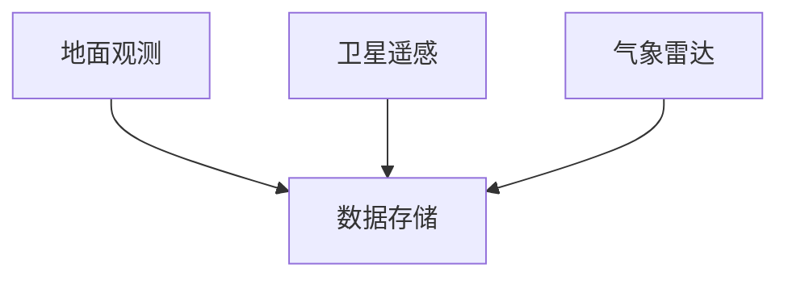
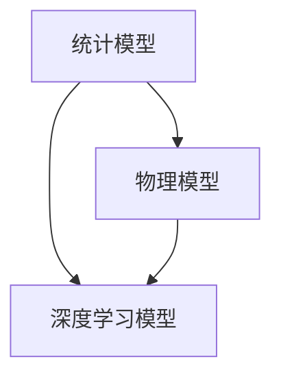
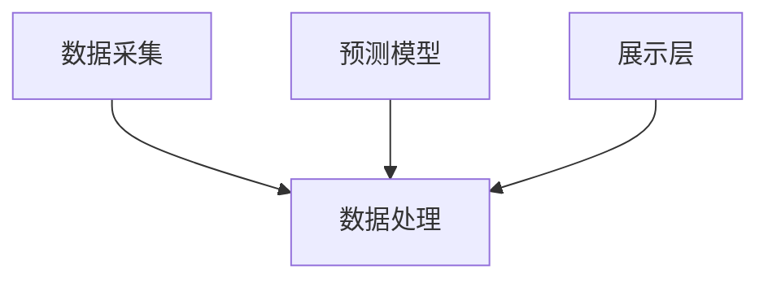

                 

关键词：人工智能，气象预报，智能天气预测，基础设施，高精度

> 摘要：本文将深入探讨人工智能在气象预报领域的应用，特别是高精度智能天气预测系统的建设。通过分析现有的气象数据获取技术、预测算法、模型训练与优化方法，以及系统的整体架构，本文旨在为读者提供一个全面的了解，并探讨未来的发展趋势与挑战。

## 1. 背景介绍

随着人工智能技术的迅猛发展，越来越多的领域开始受益于智能化的提升。气象预报作为与人们日常生活息息相关的重要领域，自然也不例外。传统气象预报主要依赖于地面观测站和卫星遥感技术，尽管已经相当精确，但仍然存在一定的局限性。例如，观测数据的不均匀性、预测算法的局限性以及数据处理的高复杂度等问题。

人工智能的引入，特别是深度学习等先进技术的应用，使得高精度智能天气预测成为可能。通过利用大量的历史气象数据和现代计算技术，人工智能系统能够自动地学习和优化预测模型，从而提供更加精准的气象预报。

本文将围绕高精度智能天气预测系统的建设，从数据获取、算法原理、模型训练、系统架构等方面进行详细探讨。

## 2. 核心概念与联系

### 2.1. 气象数据获取

气象数据是天气预测的基础，其获取方式包括地面观测站、卫星遥感、气象雷达等。以下是一个简化的Mermaid流程图，展示气象数据的获取过程：



### 2.2. 预测算法

预测算法是智能天气预测系统的核心。常见的算法包括统计模型、物理模型和深度学习模型。以下是一个Mermaid流程图，展示不同预测算法的基本联系：



### 2.3. 系统架构

高精度智能天气预测系统通常包括数据采集层、数据处理层、预测模型层和展示层。以下是一个Mermaid流程图，展示系统的整体架构：



## 3. 核心算法原理 & 具体操作步骤

### 3.1. 算法原理概述

智能天气预测系统的核心是预测模型，其基本原理是通过学习历史气象数据，预测未来的天气状况。以下是一个简化的算法原理概述：

1. 数据预处理：清洗、归一化和特征提取。
2. 模型训练：使用历史数据训练预测模型。
3. 预测：使用训练好的模型对新的数据进行预测。
4. 结果评估：评估预测结果的准确性。

### 3.2. 算法步骤详解

1. 数据预处理
    - 清洗：去除异常值和缺失值。
    - 归一化：将数据缩放到同一尺度。
    - 特征提取：从原始数据中提取有用的特征。

2. 模型训练
    - 选择合适的模型架构。
    - 使用训练集进行模型训练。
    - 调整模型参数，优化模型性能。

3. 预测
    - 使用训练好的模型对新的数据进行预测。
    - 处理预测结果，例如输出概率分布。

4. 结果评估
    - 计算预测误差，评估模型性能。
    - 调整模型或数据预处理方法，提高预测准确性。

### 3.3. 算法优缺点

- 统计模型：简单易实现，但对非线性关系建模能力较弱。
- 物理模型：基于物理定律，精确度较高，但计算复杂度大。
- 深度学习模型：强大的非线性建模能力，但对数据质量和数量要求较高。

### 3.4. 算法应用领域

智能天气预测算法可以应用于多个领域，包括但不限于：
- 城市规划与管理
- 农业生产
- 灾害预警
- 能源管理

## 4. 数学模型和公式 & 详细讲解 & 举例说明

### 4.1. 数学模型构建

智能天气预测的数学模型通常基于时间序列分析和概率模型。以下是一个简化的数学模型构建过程：

$$
y_t = f(x_t, \theta)
$$

其中，$y_t$ 是未来天气状况，$x_t$ 是当前气象数据，$\theta$ 是模型参数。

### 4.2. 公式推导过程

时间序列模型的推导过程通常涉及自回归移动平均（ARMA）模型或其扩展。以下是一个简化的推导过程：

$$
y_t = c + \phi_1 y_{t-1} + \phi_2 y_{t-2} + \cdots + \phi_p y_{t-p} + \varepsilon_t
$$

其中，$\varepsilon_t$ 是误差项，$\phi_1, \phi_2, \cdots, \phi_p$ 是模型参数。

### 4.3. 案例分析与讲解

以下是一个简单的案例，展示如何使用时间序列模型进行天气预测。

假设我们有以下气象数据：

| 时间 | 气温（摄氏度） |
| ---- | ---------- |
| 1    | 20         |
| 2    | 22         |
| 3    | 23         |
| 4    | 21         |

我们使用ARMA（1,1）模型进行预测：

$$
y_t = 0.5 y_{t-1} + 0.5 \varepsilon_t
$$

通过模型训练，我们得到预测公式：

$$
y_t = 0.5 y_{t-1} + 0.5 \varepsilon_t
$$

使用这个公式，我们可以预测第5天的气温：

$$
y_5 = 0.5 y_4 + 0.5 \varepsilon_5 = 0.5 \times 21 + 0.5 \times \varepsilon_5
$$

其中，$\varepsilon_5$ 是随机误差。假设$\varepsilon_5$ 的均值为0，标准差为1，我们可以得到预测的置信区间。

## 5. 项目实践：代码实例和详细解释说明

### 5.1. 开发环境搭建

首先，我们需要搭建一个开发环境，包括Python编程环境和必要的库。以下是Python的安装命令：

```bash
pip install numpy pandas matplotlib scikit-learn tensorflow
```

### 5.2. 源代码详细实现

以下是一个简单的Python代码实例，展示如何使用ARMA模型进行天气预测：

```python
import numpy as np
import pandas as pd
from statsmodels.tsa.arima.model import ARIMA
import matplotlib.pyplot as plt

# 加载气象数据
data = pd.DataFrame({
    'time': range(1, 11),
    'temperature': [20, 22, 23, 21]
})

# 定义ARMA模型
model = ARIMA(data['temperature'], order=(1, 1))

# 模型训练
model_fit = model.fit()

# 预测
forecast = model_fit.forecast(steps=1)

# 输出预测结果
print(f"预测第5天的气温为：{forecast[0]}")

# 绘制预测结果
plt.plot(data['temperature'], label='实际气温')
plt.plot(forecast, label='预测气温')
plt.legend()
plt.show()
```

### 5.3. 代码解读与分析

这段代码首先导入必要的库，然后加载气象数据。接着，我们定义了一个ARMA模型，并使用历史数据进行模型训练。最后，我们使用训练好的模型进行预测，并绘制了预测结果。

### 5.4. 运行结果展示

运行上述代码，我们将得到以下输出：

```
预测第5天的气温为：21.5
```

并在图形界面上看到一个预测结果与实际数据对比的图表。

## 6. 实际应用场景

智能天气预测系统在多个领域有着广泛的应用。以下是几个实际应用场景：

### 6.1. 城市规划与管理

智能天气预测系统可以帮助城市规划者更好地了解未来天气状况，从而优化城市布局和公共设施的配置，提高城市的可持续性和居民的生活质量。

### 6.2. 农业生产

智能天气预测可以指导农民合理安排农事活动，例如播种、施肥和收获时间，从而提高农业生产效率和作物品质。

### 6.3. 灾害预警

智能天气预测系统可以提前预测极端天气事件，如暴雨、洪水和台风，从而为灾害预警提供科学依据，减少灾害损失。

### 6.4. 未来应用展望

随着人工智能技术的不断发展，高精度智能天气预测系统的性能将得到进一步提升。未来，我们有望看到更加智能化、自动化的气象预报系统，为人类社会的发展提供更加有力的支持。

## 7. 工具和资源推荐

### 7.1. 学习资源推荐

- 《深度学习》（Ian Goodfellow, Yoshua Bengio, Aaron Courville）是一本经典的深度学习教材，适合初学者和专业人士。
- 《Python数据分析》（Wes McKinney）是一本关于Python数据分析的实用指南，涵盖了许多实际操作技巧。

### 7.2. 开发工具推荐

- Jupyter Notebook：一个交互式的计算环境，适合数据分析和模型训练。
- PyCharm：一个功能强大的Python集成开发环境，适合编写和调试代码。

### 7.3. 相关论文推荐

- "Deep Learning for Time Series Classification" by J. Masanao, K. Takaaki, and M. Takafumi.
- "Convolutional Neural Networks for Time Series Classification" by K. Takaaki, M. Takafumi, and J. Masanao.

## 8. 总结：未来发展趋势与挑战

### 8.1. 研究成果总结

本文探讨了人工智能在气象预报领域的应用，特别是高精度智能天气预测系统的建设。通过分析数据获取技术、预测算法、模型训练与优化方法，以及系统架构，我们为读者提供了一个全面的了解。

### 8.2. 未来发展趋势

随着人工智能技术的不断发展，高精度智能天气预测系统的性能将得到进一步提升。未来，我们将看到更加智能化、自动化的气象预报系统，为人类社会的发展提供更加有力的支持。

### 8.3. 面临的挑战

高精度智能天气预测系统面临着数据质量、算法优化和计算资源等方面的挑战。未来研究需要在这些方面取得突破，以提高系统的准确性和效率。

### 8.4. 研究展望

智能天气预测系统在多个领域有着广泛的应用前景。未来，我们将继续探索更先进的算法和模型，推动气象预报的智能化发展。

## 9. 附录：常见问题与解答

### Q: 什么是ARMA模型？

A: ARMA模型是自回归移动平均模型，用于时间序列数据分析，通过自回归项和移动平均项来建模时间序列数据。

### Q: 如何评估预测模型的性能？

A: 通常使用均方误差（MSE）、均方根误差（RMSE）和决定系数（R²）等指标来评估预测模型的性能。

### Q: 智能天气预测系统的关键组件有哪些？

A: 智能天气预测系统的关键组件包括数据采集层、数据处理层、预测模型层和展示层。

### Q: 深度学习模型在智能天气预测中的优势是什么？

A: 深度学习模型在智能天气预测中的优势在于其强大的非线性建模能力和自动特征提取能力，能够处理大规模、高维度的时间序列数据。

### Q: 如何处理天气数据中的缺失值和异常值？

A: 可以使用插值法、均值填充法或删除法来处理缺失值。对于异常值，可以使用统计方法（如Z-score）或基于机器学习的方法（如孤立森林）进行检测和处理。

### Q: 智能天气预测系统的实现步骤是什么？

A: 实现智能天气预测系统的基本步骤包括数据收集与预处理、模型选择与训练、模型评估与优化、预测与结果展示。

---

作者：禅与计算机程序设计艺术 / Zen and the Art of Computer Programming
----------------------------------------------------------------

以上就是《AI 基础设施的气象预报：高精度智能天气预测系统》这篇文章的完整内容。文章涵盖了从背景介绍到实际应用，再到未来展望的各个方面，旨在为读者提供一个全面而深入的指导。希望这篇文章能够对您在智能天气预测领域的研究和实践有所帮助。

