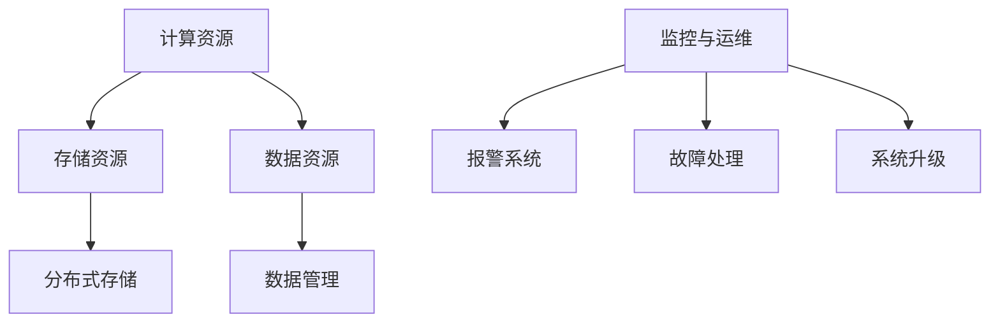

                 

 在当今的信息时代，人工智能（AI）已经成为推动技术进步和产业升级的重要力量。然而，AI 技术的快速发展背后，离不开强大且稳定的基础设施支撑。本文将探讨 AI 基础设施运营的重要性，以及如何为智能服务提供坚实的后台支撑。

## 关键词

- AI 基础设施
- 运营管理
- 智能服务
- 后台支撑

## 摘要

本文首先介绍了 AI 基础设施的背景和重要性。接着，详细阐述了 AI 基础设施运营的核心概念和架构，并通过 Mermaid 流程图进行了展示。随后，文章深入分析了核心算法的原理和操作步骤，并探讨了数学模型和公式在实际应用中的详细讲解与举例说明。接下来，文章通过一个项目实践案例，展示了代码实例和详细解释。随后，文章讨论了 AI 基础设施运营在实际应用场景中的表现，并对未来应用进行了展望。最后，文章总结了相关工具和资源，并对未来发展趋势与挑战进行了展望。

## 1. 背景介绍

人工智能，作为当今科技领域的热门话题，已经深入到我们的日常生活和各行各业。从自动驾驶、智能医疗到金融风控、电商推荐，AI 的应用无处不在。然而，这些智能服务的背后，都离不开强大、稳定且高效的 AI 基础设施支撑。

AI 基础设施，通常指的是用于支持 AI 模型和算法的硬件、软件和网络设施。它包括计算资源、存储资源、数据资源以及相关的运维管理工具。随着 AI 技术的不断进步，AI 基础设施的复杂度和规模也在迅速增长。如何高效运营和管理这些基础设施，已经成为企业和研究机构面临的重要挑战。

### 1.1 AI 基础设施的发展历程

AI 基础设施的发展可以追溯到上世纪50年代，当时计算机刚刚问世，人工智能的概念也逐渐形成。最初，AI 研究主要集中在学术领域，计算资源有限，主要以模拟和仿生算法为主。随着计算机技术的发展，AI 开始进入工业应用阶段，需要更为强大的计算资源。

进入21世纪，随着深度学习和大数据技术的兴起，AI 进入了一个新的发展周期。GPU、FPGA、TPU 等新型计算硬件的出现，极大地提升了 AI 模型的训练和推理能力。同时，云计算、分布式存储和容器技术的成熟，也为 AI 基础设施的构建提供了更多可能性。

### 1.2 AI 基础设施的重要性

AI 基础设施的重要性体现在以下几个方面：

1. **计算能力**：高效的计算能力是 AI 模型训练和推理的关键。强大的计算资源可以缩短模型训练时间，提高模型的准确性和效率。

2. **数据存储和处理**：AI 模型的训练和推理需要大量的数据支持。数据存储和处理能力决定了 AI 系统的性能和稳定性。

3. **资源调度和管理**：随着 AI 应用的多样化，资源调度和管理成为基础设施运营的核心问题。合理的资源分配和管理可以最大化资源利用率，降低运营成本。

4. **可靠性**：AI 系统的可靠性直接关系到用户体验和应用效果。稳定的基础设施可以保证服务的连续性和可靠性。

5. **安全性**：AI 系统面临着数据安全、模型安全等多重挑战。完善的安全机制是保障 AI 系统安全运行的基础。

## 2. 核心概念与联系

在了解 AI 基础设施运营的核心概念之前，我们需要明确几个关键概念，包括计算资源、存储资源、数据资源以及运维管理。

### 2.1 计算资源

计算资源是 AI 基础设施的核心组成部分，包括 CPU、GPU、TPU 等计算硬件。这些计算硬件提供了强大的计算能力，可以支持 AI 模型的训练和推理。

计算资源的调度和管理是基础设施运营的关键。常见的调度算法包括公平共享、资源预留、负载均衡等。通过合理的调度算法，可以最大化资源利用率，提高系统性能。

### 2.2 存储资源

存储资源包括本地存储、分布式存储、云存储等。它们提供了 AI 模型和数据存储的能力。

本地存储通常用于临时数据和模型存储，具有较低的延迟和较高的读写速度。分布式存储则适用于大规模数据存储和共享，具有高可用性和高可靠性。云存储则提供了灵活的存储资源管理，可以根据需求动态调整存储容量。

### 2.3 数据资源

数据资源是 AI 模型训练和推理的基础。高质量的数据可以提升模型的性能和准确度。

数据资源的管理包括数据收集、数据清洗、数据存储、数据共享等多个方面。有效的数据资源管理可以提高数据质量和利用率，为 AI 系统提供强大的支持。

### 2.4 运维管理

运维管理是确保 AI 基础设施稳定运行的重要环节。运维管理包括监控、报警、故障处理、系统升级等。

通过完善的运维管理，可以及时发现和解决系统问题，确保 AI 系统的稳定性和可靠性。

### 2.5 架构概述

下面是一个简单的 AI 基础设施架构概述：

通过上述架构，我们可以看到计算资源、存储资源、数据资源以及运维管理之间的关系。它们共同构成了一个完整的 AI 基础设施系统，为智能服务提供了坚实的后台支撑。

## 3. 核心算法原理 & 具体操作步骤

在 AI 基础设施运营中，核心算法起着至关重要的作用。本文将详细介绍核心算法的原理和具体操作步骤，并分析其优缺点以及应用领域。

### 3.1 算法原理概述

AI 基础设施运营中的核心算法主要包括以下几种：

1. **计算资源调度算法**：用于优化计算资源的分配和使用。常见的调度算法有公平共享、资源预留、负载均衡等。

2. **存储资源管理算法**：用于优化存储资源的分配和调度。常见的管理算法有数据缓存、存储压缩、数据去重等。

3. **数据资源清洗算法**：用于处理和清洗原始数据，提高数据质量和准确性。常见的数据清洗算法有缺失值处理、异常值检测、数据归一化等。

4. **运维管理算法**：用于优化运维管理的效率和效果。常见的运维管理算法有监控指标设定、故障预测、自动恢复等。

### 3.2 算法步骤详解

以下是上述核心算法的具体步骤详解：

#### 3.2.1 计算资源调度算法

1. **初始化**：根据系统负载和资源需求，初始化调度策略。

2. **负载监测**：实时监测系统负载，获取当前资源使用情况。

3. **资源分配**：根据调度策略，将可用资源分配给任务。

4. **负载均衡**：根据负载情况，动态调整资源分配，确保系统性能。

5. **资源回收**：任务完成后，回收资源，释放给其他任务。

#### 3.2.2 存储资源管理算法

1. **数据缓存**：将常用数据缓存在内存中，提高数据访问速度。

2. **存储压缩**：对数据进行压缩存储，减少存储空间占用。

3. **数据去重**：检测并去除重复数据，提高数据存储效率。

4. **数据分级存储**：根据数据重要性和访问频率，将数据分配到不同存储层次。

#### 3.2.3 数据资源清洗算法

1. **缺失值处理**：填补或删除缺失值，保证数据完整性。

2. **异常值检测**：检测并标记异常值，确保数据准确性。

3. **数据归一化**：对数据进行归一化处理，提高数据可比性。

4. **数据预处理**：对数据进行预处理，为后续分析做好准备。

#### 3.2.4 运维管理算法

1. **监控指标设定**：根据业务需求，设定监控指标，实时监测系统状态。

2. **故障预测**：通过数据分析，预测潜在故障，提前进行处理。

3. **自动恢复**：在故障发生时，自动执行恢复策略，确保系统稳定运行。

4. **系统升级**：定期对系统进行升级，提高系统性能和安全性。

### 3.3 算法优缺点

每种算法都有其优缺点，需要根据实际需求进行选择和优化。

#### 3.3.1 计算资源调度算法

**优点**：

- 提高资源利用率。
- 增强系统性能。

**缺点**：

- 调度策略复杂，实现难度大。
- 需要实时监测系统负载，对实时性要求高。

#### 3.3.2 存储资源管理算法

**优点**：

- 提高数据访问速度。
- 节省存储空间。

**缺点**：

- 数据缓存策略不当可能导致缓存失效。
- 数据压缩和解压缩会增加计算开销。

#### 3.3.3 数据资源清洗算法

**优点**：

- 提高数据质量。
- 优化数据分析和挖掘。

**缺点**：

- 数据清洗过程可能引入新的错误。
- 数据清洗算法复杂，计算开销大。

#### 3.3.4 运维管理算法

**优点**：

- 提高系统可靠性。
- 降低运维成本。

**缺点**：

- 需要大量监控数据，对存储资源要求高。
- 故障预测和自动恢复算法实现难度大。

### 3.4 算法应用领域

核心算法广泛应用于各种 AI 应用场景，包括：

1. **智能医疗**：用于医疗影像分析、疾病预测等。

2. **金融风控**：用于信用评估、风险控制等。

3. **自动驾驶**：用于环境感知、路径规划等。

4. **电商推荐**：用于商品推荐、用户行为分析等。

5. **智能客服**：用于语音识别、语义理解等。

## 4. 数学模型和公式 & 详细讲解 & 举例说明

在 AI 基础设施运营中，数学模型和公式起着关键作用。本文将详细介绍数学模型的构建、公式推导过程以及实际应用中的详细讲解与举例说明。

### 4.1 数学模型构建

数学模型是描述现实世界问题的数学表示，是解决复杂问题的有力工具。在 AI 基础设施运营中，常见的数学模型包括优化模型、概率模型和统计模型等。

#### 4.1.1 优化模型

优化模型用于优化资源分配、任务调度等问题。常见的优化模型有线性规划、整数规划、混合整数规划等。

**线性规划（Linear Programming，LP）**

线性规划是一种最优化方法，用于解决线性目标函数在给定线性不等式约束下的最优解问题。其数学模型表示如下：

$$
\min c^T x
$$

subject to

$$
Ax \leq b
$$

$$
x \geq 0
$$

其中，$c$ 是目标函数系数向量，$x$ 是变量向量，$A$ 和 $b$ 分别是约束矩阵和约束向量。

**整数规划（Integer Programming，IP）**

整数规划是一种优化方法，用于求解目标函数在整数约束下的最优解。其数学模型表示如下：

$$
\min c^T x
$$

subject to

$$
Ax \leq b
$$

$$
x \in Z^n
$$

其中，$c$、$A$ 和 $b$ 的含义与线性规划相同，$Z$ 表示整数集合。

**混合整数规划（Mixed Integer Programming，MIP）**

混合整数规划是一种优化方法，用于求解目标函数在整数和连续变量约束下的最优解。其数学模型表示如下：

$$
\min c^T x
$$

subject to

$$
Ax \leq b
$$

$$
Mx \leq d
$$

$$
x \in Z^n
$$

其中，$c$、$A$、$b$、$M$ 和 $d$ 的含义与整数规划相同，$Z$ 表示整数集合。

#### 4.1.2 概率模型

概率模型用于描述随机事件的发生概率和概率分布。常见的概率模型有贝叶斯网络、马尔可夫模型等。

**贝叶斯网络（Bayesian Network）**

贝叶斯网络是一种基于概率的图模型，用于表示变量之间的依赖关系。其数学模型表示如下：

$$
P(X_1, X_2, \ldots, X_n) = \prod_{i=1}^n P(X_i | X_{pa

