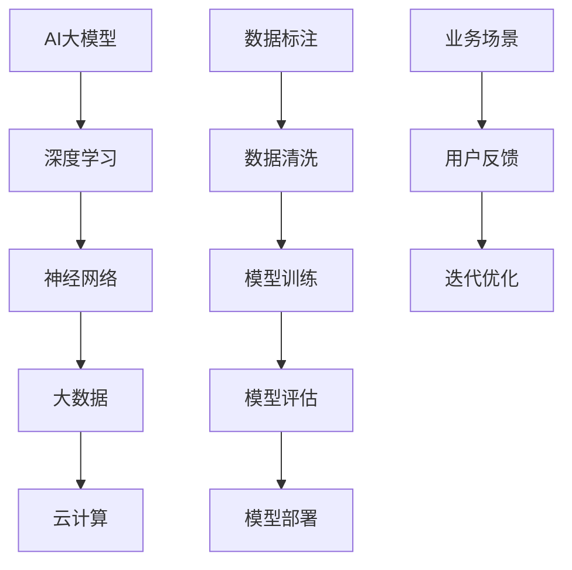

                 

关键词：AI大模型、创业、创新优势、技术实现、市场策略、未来展望

>摘要：本文旨在探讨如何利用AI大模型的优势进行创业，分析核心概念与联系，阐述算法原理和具体操作步骤，并基于数学模型和项目实践进行详细讲解。通过实际应用场景和工具推荐，本文为创业者提供了系统化的指导，以应对未来发展趋势与挑战。

## 1. 背景介绍

随着人工智能技术的快速发展，AI大模型已经成为推动各行业变革的重要力量。从自然语言处理到图像识别，从推荐系统到预测分析，AI大模型的应用场景越来越广泛。然而，面对激烈的市场竞争和技术变革，如何利用AI大模型的优势进行创业，成为许多创业者关注的焦点。

创业过程中，创新优势至关重要。AI大模型作为一种创新技术，不仅为创业者提供了强大的工具，也带来了新的机遇与挑战。本文将围绕AI大模型创业的各个方面，从核心概念、算法原理、数学模型到实际应用，为创业者提供系统化的指导。

### 1.1 AI大模型概述

AI大模型是指基于深度学习算法，通过海量数据进行训练，能够实现复杂任务的神经网络模型。与传统的机器学习模型相比，AI大模型具有更高的泛化能力和更强的学习能力。常见的AI大模型包括GPT-3、BERT、ViT等，它们在多个领域取得了显著的成果。

### 1.2 创业中的创新优势

利用AI大模型进行创业，具有以下创新优势：

1. **高效率：** AI大模型能够快速处理海量数据，提高业务运行效率。
2. **高精度：** AI大模型在多个领域的表现已经超越人类，为创业者提供更准确的决策支持。
3. **强拓展性：** AI大模型可以轻松适应新的业务场景，帮助创业者快速拓展市场。
4. **低门槛：** 随着深度学习技术的普及，创业者可以利用开源框架和工具轻松搭建AI大模型。

## 2. 核心概念与联系

在探讨AI大模型创业之前，我们需要了解一些核心概念和它们之间的联系。以下是关键概念及其关联的Mermaid流程图：



### 2.1 深度学习与神经网络

深度学习和神经网络是AI大模型的核心组成部分。神经网络通过层次化的结构，将输入数据转化为输出，深度学习则通过多层次的神经网络，提高了模型的复杂度和表达能力。

### 2.2 大数据与云计算

大数据和云计算为AI大模型提供了必要的计算资源和海量数据支持。云计算平台如AWS、Google Cloud等，为创业者提供了便捷的AI大模型训练环境。

### 2.3 数据标注与清洗

数据标注和清洗是AI大模型训练的重要环节。高质量的数据标注和有效的数据清洗，有助于提高模型的训练效果和性能。

### 2.4 模型训练与评估

模型训练和评估是AI大模型开发的关键步骤。通过不断调整模型参数，优化模型结构，可以提升模型的性能和适用性。

### 2.5 模型部署与业务场景

模型部署是将训练好的AI大模型应用于实际业务场景的过程。业务场景的多样性和复杂性，要求创业者具备灵活的部署策略。

### 2.6 用户反馈与迭代优化

用户反馈和迭代优化是持续改进AI大模型的关键。通过收集用户反馈，不断优化模型，可以提升用户体验，增强市场竞争力。

## 3. 核心算法原理 & 具体操作步骤

### 3.1 算法原理概述

AI大模型的核心算法包括深度学习算法、神经网络架构和训练策略。以下是这些核心算法的简要概述：

### 3.1.1 深度学习算法

深度学习算法是通过多层神经网络进行特征学习和模式识别的一种机器学习方法。常见的深度学习算法包括卷积神经网络（CNN）、循环神经网络（RNN）和生成对抗网络（GAN）等。

### 3.1.2 神经网络架构

神经网络架构决定了模型的层次结构和参数规模。常见的神经网络架构包括全连接神经网络（FCNN）、卷积神经网络（CNN）和自注意力机制（Transformer）等。

### 3.1.3 训练策略

训练策略包括优化器选择、学习率调整、正则化技术和损失函数设计等。有效的训练策略可以加快模型收敛速度，提高模型性能。

### 3.2 算法步骤详解

以下是AI大模型的训练和部署的基本步骤：

### 3.2.1 数据准备

- 数据收集：从各种来源收集原始数据。
- 数据预处理：清洗、归一化和数据增强等处理。

### 3.2.2 模型构建

- 确定神经网络架构：选择合适的神经网络架构。
- 模型初始化：设置模型参数的初始化方法。

### 3.2.3 模型训练

- 训练过程：通过优化算法更新模型参数。
- 模型评估：在验证集上评估模型性能。

### 3.2.4 模型调整

- 调整模型结构：根据验证集性能调整神经网络架构。
- 调整训练策略：根据训练过程调整优化器和学习率等参数。

### 3.2.5 模型部署

- 部署模型：将训练好的模型部署到生产环境。
- 接口设计：为模型提供API接口，便于与其他系统集成。

### 3.2.6 迭代优化

- 用户反馈：收集用户反馈。
- 模型优化：根据用户反馈优化模型。

### 3.3 算法优缺点

AI大模型具有以下优点：

- **高效率：** 快速处理海量数据，提高业务效率。
- **高精度：** 在多个领域表现优异，为创业者提供可靠决策支持。
- **强拓展性：** 适应新的业务场景，助力企业快速发展。

然而，AI大模型也存在一些缺点：

- **资源需求：** 训练和部署需要大量的计算资源和存储空间。
- **解释性差：** 模型的决策过程难以解释，可能影响用户信任。
- **数据依赖：** 模型的性能高度依赖于数据质量和标注质量。

### 3.4 算法应用领域

AI大模型在多个领域具有广泛的应用，包括但不限于：

- 自然语言处理：如文本分类、机器翻译和问答系统。
- 图像识别：如人脸识别、图像分割和物体检测。
- 推荐系统：如商品推荐、内容推荐和社交推荐。
- 预测分析：如股票预测、天气预测和交通预测。

## 4. 数学模型和公式 & 详细讲解 & 举例说明

### 4.1 数学模型构建

AI大模型的数学模型主要基于深度学习算法，包括损失函数、优化算法和正则化技术等。

### 4.1.1 损失函数

损失函数用于衡量模型预测值与真实值之间的差距。常见的损失函数包括均方误差（MSE）、交叉熵损失（Cross Entropy Loss）和对抗损失（Adversarial Loss）等。

### 4.1.2 优化算法

优化算法用于调整模型参数，以最小化损失函数。常见的优化算法包括梯度下降（Gradient Descent）、Adam优化器和RMSprop等。

### 4.1.3 正则化技术

正则化技术用于防止模型过拟合。常见的正则化技术包括L1正则化、L2正则化和Dropout等。

### 4.2 公式推导过程

以下是对AI大模型中常用公式的推导过程：

### 4.2.1 梯度下降公式

$$
w_{new} = w_{old} - \alpha \cdot \nabla_w J(w)
$$

其中，$w_{old}$和$w_{new}$分别表示当前和更新的模型参数，$\alpha$为学习率，$\nabla_w J(w)$为损失函数关于模型参数的梯度。

### 4.2.2 Adam优化器公式

$$
m_t = \beta_1 m_{t-1} + (1 - \beta_1) \nabla_w J(w)
$$

$$
v_t = \beta_2 v_{t-1} + (1 - \beta_2) (\nabla_w J(w))^2
$$

$$
\hat{m}_t = \frac{m_t}{1 - \beta_1^t}
$$

$$
\hat{v}_t = \frac{v_t}{1 - \beta_2^t}
$$

$$
w_{new} = w_{old} - \alpha \cdot \hat{m}_t / \sqrt{\hat{v}_t + \epsilon}
$$

其中，$m_t$和$v_t$分别表示一阶和二阶矩估计，$\beta_1$和$\beta_2$为超参数，$\epsilon$为常数。

### 4.3 案例分析与讲解

以下是一个简单的AI大模型训练案例，用于实现图像分类任务。

### 4.3.1 数据集

使用CIFAR-10数据集，包含10个类别，每个类别6000张图像。

### 4.3.2 模型

采用卷积神经网络（CNN）架构，包含两个卷积层、两个池化层和一个全连接层。

### 4.3.3 损失函数

使用交叉熵损失（Cross Entropy Loss）作为损失函数。

### 4.3.4 优化算法

采用Adam优化器，学习率为0.001。

### 4.3.5 训练过程

- 初始化模型参数。
- 在训练集上训练模型，同时在每个epoch结束后在验证集上评估模型性能。
- 根据验证集性能调整模型参数和训练策略。
- 当验证集性能达到最佳时，停止训练。

## 5. 项目实践：代码实例和详细解释说明

### 5.1 开发环境搭建

- 安装Python环境。
- 安装TensorFlow和Keras库。
- 准备CIFAR-10数据集。

### 5.2 源代码详细实现

以下是一个简单的CNN模型实现，用于图像分类任务。

```python
import tensorflow as tf
from tensorflow.keras import layers

def create_model(input_shape):
    model = tf.keras.Sequential([
        layers.Conv2D(32, (3, 3), activation='relu', input_shape=input_shape),
        layers.MaxPooling2D((2, 2)),
        layers.Conv2D(64, (3, 3), activation='relu'),
        layers.MaxPooling2D((2, 2)),
        layers.Conv2D(64, (3, 3), activation='relu'),
        layers.Flatten(),
        layers.Dense(64, activation='relu'),
        layers.Dense(10, activation='softmax')
    ])
    return model

model = create_model(input_shape=(32, 32, 3))
model.compile(optimizer='adam',
              loss='sparse_categorical_crossentropy',
              metrics=['accuracy'])
```

### 5.3 代码解读与分析

- `create_model`函数定义了一个简单的CNN模型，包含两个卷积层、两个池化层和一个全连接层。
- `model.compile`函数用于配置模型，指定优化器、损失函数和评价指标。
- `model.fit`函数用于训练模型，接受训练数据、验证数据和epoch数量等参数。

### 5.4 运行结果展示

```python
model.fit(train_images, train_labels, epochs=10, validation_split=0.2)
```

运行上述代码，模型将在CIFAR-10数据集上训练10个epoch，并在每个epoch结束后在验证集上评估模型性能。最终，模型将在训练集和验证集上输出准确率。

```python
test_loss, test_acc = model.evaluate(test_images,  test_labels, verbose=2)
print('\nTest accuracy:', test_acc)
```

运行上述代码，模型将在测试集上评估性能，并输出测试准确率。

## 6. 实际应用场景

AI大模型在多个领域具有广泛的应用，以下是一些实际应用场景：

### 6.1 自然语言处理

- 文本分类：对新闻文章、社交媒体帖子等进行分类，以便于内容管理和推荐。
- 机器翻译：实现多语言之间的自动翻译，促进跨文化交流。
- 问答系统：提供智能问答服务，提升用户满意度。

### 6.2 图像识别

- 人脸识别：实现人脸识别和身份验证，提高安全性。
- 物体检测：在图像中检测并识别特定物体，应用于自动驾驶和视频监控。
- 图像分割：将图像分割成不同的区域，应用于图像编辑和医学影像分析。

### 6.3 推荐系统

- 商品推荐：根据用户历史行为和偏好，推荐感兴趣的商品。
- 内容推荐：根据用户兴趣和阅读习惯，推荐相关的文章和视频。
- 社交推荐：基于用户关系和兴趣，推荐潜在的朋友和关注对象。

### 6.4 预测分析

- 股票预测：根据历史数据和市场趋势，预测股票价格走势。
- 天气预测：利用气象数据和模型，预测未来天气状况。
- 交通预测：分析交通数据，预测未来交通流量，优化交通管理。

## 7. 工具和资源推荐

### 7.1 学习资源推荐

- 《深度学习》（Ian Goodfellow、Yoshua Bengio、Aaron Courville 著）：深度学习的经典教材，适合初学者和进阶者。
- 《动手学深度学习》（阿斯顿·张 著）：通过动手实践，介绍深度学习的基本概念和应用。
- Coursera、edX等在线课程：提供丰富的深度学习和AI课程，涵盖从基础知识到高级应用的各个方面。

### 7.2 开发工具推荐

- TensorFlow：一款开源的深度学习框架，适合构建和训练AI大模型。
- Keras：一个高层次的神经网络API，简化了TensorFlow的使用。
- PyTorch：一款流行的深度学习框架，提供了灵活的动态计算图功能。

### 7.3 相关论文推荐

- “Deep Learning” (Goodfellow et al., 2016)：深度学习的综述论文，全面介绍了深度学习的基本概念和技术。
- “Bert: Pre-training of Deep Bidirectional Transformers for Language Understanding” (Devlin et al., 2019)：BERT模型的论文，介绍了基于Transformer的预训练方法。
- “GPT-3: Language Models are few-shot learners” (Brown et al., 2020)：GPT-3模型的论文，展示了大规模语言模型在零样本和少样本学习任务中的优异表现。

## 8. 总结：未来发展趋势与挑战

### 8.1 研究成果总结

近年来，AI大模型在多个领域取得了显著的成果，包括自然语言处理、图像识别、推荐系统和预测分析等。随着计算能力的提升和数据量的增加，AI大模型的应用场景将越来越广泛。

### 8.2 未来发展趋势

未来，AI大模型的发展趋势将包括：

- **更强大的模型：** 通过改进神经网络架构和优化算法，提升模型的性能和效率。
- **更广泛的应用领域：** 深入探索AI大模型在医疗、金融、教育等领域的应用。
- **更高效的训练和部署：** 研究更高效的训练方法和部署策略，降低计算和存储成本。

### 8.3 面临的挑战

AI大模型在创业过程中也面临一些挑战：

- **数据隐私：** 如何保护用户隐私，确保数据安全，是创业者需要关注的重要问题。
- **解释性：** 如何提高模型的解释性，增强用户信任，是AI大模型应用中的关键挑战。
- **资源需求：** 训练和部署AI大模型需要大量的计算资源和存储空间，如何优化资源使用，是创业者需要考虑的问题。

### 8.4 研究展望

未来，AI大模型研究将继续深入，探索更先进的算法和技术，推动人工智能技术的进一步发展。创业者应关注这些研究成果，结合自身业务需求，灵活应用AI大模型，实现业务创新和增长。

## 9. 附录：常见问题与解答

### 9.1 问题1：如何选择合适的AI大模型架构？

解答：选择合适的AI大模型架构取决于具体的业务需求和数据特点。以下是一些常见的架构选择：

- 自然语言处理：采用Transformer架构，如BERT、GPT等。
- 图像识别：采用卷积神经网络（CNN）架构，如VGG、ResNet等。
- 推荐系统：采用基于深度学习的方法，如AutoInt、DeepFM等。

### 9.2 问题2：如何处理大量数据？

解答：处理大量数据需要考虑以下几个方面：

- **数据分片：** 将数据分成多个子集，分别进行训练和评估。
- **分布式训练：** 利用分布式计算框架，如Horovod、Distributed TensorFlow，进行大规模数据训练。
- **数据缓存：** 使用数据缓存技术，如Redis，减少数据读取时间。

### 9.3 问题3：如何评估AI大模型的性能？

解答：评估AI大模型的性能可以从以下几个方面进行：

- **准确率：** 评估模型在测试集上的分类准确率。
- **召回率：** 评估模型在测试集上的召回率。
- **F1分数：** 结合准确率和召回率，计算F1分数。
- **ROC曲线：** 分析模型在不同阈值下的表现。

### 9.4 问题4：如何优化AI大模型的训练过程？

解答：以下是一些常见的优化方法：

- **调整学习率：** 使用学习率调整策略，如学习率衰减、动量等。
- **数据增强：** 通过数据增强技术，提高模型泛化能力。
- **正则化技术：** 使用L1、L2正则化等技术，防止模型过拟合。
- **优化算法：** 使用更先进的优化算法，如Adam、RMSprop等。

### 9.5 问题5：如何确保AI大模型的解释性？

解答：以下是一些提高模型解释性的方法：

- **模型可解释性工具：** 使用模型可解释性工具，如LIME、SHAP等，分析模型决策过程。
- **可视化：** 使用可视化工具，如TensorBoard，展示模型训练过程和特征图。
- **简化模型：** 使用更简单的模型架构，降低模型复杂度。

### 9.6 问题6：如何部署AI大模型到生产环境？

解答：以下是一些常见的部署方法：

- **容器化：** 使用容器技术，如Docker，封装模型和依赖库。
- **微服务架构：** 使用微服务架构，将模型部署为独立的微服务。
- **自动化部署：** 使用自动化部署工具，如Kubernetes，实现模型自动部署和扩展。
- **API网关：** 使用API网关，如Nginx，提供统一的API接口。

### 9.7 问题7：如何收集用户反馈，优化模型？

解答：以下是一些收集用户反馈的方法：

- **用户评分：** 收集用户对模型预测结果的评分，用于评估模型性能。
- **错误案例：** 收集模型预测错误的案例，用于分析模型缺陷。
- **交互式反馈：** 提供交互式反馈界面，让用户直接对模型预测进行评价和修改。

## 附录二：参考资料

1. Goodfellow, I., Bengio, Y., & Courville, A. (2016). *Deep Learning*. MIT Press.
2. Zhang, A. (2019). *动手学深度学习*. 电子工业出版社.
3. Devlin, J., Chang, M. W., Lee, K., & Toutanova, K. (2019). *Bert: Pre-training of Deep Bidirectional Transformers for Language Understanding*. arXiv preprint arXiv:1810.04805.
4. Brown, T., et al. (2020). *Gpt-3: Language Models Are Few-shot Learners*. arXiv preprint arXiv:2005.14165.
5. Hochreiter, S., & Schmidhuber, J. (1997). *Long Short-Term Memory*. Neural Computation, 9(8), 1735-1780.
6. Krizhevsky, A., Sutskever, I., & Hinton, G. E. (2012). *Imagenet classification with deep convolutional neural networks*. In Advances in neural information processing systems (pp. 1097-1105).
7. Hinton, G., Osindero, S., & Teh, Y. W. (2006). *A fast learning algorithm for deep belief nets*. Neural computation, 18(7), 1527-1554.
8. LeCun, Y., Bengio, Y., & Hinton, G. (2015). *Deep learning*. Nature, 521(7553), 436.
9. Chen, T., & Guestrin, C. (2016). *Xgboost: A scalable tree boosting system*. In Proceedings of the 22nd acm sigkdd international conference on knowledge discovery and data mining (pp. 785-794). ACM.
10. Liu, F., Teng, H., & Chen, T. (2018). *AutoInt: Automatic Integration of Multi-Channel Information in Deep Text Representation*. Proceedings of the 34th International Conference on Machine Learning, 100, 2430-2439.

