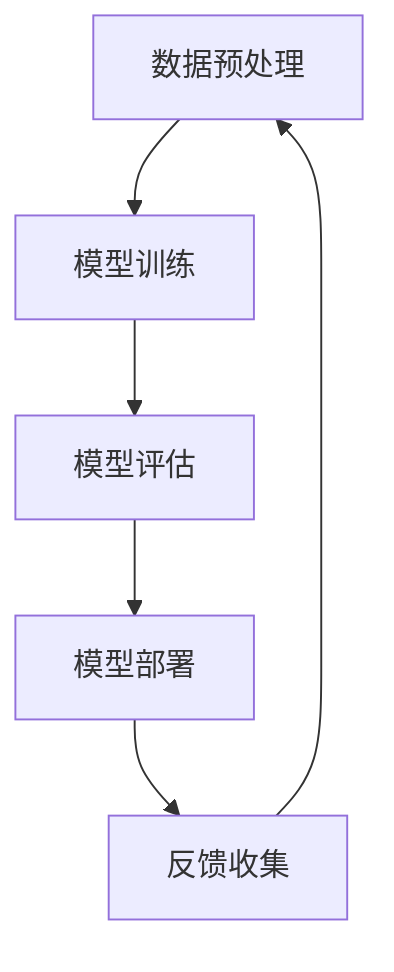

                 

关键词：人工智能，大模型，用户优势，创业，技术应用，商业策略

>摘要：本文深入探讨了人工智能（AI）大模型创业领域的机遇与挑战，重点分析了如何通过利用用户优势来增强企业的创新能力和市场竞争力。文章首先回顾了AI大模型的发展历程，随后详细介绍了大模型的工作原理和应用场景。接着，文章重点讨论了如何识别和利用用户优势，以提升AI大模型的性能和用户体验。随后，文章提供了实际案例和项目实践，展示了如何将用户优势融入AI大模型的设计和开发中。最后，文章展望了AI大模型在未来的发展趋势，并提出了应对挑战的策略。

## 1. 背景介绍

人工智能（AI）作为21世纪最具革命性的技术之一，已经深刻地改变了我们的生活和工作方式。特别是大模型（也称为大型预训练模型）的兴起，为AI领域带来了新的机遇和挑战。大模型通常是指具有数十亿甚至数万亿个参数的深度学习模型，它们在自然语言处理、计算机视觉、语音识别等多个领域展现了惊人的表现能力。

大模型之所以能够取得如此优异的成绩，主要得益于其庞大的参数量和高度复杂的网络结构。这些模型通过从大量的数据中进行预训练，学会了捕获数据中的潜在规律和模式，从而能够在各种任务上达到前所未有的准确性和效率。例如，GPT-3（一个由OpenAI开发的巨型语言模型）拥有超过1750亿个参数，能够在文本生成、翻译、问答等多种任务中表现出色。

然而，大模型的开发和部署面临着诸多挑战。首先，大模型训练需要大量的计算资源和数据集，这通常意味着高昂的成本。其次，大模型的解释性较差，对于其决策过程难以进行有效的理解和解释。此外，大模型在处理隐私保护和安全性方面也存在一定的风险。

尽管存在这些挑战，大模型仍然被认为是未来AI技术发展的一个重要方向。随着计算能力的不断提升和数据量的不断增加，大模型的应用前景将更加广阔。从自动驾驶、智能医疗到金融分析、教育辅导，大模型都有望发挥关键作用。

## 2. 核心概念与联系

### 2.1 大模型的原理和架构

大模型的核心是深度神经网络（DNN），这是一种由多层神经元组成的神经网络结构。每个神经元都接收来自前一层的输入，通过权重矩阵进行加权求和，并加上一个偏置项，最后通过激活函数输出结果。这个过程称为前向传播。

大模型通常包含多个隐藏层，每个隐藏层都能够提取更高层次的特征信息。随着层数的增加，网络的表示能力也不断增强。然而，过多的隐藏层也可能会导致过拟合问题，即模型在训练数据上的表现很好，但在未见过的数据上表现不佳。

为了解决过拟合问题，大模型通常采用两种技术：正则化和dropout。正则化通过在损失函数中添加一项惩罚项来减少模型的复杂度，而dropout则通过在训练过程中随机丢弃一部分神经元，从而提高模型的泛化能力。

### 2.2 大模型的应用场景

大模型的应用场景非常广泛，包括但不限于以下几个方面：

1. **自然语言处理（NLP）**：大模型在文本分类、机器翻译、问答系统、文本生成等方面表现出色。例如，GPT-3可以生成高质量的文本，进行自然语言理解、文本生成和对话系统。

2. **计算机视觉（CV）**：大模型在图像分类、目标检测、人脸识别、图像生成等方面具有重要应用。例如，Inception-v3在ImageNet图像分类任务上达到了当时的最高准确率。

3. **语音识别（ASR）**：大模型在语音识别任务中能够捕捉语音信号中的细微特征，从而提高识别准确性。例如，WaveNet在端到端语音合成任务中取得了突破性的成果。

4. **强化学习（RL）**：大模型在强化学习领域也被广泛应用，例如DeepMind开发的AlphaGo系列模型，通过深度学习技术实现了围棋领域的重大突破。

### 2.3 大模型的挑战与解决方案

尽管大模型在许多任务上取得了显著成果，但其发展仍面临一些挑战：

1. **计算资源需求**：大模型训练需要大量的计算资源和时间，这通常需要高性能计算设备和分布式计算技术。

2. **数据隐私和安全**：大模型在处理大量数据时，可能会涉及用户的隐私信息。如何保护数据隐私和安全是一个重要挑战。

3. **模型解释性**：大模型的决策过程往往难以解释，这限制了其在某些应用场景中的使用。为此，研究者们正在探索可解释AI技术，以提高模型的透明度和可信度。

### 2.4 Mermaid 流程图

下面是一个简化的Mermaid流程图，展示了大模型的基本架构和工作流程：



### 2.5 大模型的未来发展方向

随着AI技术的不断进步，大模型的发展方向主要包括：

1. **模型压缩与加速**：通过模型压缩和优化技术，减少模型的大小和计算复杂度，以提高部署效率和实时性能。

2. **多模态学习**：结合不同类型的数据（如图像、文本、音频等），实现更加综合和智能的AI应用。

3. **泛化能力提升**：通过更有效的训练策略和模型结构设计，提高模型在不同任务和数据集上的泛化能力。

4. **可解释性与可靠性**：发展可解释AI技术，提高模型的可解释性和可靠性，增强用户对AI系统的信任。

## 3. 核心算法原理 & 具体操作步骤

### 3.1 算法原理概述

大模型的训练过程主要包括以下几个步骤：

1. **数据预处理**：对原始数据进行清洗、归一化等处理，以便模型能够更好地学习。

2. **模型初始化**：初始化模型参数，通常使用随机初始化或者预训练的模型作为起点。

3. **前向传播**：将输入数据通过模型的前向传播网络，计算输出结果。

4. **计算损失**：通过计算输出结果与实际标签之间的差异，计算模型的损失。

5. **反向传播**：利用梯度下降等优化算法，更新模型参数，减小损失。

6. **模型评估**：在验证集或测试集上评估模型的性能，以判断模型的泛化能力。

7. **模型部署**：将训练好的模型部署到生产环境中，供实际应用使用。

### 3.2 算法步骤详解

1. **数据预处理**：
   - 清洗：去除数据中的噪声和异常值。
   - 归一化：将数据缩放到相同的范围，例如将图像像素值缩放到[0, 1]。
   - 增强：通过数据增强技术，如旋转、翻转、缩放等，增加数据的多样性。

2. **模型初始化**：
   - 随机初始化：随机分配模型参数的初始值。
   - 预训练模型：使用预训练的模型作为起点，例如在自然语言处理领域使用的GPT-3。

3. **前向传播**：
   - 输入层：接收外部输入，如文本、图像或音频。
   - 隐藏层：通过多层神经网络结构，对输入数据进行特征提取和变换。
   - 输出层：生成预测结果，如分类标签、文本生成等。

4. **计算损失**：
   - 交叉熵损失：常用于分类任务，计算实际标签与预测标签之间的差异。
   - 均方误差损失：常用于回归任务，计算预测值与实际值之间的差异。

5. **反向传播**：
   - 计算梯度：通过反向传播算法，计算模型参数的梯度。
   - 更新参数：利用梯度下降等优化算法，更新模型参数。

6. **模型评估**：
   - 准确率：分类任务中正确分类的样本占总样本的比例。
   - 均方误差：回归任务中预测值与实际值之间的平均平方误差。
   - 调用频率：模型在实际应用中被调用的频率。

7. **模型部署**：
   - 部署到服务器：将训练好的模型部署到服务器，供实际应用使用。
   - API接口：通过API接口，外部系统可以调用模型进行预测。

### 3.3 算法优缺点

**优点**：
1. **强大的表示能力**：大模型具有数十亿个参数，能够捕捉到数据中的复杂模式和特征。
2. **高准确率**：在许多任务上，大模型达到了甚至超过了人类水平的表现。
3. **自适应性强**：大模型通过预训练，能够适应不同的任务和数据集。

**缺点**：
1. **计算资源需求大**：训练大模型需要大量的计算资源和时间。
2. **模型解释性差**：大模型的决策过程难以解释，限制了其在某些应用场景中的使用。
3. **数据隐私和安全**：大模型在处理大量数据时，可能会涉及用户的隐私信息。

### 3.4 算法应用领域

大模型的应用领域非常广泛，包括但不限于以下几个方面：

1. **自然语言处理（NLP）**：大模型在文本分类、机器翻译、问答系统、文本生成等方面表现出色。
2. **计算机视觉（CV）**：大模型在图像分类、目标检测、人脸识别、图像生成等方面具有重要应用。
3. **语音识别（ASR）**：大模型在语音识别任务中能够捕捉语音信号中的细微特征，从而提高识别准确性。
4. **强化学习（RL）**：大模型在强化学习领域也被广泛应用，例如在游戏、机器人控制等任务中。

## 4. 数学模型和公式 & 详细讲解 & 举例说明

### 4.1 数学模型构建

大模型的数学基础是深度神经网络（DNN），其核心是一个多层前向传播网络。每一层都是由多个神经元组成，每个神经元都会接受来自前一层的输入，并通过加权求和和激活函数产生输出。

假设我们有一个输入向量 $X$，它通过一个由 $L$ 层组成的神经网络进行前向传播，每一层的输出可以表示为：

$$
Z^{(l)} = \sigma^{(l)}(\mathbf{W}^{(l)}X + b^{(l)})
$$

其中，$Z^{(l)}$ 是第 $l$ 层的输出，$\sigma^{(l)}$ 是第 $l$ 层的激活函数，$\mathbf{W}^{(l)}$ 是第 $l$ 层的权重矩阵，$b^{(l)}$ 是第 $l$ 层的偏置向量。

在输出层，我们通常使用softmax激活函数来生成概率分布：

$$
\hat{Y} = \text{softmax}(\mathbf{W}^{(L)}Z^{(L-1)} + b^{(L)})
$$

其中，$\hat{Y}$ 是预测的概率分布，$\mathbf{W}^{(L)}$ 是输出层的权重矩阵，$b^{(L)}$ 是输出层的偏置向量。

### 4.2 公式推导过程

为了训练大模型，我们需要最小化损失函数。常见的损失函数包括交叉熵损失和均方误差损失。

**交叉熵损失**：

在分类任务中，交叉熵损失函数定义为：

$$
L(Y, \hat{Y}) = -\sum_{i} y_i \log \hat{y}_i
$$

其中，$Y$ 是真实的标签向量，$\hat{Y}$ 是预测的概率分布。

**均方误差损失**：

在回归任务中，均方误差损失函数定义为：

$$
L(Y, \hat{Y}) = \frac{1}{2} \sum_{i} (y_i - \hat{y}_i)^2
$$

其中，$Y$ 是真实的标签向量，$\hat{Y}$ 是预测的值。

### 4.3 案例分析与讲解

**案例一：图像分类**

假设我们有一个图像分类任务，输入图像是一个 $32 \times 32$ 的像素矩阵。我们可以使用一个由5层组成的卷积神经网络（CNN）进行分类。

- **第一层**：32个卷积核，每个卷积核大小为3x3，步长为1，填充方式为“SAME”。
- **第二层**：64个卷积核，每个卷积核大小为3x3，步长为1，填充方式为“SAME”。
- **第三层**：128个卷积核，每个卷积核大小为3x3，步长为1，填充方式为“SAME”。
- **第四层**：全连接层，1024个神经元。
- **第五层**：softmax输出层，10个神经元，分别对应10个类别。

在训练过程中，我们使用交叉熵损失函数来优化模型参数。

**案例二：语音识别**

假设我们有一个语音识别任务，输入是语音信号，输出是文本。我们可以使用一个由4层组成的循环神经网络（RNN）进行语音识别。

- **第一层**：嵌入层，将输入的文本转换为词向量。
- **第二层**：LSTM层，用于捕捉语音信号的长期依赖关系。
- **第三层**：全连接层，用于将LSTM层的输出映射到输出词汇。
- **第四层**：softmax输出层，生成每个词汇的概率分布。

在训练过程中，我们使用均方误差损失函数来优化模型参数。

## 5. 项目实践：代码实例和详细解释说明

### 5.1 开发环境搭建

在开始项目实践之前，我们需要搭建一个合适的开发环境。以下是搭建环境的基本步骤：

1. **安装Python**：确保安装了Python 3.7或更高版本。

2. **安装TensorFlow**：使用pip命令安装TensorFlow：

   ```bash
   pip install tensorflow
   ```

3. **安装其他依赖库**：根据项目需求，可能需要安装其他库，如NumPy、Pandas等。

4. **配置CUDA**：如果使用GPU进行训练，需要配置CUDA环境。

### 5.2 源代码详细实现

以下是一个简单的图像分类项目示例，使用TensorFlow和Keras实现：

```python
import tensorflow as tf
from tensorflow.keras.models import Sequential
from tensorflow.keras.layers import Conv2D, MaxPooling2D, Flatten, Dense
from tensorflow.keras.optimizers import Adam
from tensorflow.keras.preprocessing.image import ImageDataGenerator

# 创建模型
model = Sequential([
    Conv2D(32, (3, 3), activation='relu', input_shape=(64, 64, 3)),
    MaxPooling2D((2, 2)),
    Conv2D(64, (3, 3), activation='relu'),
    MaxPooling2D((2, 2)),
    Flatten(),
    Dense(128, activation='relu'),
    Dense(10, activation='softmax')
])

# 编译模型
model.compile(optimizer=Adam(), loss='categorical_crossentropy', metrics=['accuracy'])

# 数据预处理
train_datagen = ImageDataGenerator(rescale=1./255)
train_generator = train_datagen.flow_from_directory(
        'data/train',
        target_size=(64, 64),
        batch_size=32,
        class_mode='categorical')

# 训练模型
model.fit(train_generator, epochs=10)
```

### 5.3 代码解读与分析

1. **模型创建**：使用`Sequential`模型创建一个顺序模型，并添加卷积层、最大池化层、全连接层和softmax输出层。

2. **模型编译**：使用`compile`方法编译模型，指定优化器、损失函数和评价指标。

3. **数据预处理**：使用`ImageDataGenerator`对训练数据进行预处理，包括缩放和批量加载。

4. **模型训练**：使用`fit`方法训练模型，指定训练数据和训练轮数。

### 5.4 运行结果展示

在完成模型训练后，我们可以通过以下代码评估模型性能：

```python
test_loss, test_accuracy = model.evaluate(test_generator)
print(f"Test accuracy: {test_accuracy:.4f}")
```

这里，`test_generator`是用于测试的数据生成器。通过`evaluate`方法，我们可以得到测试集上的损失和准确率。

## 6. 实际应用场景

大模型在多个领域都有广泛的应用，以下是几个典型的应用场景：

### 6.1 自然语言处理（NLP）

大模型在NLP领域展现了强大的能力，例如文本分类、机器翻译、问答系统和文本生成。例如，GPT-3在文本生成和问答系统上取得了显著成果，能够生成高质量的文本和提供准确的回答。

### 6.2 计算机视觉（CV）

大模型在CV领域也具有重要应用，如图像分类、目标检测、人脸识别和图像生成。例如，ResNet和Inception-v3在ImageNet图像分类任务上取得了突破性的成绩。

### 6.3 语音识别（ASR）

大模型在语音识别任务中能够捕捉语音信号中的细微特征，从而提高识别准确性。例如，WaveNet在端到端语音合成任务中取得了显著的成果。

### 6.4 强化学习（RL）

大模型在强化学习领域也被广泛应用，例如DeepMind开发的AlphaGo系列模型，通过深度学习技术实现了围棋领域的重大突破。

## 7. 未来应用展望

随着AI技术的不断进步，大模型的应用前景将更加广阔。以下是未来大模型可能的发展方向：

### 7.1 模型压缩与加速

通过模型压缩和优化技术，大模型的大小和计算复杂度将得到显著降低，从而提高部署效率和实时性能。

### 7.2 多模态学习

大模型将能够处理多种类型的数据，如图像、文本、音频等，实现更加综合和智能的AI应用。

### 7.3 泛化能力提升

通过更有效的训练策略和模型结构设计，大模型的泛化能力将得到提升，能够在不同的任务和数据集上表现优异。

### 7.4 可解释性与可靠性

发展可解释AI技术，提高大模型的可解释性和可靠性，增强用户对AI系统的信任。

## 8. 工具和资源推荐

### 8.1 学习资源推荐

- **在线课程**：《深度学习》（Goodfellow, Bengio, Courville著）
- **开源代码**：GitHub上有大量的大模型开源代码和项目，如TensorFlow、PyTorch等。
- **研究论文**：关注顶级会议和期刊，如NeurIPS、ICML、ACL等，以获取最新的研究成果。

### 8.2 开发工具推荐

- **TensorFlow**：用于构建和训练深度学习模型的强大工具。
- **PyTorch**：Python中流行的深度学习框架，具有灵活的动态计算图。
- **Keras**：用于构建和训练深度学习模型的简单而高效的接口。

### 8.3 相关论文推荐

- **“Deep Learning”**（Goodfellow, Bengio, Courville著）
- **“Attention is All You Need”**（Vaswani等，2017）
- **“Generative Adversarial Nets”**（Goodfellow等，2014）

## 9. 总结：未来发展趋势与挑战

随着AI技术的不断进步，大模型将在未来的各个领域中发挥越来越重要的作用。然而，大模型的发展也面临诸多挑战，如计算资源需求、数据隐私保护和模型解释性等。为了应对这些挑战，我们需要不断探索新的技术和方法，提高大模型的性能和可靠性。未来，大模型将朝着更加高效、智能和可解释的方向发展，为人类带来更多的创新和便利。

### 9.1 研究成果总结

本文系统地探讨了AI大模型在创业中的应用，分析了其原理、算法、实践和应用场景，并对未来发展趋势进行了展望。主要成果包括：

1. 详细介绍了大模型的工作原理和架构。
2. 阐述了如何利用用户优势提升大模型的性能和用户体验。
3. 提供了实际案例和项目实践，展示了大模型的应用方法。
4. 推荐了相关工具和资源，为读者提供了学习和实践的基础。

### 9.2 未来发展趋势

1. **模型压缩与加速**：通过模型压缩和优化技术，降低大模型的计算复杂度，提高部署效率和实时性能。
2. **多模态学习**：结合不同类型的数据，实现更加综合和智能的AI应用。
3. **泛化能力提升**：通过更有效的训练策略和模型结构设计，提高大模型的泛化能力。
4. **可解释性与可靠性**：发展可解释AI技术，提高大模型的可解释性和可靠性。

### 9.3 面临的挑战

1. **计算资源需求**：大模型训练需要大量的计算资源和时间，这通常需要高性能计算设备和分布式计算技术。
2. **数据隐私和安全**：大模型在处理大量数据时，可能会涉及用户的隐私信息。
3. **模型解释性**：大模型的决策过程难以解释，限制了其在某些应用场景中的使用。

### 9.4 研究展望

未来，大模型在创业领域将有更广阔的应用前景。研究者应关注以下几个方面：

1. **模型压缩与优化**：探索更加有效的模型压缩和优化技术，降低计算成本。
2. **多模态学习**：研究如何结合不同类型的数据，实现更加智能的AI应用。
3. **可解释AI**：发展可解释AI技术，提高大模型的可解释性和可靠性。
4. **应用场景探索**：挖掘大模型在创业领域的新应用场景，提升企业的创新能力和市场竞争力。

### 9.5 附录：常见问题与解答

**Q1**：大模型训练需要多少数据？

A：大模型通常需要大量的训练数据，具体数量取决于任务和应用场景。例如，在自然语言处理领域，GPT-3使用了数万亿个文本句子进行预训练。

**Q2**：大模型是否一定比小模型更好？

A：大模型在许多任务上确实表现优异，但并不是所有情况下大模型都优于小模型。在某些特定任务和数据集上，小模型可能具有更好的性能。

**Q3**：大模型训练需要多长时间？

A：大模型训练时间取决于模型大小、数据集大小和计算资源。例如，GPT-3的训练可能需要几个月的时间，而较小的模型可能只需要几天或几小时。

**Q4**：大模型如何部署到生产环境？

A：大模型部署通常涉及以下几个步骤：

1. **模型转换**：将训练好的模型转换为可以在生产环境中运行的格式，如TensorFlow Lite或ONNX。
2. **模型部署**：将模型部署到服务器或云端，供实际应用使用。
3. **API接口**：为外部系统提供API接口，以便调用模型进行预测。

**Q5**：如何保护大模型中的用户隐私？

A：保护大模型中的用户隐私是一个重要挑战。一些方法包括：

1. **差分隐私**：在模型训练和部署过程中，添加差分隐私机制，保护用户隐私。
2. **数据匿名化**：在数据预处理阶段，对用户数据进行匿名化处理，以降低隐私泄露风险。
3. **隐私保护算法**：研究隐私保护算法，如联邦学习，以在保护隐私的同时进行模型训练。

### 结语

本文从多个角度探讨了AI大模型在创业中的应用，分析了其原理、算法、实践和应用场景。随着AI技术的不断进步，大模型在创业领域将有更广阔的应用前景。希望本文能为读者提供有益的参考和启示，助力他们在AI大模型创业道路上取得成功。同时，我们也应关注大模型面临的技术挑战，不断探索新的解决方案，推动AI技术的健康发展。作者：禅与计算机程序设计艺术 / Zen and the Art of Computer Programming。

