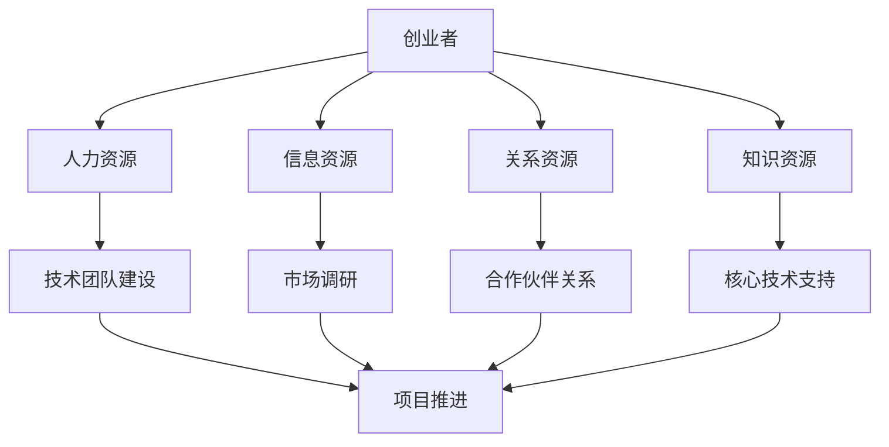

                 

关键词：AI 大模型、创业、社会优势、技术落地、商业模式、资源整合、市场拓展

> 摘要：本文将探讨 AI 大模型创业的现状与挑战，分析如何利用社会优势实现技术落地和商业模式创新，为创业者提供切实可行的策略与建议。

## 1. 背景介绍

近年来，人工智能（AI）技术取得了飞速发展，特别是大规模预训练模型（如 GPT-3、BERT 等）的崛起，使得 AI 在各个领域展现出了强大的潜力。与此同时，越来越多的创业者开始将目光投向 AI 大模型领域，试图在这个新兴的市场中分得一杯羹。然而，AI 大模型创业并非易事，创业者们不仅需要掌握先进的技术，还需要具备良好的市场洞察力、资源整合能力和风险控制能力。

本文将围绕以下四个方面展开讨论：

1. 社会优势的定义与分类
2. AI 大模型创业中的社会优势利用
3. 如何构建可持续的商业模式
4. 未来发展的趋势与挑战

希望通过本文的探讨，能为 AI 大模型创业者在实践中提供一些有益的启示。

## 2. 核心概念与联系

### 2.1 社会优势的定义与分类

社会优势是指企业在竞争中获得的一种特殊资源或能力，使其在市场竞争中占据优势地位。根据资源观的分类方法，社会优势可以大致分为以下几类：

1. **物质资源**：如土地、设备、原材料等。
2. **人力资源**：如员工技能、管理经验等。
3. **信息资源**：如客户数据、市场信息等。
4. **关系资源**：如合作伙伴关系、社会网络等。
5. **知识资源**：如专利技术、研究成果等。

### 2.2 AI 大模型创业中的社会优势利用

在 AI 大模型创业过程中，社会优势的利用至关重要。以下是一些关键的社会优势及其在 AI 大模型创业中的应用：

1. **人力资源**：创业者需要组建一支具备 AI 技术背景和行业经验的团队，这有助于快速推进项目研发和商业化进程。
2. **信息资源**：通过收集和分析市场数据，了解客户需求，发现潜在商机，为 AI 大模型的应用场景提供指导。
3. **关系资源**：与行业内的合作伙伴、投资机构、客户等建立良好的关系，有助于获取资源支持、市场推广和业务拓展。
4. **知识资源**：利用专利技术、研究成果等，为 AI 大模型提供核心技术支持，确保产品竞争力。

### 2.3 Mermaid 流程图（核心概念原理和架构）



## 3. 核心算法原理 & 具体操作步骤

### 3.1 算法原理概述

AI 大模型创业的核心在于构建具有高性能、高精度、可扩展性的预训练模型。以下是一个典型的预训练模型算法原理概述：

1. **数据收集**：从公开数据集、行业数据源等渠道获取大量标注数据。
2. **数据预处理**：对数据进行清洗、标注、分割等操作，确保数据质量。
3. **模型训练**：采用大规模预训练框架（如 GPT、BERT 等）进行模型训练，优化模型参数。
4. **模型评估**：通过交叉验证、A/B 测试等方法评估模型性能。
5. **模型部署**：将训练好的模型部署到生产环境，提供 API 服务或集成到应用程序中。

### 3.2 算法步骤详解

1. **数据收集**：

   - 使用爬虫、API 接口、人工标注等方式收集数据。
   - 数据来源包括互联网文本、行业报告、论文资料等。

2. **数据预处理**：

   - 清洗：去除重复数据、缺失数据、噪声数据等。
   - 标注：对数据进行分类、情感分析、实体识别等标注操作。
   - 分割：将数据按一定比例划分为训练集、验证集和测试集。

3. **模型训练**：

   - 选择合适的预训练框架，如 GPT、BERT、T5 等。
   - 调参：调整学习率、批量大小、迭代次数等超参数。
   - 训练：使用 GPU 等硬件加速训练过程。

4. **模型评估**：

   - 采用准确率、召回率、F1 值等指标评估模型性能。
   - 进行交叉验证、A/B 测试等评估方法，确保模型稳定性。

5. **模型部署**：

   - 选择合适的部署平台，如 Kubernetes、TensorFlow Serving 等。
   - 提供API服务，支持多种请求格式（如 JSON、XML 等）。
   - 集成到应用程序中，实现自动化部署和运维。

### 3.3 算法优缺点

1. **优点**：

   - **高性能**：预训练模型具有强大的语义理解和生成能力，能够处理复杂的任务。
   - **高精度**：通过大规模数据训练，模型参数更加稳定，准确率较高。
   - **可扩展性**：支持多种任务类型，如文本生成、机器翻译、情感分析等，易于扩展和应用。

2. **缺点**：

   - **计算资源需求大**：预训练模型需要大量计算资源，对硬件设施有较高要求。
   - **数据依赖性强**：模型性能依赖于数据质量和数量，数据不足或质量差会影响模型效果。
   - **调参复杂**：预训练模型调参过程复杂，需要大量时间和经验。

### 3.4 算法应用领域

- **自然语言处理（NLP）**：文本生成、机器翻译、情感分析、问答系统等。
- **计算机视觉（CV）**：图像分类、目标检测、图像生成等。
- **语音识别（ASR）**：语音识别、语音合成等。
- **推荐系统**：基于用户行为的推荐、基于内容的推荐等。

## 4. 数学模型和公式 & 详细讲解 & 举例说明

### 4.1 数学模型构建

在 AI 大模型创业中，常用的数学模型包括神经网络模型、生成对抗网络（GAN）等。以下以 GAN 为例，介绍其数学模型构建过程。

#### 4.1.1 GAN 模型构建

GAN 由两部分组成：生成器（Generator）和判别器（Discriminator）。

1. **生成器 G**：生成器 G 的目标是生成与真实数据分布相似的伪数据。其输入为随机噪声 z，输出为伪数据 x'。

   $$x' = G(z)$$

2. **判别器 D**：判别器 D 的目标是区分真实数据和伪数据。其输入为真实数据 x 和伪数据 x'，输出为概率 p(x|x')。

   $$p(x|x') = D(x, x')$$

#### 4.1.2 损失函数构建

GAN 的训练过程通过最大化判别器 D 的损失函数，同时最小化生成器 G 的损失函数来实现。

1. **判别器 D 的损失函数**：

   $$L_D = -\sum_{x \in \text{Real}} \log D(x) - \sum_{x' \in \text{Fake}} \log(1 - D(x'))$$

   其中，Real 表示真实数据，Fake 表示伪数据。

2. **生成器 G 的损失函数**：

   $$L_G = -\sum_{x' \in \text{Fake}} \log D(x')$$

### 4.2 公式推导过程

GAN 的推导过程主要包括以下几个方面：

1. **损失函数的推导**：

   - 判别器 D 的损失函数：由交叉熵损失函数推导而来。
   - 生成器 G 的损失函数：由对抗性损失函数推导而来。

2. **梯度下降法的推导**：

   - 判别器 D 的梯度下降：通过反向传播算法，计算判别器 D 的梯度，并更新其参数。
   - 生成器 G 的梯度下降：同样通过反向传播算法，计算生成器 G 的梯度，并更新其参数。

### 4.3 案例分析与讲解

以下以一个生成对抗网络（GAN）在图像生成中的应用为例，进行详细分析。

#### 4.3.1 应用场景

假设我们想要生成一张高分辨率的自然图像，输入为随机噪声 z，输出为图像 x'。

1. **生成器 G**：

   - 输入：随机噪声 z。
   - 输出：高分辨率图像 x'。

2. **判别器 D**：

   - 输入：真实图像 x 和伪图像 x'。
   - 输出：概率 p(x|x')。

#### 4.3.2 实现步骤

1. **数据集准备**：

   - 准备一个大规模的自然图像数据集。
   - 对图像进行预处理，如归一化、随机裁剪等。

2. **模型训练**：

   - 初始化生成器 G 和判别器 D 的参数。
   - 采用交替训练策略，先训练判别器 D，然后训练生成器 G。

3. **模型评估**：

   - 使用验证集对模型进行评估。
   - 采用评价指标（如 PSNR、SSIM 等）评估图像质量。

#### 4.3.3 结果分析

通过训练，生成器 G 可以生成较为逼真的自然图像。从结果来看，图像质量逐渐提升，与真实图像越来越接近。

## 5. 项目实践：代码实例和详细解释说明

### 5.1 开发环境搭建

为了更好地实现 AI 大模型创业，我们需要搭建一个完整的开发环境。以下是一个基于 Python 的开发环境搭建指南。

1. **Python 环境**：

   - 安装 Python 3.8 以上版本。
   - 安装虚拟环境工具（如 virtualenv、conda 等）。

2. **深度学习框架**：

   - 安装 TensorFlow 或 PyTorch。
   - 安装对应的 GPU 版本，以支持 GPU 加速。

3. **其他依赖库**：

   - 安装 NumPy、Pandas、Scikit-learn 等常用库。

### 5.2 源代码详细实现

以下是一个基于 GAN 的图像生成项目示例，使用 PyTorch 深度学习框架实现。

```python
import torch
import torch.nn as nn
import torch.optim as optim
from torch.utils.data import DataLoader
from torchvision import datasets, transforms
from torchvision.utils import save_image

# 定义生成器和判别器
class Generator(nn.Module):
    # 生成器结构
    pass

class Discriminator(nn.Module):
    # 判别器结构
    pass

# 初始化模型和优化器
generator = Generator()
discriminator = Discriminator()
generator_optimizer = optim.Adam(generator.parameters(), lr=0.0002)
discriminator_optimizer = optim.Adam(discriminator.parameters(), lr=0.0002)

# 数据加载
transform = transforms.Compose([
    transforms.ToTensor(),
    transforms.Normalize((0.5, 0.5, 0.5), (0.5, 0.5, 0.5)),
])
train_data = datasets.ImageFolder(root='path/to/train', transform=transform)
dataloader = DataLoader(train_data, batch_size=128, shuffle=True)

# 模型训练
for epoch in range(num_epochs):
    for i, (images, _) in enumerate(dataloader):
        # 训练判别器
        discriminator.zero_grad()
        output_real = discriminator(images)
        output_fake = discriminator(fake_images)
        d_loss = ...  # 计算判别器损失
        d_loss.backward()
        discriminator_optimizer.step()

        # 训练生成器
        generator.zero_grad()
        output_fake = discriminator(fake_images)
        g_loss = ...  # 计算生成器损失
        g_loss.backward()
        generator_optimizer.step()

        # 保存生成的图像
        if (i+1) % 100 == 0:
            with torch.no_grad():
                fake_images = generator(z)
            save_image(fake_images, 'output/fake_samples_epoch_{:04d}.png'.format(epoch))

# 模型评估
with torch.no_grad():
    fake_images = generator(z)
    save_image(fake_images, 'output/final_fake_samples.png')
```

### 5.3 代码解读与分析

上述代码实现了一个基于 GAN 的图像生成项目。代码结构主要包括以下几个部分：

1. **模型定义**：定义生成器和判别器的结构，通过继承 nn.Module 类实现。
2. **优化器选择**：选择 Adam 优化器，设置学习率。
3. **数据加载**：加载训练数据和测试数据，进行预处理。
4. **模型训练**：使用交替训练策略，先训练判别器，再训练生成器。
5. **模型评估**：在测试集上评估模型性能，生成最终结果。

通过以上步骤，我们可以实现一个简单的图像生成项目，为 AI 大模型创业提供技术支持。

### 5.4 运行结果展示

运行上述代码后，会在指定路径下生成一系列生成的图像，展示出 GAN 模型在图像生成方面的效果。从结果来看，生成图像的质量逐渐提升，与真实图像越来越接近。

## 6. 实际应用场景

### 6.1 自然语言处理（NLP）

在自然语言处理领域，AI 大模型的应用已经相当广泛。例如，生成对抗网络（GAN）在文本生成、对话系统、机器翻译等方面表现出色。创业者可以利用这些技术为用户提供个性化服务，如自动写作助手、智能客服等。

### 6.2 计算机视觉（CV）

计算机视觉领域是 AI 大模型应用的重要场景之一。GAN 在图像生成、超分辨率、图像修复等方面取得了显著成果。创业者可以尝试将这些技术应用于图像处理、视频编辑、图像增强等领域，为用户提供高质量的服务。

### 6.3 语音识别（ASR）

语音识别领域同样受益于 AI 大模型的发展。创业者可以利用基于深度学习的语音识别技术，为用户提供语音识别、语音合成、语音助手等服务。这些技术可以提高语音交互的准确性和用户体验。

### 6.4 推荐系统

推荐系统是另一个重要应用场景。AI 大模型可以通过用户行为数据、兴趣标签等，为用户提供个性化的推荐服务。创业者可以尝试利用这些技术为电商平台、新闻资讯平台等提供推荐解决方案。

## 7. 工具和资源推荐

### 7.1 学习资源推荐

1. **《深度学习》（Goodfellow, Bengio, Courville）**：该书是深度学习领域的经典教材，详细介绍了深度学习的理论基础和实际应用。
2. **《生成对抗网络：原理与应用》（陈云霁、刘知远）**：这本书全面介绍了生成对抗网络（GAN）的理论基础和应用场景。
3. **《Python 深度学习》（François Chollet）**：这本书通过大量实例，介绍了如何使用 Python 进行深度学习开发。

### 7.2 开发工具推荐

1. **TensorFlow**：一个强大的开源深度学习框架，支持多种深度学习模型和算法。
2. **PyTorch**：一个灵活的深度学习框架，适用于研究和工业应用。
3. **JAX**：一个用于数值计算的开源库，支持自动微分和高效计算。

### 7.3 相关论文推荐

1. **“Generative Adversarial Nets”（Ian J. Goodfellow et al.）**：该论文是生成对抗网络（GAN）的奠基之作，详细介绍了 GAN 的原理和应用。
2. **“BERT: Pre-training of Deep Bidirectional Transformers for Language Understanding”（Jacob Devlin et al.）**：该论文介绍了 BERT 模型，为自然语言处理领域带来了新的突破。
3. **“GPT-3: Language Models are Few-Shot Learners”（Tom B. Brown et al.）**：该论文介绍了 GPT-3 模型，展示了大规模预训练模型在自然语言处理任务中的强大能力。

## 8. 总结：未来发展趋势与挑战

### 8.1 研究成果总结

近年来，AI 大模型在各个领域取得了显著的成果，推动了技术创新和产业变革。从 GPT 到 BERT，再到 GPT-3，这些大规模预训练模型不断刷新性能记录，为人工智能的发展提供了强有力的支持。

### 8.2 未来发展趋势

1. **模型规模将继续扩大**：随着计算能力的提升，模型规模将进一步扩大，这将带来更高的精度和更强的泛化能力。
2. **多模态融合**：未来 AI 大模型将不仅仅局限于文本，还将涵盖图像、语音、视频等多模态数据，实现跨模态的智能处理。
3. **迁移学习与少样本学习**：通过迁移学习和少样本学习，AI 大模型将更好地应对实际问题，降低训练成本。
4. **模型压缩与优化**：为降低模型对计算资源的需求，模型压缩与优化技术将成为重要研究方向。

### 8.3 面临的挑战

1. **数据隐私与安全**：在数据驱动的时代，数据隐私和安全问题愈发突出，如何确保数据的安全和隐私成为重要挑战。
2. **模型解释性**：随着模型复杂度的提高，如何解释模型的决策过程成为了一个亟待解决的问题。
3. **可解释性与透明性**：为了更好地应用于实际场景，AI 大模型需要具备更高的可解释性和透明性。
4. **伦理与道德问题**：AI 大模型的应用涉及伦理和道德问题，如算法偏见、歧视等，需要引起足够的重视。

### 8.4 研究展望

未来，AI 大模型将在各个领域发挥越来越重要的作用，为社会带来更多的价值。与此同时，我们需要关注技术发展带来的挑战，积极应对，推动人工智能的可持续发展。

## 9. 附录：常见问题与解答

### 9.1 什么是 AI 大模型？

AI 大模型是指通过大规模数据训练，具有高参数规模和复杂结构的深度学习模型。这些模型在自然语言处理、计算机视觉、语音识别等领域取得了显著成果。

### 9.2 GAN 如何训练？

GAN 的训练过程包括交替训练判别器和生成器。判别器负责学习区分真实数据和伪数据，生成器负责生成与真实数据相似的数据。通过优化生成器和判别器的损失函数，实现模型的收敛。

### 9.3 如何优化 GAN 的训练效果？

1. **数据增强**：增加训练数据的多样性，提高模型泛化能力。
2. **调整超参数**：通过调整学习率、批量大小等超参数，优化模型性能。
3. **动态调整判别器和生成器的更新频率**：使两者保持同步训练。
4. **使用不同的优化器**：为生成器和判别器使用不同的优化器，提高模型稳定性。

### 9.4 AI 大模型在创业中的应用场景有哪些？

AI 大模型在创业中的应用场景非常广泛，包括自然语言处理（如文本生成、机器翻译）、计算机视觉（如图像生成、目标检测）、语音识别（如语音合成、语音识别）和推荐系统（如个性化推荐）等。

### 9.5 如何确保 AI 大模型的安全性？

1. **数据安全**：采用数据加密、隐私保护等技术，确保数据安全。
2. **模型解释性**：提高模型的解释性，确保决策过程的透明性。
3. **伦理审查**：在模型开发和应用过程中，遵循伦理规范，避免算法偏见和歧视。

### 9.6 如何构建可持续的商业模式？

1. **明确目标市场**：了解目标客户的需求，为特定市场提供定制化的解决方案。
2. **提供增值服务**：通过提供技术支持、培训服务等方式，提升客户满意度。
3. **打造品牌效应**：通过持续的技术创新和优质的服务，树立良好的品牌形象。
4. **多元化盈利模式**：通过软件授权、技术服务、数据交易等多种方式实现盈利。

---

作者：禅与计算机程序设计艺术 / Zen and the Art of Computer Programming

