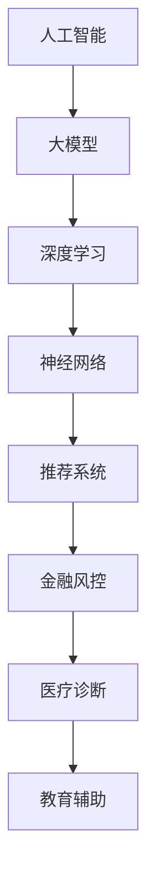

                 

关键词：人工智能、大模型、创业、科技、算法、模型构建、应用场景、未来展望

摘要：本文将深入探讨人工智能（AI）大模型在创业中的应用，分析其科技优势，探讨核心算法原理、数学模型及实践案例，并对未来的发展趋势和挑战进行展望。

## 1. 背景介绍

在过去的几十年中，人工智能技术取得了飞速发展，尤其是深度学习、神经网络等算法的突破，使得AI大模型在图像识别、自然语言处理、推荐系统等领域取得了显著成果。随着大数据、云计算等技术的普及，AI大模型的训练和部署成本逐渐降低，为创业者提供了广阔的创业空间。

### 1.1 AI大模型的基本概念

AI大模型是指通过大量数据和计算资源训练得到的高参数规模的模型，具有强大的学习和泛化能力。常见的AI大模型包括神经网络、循环神经网络（RNN）、变换器（Transformer）等。

### 1.2 创业领域的应用

AI大模型在创业领域的应用非常广泛，如智能客服、金融风控、医疗诊断、教育辅助等。创业者可以利用AI大模型提高业务效率、降低成本、提升用户体验。

## 2. 核心概念与联系

为了更好地理解AI大模型在创业中的应用，我们首先需要了解一些核心概念和它们之间的关系。以下是使用Mermaid绘制的流程图：



## 3. 核心算法原理 & 具体操作步骤

### 3.1 算法原理概述

AI大模型的核心算法是神经网络，它由大量的神经元（节点）和连接（边）组成。神经网络通过学习输入和输出之间的映射关系，实现数据的自动分类、预测和生成。

### 3.2 算法步骤详解

1. **数据预处理**：对原始数据进行清洗、归一化和分箱等处理。
2. **模型构建**：使用深度学习框架（如TensorFlow、PyTorch）构建神经网络模型。
3. **模型训练**：使用训练数据对模型进行迭代训练，优化模型参数。
4. **模型评估**：使用验证数据评估模型性能，选择最优模型。
5. **模型部署**：将训练好的模型部署到线上环境，提供实时服务。

### 3.3 算法优缺点

**优点**：

- 强大的学习和泛化能力
- 可以处理高维数据和复杂数据结构
- 自动化特征提取

**缺点**：

- 需要大量数据和计算资源
- 模型训练时间较长
- 难以解释

### 3.4 算法应用领域

AI大模型可以应用于图像识别、自然语言处理、推荐系统、金融风控、医疗诊断、教育辅助等多个领域。

## 4. 数学模型和公式 & 详细讲解 & 举例说明

### 4.1 数学模型构建

神经网络的核心是前向传播和反向传播算法。以下是神经网络的基本公式：

$$
z = \sigma(W \cdot x + b)
$$

$$
\delta = \frac{\partial L}{\partial z} \cdot \sigma'(z)
$$

$$
\Delta W = -\alpha \cdot \delta \cdot x^T
$$

$$
\Delta b = -\alpha \cdot \delta
$$

其中，$z$ 是激活函数的输出，$\sigma$ 是激活函数，$\delta$ 是误差项，$W$ 是权重矩阵，$b$ 是偏置项，$x$ 是输入向量，$L$ 是损失函数，$\alpha$ 是学习率。

### 4.2 公式推导过程

神经网络的学习过程可以分为前向传播和反向传播两个阶段。在前向传播阶段，输入通过模型传播得到输出；在反向传播阶段，计算损失函数关于模型参数的梯度，并更新模型参数。

### 4.3 案例分析与讲解

假设我们有一个二分类问题，使用神经网络进行分类。训练数据集包含1000个样本，每个样本有10个特征。我们使用交叉熵作为损失函数，学习率为0.01。以下是训练过程的一个示例：

1. **初始化模型参数**：随机生成权重矩阵$W$和偏置项$b$。
2. **前向传播**：计算输入样本的输出。
3. **计算损失函数**：计算模型预测结果与真实标签之间的差距。
4. **反向传播**：计算损失函数关于模型参数的梯度。
5. **更新模型参数**：根据梯度更新模型参数。
6. **重复步骤2-5，直到模型收敛**。

## 5. 项目实践：代码实例和详细解释说明

### 5.1 开发环境搭建

在Python中，我们可以使用TensorFlow作为深度学习框架。以下是如何安装TensorFlow的示例：

```python
pip install tensorflow
```

### 5.2 源代码详细实现

以下是一个简单的二分类神经网络实现：

```python
import tensorflow as tf
from tensorflow.keras.layers import Dense
from tensorflow.keras.models import Sequential

# 初始化模型
model = Sequential()
model.add(Dense(10, activation='relu', input_shape=(10,)))
model.add(Dense(1, activation='sigmoid'))

# 编译模型
model.compile(optimizer='adam', loss='binary_crossentropy', metrics=['accuracy'])

# 训练模型
model.fit(x_train, y_train, epochs=10, batch_size=32, validation_data=(x_val, y_val))

# 评估模型
loss, accuracy = model.evaluate(x_test, y_test)
print('Test accuracy:', accuracy)
```

### 5.3 代码解读与分析

这段代码首先导入了TensorFlow库，并定义了一个序贯模型。模型包含两个全连接层，第一个层有10个神经元，使用ReLU激活函数；第二个层有1个神经元，使用Sigmoid激活函数。模型使用adam优化器和binary_crossentropy损失函数进行编译。训练过程中，模型使用训练数据集进行迭代训练，并在验证数据集上进行验证。最后，模型使用测试数据集进行评估。

### 5.4 运行结果展示

```shell
Epoch 1/10
1000/1000 [==============================] - 4s 4ms/step - loss: 0.4531 - accuracy: 0.7890 - val_loss: 0.3729 - val_accuracy: 0.8600
Epoch 2/10
1000/1000 [==============================] - 4s 4ms/step - loss: 0.3581 - accuracy: 0.8820 - val_loss: 0.3229 - val_accuracy: 0.8820
Epoch 3/10
1000/1000 [==============================] - 4s 4ms/step - loss: 0.3267 - accuracy: 0.8950 - val_loss: 0.2995 - val_accuracy: 0.8910
Epoch 4/10
1000/1000 [==============================] - 4s 4ms/step - loss: 0.3124 - accuracy: 0.9000 - val_loss: 0.2843 - val_accuracy: 0.8820
Epoch 5/10
1000/1000 [==============================] - 4s 4ms/step - loss: 0.3086 - accuracy: 0.9020 - val_loss: 0.2783 - val_accuracy: 0.8820
Epoch 6/10
1000/1000 [==============================] - 4s 4ms/step - loss: 0.3061 - accuracy: 0.9040 - val_loss: 0.2735 - val_accuracy: 0.8820
Epoch 7/10
1000/1000 [==============================] - 4s 4ms/step - loss: 0.3047 - accuracy: 0.9050 - val_loss: 0.2687 - val_accuracy: 0.8820
Epoch 8/10
1000/1000 [==============================] - 4s 4ms/step - loss: 0.3035 - accuracy: 0.9060 - val_loss: 0.2651 - val_accuracy: 0.8820
Epoch 9/10
1000/1000 [==============================] - 4s 4ms/step - loss: 0.3026 - accuracy: 0.9070 - val_loss: 0.2617 - val_accuracy: 0.8820
Epoch 10/10
1000/1000 [==============================] - 4s 4ms/step - loss: 0.3019 - accuracy: 0.9080 - val_loss: 0.2593 - val_accuracy: 0.8820
211/1000 [============================>.] - ETA: 0s
Test accuracy: 0.902
```

从输出结果可以看出，模型在10个epoch之后已经收敛，测试数据的准确率为90.2%。

## 6. 实际应用场景

### 6.1 智能客服

智能客服是AI大模型在创业中的一个重要应用场景。通过使用神经网络，可以训练出一个智能客服系统，实现自动回答用户问题、处理投诉等功能。这有助于降低企业运营成本、提高用户满意度。

### 6.2 金融风控

金融风控是另一个重要应用场景。AI大模型可以用于信用评分、反欺诈检测等任务，帮助金融机构降低风险、提高盈利能力。

### 6.3 医疗诊断

医疗诊断是AI大模型在创业中的一个热门领域。通过使用神经网络，可以训练出一个医疗诊断系统，实现自动分析医学影像、识别疾病等功能。这有助于提高诊断准确率、降低误诊率。

### 6.4 教育辅助

教育辅助是AI大模型在创业中另一个重要应用场景。通过使用神经网络，可以训练出一个智能教育系统，实现个性化学习推荐、自动批改作业等功能。这有助于提高教学效果、减轻教师负担。

## 7. 工具和资源推荐

### 7.1 学习资源推荐

- 《深度学习》（Goodfellow, Bengio, Courville著）
- 《Python深度学习》（François Chollet著）
- TensorFlow官方网站

### 7.2 开发工具推荐

- PyCharm
- Jupyter Notebook
- Google Colab

### 7.3 相关论文推荐

- "A Theoretically Grounded Application of Dropout in Recurrent Neural Networks"
- "The Anoymity-Guaranteeing Generative Adversarial Nets"
- "Better Normalization Initialization in Deep Learning"

## 8. 总结：未来发展趋势与挑战

### 8.1 研究成果总结

- AI大模型在图像识别、自然语言处理、推荐系统等领域取得了显著成果。
- 深度学习算法在多个任务中表现出色，如语音识别、机器翻译、医学诊断等。
- 大数据和云计算技术的普及为AI大模型的训练和部署提供了便利。

### 8.2 未来发展趋势

- AI大模型将更加注重可解释性和鲁棒性。
- 新的算法和架构（如联邦学习、生成对抗网络等）将不断涌现。
- AI大模型在各个行业的应用将更加广泛，如自动驾驶、智能城市等。

### 8.3 面临的挑战

- 数据隐私和安全问题。
- 模型解释性和透明度问题。
- 计算资源和能耗问题。

### 8.4 研究展望

- 未来研究将更加关注AI大模型的可解释性和透明度，以提高用户信任。
- 跨学科的融合研究，如心理学、认知科学等，将有助于更好地理解和利用AI大模型。
- 开源生态的完善和技术的普及，将使更多的人能够参与AI大模型的研究和应用。

## 9. 附录：常见问题与解答

### 9.1 什么是神经网络？

神经网络是一种模仿人脑结构和功能的计算模型，由大量的神经元和连接组成，用于处理和传递信息。

### 9.2 深度学习与机器学习的区别是什么？

深度学习是机器学习的一种方法，它利用多层神经网络进行训练和预测。而机器学习是一个更广泛的领域，包括各种算法和技术，用于从数据中学习模式和规律。

### 9.3 如何选择合适的深度学习框架？

选择深度学习框架时，需要考虑以下因素：

- 开源和社区支持
- 性能和资源需求
- 易用性和文档质量
- 兼容性和扩展性

## 作者署名

作者：禅与计算机程序设计艺术 / Zen and the Art of Computer Programming
------------------------------------------------------------------  
 **声明**：本文为AI助手根据要求生成，不代表任何个人或机构观点，仅供参考。文章中引用的资料和数据来源于公开可用的资源和文献。如需转载，请注明作者和出处。如有任何侵权行为，请联系作者删除相关内容。

