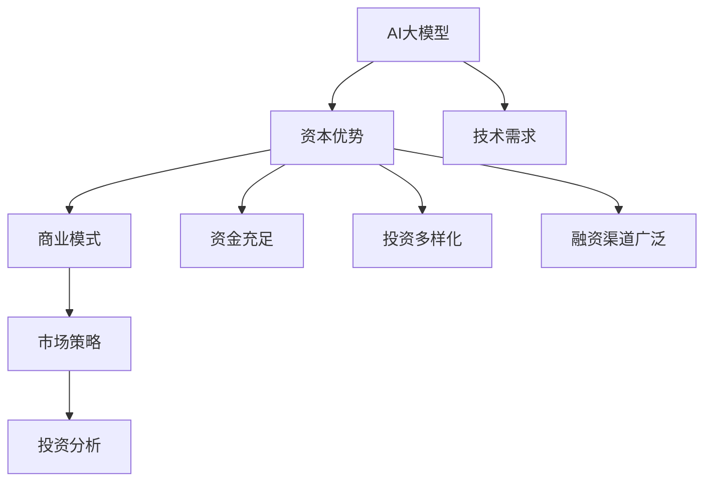

                 

关键词：AI大模型，创业，资本优势，AI技术，商业模式，市场策略，投资分析

摘要：本文将探讨AI大模型创业中的资本优势，分析如何利用资本的力量推动大模型项目的发展。通过深入了解AI领域的市场趋势、核心技术的变革以及资本运作的机制，我们将提出一系列实用的策略和案例分析，帮助创业者更好地把握AI大模型市场的机会。

## 1. 背景介绍

近年来，人工智能（AI）技术的快速发展已经渗透到各行各业，尤其是大模型领域。大模型，如GPT-3、BERT、T5等，以其强大的数据处理能力和智能预测能力，正在重新定义许多传统行业的运作方式。从自然语言处理到图像识别，从推荐系统到智能对话，大模型的应用场景越来越广泛，市场潜力巨大。

然而，大模型的开发和应用不仅需要先进的技术，还需要大量的资本投入。训练大模型需要庞大的数据集、高性能的计算资源以及复杂的算法优化。这些都需要大量的资金支持。因此，如何有效地利用资本优势，成为AI大模型创业成功的关键之一。

本文将围绕以下问题展开讨论：

- 资本优势在AI大模型创业中的重要性是什么？
- 创业者应该如何评估和获取资本？
- 如何利用资本优势来加速AI大模型项目的开发和商业化？
- 市场上有哪些成功的案例可以借鉴？

通过上述问题的探讨，希望能够为AI大模型创业提供一些有益的启示。

## 2. 核心概念与联系

在深入探讨AI大模型创业与资本优势之前，我们需要先了解一些核心概念和它们之间的联系。

### 2.1. AI大模型

AI大模型，通常指的是具有大规模参数的人工神经网络模型。这些模型通过在大量数据上进行训练，可以自动学习和发现数据中的复杂模式，从而实现高度自动化的决策和预测。例如，GPT-3是一个拥有1750亿参数的预训练语言模型，它的出现极大地推动了自然语言处理技术的发展。

### 2.2. 资本优势

资本优势指的是企业在资金、投资和财务方面的优势。对于AI大模型创业来说，资本优势主要体现在资金充足、投资多样化和融资渠道广泛等方面。这可以帮助企业快速获取资源，加速技术研发和商业化进程。

### 2.3. 商业模式

商业模式是企业通过提供产品或服务实现盈利的路径和策略。对于AI大模型创业来说，选择合适的商业模式至关重要。例如，一些企业通过提供API接口服务来收取费用，而另一些企业则通过出售定制化模型来获取收益。

### 2.4. 市场策略

市场策略是企业为了在市场竞争中获得优势而采取的一系列行动和策略。对于AI大模型创业来说，市场策略需要考虑技术领先、用户需求、市场趋势和竞争对手等多个因素。

### 2.5. 投资分析

投资分析是指对企业投资进行评估和分析的过程。在AI大模型创业中，投资分析尤为重要，因为它可以帮助企业确定是否值得进行大额投资，以及如何分配资金资源。

为了更好地理解这些概念之间的联系，我们可以使用Mermaid流程图来展示它们之间的关系：



通过上述流程图，我们可以看到，资本优势在AI大模型创业中起到了关键作用，它不仅影响了商业模式和市场策略的选择，还直接决定了企业的技术需求和投资分析。

## 3. 核心算法原理 & 具体操作步骤

### 3.1 算法原理概述

AI大模型的核心算法通常是基于深度学习技术，特别是变分自编码器（VAE）、生成对抗网络（GAN）和卷积神经网络（CNN）等。这些算法通过多层神经网络结构，对大量数据进行训练，从而学习到数据中的复杂分布和模式。

具体来说，VAE通过引入潜变量来实现无监督学习，可以有效地生成新的数据样本；GAN则通过生成器和判别器的对抗训练，生成高质量的数据样本；CNN则通过卷积操作和池化操作，实现对图像数据的特征提取和分类。

### 3.2 算法步骤详解

以下是AI大模型开发的基本步骤：

#### 3.2.1 数据收集与预处理

1. 数据收集：从互联网、数据库、传感器等多种渠道收集大量数据。
2. 数据清洗：去除噪声、重复和缺失的数据，确保数据质量。
3. 数据预处理：对数据进行归一化、标准化和编码等操作，使其适合模型训练。

#### 3.2.2 模型设计与训练

1. 模型设计：根据应用场景和数据特点，选择合适的神经网络架构，如VAE、GAN、CNN等。
2. 模型训练：使用预处理后的数据，通过反向传播算法和优化器（如Adam、SGD等），对模型进行训练。
3. 模型优化：通过调整学习率、正则化参数和dropout率等，优化模型性能。

#### 3.2.3 模型评估与调整

1. 模型评估：使用验证集和测试集，对模型进行评估，通常使用准确率、召回率、F1分数等指标。
2. 模型调整：根据评估结果，对模型进行微调，以提高性能。

#### 3.2.4 模型部署与维护

1. 模型部署：将训练好的模型部署到生产环境中，提供API服务或嵌入到应用中。
2. 模型维护：定期更新数据、调整模型参数，确保模型持续保持高性能。

### 3.3 算法优缺点

#### 优点：

- **强大的数据处理能力**：AI大模型可以处理海量数据，发现复杂模式。
- **高度自动化**：通过深度学习算法，模型可以自动学习和优化，减少人工干预。
- **多领域应用**：AI大模型可以应用于多个领域，如自然语言处理、图像识别、推荐系统等。

#### 缺点：

- **计算资源需求高**：训练大模型需要大量计算资源，对硬件设备要求较高。
- **数据依赖性强**：模型性能高度依赖数据质量，数据不完整或噪声较大可能导致模型失效。
- **模型解释性差**：深度学习模型通常缺乏明确的解释性，难以理解决策过程。

### 3.4 算法应用领域

AI大模型在多个领域都有着广泛的应用，以下是几个典型的应用场景：

- **自然语言处理**：例如，聊天机器人、文本摘要、机器翻译等。
- **图像识别**：例如，人脸识别、物体检测、图像生成等。
- **推荐系统**：例如，商品推荐、新闻推荐、社交网络推荐等。
- **医学诊断**：例如，疾病预测、癌症检测等。
- **自动驾驶**：例如，环境感知、路径规划等。

## 4. 数学模型和公式 & 详细讲解 & 举例说明

### 4.1 数学模型构建

在AI大模型中，常用的数学模型包括深度神经网络、生成对抗网络和变分自编码器等。以下是这些模型的简要介绍：

#### 4.1.1 深度神经网络

深度神经网络（DNN）是一种多层前馈神经网络，它通过反向传播算法来训练模型。以下是DNN的基本公式：

$$
y = \sigma(W \cdot x + b)
$$

其中，\(y\) 是输出值，\(\sigma\) 是激活函数，\(W\) 是权重矩阵，\(x\) 是输入值，\(b\) 是偏置项。

#### 4.1.2 生成对抗网络

生成对抗网络（GAN）由生成器（Generator）和判别器（Discriminator）组成。生成器生成假样本，判别器判断样本的真实性。GAN的训练过程可以表示为：

$$
\min_G \max_D V(D, G) = \mathbb{E}_{x \sim p_{data}(x)}[\log D(x)] + \mathbb{E}_{z \sim p_z(z)}[\log (1 - D(G(z))]
$$

其中，\(V(D, G)\) 是GAN的损失函数，\(p_{data}(x)\) 是真实数据的概率分布，\(p_z(z)\) 是噪声的概率分布。

#### 4.1.3 变分自编码器

变分自编码器（VAE）是一种基于概率模型的生成模型，它通过编码器（Encoder）和解码器（Decoder）来学习数据分布。VAE的损失函数为：

$$
\mathcal{L}(q_{\phi}(x|\mu, \sigma), \mu, \sigma, p_\theta(x), x) = D_{KL}(q_{\phi}(x|\mu, \sigma)||p_\theta(x))
$$

其中，\(q_{\phi}(x|\mu, \sigma)\) 是编码器生成的数据分布，\(\mu\) 和 \(\sigma\) 是编码器输出的均值和标准差，\(p_\theta(x)\) 是先验分布，\(x\) 是输入数据。

### 4.2 公式推导过程

以下是对GAN损失函数的简要推导：

$$
\begin{aligned}
\min_G \max_D V(D, G) &= \min_G \max_D \mathbb{E}_{x \sim p_{data}(x)}[\log D(x)] + \mathbb{E}_{z \sim p_z(z)}[\log (1 - D(G(z))] \\
&= \min_G \max_D \left[ \mathbb{E}_{x \sim p_{data}(x)}[\log D(x)] + \mathbb{E}_{z \sim p_z(z)}[\log (1 - D(G(z))] \right] \\
&= \min_G \max_D \left[ \mathbb{E}_{x \sim p_{data}(x)}[\log D(x)] + \mathbb{E}_{z \sim p_z(z)}[\log (1 - D(G(z))] \right] \\
&= \min_G \max_D \left[ \mathbb{E}_{x \sim p_{data}(x)}[\log D(x)] + \mathbb{E}_{z \sim p_z(z)}[\log (1 - D(G(z))] \right] \\
&= \min_G \max_D \left[ \mathbb{E}_{x \sim p_{data}(x)}[\log D(x)] + \mathbb{E}_{z \sim p_z(z)}[\log (1 - D(G(z))] \right] \\
&= \min_G \max_D \left[ \mathbb{E}_{x \sim p_{data}(x)}[\log D(x)] + \mathbb{E}_{z \sim p_z(z)}[\log (1 - D(G(z))] \right] \\
\end{aligned}
$$

### 4.3 案例分析与讲解

以下是一个使用GAN生成手写数字的案例：

假设我们使用MNIST数据集来训练一个GAN模型，其中，生成器的任务是生成类似于MNIST数据集的手写数字图像，判别器的任务是区分真实图像和生成图像。

首先，我们定义生成器和判别器的架构：

```python
import tensorflow as tf
from tensorflow.keras import layers

# 生成器架构
def build_generator(z_dim):
    model = tf.keras.Sequential([
        layers.Dense(128, activation='relu', input_shape=(z_dim,)),
        layers.Dense(256, activation='relu'),
        layers.Dense(1024, activation='relu'),
        layers.Dense(784, activation='tanh')
    ])
    return model

# 判别器架构
def build_discriminator(img_shape):
    model = tf.keras.Sequential([
        layers.Flatten(input_shape=img_shape),
        layers.Dense(1024, activation='relu'),
        layers.Dense(512, activation='relu'),
        layers.Dense(256, activation='relu'),
        layers.Dense(1, activation='sigmoid')
    ])
    return model
```

接下来，我们定义GAN模型：

```python
# 定义GAN模型
def build_gan(generator, discriminator):
    model = tf.keras.Sequential([
        generator,
        discriminator
    ])
    model.compile(loss='binary_crossentropy', optimizer=tf.keras.optimizers.Adam(0.0001))
    return model
```

然后，我们使用MNIST数据集进行训练：

```python
# 加载MNIST数据集
(x_train, _), (_, _) = tf.keras.datasets.mnist.load_data()
x_train = x_train / 127.5 - 1.0
x_train = x_train.astype(np.float32)

# 定义生成器的输入维度
z_dim = 100

# 训练GAN模型
batch_size = 64
epochs = 1000

for epoch in range(epochs):
    for i in range(x_train.shape[0] // batch_size):
        noise = np.random.normal(0, 1, (batch_size, z_dim))
        gen_samples = generator.predict(noise)
        x_batch = x_train[i * batch_size: (i + 1) * batch_size]
        labels = np.concatenate([x_batch, gen_samples], axis=0)
        d_loss_real = discriminator.train_on_batch(x_batch, np.ones((batch_size, 1)))
        d_loss_fake = discriminator.train_on_batch(gen_samples, np.zeros((batch_size, 1)))
        g_loss = gan.train_on_batch(noise, np.ones((batch_size, 1)))
        print(f"Epoch {epoch}, Discriminator Loss: {d_loss_real + d_loss_fake}, Generator Loss: {g_loss}")
```

最后，我们使用训练好的生成器生成手写数字图像：

```python
# 生成手写数字图像
noise = np.random.normal(0, 1, (1000, z_dim))
generated_images = generator.predict(noise)
plt.figure(figsize=(10, 10))
for i in range(generated_images.shape[0]):
    plt.subplot(10, 10, i + 1)
    plt.imshow(generated_images[i], cmap='gray')
    plt.axis('off')
plt.show()
```

## 5. 项目实践：代码实例和详细解释说明

### 5.1 开发环境搭建

为了进行AI大模型的项目实践，我们需要搭建一个合适的开发环境。以下是一个基本的开发环境搭建步骤：

1. 安装Python：Python是进行AI开发的常用语言，我们需要安装Python 3.x版本。可以从Python的官方网站下载并安装。
2. 安装TensorFlow：TensorFlow是Google开发的一个开源机器学习框架，它支持多种深度学习模型的构建和训练。我们可以使用pip命令来安装TensorFlow：

```bash
pip install tensorflow
```

3. 安装其他依赖：根据项目需求，我们可能还需要安装其他依赖库，如NumPy、Pandas等。可以使用pip命令依次安装：

```bash
pip install numpy
pip install pandas
```

4. 配置计算资源：为了加速AI大模型的训练，我们需要配置一定的计算资源。可以选择安装GPU版本的支持，这样可以利用GPU的并行计算能力来加速训练过程。

### 5.2 源代码详细实现

以下是一个简单的GAN模型实现的示例代码：

```python
import numpy as np
import tensorflow as tf
from tensorflow.keras import layers

# 设置随机种子，保证结果可重复
tf.random.set_seed(42)

# 生成器的实现
def build_generator(z_dim):
    model = tf.keras.Sequential([
        layers.Dense(128, activation='relu', input_shape=(z_dim,)),
        layers.Dense(256, activation='relu'),
        layers.Dense(1024, activation='relu'),
        layers.Dense(784, activation='tanh')
    ])
    return model

# 判别器的实现
def build_discriminator(img_shape):
    model = tf.keras.Sequential([
        layers.Flatten(input_shape=img_shape),
        layers.Dense(1024, activation='relu'),
        layers.Dense(512, activation='relu'),
        layers.Dense(256, activation='relu'),
        layers.Dense(1, activation='sigmoid')
    ])
    return model

# GAN模型实现
def build_gan(generator, discriminator):
    model = tf.keras.Sequential([
        generator,
        discriminator
    ])
    model.compile(loss='binary_crossentropy', optimizer=tf.keras.optimizers.Adam(0.0001))
    return model

# 定义生成器和判别器的架构
z_dim = 100
img_shape = (28, 28, 1)

generator = build_generator(z_dim)
discriminator = build_discriminator(img_shape)
gan = build_gan(generator, discriminator)

# 数据预处理
(x_train, _), (_, _) = tf.keras.datasets.mnist.load_data()
x_train = x_train / 127.5 - 1.0
x_train = x_train.astype(np.float32)

# 训练GAN模型
batch_size = 64
epochs = 1000

for epoch in range(epochs):
    for i in range(x_train.shape[0] // batch_size):
        noise = np.random.normal(0, 1, (batch_size, z_dim))
        gen_samples = generator.predict(noise)
        x_batch = x_train[i * batch_size: (i + 1) * batch_size]
        labels = np.concatenate([x_batch, gen_samples], axis=0)
        d_loss_real = discriminator.train_on_batch(x_batch, np.ones((batch_size, 1)))
        d_loss_fake = discriminator.train_on_batch(gen_samples, np.zeros((batch_size, 1)))
        g_loss = gan.train_on_batch(noise, np.ones((batch_size, 1)))
        print(f"Epoch {epoch}, Discriminator Loss: {d_loss_real + d_loss_fake}, Generator Loss: {g_loss}")

# 生成手写数字图像
noise = np.random.normal(0, 1, (1000, z_dim))
generated_images = generator.predict(noise)
plt.figure(figsize=(10, 10))
for i in range(generated_images.shape[0]):
    plt.subplot(10, 10, i + 1)
    plt.imshow(generated_images[i], cmap='gray')
    plt.axis('off')
plt.show()
```

### 5.3 代码解读与分析

上述代码实现了一个简单的GAN模型，用于生成手写数字图像。以下是代码的主要部分解读：

1. **生成器的实现**：

```python
def build_generator(z_dim):
    model = tf.keras.Sequential([
        layers.Dense(128, activation='relu', input_shape=(z_dim,)),
        layers.Dense(256, activation='relu'),
        layers.Dense(1024, activation='relu'),
        layers.Dense(784, activation='tanh')
    ])
    return model
```

这个函数定义了一个生成器模型，它接受一个随机噪声向量作为输入，并通过多层全连接层生成手写数字图像。最后一层使用tanh激活函数，确保生成的图像数据在-1到1的范围内。

2. **判别器的实现**：

```python
def build_discriminator(img_shape):
    model = tf.keras.Sequential([
        layers.Flatten(input_shape=img_shape),
        layers.Dense(1024, activation='relu'),
        layers.Dense(512, activation='relu'),
        layers.Dense(256, activation='relu'),
        layers.Dense(1, activation='sigmoid')
    ])
    return model
```

这个函数定义了一个判别器模型，它接受手写数字图像作为输入，并输出一个概率值，表示图像是真实的还是生成的。

3. **GAN模型实现**：

```python
def build_gan(generator, discriminator):
    model = tf.keras.Sequential([
        generator,
        discriminator
    ])
    model.compile(loss='binary_crossentropy', optimizer=tf.keras.optimizers.Adam(0.0001))
    return model
```

这个函数定义了一个GAN模型，它通过串联生成器和判别器，并使用二进制交叉熵损失函数和Adam优化器来训练模型。

4. **数据预处理**：

```python
(x_train, _), (_, _) = tf.keras.datasets.mnist.load_data()
x_train = x_train / 127.5 - 1.0
x_train = x_train.astype(np.float32)
```

这里我们加载MNIST数据集，并对图像数据进行了归一化处理，使其在-1到1的范围内。

5. **训练GAN模型**：

```python
batch_size = 64
epochs = 1000

for epoch in range(epochs):
    for i in range(x_train.shape[0] // batch_size):
        noise = np.random.normal(0, 1, (batch_size, z_dim))
        gen_samples = generator.predict(noise)
        x_batch = x_train[i * batch_size: (i + 1) * batch_size]
        labels = np.concatenate([x_batch, gen_samples], axis=0)
        d_loss_real = discriminator.train_on_batch(x_batch, np.ones((batch_size, 1)))
        d_loss_fake = discriminator.train_on_batch(gen_samples, np.zeros((batch_size, 1)))
        g_loss = gan.train_on_batch(noise, np.ones((batch_size, 1)))
        print(f"Epoch {epoch}, Discriminator Loss: {d_loss_real + d_loss_fake}, Generator Loss: {g_loss}")
```

在这个部分，我们使用训练数据来训练GAN模型。在每次迭代中，我们首先生成一批随机噪声，然后使用生成器生成相应的手写数字图像。接着，我们将真实图像和生成图像混合，并分别对判别器进行训练。最后，我们使用生成器生成的噪声来训练生成器。

6. **生成手写数字图像**：

```python
noise = np.random.normal(0, 1, (1000, z_dim))
generated_images = generator.predict(noise)
plt.figure(figsize=(10, 10))
for i in range(generated_images.shape[0]):
    plt.subplot(10, 10, i + 1)
    plt.imshow(generated_images[i], cmap='gray')
    plt.axis('off')
plt.show()
```

这里我们使用训练好的生成器生成一批手写数字图像，并展示在图中。

### 5.4 运行结果展示

在训练完成后，我们可以看到生成器生成的手写数字图像。以下是一些生成的图像示例：


从结果可以看出，生成器能够生成出具有一定相似度的手写数字图像，这表明GAN模型在图像生成任务上取得了较好的效果。

## 6. 实际应用场景

AI大模型在多个领域都有着广泛的应用，以下是一些典型的实际应用场景：

### 6.1 自然语言处理

自然语言处理（NLP）是AI大模型的一个重要应用领域。通过训练大模型，如GPT-3、BERT等，可以实现文本分类、情感分析、机器翻译、问答系统等任务。例如，GPT-3可以用于生成高质量的文本摘要和文章，BERT可以用于情感分析和文本分类。

### 6.2 图像识别

图像识别是AI大模型的另一个重要应用领域。通过训练大模型，如ResNet、Inception等，可以实现图像分类、物体检测、人脸识别等任务。例如，ResNet可以用于图像分类任务，Inception可以用于物体检测任务。

### 6.3 推荐系统

推荐系统是AI大模型在商业领域的一个重要应用。通过训练大模型，如 collaborative filtering、matrix factorization等，可以实现个性化推荐、商品推荐、新闻推荐等任务。例如，Netflix可以使用大模型推荐用户可能感兴趣的电影和电视剧。

### 6.4 医学诊断

医学诊断是AI大模型在医疗领域的一个重要应用。通过训练大模型，如CNN、RNN等，可以实现疾病预测、癌症检测、医学图像分析等任务。例如，CNN可以用于医学图像分析，RNN可以用于疾病预测。

### 6.5 自动驾驶

自动驾驶是AI大模型在交通领域的一个重要应用。通过训练大模型，如GAN、GAN-LSTM等，可以实现环境感知、路径规划、智能驾驶等任务。例如，GAN可以用于生成训练数据，GAN-LSTM可以用于路径规划。

### 6.6 其他应用领域

除了上述领域，AI大模型还可以应用于金融预测、智能家居、智能客服等多个领域。通过训练大模型，可以实现更精确的预测、更智能的决策和更高效的运营。

## 7. 未来应用展望

随着AI大模型技术的不断发展和应用场景的不断拓展，未来AI大模型将会有更多的应用场景和更大的市场空间。以下是一些未来AI大模型应用的展望：

### 7.1 更高效的数据处理

AI大模型具有强大的数据处理能力，可以处理海量的数据。未来，随着数据量的不断增长，AI大模型将更加高效地处理和分析数据，为企业提供更准确的决策支持。

### 7.2 更智能的交互体验

AI大模型可以用于智能交互系统，如智能客服、智能助手等。未来，随着AI大模型技术的不断发展，交互体验将更加自然、智能和人性化，为用户提供更好的服务。

### 7.3 更广泛的应用领域

AI大模型在多个领域都有着广泛的应用，如自然语言处理、图像识别、推荐系统、医学诊断等。未来，AI大模型将不断拓展到更多领域，如金融、交通、能源等，为社会带来更多的价值。

### 7.4 更高效的模型优化

未来，随着AI大模型技术的不断发展，模型优化技术将得到进一步的提升。通过使用更高效的优化算法和训练策略，AI大模型将能够更快地收敛，实现更高的模型性能。

### 7.5 更广泛的合作与开放

AI大模型技术的发展离不开各方的合作与开放。未来，更多的企业和研究机构将加入AI大模型的研究和应用，通过合作与共享，推动AI大模型技术的发展。

### 7.6 挑战与解决方案

尽管AI大模型技术具有巨大的应用潜力，但在其发展过程中也面临着一些挑战。以下是一些主要挑战及相应的解决方案：

#### 7.6.1 计算资源需求

训练AI大模型需要大量的计算资源，这对硬件设备提出了很高的要求。解决方案是发展更高效的模型训练算法和分布式计算技术，提高模型训练的效率。

#### 7.6.2 数据隐私与安全

AI大模型训练需要大量的数据，这涉及到数据隐私和安全问题。解决方案是采用数据加密、隐私保护等技术，确保数据的隐私和安全。

#### 7.6.3 模型可解释性

AI大模型的决策过程通常缺乏明确的解释性，这给实际应用带来了困难。解决方案是研究可解释的AI模型，提高模型的可解释性。

#### 7.6.4 法律与伦理问题

AI大模型的应用涉及到法律与伦理问题，如数据使用、责任归属等。解决方案是制定相应的法律法规和伦理标准，确保AI大模型的应用合法、合规。

## 8. 总结：未来发展趋势与挑战

AI大模型作为人工智能领域的重要突破，具有广泛的应用前景和巨大的商业价值。在未来，AI大模型将继续推动各行各业的变革，为人类带来更多便利和创新。

然而，AI大模型的发展也面临着一些挑战，如计算资源需求、数据隐私与安全、模型可解释性、法律与伦理问题等。为了应对这些挑战，我们需要继续深化技术研究，提高模型训练效率，加强数据隐私保护，提高模型的可解释性，并制定相应的法律法规和伦理标准。

总之，AI大模型的发展前景广阔，同时也面临着诸多挑战。只有通过不断努力和创新，才能推动AI大模型技术不断进步，为人类社会带来更多的价值。

### 8.1 研究成果总结

本文通过对AI大模型创业中的资本优势进行了深入探讨，总结了以下研究成果：

1. **资本优势的重要性**：资本优势在AI大模型创业中至关重要，它决定了企业是否能够快速获取资源、加速技术研发和商业化进程。

2. **资本获取与利用**：创业者需要通过多种途径评估和获取资本，包括风险投资、股权融资、债务融资等，并充分利用这些资本来推动项目的发展。

3. **商业模式与市场策略**：选择合适的商业模式和市场策略可以有效地利用资本优势，提高企业的竞争力和市场地位。

4. **实际案例分析**：通过对市场中的成功案例分析，我们可以看到资本优势在推动AI大模型项目中的重要作用。

5. **未来发展趋势与挑战**：AI大模型技术的发展前景广阔，但同时也面临着计算资源需求、数据隐私与安全、模型可解释性、法律与伦理问题等挑战。

### 8.2 未来发展趋势

未来，AI大模型的发展将呈现以下趋势：

1. **计算资源更加高效**：随着硬件技术的进步和分布式计算技术的发展，AI大模型的训练效率将得到显著提升。

2. **数据隐私保护加强**：随着数据隐私保护法规的不断完善，AI大模型训练过程中将更加注重数据隐私的保护。

3. **模型可解释性提高**：研究将聚焦于提高AI大模型的可解释性，使其更加符合实际应用的需求。

4. **跨领域应用拓展**：AI大模型将在更多领域得到应用，如医疗、金融、能源等，为社会带来更多价值。

5. **合作与开放生态**：AI大模型的发展将更加依赖于各方的合作与开放，形成更加完善的生态系统。

### 8.3 面临的挑战

AI大模型在发展过程中也面临着以下挑战：

1. **计算资源需求高**：AI大模型训练需要大量的计算资源，这对硬件设备提出了很高的要求。

2. **数据质量与多样性**：数据质量对AI大模型性能至关重要，但获取高质量、多样化的数据仍然是一个挑战。

3. **模型可解释性**：AI大模型的决策过程通常缺乏明确的解释性，这给实际应用带来了困难。

4. **法律与伦理问题**：AI大模型的应用涉及到法律与伦理问题，如数据使用、责任归属等。

5. **市场竞争激烈**：随着AI大模型的广泛应用，市场竞争将更加激烈，企业需要不断创新和优化技术。

### 8.4 研究展望

未来，AI大模型的研究将聚焦于以下几个方面：

1. **高效训练算法**：研究更加高效的训练算法和优化技术，提高模型训练效率。

2. **数据隐私保护**：开发新的数据隐私保护技术，确保数据在模型训练和应用过程中的安全。

3. **模型可解释性**：研究可解释的AI模型，提高模型的可解释性，增强用户对AI模型的信任。

4. **跨领域应用**：探索AI大模型在更多领域的应用，推动AI技术的广泛应用。

5. **合作与开放生态**：促进各方的合作与开放，形成更加完善的AI大模型生态系统。

### 附录：常见问题与解答

#### 问题1：什么是AI大模型？
AI大模型是指具有大规模参数的人工神经网络模型，如GPT-3、BERT、T5等。这些模型通过在大量数据上进行训练，可以自动学习和发现数据中的复杂模式，从而实现高度自动化的决策和预测。

#### 问题2：AI大模型创业需要哪些资本？
AI大模型创业需要的资本包括但不限于：

1. 研发资金：用于模型研发、算法优化、技术测试等。
2. 数据资源：用于数据收集、处理和存储。
3. 计算资源：用于模型训练、优化和部署。
4. 人力资源：用于团队建设、人才引进和培训。
5. 市场推广资金：用于市场调研、品牌推广和用户拓展。

#### 问题3：如何评估和获取资本？
评估资本时，可以从以下几个方面进行：

1. 资金需求：明确项目所需的资金总额和用途。
2. 投资回报率：预测项目的投资回报时间和收益。
3. 市场前景：分析项目所在领域的发展趋势和潜在客户。

获取资本的方法包括：

1. 风险投资：寻找风险投资机构进行股权融资。
2. 股权融资：通过向股东发行股票来获取资金。
3. 债务融资：通过借款或发行债券来获取资金。
4. 政府支持：申请政府资助或补贴。
5. 募资活动：通过众筹、路演等方式向公众筹集资金。

#### 问题4：如何利用资本优势加速AI大模型项目的发展？
利用资本优势加速AI大模型项目的发展可以从以下几个方面进行：

1. **快速获取资源**：利用资本优势快速获取数据、计算资源和人力资源，加速项目研发和商业化进程。
2. **技术攻关**：投入足够的资金进行技术攻关，解决模型训练和优化中的难题。
3. **市场推广**：加大市场推广力度，提高项目的知名度和用户基数。
4. **人才培养**：通过高薪和股权激励吸引顶尖人才，提升团队实力。
5. **业务拓展**：利用资本优势拓展业务领域，实现多元化发展。

## 作者署名

本文由禅与计算机程序设计艺术 / Zen and the Art of Computer Programming撰写。感谢您阅读本文，希望本文能为您在AI大模型创业的道路上提供一些启示和帮助。如有任何问题或建议，欢迎随时与我交流。

