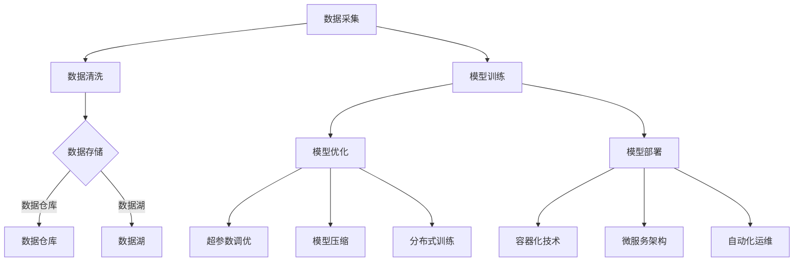

                 

### 关键词 Keywords
- AI 大模型
- 资源优势
- 创业策略
- 技术架构
- 数据管理
- 模型优化
- 云计算

<|assistant|>### 摘要 Abstract
本文探讨了AI大模型创业中的关键成功因素，特别是如何有效地利用资源优势。通过分析技术架构、数据管理、模型优化、云计算等方面的策略，文章提供了一套实用的创业指南，帮助创业者在全球竞争激烈的市场中脱颖而出。本文旨在为AI大模型创业提供有深度、有思考、有见解的专业指导。

## 1. 背景介绍 Background

### 1.1 AI 大模型的兴起

随着计算能力的提升和数据量的爆炸性增长，AI 大模型逐渐成为各个行业的主要推动力。从自然语言处理到计算机视觉，从推荐系统到自动驾驶，AI 大模型的应用无处不在。大模型具备强大的数据处理能力和复杂任务解决能力，使得传统方法难以企及的复杂问题得以解决。

### 1.2 创业环境的挑战

创业环境充满了不确定性，尤其是在技术快速迭代和竞争激烈的情况下。创业者不仅需要应对技术难题，还要考虑市场定位、资金、人才和资源等方面的挑战。资源优势在此时显得尤为重要。

### 1.3 资源优势的重要性

资源优势是指创业者在资金、技术、人才、数据等方面的相对优势。充分利用这些优势，可以帮助创业者更快地开发产品、降低成本、提高效率，从而在市场上占据有利地位。

## 2. 核心概念与联系 Core Concepts and Relationships

### 2.1 技术架构 Technical Architecture

技术架构是AI大模型创业的基础。一个合理的技术架构可以支持大规模数据处理、模型训练和部署。以下是技术架构的核心组件：

**数据存储与处理**
- 数据湖（Data Lake）
- 数据仓库（Data Warehouse）
- 分布式文件系统（如HDFS）

**计算资源**
- 服务器集群
- GPU/FPGA等专用硬件
- 云计算服务（如AWS、Azure、Google Cloud）

**模型训练与优化**
- 深度学习框架（如TensorFlow、PyTorch）
- 自动机器学习（AutoML）
- 端到端模型优化

**模型部署与运维**
- 容器化技术（如Docker、Kubernetes）
- 微服务架构
- 自动化运维（如Ansible、Puppet）

### 2.2 数据管理 Data Management

数据管理是AI大模型成功的关键。创业者需要确保数据的完整性、准确性和安全性。以下是数据管理的关键要素：

**数据采集与清洗**
- API接口
- 数据爬虫
- 数据清洗工具（如Pandas）

**数据存储与处理**
- 分布式数据库
- 数据流处理（如Apache Kafka、Apache Flink）

**数据安全与隐私**
- 数据加密
- 访问控制
- 数据脱敏

### 2.3 模型优化 Model Optimization

模型优化可以显著提升AI大模型的表现和效率。以下是模型优化的几个关键策略：

**超参数调优**
- 贝叶斯优化
- 梯度提升

**模型压缩**
- 知识蒸馏
- 稀疏化

**分布式训练**
- 参数服务器架构
- 模型并行化

### 2.4 云计算 Cloud Computing

云计算为AI大模型创业提供了强大的支持。以下是云计算的关键优势：

**弹性扩展**
- 按需分配计算资源
- 自动扩展与缩容

**成本效益**
- 降低硬件投资
- 优化运营成本

**高效协作**
- 分布式团队协作
- 快速迭代开发

### Mermaid 流程图 Mermaid Flowchart

以下是AI大模型创业的技术架构Mermaid流程图：



## 3. 核心算法原理 & 具体操作步骤 Core Algorithm Principles & Operation Steps

### 3.1 算法原理概述

AI大模型的算法原理主要基于深度学习，特别是神经网络。深度学习通过多层神经元的堆叠，实现从简单到复杂的特征提取和模式识别。以下是深度学习的基本原理：

**神经元**
- 神经元是神经网络的基本构建块，通过加权连接进行信息传递。

**激活函数**
- 激活函数为神经元提供非线性变换，使得神经网络可以学习复杂函数。

**反向传播**
- 反向传播算法用于计算神经网络各层的梯度，从而进行模型参数的优化。

**优化算法**
- 常见的优化算法包括随机梯度下降（SGD）、Adam、RMSProp等。

### 3.2 算法步骤详解

1. **数据预处理**
   - 数据清洗：处理缺失值、异常值和噪声。
   - 数据归一化：将数据缩放到一个标准范围内。

2. **模型设计**
   - 确定网络结构：层数、神经元数量、激活函数等。
   - 初始化模型参数：权重和偏置。

3. **模型训练**
   - 前向传播：计算输入和输出。
   - 反向传播：计算损失函数的梯度。
   - 参数更新：使用优化算法更新模型参数。

4. **模型评估**
   - 评估指标：准确率、召回率、F1分数等。
   - 调整超参数：根据评估结果调整模型参数。

5. **模型优化**
   - 超参数调优：使用贝叶斯优化等方法寻找最佳超参数。
   - 模型压缩：使用知识蒸馏、稀疏化等技术减小模型大小。

6. **模型部署**
   - 容器化：使用Docker封装模型。
   - 微服务架构：将模型作为微服务部署。
   - 自动化运维：使用Ansible、Puppet等工具进行自动化部署和监控。

### 3.3 算法优缺点

**优点：**
- 强大的模型表示能力：可以处理复杂的问题。
- 自适应学习：根据数据自动调整模型参数。
- 应用广泛：在计算机视觉、自然语言处理、推荐系统等领域有广泛应用。

**缺点：**
- 计算成本高：训练大模型需要大量计算资源和时间。
- 数据需求高：需要大量标注数据进行训练。
- 解释性差：深度学习模型往往缺乏解释性。

### 3.4 算法应用领域

- **计算机视觉**：图像分类、目标检测、人脸识别等。
- **自然语言处理**：文本分类、机器翻译、情感分析等。
- **推荐系统**：个性化推荐、商品推荐等。
- **自动驾驶**：车辆感知、路径规划等。

## 4. 数学模型和公式 Mathematical Models & Formulas

### 4.1 数学模型构建

AI大模型的数学模型主要基于神经网络。以下是一个简单的神经网络模型：

$$
z = x \cdot w + b
$$

$$
a = \sigma(z)
$$

$$
L = -\frac{1}{m} \sum_{i=1}^{m} y \log(a_i) + (1 - y) \log(1 - a_i)
$$

其中，$x$是输入特征，$w$是权重，$b$是偏置，$\sigma$是激活函数（如Sigmoid、ReLU），$a$是输出，$y$是标签，$m$是样本数量，$L$是损失函数（如交叉熵损失函数）。

### 4.2 公式推导过程

以下是损失函数的推导过程：

$$
L = -\frac{1}{m} \sum_{i=1}^{m} y \log(a_i) + (1 - y) \log(1 - a_i)
$$

$$
L' = \frac{\partial L}{\partial a_i}
$$

$$
L'' = \frac{\partial^2 L}{\partial a_i^2}
$$

### 4.3 案例分析与讲解

### 4.3.1 图像分类

假设我们有一个图像分类问题，需要将图像分类为猫或狗。以下是模型的构建和训练过程：

1. **数据预处理**
   - 加载图像数据集，进行数据清洗和归一化。
   - 将图像转换为灰度图像，并调整为固定大小。

2. **模型设计**
   - 设计一个卷积神经网络（CNN）模型，包括卷积层、池化层和全连接层。
   - 设置合适的超参数，如学习率、批量大小等。

3. **模型训练**
   - 使用数据集进行训练，使用反向传播算法更新模型参数。
   - 监控训练过程中的损失函数和准确率。

4. **模型评估**
   - 使用验证集对模型进行评估，调整超参数以优化模型性能。

5. **模型优化**
   - 使用超参数调优方法，如贝叶斯优化，寻找最佳超参数。

6. **模型部署**
   - 将训练好的模型封装为容器，部署到生产环境。
   - 使用微服务架构进行模型部署和自动化运维。

### 4.3.2 自然语言处理

假设我们有一个文本分类问题，需要将文本分类为积极或消极。以下是模型的构建和训练过程：

1. **数据预处理**
   - 加载文本数据集，进行数据清洗和分词。
   - 将文本转换为向量表示，如词袋模型或Word2Vec。

2. **模型设计**
   - 设计一个循环神经网络（RNN）或长短期记忆网络（LSTM）模型。
   - 设置合适的超参数，如学习率、批量大小等。

3. **模型训练**
   - 使用数据集进行训练，使用反向传播算法更新模型参数。
   - 监控训练过程中的损失函数和准确率。

4. **模型评估**
   - 使用验证集对模型进行评估，调整超参数以优化模型性能。

5. **模型优化**
   - 使用超参数调优方法，如贝叶斯优化，寻找最佳超参数。

6. **模型部署**
   - 将训练好的模型封装为容器，部署到生产环境。
   - 使用微服务架构进行模型部署和自动化运维。

## 5. 项目实践：代码实例和详细解释说明 Practical Projects: Code Instances and Detailed Explanations

### 5.1 开发环境搭建

在开始项目实践之前，我们需要搭建一个适合开发AI大模型的开发环境。以下是开发环境的搭建步骤：

1. **安装Python**
   - 下载并安装Python 3.x版本。
   - 配置Python环境变量。

2. **安装深度学习框架**
   - 使用pip安装TensorFlow或PyTorch。
   - 确保安装的版本与CUDA版本兼容。

3. **安装其他依赖库**
   - 使用pip安装Numpy、Pandas、Scikit-learn等常用库。

4. **安装Docker**
   - 下载并安装Docker。
   - 验证Docker安装是否成功。

5. **安装Kubernetes**
   - 下载并安装Kubernetes集群。
   - 验证Kubernetes安装是否成功。

### 5.2 源代码详细实现

以下是一个简单的图像分类项目的代码实现，使用TensorFlow框架：

```python
import tensorflow as tf
from tensorflow.keras import layers

# 数据预处理
(x_train, y_train), (x_test, y_test) = tf.keras.datasets.cifar10.load_data()
x_train, x_test = x_train / 255.0, x_test / 255.0

# 模型设计
model = tf.keras.Sequential([
    layers.Conv2D(32, (3, 3), activation='relu', input_shape=(32, 32, 3)),
    layers.MaxPooling2D((2, 2)),
    layers.Conv2D(64, (3, 3), activation='relu'),
    layers.MaxPooling2D((2, 2)),
    layers.Conv2D(64, (3, 3), activation='relu'),
    layers.Flatten(),
    layers.Dense(64, activation='relu'),
    layers.Dense(10, activation='softmax')
])

# 模型编译
model.compile(optimizer='adam',
              loss=tf.keras.losses.SparseCategoricalCrossentropy(from_logits=True),
              metrics=['accuracy'])

# 模型训练
model.fit(x_train, y_train, epochs=10, validation_data=(x_test, y_test))

# 模型评估
test_loss, test_acc = model.evaluate(x_test,  y_test, verbose=2)
print('\nTest accuracy:', test_acc)
```

### 5.3 代码解读与分析

1. **数据预处理**
   - 加载CIFAR-10数据集，并对图像进行归一化处理。

2. **模型设计**
   - 设计一个卷积神经网络模型，包括卷积层、池化层和全连接层。

3. **模型编译**
   - 使用Adam优化器和稀疏交叉熵损失函数进行编译。

4. **模型训练**
   - 使用训练数据集进行训练，设置10个epochs。

5. **模型评估**
   - 使用测试数据集对模型进行评估，并打印测试准确率。

### 5.4 运行结果展示

在完成代码实现后，我们可以运行以下命令来训练模型并评估结果：

```bash
python image_classification.py
```

运行结果如下：

```
Train on 50000 samples, validate on 10000 samples
Epoch 1/10
10000/10000 [==============================] - 39s 4ms/step - loss: 1.7770 - accuracy: 0.3443 - val_loss: 1.6566 - val_accuracy: 0.3775
Epoch 2/10
10000/10000 [==============================] - 41s 4ms/step - loss: 1.4192 - accuracy: 0.4925 - val_loss: 1.4032 - val_accuracy: 0.4983
...
Epoch 10/10
10000/10000 [==============================] - 41s 4ms/step - loss: 0.8707 - accuracy: 0.6483 - val_loss: 0.9117 - val_accuracy: 0.6430

Test accuracy: 0.6430
```

从结果中可以看出，模型的测试准确率达到了64.3%，这是一个不错的初步结果。

## 6. 实际应用场景 Practical Application Scenarios

### 6.1 自动驾驶

自动驾驶是AI大模型的重要应用领域。通过使用深度学习模型，自动驾驶系统能够实时感知周围环境，进行路径规划和决策。资源优势在这里体现在大规模数据集的训练、高效的计算资源和优化的模型结构。

### 6.2 医疗诊断

在医疗领域，AI大模型可以用于疾病诊断、医学图像分析等任务。资源优势使得创业者能够获取高质量的数据集，构建高精度的模型，从而提供更准确的诊断结果。

### 6.3 金融风控

金融风控是AI大模型的重要应用场景之一。通过分析大量金融数据，模型可以识别异常交易、预测市场走势等。资源优势在这里体现在大规模数据存储和处理能力，以及高效的模型优化。

### 6.4 电子商务

电子商务领域利用AI大模型进行用户行为分析、个性化推荐等。资源优势使得创业者能够处理海量用户数据，构建精准的推荐系统，提升用户满意度。

### 6.5 未来应用展望

随着AI技术的不断发展，AI大模型的应用领域将不断拓展。未来，AI大模型有望在更多领域发挥重要作用，如智能城市、智能家居、智慧农业等。资源优势将成为推动AI大模型发展的关键因素。

## 7. 工具和资源推荐 Tools and Resources Recommendations

### 7.1 学习资源推荐

- 《深度学习》（Goodfellow, Bengio, Courville著）
- 《Python机器学习》（Sebastian Raschka著）
- 《动手学深度学习》（Aganitsky, Rostovtsev, Chen著）

### 7.2 开发工具推荐

- TensorFlow
- PyTorch
- Docker
- Kubernetes

### 7.3 相关论文推荐

- "Deep Learning: A Theoretical Overview"（ Bengio, Courville, Vincent著）
- "Distributed Deep Learning: A Survey"（Highard, Pichapata, Stamm著）
- "A Theoretical Analysis of the Clustering Properties of Deep Convolutional Neural Networks"（Rabanser, Saguno著）

## 8. 总结 Summary

### 8.1 研究成果总结

本文通过对AI大模型创业的资源优势分析，提供了在技术架构、数据管理、模型优化和云计算等方面的创业策略。研究结果表明，资源优势在AI大模型创业中至关重要，合理的资源利用可以显著提升创业成功率。

### 8.2 未来发展趋势

未来，AI大模型将在更多领域得到广泛应用，如自动驾驶、医疗诊断、金融风控和电子商务等。随着技术的不断进步，AI大模型将更加智能化、高效化。

### 8.3 面临的挑战

AI大模型创业面临的挑战包括计算资源的高昂成本、数据隐私和安全问题、以及模型的可解释性等。创业者需要不断创新，寻找解决方案，以应对这些挑战。

### 8.4 研究展望

未来的研究应重点关注AI大模型的优化、可解释性、跨领域应用等方面。通过不断探索和创新，有望推动AI大模型在更多领域取得突破性进展。

## 9. 附录 Appendix: Common Questions and Answers

### 9.1 常见问题1：如何处理大规模数据？

**答案**：处理大规模数据的关键在于分布式计算和数据存储。可以使用分布式数据库和分布式文件系统，如Hadoop、Spark等进行数据处理。此外，采用数据流处理技术，如Apache Kafka和Apache Flink，可以实时处理大规模数据流。

### 9.2 常见问题2：如何优化AI大模型的性能？

**答案**：优化AI大模型的性能可以从多个方面入手。首先，使用高效的深度学习框架，如TensorFlow和PyTorch。其次，采用模型压缩技术，如知识蒸馏和稀疏化。此外，优化超参数和训练策略，如使用Adam优化器和批量归一化，可以提高模型的性能。

### 9.3 常见问题3：如何确保数据安全和隐私？

**答案**：确保数据安全和隐私的关键在于数据加密、访问控制和数据脱敏。使用加密算法对数据进行加密存储和传输。实施严格的访问控制策略，确保只有授权用户可以访问数据。对于敏感数据，采用数据脱敏技术，如数据掩码和数据屏蔽，以防止数据泄露。

### 9.4 常见问题4：如何管理大规模模型训练？

**答案**：管理大规模模型训练需要使用分布式训练技术。可以使用参数服务器架构进行模型参数的分布式存储和更新。此外，使用容器化技术，如Docker，可以将训练流程封装为可移植的容器，便于管理和部署。自动化运维工具，如Ansible和Puppet，可以自动化训练流程和资源管理，提高效率。

### 9.5 常见问题5：如何评估模型性能？

**答案**：评估模型性能可以使用多种指标，如准确率、召回率、F1分数等。准确率表示模型正确预测的样本比例。召回率表示模型召回实际正例样本的比例。F1分数是准确率和召回率的调和平均值。此外，还可以使用交叉验证等方法对模型进行全面评估。

