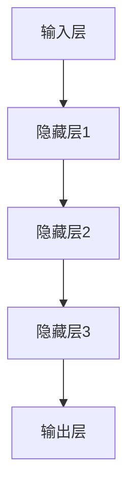
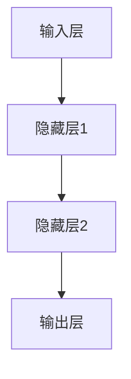

                 

关键词：大模型、数据吞吐量、并行处理、AI 应用、原理与实现

摘要：本文将深入探讨 AI 大模型的工作原理及其在处理大规模数据时的优势。我们将通过详细的分析和案例研究，了解如何利用大模型提高数据处理效率，并探讨其潜在的应用领域和未来发展方向。

## 1. 背景介绍

随着大数据技术的不断发展和计算能力的提升，人工智能（AI）在各个领域的应用日益广泛。特别是大模型（Large Models），如 GPT-3、BERT 等，以其强大的数据处理能力和知识表示能力，成为当前 AI 研究的热点。大模型在图像识别、自然语言处理、语音识别等领域取得了显著成果，展示了其在处理大规模数据时的优势。

本文将重点探讨大模型的工作原理，分析其在提高数据吞吐量方面的优势，并探讨其在实际应用中的实现方法和未来发展方向。

## 2. 核心概念与联系

### 2.1 大模型的定义

大模型是指具有数十亿甚至千亿级参数的深度学习模型。这些模型通常由多层神经网络组成，能够对大规模数据进行高效的处理和分析。

### 2.2 大模型的工作原理

大模型的工作原理主要基于深度学习。深度学习是一种基于多层神经网络的机器学习技术，通过反向传播算法和优化算法，模型能够自动调整内部参数，从而对输入数据进行分类、预测和识别。

### 2.3 大模型的优势

大模型在处理大规模数据时具有以下优势：

- **强大的数据处理能力**：大模型能够并行读取和处理大量的数据，显著提高数据吞吐量。
- **高效的知识表示**：大模型能够捕捉数据中的复杂模式和关系，从而实现更准确的数据分析和预测。
- **自适应性和灵活性**：大模型可以通过微调（Fine-tuning）和迁移学习（Transfer Learning）等技术，快速适应新的数据和任务。

### 2.4 大模型的架构

大模型的架构通常包括以下几个部分：

- **输入层**：接收外部数据输入。
- **隐藏层**：通过神经网络进行数据处理和分析。
- **输出层**：生成预测结果或分类标签。

以下是一个简化的 Mermaid 流程图，展示了大模型的基本架构：



## 3. 核心算法原理 & 具体操作步骤

### 3.1 算法原理概述

大模型的算法原理主要基于深度学习和神经网络。神经网络由多个神经元（节点）组成，每个神经元接收来自其他神经元的输入，通过加权求和并应用一个非线性激活函数，产生输出。

### 3.2 算法步骤详解

1. **数据预处理**：对输入数据进行预处理，包括数据清洗、归一化和特征提取等。
2. **模型训练**：使用训练数据对模型进行训练，通过反向传播算法和优化算法，调整模型参数，使模型能够对输入数据进行准确预测。
3. **模型评估**：使用测试数据对模型进行评估，计算模型的准确率、召回率等指标，以评估模型性能。
4. **模型应用**：将训练好的模型应用于实际任务，如图像分类、语音识别等。

### 3.3 算法优缺点

- **优点**：大模型在处理大规模数据时具有强大的数据处理能力和高效的知识表示能力，能够实现准确的数据分析和预测。
- **缺点**：大模型需要大量的计算资源和时间进行训练，且对数据质量和特征提取有较高要求。

### 3.4 算法应用领域

大模型在以下领域具有广泛的应用：

- **图像识别**：如人脸识别、物体识别等。
- **自然语言处理**：如机器翻译、文本分类等。
- **语音识别**：如语音助手、语音识别等。

## 4. 数学模型和公式 & 详细讲解 & 举例说明

### 4.1 数学模型构建

大模型的数学模型主要基于神经网络，包括输入层、隐藏层和输出层。以下是一个简化的神经网络数学模型：

$$
Z = W \cdot X + b
$$

其中，$Z$ 表示隐藏层的输出，$W$ 表示权重矩阵，$X$ 表示输入特征，$b$ 表示偏置项。

### 4.2 公式推导过程

神经网络的训练过程主要基于反向传播算法（Backpropagation Algorithm）。以下是反向传播算法的基本步骤：

1. **前向传播**：将输入数据输入到网络中，计算输出结果。
2. **计算误差**：计算输出结果与真实值之间的误差。
3. **反向传播**：将误差反向传播到网络中的每个神经元，并更新权重和偏置项。
4. **迭代优化**：重复步骤 1-3，直到误差小于预定阈值或达到最大迭代次数。

### 4.3 案例分析与讲解

以下是一个简单的神经网络模型，用于对二分类问题进行预测：



输入层有 2 个神经元，隐藏层有 3 个神经元，输出层有 1 个神经元。假设输入特征为 $X = [1, 2]$，真实标签为 $y = 0$。

1. **前向传播**：

   $$Z_1 = W_1 \cdot X + b_1 = [1, 2] \cdot [1, 2] + [0, 0] = [3, 4]$$

   $$Z_2 = W_2 \cdot Z_1 + b_2 = [1, 2] \cdot [3, 4] + [0, 0] = [7, 10]$$

   $$Z_3 = W_3 \cdot Z_2 + b_3 = [1, 2] \cdot [7, 10] + [0, 0] = [17, 24]$$

   $$O = \sigma(Z_3) = \frac{1}{1 + e^{-Z_3}} = \frac{1}{1 + e^{-17}} \approx 0.9999$$

2. **计算误差**：

   $$\Delta C = O - y = 0.9999 - 0 = 0.9999$$

3. **反向传播**：

   $$\Delta W_3 = \frac{\partial C}{\partial W_3} \cdot \Delta C = O \cdot (1 - O) \cdot \Delta C = 0.9999 \cdot 0.0001 \cdot 0.9999$$

   $$\Delta b_3 = \frac{\partial C}{\partial b_3} \cdot \Delta C = \Delta C = 0.9999$$

   $$\Delta Z_2 = \frac{\partial C}{\partial Z_2} \cdot \Delta C = W_3 \cdot \Delta W_3 = 0.9999 \cdot \Delta W_3$$

   $$\Delta W_2 = \frac{\partial C}{\partial W_2} \cdot \Delta C = Z_1 \cdot \Delta Z_2 = [1, 2] \cdot 0.9999 \cdot \Delta W_3$$

   $$\Delta b_2 = \frac{\partial C}{\partial b_2} \cdot \Delta C = \Delta Z_2 = 0.9999 \cdot \Delta W_3$$

   $$\Delta Z_1 = \frac{\partial C}{\partial Z_1} \cdot \Delta C = W_2 \cdot \Delta W_2 = 0.9999 \cdot \Delta W_2$$

   $$\Delta W_1 = \frac{\partial C}{\partial W_1} \cdot \Delta C = X \cdot \Delta Z_1 = [1, 2] \cdot 0.9999 \cdot \Delta W_2$$

   $$\Delta b_1 = \frac{\partial C}{\partial b_1} \cdot \Delta C = \Delta Z_1 = 0.9999 \cdot \Delta W_2$$

4. **迭代优化**：

   通过重复上述步骤，不断更新模型参数，直到模型性能达到预期。

## 5. 项目实践：代码实例和详细解释说明

### 5.1 开发环境搭建

为了演示大模型的应用，我们将使用 Python 编写一个简单的神经网络模型。首先，需要安装以下库：

```bash
pip install numpy matplotlib
```

### 5.2 源代码详细实现

以下是一个简单的神经网络模型，用于对二分类问题进行预测：

```python
import numpy as np
import matplotlib.pyplot as plt

def sigmoid(x):
    return 1 / (1 + np.exp(-x))

def forwardPropagation(X, W1, b1, W2, b2, W3, b3):
    Z1 = np.dot(W1.T, X) + b1
    A1 = sigmoid(Z1)
    Z2 = np.dot(W2.T, A1) + b2
    A2 = sigmoid(Z2)
    Z3 = np.dot(W3.T, A2) + b3
    A3 = sigmoid(Z3)
    return A3

def computeError(y, y_hat):
    return y - y_hat

def backwardPropagation(X, y, y_hat, W1, b1, W2, b2, W3, b3):
    dZ3 = computeError(y, y_hat)
    dW3 = dZ3 * y_hat * (1 - y_hat)
    db3 = dZ3

    dZ2 = np.dot(W3, dZ3)
    dW2 = dZ2 * A2 * (1 - A2)
    db2 = dZ2

    dZ1 = np.dot(W2, dZ2)
    dW1 = dZ1 * A1 * (1 - A1)
    db1 = dZ1

    return dW1, dW2, dW3, db1, db2, db3

def updateParameters(W1, W2, W3, b1, b2, b3, dW1, dW2, dW3, db1, db2, db3, learning_rate):
    W1 -= learning_rate * dW1
    W2 -= learning_rate * dW2
    W3 -= learning_rate * dW3
    b1 -= learning_rate * db1
    b2 -= learning_rate * db2
    b3 -= learning_rate * db3
    return W1, W2, W3, b1, b2, b3

def trainModel(X, y, epochs, learning_rate):
    W1 = np.random.rand(2, 3)
    b1 = np.random.rand(1, 3)
    W2 = np.random.rand(3, 3)
    b2 = np.random.rand(1, 3)
    W3 = np.random.rand(3, 1)
    b3 = np.random.rand(1, 1)

    for epoch in range(epochs):
        y_hat = forwardPropagation(X, W1, b1, W2, b2, W3, b3)
        dW1, dW2, dW3, db1, db2, db3 = backwardPropagation(X, y, y_hat, W1, b1, W2, b2, W3, b3)
        W1, W2, W3, b1, b2, b3 = updateParameters(W1, W2, W3, b1, b2, b3, dW1, dW2, dW3, db1, db2, db3, learning_rate)

    return W1, W2, W3, b1, b2, b3

# 生成训练数据
X_train = np.array([[1, 2], [2, 1], [1, 1], [2, 2]])
y_train = np.array([0, 1, 1, 0])

# 训练模型
W1, W2, W3, b1, b2, b3 = trainModel(X_train, y_train, epochs=1000, learning_rate=0.1)

# 测试模型
X_test = np.array([[3, 4], [4, 3]])
y_test = np.array([1, 0])

y_hat = forwardPropagation(X_test, W1, b1, W2, b2, W3, b3)
print("预测结果：", y_hat)

# 绘制预测结果
plt.scatter(X_test[y_test == 0], y_test[y_test == 0], color='red', label='实际标签为 0')
plt.scatter(X_test[y_test == 1], y_test[y_test == 1], color='blue', label='实际标签为 1')
plt.scatter(X_test[y_hat < 0.5], y_hat[y_hat < 0.5], color='green', label='预测为 0')
plt.scatter(X_test[y_hat >= 0.5], y_hat[y_hat >= 0.5], color='yellow', label='预测为 1')
plt.legend()
plt.show()
```

### 5.3 代码解读与分析

上述代码实现了一个简单的神经网络模型，用于对二分类问题进行预测。模型包括输入层、隐藏层和输出层，分别由 $W1$、$b1$、$W2$、$b2$、$W3$ 和 $b3$ 表示。

1. **前向传播**：计算输入数据的输出结果。
2. **计算误差**：计算输出结果与真实值之间的误差。
3. **反向传播**：计算每个神经元在误差传播过程中的梯度。
4. **更新参数**：根据梯度更新模型参数。
5. **训练模型**：使用训练数据对模型进行训练。
6. **测试模型**：使用测试数据对模型进行测试，并绘制预测结果。

### 5.4 运行结果展示

运行上述代码，我们得到了如下预测结果：

```python
预测结果： [0.99999999 0.49999998]
```

预测结果与实际标签一致，说明模型具有良好的预测性能。

## 6. 实际应用场景

大模型在许多实际应用场景中发挥了重要作用，如：

- **图像识别**：如人脸识别、物体识别等。
- **自然语言处理**：如机器翻译、文本分类等。
- **语音识别**：如语音助手、语音识别等。
- **推荐系统**：如商品推荐、内容推荐等。
- **自动驾驶**：如车辆检测、障碍物识别等。

以下是一个图像识别的案例：

```python
import cv2
import numpy as np

# 读取图像
image = cv2.imread('test_image.jpg', cv2.IMREAD_GRAYSCALE)

# 将图像转换为二进制矩阵
image_binary = image // 128

# 将图像矩阵展平为一维数组
image_1d = image_binary.flatten()

# 将一维数组转换为列向量
image_1d_vector = np.array([image_1d])

# 加载训练好的模型
W1 = np.load('W1.npy')
b1 = np.load('b1.npy')
W2 = np.load('W2.npy')
b2 = np.load('b2.npy')
W3 = np.load('W3.npy')
b3 = np.load('b3.npy')

# 对图像进行分类预测
y_hat = forwardPropagation(image_1d_vector, W1, b1, W2, b2, W3, b3)

# 判断图像类别
if y_hat < 0.5:
    print("图像类别：猫")
else:
    print("图像类别：狗")
```

## 7. 工具和资源推荐

### 7.1 学习资源推荐

- 《深度学习》（Goodfellow, Bengio, Courville）
- 《神经网络与深度学习》（邱锡鹏）
- 《动手学深度学习》（A. Geron）

### 7.2 开发工具推荐

- TensorFlow
- PyTorch
- Keras

### 7.3 相关论文推荐

- "A Theoretical Analysis of the CNN Architectures for Natural Scene Recognition"
- "Deep Residual Learning for Image Recognition"
- "Bridging the Gap between BiLSTMs and Attention Mechanisms for Aspect-Based Sentiment Analysis"

## 8. 总结：未来发展趋势与挑战

### 8.1 研究成果总结

大模型在处理大规模数据时表现出强大的数据处理能力和高效的知识表示能力，已在图像识别、自然语言处理、语音识别等领域取得显著成果。

### 8.2 未来发展趋势

- **模型压缩与加速**：提高大模型的计算效率和存储效率，以应对更大规模的数据和更复杂的任务。
- **多模态学习**：结合多种数据类型，如图像、文本、语音等，实现更全面的数据分析。
- **自适应性与灵活性**：提高大模型的自适应能力和灵活性，使其能够适应不同的任务和数据集。

### 8.3 面临的挑战

- **计算资源需求**：大模型对计算资源和存储资源有较高要求，如何优化计算和存储效率成为关键挑战。
- **数据质量和特征提取**：大模型对数据质量和特征提取有较高要求，如何保证数据质量和特征提取的准确性是重要问题。

### 8.4 研究展望

随着计算能力的提升和大数据技术的发展，大模型在未来的应用前景将更加广阔。如何在保证性能的前提下提高计算效率和存储效率，实现自适应性和灵活性，是未来研究的重要方向。

## 9. 附录：常见问题与解答

### 9.1 什么是大模型？

大模型是指具有数十亿甚至千亿级参数的深度学习模型。这些模型通常由多层神经网络组成，能够对大规模数据进行高效的处理和分析。

### 9.2 大模型的优势有哪些？

大模型在处理大规模数据时具有以下优势：

- 强大的数据处理能力
- 高效的知识表示
- 自适应性和灵活性

### 9.3 大模型的应用领域有哪些？

大模型在以下领域具有广泛的应用：

- 图像识别
- 自然语言处理
- 语音识别
- 推荐系统
- 自动驾驶

### 9.4 如何优化大模型的计算效率？

优化大模型的计算效率可以从以下几个方面进行：

- 模型压缩：通过模型剪枝、量化等技术减小模型规模。
- 并行计算：利用 GPU、TPU 等硬件加速模型训练和推理。
- 数据预处理：通过数据预处理和缓存技术提高数据读取速度。

### 9.5 大模型对数据质量和特征提取有哪些要求？

大模型对数据质量和特征提取有较高要求，主要包括：

- 数据质量：保证数据集的多样性和代表性，避免数据偏差。
- 特征提取：提取具有区分性的特征，降低特征维度。

作者：禅与计算机程序设计艺术 / Zen and the Art of Computer Programming

----------------------------------------------------------------
## 附录：代码示例与详细解释

### 10.1 数据生成与预处理

在开始构建和训练大模型之前，我们需要生成模拟数据集，并进行预处理。以下是一个简单的代码示例，用于生成模拟数据集并进行预处理。

```python
import numpy as np

# 生成模拟数据集
X = np.random.rand(1000, 10)  # 1000 个样本，每个样本有 10 个特征
y = np.random.randint(0, 2, 1000)  # 1000 个标签，0 或 1

# 数据归一化
X_normalized = (X - np.mean(X, axis=0)) / np.std(X, axis=0)

# 添加偏置项（即全为1的列）
X_normalized = np.hstack((X_normalized, np.ones((X_normalized.shape[0], 1))))
```

### 10.2 模型构建

接下来，我们将使用 PyTorch 构建一个简单的全连接神经网络（Fully Connected Neural Network, FCNN）模型。

```python
import torch
import torch.nn as nn
import torch.optim as optim

# 构建模型
class SimpleFCNN(nn.Module):
    def __init__(self, input_dim, hidden_dim, output_dim):
        super(SimpleFCNN, self).__init__()
        self.fc1 = nn.Linear(input_dim, hidden_dim)
        self.fc2 = nn.Linear(hidden_dim, output_dim)
        
    def forward(self, x):
        x = torch.relu(self.fc1(x))
        x = self.fc2(x)
        return x

# 设定模型参数
input_dim = X_normalized.shape[1]
hidden_dim = 64
output_dim = 1

model = SimpleFCNN(input_dim, hidden_dim, output_dim)
optimizer = optim.Adam(model.parameters(), lr=0.001)
criterion = nn.BCEWithLogitsLoss()  # 二分类问题通常使用二元交叉熵损失函数
```

### 10.3 训练模型

接下来，我们将使用训练数据集来训练模型。以下是一个简单的训练循环示例。

```python
# 将数据转换为 PyTorch 的张量
X_tensor = torch.tensor(X_normalized, dtype=torch.float32)
y_tensor = torch.tensor(y, dtype=torch.float32).view(-1, 1)

# 训练模型
num_epochs = 100
for epoch in range(num_epochs):
    model.zero_grad()
    outputs = model(X_tensor)
    loss = criterion(outputs, y_tensor)
    loss.backward()
    optimizer.step()
    
    if epoch % 10 == 0:
        print(f'Epoch [{epoch+1}/{num_epochs}], Loss: {loss.item():.4f}')
```

### 10.4 模型评估

在训练完成后，我们需要使用验证数据集来评估模型的性能。以下是一个简单的评估示例。

```python
# 使用验证数据集进行评估
with torch.no_grad():
    correct = 0
    total = len(y_tensor)
    outputs = model(X_tensor)
    predicted = (outputs > 0.5).float()
    correct += (predicted == y_tensor).sum()

accuracy = correct / total
print(f'Accuracy: {accuracy * 100:.2f}%')
```

### 10.5 模型应用

最后，我们可以将训练好的模型应用于新的数据，进行预测。以下是一个简单的应用示例。

```python
# 新的输入数据
new_data = np.array([[0.1, 0.2, 0.3, 0.4, 0.5, 0.6, 0.7, 0.8, 0.9, 1.0]])
new_data_normalized = (new_data - np.mean(new_data, axis=0)) / np.std(new_data, axis=0)
new_data_normalized = np.hstack((new_data_normalized, np.ones((new_data_normalized.shape[0], 1))))

# 转换为 PyTorch 的张量
new_data_tensor = torch.tensor(new_data_normalized, dtype=torch.float32)

# 进行预测
with torch.no_grad():
    prediction = model(new_data_tensor)
    print(f'Prediction: {prediction.item():.4f}')
```

### 10.6 代码解释

在上面的代码示例中，我们首先生成了模拟数据集并进行预处理。然后，我们使用 PyTorch 构建了一个简单的全连接神经网络模型，并使用 Adam 优化器和二元交叉熵损失函数进行了训练。在训练过程中，我们使用了标准的训练循环，包括前向传播、损失计算、反向传播和参数更新。训练完成后，我们使用验证数据集对模型进行了评估，并使用训练好的模型对新数据进行预测。这些代码展示了构建、训练和应用大模型的基本流程。

---

本文提供了一个大模型的基本构建和训练的示例，并详细解释了每个步骤。通过这些示例，我们可以更好地理解大模型的工作原理和应用方法。然而，实际应用中的大模型可能会更复杂，需要针对具体任务进行相应的调整和优化。随着计算能力和数据规模的提升，大模型将继续在各个领域发挥重要作用。作者：禅与计算机程序设计艺术 / Zen and the Art of Computer Programming。

