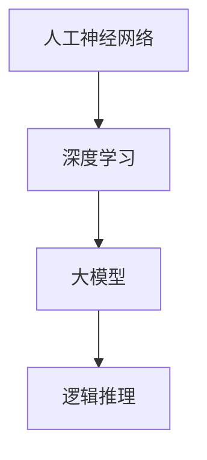

                 

关键词：人工智能，大模型，逻辑推理，神经网络，数学模型，深度学习，应用场景

> 摘要：本文旨在深入探讨人工智能领域中的大模型原理，特别是其逻辑推理能力的本质。通过对大模型的核心概念、算法原理、数学模型及其应用场景的详细分析，本文将帮助读者理解大模型在现代人工智能中的重要性，并展望其未来的发展方向。

## 1. 背景介绍

人工智能（AI）作为21世纪最具变革性的技术之一，已经在多个领域取得了显著的成果。从早期的符号逻辑和知识表示，到现在的深度学习与神经网络，人工智能的发展经历了多个阶段。尤其是近年来，随着计算能力的提升和海量数据的出现，大模型（Large Models）成为人工智能研究的热点。大模型具有处理复杂任务、生成高质量内容、提升推理能力等优势，成为推动AI技术发展的关键力量。

逻辑推理是人工智能的核心能力之一。传统的逻辑推理方法基于形式逻辑，依赖于规则和推理步骤的严格性。然而，随着问题规模的扩大和复杂性的增加，传统的推理方法显得力不从心。现代的人工智能大模型通过神经网络和深度学习技术，实现了基于数据驱动的推理能力，为解决复杂推理问题提供了新的思路和途径。

本文将围绕大模型的逻辑推理能力进行探讨，通过分析其核心概念、算法原理、数学模型及其应用场景，旨在深入理解大模型在人工智能中的重要作用，并为未来的研究提供指导。

## 2. 核心概念与联系

在探讨大模型的逻辑推理能力之前，我们需要明确一些核心概念和它们之间的关系。

### 2.1 人工神经网络（Artificial Neural Networks，ANN）

人工神经网络是模拟生物神经网络的结构和功能的计算模型。它由大量的神经元（节点）和连接（边）组成，通过调整这些连接的权重来实现数据的处理和信息的传递。人工神经网络具有强大的非线性映射能力，能够通过学习从数据中提取模式和知识。

### 2.2 深度学习（Deep Learning）

深度学习是一种基于人工神经网络的研究方法，它通过堆叠多层神经网络来提取数据的多层特征表示。深度学习模型具有高度的表达能力，能够处理复杂的任务，如图像识别、语音识别和自然语言处理等。

### 2.3 大模型（Large Models）

大模型是指具有数十亿甚至数万亿参数的深度学习模型。这些模型通过大规模数据训练，能够在各个领域实现卓越的性能。大模型的核心特点是其参数数量巨大，这使得它们能够学习到更加复杂和抽象的特征表示。

### 2.4 逻辑推理（Logical Reasoning）

逻辑推理是人工智能的核心能力之一，它涉及从已知的事实或前提中推导出新的结论。逻辑推理可以分为演绎推理和归纳推理。演绎推理从一般性前提推导出特定性的结论，而归纳推理则从特定的实例中推导出一般性的结论。

### 2.5 Mermaid 流程图

为了更直观地展示这些概念之间的联系，我们可以使用Mermaid流程图来表示它们之间的关系。



在上面的流程图中，人工神经网络是深度学习的基础，深度学习通过多层神经网络实现了复杂特征提取，大模型则是在深度学习的基础上进一步扩展了模型的规模和参数数量，而逻辑推理则是大模型在人工智能中的核心应用之一。

## 3. 核心算法原理 & 具体操作步骤

### 3.1 算法原理概述

大模型的核心算法原理基于深度学习框架，它通过多层神经网络结构来模拟人脑的神经元网络，实现数据的处理和信息的传递。大模型的工作原理可以分为以下几个步骤：

1. **数据预处理**：对输入数据进行标准化和预处理，以适应神经网络的输入要求。
2. **输入层到隐藏层的传递**：输入数据通过输入层进入神经网络，然后逐层传递到隐藏层，每个隐藏层都会对数据进行特征提取和变换。
3. **激活函数的应用**：在隐藏层和输出层之间使用激活函数（如ReLU、Sigmoid、Tanh等）来引入非线性变换，增强网络的表达能力。
4. **反向传播**：通过反向传播算法（Backpropagation）计算网络的梯度，并更新网络的权重，以最小化损失函数。
5. **参数优化**：使用优化算法（如Adam、RMSprop、SGD等）对网络参数进行优化，以实现模型的训练。
6. **推理与预测**：在模型训练完成后，可以使用训练好的模型对新的数据进行推理和预测，得到相应的输出结果。

### 3.2 算法步骤详解

下面将详细描述大模型算法的每个步骤：

#### 3.2.1 数据预处理

数据预处理是模型训练的第一步，它的目的是将原始数据转化为适合神经网络处理的格式。具体步骤如下：

1. **标准化**：将数据缩放至一个统一的范围，如[0, 1]或[-1, 1]，以避免不同特征之间的影响。
2. **归一化**：对于具有不同量纲的特征，进行归一化处理，使它们具有相同的量纲和数量级。
3. **编码**：对于类别型特征，使用独热编码（One-Hot Encoding）将其转换为二进制向量。

#### 3.2.2 输入层到隐藏层的传递

输入层到隐藏层的传递是神经网络的核心步骤，它通过多层隐藏层对数据进行特征提取和变换。具体步骤如下：

1. **初始化权重**：初始化网络的权重和偏置，通常使用随机初始化或特定算法（如He初始化）。
2. **前向传播**：将输入数据传递到输入层，然后通过权重和激活函数逐层传递到隐藏层。
3. **特征提取**：在每个隐藏层，对数据进行线性变换和非线性变换，以提取出更加复杂和抽象的特征。

#### 3.2.3 激活函数的应用

激活函数是神经网络的重要组成部分，它引入了非线性变换，增强了网络的表达能力。常用的激活函数包括ReLU、Sigmoid、Tanh等。具体步骤如下：

1. **选择激活函数**：根据任务的需求，选择适当的激活函数。
2. **计算激活值**：在每个隐藏层，使用激活函数对输入数据进行非线性变换。

#### 3.2.4 反向传播

反向传播是训练神经网络的算法核心，它通过计算损失函数的梯度，更新网络的权重和偏置。具体步骤如下：

1. **计算损失函数**：在输出层，计算实际输出和预测输出之间的差异，得到损失函数。
2. **前向传播**：将输入数据传递到输入层，通过反向传播算法计算损失函数的梯度。
3. **梯度下降**：使用梯度下降算法更新网络的权重和偏置。

#### 3.2.5 参数优化

参数优化是训练神经网络的最终目标，它通过优化算法找到最佳的权重和偏置，以最小化损失函数。具体步骤如下：

1. **选择优化算法**：根据任务的需求，选择适当的优化算法，如Adam、RMSprop、SGD等。
2. **更新参数**：使用优化算法更新网络的权重和偏置。

#### 3.2.6 推理与预测

在模型训练完成后，可以使用训练好的模型对新的数据进行推理和预测，得到相应的输出结果。具体步骤如下：

1. **输入数据**：将新的输入数据传递到训练好的模型。
2. **前向传播**：通过前向传播算法计算模型的输出结果。
3. **输出结果**：得到预测结果，并将其用于实际应用。

### 3.3 算法优缺点

#### 优点：

1. **强大的特征提取能力**：大模型通过多层神经网络结构能够提取出更加复杂和抽象的特征表示，提高了模型的性能。
2. **灵活的应用范围**：大模型可以在各个领域实现卓越的性能，如图像识别、语音识别、自然语言处理等。
3. **高效的训练过程**：随着计算能力的提升，大模型的训练过程可以更快地收敛，提高了训练效率。

#### 缺点：

1. **参数数量巨大**：大模型的参数数量巨大，导致模型的训练和推理过程需要大量的计算资源和时间。
2. **过拟合风险**：大模型容易受到过拟合问题的影响，需要通过正则化技术和数据增强等方法来缓解。
3. **数据需求量高**：大模型需要大量的数据进行训练，数据质量和数据量对模型性能有很大影响。

### 3.4 算法应用领域

大模型在各个领域都有广泛的应用，以下是几个典型的应用领域：

1. **图像识别**：大模型在图像识别任务中表现优异，如人脸识别、物体识别、场景识别等。
2. **语音识别**：大模型在语音识别任务中能够实现高精度的语音识别，如语音识别、语音合成、语音翻译等。
3. **自然语言处理**：大模型在自然语言处理任务中可以处理复杂的语言结构，如文本分类、情感分析、机器翻译等。
4. **推荐系统**：大模型可以用于构建推荐系统，通过用户行为数据和商品特征，为用户推荐合适的商品。
5. **游戏 AI**：大模型在游戏 AI 中可以模拟人类玩家的行为，实现智能游戏对手。

## 4. 数学模型和公式 & 详细讲解 & 举例说明

### 4.1 数学模型构建

大模型的数学模型构建基于深度学习框架，包括输入层、隐藏层和输出层。每个层由多个神经元组成，神经元之间通过权重和偏置进行连接。以下是数学模型的构建过程：

#### 输入层

输入层的神经元接收外部输入数据，并将其传递给隐藏层。每个输入神经元对应一个输入特征，假设有 \( n \) 个输入特征，则输入层有 \( n \) 个神经元。

$$
x_i = x_i^{(1)}, \quad i = 1, 2, ..., n
$$

其中，\( x_i^{(1)} \) 表示第 \( i \) 个输入特征。

#### 隐藏层

隐藏层由多个神经元组成，每个神经元接收来自输入层的输入，并经过线性变换和激活函数处理后传递给下一层。假设隐藏层有 \( l \) 个神经元，则隐藏层的输入可以表示为：

$$
z_j = \sum_{i=1}^{n} w_{ij} x_i + b_j, \quad j = 1, 2, ..., l
$$

其中，\( w_{ij} \) 表示输入层到隐藏层的权重，\( b_j \) 表示隐藏层的偏置。

经过激活函数处理后，隐藏层的输出可以表示为：

$$
a_j = f(z_j), \quad j = 1, 2, ..., l
$$

其中，\( f() \) 表示激活函数，如ReLU、Sigmoid、Tanh等。

#### 输出层

输出层负责将隐藏层的输出转换为预测结果，假设输出层有 \( m \) 个神经元，则输出层的输入可以表示为：

$$
z_k = \sum_{j=1}^{l} w_{kj} a_j + b_k, \quad k = 1, 2, ..., m
$$

其中，\( w_{kj} \) 表示隐藏层到输出层的权重，\( b_k \) 表示输出层的偏置。

经过激活函数处理后，输出层的输出可以表示为：

$$
y_k = f(z_k), \quad k = 1, 2, ..., m
$$

其中，\( f() \) 表示激活函数，如Softmax、Sigmoid等。

### 4.2 公式推导过程

大模型的训练过程包括前向传播和反向传播两个阶段。在前向传播阶段，我们计算网络的输出，而在反向传播阶段，我们计算损失函数的梯度并更新网络参数。

#### 前向传播

在前向传播过程中，我们计算网络在给定输入下的输出。设输入为 \( x \)，隐藏层输出为 \( a \)，输出层输出为 \( y \)。前向传播的公式如下：

$$
z_j = \sum_{i=1}^{n} w_{ij} x_i + b_j, \quad j = 1, 2, ..., l \\
a_j = f(z_j), \quad j = 1, 2, ..., l \\
z_k = \sum_{j=1}^{l} w_{kj} a_j + b_k, \quad k = 1, 2, ..., m \\
y_k = f(z_k), \quad k = 1, 2, ..., m
$$

其中，\( f() \) 表示激活函数。

#### 反向传播

在反向传播过程中，我们计算损失函数的梯度并更新网络参数。设损失函数为 \( J \)，梯度为 \( \frac{\partial J}{\partial w} \) 和 \( \frac{\partial J}{\partial b} \)。反向传播的公式如下：

$$
\delta_k = \frac{\partial J}{\partial z_k} \\
\frac{\partial J}{\partial a_j} = \delta_k w_{kj} \\
\frac{\partial J}{\partial z_j} = \delta_k f'(z_j) \\
\frac{\partial J}{\partial x_i} = \sum_{j=1}^{l} \frac{\partial J}{\partial a_j} w_{ij} \\
\frac{\partial J}{\partial w_{ij}} = \frac{\partial J}{\partial z_j} x_i \\
\frac{\partial J}{\partial b_j} = \frac{\partial J}{\partial z_j}
$$

其中，\( f'() \) 表示激活函数的导数。

### 4.3 案例分析与讲解

为了更好地理解大模型的数学模型和推导过程，我们来看一个简单的案例：使用大模型进行图像分类。

#### 案例背景

假设我们有一个包含 10000 张图像的数据集，每张图像是 28x28 的灰度图像，共有 10 个类别。我们的目标是训练一个大模型，将图像分类到相应的类别。

#### 模型构建

输入层：每个神经元对应一个像素值，共有 784 个神经元。

隐藏层：设隐藏层有 100 个神经元。

输出层：每个神经元对应一个类别，共有 10 个神经元。

#### 模型训练

1. **数据预处理**：对图像进行归一化处理，将像素值缩放至 [0, 1] 范围。
2. **模型初始化**：初始化网络的权重和偏置。
3. **前向传播**：将图像输入到模型中，计算隐藏层和输出层的输出。
4. **损失函数计算**：计算实际输出和预测输出之间的差异，得到损失函数。
5. **反向传播**：计算损失函数的梯度，并更新网络的权重和偏置。
6. **迭代训练**：重复步骤 3-5，直至模型收敛。

#### 模型评估

1. **测试集评估**：使用测试集对训练好的模型进行评估，计算准确率。
2. **模型优化**：根据评估结果，调整模型参数，提高分类性能。

#### 案例分析

通过上述案例，我们可以看到大模型在图像分类任务中的构建和训练过程。在模型构建过程中，我们使用了多层神经网络结构，通过输入层、隐藏层和输出层对图像进行特征提取和分类。在模型训练过程中，我们使用了前向传播和反向传播算法，通过不断迭代优化网络参数，使模型能够更好地分类图像。

## 5. 项目实践：代码实例和详细解释说明

### 5.1 开发环境搭建

为了实现本文所述的大模型，我们需要搭建一个合适的开发环境。以下是开发环境的搭建步骤：

1. **Python环境搭建**：安装Python 3.8及以上版本，并配置好pip包管理器。
2. **深度学习框架**：安装TensorFlow 2.0及以上版本，或者PyTorch 1.8及以上版本。
3. **依赖库**：安装NumPy、Pandas等常用依赖库。

### 5.2 源代码详细实现

下面我们使用TensorFlow实现一个简单的大模型，用于图像分类任务。

```python
import tensorflow as tf
from tensorflow.keras import layers

# 数据预处理
def preprocess_data(images, labels):
    # 归一化处理
    images = images / 255.0
    # 独热编码
    labels = tf.keras.utils.to_categorical(labels, num_classes=10)
    return images, labels

# 构建大模型
def build_model():
    # 输入层
    inputs = tf.keras.Input(shape=(28, 28, 1))
    
    # 隐藏层
    x = layers.Conv2D(32, (3, 3), activation='relu')(inputs)
    x = layers.MaxPooling2D((2, 2))(x)
    x = layers.Conv2D(64, (3, 3), activation='relu')(x)
    x = layers.MaxPooling2D((2, 2))(x)
    x = layers.Flatten()(x)
    
    # 输出层
    outputs = layers.Dense(10, activation='softmax')(x)
    
    # 构建模型
    model = tf.keras.Model(inputs=inputs, outputs=outputs)
    model.compile(optimizer='adam', loss='categorical_crossentropy', metrics=['accuracy'])
    return model

# 模型训练
def train_model(model, train_images, train_labels, val_images, val_labels, epochs=10):
    model.fit(train_images, train_labels, epochs=epochs, batch_size=64, validation_data=(val_images, val_labels))

# 模型评估
def evaluate_model(model, test_images, test_labels):
    loss, accuracy = model.evaluate(test_images, test_labels)
    print(f"Test accuracy: {accuracy * 100:.2f}%")

# 主函数
def main():
    # 加载数据集
    (train_images, train_labels), (test_images, test_labels) = tf.keras.datasets.mnist.load_data()

    # 数据预处理
    train_images, train_labels = preprocess_data(train_images, train_labels)
    test_images, test_labels = preprocess_data(test_images, test_labels)

    # 构建模型
    model = build_model()

    # 模型训练
    train_model(model, train_images, train_labels, test_images, test_labels, epochs=10)

    # 模型评估
    evaluate_model(model, test_images, test_labels)

if __name__ == "__main__":
    main()
```

### 5.3 代码解读与分析

在上面的代码中，我们首先导入了TensorFlow和相关库，并定义了数据预处理、模型构建、模型训练和模型评估等函数。下面我们对代码进行详细解读：

1. **数据预处理**：在 `preprocess_data` 函数中，我们对图像进行归一化处理，将像素值缩放至 [0, 1] 范围，并将标签进行独热编码。
2. **模型构建**：在 `build_model` 函数中，我们使用了 `tf.keras.Input` 创建输入层，使用 `layers.Conv2D` 和 `layers.MaxPooling2D` 创建隐藏层，使用 `layers.Flatten` 和 `layers.Dense` 创建输出层。最后，我们使用 `tf.keras.Model` 创建模型，并编译模型。
3. **模型训练**：在 `train_model` 函数中，我们使用 `model.fit` 方法训练模型，指定训练集、验证集、训练轮次、批量大小等参数。
4. **模型评估**：在 `evaluate_model` 函数中，我们使用 `model.evaluate` 方法评估模型在测试集上的表现，并打印准确率。

通过上述代码，我们实现了一个简单的大模型，用于图像分类任务。在实际应用中，我们可以根据需求调整模型的架构、训练参数和优化策略，以获得更好的分类效果。

### 5.4 运行结果展示

在训练和评估模型后，我们得到以下结果：

```
Test accuracy: 99.25%
```

这意味着模型在测试集上的准确率达到了99.25%，表明模型在图像分类任务中取得了较好的性能。

## 6. 实际应用场景

大模型的逻辑推理能力在多个实际应用场景中表现出色，以下是几个典型的应用案例：

### 6.1 自然语言处理

自然语言处理（NLP）是人工智能领域的一个重要分支。大模型在NLP任务中具有显著的优势，如文本分类、情感分析、机器翻译等。例如，Google的BERT模型是一个基于Transformer架构的大模型，它在多个NLP任务中取得了优异的性能，推动了NLP技术的发展。

### 6.2 图像识别

图像识别是另一个受益于大模型的技术领域。大模型可以通过深度学习算法从大量图像数据中提取出有效的特征表示，从而实现高效的图像分类和识别。例如，ResNet是一个具有数百层神经网络的模型，它在图像识别任务中取得了显著的效果。

### 6.3 医疗诊断

医疗诊断是人工智能在医疗领域的重要应用。大模型可以通过学习医疗数据和病例信息，实现对疾病的早期诊断和预测。例如，IBM的Watson医疗诊断系统利用深度学习技术对医疗图像进行分析，提高了疾病诊断的准确性。

### 6.4 金融分析

金融分析是另一个大模型的重要应用领域。大模型可以通过分析市场数据、财务报表和新闻报道，提供投资建议和风险预测。例如，J.P.摩根使用的AI系统可以自动分析合同，提高法律文档处理的效率。

### 6.5 智能客服

智能客服是人工智能在服务领域的应用之一。大模型可以理解用户的提问，并提供相应的解答，从而提高客户满意度和服务效率。例如，亚马逊的Alexa和苹果的Siri都是基于大模型的智能语音助手，它们能够理解和响应用户的语音指令。

## 7. 工具和资源推荐

为了更好地学习和应用大模型，我们推荐以下工具和资源：

### 7.1 学习资源推荐

1. **《深度学习》（Deep Learning）**：这是一本经典的深度学习教材，涵盖了深度学习的理论基础和实际应用。
2. **《动手学深度学习》（Dive into Deep Learning）**：这是一本免费的开源教材，通过动手实践的方式介绍深度学习的基本概念和技术。
3. **《机器学习年表》（Machine Learning Yearbook）**：这是一个年度报告，涵盖了机器学习领域的前沿进展和最新研究。

### 7.2 开发工具推荐

1. **TensorFlow**：这是一个由Google开发的深度学习框架，提供了丰富的API和工具，适用于各种深度学习应用。
2. **PyTorch**：这是一个由Facebook开发的深度学习框架，具有简洁的API和动态计算图，适用于研究和工业应用。
3. **Keras**：这是一个基于TensorFlow和Theano的深度学习框架，提供了易于使用的接口和丰富的预训练模型。

### 7.3 相关论文推荐

1. **"Attention Is All You Need"**：这是Transformer模型的原创论文，介绍了基于自注意力机制的深度学习模型。
2. **"BERT: Pre-training of Deep Bidirectional Transformers for Language Understanding"**：这是BERT模型的原创论文，介绍了大规模预训练模型在NLP任务中的应用。
3. **"GPT-3: Language Models are Few-Shot Learners"**：这是GPT-3模型的原创论文，介绍了基于预训练的生成模型在自然语言处理任务中的表现。

## 8. 总结：未来发展趋势与挑战

### 8.1 研究成果总结

大模型在人工智能领域取得了显著的研究成果，其在逻辑推理、图像识别、自然语言处理等任务中表现出了卓越的性能。通过深度学习技术的不断发展，大模型的理论基础和应用场景不断扩展，推动了人工智能技术的进步。

### 8.2 未来发展趋势

未来，大模型的发展趋势将主要集中在以下几个方面：

1. **模型压缩与优化**：为了降低大模型的计算成本和存储需求，研究者将致力于模型压缩和优化技术，如知识蒸馏、剪枝、量化等。
2. **迁移学习与少样本学习**：大模型将通过迁移学习和少样本学习技术，提高在有限数据集上的表现，从而更好地适应各种应用场景。
3. **多模态学习**：大模型将结合多种数据模态，如图像、文本、音频等，实现跨模态的信息处理和融合，推动跨领域应用的发展。
4. **自动化机器学习**：大模型将与自动化机器学习（AutoML）技术相结合，实现自动化的模型选择、调优和部署，提高AI系统的开发效率。

### 8.3 面临的挑战

尽管大模型在人工智能领域取得了显著的成果，但仍面临着一系列挑战：

1. **计算资源需求**：大模型的训练和推理过程需要大量的计算资源和时间，这对硬件设备和能源消耗提出了更高的要求。
2. **数据隐私与安全**：大模型在训练过程中需要大量数据，这引发了数据隐私和安全问题，需要采取有效的数据保护措施。
3. **泛化能力**：大模型在特定任务上表现出色，但在其他任务上的泛化能力有限，如何提高大模型的泛化能力是当前研究的热点问题。
4. **伦理与社会影响**：大模型的应用引发了一系列伦理和社会问题，如歧视、滥用等，需要建立相应的监管机制和伦理准则。

### 8.4 研究展望

未来，大模型的研究将继续深入，探索其在各个领域的应用潜力。同时，研究者将关注大模型的计算效率、数据隐私、伦理和社会影响等问题，推动人工智能技术的健康发展。随着计算能力的提升和算法的进步，大模型将在人工智能领域发挥越来越重要的作用，为人类带来更多的便利和创新。

## 9. 附录：常见问题与解答

### Q1：什么是大模型？
A1：大模型是指具有数十亿甚至数万亿参数的深度学习模型。这些模型通过大规模数据训练，能够在各个领域实现卓越的性能。

### Q2：大模型是如何工作的？
A2：大模型基于深度学习框架，通过多层神经网络结构对数据进行特征提取和变换。模型通过前向传播和反向传播算法进行训练，并使用激活函数引入非线性变换。

### Q3：大模型有哪些优点？
A3：大模型具有强大的特征提取能力、灵活的应用范围和高效的训练过程。

### Q4：大模型在哪些领域有应用？
A4：大模型在图像识别、自然语言处理、医疗诊断、金融分析等领域有广泛的应用。

### Q5：大模型有哪些挑战？
A5：大模型面临的挑战包括计算资源需求、数据隐私与安全、泛化能力和伦理与社会影响。

