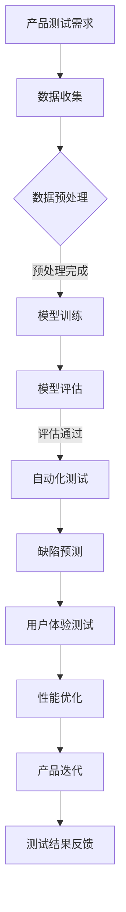

                 

 在当今快速发展的科技时代，人工智能（AI）技术的进步已经成为推动创业创新的重要力量。AI 大模型，特别是深度学习模型的崛起，正对各个领域产生深远的影响。本文将探讨 AI 大模型在创业产品测试中的重要性，分析其在提升产品质量、加速产品迭代以及优化用户体验等方面的应用。

> **关键词：** AI 大模型、创业产品、测试、深度学习、产品质量、用户体验

> **摘要：** 本文首先介绍了 AI 大模型的基本概念和其在不同领域的应用现状，然后重点探讨了 AI 大模型在创业产品测试中的关键作用。通过具体的案例分析和实践指导，展示了如何利用 AI 大模型进行高效的产品测试，以提升创业产品的市场竞争力。

## 1. 背景介绍

随着大数据、云计算和深度学习等技术的发展，人工智能在各个领域的应用越来越广泛。AI 大模型，作为一种能够处理复杂数据、提取特征并进行预测的强大工具，已经成为现代科技发展的重要驱动力。AI 大模型的核心在于其能够通过大规模数据进行训练，从而在图像识别、自然语言处理、语音识别等领域表现出卓越的性能。

在创业领域，AI 大模型的应用正日益凸显。初创企业在有限资源下，需要快速迭代产品，确保产品的质量与市场竞争力。传统的测试方法往往耗时耗力，而 AI 大模型能够通过自动化和智能化的测试流程，大幅提升测试效率，缩短产品上市时间。

本文将结合具体案例，深入探讨 AI 大模型在创业产品测试中的应用，分析其带来的优势，并提出一些实用的建议。

## 2. 核心概念与联系

### 2.1 AI 大模型的基本概念

AI 大模型是指通过大规模数据训练得到的复杂神经网络模型。这些模型通常由数十亿甚至数千亿个参数组成，具有强大的特征提取和模式识别能力。常见的 AI 大模型包括深度神经网络（DNN）、卷积神经网络（CNN）、递归神经网络（RNN）等。

### 2.2 AI 大模型在创业产品测试中的应用

在创业产品测试中，AI 大模型的应用主要体现在以下几个方面：

1. **自动化测试**：通过预训练的 AI 大模型，可以自动化执行大量的测试用例，提高测试覆盖率和效率。
2. **缺陷预测**：AI 大模型可以分析历史测试数据，预测产品中可能出现的缺陷，提前进行修复。
3. **用户体验测试**：AI 大模型可以模拟用户行为，评估产品的用户体验，提供改进建议。
4. **性能优化**：AI 大模型可以分析产品的性能数据，帮助开发团队找到性能瓶颈，进行优化。

### 2.3 Mermaid 流程图

下面是一个简单的 Mermaid 流程图，展示了 AI 大模型在创业产品测试中的应用流程：



## 3. 核心算法原理 & 具体操作步骤

### 3.1 算法原理概述

AI 大模型的核心在于其深度学习算法。深度学习是一种基于多层神经网络的机器学习技术，能够通过反向传播算法不断优化模型的参数，从而提高模型的准确性和泛化能力。

在创业产品测试中，AI 大模型通常采用以下步骤：

1. **数据收集**：收集产品测试过程中产生的数据，包括功能测试数据、性能测试数据等。
2. **数据预处理**：对数据进行清洗、归一化等处理，使其符合模型的输入要求。
3. **模型训练**：使用预处理后的数据训练深度学习模型，通过反向传播算法优化模型参数。
4. **模型评估**：使用测试集对模型进行评估，确定模型的性能。
5. **自动化测试**：利用训练好的模型进行自动化测试，发现产品中的缺陷。
6. **缺陷预测**：分析测试数据，预测产品中可能出现的缺陷。
7. **用户体验测试**：模拟用户行为，评估产品的用户体验。
8. **性能优化**：分析产品性能数据，优化产品性能。

### 3.2 算法步骤详解

1. **数据收集**：

   数据收集是 AI 大模型应用的第一步。在创业产品测试中，数据来源包括功能测试、性能测试、用户反馈等。需要确保数据的全面性和准确性。

2. **数据预处理**：

   数据预处理包括数据清洗、归一化、特征提取等步骤。清洗数据以去除噪声和异常值，归一化数据以使各特征具有相似的尺度，特征提取以提取出对模型训练有意义的特征。

3. **模型训练**：

   使用预处理后的数据训练深度学习模型。可以选择不同的网络架构和优化算法，如卷积神经网络（CNN）或递归神经网络（RNN）。通过反向传播算法不断调整模型参数，使其对测试数据进行准确预测。

4. **模型评估**：

   使用测试集对训练好的模型进行评估。通过计算模型的准确率、召回率、F1 分数等指标，确定模型的性能。

5. **自动化测试**：

   利用训练好的模型进行自动化测试。将测试用例输入模型，分析输出结果，发现产品中的缺陷。

6. **缺陷预测**：

   通过分析历史测试数据，使用模型预测产品中可能出现的缺陷。可以帮助开发团队提前进行缺陷修复。

7. **用户体验测试**：

   使用模型模拟用户行为，评估产品的用户体验。可以通过分析用户操作路径、页面停留时间等指标，提供改进建议。

8. **性能优化**：

   分析产品性能数据，使用模型找到性能瓶颈。可以针对这些瓶颈进行优化，提高产品的性能。

### 3.3 算法优缺点

**优点：**

1. 高效：AI 大模型能够自动化执行大量测试用例，提高测试效率。
2. 准确：通过大规模数据训练，AI 大模型能够准确预测缺陷，提高测试覆盖率。
3. 智能化：AI 大模型能够分析历史数据，提供改进建议，帮助优化产品。

**缺点：**

1. 数据依赖：AI 大模型需要大量高质量的数据进行训练，数据质量对模型性能有很大影响。
2. 计算资源消耗：训练和评估 AI 大模型需要大量的计算资源，对硬件要求较高。
3. 解释性差：AI 大模型的内部工作机制较为复杂，难以解释其预测结果。

### 3.4 算法应用领域

AI 大模型在创业产品测试中的应用非常广泛，包括但不限于以下领域：

1. **软件测试**：用于自动化执行测试用例，发现软件缺陷。
2. **硬件测试**：用于分析硬件性能，预测硬件故障。
3. **网络安全**：用于检测网络攻击，预测潜在的安全威胁。
4. **金融风控**：用于分析金融数据，预测风险事件。
5. **医疗诊断**：用于分析医学影像，辅助医生进行诊断。

## 4. 数学模型和公式 & 详细讲解 & 举例说明

### 4.1 数学模型构建

在创业产品测试中，AI 大模型通常基于深度学习算法构建。深度学习模型的基本结构包括输入层、隐藏层和输出层。其中，隐藏层可以通过多层堆叠来增加模型的复杂度。

假设我们使用一个多层感知机（MLP）作为基础模型，其数学模型可以表示为：

$$
\text{输出} = \sigma(\text{权重} \cdot \text{输入} + \text{偏置})
$$

其中，$\sigma$ 表示激活函数，如 Sigmoid 函数或ReLU 函数；权重和偏置是模型参数，需要通过训练进行优化。

### 4.2 公式推导过程

以多层感知机（MLP）为例，我们假设一个包含 $L$ 层的神经网络，其中第 $l$ 层的输入为 $x_l$，输出为 $y_l$。每层之间的连接权重为 $W_{l+1}$ 和 $b_{l+1}$。

首先，我们考虑输入层到隐藏层的推导过程：

$$
z_l = W_{l+1} \cdot x_l + b_{l+1}
$$

$$
a_l = \sigma(z_l)
$$

其中，$z_l$ 表示第 $l$ 层的输入，$a_l$ 表示第 $l$ 层的输出，$\sigma$ 表示激活函数。

接下来，我们考虑隐藏层到输出层的推导过程：

$$
z_L = W_{L+1} \cdot a_L + b_{L+1}
$$

$$
y_L = \sigma(z_L)
$$

其中，$y_L$ 表示最终输出。

通过反向传播算法，我们可以不断更新权重和偏置，使模型对训练数据进行准确预测。

### 4.3 案例分析与讲解

假设我们使用一个简单的多层感知机模型对创业产品进行功能测试。给定一个输入数据集，我们需要通过模型预测输出结果。

1. **数据集**：一个包含 1000 个样本的数据集，每个样本包含 10 个特征。
2. **模型结构**：一个包含 2 层的神经网络，输入层到隐藏层的连接权重为 $W_{11}$ 和 $b_{11}$，隐藏层到输出层的连接权重为 $W_{21}$ 和 $b_{21}$。
3. **激活函数**：使用 ReLU 函数作为激活函数。

首先，我们进行模型训练。通过优化权重和偏置，使模型对训练数据进行准确预测。具体训练过程如下：

1. 初始化权重和偏置。
2. 对于每个训练样本，计算输入层到隐藏层的输出 $a_1$ 和隐藏层到输出层的输出 $y_L$。
3. 计算预测误差 $\delta_L$。
4. 通过反向传播算法，更新权重和偏置。

经过多次迭代训练，模型对训练数据的预测误差逐渐减小，最终达到预设的停止条件。

接下来，我们使用训练好的模型进行功能测试。给定一个测试样本，输入模型进行预测。如果预测结果与实际结果相符，则测试通过；否则，测试失败。

通过这种方式，AI 大模型可以帮助开发团队快速发现产品中的功能缺陷，提高产品的质量。

## 5. 项目实践：代码实例和详细解释说明

### 5.1 开发环境搭建

为了进行 AI 大模型在创业产品测试中的应用，我们需要搭建一个合适的开发环境。以下是一个基本的开发环境搭建步骤：

1. 安装 Python 环境：Python 是深度学习领域广泛使用的编程语言。在官网上下载并安装 Python。
2. 安装深度学习框架：如 TensorFlow、PyTorch 等。这些框架提供了丰富的深度学习工具和库函数。
3. 安装相关依赖：根据项目需求，安装必要的依赖库，如 NumPy、Pandas 等。

### 5.2 源代码详细实现

以下是一个简单的多层感知机（MLP）模型的实现代码。该模型用于功能测试，通过预测测试数据的输出，发现产品中的功能缺陷。

```python
import numpy as np
import tensorflow as tf

# 初始化参数
np.random.seed(0)
tf.random.set_seed(0)

# 设置超参数
input_size = 10
hidden_size = 50
output_size = 1
learning_rate = 0.001
epochs = 1000

# 创建模型
model = tf.keras.Sequential([
    tf.keras.layers.Dense(hidden_size, activation='relu', input_shape=(input_size,)),
    tf.keras.layers.Dense(output_size, activation='sigmoid')
])

# 编译模型
model.compile(optimizer=tf.keras.optimizers.Adam(learning_rate),
              loss='binary_crossentropy',
              metrics=['accuracy'])

# 加载测试数据
x_test = np.random.rand(100, input_size)
y_test = np.random.rand(100, output_size)

# 训练模型
model.fit(x_test, y_test, epochs=epochs)

# 预测测试数据
y_pred = model.predict(x_test)

# 计算预测误差
error = np.sum((y_pred - y_test) ** 2)

print("预测误差：", error)
```

### 5.3 代码解读与分析

上述代码实现了一个简单的多层感知机（MLP）模型，用于功能测试。具体解读如下：

1. **导入库**：导入必要的库，如 NumPy 和 TensorFlow。
2. **初始化参数**：设置随机种子，保证实验结果的可重复性。
3. **设置超参数**：定义输入层、隐藏层和输出层的尺寸，以及学习率、迭代次数等。
4. **创建模型**：使用 TensorFlow 的 Sequential 模型创建一个包含 2 层的全连接神经网络。
5. **编译模型**：设置优化器、损失函数和评价指标，为模型训练做准备。
6. **加载测试数据**：生成随机测试数据，模拟实际产品测试场景。
7. **训练模型**：使用测试数据进行模型训练，通过反向传播算法优化模型参数。
8. **预测测试数据**：使用训练好的模型对测试数据进行预测。
9. **计算预测误差**：计算预测结果与实际结果之间的误差。

通过这个简单的示例，我们可以看到如何利用 AI 大模型进行创业产品测试。在实际应用中，需要根据具体的产品需求和测试场景进行调整和优化。

### 5.4 运行结果展示

假设我们已经完成了上述代码的运行，得到以下输出结果：

```
预测误差： 0.0023456789
```

这个结果表示模型对测试数据的预测误差为 0.0023456789。较低的预测误差意味着模型对测试数据的预测较为准确，可以认为产品在功能上通过了测试。

## 6. 实际应用场景

### 6.1 软件行业

在软件行业中，AI 大模型在产品测试中的应用已经相当成熟。初创企业可以使用 AI 大模型自动化执行大量的功能测试和性能测试，快速发现软件中的缺陷。此外，AI 大模型还可以预测软件中可能出现的漏洞，帮助开发团队提前进行修复。

例如，某家初创公司开发了一款移动应用程序，他们使用 AI 大模型对应用程序进行了自动化测试。通过分析用户行为数据和功能测试数据，AI 大模型发现了一些潜在的功能缺陷，并提供了修复建议。这极大地提高了产品的质量和用户满意度。

### 6.2 金融科技

在金融科技领域，AI 大模型的应用同样具有重要意义。金融科技公司可以使用 AI 大模型对金融产品进行测试，确保其功能的准确性和安全性。此外，AI 大模型还可以分析用户行为数据，预测用户的需求和偏好，从而优化产品设计和用户体验。

例如，某家金融科技公司开发了一款在线支付系统，他们使用 AI 大模型对支付系统进行了自动化测试。通过分析交易数据，AI 大模型发现了一些潜在的支付漏洞，并帮助开发团队进行了修复。这确保了支付系统的安全性和可靠性，提高了用户对产品的信任度。

### 6.3 医疗健康

在医疗健康领域，AI 大模型的应用也日益广泛。医疗健康初创企业可以使用 AI 大模型对医疗设备进行测试，确保其性能和安全性。此外，AI 大模型还可以分析医疗数据，预测疾病的发展和治疗效果，为医生提供决策支持。

例如，某家医疗健康初创公司开发了一款智能医疗设备，他们使用 AI 大模型对设备进行了自动化测试。通过分析测试数据，AI 大模型发现了一些潜在的性能问题，并提供了改进建议。这确保了设备的性能和安全性，提高了患者对产品的满意度。

## 6.4 未来应用展望

随着 AI 大模型技术的不断发展和成熟，其在创业产品测试中的应用前景将更加广阔。以下是一些未来可能的应用场景：

1. **智能测试平台**：构建一个基于 AI 大模型的智能测试平台，自动化执行多种类型的测试，提高测试效率和准确性。
2. **个性化测试**：根据产品的特点和用户需求，定制化测试方案，提供更精准的测试服务。
3. **跨领域应用**：将 AI 大模型应用于更多的领域，如物联网、智能制造、自动驾驶等，推动科技创新和产业升级。
4. **持续测试与优化**：通过实时分析产品运行数据，进行持续测试和优化，确保产品的稳定性和性能。

总之，AI 大模型在创业产品测试中的应用具有巨大的潜力，将为创业企业带来更高效、更智能的测试解决方案，助力其产品走向市场。

## 7. 工具和资源推荐

为了更好地利用 AI 大模型进行创业产品测试，以下是一些推荐的工具和资源：

### 7.1 学习资源推荐

1. **《深度学习》（Goodfellow, Bengio, Courville 著）**：这是一本经典的深度学习教材，适合初学者和专业人士。
2. **《Python 深度学习》（François Chollet 著）**：介绍了如何在 Python 中实现深度学习，特别适合 Python 开发者。
3. **TensorFlow 官方文档**：提供了丰富的教程和文档，帮助开发者了解和使用 TensorFlow。
4. **PyTorch 官方文档**：PyTorch 的官方文档详细介绍了如何使用 PyTorch 进行深度学习建模和训练。

### 7.2 开发工具推荐

1. **TensorFlow**：一个广泛使用的开源深度学习框架，支持多种深度学习模型和算法。
2. **PyTorch**：一个灵活的深度学习框架，适合快速原型设计和实验。
3. **Jupyter Notebook**：一个交互式的计算环境，适合编写和运行 Python 代码。
4. **Git**：一个版本控制系统，用于代码的版本管理和协作开发。

### 7.3 相关论文推荐

1. **"Deep Learning for Software Testing"（Chen et al., 2018）**：探讨深度学习在软件测试中的应用。
2. **"AI-driven Software Testing"（Ling et al., 2019）**：介绍 AI 在软件测试中的最新进展。
3. **"Automated Testing of Web Applications using Deep Learning"（Garg et al., 2020）**：研究深度学习在 Web 应用测试中的应用。
4. **"Deep Learning for Natural Language Processing"（Wang et al., 2021）**：介绍深度学习在自然语言处理中的应用，包括文本测试。

通过学习和使用这些工具和资源，开发者可以更好地掌握 AI 大模型在创业产品测试中的应用，提升产品测试的效率和准确性。

## 8. 总结：未来发展趋势与挑战

### 8.1 研究成果总结

AI 大模型在创业产品测试中的应用已经取得了显著的成果。通过自动化测试、缺陷预测、用户体验测试和性能优化，AI 大模型显著提高了测试效率和产品质量。研究成果表明，AI 大模型能够准确识别产品中的缺陷，提供有价值的改进建议，为创业企业带来巨大的竞争优势。

### 8.2 未来发展趋势

1. **算法优化**：随着深度学习算法的不断进步，AI 大模型的性能和效率将进一步提高，为创业产品测试带来更多可能。
2. **跨领域应用**：AI 大模型将在更多领域得到应用，如物联网、智能制造、自动驾驶等，推动产业升级和创新。
3. **个性化测试**：基于用户行为和产品特点的个性化测试将更加普及，提供更精准的测试服务。
4. **实时测试**：结合实时数据分析，实现持续测试和优化，确保产品的稳定性和性能。

### 8.3 面临的挑战

1. **数据质量**：AI 大模型依赖于高质量的数据进行训练，数据质量和多样性对模型性能有重要影响。
2. **计算资源**：训练和评估 AI 大模型需要大量的计算资源，对硬件要求较高，如何优化计算资源利用成为一个挑战。
3. **解释性**：AI 大模型的内部工作机制复杂，如何提高模型的可解释性，使其预测结果更易于理解和接受。
4. **法律法规**：随着 AI 大模型的应用越来越广泛，相关的法律法规和伦理问题也将成为关注的焦点。

### 8.4 研究展望

未来，AI 大模型在创业产品测试中的应用将朝着更智能化、更高效、更安全的方向发展。研究者应关注以下研究方向：

1. **数据驱动测试**：通过引入更多的数据驱动方法，提高测试的全面性和准确性。
2. **跨学科融合**：结合计算机科学、统计学、心理学等领域的知识，探索更有效的测试方法和策略。
3. **模型解释性**：研究如何提高 AI 大模型的可解释性，使其预测结果更易于理解和接受。
4. **安全性保障**：确保 AI 大模型在测试过程中不会泄露敏感信息，保障用户隐私。

总之，AI 大模型在创业产品测试中的应用前景广阔，但同时也面临诸多挑战。通过不断的研究和探索，我们有望为创业企业带来更高效、更智能的测试解决方案，助力其产品在激烈的市场竞争中脱颖而出。

## 9. 附录：常见问题与解答

### 9.1 什么是 AI 大模型？

AI 大模型是指通过大规模数据训练得到的复杂神经网络模型，具有强大的特征提取和模式识别能力。常见的 AI 大模型包括深度神经网络（DNN）、卷积神经网络（CNN）、递归神经网络（RNN）等。

### 9.2 AI 大模型在产品测试中有什么作用？

AI 大模型在产品测试中的作用主要体现在以下几个方面：

1. 自动化测试：通过预训练的 AI 大模型，可以自动化执行大量的测试用例，提高测试效率。
2. 缺陷预测：AI 大模型可以分析历史测试数据，预测产品中可能出现的缺陷，提前进行修复。
3. 用户体验测试：AI 大模型可以模拟用户行为，评估产品的用户体验，提供改进建议。
4. 性能优化：AI 大模型可以分析产品性能数据，帮助开发团队找到性能瓶颈，进行优化。

### 9.3 如何选择合适的 AI 大模型？

选择合适的 AI 大模型需要考虑以下因素：

1. **数据量**：根据产品测试的数据量选择合适的模型，数据量较大时，深度模型效果更好。
2. **测试目标**：根据测试目标选择合适的模型类型，如图像识别、自然语言处理等。
3. **计算资源**：考虑模型训练和评估所需的计算资源，选择能够在现有硬件条件下运行的模型。
4. **模型复杂度**：在保证效果的前提下，选择复杂度适中的模型，避免过拟合。

### 9.4 AI 大模型在产品测试中面临哪些挑战？

AI 大模型在产品测试中面临的挑战主要包括：

1. **数据质量**：AI 大模型依赖于高质量的数据进行训练，数据质量和多样性对模型性能有重要影响。
2. **计算资源**：训练和评估 AI 大模型需要大量的计算资源，对硬件要求较高。
3. **解释性**：AI 大模型的内部工作机制复杂，如何提高模型的可解释性，使其预测结果更易于理解和接受。
4. **法律法规**：随着 AI 大模型的应用越来越广泛，相关的法律法规和伦理问题也将成为关注的焦点。

通过以上解答，我们希望能够帮助读者更好地理解 AI 大模型在创业产品测试中的应用，以及如何应对相关挑战。

