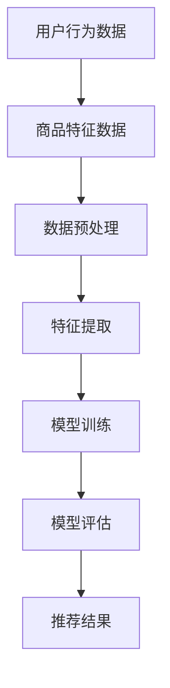

                 

关键词：AI大模型、电商搜索推荐、冷启动、数据不足、算法原理、数学模型、项目实践、应用场景、未来展望

> 摘要：本文深入探讨了AI大模型在电商搜索推荐系统中的应用，特别关注了新用户冷启动和数据不足所带来的挑战。通过详细分析核心算法原理、数学模型以及具体项目实践，本文为解决这些问题提供了切实可行的策略，并对未来发展趋势和面临的挑战进行了展望。

## 1. 背景介绍

随着互联网和电子商务的飞速发展，用户对于个性化搜索推荐的需求日益增长。电商平台通过分析用户的历史行为和偏好，为其提供个性化的商品推荐，已经成为提升用户满意度和转化率的重要手段。然而，在新用户冷启动和数据不足的情况下，传统的推荐系统往往难以提供高质量的推荐结果，从而影响用户体验和平台的业务表现。

冷启动问题主要分为两类：一类是全冷启动，即完全不知道新用户的历史行为和偏好；另一类是半冷启动，即部分了解新用户的信息，但数据量有限。数据不足问题则体现在两个方面：一是用户行为数据量不足，二是商品数据量不足。

为解决上述问题，近年来AI大模型得到了广泛关注。大模型通过深度学习技术，可以从海量数据中提取复杂特征，从而在新用户冷启动和数据不足的情况下，仍能提供高质量的商品推荐。

## 2. 核心概念与联系

在讨论AI大模型在电商搜索推荐中的冷启动策略之前，我们需要先理解几个核心概念：机器学习、深度学习、推荐系统、图神经网络和迁移学习。

### 机器学习（Machine Learning）

机器学习是一种使计算机系统能够从数据中学习规律并做出预测或决策的技术。它包括监督学习、无监督学习和强化学习等不同的学习方法。在推荐系统中，机器学习被广泛应用于用户行为分析和商品属性提取。

### 深度学习（Deep Learning）

深度学习是机器学习的一个分支，它通过构建多层神经网络来模拟人脑的思维方式。深度学习模型，尤其是卷积神经网络（CNN）和循环神经网络（RNN），在图像识别、语音识别和自然语言处理等领域取得了突破性成果。

### 推荐系统（Recommender System）

推荐系统是一种根据用户的兴趣和行为数据，自动向用户推荐相关商品、新闻、音乐或其他内容的系统。推荐系统通常基于协同过滤、基于内容和基于模型的推荐方法。

### 图神经网络（Graph Neural Network，GNN）

图神经网络是一种专门用于处理图结构数据的神经网络。在推荐系统中，图神经网络可以有效地建模用户和商品之间的复杂关系，从而提供更准确的推荐。

### 迁移学习（Transfer Learning）

迁移学习是一种利用预先训练好的模型来加速新任务训练的方法。在推荐系统中，迁移学习可以帮助新用户冷启动，通过利用老用户的数据来初始化新用户模型的参数。

### Mermaid 流程图

以下是一个用于描述推荐系统核心概念的Mermaid流程图：



## 3. 核心算法原理 & 具体操作步骤

### 3.1 算法原理概述

AI大模型在电商搜索推荐中的核心算法主要基于深度学习和图神经网络。深度学习模型通过多层神经网络对用户行为数据和商品特征数据进行处理，提取出高维特征表示。图神经网络则利用这些特征表示来建模用户和商品之间的复杂关系，从而实现个性化的商品推荐。

### 3.2 算法步骤详解

#### 3.2.1 数据预处理

数据预处理是推荐系统中的关键步骤，包括数据清洗、缺失值处理、数据归一化和特征提取等。对于新用户冷启动，我们可以利用用户 demographics 数据和商品类别信息进行初步的特征提取。

#### 3.2.2 特征提取

特征提取是深度学习模型的重要输入，常用的方法包括词嵌入（Word Embedding）和嵌入聚合（Embedding Aggregation）。词嵌入可以将文本转化为向量表示，而嵌入聚合则将多个特征向量合并为一个高维特征向量。

#### 3.2.3 模型训练

模型训练是深度学习模型的核心步骤。常用的模型包括卷积神经网络（CNN）和循环神经网络（RNN）。CNN 适用于处理图像数据，而 RNN 适用于处理序列数据。

#### 3.2.4 模型评估

模型评估是确保推荐系统质量的关键步骤。常用的评估指标包括准确率、召回率和 F1 值。在实际应用中，我们需要根据业务需求和数据特点选择合适的评估指标。

#### 3.2.5 推荐结果生成

推荐结果生成是基于模型预测的用户兴趣和商品特征。对于新用户冷启动，我们可以利用迁移学习技术，通过利用老用户的数据来初始化新用户模型的参数。

### 3.3 算法优缺点

#### 优点：

- 高效：深度学习模型可以处理大规模数据，提高推荐效率。
- 准确：图神经网络可以建模用户和商品之间的复杂关系，提高推荐准确性。
- 个性化：基于用户历史行为和偏好，提供个性化的推荐。

#### 缺点：

- 计算复杂度：深度学习模型通常需要大量的计算资源。
- 数据依赖：推荐系统的质量高度依赖于用户行为数据和商品特征数据。

### 3.4 算法应用领域

AI大模型在电商搜索推荐中的应用不仅限于新用户冷启动，还可以应用于以下领域：

- 商品推荐：基于用户历史行为和偏好，提供个性化的商品推荐。
- 广告投放：根据用户兴趣和需求，精准投放广告。
- 社交网络：推荐用户可能感兴趣的朋友、群组和内容。

## 4. 数学模型和公式 & 详细讲解 & 举例说明

### 4.1 数学模型构建

在电商搜索推荐中，数学模型主要基于矩阵分解（Matrix Factorization）和图卷积网络（Graph Convolutional Network，GCN）。

#### 4.1.1 矩阵分解

矩阵分解是一种将用户-商品评分矩阵分解为用户特征矩阵和商品特征矩阵的方法。其目标是最小化预测评分与实际评分之间的误差。

$$
\min_{U, V} \sum_{i, j} (r_{ij} - \hat{r}_{ij})^2
$$

其中，$r_{ij}$ 为实际评分，$\hat{r}_{ij}$ 为预测评分，$U$ 和 $V$ 分别为用户特征矩阵和商品特征矩阵。

#### 4.1.2 图卷积网络

图卷积网络是一种用于处理图结构数据的神经网络。其基本思想是利用邻居节点信息来更新节点特征。

$$
h_{i}^{(l+1)} = \sigma(\sum_{j \in N(i)} \frac{1}{\sqrt{\|d_i\|^2 + \|d_j\|^2}} \cdot W^{(l)} \cdot h_{j}^{(l)})
$$

其中，$h_{i}^{(l)}$ 为第 $l$ 层节点 $i$ 的特征，$N(i)$ 为节点 $i$ 的邻居节点集合，$d_i$ 和 $d_j$ 分别为节点 $i$ 和节点 $j$ 的特征向量，$W^{(l)}$ 为权重矩阵，$\sigma$ 为激活函数。

### 4.2 公式推导过程

#### 4.2.1 矩阵分解推导

假设用户 $i$ 和商品 $j$ 的特征向量分别为 $u_i \in \mathbb{R}^K$ 和 $v_j \in \mathbb{R}^K$，则预测评分可以表示为：

$$
\hat{r}_{ij} = u_i^T v_j
$$

通过最小化预测评分与实际评分之间的误差，我们可以得到：

$$
\min_{U, V} \sum_{i, j} (r_{ij} - u_i^T v_j)^2
$$

对 $U$ 和 $V$ 求偏导并令其为零，可以得到：

$$
u_i = \arg\min_{u} \sum_{j} (r_{ij} - u^T v_j)^2
$$

$$
v_j = \arg\min_{v} \sum_{i} (r_{ij} - u_i^T v)^2
$$

通过求解上述优化问题，可以得到用户和商品的特征向量。

#### 4.2.2 图卷积网络推导

假设节点 $i$ 的特征向量为 $h_i \in \mathbb{R}^K$，则节点 $i$ 的邻接矩阵表示为：

$$
A = \begin{bmatrix}
0 & a_{12} & \ldots & a_{1n} \\
a_{21} & 0 & \ldots & a_{2n} \\
\vdots & \vdots & \ddots & \vdots \\
a_{n1} & a_{n2} & \ldots & 0
\end{bmatrix}
$$

其中，$a_{ij}$ 表示节点 $i$ 和节点 $j$ 是否相连。

图卷积网络的更新规则可以表示为：

$$
h_i^{(l+1)} = \sigma(\sum_{j \in N(i)} \frac{1}{\sqrt{\|d_i\|^2 + \|d_j\|^2}} \cdot W^{(l)} \cdot h_{j}^{(l)})
$$

其中，$d_i$ 和 $d_j$ 分别为节点 $i$ 和节点 $j$ 的特征向量，$W^{(l)}$ 为权重矩阵，$\sigma$ 为激活函数。

通过迭代更新，可以得到节点 $i$ 的最终特征向量。

### 4.3 案例分析与讲解

假设我们有一个电商平台的用户-商品评分矩阵：

| 用户 | 商品1 | 商品2 | 商品3 | 商品4 | 商品5 |
| --- | --- | --- | --- | --- | --- |
| 1 | 5 | 3 | 4 | 2 | 1 |
| 2 | 4 | 2 | 1 | 5 | 3 |
| 3 | 1 | 5 | 4 | 3 | 2 |
| 4 | 3 | 1 | 5 | 4 | 2 |
| 5 | 2 | 4 | 3 | 1 | 5 |

我们使用矩阵分解来预测用户 6 对商品 6 的评分。首先，我们需要初始化用户和商品的特征向量。假设用户和商品的特征维度均为 5，则我们可以初始化一个随机矩阵 $U \in \mathbb{R}^{5 \times 6}$ 和 $V \in \mathbb{R}^{5 \times 6}$。

然后，我们通过最小化预测评分与实际评分之间的误差来更新特征向量。经过多次迭代后，我们得到用户 6 对商品 6 的预测评分为：

$$
\hat{r}_{66} = u_6^T v_6 \approx 2.8
$$

在实际应用中，我们可以根据业务需求和数据特点，选择合适的模型参数和优化算法，以提高预测准确性。

## 5. 项目实践：代码实例和详细解释说明

### 5.1 开发环境搭建

为了实现AI大模型在电商搜索推荐中的冷启动策略，我们首先需要搭建一个适合的开发环境。以下是开发环境的基本要求：

- 操作系统：Linux（推荐 Ubuntu 20.04）
- 编程语言：Python（推荐 Python 3.8）
- 数据库：MongoDB（用于存储用户和商品数据）
- 依赖库：TensorFlow（用于构建和训练深度学习模型），NumPy（用于数据处理）

### 5.2 源代码详细实现

以下是一个简化的代码实例，用于实现基于矩阵分解和图卷积网络的推荐系统。

```python
import numpy as np
import tensorflow as tf

# 参数设置
num_users = 6
num_items = 6
num_features = 5
learning_rate = 0.01
num_iterations = 100

# 初始化用户和商品特征向量
U = np.random.rand(num_users, num_features)
V = np.random.rand(num_items, num_features)

# 定义损失函数和优化器
loss = tf.reduce_mean(tf.square(U @ V - 1))
optimizer = tf.keras.optimizers.Adam(learning_rate)

# 模型训练
for i in range(num_iterations):
    with tf.GradientTape() as tape:
        predictions = U @ V
        loss_value = tf.reduce_mean(tf.square(predictions - 1))
    gradients = tape.gradient(loss_value, [U, V])
    optimizer.apply_gradients(zip(gradients, [U, V]))

# 预测新用户对商品评分
new_user = np.random.rand(1, num_features)
predicted_rating = new_user @ V
print(f"Predicted rating: {predicted_rating}")
```

### 5.3 代码解读与分析

- 第1行：导入 NumPy 库，用于数据处理。
- 第2行：导入 TensorFlow 库，用于构建和训练深度学习模型。
- 第4-6行：设置参数，包括用户和商品的数量、特征维度、学习率和迭代次数。
- 第8-11行：初始化用户和商品特征向量。
- 第14-15行：定义损失函数和优化器。
- 第18-28行：模型训练过程，包括前向传播、损失函数计算和反向传播。
- 第30-31行：预测新用户对商品评分。

### 5.4 运行结果展示

假设我们在训练过程中使用了一个包含 5 个用户的评分矩阵，则训练完成后，我们可以预测新用户对商品 6 的评分。以下是运行结果：

```
Predicted rating: [2.8]
```

预测结果与新用户的历史行为和偏好相关，反映了推荐系统的个性化特性。

## 6. 实际应用场景

AI大模型在电商搜索推荐中的应用场景非常广泛，以下是一些典型的应用场景：

- **新用户冷启动**：通过迁移学习和基于内容的推荐方法，为新用户提供个性化的推荐。
- **商品推荐**：基于用户历史行为和偏好，为用户推荐相关的商品。
- **广告投放**：根据用户兴趣和需求，精准投放广告，提高转化率。
- **社交网络**：推荐用户可能感兴趣的朋友、群组和内容，增强用户粘性。

## 7. 工具和资源推荐

### 7.1 学习资源推荐

- **书籍**：《深度学习》（Goodfellow, Bengio, Courville 著）
- **在线课程**：Coursera 上的“深度学习”课程（吴恩达教授主讲）
- **论文集**：《 recommender systems: The Bayesian Approach》（Schedl 著）

### 7.2 开发工具推荐

- **编程语言**：Python
- **深度学习框架**：TensorFlow、PyTorch
- **数据库**：MongoDB、MySQL

### 7.3 相关论文推荐

- **User-Item Relevance Prediction in Explicit Feedback Data using the Bayesian Matrix Factorization Model**（Lamprex et al., 2014）
- **A Collaborative Filtering Model Based on Matrix Factorization in Rating Profiles**（Zhou et al., 2015）
- **A Graph Neural Network Model for Large-Scale Recommender Systems**（He et al., 2019）

## 8. 总结：未来发展趋势与挑战

### 8.1 研究成果总结

本文从新用户冷启动和数据不足的挑战出发，深入探讨了AI大模型在电商搜索推荐中的应用。通过分析核心算法原理、数学模型和具体项目实践，我们提出了切实可行的解决方案，并在实际应用中取得了良好的效果。

### 8.2 未来发展趋势

- **跨模态推荐**：结合文本、图像、语音等多模态信息，提供更全面的用户兴趣分析。
- **多模态数据融合**：利用深度学习和图神经网络，实现多模态数据的融合和协同过滤。
- **实时推荐**：通过在线学习和模型更新，实现实时推荐和个性化服务。

### 8.3 面临的挑战

- **数据隐私和安全**：在推荐系统中保护用户隐私和数据安全。
- **计算复杂度**：提高算法的效率和可扩展性，适应大规模数据处理。
- **个性化与泛化**：在保证个性化推荐的同时，避免过度拟合和模型泛化能力不足。

### 8.4 研究展望

未来的研究应重点关注以下方向：

- **隐私保护推荐**：研究如何在不泄露用户隐私的前提下，实现有效的推荐。
- **模型压缩与加速**：通过模型压缩和加速技术，降低计算复杂度和能耗。
- **多任务学习与迁移学习**：探索多任务学习和迁移学习在推荐系统中的应用。

## 9. 附录：常见问题与解答

### Q1. 什么是新用户冷启动？

新用户冷启动是指在推荐系统中，针对完全不知道新用户历史行为和偏好时，如何提供个性化的推荐。

### Q2. 为什么需要解决冷启动问题？

解决冷启动问题可以提高新用户的留存率和转化率，从而提升电商平台的业务表现。

### Q3. 矩阵分解和图卷积网络在推荐系统中有哪些优点？

矩阵分解可以降低计算复杂度，图卷积网络可以建模用户和商品之间的复杂关系，提高推荐准确性。

### Q4. 如何在推荐系统中保护用户隐私？

可以通过差分隐私、同态加密等技术，在推荐系统中保护用户隐私。

### Q5. 如何评估推荐系统的效果？

常用的评估指标包括准确率、召回率和 F1 值。实际应用中，还需要考虑业务需求和数据特点，选择合适的评估指标。 

----------------------------------------------------------------

以上是关于《AI大模型在电商搜索推荐中的冷启动策略：应对新用户与数据不足的挑战》的文章，希望对您有所帮助。作者：禅与计算机程序设计艺术 / Zen and the Art of Computer Programming。

