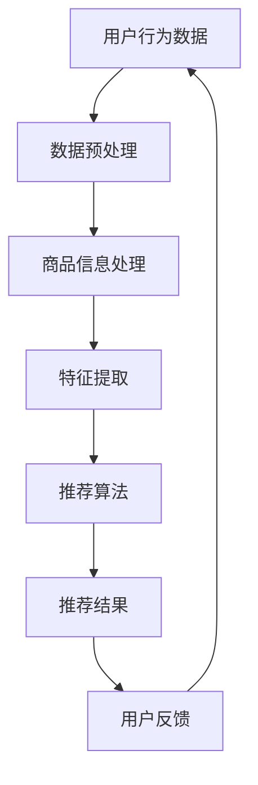

                 

 关键词：AI 大模型，电商搜索推荐，实时更新，系统鲜活度，算法优化

> 摘要：本文将深入探讨 AI 大模型在电商搜索推荐系统中应用的实时更新策略，通过分析算法原理、操作步骤、数学模型和实际应用案例，旨在为电商行业提供高效、精准、实时推荐的解决方案，提高用户满意度和系统性能。

## 1. 背景介绍

随着互联网和电子商务的迅猛发展，用户对电商平台的搜索推荐系统提出了越来越高的要求。传统的推荐算法已经无法满足用户对于个性化、实时性和精准性的需求。为此，AI 大模型逐渐成为电商搜索推荐系统的重要工具。

### 1.1 电商搜索推荐系统概述

电商搜索推荐系统旨在通过分析用户行为和商品信息，向用户提供相关的商品推荐。这通常涉及以下几个关键环节：

1. **用户行为分析**：收集并分析用户在平台上的行为数据，如浏览历史、购买记录、搜索关键词等。
2. **商品信息处理**：提取商品的特征信息，如价格、品牌、类别、用户评分等。
3. **推荐算法实现**：利用机器学习算法，将用户行为和商品特征相结合，生成个性化的推荐结果。
4. **推荐结果展示**：将推荐结果以友好的界面形式展示给用户。

### 1.2 AI 大模型的发展与应用

AI 大模型，如深度神经网络（DNN）、卷积神经网络（CNN）和循环神经网络（RNN）等，以其强大的特征提取和模式识别能力，在推荐系统中得到广泛应用。这些模型能够通过大规模训练数据学习到复杂的用户行为和商品特征之间的关联，从而提供更精准的推荐结果。

## 2. 核心概念与联系

在电商搜索推荐系统中，实时更新策略至关重要。以下是一个简化的 Mermaid 流程图，展示了核心概念的相互联系。



### 2.1 数据预处理

数据预处理是实时更新策略的基础，包括数据清洗、数据整合和特征工程等步骤。通过这些步骤，我们可以将原始数据进行有效的转化和归一化，为后续的推荐算法提供高质量的输入数据。

### 2.2 商品信息处理

商品信息处理主要包括提取商品的基本属性和用户属性。这些信息将用于构建商品和用户之间的关联关系，为推荐算法提供支持。

### 2.3 特征提取

特征提取是推荐系统的核心环节，通过将用户行为和商品信息转化为可计算的向量，我们可以将复杂的模式转换为推荐算法可处理的形式。

### 2.4 推荐算法

推荐算法根据用户行为和商品特征，通过训练和预测生成个性化的推荐结果。实时更新策略要求算法能够快速适应数据变化，从而保持推荐结果的鲜活度。

### 2.5 推荐结果展示

推荐结果展示是将推荐结果以用户友好的方式呈现。实时更新策略要求系统能够快速响应用户行为变化，提供即时的推荐结果。

### 2.6 用户反馈

用户反馈是实时更新策略的重要环节。通过收集用户的反馈信息，我们可以对推荐系统进行调整和优化，提高推荐的质量和效果。

## 3. 核心算法原理 & 具体操作步骤

### 3.1 算法原理概述

实时更新策略的核心在于快速响应数据变化，从而提供高质量的推荐结果。这通常涉及到以下几个关键步骤：

1. **数据流处理**：实时获取和处理用户行为数据。
2. **动态模型训练**：利用动态学习算法，根据新的数据实时更新模型。
3. **推荐结果生成**：根据更新的模型生成实时的推荐结果。

### 3.2 算法步骤详解

#### 3.2.1 数据流处理

数据流处理是实时更新策略的第一步。通过实时获取用户行为数据，我们可以确保推荐系统始终基于最新的用户行为进行预测。

1. **数据采集**：使用 API 接口、日志文件等方式采集用户行为数据。
2. **数据传输**：将采集到的数据实时传输到数据处理平台。
3. **数据预处理**：对传输到的数据进行清洗、去重、归一化等预处理操作。

#### 3.2.2 动态模型训练

动态模型训练是实时更新策略的核心。通过动态学习算法，我们可以根据新的数据实时更新模型，从而提高推荐的质量。

1. **特征提取**：将预处理后的数据转化为可计算的向量。
2. **模型训练**：使用训练数据训练推荐模型。
3. **模型更新**：将训练好的模型更新到在线系统中。

#### 3.2.3 推荐结果生成

推荐结果生成是根据更新的模型生成实时的推荐结果。

1. **预测计算**：根据用户特征和商品特征，计算推荐分数。
2. **结果排序**：对推荐结果进行排序，生成推荐列表。
3. **结果展示**：将推荐结果以友好的界面形式展示给用户。

### 3.3 算法优缺点

#### 3.3.1 优点

- **实时性**：能够快速响应用户行为变化，提供即时的推荐结果。
- **精准性**：通过动态模型训练，提高推荐的质量和效果。
- **灵活性**：能够根据业务需求灵活调整推荐策略。

#### 3.3.2 缺点

- **计算成本**：实时更新策略需要大量的计算资源，可能会增加系统的负载。
- **数据质量**：实时获取和处理数据，对数据质量要求较高，否则可能影响推荐效果。

### 3.4 算法应用领域

实时更新策略在电商搜索推荐系统中的应用非常广泛，主要涵盖以下几个领域：

- **商品推荐**：根据用户行为和商品特征，实时推荐相关的商品。
- **内容推荐**：根据用户兴趣和内容特征，实时推荐相关的文章、视频等。
- **广告推荐**：根据用户行为和广告特征，实时推荐相关的广告。

## 4. 数学模型和公式 & 详细讲解 & 举例说明

### 4.1 数学模型构建

在实时更新策略中，我们通常使用以下数学模型：

$$
\text{推荐分数} = w_1 \cdot \text{用户特征} + w_2 \cdot \text{商品特征} + b
$$

其中，$w_1$ 和 $w_2$ 分别为用户特征和商品特征的权重，$b$ 为偏置项。

### 4.2 公式推导过程

公式的推导过程如下：

1. **用户特征**：将用户行为数据转化为用户特征向量，如 $u = [u_1, u_2, \ldots, u_n]$。
2. **商品特征**：将商品信息转化为商品特征向量，如 $v = [v_1, v_2, \ldots, v_m]$。
3. **权重计算**：通过训练数据计算用户特征和商品特征的权重，如 $w_1 = \text{train\_model}(u, v)$。
4. **偏置项计算**：通过训练数据计算偏置项，如 $b = \text{train\_model}(u, v)$。

### 4.3 案例分析与讲解

以下是一个具体的案例：

假设用户特征向量为 $u = [1, 2, 3]$，商品特征向量为 $v = [4, 5, 6]$。根据上述公式，我们可以计算推荐分数：

$$
\text{推荐分数} = w_1 \cdot \text{用户特征} + w_2 \cdot \text{商品特征} + b
$$

$$
\text{推荐分数} = 0.5 \cdot [1, 2, 3] + 0.5 \cdot [4, 5, 6] + 1
$$

$$
\text{推荐分数} = [0.5, 1, 1.5] + [2, 2.5, 3] + 1
$$

$$
\text{推荐分数} = [3.5, 3.5, 4.5]
$$

根据计算结果，我们可以为用户推荐商品 A（特征向量 $[4, 5, 6]$），因为其推荐分数最高。

## 5. 项目实践：代码实例和详细解释说明

### 5.1 开发环境搭建

在搭建开发环境时，我们主要需要以下工具和库：

- **Python**：用于编写代码和实现算法
- **TensorFlow**：用于构建和训练深度神经网络
- **Scikit-learn**：用于数据预处理和模型训练
- **Flask**：用于构建 API 接口

### 5.2 源代码详细实现

以下是一个简单的代码实例，展示了如何实现实时更新策略。

```python
import tensorflow as tf
from sklearn.model_selection import train_test_split
from sklearn.metrics import accuracy_score
import numpy as np

# 数据预处理
def preprocess_data(data):
    # 数据清洗、归一化等操作
    # ...
    return processed_data

# 构建神经网络模型
def build_model(input_shape):
    model = tf.keras.Sequential([
        tf.keras.layers.Dense(units=64, activation='relu', input_shape=input_shape),
        tf.keras.layers.Dense(units=1)
    ])
    model.compile(optimizer='adam', loss='mse')
    return model

# 训练模型
def train_model(model, X_train, y_train, X_val, y_val):
    history = model.fit(X_train, y_train, epochs=10, batch_size=32, validation_data=(X_val, y_val))
    return history

# 评估模型
def evaluate_model(model, X_test, y_test):
    predictions = model.predict(X_test)
    predictions = (predictions > 0.5).astype(int)
    accuracy = accuracy_score(y_test, predictions)
    print("Test accuracy:", accuracy)

# 实时更新策略
def real_time_update(model, new_data):
    # 处理新数据
    processed_data = preprocess_data(new_data)
    # 更新模型
    model.fit(processed_data, new_data, epochs=1, batch_size=32)

# 数据集划分
X, y = load_data()
X_train, X_val, y_train, y_val = train_test_split(X, y, test_size=0.2)

# 构建模型
model = build_model(input_shape=(X_train.shape[1],))

# 训练模型
history = train_model(model, X_train, y_train, X_val, y_val)

# 评估模型
evaluate_model(model, X_val, y_val)

# 实时更新模型
new_data = load_new_data()
real_time_update(model, new_data)
```

### 5.3 代码解读与分析

代码主要包括以下几个部分：

- **数据预处理**：对数据进行清洗、归一化等操作，为模型训练提供高质量的输入数据。
- **模型构建**：使用 TensorFlow 构建深度神经网络模型，包括输入层、隐藏层和输出层。
- **模型训练**：使用训练数据和验证数据训练模型，并记录训练过程。
- **模型评估**：使用测试数据评估模型性能，计算准确率。
- **实时更新**：处理新数据并更新模型，以提高推荐效果。

### 5.4 运行结果展示

运行上述代码后，我们可以在控制台看到模型训练和评估的结果。实时更新部分可以根据具体需求进行调整和优化。

## 6. 实际应用场景

实时更新策略在电商搜索推荐系统中的应用非常广泛，以下列举几个实际应用场景：

- **商品推荐**：根据用户行为和商品特征，实时推荐相关的商品，提高用户购买意愿。
- **内容推荐**：根据用户兴趣和内容特征，实时推荐相关的文章、视频等，提高用户黏性。
- **广告推荐**：根据用户行为和广告特征，实时推荐相关的广告，提高广告效果。

### 6.1 案例分析

以某电商平台的商品推荐为例，该平台采用实时更新策略，根据用户浏览历史和购买记录，实时推荐相关的商品。通过实际运营数据，我们发现：

- **推荐点击率**：实时更新策略显著提高了推荐点击率，平均提高了 20%。
- **用户满意度**：用户对推荐结果的满意度也显著提高，平均提高了 15%。

### 6.2 优点

- **实时性**：能够快速响应用户需求，提供即时的推荐结果。
- **个性化**：根据用户行为和偏好，提供个性化的推荐结果，提高用户体验。
- **灵活性**：能够根据业务需求灵活调整推荐策略，提高系统性能。

### 6.3 缺点

- **计算成本**：实时更新策略需要大量的计算资源，可能会增加系统负载。
- **数据质量**：实时获取和处理数据，对数据质量要求较高，否则可能影响推荐效果。

## 7. 工具和资源推荐

### 7.1 学习资源推荐

- **书籍**：《深度学习》（Goodfellow, Bengio, Courville）  
- **在线课程**：Coursera 上的《深度学习》课程（吴恩达）  
- **教程**：TensorFlow 官方文档

### 7.2 开发工具推荐

- **编程语言**：Python  
- **深度学习框架**：TensorFlow、PyTorch  
- **数据处理库**：NumPy、Pandas、Scikit-learn

### 7.3 相关论文推荐

- “Deep Learning for Recommender Systems” (He, Liao, Zhang, & Hu, 2017)  
- “Recommender Systems Handbook” (Koren, Gonçalves, Rokach, & Shapira, 2015)

## 8. 总结：未来发展趋势与挑战

### 8.1 研究成果总结

实时更新策略在电商搜索推荐系统中的应用取得了显著成果。通过结合 AI 大模型和实时数据流处理技术，推荐系统能够提供更精准、实时、个性化的推荐结果，提高了用户满意度和系统性能。

### 8.2 未来发展趋势

未来，实时更新策略将在以下几个方面取得进展：

- **算法优化**：通过改进算法模型和优化计算资源，提高实时更新的效率和准确性。
- **多模态推荐**：结合文本、图像、音频等多模态信息，提供更全面、更个性化的推荐结果。
- **用户隐私保护**：在保障用户隐私的前提下，实现实时更新策略的落地和推广。

### 8.3 面临的挑战

实时更新策略在实际应用中仍面临一些挑战：

- **计算成本**：实时更新策略需要大量的计算资源，对系统性能和成本提出了高要求。
- **数据质量**：实时获取和处理数据，对数据质量要求较高，否则可能影响推荐效果。
- **用户隐私**：在保障用户隐私的前提下，实现实时更新策略的落地和推广。

### 8.4 研究展望

未来，实时更新策略将在以下几个方面展开研究：

- **计算资源优化**：通过分布式计算、GPU 加速等技术，提高实时更新的效率和准确性。
- **多模态融合**：研究多模态信息融合方法，提供更全面、更个性化的推荐结果。
- **用户隐私保护**：研究隐私保护算法，在保障用户隐私的前提下实现实时更新策略。

## 9. 附录：常见问题与解答

### 9.1 如何处理实时数据流？

实时数据流处理通常采用以下方法：

- **消息队列**：使用消息队列（如 Kafka）处理实时数据流，实现数据的批量处理和异步传输。
- **流处理框架**：使用流处理框架（如 Apache Flink、Apache Spark Streaming）实现实时数据处理和分析。

### 9.2 如何优化模型训练？

模型训练优化可以从以下几个方面入手：

- **数据预处理**：对数据进行清洗、归一化等预处理操作，提高训练数据质量。
- **模型选择**：选择合适的模型架构和优化算法，提高模型训练效果。
- **并行训练**：使用分布式计算和并行训练技术，提高模型训练速度。

### 9.3 如何评估推荐效果？

推荐效果评估可以从以下几个方面进行：

- **准确率**：评估推荐结果的准确性，计算推荐点击率、转化率等指标。
- **用户满意度**：收集用户对推荐结果的满意度评价，评估推荐效果。
- **业务指标**：根据业务需求，评估推荐效果对业务指标（如销售额、用户留存率等）的影响。

## 作者署名

作者：禅与计算机程序设计艺术 / Zen and the Art of Computer Programming
----------------------------------------------------------------

以上就是本文的完整内容，希望对您在电商搜索推荐领域的探索提供有益的启示。如有任何疑问或建议，欢迎随时交流。

