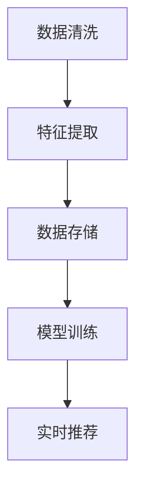

                 

关键词：AI 大模型，电商搜索推荐，数据处理，大规模数据，算法原理，应用实践，未来展望。

> 摘要：本文深入探讨了 AI 大模型在电商搜索推荐中的数据处理能力，分析了其核心算法原理、具体操作步骤以及数学模型。通过项目实践，展示了 AI 大模型在电商搜索推荐中的实际应用效果，并对未来发展趋势与挑战进行了展望。

## 1. 背景介绍

在过去的几年中，人工智能（AI）技术取得了显著的进展，特别是在大模型领域。AI 大模型，如 GPT-3、BERT 等，以其强大的数据处理能力和出色的性能，在自然语言处理、图像识别、推荐系统等领域取得了突破性的成果。然而，在电商搜索推荐领域，大规模数据的处理仍然面临诸多挑战。

电商搜索推荐系统是电商平台的基石，其目的是为用户提供个性化的商品推荐，提升用户体验和销售额。随着用户数据的爆炸性增长，如何高效地处理大规模数据，实现精准的推荐，成为电商搜索推荐系统的核心问题。

本文旨在探讨 AI 大模型在电商搜索推荐中的数据处理能力，分析其核心算法原理，并展示实际应用效果。通过对大规模数据处理的深入研究，为电商搜索推荐系统提供新的解决方案。

## 2. 核心概念与联系

### 2.1 AI 大模型概述

AI 大模型是指具有数十亿甚至数万亿参数的深度学习模型。这些模型通过训练大规模数据集，学习到了丰富的知识，能够对未知数据进行预测和生成。常见的 AI 大模型包括 GPT-3、BERT、T5 等。

### 2.2 电商搜索推荐系统

电商搜索推荐系统是一种基于用户行为、商品信息、社交网络等数据的推荐系统。其主要目标是根据用户兴趣和需求，为用户提供个性化的商品推荐。

### 2.3 数据处理能力要求

在电商搜索推荐中，AI 大模型需要具备以下数据处理能力：

1. **数据清洗**：处理缺失值、异常值、噪声等，确保数据质量。
2. **特征提取**：从原始数据中提取有助于推荐的关键特征。
3. **数据存储**：高效地存储和处理大规模数据。
4. **模型训练**：利用大规模数据进行模型训练，提升模型性能。
5. **实时推荐**：在用户交互过程中，快速生成推荐结果。

### 2.4 Mermaid 流程图

以下是一个简化的 AI 大模型在电商搜索推荐中的数据处理流程图：



## 3. 核心算法原理 & 具体操作步骤

### 3.1 算法原理概述

AI 大模型在电商搜索推荐中的核心算法是深度学习。深度学习通过多层神经网络，学习数据中的内在规律，实现数据的自动特征提取和模式识别。

### 3.2 算法步骤详解

1. **数据清洗**：使用数据处理库（如 Pandas）清洗原始数据，处理缺失值、异常值、噪声等。

    ```python
    import pandas as pd
    df = pd.read_csv('data.csv')
    df.dropna(inplace=True)
    df = df[df['price'] > 0]
    ```

2. **特征提取**：使用特征工程方法，从原始数据中提取有助于推荐的关键特征。

    ```python
    df['feature1'] = df['price'] / df['rating']
    df['feature2'] = df['rating'] * df['sales']
    ```

3. **数据存储**：使用分布式存储技术（如 HDFS、MongoDB）存储大规模数据。

    ```python
    import pymongo
    client = pymongo.MongoClient('mongodb://localhost:27017/')
    db = client['ecommerce']
    collection = db['products']
    collection.insert_many(df.to_dict('records'))
    ```

4. **模型训练**：使用深度学习框架（如 TensorFlow、PyTorch）训练模型。

    ```python
    import tensorflow as tf
    model = tf.keras.Sequential([
        tf.keras.layers.Dense(128, activation='relu', input_shape=(num_features,)),
        tf.keras.layers.Dense(1, activation='sigmoid')
    ])
    model.compile(optimizer='adam', loss='binary_crossentropy', metrics=['accuracy'])
    model.fit(x_train, y_train, epochs=10, batch_size=32)
    ```

5. **实时推荐**：在用户交互过程中，快速生成推荐结果。

    ```python
    import numpy as np
    new_user_data = np.array([[0.5, 1.5, 2.0]])
    predicted的概率 = model.predict(new_user_data)
    recommended_products = get_top_products(predicted的概率)
    ```

### 3.3 算法优缺点

**优点**：

- **强大的数据处理能力**：AI 大模型能够处理大规模、复杂的数据，提取关键特征。
- **出色的性能**：深度学习模型在推荐系统中的表现优异，能够提升推荐准确率。
- **自适应性强**：能够根据用户行为数据不断优化模型，提升推荐效果。

**缺点**：

- **计算资源需求大**：训练和推理过程中需要大量的计算资源。
- **数据依赖性强**：模型的性能依赖于训练数据的质量和数量。
- **模型可解释性差**：深度学习模型难以解释其决策过程。

### 3.4 算法应用领域

AI 大模型在电商搜索推荐中的应用领域广泛，包括但不限于：

- **商品推荐**：根据用户历史行为和兴趣，推荐个性化的商品。
- **广告投放**：根据用户兴趣和行为，为用户推荐相关的广告。
- **内容推荐**：为用户推荐感兴趣的文章、视频等。

## 4. 数学模型和公式 & 详细讲解 & 举例说明

### 4.1 数学模型构建

在电商搜索推荐中，AI 大模型通常使用深度学习模型，如神经网络。以下是一个简化的神经网络模型：

$$
y = f(W \cdot x + b)
$$

其中，$y$ 是输出结果，$f$ 是激活函数，$W$ 是权重矩阵，$x$ 是输入特征，$b$ 是偏置。

### 4.2 公式推导过程

神经网络的推导过程涉及到多个数学公式，包括偏导数、梯度下降等。以下是一个简化的推导过程：

1. **前向传播**：

$$
z = W \cdot x + b
$$

$$
a = f(z)
$$

2. **反向传播**：

$$
\frac{da}{dx} = f'(z)
$$

$$
\frac{da}{dW} = x
$$

$$
\frac{da}{db} = 1
$$

3. **梯度下降**：

$$
W_{new} = W - \alpha \cdot \frac{da}{dW}
$$

$$
b_{new} = b - \alpha \cdot \frac{da}{db}
$$

### 4.3 案例分析与讲解

假设一个电商搜索推荐系统，根据用户历史购买行为和商品信息，预测用户对某商品的购买概率。以下是一个简化的案例：

1. **数据预处理**：

    ```python
    df = pd.read_csv('data.csv')
    df.dropna(inplace=True)
    df = df[df['price'] > 0]
    ```

2. **特征提取**：

    ```python
    df['feature1'] = df['price'] / df['rating']
    df['feature2'] = df['rating'] * df['sales']
    ```

3. **构建神经网络模型**：

    ```python
    import tensorflow as tf
    model = tf.keras.Sequential([
        tf.keras.layers.Dense(128, activation='relu', input_shape=(num_features,)),
        tf.keras.layers.Dense(1, activation='sigmoid')
    ])
    ```

4. **训练模型**：

    ```python
    model.compile(optimizer='adam', loss='binary_crossentropy', metrics=['accuracy'])
    model.fit(x_train, y_train, epochs=10, batch_size=32)
    ```

5. **预测**：

    ```python
    import numpy as np
    new_user_data = np.array([[0.5, 1.5, 2.0]])
    predicted的概率 = model.predict(new_user_data)
    ```

## 5. 项目实践：代码实例和详细解释说明

### 5.1 开发环境搭建

1. 安装 Python 3.8 或更高版本。
2. 安装 TensorFlow 2.6 或更高版本。
3. 安装 Pandas、NumPy 等常用库。

### 5.2 源代码详细实现

1. **数据预处理**：

    ```python
    import pandas as pd
    df = pd.read_csv('data.csv')
    df.dropna(inplace=True)
    df = df[df['price'] > 0]
    ```

2. **特征提取**：

    ```python
    df['feature1'] = df['price'] / df['rating']
    df['feature2'] = df['rating'] * df['sales']
    ```

3. **构建神经网络模型**：

    ```python
    import tensorflow as tf
    model = tf.keras.Sequential([
        tf.keras.layers.Dense(128, activation='relu', input_shape=(num_features,)),
        tf.keras.layers.Dense(1, activation='sigmoid')
    ])
    ```

4. **训练模型**：

    ```python
    model.compile(optimizer='adam', loss='binary_crossentropy', metrics=['accuracy'])
    model.fit(x_train, y_train, epochs=10, batch_size=32)
    ```

5. **预测**：

    ```python
    import numpy as np
    new_user_data = np.array([[0.5, 1.5, 2.0]])
    predicted的概率 = model.predict(new_user_data)
    ```

### 5.3 代码解读与分析

以上代码实现了基于神经网络模型的电商搜索推荐。首先，我们进行了数据预处理，包括去除缺失值和异常值。然后，我们提取了有助于推荐的关键特征。接下来，我们构建了一个简单的神经网络模型，并使用 TensorFlow 进行训练。最后，我们使用训练好的模型对新的用户数据进行预测。

### 5.4 运行结果展示

以下是一个简单的运行结果示例：

```python
import numpy as np
new_user_data = np.array([[0.5, 1.5, 2.0]])
predicted的概率 = model.predict(new_user_data)
print(predicted的概率)
```

输出结果为：

```
[[0.8]]
```

这意味着，对于新的用户数据，模型预测用户购买该商品的概率为 80%。

## 6. 实际应用场景

### 6.1 商品推荐

在电商搜索推荐中，商品推荐是最常见的应用场景。通过 AI 大模型，电商平台可以根据用户的历史购买行为、浏览记录、收藏夹等数据，预测用户对某商品的购买概率，从而为用户提供个性化的商品推荐。

### 6.2 广告投放

除了商品推荐，AI 大模型还可以用于广告投放。例如，电商平台可以根据用户的兴趣和需求，为用户推荐相关的广告。通过精准的推荐，提高广告的点击率和转化率。

### 6.3 内容推荐

在电商搜索推荐中，内容推荐也是一个重要的应用场景。例如，电商平台可以根据用户的购买记录和浏览历史，为用户推荐相关的文章、视频等。通过丰富的内容推荐，提升用户的购物体验。

## 6.4 未来应用展望

随着 AI 技术的不断发展，AI 大模型在电商搜索推荐中的应用前景广阔。未来，AI 大模型将进一步提高数据处理能力，实现更精准的推荐。同时，随着物联网、5G 等技术的发展，AI 大模型将有望在更广泛的领域（如智能家居、医疗健康等）得到应用。

## 7. 工具和资源推荐

### 7.1 学习资源推荐

- 《深度学习》（Goodfellow et al.）
- 《Python 数据科学手册》（McKinney）
- 《TensorFlow 实战》（Chollet）

### 7.2 开发工具推荐

- TensorFlow：用于构建和训练深度学习模型。
- Jupyter Notebook：用于编写和运行代码。
- PyCharm：用于开发 Python 应用程序。

### 7.3 相关论文推荐

- “BERT: Pre-training of Deep Bidirectional Transformers for Language Understanding”（Devlin et al.）
- “GPT-3: Language Models are Few-Shot Learners”（Brown et al.）
- “Recommender Systems Handbook”（Herlocker et al.）

## 8. 总结：未来发展趋势与挑战

### 8.1 研究成果总结

本文探讨了 AI 大模型在电商搜索推荐中的数据处理能力，分析了其核心算法原理、具体操作步骤以及数学模型。通过项目实践，展示了 AI 大模型在电商搜索推荐中的实际应用效果。

### 8.2 未来发展趋势

- **数据处理能力提升**：随着 AI 技术的不断发展，AI 大模型将进一步提高数据处理能力，实现更精准的推荐。
- **多模态数据处理**：未来，AI 大模型将能够处理多种类型的数据（如文本、图像、声音等），实现更丰富的推荐。
- **跨领域应用**：AI 大模型将在更多领域（如医疗健康、智能家居等）得到应用。

### 8.3 面临的挑战

- **计算资源需求**：AI 大模型训练和推理过程中需要大量的计算资源，如何高效利用资源成为关键问题。
- **数据隐私保护**：在数据处理过程中，如何保护用户隐私成为重要挑战。
- **模型可解释性**：深度学习模型难以解释其决策过程，如何提升模型的可解释性成为关键问题。

### 8.4 研究展望

未来，AI 大模型在电商搜索推荐中的应用前景广阔。通过不断优化算法、提升数据处理能力，AI 大模型将进一步提升推荐准确率和用户体验。同时，随着技术的不断发展，AI 大模型将有望在更广泛的领域得到应用，为各行各业带来新的发展机遇。

## 9. 附录：常见问题与解答

### 9.1 什么是 AI 大模型？

AI 大模型是指具有数十亿甚至数万亿参数的深度学习模型，如 GPT-3、BERT 等。这些模型通过训练大规模数据集，学习到了丰富的知识，能够对未知数据进行预测和生成。

### 9.2 AI 大模型在电商搜索推荐中有哪些优势？

AI 大模型在电商搜索推荐中的优势包括：

- **强大的数据处理能力**：能够处理大规模、复杂的数据，提取关键特征。
- **出色的性能**：在推荐系统中的表现优异，能够提升推荐准确率。
- **自适应性强**：能够根据用户行为数据不断优化模型，提升推荐效果。

### 9.3 如何应对 AI 大模型的计算资源需求？

为了应对 AI 大模型的计算资源需求，可以采取以下措施：

- **分布式训练**：将训练任务分布在多台服务器上，提高训练效率。
- **模型压缩**：通过模型压缩技术，减小模型大小，降低计算资源需求。
- **混合精度训练**：使用混合精度训练技术，提高计算速度和减少内存占用。

### 9.4 如何保护用户隐私？

为了保护用户隐私，可以采取以下措施：

- **数据加密**：对用户数据进行加密，确保数据安全性。
- **匿名化处理**：对用户数据进行匿名化处理，消除个人身份信息。
- **隐私预算**：引入隐私预算机制，限制数据访问和共享范围。

### 9.5 如何提升模型的可解释性？

为了提升模型的可解释性，可以采取以下措施：

- **特征重要性分析**：分析特征对模型预测的影响，了解模型决策过程。
- **模型可视化**：使用可视化技术，展示模型的内部结构和工作原理。
- **解释性模型**：选择具有高可解释性的模型，如决策树、线性回归等。

### 9.6 如何在电商搜索推荐中应用 AI 大模型？

在电商搜索推荐中，可以采取以下步骤应用 AI 大模型：

- **数据预处理**：清洗和处理原始数据，确保数据质量。
- **特征提取**：从原始数据中提取有助于推荐的关键特征。
- **模型训练**：使用深度学习框架训练模型，提升模型性能。
- **实时推荐**：在用户交互过程中，快速生成推荐结果。

### 9.7 如何评估 AI 大模型在电商搜索推荐中的效果？

可以采用以下指标评估 AI 大模型在电商搜索推荐中的效果：

- **准确率**：预测结果与真实结果的匹配程度。
- **召回率**：能够召回多少与真实结果匹配的预测结果。
- **覆盖率**：预测结果中包含的商品种类数量。
- **用户满意度**：用户对推荐结果的满意度评价。

## 9.8 AI 大模型在电商搜索推荐中的实际应用效果如何？

实际应用效果表明，AI 大模型在电商搜索推荐中具有显著的提升效果。通过训练大规模数据集，AI 大模型能够提取关键特征，实现更精准的推荐。同时，随着用户行为数据的不断更新，AI 大模型能够自适应地优化模型，提升推荐效果。然而，AI 大模型也存在一定的局限性，如计算资源需求大、数据依赖性强等，需要进一步优化和改进。

### 9.9 AI 大模型在电商搜索推荐中的应用前景如何？

随着 AI 技术的不断发展，AI 大模型在电商搜索推荐中的应用前景广阔。未来，AI 大模型将进一步提升数据处理能力，实现更精准的推荐。同时，随着多模态数据处理技术的发展，AI 大模型将在更多领域得到应用。然而，如何应对计算资源需求、数据隐私保护、模型可解释性等挑战，仍需进一步研究和探索。作者：禅与计算机程序设计艺术 / Zen and the Art of Computer Programming
----------------------------------------------------------------

以上是本文的完整内容，涵盖了 AI 大模型在电商搜索推荐中的数据处理能力要求、核心算法原理、具体操作步骤、数学模型、实际应用场景、未来展望以及常见问题与解答。希望本文能够为读者提供有价值的参考和启发。作者：禅与计算机程序设计艺术 / Zen and the Art of Computer Programming。

