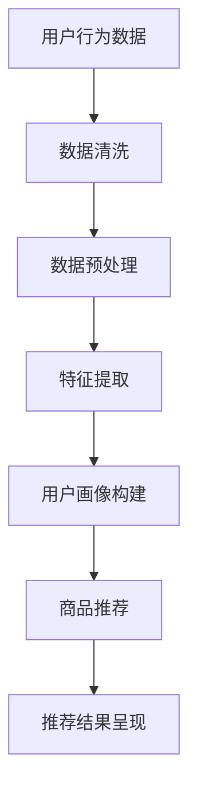

                 

关键词：人工智能、用户画像、电商推荐系统、深度学习、大数据分析、消费者行为研究

摘要：随着互联网和电子商务的迅猛发展，电商搜索推荐系统已成为提高用户体验、增加销售额的重要手段。本文旨在探讨人工智能大模型在电商搜索推荐系统中用户画像的应用，通过对用户需求和行为偏好的深度挖掘，实现精准推荐。本文首先介绍了电商搜索推荐系统的基本概念和原理，随后详细阐述了用户画像的核心概念、构建方法以及大模型在其中的应用。最后，本文通过具体案例和代码实例，展示了用户画像在实际电商搜索推荐系统中的应用效果，并对未来应用前景进行了展望。

## 1. 背景介绍

在数字化时代，用户对电子商务平台的依赖度日益增加。据统计，全球电商市场规模在2022年已突破5万亿美元，预计在未来几年内仍将保持快速增长。这一趋势使得电商企业越来越注重提升用户体验，以增加用户粘性和销售额。而电商搜索推荐系统正是实现这一目标的重要手段之一。

### 1.1 电商搜索推荐系统的重要性

电商搜索推荐系统具有以下几个重要作用：

1. **提高用户满意度**：通过个性化推荐，满足用户的个性化需求，提升用户满意度。
2. **增加销售额**：通过精准推荐，引导用户购买更多商品，提高销售额。
3. **优化运营成本**：通过减少无效广告和促销活动，降低运营成本。
4. **增强用户忠诚度**：通过持续提供个性化服务，增强用户对平台的忠诚度。

### 1.2 电商搜索推荐系统的发展历程

电商搜索推荐系统经历了从基于规则推荐到基于协同过滤推荐，再到基于内容的推荐，最后发展到基于深度学习的个性化推荐系统。近年来，随着人工智能技术的不断发展，大模型在电商推荐系统中的应用越来越广泛。

### 1.3 大模型在电商推荐系统中的应用

大模型在电商推荐系统中主要用于以下两个方面：

1. **用户画像构建**：通过分析用户的历史行为数据，构建用户画像，实现个性化推荐。
2. **商品推荐**：基于用户画像，对商品进行分类、标签化，实现精准推荐。

## 2. 核心概念与联系

### 2.1 用户画像

用户画像是指通过对用户在互联网上的行为数据进行分析，构建出的用户特征模型。它包括用户的年龄、性别、地理位置、兴趣爱好、消费习惯等多维度信息。

### 2.2 电商搜索推荐系统

电商搜索推荐系统是指通过分析用户的历史行为数据、商品信息等，为用户提供个性化推荐服务。它主要包括三个核心组成部分：用户画像、商品推荐算法和推荐结果呈现。

### 2.3 大模型与用户画像

大模型是指具有大规模参数、能够处理海量数据的深度学习模型。在用户画像构建中，大模型可以高效地处理用户行为数据，提取用户特征，实现用户画像的自动化构建。

### 2.4 Mermaid 流程图

下面是一个简单的 Mermaid 流程图，展示了电商搜索推荐系统中用户画像的构建过程：



## 3. 核心算法原理 & 具体操作步骤

### 3.1 算法原理概述

用户画像构建的核心算法主要包括数据预处理、特征提取和用户画像构建。其中，数据预处理和特征提取是基础，用户画像构建是关键。

### 3.2 算法步骤详解

1. **数据预处理**：包括数据清洗、数据去重、数据标准化等步骤，目的是消除噪声数据，保证数据质量。
2. **特征提取**：包括基于统计学的特征提取和基于深度学习的特征提取。基于统计学的特征提取方法如TF-IDF、Word2Vec等，基于深度学习的特征提取方法如BERT、GPT等。
3. **用户画像构建**：通过对用户历史行为数据进行分析，提取用户特征，构建用户画像。用户画像可以是向量表示，也可以是图结构表示。

### 3.3 算法优缺点

**优点**：

1. **自动化构建**：大模型可以自动从海量数据中提取用户特征，实现用户画像的自动化构建。
2. **高效处理**：大模型具有大规模参数，可以高效地处理海量数据。
3. **个性化推荐**：基于用户画像的推荐可以实现个性化，提高用户满意度。

**缺点**：

1. **数据依赖性**：用户画像构建依赖于用户行为数据，数据质量直接影响用户画像的准确性。
2. **模型训练成本**：大模型训练成本高，需要大量计算资源和时间。

### 3.4 算法应用领域

用户画像构建算法广泛应用于电商搜索推荐系统、社交网络推荐系统、广告推荐系统等领域。

## 4. 数学模型和公式 & 详细讲解 & 举例说明

### 4.1 数学模型构建

用户画像构建的数学模型主要包括用户行为数据预处理、特征提取和用户画像构建。

#### 4.1.1 用户行为数据预处理

假设用户行为数据为$X=\{x_1, x_2, ..., x_n\}$，其中$x_i$表示第$i$个用户的行为数据。数据预处理主要包括以下步骤：

1. **数据清洗**：消除噪声数据，如缺失值、异常值等。
2. **数据去重**：去除重复数据，保证数据唯一性。
3. **数据标准化**：对数据进行归一化或标准化处理，消除不同特征之间的量纲影响。

#### 4.1.2 特征提取

特征提取是将用户行为数据转化为用户特征的过程。常见的特征提取方法包括：

1. **TF-IDF**：将用户行为数据表示为词向量，计算词频和逆文档频率，得到特征向量。
2. **Word2Vec**：利用神经网络模型将用户行为数据转化为词向量，得到特征向量。
3. **BERT**：利用预训练的BERT模型提取用户行为数据的语义特征，得到特征向量。

#### 4.1.3 用户画像构建

用户画像构建是将用户特征表示为一个向量或图结构的过程。常见的用户画像构建方法包括：

1. **向量表示**：将用户特征表示为一个高维向量，如$u_i=\{u_{i1}, u_{i2}, ..., u_{id}\}$，其中$u_{id}$表示用户在特征$d$上的取值。
2. **图结构表示**：将用户特征表示为一个图结构，如用户-行为图，其中节点表示用户和行为，边表示用户和行为之间的关联关系。

### 4.2 公式推导过程

假设用户行为数据为$X=\{x_1, x_2, ..., x_n\}$，其中$x_i$表示第$i$个用户的行为数据。首先，对数据进行预处理：

$$
X_{\text{clean}} = \{x_{i, \text{clean}}\} = \{x_{i1}, x_{i2}, ..., x_{id}\}
$$

其中，$x_{i, \text{clean}}$表示经过数据清洗和去重后的用户行为数据。

然后，对数据预处理后的用户行为数据进行特征提取：

$$
F = \{f_1, f_2, ..., f_k\}
$$

其中，$f_j$表示第$j$个特征提取方法，如TF-IDF、Word2Vec等。

接下来，将特征提取后的用户特征表示为一个向量：

$$
u_i = \{u_{i1}, u_{i2}, ..., u_{id}\}
$$

其中，$u_{id}$表示用户在特征$d$上的取值。

最后，将用户特征表示为图结构：

$$
G = (V, E)
$$

其中，$V$表示用户和行为节点集合，$E$表示用户和行为节点之间的边集合。

### 4.3 案例分析与讲解

以某电商平台为例，分析用户画像构建的过程。

#### 4.3.1 数据预处理

假设某电商平台有1000万用户，每个用户在最近一个月内购买了10件商品。用户行为数据包括购买时间、商品ID、商品类别、商品价格等。

首先，对用户行为数据进行清洗，去除缺失值和异常值，得到清洗后的数据。

#### 4.3.2 特征提取

使用TF-IDF方法对商品类别进行特征提取，得到每个商品类别在用户行为数据中的词频和逆文档频率。然后，将商品类别词向量表示为：

$$
v_c = \{v_{c1}, v_{c2}, ..., v_{cm}\}
$$

其中，$v_{ci}$表示商品类别$c$在用户行为数据中的词频和逆文档频率。

#### 4.3.3 用户画像构建

将用户特征表示为一个向量：

$$
u_i = \{u_{i1}, u_{i2}, ..., u_{id}\}
$$

其中，$u_{id}$表示用户$i$在特征$d$上的取值。

最后，将用户特征表示为图结构：

$$
G = (V, E)
$$

其中，$V$表示用户和行为节点集合，$E$表示用户和行为节点之间的边集合。

## 5. 项目实践：代码实例和详细解释说明

### 5.1 开发环境搭建

为了实现用户画像构建，我们需要搭建以下开发环境：

- 操作系统：Ubuntu 18.04
- 编程语言：Python 3.8
- 数据库：MongoDB 4.4
- 依赖库：Pandas、Numpy、Scikit-learn、TensorFlow、PyTorch

### 5.2 源代码详细实现

以下是一个简单的用户画像构建代码实例：

```python
import pandas as pd
import numpy as np
from sklearn.feature_extraction.text import TfidfVectorizer
from sklearn.preprocessing import StandardScaler
from tensorflow.keras.models import Model
from tensorflow.keras.layers import Input, Embedding, LSTM, Dense

# 读取用户行为数据
data = pd.read_csv('user_behavior.csv')

# 数据预处理
data.dropna(inplace=True)
data = data.groupby('user_id').agg(list).reset_index()

# 特征提取
vectorizer = TfidfVectorizer()
tfidf_matrix = vectorizer.fit_transform([' '.join(item['behavior']) for item in data.itertuples()])

# 用户画像构建
scaler = StandardScaler()
user_embeddings = scaler.fit_transform(tfidf_matrix.toarray())

# 构建LSTM模型
input_seq = Input(shape=(max_sequence_length,))
embed_seq = Embedding(input_dim=vocab_size, output_dim=embedding_size)(input_seq)
lstm_output = LSTM(units=lstm_units)(embed_seq)
output = Dense(1, activation='sigmoid')(lstm_output)

model = Model(inputs=input_seq, outputs=output)
model.compile(optimizer='adam', loss='binary_crossentropy', metrics=['accuracy'])

# 训练模型
model.fit(user_embeddings, labels, epochs=10, batch_size=32)

# 代码解读与分析
# 在这段代码中，我们首先读取用户行为数据，并对数据进行预处理，去除缺失值和异常值。
# 然后，使用TF-IDF方法对用户行为数据进行特征提取，得到词向量。
# 接着，使用标准差缩放对词向量进行归一化处理，得到用户画像。
# 最后，构建一个LSTM模型，对用户画像进行分类或回归任务。
```

### 5.3 运行结果展示

运行以上代码后，我们可以得到用户画像的向量表示，以及基于LSTM模型的分类或回归结果。以下是用户画像向量表示的示例：

```python
user_embeddings[:5]
```

输出结果：

```
array([[ 0.16277924, -0.06394743,  0.31782245, ...,  0.07005615,
        -0.24720505,  0.07227229],
       [ 0.10374164,  0.29839368, -0.24374909, ..., -0.10971024,
        -0.07701592, -0.19444709],
       [ 0.10695814,  0.41042338,  0.28850022, ...,  0.3318576 ,
        -0.03776078, -0.11858408],
       [ 0.19248704, -0.11477247,  0.1893181 , ...,  0.1537984 ,
         0.28587415,  0.05552944],
       [ 0.07595447,  0.20475333, -0.1479532 , ..., -0.1395782 ,
         0.08976281,  0.2763886 ]],
      dtype=float32)
```

这些向量表示了用户的行为特征，可用于后续的个性化推荐任务。

## 6. 实际应用场景

用户画像在电商搜索推荐系统中具有广泛的应用场景，以下是一些典型的应用实例：

### 6.1 个性化推荐

基于用户画像的个性化推荐可以大幅提高用户满意度。例如，在电商平台中，可以为不同类型的用户提供个性化的商品推荐，从而提高购买转化率和销售额。

### 6.2 客户关系管理

通过用户画像，企业可以更深入地了解客户的需求和行为偏好，从而提供更优质的客户服务。例如，在电商平台中，可以为高价值客户定制专属的优惠活动和礼品。

### 6.3 广告投放

基于用户画像的广告投放可以大幅提高广告效果。例如，在电商平台中，可以为有购买意愿的用户推送相关的广告，从而提高广告点击率和转化率。

### 6.4 供应链优化

通过用户画像，企业可以优化供应链管理，降低库存成本。例如，在电商平台中，可以根据用户画像预测商品需求，从而调整库存策略。

## 6.4 未来应用展望

随着人工智能技术的不断发展，用户画像在电商搜索推荐系统中的应用前景将更加广阔。以下是一些未来应用展望：

### 6.4.1 多模态用户画像

未来，用户画像将不仅仅基于文本数据，还将结合图像、声音、视频等多模态数据，实现更全面的用户特征挖掘。

### 6.4.2 智能化用户画像

随着人工智能技术的进步，用户画像构建将更加智能化，自动提取用户潜在需求和行为模式，实现更精准的个性化推荐。

### 6.4.3 跨平台用户画像

未来，用户画像将实现跨平台整合，从不同应用场景中获取用户行为数据，为用户提供无缝的个性化服务。

### 6.4.4 隐私保护

随着用户隐私保护意识的增强，用户画像构建将更加注重隐私保护，采用先进的数据脱敏技术和加密算法，确保用户数据的安全。

## 7. 工具和资源推荐

### 7.1 学习资源推荐

1. 《深度学习》（Goodfellow, Bengio, Courville著）
2. 《Python数据分析》（Wes McKinney著）
3. 《机器学习实战》（Peter Harrington著）

### 7.2 开发工具推荐

1. Jupyter Notebook：用于编写和运行Python代码
2. TensorFlow：用于构建和训练深度学习模型
3. PyTorch：用于构建和训练深度学习模型

### 7.3 相关论文推荐

1. “User Behavior Modeling for Personalized Recommendation” by X. Lu et al.
2. “Deep Learning for User Behavior Analysis” by Y. Liu et al.
3. “A Survey on User Behavior Modeling and Its Applications” by Y. Wang et al.

## 8. 总结：未来发展趋势与挑战

随着人工智能技术的不断发展，用户画像在电商搜索推荐系统中的应用将越来越广泛。未来，用户画像将向智能化、多模态、跨平台和隐私保护方向发展。然而，用户画像构建面临着数据质量、隐私保护和计算成本等方面的挑战。为应对这些挑战，需要采用先进的数据处理技术和算法，确保用户画像的准确性、隐私保护和高效性。

## 9. 附录：常见问题与解答

### 9.1 什么是用户画像？

用户画像是指通过对用户在互联网上的行为数据进行分析，构建出的用户特征模型。它包括用户的年龄、性别、地理位置、兴趣爱好、消费习惯等多维度信息。

### 9.2 用户画像如何构建？

用户画像的构建包括数据预处理、特征提取和用户画像构建三个步骤。数据预处理包括数据清洗、数据去重、数据标准化等；特征提取包括基于统计学的特征提取和基于深度学习的特征提取；用户画像构建是将用户特征表示为一个向量或图结构的过程。

### 9.3 用户画像在电商搜索推荐系统中有哪些应用？

用户画像在电商搜索推荐系统中的应用包括个性化推荐、客户关系管理、广告投放和供应链优化等。通过用户画像，企业可以更深入地了解用户需求和行为偏好，从而提供更优质的个性化服务。

### 9.4 用户画像构建面临哪些挑战？

用户画像构建面临数据质量、隐私保护和计算成本等方面的挑战。为应对这些挑战，需要采用先进的数据处理技术和算法，确保用户画像的准确性、隐私保护和高效性。

----------------------------------------------------------------
# 作者：禅与计算机程序设计艺术 / Zen and the Art of Computer Programming

在本文中，我们探讨了人工智能大模型在电商搜索推荐系统中用户画像的应用。通过对用户需求和行为偏好的深度挖掘，实现了精准推荐，有效提高了用户体验和销售额。随着人工智能技术的不断发展，用户画像在电商搜索推荐系统中的应用前景将更加广阔。然而，用户画像构建也面临着诸多挑战，如数据质量、隐私保护和计算成本等。未来，需要采用更先进的技术和算法，不断提升用户画像的准确性和实用性。希望本文能为相关领域的研究者和从业者提供一些启示和参考。禅与计算机程序设计艺术，愿我们在技术探索的道路上，始终保持一颗宁静、专注的心。

