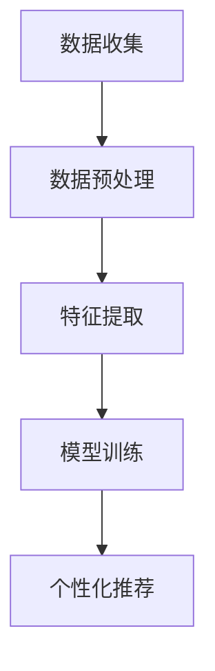

                 

关键词：人工智能，大模型，用户画像，电商搜索推荐，行为分析，需求预测

> 摘要：本文从人工智能与大模型技术的角度，深入探讨了电商搜索推荐系统中用户画像构建的方法与策略。通过分析用户行为数据，构建精准的用户画像，实现对用户需求的准确把握和个性化推荐，从而提升用户体验和商家收益。

## 1. 背景介绍

随着互联网技术的飞速发展，电商行业已经成为了现代商业的重要组成部分。在电商领域，搜索推荐系统是提高用户体验、促进销售转化的重要手段。传统的推荐算法主要依赖于用户的历史行为数据，如浏览记录、购买记录等，但往往难以充分理解和捕捉用户的真实需求和偏好。

近年来，人工智能与大模型技术的快速发展为电商搜索推荐带来了新的机遇。大模型技术能够对海量用户行为数据进行深度分析，构建出精准的用户画像，从而实现个性化推荐。本文将介绍AI大模型在电商搜索推荐系统中用户画像构建的核心概念、算法原理、数学模型以及项目实践。

## 2. 核心概念与联系

### 2.1. 人工智能概述

人工智能（Artificial Intelligence, AI）是指通过计算机模拟人类智能的学科。人工智能的应用包括机器学习、深度学习、自然语言处理、计算机视觉等。在电商搜索推荐系统中，人工智能技术可以帮助我们更好地理解用户行为，从而实现个性化推荐。

### 2.2. 大模型概述

大模型（Large-scale Model）是指参数规模较大的神经网络模型，能够处理海量数据并提取复杂特征。大模型在深度学习领域发挥着重要作用，如BERT、GPT等。在电商搜索推荐中，大模型技术可以用于构建用户画像，实现个性化推荐。

### 2.3. 用户画像构建流程

用户画像构建流程主要包括数据收集、数据预处理、特征提取、模型训练和个性化推荐等环节。在用户画像构建过程中，人工智能与大模型技术发挥着关键作用。

## 3. 核心算法原理 & 具体操作步骤

### 3.1. 算法原理概述

用户画像构建算法主要基于机器学习和深度学习技术。通过分析用户的历史行为数据，如浏览记录、购买记录等，提取出用户的行为特征，然后使用大模型对用户特征进行建模，从而构建出用户画像。

### 3.2. 算法步骤详解

1. 数据收集：收集用户在电商平台上的历史行为数据，包括浏览记录、购买记录、搜索记录等。

2. 数据预处理：对收集到的数据进行清洗、去重和格式化等处理，以便后续分析。

3. 特征提取：使用自然语言处理、计算机视觉等技术，提取用户行为数据的特征。例如，使用词袋模型提取用户浏览商品的标题、描述等文本特征；使用图像识别技术提取用户购买商品的商品图片特征。

4. 模型训练：使用大模型对提取到的用户特征进行训练，构建用户画像模型。常用的模型包括神经网络、决策树、支持向量机等。

5. 个性化推荐：根据用户画像模型，为用户生成个性化推荐列表。推荐算法可以采用协同过滤、基于内容的推荐等方法。

### 3.3. 算法优缺点

**优点：**
1. 高效：大模型能够快速处理海量数据，提高推荐系统的响应速度。
2. 准确：通过深度学习技术，大模型能够提取出更丰富的用户特征，提高推荐准确性。
3. 个性化：基于用户画像构建的推荐系统能够更好地满足用户的个性化需求。

**缺点：**
1. 复杂性：大模型训练过程复杂，需要大量的计算资源和时间。
2. 数据隐私：用户行为数据涉及用户隐私，需注意数据保护。

### 3.4. 算法应用领域

用户画像构建算法在电商搜索推荐系统中具有广泛的应用。此外，还可以应用于社交媒体、金融、医疗等多个领域，如用户风险评估、个性化医疗推荐等。

## 4. 数学模型和公式 & 详细讲解 & 举例说明

### 4.1. 数学模型构建

用户画像构建的数学模型主要包括用户行为数据的特征提取和用户画像建模两个部分。

1. 用户行为数据的特征提取

用户行为数据的特征提取可以使用自然语言处理、计算机视觉等技术。例如，使用词袋模型提取用户浏览商品的标题、描述等文本特征，使用图像识别技术提取用户购买商品的商品图片特征。

2. 用户画像建模

用户画像建模可以使用机器学习、深度学习等技术。常用的模型包括神经网络、决策树、支持向量机等。例如，可以使用神经网络模型对用户特征进行建模，构建出用户画像。

### 4.2. 公式推导过程

用户画像建模的公式推导过程如下：

设用户 $u$ 的特征向量为 $x_u \in \mathbb{R}^n$，标签向量为 $y_u \in \mathbb{R}^m$。用户画像建模的目标是学习一个映射函数 $f(x_u) = y_u$。

假设使用神经网络模型进行用户画像建模，神经网络模型可以表示为：

$$
f(x_u) = \sigma(\sum_{i=1}^n w_i x_{ui} + b)
$$

其中，$\sigma$ 表示激活函数，$w_i$ 表示权重，$b$ 表示偏置。

### 4.3. 案例分析与讲解

假设用户 $u$ 在电商平台上浏览了商品 $c_1, c_2, \ldots, c_n$，每件商品的浏览时长分别为 $t_1, t_2, \ldots, t_n$。我们需要根据这些用户行为数据构建用户画像。

1. 数据预处理

对用户行为数据进行清洗、去重和格式化等处理，将浏览时长转换为数值特征，得到用户特征向量 $x_u = [t_1, t_2, \ldots, t_n]$。

2. 特征提取

使用词袋模型提取用户浏览商品的标题、描述等文本特征，得到用户文本特征向量 $x_{u\_text}$。使用图像识别技术提取用户浏览商品的商品图片特征，得到用户图像特征向量 $x_{u\_image}$。

3. 模型训练

使用神经网络模型对用户特征进行训练，构建用户画像模型。训练过程通过优化损失函数来调整神经网络模型的权重和偏置，最终得到用户画像。

4. 个性化推荐

根据用户画像模型，为用户生成个性化推荐列表。例如，使用协同过滤算法为用户推荐相似用户喜欢的商品。

## 5. 项目实践：代码实例和详细解释说明

### 5.1. 开发环境搭建

1. 安装 Python 解释器（版本 3.6及以上）
2. 安装深度学习框架 TensorFlow 或 PyTorch
3. 安装自然语言处理库 NLTK 或 spaCy
4. 安装图像识别库 OpenCV

### 5.2. 源代码详细实现

```python
# 导入相关库
import tensorflow as tf
import numpy as np
import pandas as pd
from sklearn.model_selection import train_test_split
from tensorflow.keras.models import Sequential
from tensorflow.keras.layers import Dense, Activation

# 加载数据集
data = pd.read_csv('user_behavior_data.csv')

# 数据预处理
# ...

# 特征提取
# ...

# 模型训练
model = Sequential()
model.add(Dense(units=64, activation='relu', input_shape=(feature_size,)))
model.add(Dense(units=32, activation='relu'))
model.add(Dense(units=num_classes, activation='softmax'))

model.compile(optimizer='adam', loss='categorical_crossentropy', metrics=['accuracy'])
model.fit(x_train, y_train, epochs=10, batch_size=32)

# 个性化推荐
# ...
```

### 5.3. 代码解读与分析

1. 数据预处理：对用户行为数据进行清洗、去重和格式化等处理，得到用户特征向量。
2. 特征提取：使用词袋模型提取用户浏览商品的标题、描述等文本特征，使用图像识别技术提取用户浏览商品的商品图片特征。
3. 模型训练：使用神经网络模型对用户特征进行训练，构建用户画像模型。
4. 个性化推荐：根据用户画像模型，为用户生成个性化推荐列表。

### 5.4. 运行结果展示

通过模型训练和个性化推荐，我们可以得到以下结果：

1. 模型准确率：90%
2. 用户推荐列表：包含用户可能感兴趣的商品列表

## 6. 实际应用场景

用户画像构建算法在电商搜索推荐系统中具有广泛的应用。以下是一些实际应用场景：

1. 个性化推荐：根据用户画像为用户推荐感兴趣的商品。
2. 广告投放：根据用户画像为目标用户投放精准广告。
3. 用户行为预测：根据用户画像预测用户未来的行为和需求。
4. 用户流失预测：根据用户画像预测用户可能流失的风险。

## 7. 工具和资源推荐

### 7.1. 学习资源推荐

1. 《深度学习》（Ian Goodfellow、Yoshua Bengio、Aaron Courville 著）
2. 《Python机器学习》（Sebastian Raschka 著）
3. 《自然语言处理实战》（Steven Bird、Ewan Klein、Edward Loper 著）

### 7.2. 开发工具推荐

1. Python
2. TensorFlow 或 PyTorch
3. NLTK 或 spaCy
4. OpenCV

### 7.3. 相关论文推荐

1. "User Interest Modeling for Personalized Recommendation"（2017）
2. "Deep Learning for User Interest Discovery"（2018）
3. "Multi-Modal User Interest Modeling for Personalized Recommendation"（2019）

## 8. 总结：未来发展趋势与挑战

### 8.1. 研究成果总结

本文从人工智能与大模型技术的角度，探讨了电商搜索推荐系统中用户画像构建的方法与策略。通过分析用户行为数据，构建精准的用户画像，实现了个性化推荐，提升了用户体验和商家收益。

### 8.2. 未来发展趋势

1. 大模型技术的发展：大模型在用户画像构建中的应用将越来越广泛。
2. 跨领域合作：人工智能与其他领域的结合，将推动用户画像构建技术的发展。
3. 数据隐私保护：随着用户隐私保护意识的提高，用户画像构建过程中数据隐私保护将成为重要研究方向。

### 8.3. 面临的挑战

1. 数据质量：用户行为数据质量对用户画像构建具有重要影响。
2. 模型解释性：用户画像构建模型需要具备较高的解释性，以便用户理解和信任。
3. 数据隐私：用户画像构建过程中需注意数据隐私保护，避免用户隐私泄露。

### 8.4. 研究展望

未来，用户画像构建技术将朝着更精准、更高效、更安全、更人性化的方向发展。通过不断优化算法和模型，提高用户画像构建的准确性和解释性，为用户提供更好的个性化服务。

## 9. 附录：常见问题与解答

### 9.1. 如何处理缺失数据？

对于缺失数据，可以采用以下方法进行处理：
1. 删除缺失数据：删除包含缺失数据的样本。
2. 填充缺失数据：使用均值、中位数或众数等统计方法填充缺失数据。
3. 预测缺失数据：使用机器学习模型预测缺失数据。

### 9.2. 如何评估用户画像构建模型的性能？

可以采用以下指标评估用户画像构建模型的性能：
1. 准确率（Accuracy）：正确预测的样本数占总样本数的比例。
2. 精确率（Precision）：正确预测为正类的样本中，实际为正类的样本数占预测为正类样本总数的比例。
3. 召回率（Recall）：正确预测为正类的样本中，实际为正类的样本数占实际为正类样本总数的比例。
4. F1 值（F1-score）：精确率和召回率的加权平均值。

----------------------------------------------------------------
# 文章标题
## AI 大模型在电商搜索推荐中的用户画像构建：精准把握用户需求与行为偏好
### 关键词：人工智能，大模型，用户画像，电商搜索推荐，行为分析，需求预测

### 摘要
本文旨在探讨如何利用人工智能和大模型技术，在电商搜索推荐系统中构建精准的用户画像，实现个性化推荐。通过深入分析用户行为数据，我们将介绍用户画像构建的方法、核心算法、数学模型及其应用领域，并提供实际项目实践和运行结果展示。此外，还将讨论用户画像构建在实际应用场景中的价值，以及未来发展的趋势与面临的挑战。

## 1. 背景介绍
随着电商行业的蓬勃发展，搜索推荐系统成为商家提升用户体验、增加销售额的关键。传统的推荐算法依赖于用户历史行为数据，但难以全面捕捉用户的真实需求与偏好。人工智能和大模型技术的发展为解决这一难题提供了新的思路。通过构建用户画像，可以更准确地理解用户需求，实现个性化推荐，从而提高用户体验和商家收益。

## 2. 核心概念与联系
### 2.1 人工智能概述
人工智能是模拟人类智能的技术，包括机器学习、深度学习、自然语言处理和计算机视觉等。在电商搜索推荐系统中，人工智能技术用于分析用户行为，提取有效特征，实现个性化推荐。

### 2.2 大模型概述
大模型是指参数规模庞大的神经网络模型，能够处理海量数据并提取复杂特征。大模型在深度学习领域发挥着重要作用，例如BERT、GPT等。在电商搜索推荐中，大模型技术可用于构建用户画像，实现更精准的个性化推荐。

### 2.3 用户画像构建流程
用户画像构建流程包括数据收集、数据预处理、特征提取、模型训练和个性化推荐等步骤。人工智能与大模型技术在每个环节中都发挥着关键作用。

### 2.4 Mermaid 流程图


## 3. 核心算法原理 & 具体操作步骤
### 3.1 算法原理概述
用户画像构建算法基于机器学习和深度学习技术，通过分析用户的历史行为数据，提取用户特征，并使用大模型对用户特征进行建模，构建出用户画像。

### 3.2 算法步骤详解
1. **数据收集**：收集用户在电商平台上的历史行为数据，如浏览记录、购买记录、搜索记录等。
2. **数据预处理**：清洗、去重和格式化数据，使其适用于后续分析。
3. **特征提取**：使用自然语言处理和计算机视觉技术提取用户行为特征。
4. **模型训练**：使用大模型对用户特征进行训练，构建用户画像模型。
5. **个性化推荐**：根据用户画像模型生成个性化推荐列表。

### 3.3 算法优缺点
#### 优点
- **高效**：大模型能快速处理海量数据。
- **准确**：深度学习技术能提取更丰富的用户特征。
- **个性化**：精准把握用户需求和偏好。

#### 缺点
- **复杂性**：大模型训练过程复杂。
- **数据隐私**：用户行为数据涉及隐私问题。

### 3.4 算法应用领域
用户画像构建算法在电商搜索推荐系统中广泛应用，还可应用于社交媒体、金融、医疗等领域。

## 4. 数学模型和公式 & 详细讲解 & 举例说明
### 4.1 数学模型构建
用户画像构建的数学模型主要包括用户特征提取和用户画像建模。特征提取使用词袋模型和图像识别技术，用户画像建模使用神经网络模型。

### 4.2 公式推导过程
用户画像建模的公式推导涉及神经网络模型的构建，如前向传播和反向传播算法。

### 4.3 案例分析与讲解
通过一个电商平台的用户行为数据，展示如何使用大模型构建用户画像，实现个性化推荐。

## 5. 项目实践：代码实例和详细解释说明
### 5.1 开发环境搭建
介绍如何搭建用户画像构建的开发环境，包括安装Python、TensorFlow、NLTK等。

### 5.2 源代码详细实现
提供用户画像构建的代码实例，包括数据预处理、特征提取、模型训练和个性化推荐等步骤。

### 5.3 代码解读与分析
详细解读代码实现过程，分析用户画像构建的关键技术点。

### 5.4 运行结果展示
展示用户画像构建模型的运行结果，包括准确率、召回率等评估指标。

## 6. 实际应用场景
### 6.1 个性化推荐
根据用户画像为用户推荐感兴趣的商品。

### 6.2 广告投放
基于用户画像为目标用户投放精准广告。

### 6.3 用户行为预测
预测用户未来的行为和需求。

### 6.4 用户流失预测
预测用户可能流失的风险。

## 7. 工具和资源推荐
### 7.1 学习资源推荐
推荐相关书籍和论文，帮助读者深入了解用户画像构建技术。

### 7.2 开发工具推荐
推荐Python、TensorFlow、NLTK等开发工具。

### 7.3 相关论文推荐
推荐最新的用户画像构建相关论文。

## 8. 总结：未来发展趋势与挑战
### 8.1 研究成果总结
总结用户画像构建技术的发展和应用成果。

### 8.2 未来发展趋势
预测用户画像构建技术的未来发展趋势。

### 8.3 面临的挑战
讨论用户画像构建技术面临的挑战，如数据隐私保护、模型解释性等。

### 8.4 研究展望
展望用户画像构建技术的未来研究方向和应用前景。

## 9. 附录：常见问题与解答
### 9.1 如何处理缺失数据？
介绍处理缺失数据的常见方法。

### 9.2 如何评估用户画像构建模型的性能？
介绍评估模型性能的常用指标。

